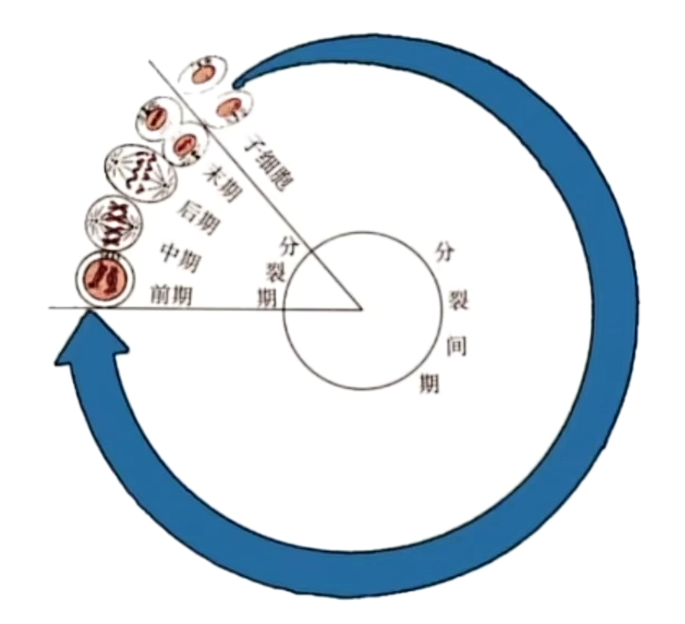
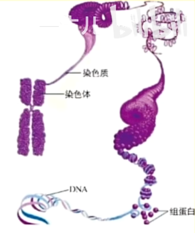
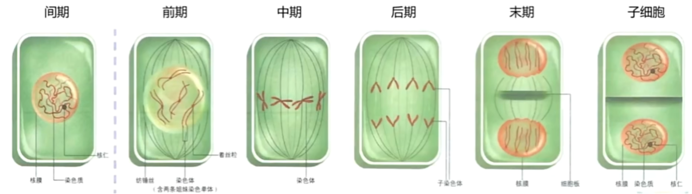
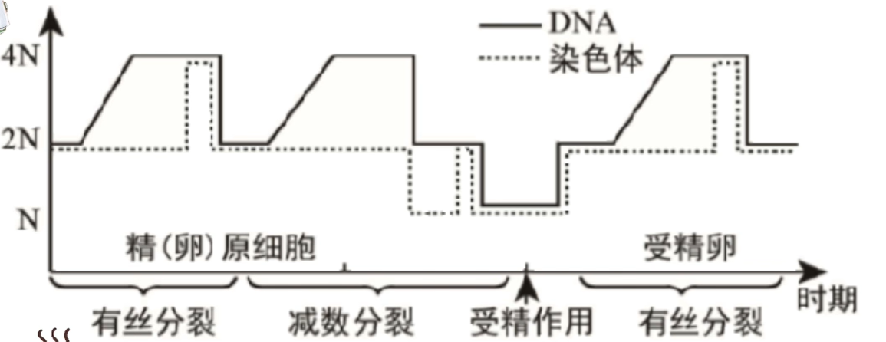
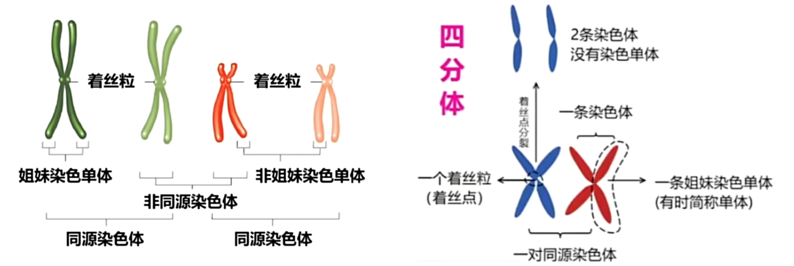
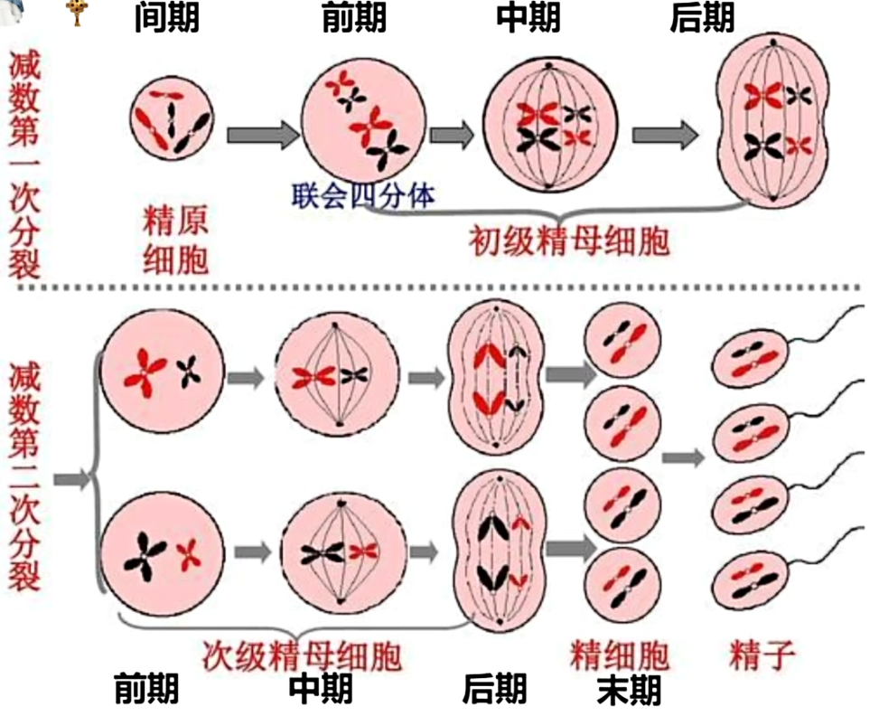
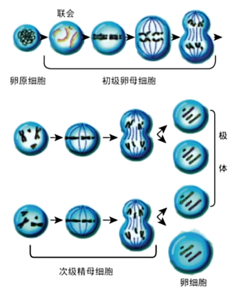
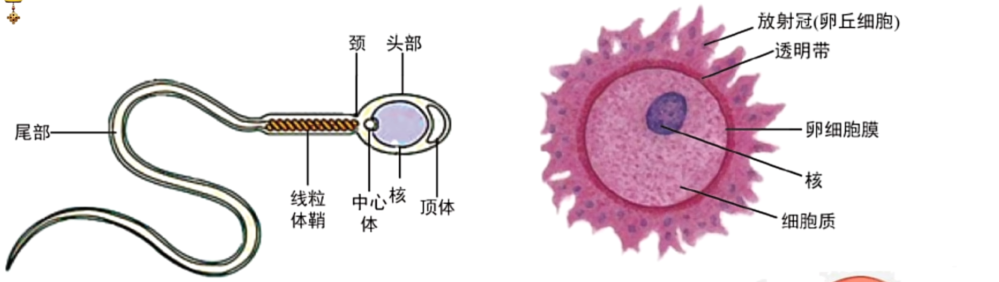
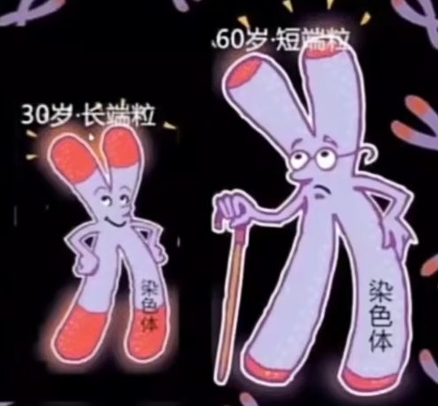

# 细胞生命历程

## 有丝分裂

生物个体中最大的细胞为卵细胞, 其中存储这供受精卵发育所需的营养物质. 细胞不能无限长大, 原因如下:

1. 受相对表面积影响. 细胞过大, 相对表面积过小, 会导致物质运输变远, 速度减慢.
2. 受细胞核限制. 细胞过大, 细胞核难以控制.

细胞不能无限长大, 故以分裂的方式进行增殖. 细胞分裂的方式有:

- 有丝分裂(真核生物体细胞, 均分遗传物质)
- 无丝分裂(蛙的红细胞等, 直接内陷缢裂, 遗传物质可能不均分)
- 减数分裂(真核生物生殖细胞, 均分遗传物质)
- 二分裂(原核生物, 不能均分遗传物质)

注意, 病毒的增殖方式是复制, 而不是分裂. 

细胞增殖一般包括物质准备与细胞分裂两个过程. 细胞增殖的意义有:

- 单细胞生物通过细胞增殖而繁衍;
- 多细胞生物从受精卵开始, 要经过细胞增殖与分化逐渐发育成成体; 
- 体内衰老死亡的细胞需要通过细胞增殖加以补充. 

因此, 细胞增殖是生物体生长, 发育, 繁殖, 遗传的基础. 

### 细胞周期

连续分裂的细胞, 从一次分裂完成开始, 到下一次分裂完成时为止, 为一个细胞周期. 注意明确细胞周期的起点与终点, 先进入分裂间期在进入分裂期, 不能改变起点与终点为开始分裂等. 且只有连续分裂的细胞存在细胞周期, 如受精卵, 根尖分生区细胞, 茎的形成层细胞, 皮肤生发层细胞, 干细胞, 癌细胞等; 像表皮细胞, 上皮细胞, 心肌细胞, 神经细胞, 精细胞, 卵细胞等终端分化细胞不会连续分裂, 无细胞周期. 

细胞周期可分为两个阶段: 

1. 分裂间期, 占比约 $90\% \sim 95\%$ , 细胞适度生长, $DNA$ 复制, 有关蛋白质合成, 包含:
   1. $G_1$ 期, 合成 $DNA$ 复制相关蛋白质; 
   2. $S$ 期, $DNA$ 复制; 
   3. $G_2$ 期, 合成分裂期相关蛋白质. 
3. 分裂期( $M$ 期), 进行分裂.

真核细胞中, $DNA$ 以染色质的形式存在, 其由组蛋白与 $DNA$ 缠绕形成, 如下图. 染色质高度螺旋化形成染色体. 染色质(体)中心部位存在着丝粒, 纺锤丝会附着在着丝粒上牵引染色体. 染色质与着丝粒的数目相等, 故染色体分裂需要着丝粒分裂. 

$DNA$ 的复制实际上为染色质的变化. 染色质由线状结构变为 "X" 状结构, 即两条(姐妹)染色单体通过一个着丝粒相连的结构, 每条单体上存在一个 $DNA$ 分子. 此过程中染色体数没有加倍, 因为着丝粒并没有分裂. 

实际上, 通过观察染色体性状并不完全准确. 因为有些着丝粒并不位于染色体中段, 而是位于端点处, 看起来与一条无单体的染色体十分相似. 故最准确的方法还是根据分裂时期进行判断. 

上图为高等植物体细胞(低等植物存在中心体, 与此不同)增殖过程. 高等植物的有丝分裂分裂期可以分为以下阶段:

1. 前期: 膜仁消失现两体. 在前期, 核膜与核仁消失; 染色质高度螺旋化变为染色体; 细胞两极发出纺锤丝附着于着丝粒上, 形成纺锤体. 所有分裂前期染色体特点为散乱排布, "前期散乱", 有些题目要求通过图片判断时期.
2. 中期: 形数清晰赤道齐. 在中期, 纺锤器牵引着丝粒将染色体整齐地排布在赤道板上. 赤道板不真实存在, 是一个细胞中间部位的位置. 由于排列整齐, 故中期便于观察染色体数目, 这也是所有中期染色体的特点, 即"中期居中".
3. 后期: 姐妹分开均两极. 在后期, 着丝粒分裂, 一条 "X" 状的染色体分裂为两条线形的染色体, 染色单体消失(只有 "X" 形状中的一支才能称为染色单体), 经纺锤丝牵引至细胞两极. 后期染色体不存在单体, 分离移向两极. 所有的后期都符合"后期分离". 
4. 末期: 两消两现重开始. 在末期, 染色体解旋变回染色质; 纺锤体消失; 核膜与核仁重新出现; 植物细胞赤道板位置出现细胞板. 注意, 细胞板会发育成新的细胞壁, 其由高尔基体分泌组成物质(果胶和纤维素), 是真实存在的结构.

动物细胞有丝分裂过程与高等植物细胞类似, 染色体数目, 行为, 形态变化与植物相同. 不过存在以下不同点: 

- 动物细胞有中心体辅助有丝分裂. 其由一对垂直的中心粒与周围蛋白质构成, 在间期完成复制.
- 动物细胞使用星射线, 由移向两极的两个中心体发出星射线形成纺锤体. 注意, 星射线是纺锤丝的一种, 纺锤丝仅描述功能, 而非特指植物使用的. 星射线与纺锤丝均由蛋白质(微丝微管蛋白)构成.
- 动物细胞不会形成细胞板, 而是在赤道板处, 由蛋白质构成的收缩环收缩, 使细胞内陷, 将细胞缢裂为两个子细胞.

有丝分裂如此复杂, 具有以下意义: 

- 将亲代细胞的染色体经过复制后, 精确地平均分配到两个子细胞中去; 
- 由于染色体上有遗传物质 DNA , 因而在生物的亲代和子代之间保持了遗传性状的稳定性. 

上图为一个分裂相关的折线图. 这类折线图中一般来说只有 $DNA$ 复制会出现斜线, 其余的着丝粒分裂, 细胞一分为二与受精作用等均为竖直起落的线. 单体是唯一可能 **不存在** 的一项, 但只要存在就 **必定等于** DNA 数目. 后面会与减数分裂, 受精作用等联合考察, 但只要把握好过程就十分简单. 

4N 的染色体只会出现在有丝分裂后期, 是特殊标志. 

## 减数分裂

人体细胞含有 23 对( 46 条)染色体, 如图为人体细胞染色体核型图, 展示了染色体组的形态:

一对中的两条染色体互为同源染色体, 其一来自于母亲, 另一来自于父亲. 其中 22 对为常染色体, 1 对为性染色体, 有 X 与 Y 两种. X 与 Y 存在形态与功能差异, 但也为同源染色体. 男性的性染色体为 XY , 女性为 XX . 

人由受精卵发育而来, 受精卵(合子)有精子与卵子(配子)结合形成. 合子中有 23 对染色体, 故单个配子中仅有 23 条染色体, 才能保证受精卵染色体数目的正确性. 

染色体组指细胞中一组非同源的染色体, 它们在形态和功能上各不相同, 但共同携带着控制生物生长发育的全部遗传信息. 有多少组染色体组, 就称为几倍体. 特别地, 若生物直接由配子发育而来, 则称为单倍体, 不论是否仅有一组染色体组. 

多数生物为二倍体生物, 但自然界中也存在单倍体(蜂的雄虫等)与多倍体(三倍体无籽西瓜, 香蕉; 四倍体马铃薯; 六倍体小麦等). 对于二倍体生物, 其配子仅含有一组染色体组才能保证正常形成后代. 

由此, 我们可以使用 $N$ 来表示每组染色体组含有多少染色体. 譬如, 对于人类体细胞, 符合 $2N = 46$ , 即代表人类体细胞含有两组染色体组, 共 $46$ 条染色体. 

减数分裂是有性生殖的生物, 在产生成熟生殖细胞(配子)时进行的染色体数目减半的细胞分裂. 在减数分裂前, 染色体复制一次, 而细胞在减数分裂过程中连续分裂两次. 

减数分裂发生在睾丸或精巢, 卵巢中. 

如图为雄性配子经减数分裂产生的过程. 减数分裂分为两个阶段: 

1. 减数第一次分裂(减数分裂 $I$ ):
   1. 前期: 同源染色体(图中同样大小不同颜色的染色体)联会形成四分体. 一个四分体中含有 4 条单体, 4 个 DNA, 2 条染色体. 在联会时, 同源染色体的非姐妹染色单体间小概率发生部分片段交换的现象, 称为(交叉)互换.
   2. 中期: 同源染色体排列在赤道板两侧.
   3. 后期: 同源染色体分裂, 非同源染色体自由组合. 前期时的互换与后期的自由组合均为基因重组. 
   4. 末期(减数分裂 $II$ 前期): 初级精母细胞分裂, 形成两个次级精母细胞. 
2. 减数第二次分裂(减数分裂 $II$ ): 过程与有丝分裂相似, 不同点在于减数分裂 $II$ 中无同源染色体(需要借此区分题目中给出的图片), 但这不影响染色体的行为. 

一个精原细胞一次减数分裂能够产生 4 个(两种, 不考虑互换与突变, 且对于任意一条染色体, 其同源染色体一定在另一种精细胞中而不再同种精细胞中, 即若用大写字母与小写字母表示同源染色体, $Ab\dots$ 的精细胞对应的另一种一定为 $aB\dots$ )精细胞. 在完成减数分裂后, 一次减数分裂形成的 4 个精细胞形变为精子. 但人(无限多的精原细胞)在不考虑互换与突变的情况下, 一共能产生 $2^{23}$ 种精子, 因为对于每组同源染色体需要从两个中选其一放入精子. 故做题时要注意究竟是一个还是一种细胞. 

总结来说, 减 $I$ 分同源, 减 $II$ 分姐妹. 

卵细胞与精细胞形成过程类似, 不同点在于, 为增加卵细胞中的营养物质, 雌性减数分裂采取不均等分裂, 一次仅产生一枚卵细胞. 一般来说, 具体地, 减数分裂 $I$ 中, 初级卵母细胞分裂为次级卵母细胞与第一极体, 第一极体较次级卵母细胞小; 减数分裂 $II$ 中, 次级卵母细胞分裂为卵细胞与第二极体, 第一极体均等分裂为两个第二极体, 第二极体较卵细胞小. 所有极体会被弃置, 卵细胞参与受精作用. 

特殊地, 对于人类等大多数哺乳动物, 第一极体并不分裂, 故最终一个卵原细胞产生一个卵细胞, 一个第一极体与一个第二极体. 第一极体与第二极体均被弃置. 

## 受精作用

如图为精子与卵细胞. 

精子的顶体由高尔基体变形而成, 其中含有水解酶帮助精子进入卵细胞. 中心体发射微丝微管蛋白形成精子的尾部. 线粒体鞘为尾部的摆动功能. 细胞质会在移动的过程中丢失, 故受精卵中无精子的细胞质基因, 受精卵细胞质全部来自于卵细胞. 

卵细胞膜又称卵黄膜. 卵子胞在卵巢中发育并被输卵管伞扫入输卵管, 并在其中发育至 $M II$ 期(减数分裂 $II$ 中期, 故图示可能有误, 不应存在细胞核), 等待精子与之在输卵管中受精. 受精完成后才完成剩余的减数分裂过程. 

异卵双胞胎由 2 个卵细胞与 2 个精子分别受精而成, 他们不共享相同的遗传物质; 同卵双胞胎由 1 个卵细胞与 1 个精子受精形成, 在胚胎发育过程中错误地分裂为两个独立的胚胎, 故他们的遗传物质相同. 

受精过程大致分为以下几步:

1. 精子获能;
2. 精卵细胞相互识别(细胞间信息交流);
3. 顶体反应: 释放水解酶;
4. 透明带反应: 防止多精入卵的第一道屏障;
5. 卵细胞膜反应: 防止多精入卵的第二道屏障;
6. 精卵细胞核融合: 精子头部进入卵细胞, 尾部留在外面. 注意此过程并不是自由组合, 自由组合指的是减数分裂 $I$ 后期同源染色体的自由组合. 

具体可以参考 [受精作用(超链接待完善)]() .

减数分裂与受精作用对生物的遗传与变异意义重大:

1. 遗传的稳定性: 维持了前后代体细胞中染色体数目恒定.
2. 遗传的多样性:
   1. 配子的多样性; 
   2. 个体的多样性.

## 细胞分化

在个体发育中, 由一个或一种细胞增殖产生的后代, 在形态, 结构和生理功能上发生稳定性差异的过程就是细胞分化. 

细胞分化的实质是基因的选择性表达. 细胞中仍然存在对应的基因, 只是不表达出相关的蛋白质. 向呼吸相关的基因等, 个体内所有细胞均表达, 这些基因称为管家基因. 如胰岛素基因等选择性表达的基因, 则称为奢侈基因. 

细胞分化导致了细胞中部分蛋白质种类不同, 进而导致细胞形态, 结构与生理功能发生变化, 形成不同类型的细胞, 进而形成不同的组织与器官. 高度分化的细胞失去分裂能力. 

细胞分化在生物界中普遍存在, 但单细胞生物不可细胞分化. 细胞分化贯穿于生物体整个细胞历程中, 胚胎时期分化最旺盛. 一般来说, 分化后的细胞将一直保持分化后的状态, 除非对离体细胞使用特殊手段进行[脱分化(超链接待完善)](). 

细胞分化的意义: 

1. 细胞分化是生物个体发育的基础;
2. 使多细胞生物体中细胞趋向专门化, 有利于提高各种生理功能的效率.

细胞的全能性指, 细胞(经过分裂和分化后)具有产生完整机体或分化成其他各种细胞的潜能和特性. 细胞具有全能性的原因为, 细胞含有该生物全部遗传信息. 

注意, 只有细胞具有全部遗传信息即具有全能性, 但表现出全能性的标准为其能发育成完整个体或分化成各种细胞, 二者需要区分. 

生物的生长发育过程中, 细胞并不表现出全能性, 而是分化为各种组织和器官. 一般来说, 细胞分化程度越高, 全能性越低; 受精卵全能性高于生殖细胞, 生殖细胞全能性高于体细胞; 植物体细胞全能性大于动物体细胞. 

## 细胞衰老

细胞衰老的特征有: 

- 染色质收缩, 加深;
- 细胞核体积变大, 核膜内折;
- 多种酶活性降低(不是所有酶), 细胞呼吸速率减慢, 新陈代谢速率减慢;
- 细胞膜通透性改变, 物质运输功能降低;
- 细胞内水分减少, 细胞萎缩, 体积减小;
- 色素逐渐积累(黑色素除外), 妨碍细胞内物质交流与传递.

对于单细胞生物, 细胞的衰老与死亡与个体的衰老与死亡是同步的; 对于多细胞生物, 体内的细胞总是不断地更新, 总有一部分细胞处于衰老或走向死亡的状态, 但个体衰老的过程也是组成个体的细胞普遍衰老的过程. 

对于细胞衰老, 有以下两种主流假说:

- 自由基假说: 细胞代谢会不断产生大量的自由基, 空气污染, 辐射, 某些化学物质也可加快自由基的产生. 自由基会攻击和破坏细胞内的各种分子, 如攻击磷脂分子会产生更多自由基, 从而导致雪崩式反应, 同时会改变膜的通透性, 损伤溶酶体; 攻击 DNA 导致基因突变; 攻击蛋白质导致蛋白质活性下降等.
- 端粒假说: 每条染色体两端都有一段特殊地 DNA 序列, 称为端粒, 对染色体具有保护作用. 在体细胞染色体复制过程中端粒不能完整复制, 因此 DNA 每复制一次, 端粒就缩短一段, 最终正常基因的 DNA 序列收到损伤, 从而影响细胞的生理活动, 引起细胞的衰老甚至死亡.

  

## 细胞死亡

细胞死亡分为细胞凋亡与细胞坏死两种. 

### 细胞凋亡

由基因所决定的细胞自动结束生命的过程, 叫做细胞凋亡. 细胞凋亡是细胞程序性死亡, 是正常的良性生理变化. 凋亡相关基因被激活后, 细胞启动凋亡程序, 随后被吞噬细胞所吞噬. 故其不释放细胞内容物, 无炎症反应. 

### 细胞坏死

细胞坏死是由于病理性变化或剧烈损伤所引起的, 大片组织或成群细胞的破裂死亡. 其被动发生, 受外界电, 热, 冷, 机械, 缺氧, 病菌感染, 毒物毒害等因素影响. 坏死后, 细胞内容物被释放, 从而引发炎症反应. 

## 细胞自噬

细胞自噬是指将受损或功能退化的细胞器等细胞结构, 通过溶酶体讲解后再利用. 营养缺乏的细胞会通过细胞自噬获得物质与能量; 细胞自噬也可清理受损或衰老的细胞器, 以及感染的微生物与毒素, 从而维持细胞内部环境的稳定. 激烈的细胞自噬会诱导细胞凋亡.