# 生态

## 种群

在一定自然区域内, 同种生物的全部个体形成种群. 种群是物种存在的具体形式, 同一物种在不同区域可以有多个种群, 但一个种群内个体一定属于同一物种. 种群是进化的单位. 

种群在单位面积或单位体积中的个体数称为种群密度. 种群密度是种群最基本的数量特征. 种群密度反应了种群在一定时期的数量. 

出生率, 死亡率, 迁入率与迁出率指, 在单位时间内, 新产生或死亡或迁入或迁出的个体占该种群个体总数的比率. 它们是决定种群大小和种群密度的重要因素, 直接影响着种群密度的变化. 

年龄组成是指一个种群中各年龄期个体数目的比例. 其可以用于预测种群数量的变化趋势. 具体来说, 如图, 若年龄组成为增长型(出生率 > 死亡率), 则种群数量会在一段时间内增加; 若年龄组成为稳定型(出生率 $\approx$ 死亡率), 则种群数量会维持稳定; 若年龄组成为衰退型(出生率 < 死亡率), 则种群数量会在一段时间内减少. 由此可知, 年龄组成通过影响出生率与死亡率间接影响种群数量的变化. 

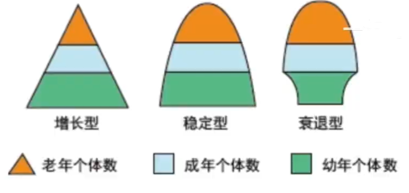

性别比例指种群中雌雄个体数目的比例. 性别比例可以通过影响出生率间接影响种群密度. 例如, 可以使用性引诱剂诱杀某种害虫的雄性个体, 破坏害虫种群的正常性别比例, 降低出生率, 使种群密度明显降低. 

### J 形曲线

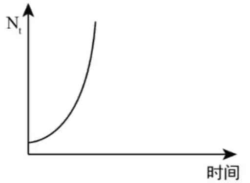

若环境资源无限(无环境阻力), 即食物和空间条件充裕, 气候适宜, 没有天敌和其他竞争物种时, 种群数量增长符合 J 形曲线, 如图. 实际上 J 形曲线反应了指数型增长过程, 假设种群起始数量为 $N_0$, 每代子代数量为亲代的 $\lambda$ 倍, 那么 $t$ 代后种群数量为: $N_t = N_0 \cdot \lambda^t$. 

很显然, 此时种群持续加速增长, 且无 K 值(环境容纳量, 即一定的环境条件所能维持的最大种群数量, 随环境的变化而变化), 因此时环境资源无限. 不难发现, J 形曲线是一个十分理想化的模型, 只可能发生在实验条件下的种群增长, 或种群迁入新的环境中最初的一段时间内的增长(大致符合, 如物种入侵等). 

增长率指单位时间内新增加的个体数占原有个体总数的比率; 增长速率指单位时间内新增加的个体数. 注意, J 或 S 形图像的斜率代表增长速率而不是增长率. 

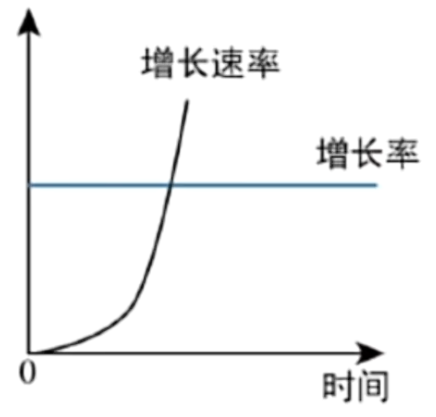

上图为 J 形曲线的增长率与增长速率曲线. 注意, J 形曲线的增长速率与 J 形曲线的区别在于, 其从原点开始; J 形曲线的增长率是定值 $\lambda - 1$ (比较容易推到, 请读者自行推导, 如果 $\lambda = 1$, 则增长率 = 0 , 无增长; 若 $\lambda > 1$, 则增长率 > 0, 正增长; 若 $\lambda < 1$, 则增长率 < 0 , 负增长(减少)).

在 J 形曲线中, 死亡率为零. 

### S 形曲线

与 J 形曲线相比, S 形曲线更符合一般自然界中种群数量的变化趋势, 因其前提条件为环境资源有限(有环境阻力). 高斯曾做过草履虫在一定量的培养液中数量变化的实验, 发现符合 S 形曲线. 

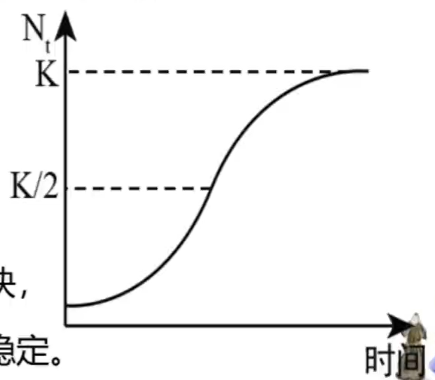

如图, 符合 S 形曲线的种群数量先加速增长, 直到种群数量达到 $\frac{K}{2}$ 时达到最大增长速度; 此后开始减速增长, 直到 $K$ 值停止增长并保持相对稳定(在 $K$ 值上下浮动, 图示仅为抽象出的模型). 

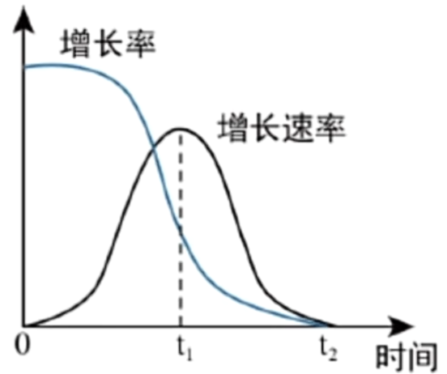

上图为 S 形曲线的增长率与增长速率曲线. 由图也可知, 在 $\frac{K}{2}$ 处时增长速率最快; 在 $K$ 处时增长速度减为 $0$. 

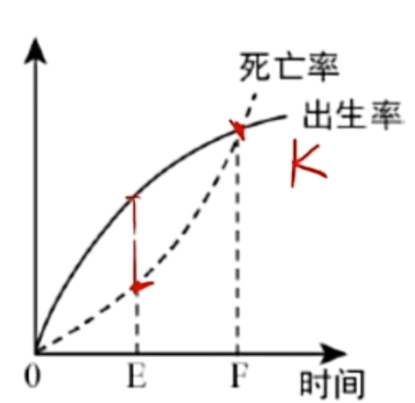

如图展示了 S 形曲线的出生率与死亡率, 在 E 点处, 出生率 - 死亡率最大, 故增长速率最大, 为 $\frac{K}{2}$ 值处; 在 F 处, 出生率 - 死亡率为零, 故增长速率为零, 为 K 值处. 

下图展示了 J 形曲线和 S 形曲线的区别. 

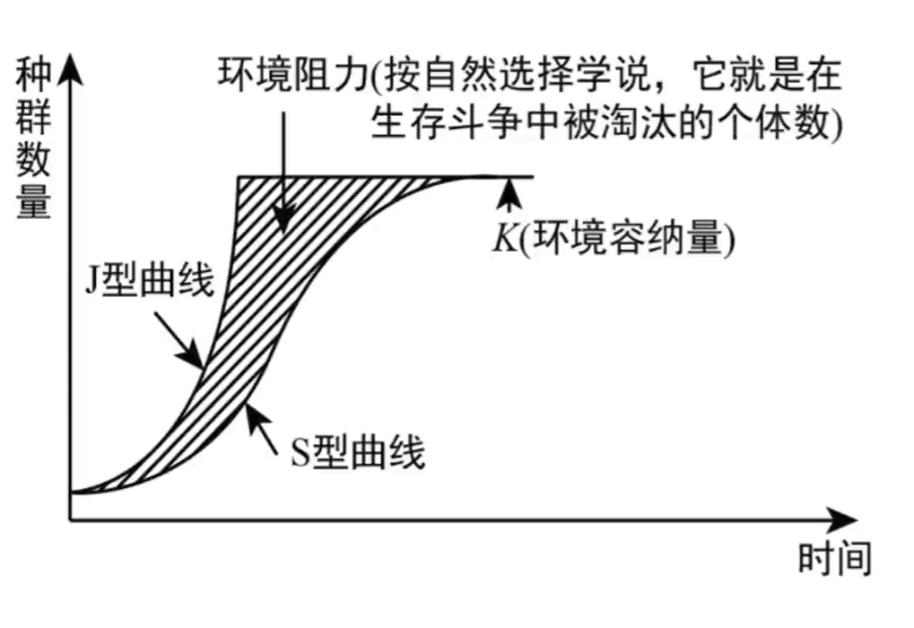

其中阴影部分代表了环境阻力, 即在生存斗争中被淘汰的个体数. 

使种群数量变化的原因可能有: 

- 非生物因素: 阳光, 温度, 水等; 
- 生物因素: 
    - 种群内部: 种内竞争; 
    - 种群外部: 种间竞争, 捕食, 寄生等. 

我们借助种群数量变化的规律进行野生生物资源的合理利用与保护, 有害生物的防治, 指导人工养殖及种植业中合理控制种群数量, 适时捕捞, 采伐等, 也可科学控制世界人口增长, 解决环境危机. 

对于保护野生资源, 我们需要减小环境阻力, 增大 K 值; 防治有害生物, 需要增大环境阻力, 减小 K 值; 草原最大载畜量不超过 K 值以保护草场. 当然, 也可以合理利用 $\frac{K}{2}$ 值: 渔业捕捞过后种群数量应在 $\frac{K}{2}$ 左右, 以获得最大增长速度; 应严防有害生物数量达到 $\frac{K}{2}$ , 以免泛滥难以控制. 

### 种群数量的调查方法

#### 直接计数法

对于个体较大, 或数量较少的种群, 直接计数法是一种简单, 直观的方法. 

#### 样方法

对于双子叶植物(单子叶植物往往为丛生或蔓生, 在地上部分很难分辨株数)或活动范围小, 活动能力弱的动物, 可以选用样方法. 

对于样方的选取, 要保证: 

1. 随机取样; 
2. 选取合理的样方大小, 如对于乔木可以选择 $100 m^2$ , 对于灌木可以选择 $16 m^2$ 或 $25 m^2$ , 对于草本植物可以选择 $1 m^2$ . 

然后, 依据调查区域的特征选择五点取样法或等距取样法. 若调查区域较为宽阔, 一般选用五点取样法; 若调查区域较为狭窄, 如河流沿岸等, 则选用等距取样法. 最后, 进行计数并计算种群密度估计值 = 各样方种群密度平均值, 样方的种群密度 = 样方内目标物种的数量 / 样方面积. 对于样方内目标物种的数量的计数, 要保证对于边界上: 计上不计下, 计左不计右. 

#### 标记重捕法

对于活动能力强, 活动范围大的动物, 选用标记重捕法. 

首先, 捕捉 M 只目标种群内的个体, 然后放回后, 等待一段时间, 使其混匀, 再重新捕捉 n 只个体, 若其中被标记过的个体数为 m, 则种群数量估计值为 $N = \frac{Mn}{m}$. 即总是满足 $\frac{M}{N} = \frac{m}{n}$ , 被标记个体占比不变. 

标记重捕法的误差大小, 与标记方式有很大的关系. 标记应满足不易脱落, 不显眼(防止增加被天敌发现的概率), 不伤害个体, 不影响个体正常生活等条件. 同时, 重捕时要注意随机捕捉, 不能专门捕捉带有标记的个体. 

对于标记重捕法的误差分析, 根据公式推断即可. 如被捕捉过一次并被标记的个体更难捕捉到第二次, 因为动物对被捕建立了一定的条件反射, 会避免被再次捕捉到. 所以此时 M, n 不变, m 减小, 则 N 会偏大. 若标记脱落, 同样地 N, n 不变, m 减小, N 偏大. 

注意, 算得的 N 为种群数量, 若要计算种群密度, 还需除以调查区域的面积, 一定不要忘记. 

#### 抽样检测法(血球计数法)

我们可以对酵母菌等微生物使用抽样检测法以估计其种群密度. 

#### 其他调查方法

如黑光灯诱捕法, 可以对趋光性的昆虫进行诱捕并计数(注意黑光灯不是无光); 红外相机观测, 粪便分析, 检测声音特征等方法可以对濒危或大型凶猛, 难以接近的野生动物进行数量检测. 

总之, 调查方法要尽可能实现非损伤, 低干扰甚至无干扰. 

## 群落

相同时间聚集在一定地域中各种生物种群(即全部生物, 包括所有的动物, 植物, 微生物)的集合叫做群落. 

物种组成是群落最重要的特征, 也是区别不同群落的重要特征. 可以使用群落的丰富度, 即一个群落中的物种数目, 来进行衡量. 因为不同群落的丰富度不同, 一般来说越靠近热带地区, 单位面积内物种越多. 

群落的优势种(对群落结构和形成有明显控制作用的**植物**)也是群落的特征之一. 优势种通常个体数量多, 对群落影响大, 生物量高(生物量为在某一时刻, 单位面积内某种生物体的干重总量), 投影盖度大, 体积较大, 生活能力强. 

### 群落类型

三大群落类型包括: 

- 荒漠生物群落. 沙砾裸露, 植被极度稀疏, 通常分布在极度干旱区, 降水稀少, 物种少, 群落结构非常简单. 生物具有耐干旱特性, 体现了生物与环境相适应的规律. 
- 草原生物群落. 以耐寒的旱生多年生草本植物占优势, 有少量灌木, 通常分布在半干旱区, 降水不均匀, 物种少, 群落结构相对简单. 植物往往叶片狭窄, 表面有茸毛或蜡质层, 抵抗干旱; 动物大都具有挖洞或快速奔跑的特点. 
- 森林生物群落. 树木繁茂, 树冠遮天蔽日, 通常分布在湿润或较湿润地区, 群落结构非常复杂且相对稳定. 

当然, 除了以上的生物群落, 还有许多对于生态非常重要的群落, 如海洋群落, 湿地群落, 湖泊群落, 农田群落, 城市群落等. 

### 种间关系

#### 捕食关系

一种生物以另一种生物作为食物, 称为捕食关系. 包括食肉, 食草. 

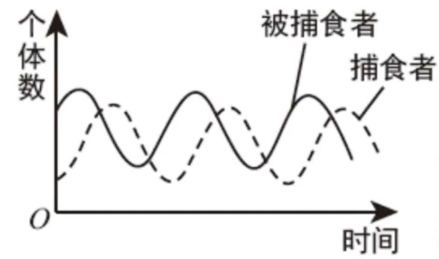

由于在食物链中, 能量逐级递减, 所以捕食者的数量通常少于被捕食者的数量, 故可以看曲线中(峰值)数量较多的生物即为被捕食者(但也存在特例, 如蚜虫与树木的捕食关系). 或者, 你也可以通过变化趋势来判断, 数量先变化的为被捕食者, 捕食者随之变化(所以波峰一般不对着波谷, 与种间竞争区分). 

#### 竞争关系

竞争关系分为种内竞争与种间竞争. 实际上, 对于符合 S 形曲线增长的培养皿中的草履虫, 若后期不予以适当的营养与空间补充, 则草履虫最终会走向消亡, 其中包括种内竞争的因素. 

种间竞争又分为"你死我活"型与"此消彼长"型. 如图 2 就展示了大小两种草履虫之间的竞争关系, 其中大草履虫最终衰亡, 因其繁殖能力较小草履虫差距大. 而图 1 所展示的狮子与斑鬣狗的竞争曲线则不会导致其中一种的消亡, 而是体现为数量波动, 且一种的波峰对应另一种的波谷. 实际上, "此消彼长"型也不一定表现为个体数相当, 如图 3 , 二者数量差距分化后趋于稳定. 

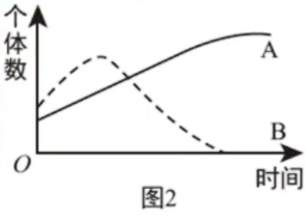
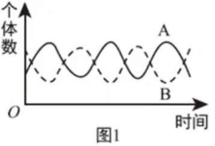
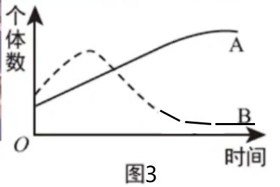

种间竞争实际上是生态位重叠所致. 生态位指, 一个物种在群落中的地位或作用, 包括所处的空间位置, 占用资源的情况, 以及与其他物种的关系等. 若生态位重叠越大, 则竞争越大. 竞争的一般结果是, 通过自然选择实现生态位的分化, 进而实现共存. 但由于生物具有过度繁殖的倾向, 故生态位不可能完全没有重叠, 所以竞争一般不会完全消失. 

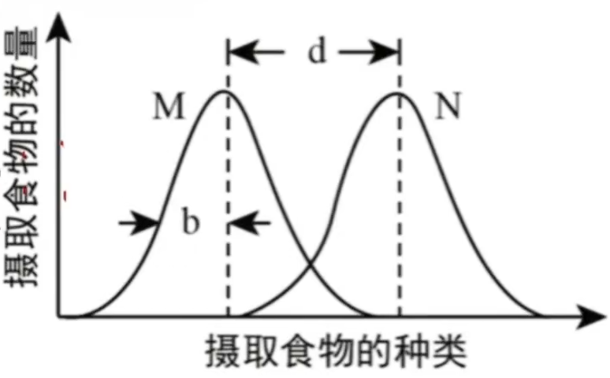

如图为生态位的直观示意图, 若 d 越小, 则代表两物种间竞争越激烈; 若 b 越小, 则代表种间竞争越激烈. 

群落中每种生物都占据着相对稳定的生态位, 这有利于不同生物充分利用环境资源, 是群落中物种之间及生物与环境间协同进化的结果. 

#### 寄生关系

寄生指寄生者从宿主的体液, 组织或已消化的物质中获取营养并通常对宿主产生危害的行为. 如病毒一般营寄生生活寄生与宿主细胞内; 人的消化道内可能寄生有蛔虫; 菟丝子作为植物, 也会寄生于其他植物体上, 吸取营养物质(其极少含叶绿体, 极难进行光合作用; 菟丝子是作为植物但却是捕食者的特例). 

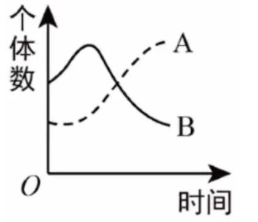

如图, 由于 B 下降, A 上升, 所以可以判定 A 为寄生者, B 为宿主. 

#### 互利共生

互利共生的主要特征为, 两种生物共同生活在一起, 同生共死. 如岩石上的地衣是光合藻类和真菌的共生体, 藻类负责制造有机物, 真菌负责吸收水和无机盐; 豆科植物与根瘤菌也是互利共生的关系, 植物为根瘤菌提供有机养料, 根瘤菌可以固氮, 为植物提供氮源. 

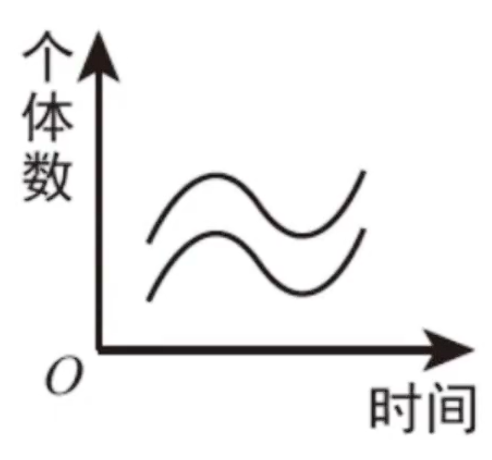

#### 原始合作

原始合作关系中, 两种生物生活在一起时, 双方受益; 分开后也能独立生活. 注意区分, 互利共生关系的双方在分开后极难存活. 

如海葵与寄居蟹, 海葵为寄居蟹提供保护, 而寄居蟹的移动功能可以为海葵提供更多食物; 但它们分开后仍然能正常生存. 

### 空间结构

在垂直方向上, 大多数群落具有明显的分层现象, 这体现了群落的垂直结构. 对于陆生群落, 光照, 温度等因素可能会影响群落的垂直结构; 对于海洋群落, 光照, 温度, 溶解氧等因素可能会影响群落的垂直结构. 对于动物而言, 相比起以上因素, 栖息场所与食物更能影响它们的垂直结构. 

在水平方向上, 群落通常镶嵌分布, 这是群落水平结构的一大特点: 不同地段往往分布着不同的种群, 同一地段上种群密度也有差别. 水平结构可能受到地形, 土壤湿度与盐碱度, 光照强度, 生物自身的生长特点以及人和动物的影响等因素的影响. 

请注意, 垂直结构特指某一位置(点)上的空间结构. 所以, 如图, 对于从山脚至山峰中群落发生的变化, 以及水域不同深度的群落变化, 不属于群落的垂直结构, 甚至不能说它们属于同一群落. 

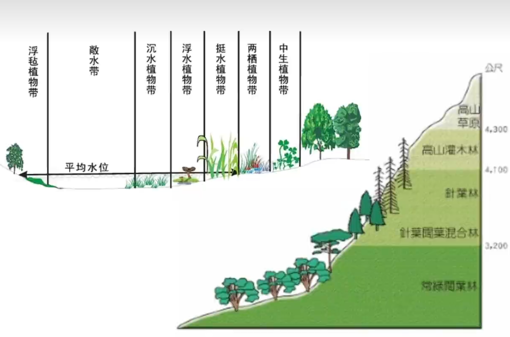

### 群落演替

群落演替指, 随着时间推移, 一个群落被另一个群落替代的过程. 分为初生演替与次生演替. 

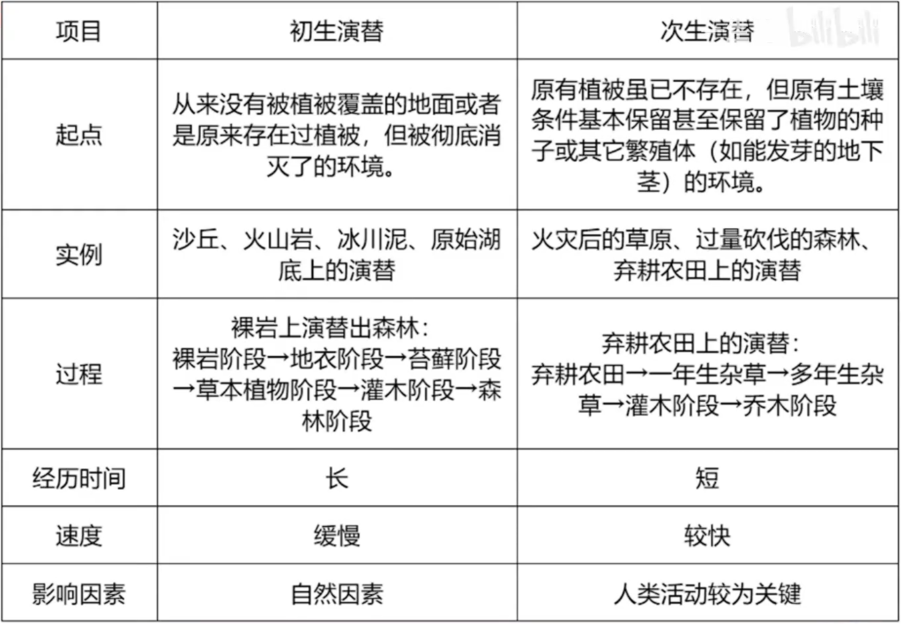

人类可以影响演替的方向与速度. 除此之外, 群落演替的一般趋势为, 物种多样性增加, 结构复杂程度增加, 自我调节能力增强, 稳定性增强, 环境资源利用率提高. 当一个群落演替到与当地气候与土壤条件处于平衡状态时, 演替不再进行. 此时, 群落的结构最复杂也最稳定, 称为顶级群落. 注意, 不是所有顶级群落都为森林. 

### 土壤小动物丰富度调查

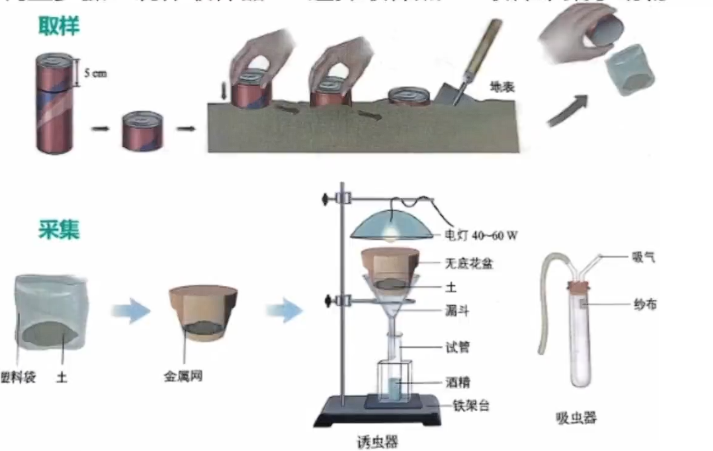

可以使用取样器取样法, 如图. 对于最后的采集, 可以使用诱虫器, 其中电灯可以发光发热模拟太阳, 以利用土壤小动物的趋阴性, 将其诱导进入酒精, 而酒精可以将其杀死; 也可以直接使用吸虫器将土壤中的动物吸入试管中. 

若需要统计数量, 则可以使用记名计算法(直接计数), 或目测估计法(主观性较强, 将数量多少分为非常多, 多, 较多, 较少, 少, 非常少六个等级)

样方法也可以用于丰富度调查, 但对于土壤小动物, 其活动能力较强, 无法使用. 

## 生态系统

在一定空间内, 由生物群落与它的非生物环境相互作用而形成的统一的整体被称作生态系统. 地球上最大的生态系统是生物圈. 

一个完整的生态系统包括: 

- 非生物的物质和能量, 如阳光, 热能, 水, 空气, 无机盐等. 非生物的物质和能量是生态系统的必备成分, 可以为生物提供物质和能量, 是生物群落赖以生存和发展的基础. 
- 生产者, 即自养生物(自养生物一定是生产者, 生产者也一定是自养生物), 将无机物转化为有机物以储存能量, 主要为绿色植物或自养型微生物. 注意, 不是所有生产者都是绿色植物, 如蓝细菌, 硝化细菌等; 也不是所有植物都是生产者, 如菟丝子, 猪笼草(猪笼草与捕蝇草既是生产者也是消费者)等. 生产者是生态系统的基石(主要成分), 它们可以合成有机物, 储存能量; 并为消费者提供食物与栖息场所. 
- 消费者, 属于异养生物, 包含营捕食生活和寄生生活的各种生物. 消费者作为生态系统中最活跃的成分, 可以加快生态系统的物质循环, 也可以帮助植物完成传粉和种子传播. 但是, 若缺失消费者, 生态系统的基本功能仍然可以进行(但其仍具有独特的意义, 故下文说"生态系统各组分缺一不可"). 
- 分解者, 属于异养生物, 可以将有机物分解为小分子的有机物或无机物并返还至无机环境, 包含营腐生生活的微生物及腐食性动物(如蚯蚓, 蜣螂, 秃鹫等, 所以动物不都是消费者, 分解者也不都是细菌和真菌). 注意, 不是所有细菌都是分解者, 如蓝细菌与硝化细菌属于生产者, 营寄生生活的细菌属于消费者. 分解者是完成物质循环的关键成分, 可以将动植物遗体和动物排遗物分解成无机物, 供生产者重新利用. 

生态系统各组分紧密联系, 缺一不可, 使生态系统成为一个统一整体, 具有一定的结构与功能. 

### 食物链

在生态系统中, 各种生物之间由于食物关系而形成的一种联系, 即为食物链. 实际上, 除捕食食物链外, 还存在腐生链, 寄生链等, 但在高中阶段不予考虑. 如草 $\to$ 昆虫 $\to$ 青蛙 $\to$ 蛇就是一条食物链. 可以发现, 食物链一定从生产者开始, 至终极消费者(顶级捕食者)结束, 不包含分解者(属于腐生链)与非生物的物质和能量. 所以, 我们可以分别称草, 昆虫, 青蛙, 蛇为第一营养剂, 第二营养级, 第三营养级与最高营养级(或第四营养级). 一般来说, 我们将处于第二营养级的植食动物称为初级消费者, 处于第三营养级的肉食动物(或杂食动物)称为次级消费者, 处于第四营养级的消费者称为三级消费者, 以此类推. 

在生态系统中, 许多食物链彼此相互交错连接成的复杂营养结构称为食物网. 在其中, 同一消费者可以占据不同食物链的不同营养级, 且两种生物的中间关系有可能不单一, 如同时存在捕食关系与种间竞争关系等. 

### 能量流动

生态系统中能量的输入, 传递, 转化和散失的过程, 称为生态系统的能量流动. 生态系统所需的能量最终来源于太阳能. 绿色植物通过光合作用将太阳能转化为化学能储存在有机物中, 使太阳能输入到生态系统中, 这是能量流动的起点. 生产者所固定的太阳能的总量, 就是流经这个生态系统的总能量. 

能量在生态系统中沿食物链与食物网以有机物中化学能的形式进行传递. 林德曼对天然湖泊赛达伯格湖的能量流动进行了定量分析, 得出以下结果:

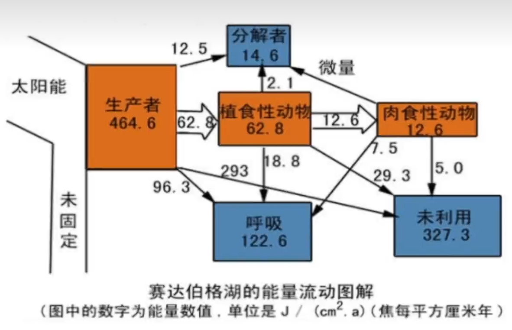

图中的箭头代表同化或消耗的能量数值. 其中未利用的能量是指(暂时)未被自身呼吸作用消耗, 也未被后一个营养级和分解者利用的能量. 由此可知, 能量的去路可能包括: 

- 用于生长, 发育, 繁殖等生命活动, 可以细分为: 
    - 呼吸作用消耗; 
    - 流向下一营养级(最高营养级除外, 且注意是下一营养级的同化量而非摄入量, 因为粪便量属于当前营养级流向分解者的能量); 
    - 暂时未利用; 
- 流向分解者. 

需要注意的是, 对于消费者, 摄入量并不等于同化量, 因为食物不可能完全消化吸收. 但摄入量 = 同化量 + 粪便量总是成立. 其中粪便量仍然属于上一营养级的能量, 因其还未被消化吸收(同化), 且粪便中的能量最终会流向分解者. 

实际上, 任何生态系统都需要不断地得到来自系统外的能量补充, 以便维持生态系统的正常功能. 这很大程度上是因为呼吸作用所散失的热能很难再被利用, 且食物链为单向, 捕食关系不可逆, 所以, 能量流动符合单向流动, 逐级递减的特点. 注意, 虽然生态系统中物质可以循环, 可能无需外界补充, 但能量不能循环. 

逐级递减的具体表现为, 能量在相邻两个营养级之间的传递效率(即 $\frac{当前营养级的同化量}{上一营养级的同化量} \times 100\%$ )大约在 10% ~ 20% 间. 所以, 在一个生态系统中, 营养级越多, 在能量流动过程中消耗的能量就越多. 故生态系统中能量流动一般不超过 5 个营养级. 缩短食物链不会提高能量传递效率, 这与捕食者消化吸收的能力有关, 但可以提高能量利用率, 减少呼吸作用的能量消耗. 

若需要对食物链中能量的消耗最值或获得最值进行分析, 考虑选取对应的食物链与能量传递效率的相应最值(10% 为最小值, 20% 为最大值)即可. 具体地, 若需要求最少消耗, 则需要选取最短的食物链以及最高的能量传递效率(20%), 以减少能量损耗, 反之亦然; 若要使某一生物获得最多能量则需要减少能量损耗, 故与前面做出相同操作. 在此过程中, 要善用未知数来简化比例运算. 

### 生态金字塔

常见的有三种: 

- 能量金字塔. 按照营养级自低向高依次从金字塔底向上堆叠, 营养级别越低, 占有的能量就越多. 在自然条件下, 能量金字塔不会倒置(上宽下窄, 正置为上窄下宽); 除非在人工生态系统中, 进行饲料投喂等能量补充, 可能会造成能量金字塔倒置. 
- 生物量金字塔. 某营养级的生物量即某营养级的总干重. 在陆地生态系统中, 生物量金字塔一般不会倒置. (对于海洋生态系统, 由于浮游植物个体小生命短等原因通常会导致生物量金字塔倒置)
- 生物数量金字塔. 这种金字塔倒置现象比较常见, 如昆虫捕食树木, 昆虫的数量一般大于树木. 

### 物质循环

组成生物体的C, H, O, N, P, S 等元素, 都不断进行着从非生物环境到生物群落, 又从生物群落到非生物环境的过程, 这称为生态系统的物质循环. 

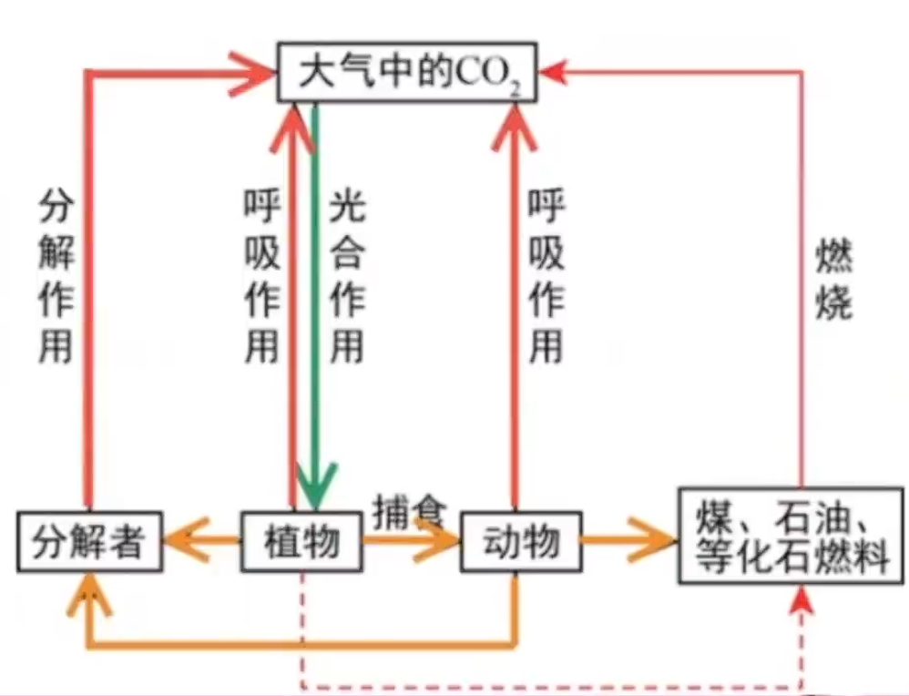

实际上, 海洋是碳循环中重要的组成部分, 其既可以吸收 $CO_2$ , 又可以释放 $CO_2$ . 

为实现碳中和, 我们仍然可以通过来源于去路两个方面进行考虑: 

- 减少 $CO_2$ 排放: 
    - 减少化石燃料燃烧; 
    - 开发新能源; 
- 增加 $CO_2$ 固定: 
    - 植树造林. 

物质循环的特点有: 

- 全球性. 因此又称为生物地球化学循环. 
- 循环性. 物质可以被生物群落反复利用. 

所以, 长期放牧会导致无机盐等物质进入人类而不返还草场, 导致物质无法再草场中循环利用, 故草场会逐渐退化. 若将粪便或肥料反还草场, 或将枯枝败叶置于草场, 则只需等待微生物的分解作用, 即可将这些物质重新利用. 

能量流动与物质循环的联系如下: 

- 能量流动和物质循环是生态系统的主要功能, 二者同时进行. 彼此相互依存, 不可分割. 
- 能量的固定, 储存, 转移和释放, 都离不开物质的合成和分解等过程. 物质是能量的载体, 能量是物质在生态系统中往复循环的动力. 
- 生态系统各组成成分, 通过能量流动和物质循环, 紧密联系在一起, 形成一个统一的整体. 

二者的区别有: 

- 形式: 能量流动以有机物为载体; 而物质循环以有机物与无机物的形式流动. 
- 范围: 能量流动只在生态系统各营养级中发生; 而物质循环在整个生物圈中发生(具有全球性). 
- 特点: 能量流动符合单向流动, 逐级递减; 而物质循环符合反复利用, 循环流动. 

生物富集指, 生物体从周围环境吸收, 积蓄某种元素或难以降解的化合物, 使其在集体内浓度超过环境浓度的现象. 一般, Pb, Hg, DDT, 六六六($C_6H_6Cl_6$), 微塑料等重金属元素或杀虫剂等物质常发生生物富集现象, 会随着食物链逐渐累积, 含量逐渐提供, 并最终积累至食物链的顶端, 即人类. 

有时, 我们需要根据不同组分之间的物质或能量流动关系, 来确定图中字母表示的组分. 如图, 所有生物均会进行呼吸作用, 故非生物的物质和能量一定为被所有组分所指向的 D ; 双箭头的一侧是非生物的物质与环境 D, 另一侧是生产者 A; 然后对于其他的组分进行简单推断即可得出 B 是消费者, C 是分解者. 

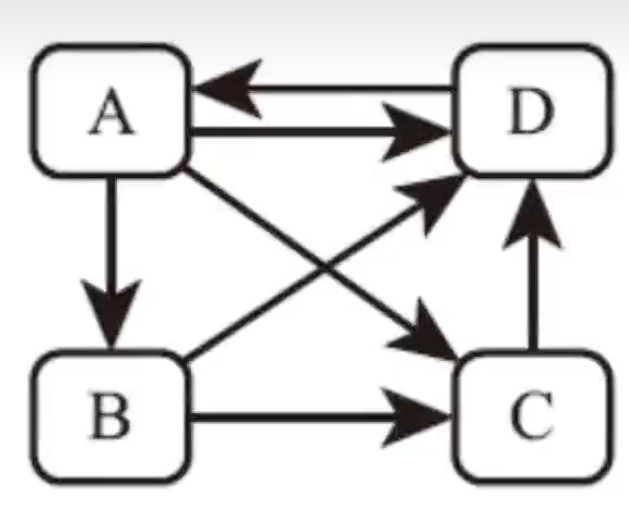

### 信息传递

生态系统中信息的种类有: 

- 物理信息, 如光, 声, 温度, 磁力等, 通过物理过程传递的信息. 
- 化学信息, 如植物的生物碱, 有机酸, 动物的性外激素等, 生物在生命活动过程中产生的可以传递信息的化学物质. 
- 行为信息, 如蜜蜂跳舞, 孔雀开屏等动作(动物的特殊行为). 

信息传递在生态系统中的作用有: 

- 利于个体生命活动的正常进行; 
- 利于种群的繁衍; 
- 调节种间关系, 维持生态系统稳定. 

信息传递具有双向性. 在生物与生物之间, 以及生物与环境之间, 均存在信息传递. 环境可以给予生物一定的信号, 而生物也可以改变环境. 特殊地, 环境无法做出动作, 故无法传递行为信息给生物, 但可以传递物理与化学信息. 

### 生态系统的稳定性

在生态系统受到干扰时, 若干扰不超过生态系统的自我调节能力的限度, 生态系统就可以自我调节以维持生态系统结构和功能的相对稳定, 即生态平衡. 

生态平衡具体表现为结构平衡, 功能平衡与收支平衡. 结构平衡即生态系统各组分稳定; 功能平衡即物质循环与能量流动正常进行; 收支平衡即生产者固定与所有生物消耗的相对稳定. 

生态系统的稳定性指的是生态系统维持或恢复自身结构与功能处于相对平衡状态的能力. 其分为抵抗力稳定性, 即保持原状的能力, 与恢复力稳定性, 即破坏后恢复原状的能力. 

如图, 两种抵抗力一般呈现负相关关系, 因为营养结构简单时, 平衡较易被破坏, 但恢复起来更容易; 反之, 营养结构复杂时, 平衡较难被破坏, 但恢复起来更难. 但是, 如荒漠, 苔原等生态系统, 较易被破坏, 且由于环境非常恶劣, 其恢复也十分困难, 故两种稳定性都很差. 

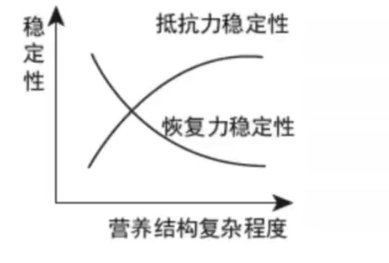

如下图, 若施加同等强度的干扰, y 越大者, 受干扰程度更大, 功能丧失更多, 抵抗力稳定性越弱; x 越大者, 恢复所需的时间越长, 恢复力稳定性越弱. 

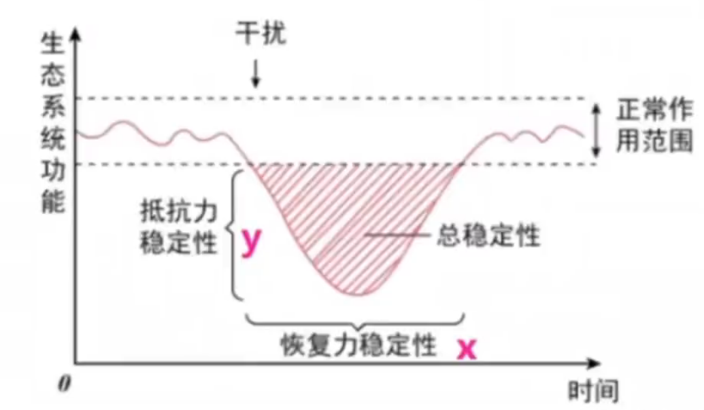

生态系统之所以可以维持相对稳定, 是因为生态系统具有自我调节能力, 而这种能力是由负反馈调节实现的. 例如, 在食物链中, 捕食者数量增加会导致被捕食者数量减少, 但一段时间后由于缺少食物捕食者数量会减少, 从而导致被捕食者数量增加; 森林火灾(非人为)是因为随着森林茂密程度的增加, 枯枝败叶增多, 增加火灾风险, 同时较矮的植物由于无法接收到足够的阳光导致难以生长, 若发生火灾, 阳光变得充足, 土壤无机养料增多, 土壤中保存的种子与幼苗可以萌发, 迅速增长, 使森林恢复原来的状态. 

实际上, 在激素调节的学习中, 我们已经接触过反馈调节. 在生态系统中也存在相应的正反馈调节, 如严重砍伐, 过度放牧, 污水大量排放, 物种入侵等, 会引起生态系统不断恶化. 

所以, 要维持生态平衡, 就要: 

- 控制对生态系统的干扰, 使其不超过生态系统的自我调节能力, 合理利用生态系统; 
- 利用强度大生态系统, 应对的给予相应物质能量投入, 保证生态系统内部结构与功能协调. 

我们在上文介绍负反馈调节时已经渗透过食物链中生物数量变化的分析思路, 但对于复杂的食物网来说, 如此分析具有一定的局限性. 首先, 这里明确分析的前提, 即生产者数量相对稳定, 且分析的仅是平衡破坏后被影响生物的短期数量变化(对于长期来说, 生态系统具有稳定性, 各生物数量趋于维持相对稳定). 

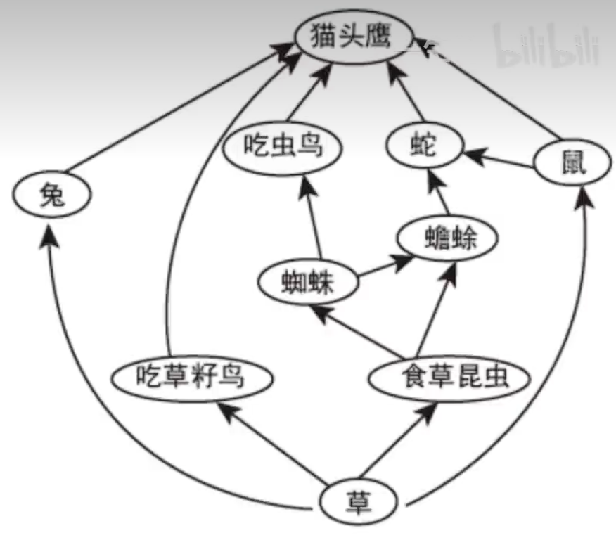

对于食物减少后, 捕食者的分析, 根据能量递减效应, 即营养级越高, 对应营养级所含有的能量总量越低, 生物个体数越少. 所以, 应该分析分析对象的营养级变化, 而不是单纯通过一条食物链进行分析. 如图, 通过数营养级可知, 蛇同时属于第三, 四, 五三个营养级. 若鼠突然大量死亡, 则蛇在短时间内整体营养级升高, 因为含有鼠的食物链所对应的第三营养级成分被削弱(可以极限地认为蛇在鼠大量死亡后仅属于第四, 第五两个营养级), 故蛇的数量会减少. 

对于非捕食关系的生物数量分析, 可以考虑营养替补效应, 即当某种生物的消亡所带来的营养损失可以被其他种生物所替补时, 替补生物种类越多, 对该种生物的影响越小, 而替补生物将会下降. 同样以鼠大量减少为例, 猫头鹰从包含鼠的食物链所获取到的能量减少, 其就会更多地从其他三个食物链获取能量, 故兔, 食虫鸟, 蛇的数量会下降, 而猫头鹰的数量由于能量被替补生物所替补而维持基本稳定. 当然, 在分析时要遵循就近原则, 即一般来说, 在食物网中关系越近, 造成的影响就越大. 

## 人与环境

生态足迹, 又称生态占用, 是指在现有的技术条件下, 维持某一人口单位生存所需的生成资源和吸纳废物的土地及水域面积. 若生态承载力总量大于生态足迹总量时表现为生态盈余; 反之表现为生态赤字. 

碳足迹表示扣除海洋对碳的吸收量之后, 吸收化石燃料燃烧排放的二氧化碳等所需的森林面积. 

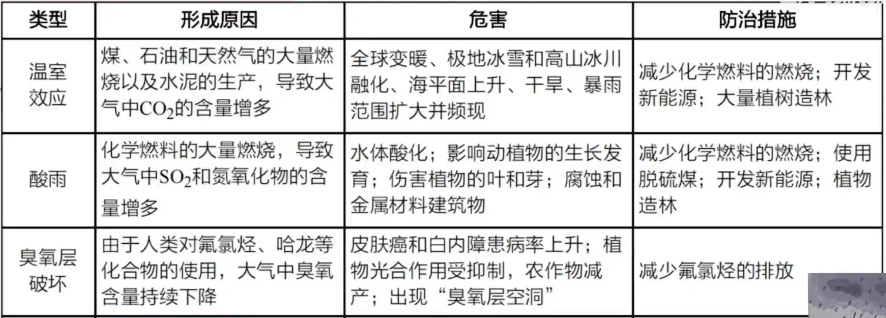
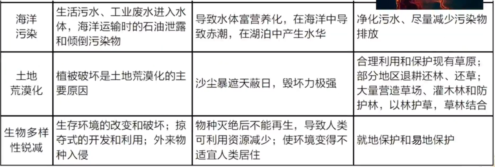

以上是常见的环境污染类型. 这里对水体富营养化进行详细讲解. 水体富营养化指的是水体中 N, P 等植物必须的矿质元素含量过多, 导致藻类植物等大量繁殖, 并引起水质恶化和鱼群死亡的现象. 

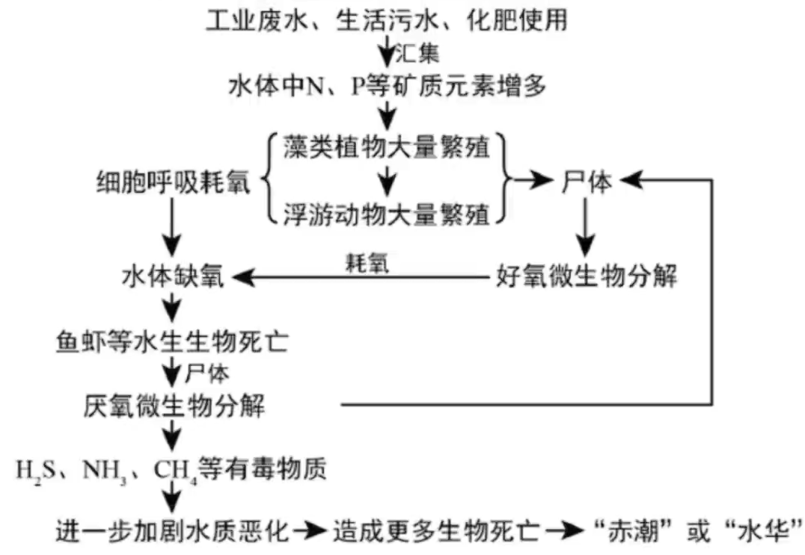

生物多样性由生物圈内所有的植物, 动物和微生物所拥有的全部基因以及各种各样的生态系统所构成. 基因多样性可以分为三个层次: 

- 基因(遗传)多样性, 其结果为: 
    - 分子水平: DNA 分子多样性, 进而决定蛋白质多样性; 
    - 细胞水平: 细胞形态和结构多样性; 
    - 个体水平: 性状的多样性; 
- 物种多样性, 在基因多样性的基础上通过隔离所得到, 是生物多样性最直观的表现; 
- 生态系统多样性, 由物种多样性组成, 是生物多样性的宏观表现. 

三种多样性密切相连, 基因多样性是形成物种多样性和生态系统多样性的基础, 反过来物种多样性和生态系统多样性又影响基因多样性. 

生物多样性的价值可以分为直接价值, 间接价值与潜在价值. 直接价值指对人类有食用, 要用和工业原料等实用意义的, 以及具有旅游观赏, 科学研究和文学艺术创作等非实用意义的价值; 而间接价值指对生态系统起到重要调节功能的价值, 也叫生态功能, 实际上生态系统中任何物种都有其生存功能; 潜在价值是指目前人类尚不清楚的价值, 即对大量野生生物的使用价值还未发现, 未研究, 未开发利用的部分. 总的来说, 直接价值是对于人类来说的价值; 而间接价值是对于生态来说的价值, 进而对人类产生价值; 潜在价值只是还未被人类发现, 发现后可以属于直接价值或间接价值. 

生态多样性丧失的主要原因是人类对野生物种生存环境的破坏和掠夺式利用. 我们可以采取如下措施进行保护: 

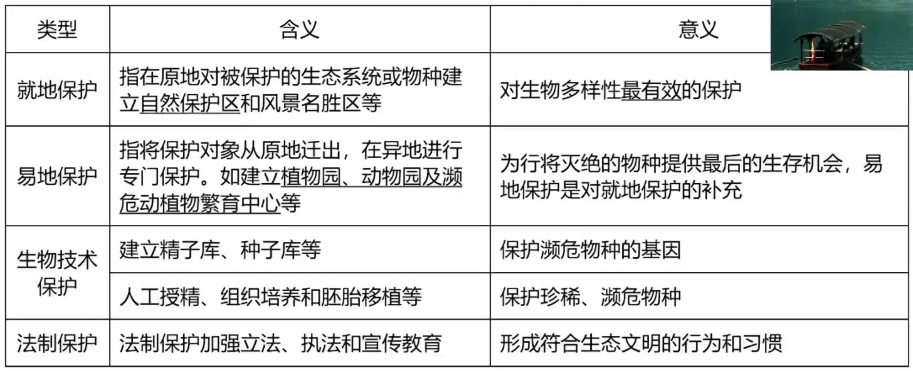

生态工程是人类应用生态学和系统学等学科的基本原理和方法, 对人工生态系统进行分析, 设计和调控, 或对已破坏的生态环境进行修复, 重建, 从而提高生态系统的生产力或改善生态环境, 促进人类社会和自然环境的和谐发展的系统工程技术或综合工艺过程. 与传统工程相比, 生态工程是一类少消耗, 多效益, 可可持续的工程体系. 

其基本原理包括: 

- 自生, 即在生态系统中产生的自组织, 自我优化, 自我调节, 自我更新和维持. 其需要再生态工程中有效选择生物组分并合理布设. 
- 循环, 即在生态工程中促进系统的物质迁移与转化, 既保证各个环节的物质迁移顺畅, 也保证主要物质或元素的转化率较高. 其理论基础为生态系统的物质循环. 
- 协调, 即生物与生物, 生物与环境的协调与适应. 想要处理好生物与环境的协调与平衡, 需要考虑环境容纳量. 
- 整体, 即遵从自然生态系统的规律, 各组分之间要有适当的比例, 不同组分之间应构成有序的结构, 通过改变和优化结构, 达到改善系统功能的目的; 人类处在一个社会一经济一自然复合而成的巨大系统中. 其理论基础为社会一经济一自然复合系统, 在进行生态工程建设时, 不但要考虑自然生态系统的规律, 更重要的是, 还要考虑到经济和社会等系统的影响力. 只有应用整体性原理, 才能统一协调当前与长远, 局部与整体, 开发建设与环境保护之间的关系, 保障生态系统的平衡和稳定. 

大家可以自行阅读以下生态工程实例. 

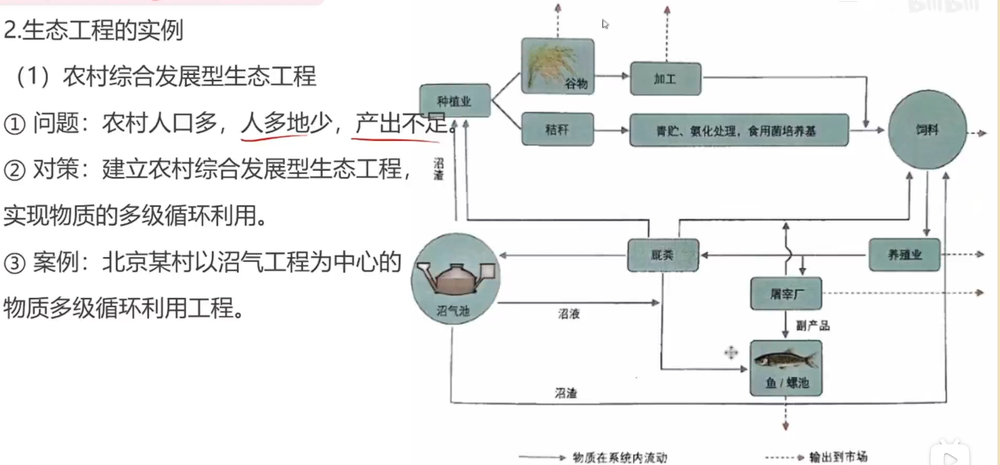
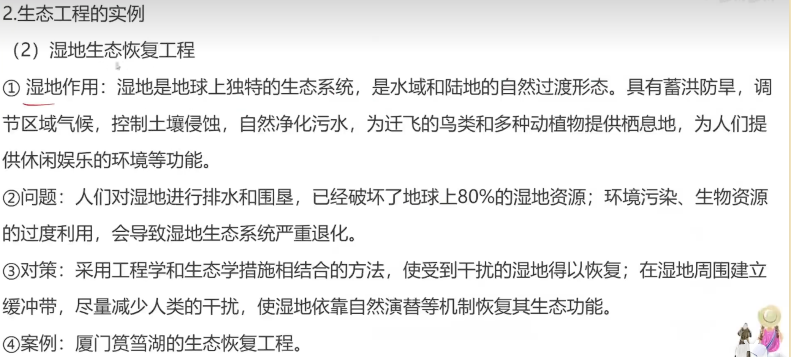
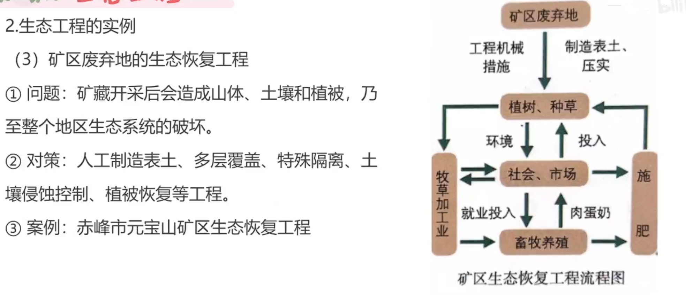

生态工程的特点有, 既注重对生态环境的保护, 也注重经济, 社会效益的结合. 