# 细胞代谢

## 酶

探究历程:

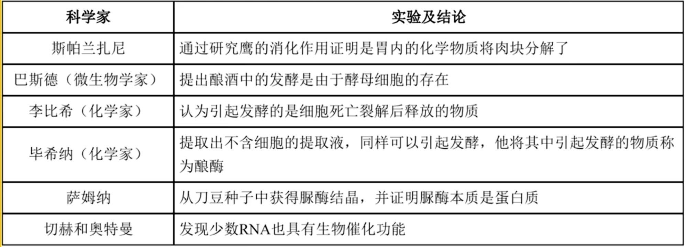

(注: 新教材奥特曼可能修改为奥尔特曼. )

酶是活细胞产生(无法通过摄食获取)的具有催化作用(不参与反应)的有机物. 绝大多数酶是蛋白质, 少部分为 $RNA$ . 酶可以降低反应所需的活化能从而催化反应, 但酶本身不提供能量. 酶作为催化剂只加快反应速率, 不改变平衡状态和产物的量. 

酶在生物体内外均可作用, 活细胞都可产生酶, 具有高效性, 专一性(特定酶催化特定反应), 作用条件温和(否则失活). 

### 酶特性探究实验

实验原则: 
1. 单一变量原则: 控制变量, 变量分为自变量, 因变量, 以及无关变量. 要控制无关变量各组一致.
2. 对照原则: 对照试验中, 除自变量以外, 其他无关变量不人为改变保持一致, 自变量为自然状态下的为对照组, 否则为实验组, 对比对照组与实验组之间因变量的差异.

酶的高效性体现在它的催化效率大约是无机催化剂的 $10^7 \sim 10^{13}$ 倍. 

酶的专一性体现在其只能催化一种或一类化学反应, 通过底物与酶的活性部位相结合催化底物转化为产物, 而活性部位的结合位点限制了与酶结合的底物类型.  

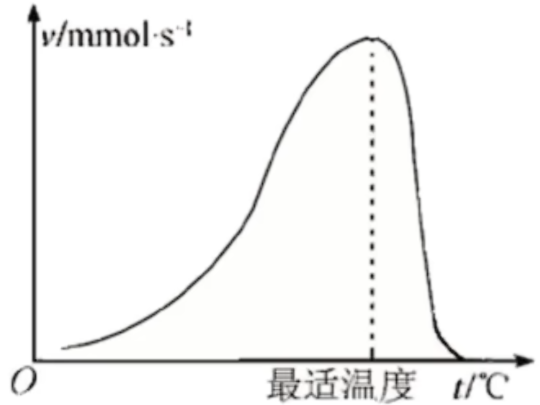

与蛋白质变性类似地, 温度降低化学反应速率下降, 但酶不失活, 升高温度仍然可以恢复; 但温度升高酶逐渐变性, 再次降低温度无法恢复催化作用. 动物体内酶的最适温度大约在 $35 \sim 40^\circ C$ 左右, 植物在 $40 \sim 50^\circ C$ 左右. 保存酶制剂适于在低温($0 \sim 4^\circ C$)保存. 

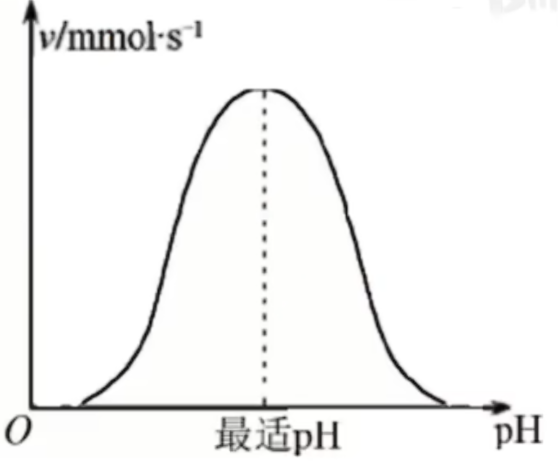

过酸与过碱环境与高温一致, 会使酶失活, 不可逆. 各种酶的最适酸碱度差异较大, 如胃蛋白酶可以低至 $1.5$ , 胰蛋白酶高至 $8.0 \sim 9.0$ . 

缓冲液可以保证溶液酸碱度($pH$)在一定限度内不发生改变. 

酶的抑制剂: 酶的抑制剂分为可逆型与不可逆型, 不可逆型抑制剂与酶的结合位点结合后不再分离, 阻止酶与底物的结合; 可逆型抑制剂分为两种: 
1. 竞争型抑制剂: 与底物竞争结合位点从而阻碍酶与底物的结合.
2. 非竞争型抑制剂: 通过改变酶的结合位点从而阻止酶与底物的结合.

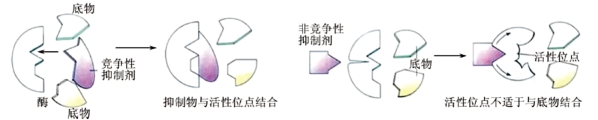

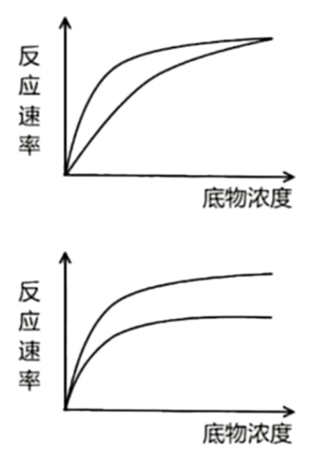

第一幅图为竞争型抑制剂, 在底物浓度足够大时, 竞争型抑制剂竞争不过底物; 第二幅图为非竞争型抑制剂, 其与酶一旦结合, 酶上的结合位点形态发生改变, 不再有底物可以与之结合, 故即便底物足够多, 也不再提升反应速率. 

## $ATP$

$ATP$ , 即腺苷三磷酸, 结构简式为 $A - P \sim P \sim P$ , 详细如下. 

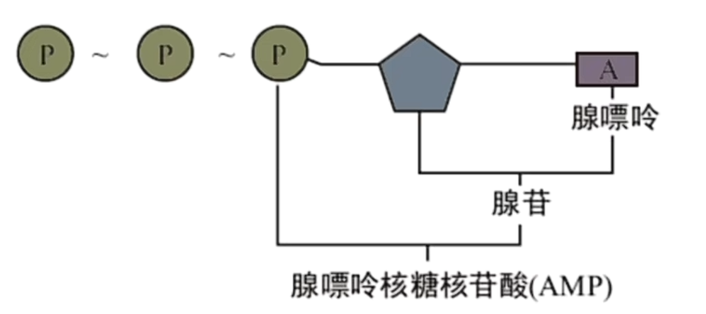

$ATP$ 中 $A$ 代表腺苷, $T$ 代表三($tri-$)($D$ 代表二($di-$), $ADP$; $M$ 代表一($mono-$), $AMP$,), $P$ 代表磷酸基团, $\sim$ 代表高能磷酸键. 

可以发现, $AMP$ 即腺嘌呤核糖核苷酸. 当然, 也有其他含氮碱基所对应的 $TTP, CDP, GMP, UTP$ 等. 

$ATP$ 的特点: 
1. 高能量: 高能磷酸键水解时释放很多能量
2. 不稳定性: 化学性质不稳定, 远端的高能磷酸键易水解

$ATP$ 三个磷酸基团的水解顺序为由远端至近端, 逐个水解. $ATP$ 为生命活动直接提供能量(葡萄糖等为间接提供能量), 是细胞内流通能量的"货币". 

$ATP$ 的水解和合成: 
$ATP \xrightarrow[\quad]{酶} ADP + Pi + 能量$ ,其中 $Pi$ 为磷酸基团, 释放的能量可以用于各项生命活动.   
$ADP + Pi + 能量 \xrightarrow[\quad]{酶} ATP$, 能量用以形成高能磷酸键, 其中的能量对于异养生物来说来自于呼吸作用所释放的能量, 对于自养生物来说在除呼吸作用之外, 还可以来自于光合作用所利用的光能或化能合成作用所利用的化学能. 

以上两个反应不是可逆反应, 所需要酶的类型不同(一个是 $ATP$ 合成酶一个是 $ATP$ 水解酶), 且场所与能量来源也不同. $ATP$ 与 $ADP$ 的含量很少, 但相互转化非常迅速. 

$ATP$ 所释放的能量可以为主动运输功能:   
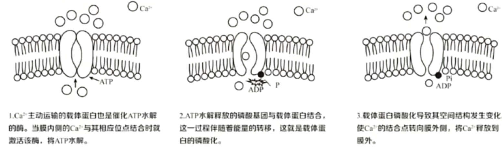  

囊泡的移动也需要能量.

## 细胞呼吸

细胞呼吸/呼吸作用: 有机物在细胞内氧化分解, 生成二氧化碳或其他产物, 释放出能量与 $ATP$ . 

此过程需要酶的参与, 在温和的条件下发生, 能量被逐步释放, 但不剧烈发光发热. 

细胞呼吸分为有氧呼吸与无氧呼吸, 有氧呼吸为大多数细胞的呼吸方式. 

意义:
1. 提供能量.
2. 维持体温. 
3. 为其他物质的合成提供原料.

### 有氧呼吸

细胞在氧气的参与下, 通过多种酶的催化作用, 把葡萄糖等有机物彻底氧化分解产生二氧化碳和水, 释放能量和大量 $ATP$ 的过程. 

#### 第一步

第一步(葡萄糖分解, 糖酵解)发生在细胞质基质, 葡萄糖( $C_6H_{12}O_6$ )氧化分解为两个丙酮酸( $2 \times C_3H_4O_3$ )与四个还原氢( $[H]$ 或 $NADH$ , 还原性辅酶 $I$ , 由氧化性辅酶 $I$ ( $NAD^+$ ) 还原得到)以及能量(大部分以热能散失, 小部分储存在 $2 \times ATP$ 中) . 

此过程中有 $2$ 个 $ATP$ 被消耗用于磷酸化葡萄糖, $4$ 和 $ATP$ 被生成, 故净收益是 $2$ 个 $ATP$ . 

可以发现葡萄糖不进入线粒体, 无需穿过线粒体膜. 

#### 第二步

第二步(丙酮酸分解($C$ 的氧化), 柠檬酸循环, 三羧酸循环)发生在线粒体基质, $2$ 个丙酮酸进入线粒体被氧化分解, 消耗 $6$ 分子的水, 生成 $6$ 个 $CO_2$, 以及 $20$ 个 $[H]$ 与能量(大部分为热能, 小部分储存在 $2 \times ATP$ 中). 

#### 第三步

第三步(还原氢氧化($H$ 的氧化), 电子传递链)发生在线粒体内膜, 前两步生成的 $24$ 个 $[H]$ 将 $6 \times O_2$ 还原为 $12 \times H_2O$, 产生大量能量(大部分为热能, 少部分储存在大量 $ATP$ 中, 且较前两步要多). 

能量主要由第三步释放, 线粒体内膜内凸成嵴, 为第三步提供充足空间. 

可以发现氧气在第三步反应, 故需要穿过两层线粒体膜. 

这里只给出总方程式:

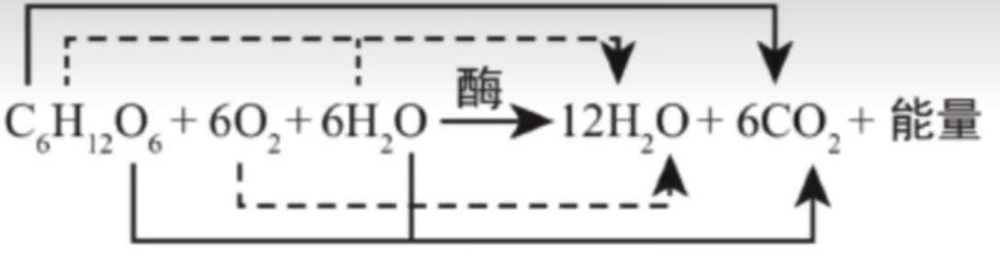

注意两侧的水不能约掉, 反应条件为酶的催化, 有机方程式需要使用箭头, 能量不能省略. 图中的箭头标识了各元素的去向(值得注意的是水中的氧由且仅由氧气中的氧转化, 其余物质元素均为底物中(除了氧气)的全部此元素转化得到), 通过有氧呼吸具体步骤即可得到, 这在处理同位素标记的题型中会使用(注意 $^{18}O, ^{15}N$ 是稳定同位素, 无放射性, 以及时间足够长的情况下, 可能重复利用导致同位素标记的扩散, 如 $^{18}O_2 \to H_2^{18}O \xrightarrow{长时间} C^{18}O_2$). 

系数之比($1 C_6 : 6O_2 : 6CO_2$, 气体系数大且二者相等)可能需要记忆, 计算题会使用. 

不一定只有真核生物可以有氧呼吸, 部分原核生物(即便无线粒体)也可有氧呼吸(有对应的酶), 第二阶段发生在细胞质基质, 第三阶段在细胞膜内侧, 自身相当于一个特殊的线粒体, 内共生学说也可体现这一点(线粒体来源自真核细胞吞噬可有氧呼吸的原核细胞共生). 

### 无氧呼吸

酵母菌, 乳酸菌, 马铃薯块茎, 水稻的根, 苹果的果实, 动物的肌细胞等均可以无氧呼吸. 

无氧呼吸指细胞在无氧条件下, 通过多种酶的催化作用, 把葡萄糖等有机物不彻底氧化分解, 产生酒精与二氧化碳, 或乳酸, 并释放少量能量, 产生少量 $ATP$ 的过程. 

无氧呼吸分为两个阶段, 均发生在细胞质基质. 

#### 第一阶段

第一阶段与有氧呼吸一致, 详见有氧呼吸第一阶段. 

#### 第二阶段

在细胞质基质中, 一分子葡萄糖所产生的两分子丙酮酸与四分子的还原氢在无氧环境下通过两个渠道之一转化为其他有机物: 
$$4[H] + 2C_3H_4O_3 \xrightarrow[\quad]{酶} 2C_3H_6O_3(乳酸)\\
4[H] + 2C_3H_4O_3 \xrightarrow[\quad]{酶} 2C_2H_5OH(酒精) + 2CO_2$$

注意只有酒精发酵产生二氧化碳气体, 乳酸发酵不产生气体. 

一般一种生物只通过其中一种转化途径. 乳酸发酵主要存在于动物的肌细胞, 乳酸菌, 马铃薯块茎, 甜菜块根, 玉米胚细胞等中; 酒精发酵主要存在于酵母菌, 与大部分植物(如植物泡水烂根的原因之一是无氧呼吸酒精积累毒害)中. 

可以发现只有第一阶段释放少量能量, 第二阶段不释放能量, 能量储存于有机物(乳酸, 酒精)中. 

无氧呼吸大部分能量储存在有机物(乳酸, 酒精)中未释放利用, 释放出的能量中多数作为热能散失, 少部分储存在 $ATP$ 中供生物利用. 故能量去向: 有机物(化学能) $>$ 热能 $>$ $ATP$ . 

总反应式: 
$$C_6H_{12}O_6 \xrightarrow[\quad]{酶} 2C_3H_6O_3(乳酸) + 少量能量\\
C_6H_{12}O_6 \xrightarrow[\quad]{酶} 2C_2H_5OH(酒精) + 2CO_2 + 少量能量$$

无氧呼吸不产生水. 

系数之比($1C_6 : 2CO_2$, 气体系数大)可能需要记忆, 计算题可能会使用. 如若氧气消耗量 $=$ 二氧化碳生成量, 那么可能只进行有氧呼吸(可能还有乳酸发酵); 氧气消耗 $<$ 二氧化碳生成则同时进行有氧和无氧(酒精发酵); 氧气消耗 $>$ 二氧化碳生成则可能涉及脂肪的氧化分解; 不吸收氧气也不释放二氧化碳不意味着细胞死亡, 也可能是乳酸发酵; 仅二氧化碳生成, 无氧气消耗为酒精发酵. 

可以通过总方程式发现不论是有氧还是无氧呼吸还原氢并没有积累. 

根据不同生物对氧气的需求可以将生物分为
1. 好氧性(大多数生物, 可进行无氧呼吸, 但不能长期离开氧气)
2. 厌氧型(乳酸菌, 破伤风杆菌等, 不会进行有氧呼吸)
3. 兼性厌氧菌(酵母菌, 大肠杆菌(消化道内为无氧环境)等, 既可以有氧, 也可以无氧)

检测二氧化碳的有无可以使用澄清石灰水(通入变浑浊), 或使用溴麝香草酚蓝溶液(随着通入由蓝变绿再变黄). 

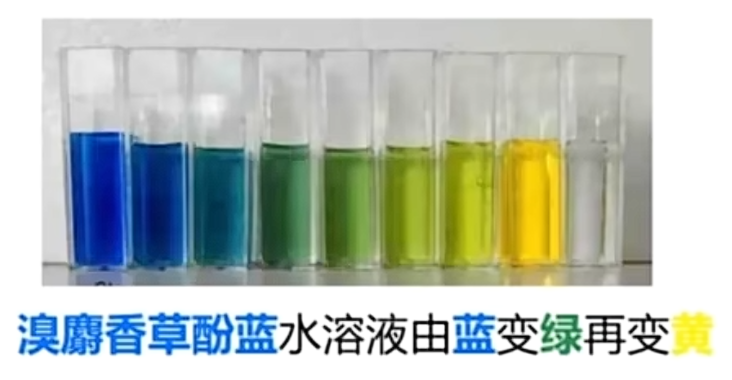

检测酒精可以使用酸性重铬酸钾溶液, 重铬酸钾在酸性条件下与酒精反应由橙色变为灰绿色. 

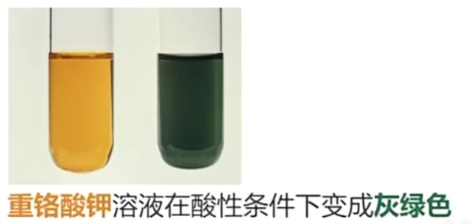

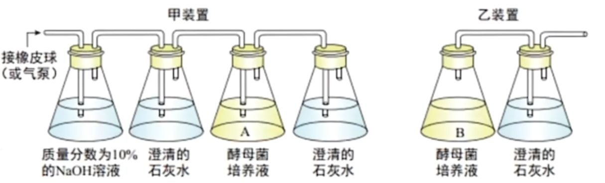

可以使用如图装置检测酵母菌的呼吸方式. 注意向酵母菌培养液中通入空气时要使用氢氧化钠除去二氧化碳, 以免干扰检测(甲装置第一个澄清石灰水用于检测是否除尽 $CO_2$ ). 当然, 乙装置需要无氧环境, 需要先封口放置一段时间消耗瓶中氧气再接入澄清石灰水. 

注意由于葡萄糖(还原糖)也会使酸性重铬酸钾褪色, 故应当放置一段时间确保葡萄糖消耗完全后再取样进行酒精检测. 

探究绿色植物时需要放置于黑暗条件下以免光合作用干扰. 

### 影响细胞呼吸的因素

内因: 遗传因素, 决定酶的种类与数量. 如呼吸速率旱生植物小于水生植物, 阴生植物小于阳生植物(不同植物); 幼苗期, 开花期高于成熟期(同一植物不同时期); 生殖器官大于营养器官(同一植物不同器官)等. 

外因: 有反应总方程式可得, 温度(酶活性), 氧气浓度, 二氧化碳浓度, 水分等会影响呼吸速率. 应用分别有: 低温储存果蔬(适度, 零下会冻伤), 大棚种植夜间与阴天降温减少有机物消耗; 透气的纱布包扎伤口避免厌氧菌(如破伤风杆菌, 伤口较深时无氧呼吸易繁殖, 需注射血清), 酿酒时早起通气扩大培养, 后期密闭产生酒精, 土壤松土, 稻田排水提高土壤含氧量, 促进有氧呼吸进而促进主动运输吸收矿质元素, 无土栽培向培养液通气防止无氧呼吸烂根, 低氧保存果蔬减少有机物消耗, 有氧运动而非无氧运动减少乳酸产生使肌肉酸痛; 增加二氧化碳浓度抑制呼吸作用, 减少有机物消耗, 延长果蔬保鲜时间; 储存种子要先晒干除去部分自由水, 保持干燥减弱呼吸, 但水分较多的果蔬需要湿度适宜以保鲜. 

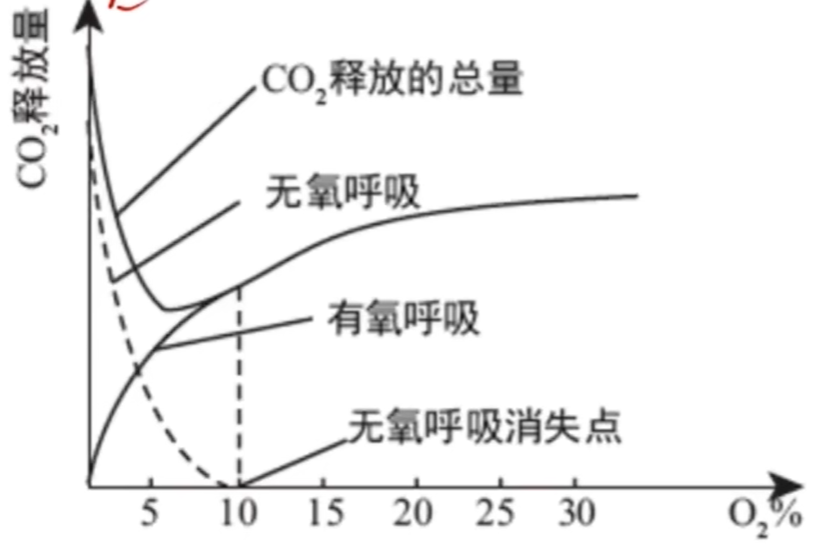

图中 $CO_2$ 释放最少的点($5\%$ 左右)就是最适宜蔬果保存的氧气浓度(因为 $CO_2$ 中的 $C$ 对应这有机物的消耗).

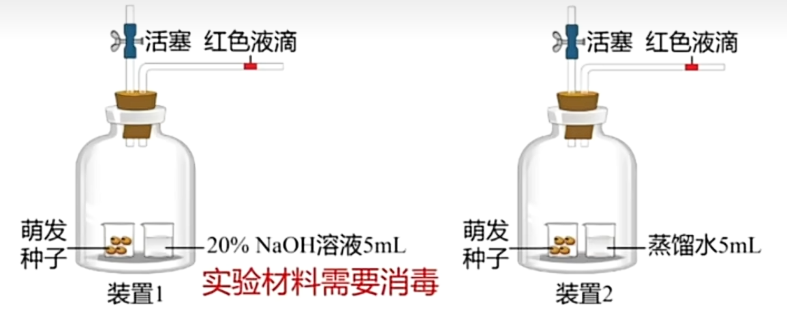

($U$ 形管装置同理)

实验材料需消毒避免杂菌干扰. 种子进行酒精发酵. 

$NaOH$ 用于吸收 $CO_2$ , 故影响装置 $1$ 液滴移动的气体为瓶中空气($O_2$)的减少量; 蒸馏水形成对照, 防止蒸发的水蒸气干扰, 装置 $2$ 影响液滴移动的为氧气的吸收与二氧化碳释放的差值. 注意若瓶中气体不移动不一定只进行有氧呼吸, 也可能是种子死亡. 

实际上实验还需要两组空白对照(将装置中的种子改为等量灭活(煮熟的)种子), 以排除温度与气压等理化因素的干扰.

## 光合作用

### 光合色素

光合色素专指叶绿体中的色素, 液泡中的花青素等色素不是光合色素. 光合色素的化学本质是色素 - 蛋白复合体. 光合色素可以捕获光能(即吸收, 传递, 转化光能), 用于光色作用. 光合色素主要分为以下两类四种: 

- 叶绿素(约占 75% , 主要吸收红光和蓝紫光)
  - 叶绿素 a: 蓝绿色
  - 叶绿色 b: 黄绿色
- 类胡萝卜素(约占 25% , 主要吸收蓝紫光)
  - 胡萝卜素: 橙黄色
  - 叶黄素: 黄色

以下是光合色素对不同颜色光的吸收率. 

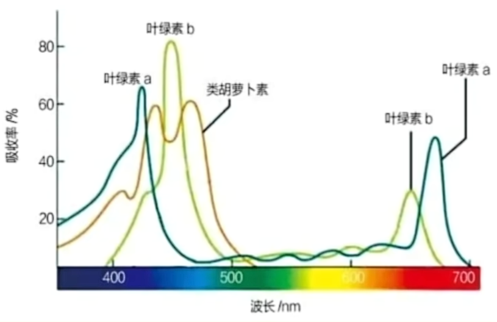

至此我们可以解释叶片呈现绿色的原因: 光合色素对绿光的吸收率较低, 绿光被反射至眼中, 而其他颜色的光被大量吸收. 故在大棚种植中, 我们一般选用无色透明膜; 其次选用红色或蓝紫色透明膜, 只允许相同颜色的光透过; 不选用绿色透明膜, 长势较差. 

光合色素均分布在叶绿体中类囊体薄膜上. 类囊体堆积形成基粒, 如下图. 

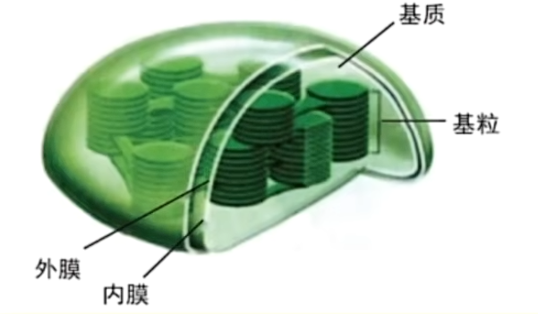

影响叶绿素(不包含类胡萝卜素)合成的影响因素有以下三条: 

1. 光照. 光是影响叶绿素合成的主要因素, 如韭菜(绿色)与韭黄(黄色)的区别.
2. 温度. 低温时, 叶绿素分子易被破坏, 叶片发黄. 如秋季落叶的转黄, 一部分原因就是叶绿素被破坏.
3. 矿质元素. 叶绿素中含有 Mg 元素与 N 元素.

### 过程

光合作用是指绿色植物通过叶绿体, 利用光能, 把 $CO_2, H_2O$ 转化成储存着能量的有机物, 并释放出氧气的过程. 方程式为:

$$CO_2 + H_2O \xrightarrow[叶绿体]{光能} (CH_2O) + O_2$$

其中 $(CH_2O)$ 为糖类. 此物质转化也伴随能量转化, 即光能转化为电能(电子), 电能通过电子传递链转化为 ATP, NADPH 中活跃的化学能, 再转化为糖类中储存的稳定的化学能. 

光合作用的主要场所在叶绿体. 叶绿体一般呈扁平的椭球形或球形, 包括外膜, 内膜, 基粒和基质. 其通过多层类囊体堆叠形成基粒以扩大膜面积, 从而增大酶的附着位点, 增大反应场所. 

叶绿体中含有色素, 酶, 少量 RNA 与 DNA , 与线粒体类似, 是半自主细胞器(符合内共生理论), 其中含有核糖体. 

光合作用分为光反应与暗反应, 如图. 

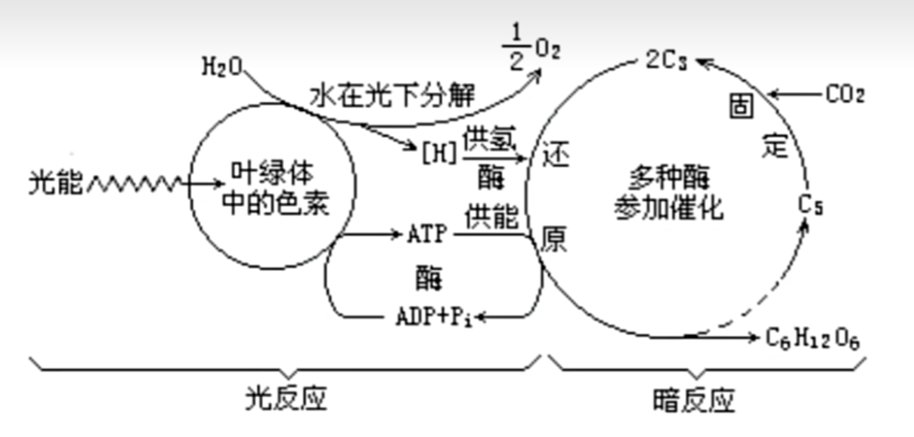

光反应在类囊体薄膜上进行, 其主要过程为水光解, 即在**光照**的条件下, 水分子 $H_2O$ 分解为 $O_2$ , $H^+$ 及 $e^-$ , 通过电子传递链推动 $NADP^+$ 转化为 $NADPH$ , 以及 $ADP$ 与 $Pi$ 结合为 $ATP$ . 

暗反应又称卡尔文循环, 在叶绿体基质中进行. 其过程**无需**光照, 主要分为 $CO_2$ 的固定与 $C_3$ 的还原. $CO_2$ 的固定无需耗能, $CO_2 + C_5 \xrightarrow{\quad} 2C_3$ , 其中 $C_3$ 为 $3 - $ 磷酸甘油酸, $C_5$ 为二磷酸核酮糖, 即 RuBP, 均不是碳单质. 接下来, $C_3$ **消耗**来自 ATP, NADPH 中活跃的化学能, 被还原为 $(CH_2O)$ 与 $C_5$ , 再次进入循环; 而 ATP 变为 ADP + Pi, NADPH 变为 $NADP^+$, 重新被光反应利用. 

有些生长环境干旱的植物不采用常规的 $C_3$ 途径, 可能采用 $C_4$ 途径或 **CAM** 途径, 题目会给出相关信息.

若土突然改变光照与 $CO_2$ 供应, 相关物质含量在短时间内会发生改变. 具体如下表: 

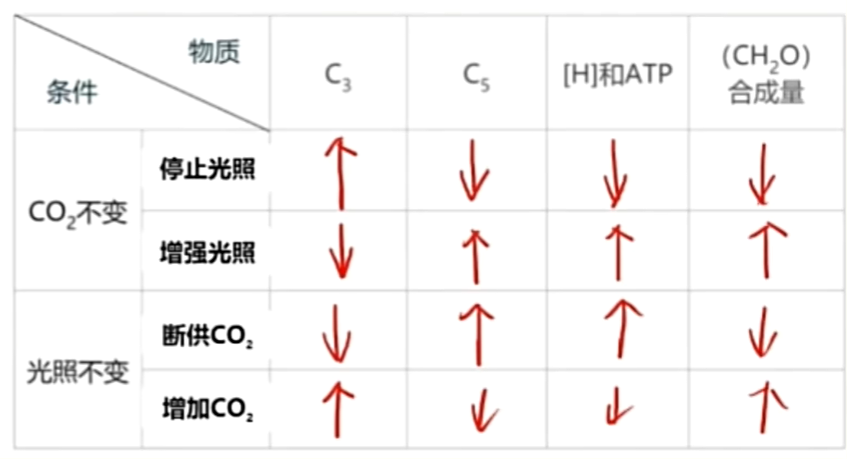

$C_3$ 与 $C_5$ 变化总是相反, $C_5$ 与 $ATP, NADPH$ 的变化总是相同. 故若改变光照, 从光反应速率变化推到 $ATP, NADPH$ 变化, 结合上述结论即可得出所有的变化; 若改变 $CO_2$ 浓度, 从 $CO_2$ 固定速率推到 $C_3$ 的变化, 即可推得所有的变化. 有机物含量与光合速率成正相关. 故有机物 $(CH_2O)$ 的变化直接根据光照与 $CO_2$ 的变化推到光合速率的变化即可得出. 

若掌握基本分析方式, 施用氮肥镁肥(改变叶绿素含量, 提高光色速率)等非常见操作也可进行分析. 

### 光合作用的影响因素

- 光照
  - 光照强度.
 
    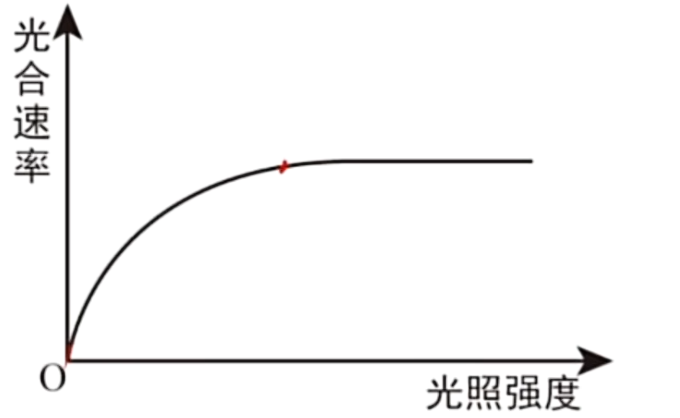
  
    如图, 在红点为光照强度饱和点, 此处光合速率不再上升, 是受限于暗反应速率, 即 $CO_2$ 浓度, 酶活性, 光合色素含量等.  

  - 光质(光的颜色). 如可使用有色玻璃(绿色等)降低光合作用.
 
- $CO_2$ 浓度.

  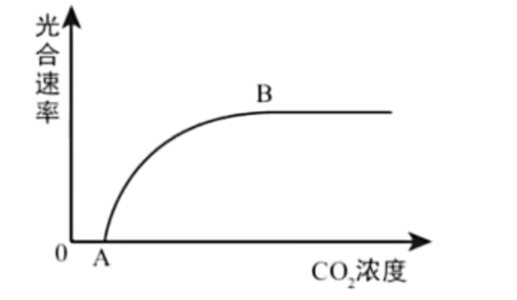

  如图, $A$ 点表示进行光合作用所需的 $CO_2$ 的最低浓度; $B$ 点为 $CO_2$ 饱和点, 限制因素有酶活性, 光照强度, 光合色素含量等.

  可以通过合理密植, 保证通风; 增施气肥(如 $NH_4HCO_3$ )与农家肥等来增加 $CO_2$ 浓度.

- 温度. 温度主要通过影响酶活性来影响光合速率. 故对于农作物, 需要适时播种; 在温室中需要控制温度在最适温度.

- 水. 水作为光合作用的原料, 缺水会减缓光合作用; 缺水会导致气孔关闭, 限制 $CO_2$ 的吸收. 故需要合理灌溉.

- 必要矿质元素. $N, Mg, Fe, Mn$ 等是叶绿素合成的必须元素; $K, P$ 等缺乏会影响糖类的转化和运输; $P$ 参与构成叶绿体膜, 也组成 $ATP$ . 故需要合理施肥.

### 光合与呼吸结合

对于一株绿色植物, 其光合作用与呼吸作用产物可以相互利用. 故我们可以得出真(总)光合速率与净光合速率的表达式: 

$$
净光合速率 = 真(总)光合速率 - 呼吸速率
$$

故若一个植物既不释放也不吸收 $O_2$ 与 $CO_2$ , 则此时光合速率 = 呼吸速率, 净光合速率为零. 但对于单个叶肉细胞, 其需要为其他无法光合作用的细胞提供氧气与有机物, 故其光合速率 > 呼吸速率. 

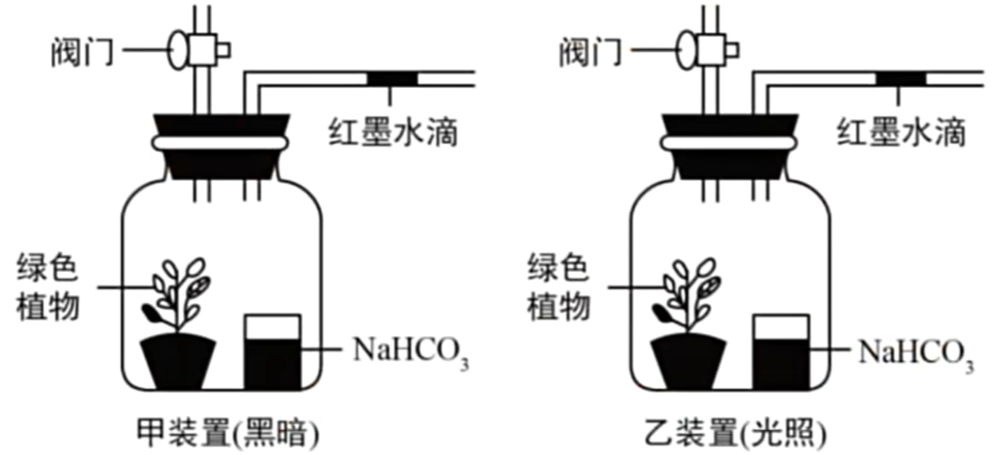

我们可以使用如图的黑白瓶来测定净光合与呼吸速率. 黑瓶即遮光瓶, 白瓶即有光照射入的透明瓶, 瓶子均为密闭. 我们使用 $NaHCO_3$ 作为 $CO_2$ 的缓冲液, 保证容器中 $CO_2$ 浓度的相对稳定, 故仅有 $O_2$ 可以改变红墨水的位置. 

故放置一段时间后, 甲装置中红墨水会向左移动, 体积表示呼吸所消耗的 $O_2$ 体积; 乙装置中红墨水会向右移动, 体积可表示净光合作用释放的 $O_2$ 体积. 使用两体积相加即可得到真光合作用释放的 $O_2$ 体积. 

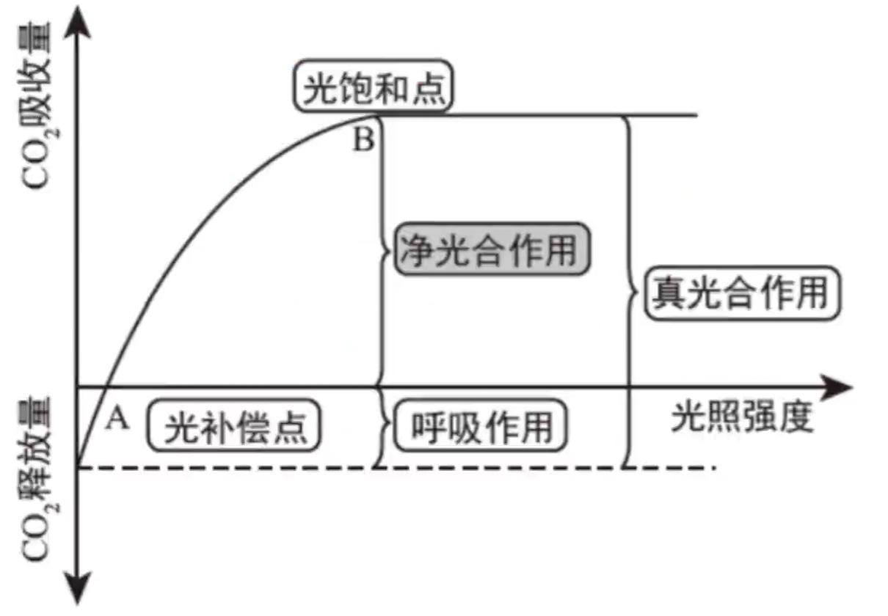

我们一般默认呼吸速率不变. 光补偿点意为光合速率 = 呼吸速率, 即净光合速率为零时; 光饱和点意为光合速率不再上升的点, 受 $CO_2$ 浓度, 温度(酶活性), 光合色素含量的限制. 故光照强度超过光补偿点, 植物才会积累有机物, 即积累有机物的量表示真光合速率. 

影响呼吸速率最主要的因素为温度, 故若改变温度, 图像与 $y$ 轴交点会随之移动. 若植物缺 $Mg$ , 则叶绿素含量减少, 植物需要更强的光照才能获得与呼吸作用对应的光合速率, 故光补偿点右移; 光饱和点由于色素含量减少, 会提前达到饱和, 且饱和时光合速率较低, 故光饱和点向左下移动. 若温度由呼吸最适温度变为光合最适温度, 则呼吸速率减小, 光补偿点左移(只需要更少的光即可达到呼吸速率), 光饱和点右上移(限制因素的限制减弱, 可以达到更高的光合速率, 同时一定需要更高的光照). 类似的分析过程同理. 

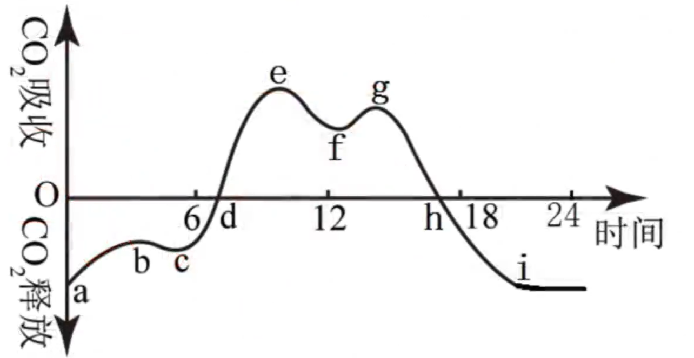

如图表示植物净光合作用在一天内的变化曲线. 其中 $i \sim a$ 段由于无光, 故表示呼吸速率; $a \sim b$ 段由于温度过低, 导致呼吸速率略微减弱; 从 $c$ 点附近开始出现光照, 直到 $d$ 点达到光补偿点, 开始积累有机物. 随后光合作用一直增强, 直到 $f$ 点附近, 由于正午温度过高, 蒸腾作用旺盛, 为避免水分过度丧失, 气孔部分关闭, 导致 $CO_2$ 吸收量减少, 光色速率下降. 此现象也成为"光合午休". 随后光合速率下降, 直到 $h$ 点再次达到光饱和点, 有机物积累停止. 再到 $i$ 点停止光合作用. 由过程可知, 一天中积累有机物最多的点为 $h$ 点, 因为此前积累有机物, 此后就开始消耗有机物. 

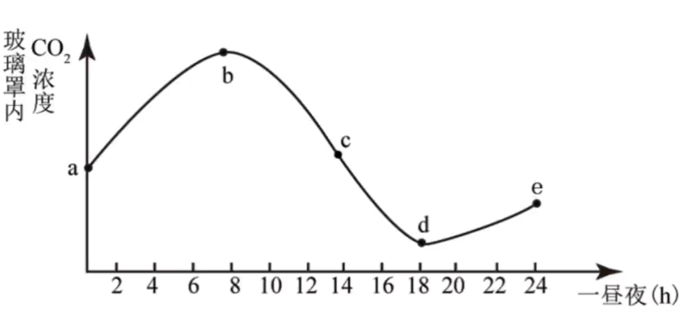

将植株放于密闭玻璃罩内, 置于室外. 一天内 $CO_2$ 浓度变化曲线如上图. $b$ 与 $d$ 点表示光补偿点, 因为 $CO_2$ 变化趋势出现转变. 比较 $a$ 与 $e$ 点的 $CO_2$ 浓度, 若减少则代表一昼夜内有机物积累, $CO_2$ 用于合成有机物. 

### 色素的提取和分离实验

提取色素的原理: 绿叶中的色素能溶解于无水乙醇, 丙酮等有机溶剂. 

可以遵循一下步骤进行提取: 

1. 称取新鲜绿叶(新鲜绿叶色素含量高, 未被大量分解); 
2. 剪碎, 加入二氧化硅(增大摩擦, 使研磨更充分, 色素充分释放, 不加入会导致所有色素含量均减少)与碳酸钙(防止释放出的有机酸破坏叶绿素, 注意若不加入仅为叶绿素被大量分解, 对胡萝卜素的影响较小), 以及 $10 mL$ 无水乙醇(溶解色素, 可以使用丙酮替代); 
3. 过滤, 收集滤液, 及时用棉塞塞紧瓶口以免溶剂挥发, 浓缩滤液.  

滤液中绿色颜色过浅的原因可能有: 

- 未加入二氧化硅, 研磨不重复; 
- 未加入碳酸钙, 色素被破坏; 
- 叶片不够新鲜, 或叶片中色素含量少, 颜色过浅; 
- 无水乙醇加入过多, 过度稀释. 

色素的分离使用纸层析法, 其原理为: 不同色素在层析液(苯, 丙酮, 石油醚)中的溶解度不同, 溶解度高的随层析液在滤纸上扩散得快, 反之则慢. 

纸层析法的操作步骤为: 

1. 制备滤纸条. 将滤纸剪成能装进试管的滤纸条, 并在其一端减去两角(增加中部层析液的路程, 防止纸条边缘层析液移动过慢, 以保证条带比较直), 如图, 并在此端 $1 cm$ 出使用铅笔( C 单质, 不溶于有机溶剂, 以免其他墨水溶于有机溶剂)画细横线作为标记.

   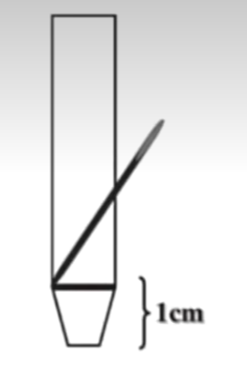

2. 画色素细线. 使用毛细吸管吸取提取到的色素滤液, 沿铅笔均匀地画出一条细线. 待干燥后, 重复一至二次以保证色素含量. 不可晕染或弯曲, 否则条带会重叠或不齐整.

3. 分离色素. 将适量层析液倒入试管, 将有细线的一端朝下插入层析液中(一定不能没过细线以免溶解色素), 用棉塞塞紧瓶口防止挥发.

最终色素向上"爬升"得到如下的纸条: 

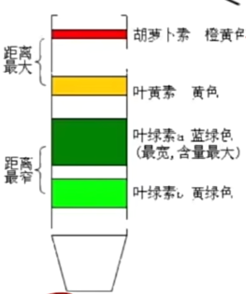

由上到下, 溶解度从大变小; 条带越宽代表含量越大. 

我们也可以使用如图所示的圆形滤纸, 将色素与层析液点在中部. 

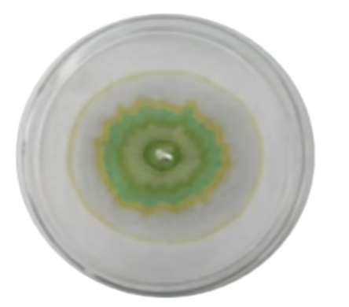

## 生物代谢基本类型

生物代谢的基本类型分为同化作用(如光合作用, 化能合成作用等)与异化作用(如呼吸作用等). 除病毒外所有生物都进行同化作用与异化作用. 

- 同化作用: 生物体把外界获取的营养物质转变为自身的组成成分, 并储存能量的变化过程. 根据同化的途径不同, 可以分为自养生物与异养生物.

  - 自养生物: 能够以光能(光能自养生物, 利用光合作用, 如绿色植物, 蓝细菌等)或氧化无机物(化能自养生物, 利用化能合成作用, 即利用化学反应所释放的能量代替光能, 如硝化细菌, 硫化细菌, 铁细菌等)释放的化学能为能源, 以环境中的 $CO_2$ 为碳源(故化能合成也需要利用 $CO_2$ ), 来合成自身的组成物质, 并储存能量. 自养生物大多为植物, 小部分为细菌, 蓝细菌等原核生物. 有些植物也为异养生物, 如猪笼草等. 一般在生态系统中承担生产者. 

  - 异养生物: 以环境中现成的有机物作为能量和碳的来源, 将这些有机物转变为自身的组成物质, 并储存能量. 动物, 真菌与大多数细菌均为异养生物. 可能在生态系统中承担消费者与分解者. 
  
- 异化作用: 生物体能够把自身的一部分组成物质加以分解, 释放出其中的能量, 并且把分解的终产物排除体外的变化过程. 异化作用可以分为以下三类:

  - 需氧型: 哺乳动物, 多细胞植物, 部分细菌与真菌等, 主要呼吸方式为有氧呼吸的生物(也可无氧呼吸, 但不能长期依靠无氧呼吸生存); 
  - 兼性厌氧型: 酵母菌, 大肠杆菌等, 即可进行有氧呼吸, 也可进行无氧呼吸来维持生存(但更倾向于有氧呼吸, 因为有氧呼吸供能更多);
  - 厌氧型: 乳酸菌, 破伤风杆菌等, 只能进行无氧呼吸. 

将生物的同化作用与异化作用类型组合, 先描述同化作用再描述异化作用, 即可得出生物的基本代谢类型有: 自养需氧型, 自养厌氧型, 异养需氧型, 异养厌氧型等. 

在消化道中, 环境为无氧环境. 故生存在其中的生物一般为兼性厌氧型菌与厌氧型菌, 且均为异养型.