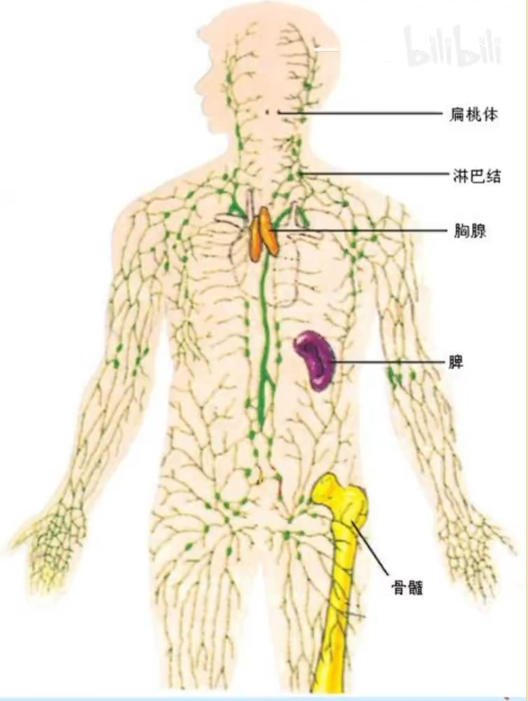
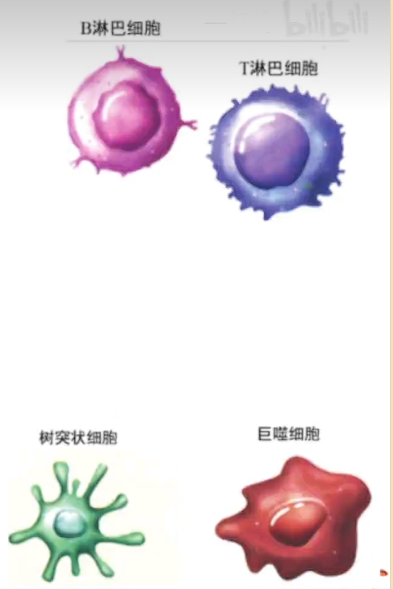
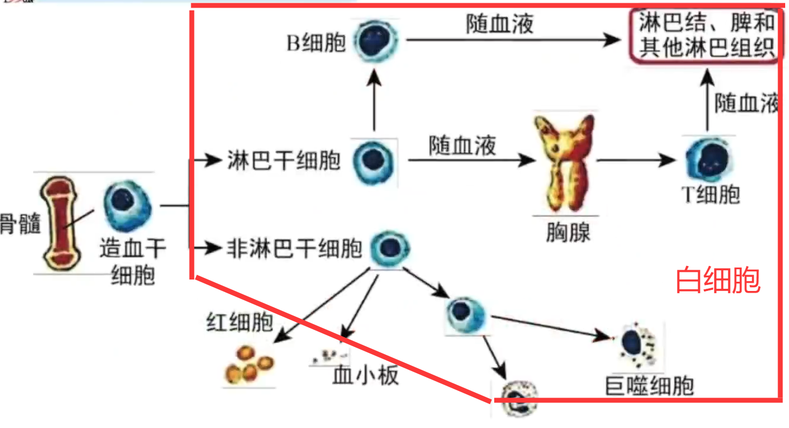
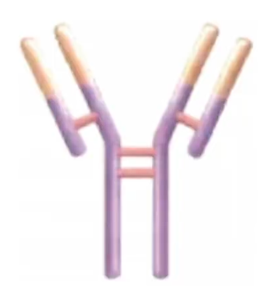
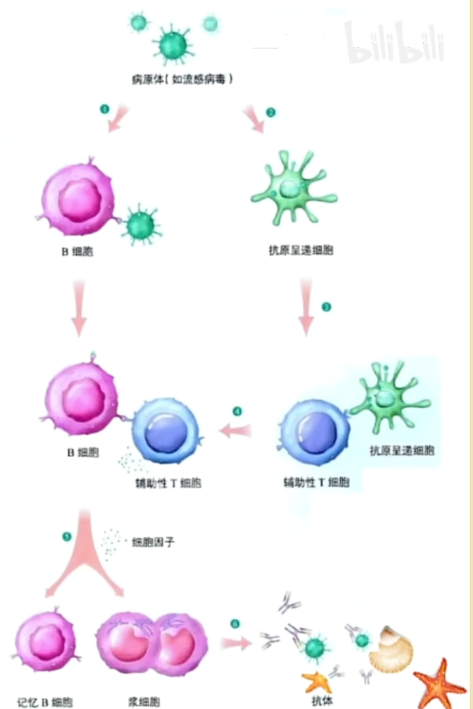
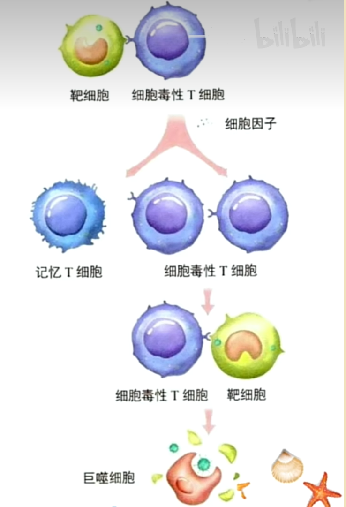
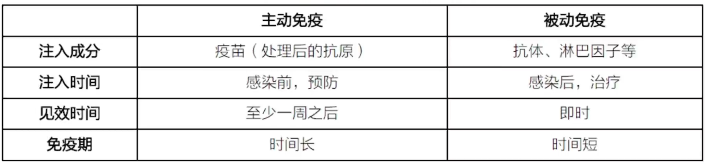

# 免疫调节

免疫系统由免疫器官, 免疫细胞与免疫活性物质组成. 

如图, 免疫器官是免疫细胞生成, 成熟或集中分布的场所. 免疫器官有骨髓, 胸腺, 脾, 淋巴结, 扁桃体等. 其中胸腺是 T 淋巴细胞发育成熟的场所; 骨髓中存在造血干细胞, 是绝大多数免疫细胞(包括 T 淋巴细胞)的产生场所, 也是 B 淋巴细胞产生并发育成熟的场所; 脾, 淋巴结, 扁桃体是免疫细胞集中分布的场所. 

免疫细胞为执行免疫功能的细胞, 来自于骨髓造血干细胞. 免疫细胞包括了各种类型的白细胞, 大致可以分为: 

- 淋巴细胞, 包括: 
    - T 淋巴细胞(T 细胞), 有以下几类: 
        - 辅助性 T 细胞(Th 细胞); 
        - 细胞毒性 T 细胞(Tc 细胞); 
        - 记忆 T 细胞. 
    - B 淋巴细胞(B 细胞), 有记忆 B 细胞等种类. 
- 吞噬细胞
    - 树突状细胞, 成熟时具有分支; 
    - 巨噬细胞, 具有吞噬消化, 抗原处理和呈递功能. 

B 细胞, 树突状细胞与巨噬细胞都可以摄取并加工处理抗原, 将抗原信息暴露在细胞表面, 以呈递给其他免疫细胞, 故成为抗原呈递细胞(APC). 

免疫活性物质是由免疫细胞或其他细胞产生的发挥免疫作用的物质, 如抗体, 细胞因子, 溶菌酶等. 其中细胞因子包括白细胞介素, 干扰素, 肿瘤坏死因子等; 溶菌酶有杀菌功效, 分布于唾液, 泪液等中(故可位于体外). 

抗体大多为蛋白质, 能与抗原发生特异性结合. 抗体由浆细胞产生, 主要分布在血清中, 但组织液与外分泌液(如乳汁)中也有分部. 其结构如图. 

抗体中分为可变区(位于顶端黄色部分)与恒定区(位于底部紫色部分). 可变区负责特异性识别并结合抗原, 对于作用于不同对象的抗体, 可变区的序列不同; 而对于同一物种同一类抗体, 恒定区的序列基本是相同的. 故若人体需要鼠抗体的功能, 为避免免疫排斥反应, 可以将鼠抗体的可变区结合在人类抗体的恒定区上. 

抗体的作用有很多, 如: 

- 凝集素: 与病毒结合, 可使病毒凝集成团, 抑制病菌的繁殖或对宿主细胞的粘附. 凝集团沉淀后被吞噬细胞吞噬清除. 
- 抗毒素: 与外毒素结合起到中和毒素的作用, 使外毒素失去毒性. 

当然, 一般简化地认为抗体可以特异性结合抗原, 形成沉淀, 并被吞噬细胞吞噬消化, 实现了抑制病原体的增殖或对人体细胞的粘附功能. 其中抗原指能引发免疫反应的物质(有无生命均可), 包括病毒, 细菌, 过敏原等. 实际上, 病原体与细胞上的抗原决定簇(一般为蛋白质)也可被称为抗原. 

## 三大防线

人体通过三道防线实现免疫功能: 

- 第一道防线: 皮肤, 黏膜及其分泌物(如黏液等). 这既包含体表的物理屏障, 也包含化学防御. 
- 第二道防线: 体液(细胞内液与细胞外液)中的杀菌物质(如溶菌酶)和吞噬细胞(如巨噬细胞和树突状细胞). 注意, 唾液等体外黏液属于第一道防线, 其中的溶菌酶等杀菌物质不属于第二道防线. 
- 第三道防线: 体液免疫(病原体还未侵入细胞)与细胞免疫(病原体已经进入细胞). 后文会详细讲解. 

其中, 第一道防线与第二道防线属于非特异性免疫, 由遗传而来, 故免疫功能正常的人类生来就有, 对多种病原体都有防御作用, 其特点为无特异性, 作用效果弱, 持续时间短; 第三道防线属于特异性免疫, 在人出生后, 感染相应病原体后才获得的后天性免疫, 只对某一或某类特定的病原体作用, 有特异性, 作用效果强, 持续时间长. 起主导作用的特异性免疫是在非特异性免疫的基础上形成的, 两者是统一的整体, 它们共同实现免疫防御, 免疫自稳, 免疫监视三大基本功能. 

免疫系统的三大基本功能, 具体来地: 

- 免疫防御: 针对外来病原体, 即机体排除外来抗原性异物的一种免疫防护作用. 这是免疫系统最基本的功能. 
- 免疫自稳: 清除自身衰老损伤的细胞, 进行自身条件, 维持内环境稳态. 
- 免疫监视: 识别和清除突变的细胞, 防止肿瘤发生. 

## 体液免疫

若病原体进入机体, 但还未进入细胞, 则会发生体液免疫. 

如图, 抗体是由浆细胞产生的, 而浆细胞是由 B 细胞分化而来. 想要使 B 细胞被激活并分裂分化, 需要以下三个条件(两个信号以及细胞因子): 

- 与病原体直接接触, 获取抗原信息; (第一个信号)
- 与辅助性 T 细胞接触, 获取其呈递的抗原信息; (第二个信号)
- 由辅助性 T 细胞产生的细胞因子, 用于促进分裂分化. 

辅助性 T 细胞不属于抗原呈递细胞, 故其需要接触抗原呈递细胞将抗原处理(裂解杀死等操作)并呈递在细胞表面, 与之接触来获取抗原信息, 并令细胞表面的特定分子发生变化, 与 B 细胞结合; 与此同时, 辅助性 T 细胞会开始分裂分化, 并分泌细胞因子. 

B 细胞除了大部分分化为浆细胞外, 小部分分化为记忆 B 细胞. 若相同的病原体再次入侵, 则记忆 B 细胞会立即激活, 并分裂分化, 产生新的浆细胞, 以产生新的, 大量的抗体. 

注意, 浆细胞无任何识别作用, 不会识别病原体或抗原呈递细胞. 其是终端分化细胞, 无法继续进行分裂分化. 一种浆细胞只能分泌一种抗体. 

实际上, 一种病原体表面可能存在多种抗原决定簇, 而抗体与抗原决定簇一一对应, 故针对此病原体可能产生多种浆细胞, 以分泌多种抗体, 进而实现更好的免疫效果. 

## 细胞免疫

由于抗体为大分子蛋白质, 难以直接进入细胞, 故在采用细胞免疫. 实际上, 细胞免疫中包含体液免疫, 因其思路为直接将被侵染的靶细胞裂解, 释放病原体至体液中, 进而被抗体或吞噬细胞处理(图片以巨噬细胞为例, 不代表只能由巨噬细胞处理). 

在靶细胞被侵染后, 其细胞膜表面某些分子会发生变化, 从而被细胞毒性 T 细胞识别并裂解死亡. 而后, 伴随辅助线 T 细胞产生的细胞因子, 细胞毒性 T 细胞开始分裂分化, 产生记忆 T 细胞与细胞毒性 T 细胞. 新的细胞毒性 T 细胞会随体液进行循环, 并裂解其他被同样病原体感染的靶细胞. 若相同的病原体再次入侵, 记忆 T 细胞会立即激活, 并分裂分化, 产生新的细胞毒性 T 细胞参与细胞免疫. 

当然, 对于自身癌细胞与异体移植器官中的细胞也会通过细胞免疫进行清除. 

## 过敏反应

过敏反应指, 已免疫的机体, 在再次接受相同的抗原(过敏原)时, 有时会引发组织损伤或功能紊乱的免疫反应. 由过敏原导致产生的抗体可以吸附在皮肤, 呼吸道, 消化道黏膜以及血液中的某些细胞表面(如肥大细胞). 如果再次接触过敏原, 与这些细胞表面的抗体结合, 就会使这些细胞释放组胺, 引起毛细血管扩张与通透性增强, 平滑肌收缩, 腺体分泌增加, 进而导致过敏反应. 

过敏反应时异常的体液免疫. 但注意, 与体液免疫不同, 过敏反应一定不发生在第一次接触过敏原时, 而是发生在第二次及此后接触过敏原时. 

过敏反应的特点有: 

- 发作迅速, 反应强烈, 消退较快; 
- 一般不会破坏组织细胞, 也不会引起组织严重损失; 
- 由明显的遗传倾向于个体差异. 

## 免疫学应用

免疫系统出现问题时, 可能会发生以下疾病: 

- 自身免疫病. 当防卫功能过强时, 免疫系统会将自身物质当作外来异物进行攻击, 这可能与将 HLA (人类组织相容性抗原, 即人类的 MHC(主要组织相容性复合体))与某些病原体的抗原混淆所致. 如风湿性心脏病, 重症肌无力, 类风湿性关节炎, 系统性红斑狼疮等. 
- 免疫缺陷病. 免疫缺陷病是由于免疫器官, 免疫细胞或免疫活性物质发生缺陷引起的免疫功能失常, 缺失或降低, 导致机体的防御能力普遍或部分下降. 实际上, 简单来说就是防卫功能过弱. 其分为先天性免疫缺陷, 如重症联合免疫缺陷病(造血干细胞障碍); 与获得性免疫缺陷, 如 HIV (逆转录 RNA 病毒, 人类免疫缺陷病毒)入侵 T 细胞(尤其是辅助性 T 细胞)所引起的艾滋病(AIDS). 感染艾滋病的患者死于其他病原体的严重感染或癌症, 而非艾滋病本身. 

我们可以进行免疫预防(主动免疫), 即在人未患病时将疫苗接种在人体内, 使人体产生相应的抗体和记忆细胞, 从而增强人体的免疫力. 疫苗是指保留病原体抗原特性又不会引起人体患病的抗原(病原体), 其种类多样, 如: 

- 灭活疫苗, 完全失去侵染能力, 仅保留外壳; 
- 减毒活疫苗, 能够侵染细胞, 但不致病. 

也可以进行免疫治疗(被动免疫), 即在人体患病的情况下, 通过输入抗体等, 增强人体抵抗病原体的能力, 如注射含有相应抗体的血清等. 抗血清是指, 将处于高度免疫状态下的动物进行采血后分离得到的含抗体较多的血清. 

进行器官移植时, 会发生免疫排斥, 且主要为细胞免疫. 器官移植成败的关键在于能否寻得与受体 HLA 一致(同卵双胞胎)或相近的供体器官. 与此同时, 使用免疫抑制药物主要对 T 细胞进行抑制可以大大提升成功率, 但会伴有免疫力下降的副作用. 