# 植物激素

## 生长素

高等植物无法自由移动整体的位置, 但其器官在空间中可以产生移动, 以适应环境的变化. 植物受单一方向的外界刺激而引起的定向移动, 称为向性运动. 植物的向光性, 向(背)地性, 向水性等均为向性运动的结果. 

达尔文使用金丝雀虉(yì)草的胚芽鞘进行研究. 

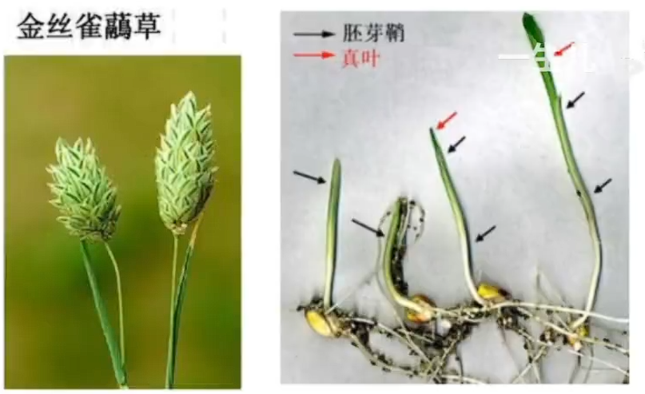

胚芽鞘可以对真叶其保护作用. 其有绿色部位, 含有叶绿体, 可以进行光合作用. 

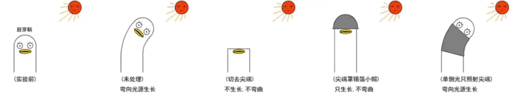

达尔文做上图中实验, 提出推论: 胚芽鞘尖端受单侧光刺激后, 就向下面的伸长区传递某种影响, 造成伸长区背光面比向光面生长快, 使胚芽鞘出现向光性弯曲. 注意, 达尔文并没有提出具体是哪种影响产生了此种现象. 

后来, 鲍森 $\cdot$ 詹森进行实验, 如图: 

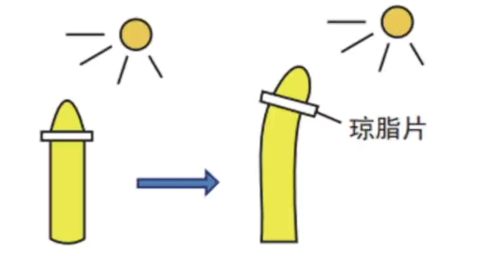

琼脂可以渗透化学物质, 但阻断胚芽鞘中的生物连接. 实验证明胚芽鞘依然可以出现向光性弯曲, 说明胚芽鞘尖端产生的影响可以透过琼脂片传递给下部. 但此实验仍然未涉及到生长素, 且甚至不能说明此种影响一定是化学物质所引起的. 

有些题目会将此实验中的琼脂片换为云母片. 云母片类似于玻璃片, 化学物质无法透过, 在题目中一般为组织某侧生长素的极性运输或尖端生长素的横向运输. 据此我们仍然可以对生长素的分布进行分析. 

此后, 拜耳进行实验, 如图: 

注意, 此实验全程在黑暗中进行. 其提出, 胚芽鞘的弯曲生长, 是因为尖端产生的影响在其下部分布不均匀造成的. 可惜的是, 此实验仍然无法揭示生长素及其作为化学物质而存在的事实. 

最后, 是温特进行实验, 如图: 

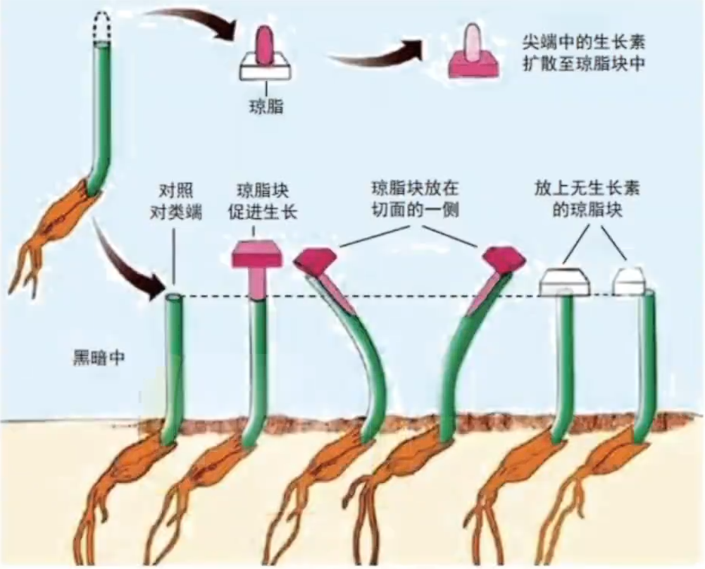

该实验证明, 胚芽鞘的弯曲生长是由化学物质引起的. 温特类比动物激素, 将其命名为生长素. 但是, 他未能成功地分离提取出生长素, 因为激素在生物体内的含量极少. 

直至后来, 科学家从人的尿液中分离具有生长素效应的化学物质吲哚乙酸 IAA, 并在后续从高等植物中分离出生长素, 确认其为 IAA. 此外, 生长素还有苯乙酸 PAA, 吲哚丁酸 IBA 等. 

总结来说, 胚芽鞘尖端能产生生长素. 当尖端感受单侧光刺激时, 其产生的生长素从向光侧向背光侧迁移, 发生了横向运输, 从而导致两侧生长不均匀, 进而向光弯曲. 

实际上, 生长素主要在芽, 幼嫩的叶和发育中的种子等幼嫩部位使用色氨酸作为底物进行合成. 植物的各个器官都存在生长素, 但相对集中分布在生长旺盛的部位. 

生长素的运输方式大致有三种: 

- 极性运输. 在胚芽鞘, 芽, 幼叶与幼根中, 生长素只能单向运输, 从植物形态学上端运输到形态学下端. 极性运输是主动运输, 消耗能量且需要载体蛋白. 形态学上端与形态学下端如下图所示. 

    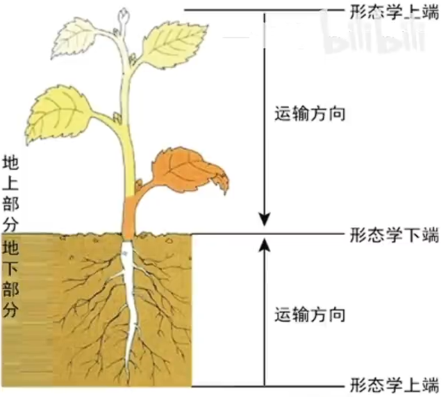

    可以使用以下实验进行验证: 

    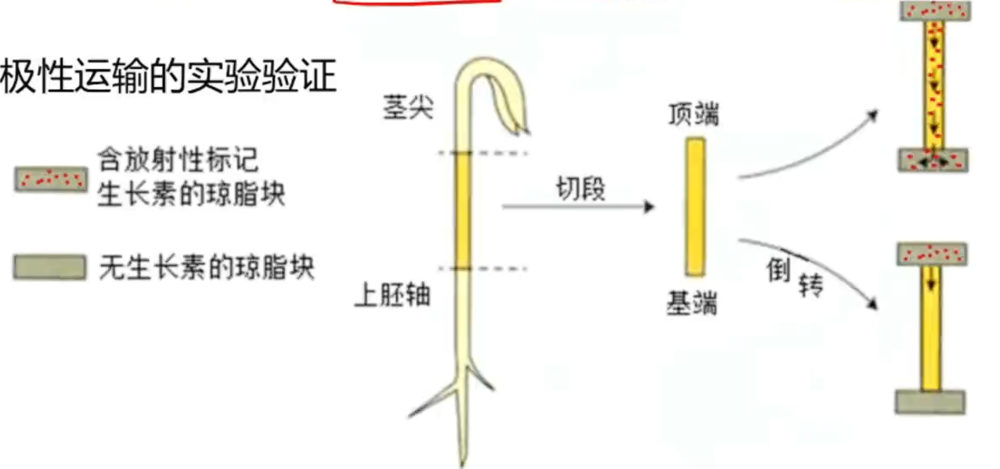

    统一在切段上方放置含有生长素的琼脂块, 在下方放置空琼脂块. 若令切段形态学上端(顶端)向上放置, 则一段时间后空白琼脂块中会出现生长素; 倒置后, 形态学下端(基端)向上放置, 则一段时间后空白琼脂块中不会出现生长素. 

- 非极性运输. 在成熟组织中, 生长素可以通过韧皮部进行非极性运输. 非极性运输不限制运输方向, 可以向任何方向运输, 自下而上或自上而下均可. 一般为自由扩散, 不需要消耗能量. 
- 横向运输. 横向运输只发生在尖端, 可受光, 重力等因素的影响. 一般认为是协助扩散, 不消耗能量. 

生长素的作用有: 

- 细胞水平上, 促进细胞伸长生长, 诱导细胞分化; 
- 器官水平上, 影响器官生长发育, 如促进侧根和不定根的发生, 影响花, 叶和果实发育等. 

生长素具有两重性, 在浓度较低时促进生长, 在浓度过高时抑制生长(低促高抑). 

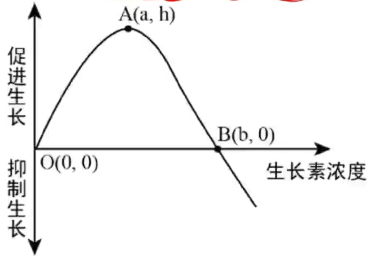

如图曲线体现了生长素的两重性. 需要注意, b 点是生长素促进与抑制生长的分界点, 而非 a 点; a 点是生长素最适浓度. 植物的顶端优势(树木的倒三角形态, 因为顶芽被促进生长, 其不会被抑制因为多余的生长素会向形态学下端运输离开; 侧芽由于过大的生长素浓度被抑制生长, 且随着运输距离的增长, 受抑制的影响减弱, 即距离顶芽越近, 抑制越明显)就是高浓度生长素对植物生长的抑制作用的体现. 若摘除顶芽, 可以解除顶端优势, 使侧芽正常生长, 树木呈圆球形. 

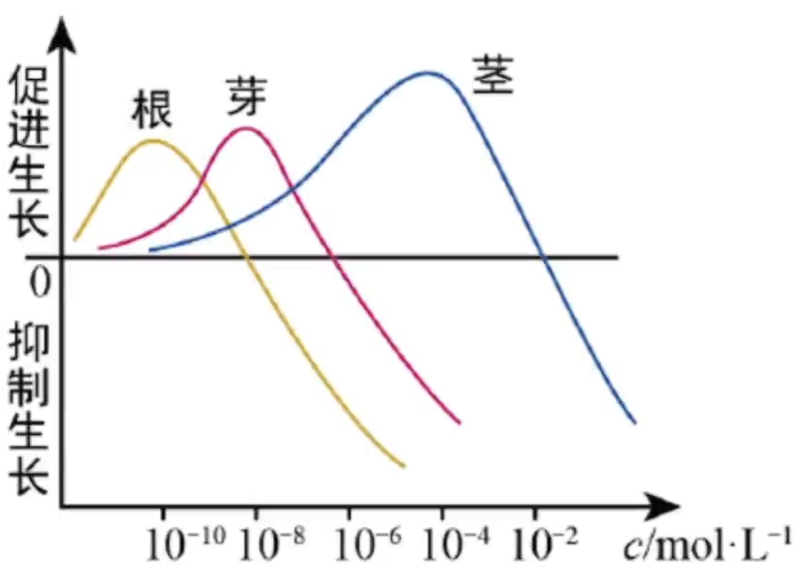

如图, 实际上对于不同器官, 生长素的敏感性不同. 一般来说, 敏感性符合根 > 芽 > 茎, 即部位越幼嫩, 生长素的敏感性越高, 较少的生长素即可实现更高的作用效果. 

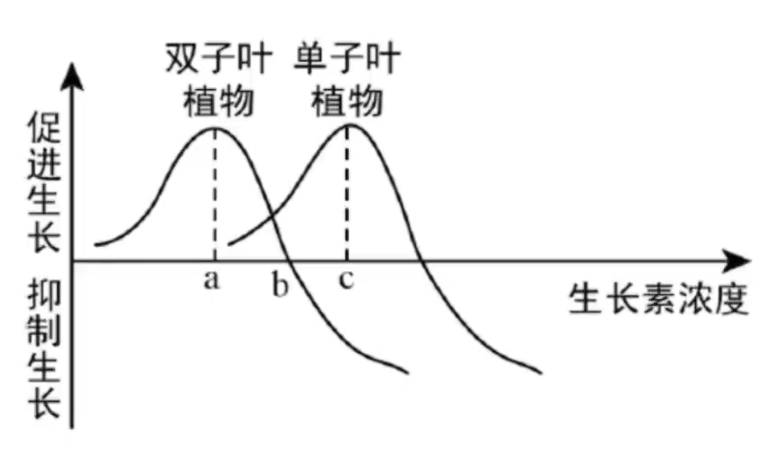

如图, 一般来说, 双子叶植物要比单子叶植物对生长素更为敏感. 杂草一般为双子叶, 所以在单子叶作物生产时, 可以使用 c 浓度的生长素来促进单子叶作物的生长, 而同时抑制双子叶杂草的生长. 

生长素在生产中应用广泛: 

- 促进扦插枝条生根, 在此之前需要测定植物生长素的最适浓度, 过程中涉及预实验等试验技巧, 还要注意扦插时选用生长旺盛的一年生枝条, 仅保留少量的叶或芽即可, 以减弱蒸腾作用并保证低限度的光合作用, 以及对于生长素溶液的使用方法, 若浓度较高则选用短时间的沾蘸法, 浓度较低则选用长时间的浸泡法; 
- 促进果实发育并培育无籽果实, 这种无子果实的产生机理与三倍体无籽果实不同, 其利用一定浓度的生长素类似物溶液处理**未授粉**的雌蕊柱头获得果实, 提升果实的产量与质量; 

    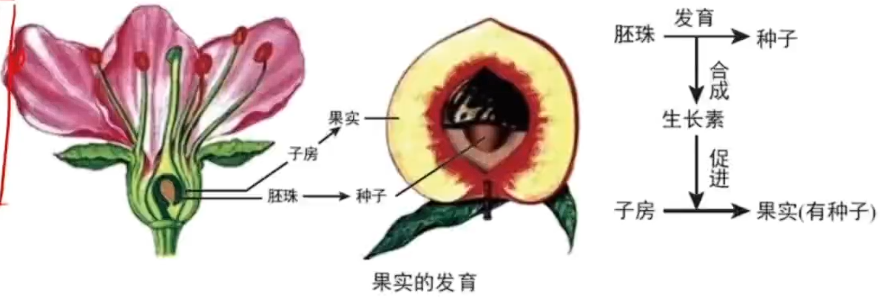
       
- 防止落花落果; 
- 除草剂. 

## 其他植物激素

植物激素指, 由植物体内产生(故人工合成的植物生长调节剂不属于植物激素), 能从产生部位运送到作用部位, 对植物的生长发育有显著影响的微量有机物. 如图为常见的 5 种植物激素. 

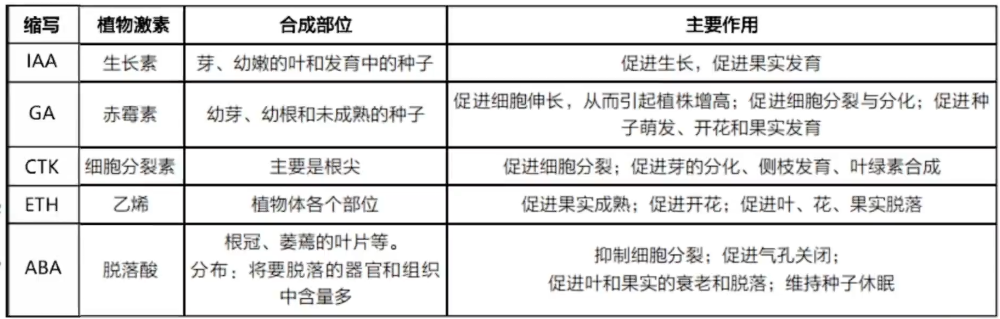

赤霉素(GA)发现于被赤霉菌感染的水稻中. 被赤霉菌感染的水稻患有恶苗病, 其植株高度极高, 但结实率大大下降. 实验证明, 这种症状是由赤霉素引起的, 喷洒赤霉素可以达到同样的效果. 

乙烯(ETH)可以催熟, 故生活中可以使用苹果所释放的乙烯对猕猴桃等水果进行催熟. 注意, 果实的生长与成熟不同, 形象来说, 以苹果为例, 生长指由小果生长为大果, 而成熟是由绿果变为红果. 

除这五类生长素外, 油菜素内酯(BL)作为第六类植物激素, 可以促进茎, 叶细胞的扩展和分裂, 促进花粉管生长, 种子萌发等. 

植物激素间也会互相协同或抗衡. 如生长素, 赤霉素和细胞分裂素可以促进植物的生长, 而脱落酸与乙烯会抑制植物的生长. 

激素之间的比值也会对许多生理过程产生影响. 如在[植物组织培养(超链接待补全)]()中, 生长素(IAA)与细胞分裂素(CTK)的比值需要受到控制, 等于 1 有利于愈伤组织的形成, 生长素占比高时可以促进生根, 细胞分裂素占比高时可以促进生芽; 对于黄瓜雌花与雄花的决定, 是依据其茎端脱落酸(ABA)与赤霉素(GA)的比值来决定, 若脱落酸占比高, 则为雌花, 若赤霉素占比高, 则为雄花. 

## 植物生长调节剂

植物生长调节剂指, 由人工合成的, 对植物的生长发育有条件作用的化学物质. 其优点为原料广泛, 容易合成, 效果稳定等. 生长调节剂的分子结构既可以与植物激素类似, 也可以不同, 但都具有类似的生理效应. 如人工合成的 IAA 属于生长调节剂而非植物激素, 从植物中提取的 IAA 则是植物激素; 与 IAA 作用相似但分子结构不同的 NAA($\alpha -$ 萘乙酸), 与 ABA (脱落酸)作用相似但分子结构不同的的矮壮素等. 下面对一些生长调节剂产品进行介绍: 

- 乙烯利, 其水溶液可以不断释放乙烯气体, 以催熟水果. 
- 赤霉素, 用于处理芦苇可以增加纤维长度, 用于造纸; 处理大麦可以使大麦种子无需发芽即产生 $\alpha -$ 淀粉酶, 用以[啤酒酿造(待补全)](). 
- 青鲜素, 抑制发芽, 延长作物贮藏期. 但其残留可能致癌. 
- 膨大剂, 可以使水果成熟更快. 

## 环境因素对植物生长的影响

植物生长也受环境因素的调节: 

- 光. 如莴笋种子照光才能萌发; 短日照植物如菊花, 需要感受日照缩短才能开花. 光对植物进行调节的机制为: 光敏色素感受光信号, 将信号转导传递至细胞核内, 从而导致基因的选择性表达, 进而表达出相应的效应(即感受信号 $\to$ 信号转导 $\to$ 发生反应). 
- 温度. 如低温诱导后冬小麦萌发; 寒冷年份树木年轮密集, 温暖年份树木年轮稀疏, 因为寒冷使得细胞体积生长与分裂减缓, 故全年细胞体积总增量少于温暖年份, 由此表现出相对的密集与稀疏(年轮的形成原因为, 春夏季温度较高, 细胞分裂快, 细胞体积大, 呈现的颜色浅, 秋冬季温度较低, 细胞分裂慢, 细胞体积小, 呈现的颜色较深, 于是形成深浅交替的年轮); 春化作用, 即低温诱导促使植物开花. 其机制类似于光, 例如: 低温刺激 $\to$ 信号转导 $\to$ 基因表达 $\to$ 赤霉素等激素增加 $\to$ 萌发. 
- 重力. 如芽的背地性与根的向地性. 二者其实本质类似, 对于一段横向生长的部位, 生长素会受重力的影响而向下运输(具体来说存在淀粉 - 平衡石假说, 即根冠与淀粉鞘中的淀粉体因感受重力而下沉, 产生的信号经过转导使基因选择性表达, 进而令生长素横向运输), 进而导致下方的生长素浓度高于上方. 又因为根对生长素的敏感性要高于芽, 故根的下方高生长素浓度会抑制下方伸长, 芽的下方高生长素浓度会促进下方伸长, 从而表现出相应的背地性或向地性. 所以, 根的向地性能体现生长素的两重性, 其上方促进生长而下方抑制生长; 但芽的背地性未能体现, 因为其上下两侧均为促进作用, 只是下方促进的程度更大而已. 

所以说, 植物生长发育的整体调控是由基因表达调控, 激素调节和环境因素调节共同完成的. 

有些题目会对向光性或向地性进行考察, 如图, $\textcircled{1}$ 为直立生长, 因为植物各方向受光均匀; $\textcircled{2}$ 为向右弯曲生长, 因为只要有光射入必定在右侧, 否则一定为无光射入的黑暗环境; $\textcircled{3}$ 为向小孔弯曲生长, 因为总是一个方向面对小孔, 全盒内或从小孔射入光至单一部位, 或为黑暗; $\textcircled{4}$ 为直立生长, 因为受光均匀, 且离心作用平衡. 在太空中, 由于失重的环境, 幼苗横向生长(前提为光照均匀). 当然, 有些题目需要考虑离心作用对生长素分布的影响, 本质上还是淀粉体的离心移动所引起的生长素迁移, 可以大致理解为生长素做离心运动. 例如, 将胚芽鞘置于圆盘的圆心部位, 其直立生长; 若在非圆心部位, 其生长素向离心方向迁移, 胚芽鞘向心生长. 