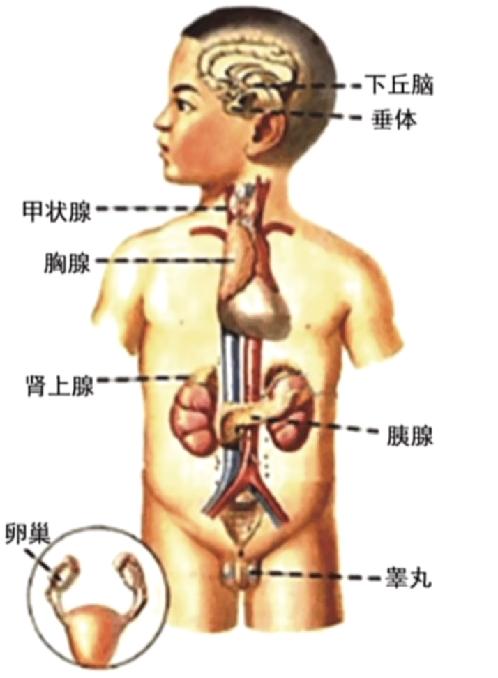
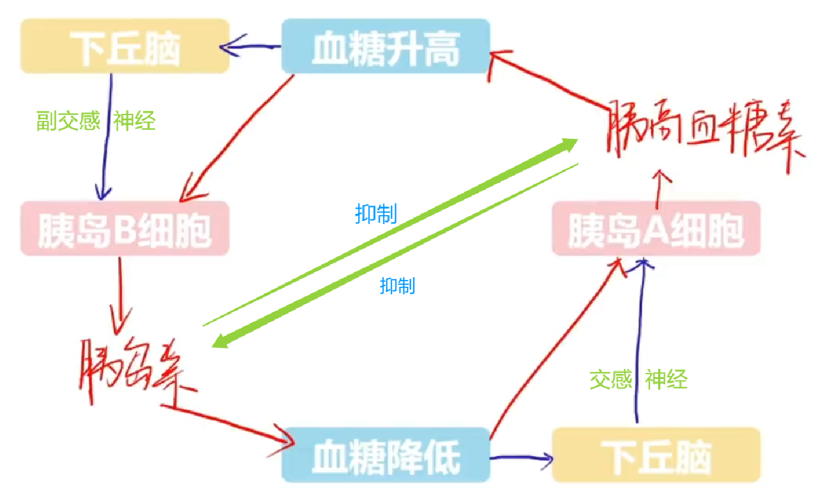
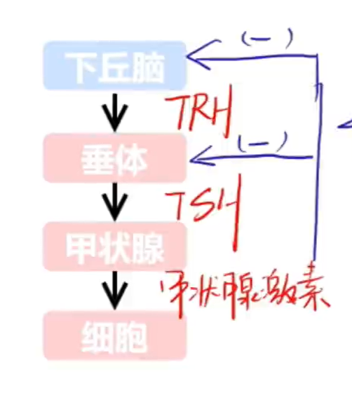
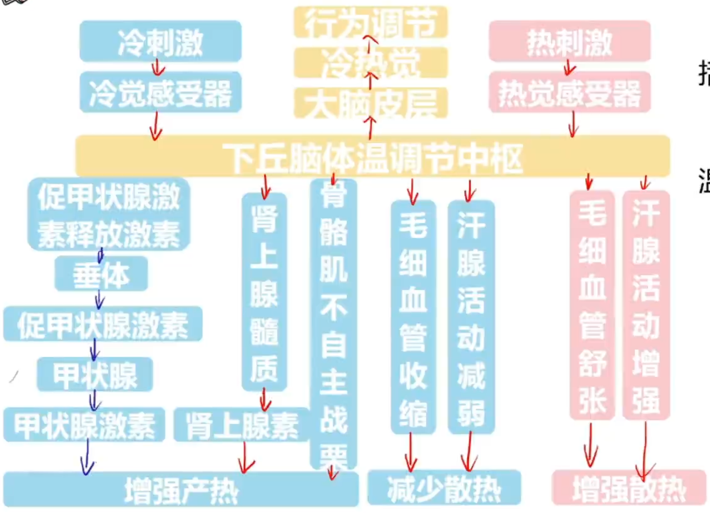
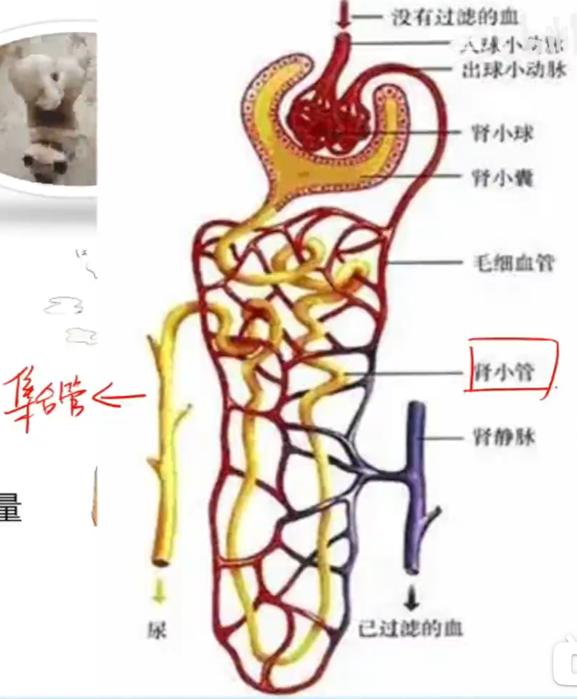
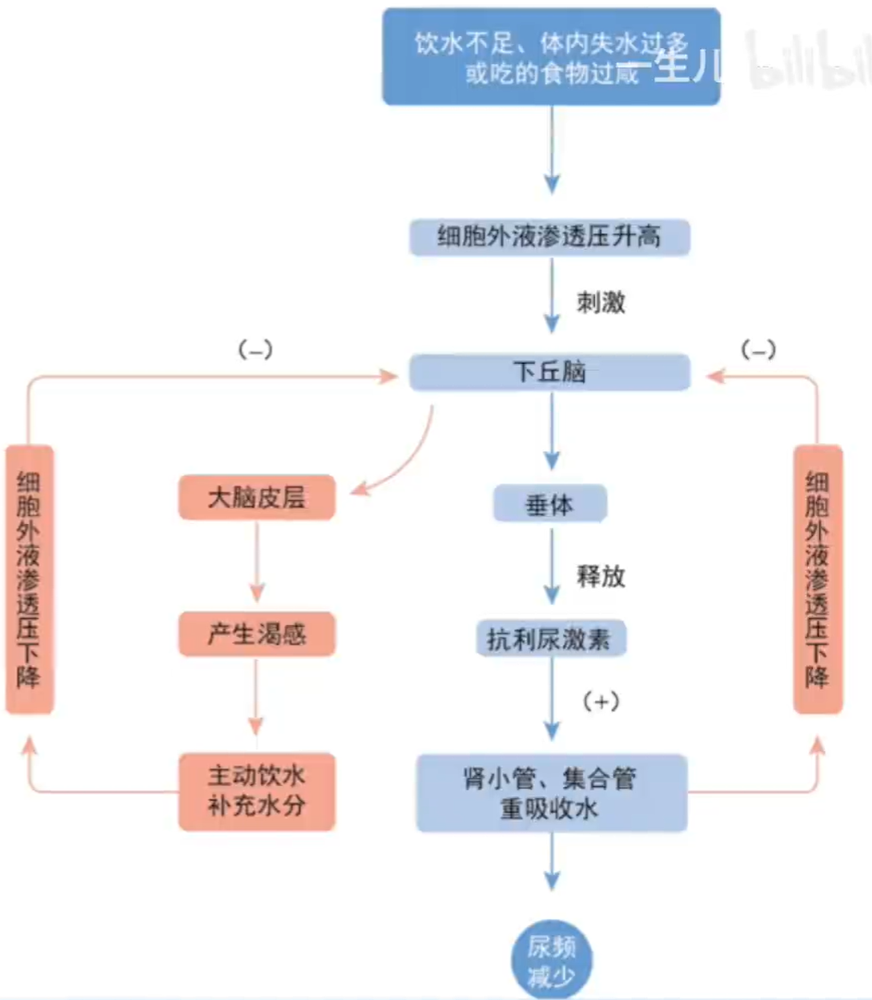
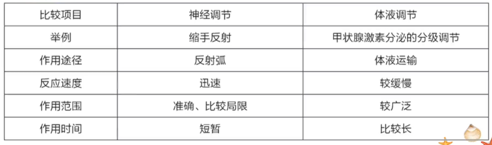

# 激素调节

## 动物激素

由内分泌器官(或细胞)分泌的化学物质(激素)进行调节为激素调节. 

内分泌腺与外分泌腺的区别在于, 内分泌腺腺体内无导管, 分泌物(激素)直接进入腺体内的毛细血管, 随血液循环运输到全身; 而外分泌腺腺体内有导管, 分泌物通过导管排出体外. 如垂体, 甲状腺等为内分泌腺, 而消化腺, 汗腺, 皮脂腺, 泪腺等为外分泌腺(消化道也属于体外). 

激素在动物体内含量较少, 故较难发现. 沃泰默起初认为胰液是由胃酸(HCl)引发神经调节从而引发分泌(有误), 故他设计如下实验: 

A 组使用 HCl 刺激狗上段小肠肠腔, 发现胰腺分泌胰液; B 组使用 HCl 注入狗小肠血液中, 发现胰腺不分泌胰液; C 组使用 HCl 刺激切除神经后的狗小肠肠腔中, 发现胰腺仍分泌胰液. 

实际上, 此实验可以证明胰液的分泌不完全受神经调节, 但沃泰默碍于时代, 仍然坚持认为胰液的分泌完全受神经调节, 出现 C 组的结果实为小肠中微小神经未切除完全, 最终与真理擦肩而过. 

后来, 斯他林和贝利斯认为胰液的分泌也受激素调节, 即 HCl 刺激小肠粘膜细胞从而产生一种化学物质, 其进入血液后循环至胰腺, 进而引起胰液的分泌. 故他们将 HCl 与 小肠粘膜刮落物混合, 注入狗静脉后发现胰腺分泌胰液. 至此, 他们发现了人类发现的第一种激素, 促胰液素. 实际上, 胰腺分泌胰液同时受到神经调节和激素调节的共同调控. 

### 内分泌腺

如图为人体中主要的内分泌腺, 下面逐一讲解. 

- 下丘脑. 下丘脑既是神经中枢也是内分泌腺, 既可以参与神经调节也可以进行激素调节. 它可以产生以下激素: 

    - 促甲状腺激素释放激素(TRH), 促性腺激素释放激素, 促肾上腺皮质激素释放激素. 三者均作用于垂体, 参与下丘脑 - 垂体 - 靶腺轴的分级调节(详见后文). 
    - 抗利尿激素. 注意, 抗利尿激素由下丘脑产生, 但由垂体释放. 抗利尿激素可以促进肾脏中肾小管与集合管对水的重吸收作用, 从而减少尿量, 调节体内渗透压(水盐平衡); 

- (脑)垂体. 垂体与下丘脑紧邻, 可以产生以下激素: 

    - 促甲状腺激素(TSH), 促性腺激素, 促肾上腺皮质激素. 在接收到下丘脑释放的促甲状腺激素释放激素(TRH), 促性腺激素释放激素, 促肾上腺皮质激素释放激素后, 垂体会分泌这三种激素, 并作用于对应的靶腺(甲状腺, 性腺, 肾上腺皮质)细胞, 以促进靶腺的生长发育以及对应激素的分泌. 
    - 生长激素. 可以促进生长, 主要促进骨骼伸长, 蛋白质合成, 肌肉生长等. 在儿童时期, 若生长激素分泌不足则会患侏儒症(体格较小但智力正常); 儿童时期分泌过多则会患有巨人症; 在成人时期, 生长激素分泌不足则会患肢端肥大症. 

- 甲状腺. 甲状腺主要分泌甲状腺激素. 甲状腺激素可以促进体内有机物代谢, 促进生长发育(相较于生长激素, 更侧重与各系统的发育, 而非体格的生长)并提高神经系统兴奋性. 甲状腺激素中含有碘, 其合成受体内碘元素(I)的含量影响较大. 若甲状腺激素含量过多, 则会患有甲状腺功能亢进(甲亢); 若甲状腺激素含量过少(缺碘), 则会患地方性甲状腺肿(大脖子病), 甚至出现甲状腺功能减退(甲减); 若在幼儿时期缺少甲状腺激素, 则会患呆小症(体格与智力发育均不正常, 注意与侏儒症区分). 

- 肾上腺. 肾上腺分为肾上腺皮质与肾上腺髓质两部分. 

    - 肾上腺髓质. 主要产生肾上腺素, 用于增强心脏活动, 使动脉收缩, 血压升高; 促进细胞代谢; 促进肝糖原分解, 使血糖升高. 
    - 肾上腺皮质. 主要分泌以下激素: 

        - 盐皮质激素. 主要为醛固酮, 可以调节水盐代谢, 参与水盐平衡(主要促进肾小管与集合管钠离子($Na^+$)的重吸收以及钾离子($K^+$)的分泌, 即保钠排钾). 
        - 糖皮质激素. 主要为皮质醇, 可以条件有机物代谢, 可以对血糖进行一定程度的升高. 

- 胰腺. 胰腺既有外分泌部分泌胰液, 也有内分泌部(胰岛)分泌胰岛素与胰高血糖素. 

    - 胰岛素. 由胰岛 B 细胞分泌, 可以降低血糖. 与可以升高血糖的激素不同, 这是人体内唯一可以降低血糖的激素. 
    - 胰高血糖素. 由胰岛 A 细胞分泌, 可以升高血糖. 

- 性腺. 对于雌雄个体, 所拥有的性腺不同: 卵巢可以分泌雌激素与孕激素; 睾丸可以分泌雄激素(如睾酮). 性激素可以促进性器官的发育与生殖细胞的形成, 激发并维持第二性征. 

### 调节过程

#### 血糖平衡

人体内血糖含量维持在 3.9 ~ 6.1 mmol/L 间(即 0.8 ~ 1.2 g/L). 

血糖的来源有: 

- 食物中糖类的消化吸收(主要); 
- 肝糖原分解(一般肌糖原分解不会直接改变血糖, 而是专用于为肌细胞提供能量);
- 脂肪酸等非糖物质的转化. 

血糖的去路有: 

- 氧化分解, 用于细胞呼吸以提供能量; 
- 合成肝糖原与肌糖原; 
- 转化为甘油三酯(即脂肪). 

对来源于去路分别进行分析时分析某数值增减变化的优秀方式. 

血糖可以由胰高血糖素, 糖皮质激素, 肾上腺素与甲状腺素等激素调节以升高; 由胰岛素调节以降低. 其中最主要的是胰岛素与胰高血糖素的调节, 且胰岛素是人体内唯一可以降低血糖的激素. 

具体来说, 胰岛素可以通过以下方式降低血糖: 

- 促进去路: 
    - 促进血糖的氧化分解; 
    - 促进糖原的合成; 
    - 促进转化为甘油三酯等; 
- 抑制来源: 
    - 抑制肝糖原分解; 
    - 抑制非糖物质的转化; 

注意, 胰岛素无法抑制对于食物中糖类的消化吸收, 因为其无法使你不进食, 亦不能令食物堆积与消化道内, 以免引起更严重的疾病. 

胰高血糖素的调节方式如下: 

- 促进来源: 
    - 促进肝糖原分解(无法也无需促进肌糖原分解, 原因上文介绍过); 
    - 促进非糖物质的转化; 

胰高血糖素同样无法促进食物中糖类的消化吸收, 因为你所进食的食物总量大致不变, 且糖类大都能被消化吸收. 胰高血糖素还无法抑制任何血糖的去路, 因为提升血糖的主要目的就是是葡萄糖进入细胞以氧化分解; 糖原的合成与非糖物质的转化是在血糖有盈余时才会发生, 故无需也无法抑制. 

故胰岛素浓度可由以下三个因素控制: 

- 血糖浓度; 
- 下丘脑中的血糖感受器通过副交感神经调节; 
- 胰高血糖素的抑制. 

类似地, 胰高血糖素浓度可由以下三个因素控制: 

- 血糖浓度; 
- 下丘脑中的血糖感受器通过交感神经调节; 
- 胰岛素的抑制. 

血糖的匮乏较高血糖对人体是更危险的, 所以提升血糖所使用的胰高血糖素由交感神经控制, 而降低血糖所使用的胰岛岛素由副交感神经控制. 

综上, 血糖平衡受神经 - 体液调节. 

血糖持续过高可能导致糖尿病, 其症状为持续高血糖且伴随糖尿(正常人的尿液中也可能存在尿糖, 可能由于暴饮暴食或情绪低落导致, 故糖尿不一定患糖尿病). 糖尿病分为两种: 

- I 型糖尿病. 胰岛素分泌不足导致, 常发病于青少年时期, 故称为青少年型糖尿病. I 型糖尿病可以通过直接注射胰岛素来治疗.  
- II 型糖尿病. 胰岛素受体异常导致. 患者体内胰岛素含量正常甚至偏高, 由于激素需要与细胞中受体结合以发挥作用, 所以患者患有糖尿病, 且注射胰岛素无法治疗 II 型糖尿病.  

#### 分级调节

不仅神经调节中存在分级调节, 体液调节中也存在分级调节. 分级调节即在大脑皮层的影响下, 下丘脑控制垂体, 垂体控制相应腺体的过程. 换言之, 通过下丘脑 - 垂体 - 靶腺轴进行的激素调节就是分级调节. 甲状腺激素, 肾上腺皮质激素, 性激素(孕激素)均由此途径调节分泌. 这里以甲状腺激素为例. 

可以发现, 下丘脑 - 垂体 - 靶腺轴中也存在负反馈调节. 反馈调节指在一个系统中, 系统本身工作的效果, 反过来有又作为信息调节该系统的工作的调节方式. 反馈调节分为正反馈调节与负反馈调节. 正反馈调节较罕见, 如排尿(排便)反射, 分娩, 血液凝固, 动作电位的形成, 水华(赤潮)对生态的破坏等. 

负反馈调节更加常见. 这里同样以甲状腺激素为例, 当甲状腺激素分泌过多时, 会抑制下丘脑与垂体分泌 TRH 与 TSH, 进而使甲状腺激素分泌减少, 这保证了甲状腺激素等激素的相对稳定. 

#### 体温调节

人体的体温相对恒定, 是机体产热量与散热量保持动态平衡的结果. 其中代谢产热是机体热量的主要来源. 在静息状态, 肝, 脑等器官的活动提供热量; 运动状态下, 骨骼肌为主要的产热器官. 而皮肤是人体最主要的散热器官. 皮肤可以通过以下方式进行散热: 

- (汗液)蒸发, 液体的蒸发需要吸收热量, 这是在高温下主要且最有效的散热方式; 
- 对流, 冷风可以带走热量; 
- 辐射, 通过辐射带走热能; 
- (热)传导, 将热量传递至其他物体. 

机体同样可以通过对热量的来源与去路进行调节来调节体温. 如图. 

没有减少产热的原因是, 机体一般不会抑制细胞呼吸, 即很难降低代谢产热, 且大脑, 肝脏, 骨骼肌等器官需要正常运行. 

在过往的教材版本中, 出现了立毛肌相应的反应. 对于人类, 在寒冷条件下立毛肌收缩, 进而导致"鸡皮疙瘩"的形成(鸟类表现为羽毛立起, 蓬松); 在炎热条件下立毛肌舒张. 但这对于体毛较少的人类来说意义不大. 

冷觉感受器与热觉感受器位于皮肤, 黏膜, 内脏等部位, 通过传入神经将神经冲动传递至下丘脑体温调节中枢, 进而进行一系列的调节过程. 当然, 此过程中还存在行为调节. 下丘脑会将信号传递至大脑皮层体温感觉中枢中, 以产生冷觉与热觉, 进而提醒个体进行相应的调节温度的行为. 注意区分两个中枢所在的位置, 以及冷觉与热觉产生的部位. 总的来说, 体温调节的条件方式为神经 - 体液调节. 

注意, 不论处于何种温度下, 机体的产热等于散热, 除非出现个体发热(体温升降的过程不等, 维持在高烧或低烧时仍然相等)等症状. 在不同温度下, 散热量不同, 进而导致了产热量的不同. 具体来说, 在寒冷环境中, 散热会增加(因, 是物理规律导致), 机体通过体温调节使产热增加, 以保持体温的恒定; 在炎热环境中, 散热会减少, 机体通过体温调节使产热减少, 以保持体温的恒定. 

### 水盐平衡

人体内水的来源有饮水(主要), 食物与代谢产水等; 去路有肾脏排尿(主要), 皮肤排汗, 肺(呼吸)排出, 大肠排便等. 

而无机盐(以 $Na^+$ 为主)的来源为食盐, 几乎全部由小肠吸收; 去路主要为经肾脏随尿液排出, 且排出量几乎等于摄入量. 

如图, 渗透压调节为神经 - 体液调节, 主要由肾脏完成. 需要注意的是, 抗利尿激素由下丘脑产生, 但不由下丘脑释放, 而是由垂体释放. 渗透压感受器位于下丘脑中, 水盐平衡的调节中枢也位于下丘脑中, 但区域不同. 而产生渴觉的中枢则是大脑皮层. 实际上, 图中缺少了醛固酮(肾上腺皮质激素). 醛固酮可以促进肾小管与集合管对 $Na^+$ 的重吸收作用, 维持血钠含量的平衡(注意只有钠离子, 其他例子不一定, 如醛固酮保钠排钾, 可以促进钾离子的排出). 

### 激素调节的特点

不同激素间的关系可以分为: 

- 相协同(协同作用). 即发挥的作用相同, 如可以升高血糖的多种激素相协同; 甲状腺激素与生长激素在促进生长发育上表现为协同作用; 甲状腺激素与肾上腺素均能促进新陈代谢, 表现为协同作用. 
- 相抗衡(拮抗作用). 即发挥的作用相反, 如胰岛素与可以升高血糖的激素相抗衡等. 

激素调节有以下特点: 

- 微量且高效. 激素在血液中含量极低, 但微量的激素能显著加强细胞内的生化反应, 对机体代谢, 生长和繁殖等重要生理过程有着巨大影响. 
- 通过体液运输. 激素经细胞分泌后弥散到血液中, 流遍全身, 可运输到全身各个细胞. 
- 作用与靶器官, 靶细胞. 即便激素遍布全身血液, 但激素需要与受体结合才能发挥作用. 
- 作为信使传递信息. 即激素是信息分子, 其不参与代谢过程, 亦不催化代谢进行. 
- 代谢失活. 激素在发挥作用后立即失活, 以免代谢紊乱. 

### 神经 - 体液调节

可以注意到, 在前文中我们使用体液调节来代替激素调节, 因为体液调节包含激素调节. 体液调节指, 某些化学物质(包括激素, $CO_2, H^+$ , 组(织)胺等)通过体液(注意除血液外还有组织液, 淋巴液, 脑脊液等)的传送, 对人和动物体的生理活动所进行的调节. 注意, 除了激素外, 其他化学物质进行调节也包含于体液调节中. 

很多时候, 神经调节的效应器是内分泌腺, 促使内分泌腺分泌激素, 这就是常见的神经 - 体液调节. 注意, 仅到分泌激素并不是完整的体液调节, 截止于此仅为神经调节, 因为体液调节的关键在于化学物质(激素)发挥作用. 

神经调节与体液调节有以下关系: 

- 许多内分泌腺直接或间接受中枢神经系统的调控. 
- 内分泌腺所分泌的激素也可影响神经系统的发育与功能. 
- 动物体的各项生命活动常常同时受神经和体液调节, 两种调节方式相互协调, 使各器官, 系统的活动协调, 内环境稳态得以维持, 细胞新陈代谢才能正常进行, 保证了机体的各项生命活动正常进行, 适应环境的不断变化. 

### 激素的研究方法

切除法的思路为: 

- 实验组: 手术摘除内分泌腺. 更精确地, 可以在摘除后一段时间, 出现对应症状后重新移植(或者注射/饲喂某种激素), 若症状消失则可进一步证明结论. 
- 对照组: 假手术, 即只做手术切口, 不摘除内分泌腺. 

注射法/饲喂法的思路为: 对实验中饲喂或注射某种激素, 观察变化; 对照组注射或饲喂溶剂(若为水则注射 $0.9%$ 的生理盐水)或饲料. 

可以通过激素的化学本质区分是否可以饲喂. 

图中蛋白质或多肽类激素是大分子, 不可以直接饲喂(口服), 否则会消化导致失活, 必须注射; 氨基酸类衍生物与类固醇是小分子, 可以被直接吸收且保存活性, 可以饲喂(口服). 由图可知, 甲状腺激素, 肾上腺激素, 肾上腺皮质激素, 性激素可以口服, 其余均需要注射. 