# 遗传

## 分离定律

孟德尔使用豌豆进行遗传学研究. 豌豆作为遗传实验材料的优点有: 

1. 两性花, 自花传粉, 闭花授粉(先授粉后张开花瓣), 在自然状态下一般都是纯种(纯合子, 能稳定遗传).
2. 相对性状易于区分, 并且能够稳定遗传.
3. 豌豆花大, 便于人工授粉.
4. 一次繁殖产生子代多, 种子留在豆荚内, 便于统计分析.

相对性状是 **同种** 生物 **同一** 性状的不同表现类型. 一般来说可以有显性性状与隐性性状两种(特殊情况会特殊说明). 

### 杂交实验

豌豆是两性花, 可以自交, 亦可以杂交. 豌豆在自然状态下自交, 若需要杂交, 则首先在 **花蕾期** (开花前)对母本去雄(剪去花药防止自交), 然后母本套袋以防外来花粉干扰. 待雌蕊成熟进行人工异花传粉, 随后套袋. 

孟德尔的杂交实验过程(遗传图解)如下图. 

我们使用 $P$ 代表亲本, $F_1, F_2$ 代表子一代, 子二代; $\times$ 表示杂交, $\otimes$ 表示自交(非严格地, 基因型相同也作为自交). 

孟德尔提出如下假说:

1. 生物的性状是由遗传因子(基因)决定的.
2. 体细胞中遗传因子(基因)是成对存在的.
3. 生物体在形成配子(生殖细胞)时, 成对的遗传因子(基因)彼此分离, 分别进入不同地配子中. 即, 配子中只含有每对遗传因子(基因)中的一个.
4. 受精时, 雌雄配子的结合是随机的.

故可以使用大写字母表示显性基因, 小写字母表示隐性基因, 使用相同字母的大小写表示等位基因(同源染色体相同位置的基因, 共同决定相对性状). 以 $D$ 与 $d$ 为例, $DD$ 与 $Dd$ (或写作 $D\_$ , $\_$ 代表 $D$ 或 $d$ )为显性个体, $dd$ 为隐性个体. 

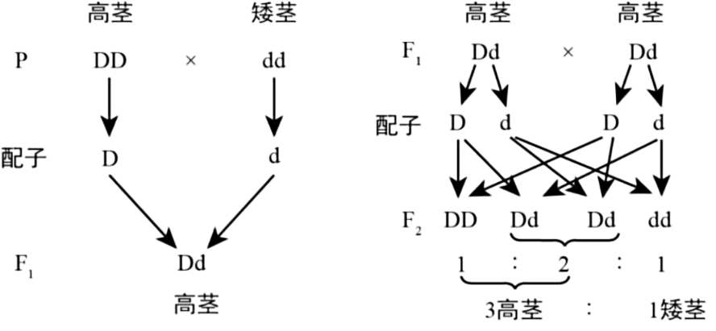

在杂交实验中, 亲本分别为显性纯合子(此处记作 $DD$ )与隐形纯合子 (此处记作 $dd$ ). 杂交后得到的子一代 $Dd$ 表现为显性性状; 令子一代自交, 得到的子二代基因型比例为 $DD : Dd : dd = 1 : 2 : 1$ , 表现型比例为高茎(显性) : 矮茎(隐性) $= 3 : 1$ . 

在上述实验中, 子二代出现性状分离, 即杂种自交后代中, 同时出现显性性状与隐性性状的现象. 自交后出现了新的性状即意味着性状分离, 代表着亲本为杂合子, 且新出现的性状为隐性性状. 

### 测交实验

为验证杂交实验提出的假说, 孟德尔设计了测交实验, 并根据假说预测性状分离比为 $1 : 1$. 

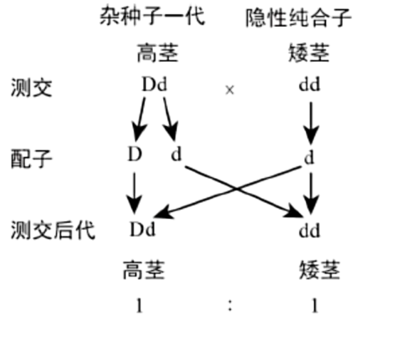

使用杂种(杂合子)与隐性纯合子进行测交, 得到显性 : 隐性 $= 1 : 1$ 的结果, 即 $Dd : dd = 1 : 1$ , 符合分离比为 $1 : 1$ 的假说预测. 由此假说可以总结出分离定律: 在生物的体细胞中, 控制同一性状的遗传因子成对存在, 不相融合; 在形成配子时, 成对的遗传因子发生分离, 分离后的遗传因子分别进入不同的配子中, 随配子遗传给后代. 

由此可知分离定律的实质为基因型为 $Dd$ 的个体产生配子 $D$ 与 $d$ 的比例为 $1 : 1$ . 测交实验直接反应了待测个体的配子比例, 由此测得其基因型. 

### 假说 - 演绎法

以上过程使用了假说 - 演绎法, 其过程如下:

1. 孟德尔在杂交实验中观察现象, 发现问题;
2. 随后提出假说以解释问题;
3. 然后演绎推理, 设计测交实验并预测其结果;
4. 最后进行测交实验, 验证了推理的正确性;
5. 总结规律, 提出自由组合定律.

当然, 假说大多时候是错误的, 在无法验证其正确性时, 需要重新设计假说, 推倒重来. 

### 应用

#### 判断显隐性状

有以下两种方法判断那种性状为显性性状: 

- 纯合子杂交法. 令两个性状不同的纯合子进行杂交, 得到的子代性状即为显性性状, 消失的性状为隐性性状. 
- 自交法. 自交法的适用前提为, 个体可以自交, 且需要统计大量后代而非个例. 令杂合子自交, 出现性状分离, 则新增的性状为隐性性状( **无中生有为隐性** ). 若令纯合子自交, 不会出现性状分离, 无法判断显隐性性状. 类似地, 还可以得到 **有中生无为显性** , 指的是显性的双亲(Aa)生出隐性的孩子(aa). 

#### 确定基因型

若有一个显性个体, 想要确定其基因型, 可以考虑使用以下方式:

- 与隐性个体进行测交, 观察是否有隐性个体出现.
- 令待测个体自交(如果可以), 观察是否性状分离.

隐性个体基因型确定, 无需测定. 

#### 连续自交

若令杂合子 $Dd$ 连续自交 $n$ 代, 第 $n + 1$ 代中, 杂合子 $Dd$ 所占比例为 $\frac{1}{2^n}$ (每自交一次, 都有 $\frac{1}{2}$ 的个体变为纯合) ; 纯合子 $DD$ 与 $dd$ 所占比例相同, 均为 $\frac{1}{2} (1 - \frac{1}{2^n})$ . 故随着连续自交, 纯合的比例会越来越高. 

#### 自由交配

在自然界中, 种群间一般会发生自由交配(随机交配). 我们可能需要在已知自由交配前基因型比例的情况下, 计算自由交配后基因型比例. 我们通常使用配子法解决. 

首先计算各个配子的比例(基因频率), 如 $P_D$ 与 $P_d$ 等, 可以直接使用分离定律计算, 也可以通过所有配子比例加和为 $1$ 来计算. 然后列出如下棋盘, 分别列出雌, 雄配子并相乘, 若对某个性别有特殊要求需要考虑, 如致死等.

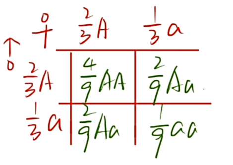

最后从棋盘中获取答案即可. 

#### 不完全显性

先前我们讨论的性状均为完全显性. 有些性状表现为不完全显性, 即 $DD$ 与 $Dd$ 的表型不完全相同, $D$ 显性基因越多, 显性性状越明显, 如鸡的黑羽, 灰羽与白羽等. 

这时, 我们只需要正常考虑即可. 不过在最后由基因型得到表型时, 需要特殊考虑不完全显性的杂合子及其比例. 

#### 复等位基因与共显性

实际上, 等位基因不一定仅有两个, 还可能存在复等位基因. 以人的血型为例, 由 $I^A, I^B, i$ 三个复等位基因控制, 其中 $i$ 为隐性基因. 如此, 表型也有多种, 分为 $O$ 型血( $ii$ ), $A$ 型血( $I^AI^A$ 或 $I^Ai$) , $B$ 型血( $I^BI^B$ 或 $I^Bi$ )与 $AB$ 型血 ( $I^AI^B$ ). 

共显性是指两种显性性状同时发生, 同时拥有两个不同的显性基因. 有些时候, 共显性的发生是因为复等位基因的存在. 如不同血型红细胞上存在不同抗原, 如 $O$ 型血无抗原, $A$ 型血存在一种抗原, $B$ 型血存在另外一种抗原, $AB$ 型血同时存在以上两种抗原. 

#### 环境与性别影响

对于相同的基因型, 其表型也可能由于环境影响而不同. 如羊有无角, 由于性激素的影响, $Hh$ 基因型在公羊上表现为有角而母羊无角. 由此可能造成雌雄之间的差异. 

#### 致死

致死问题题目可能会明说某基因型致死, 也可能会出现特殊的比例, 要求从题干中特殊的比例得出某种基因型致死. 有可能是特定基因型的个体致死, 也可能是特定基因的配子致死. 对于配子致死, 可以考虑在配子结合时就不予考虑(如在后文中不再列入棋盘等). 

注意, 花粉不育为雄配子致死, 不影响雌配子. 

无繁殖能力也是特殊的致死(对种群繁衍无直接影响), 不过其个体仍然需要记入占比, 与致死后不计入占比进行对比. 

## 自由组合定律

孟德尔随后继续使用假说 - 演绎法对豌豆的两对相对性状进行研究, 令两种纯合子(YYRR 与 yyrr)进行杂交, 并令子一代(YyRr)自交, 结果(遗传图解)如图: 

我们将黄色圆粒与绿色皱粒这种与亲本表现型一致的子代性状称为亲本(类)型, 反之为重组(类)型. 孟德尔提出以下假说(假设圆粒与皱粒分别由遗传因子 R 与 r 控制, 黄色与绿色分别由遗传因子 Y 与 y 控制): 

1. 子一代在产生配子时, 每对遗传因子彼此分离, 不同对的遗传因子可以自由组合; 
2. 受精时, 雌雄配子的结合是随机的. 

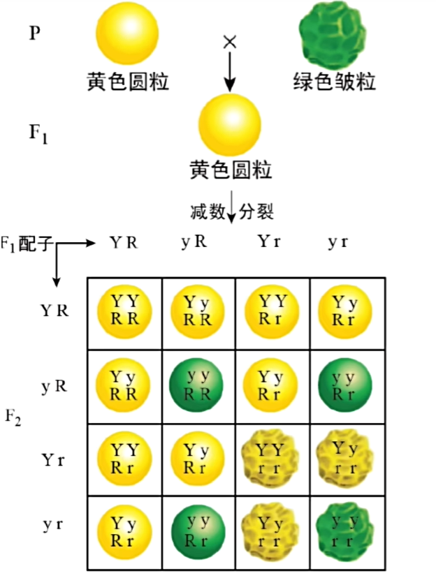

上图中, 棋盘展示了子二代四种表现型的来由. 通过计数可知, 其中一条对角线全部为且仅此对角线为纯合子, 即有 $\frac{4}{16} = \frac{1}{4}$ 为纯合子, 且每种表型各一个. 双杂合(YyRr)占 $\frac{4}{16} = \frac{1}{4}$ . 共有 16 种结合方式, 9 种基因型, 4 种表现型, 这些数字可以由一对性状的研究结果通过乘法原理对应得到, 即 $16 = 4 \times 4$ (一对性状时有 4 种结合方式), $9 = 3 \times 3$ (一对性状时有 3 种基因型), $4 = 2 \times 2$ (一对性状时有 2 种表现型). 实际上, $9 : 3 : 3 : 1$ 的分离比也可由 $(3 : 1) \times (3 : 1)$ 得到. 

同时, 我们可以根据棋盘得到所有基因型占所有结合方式中的几份, 如图. 

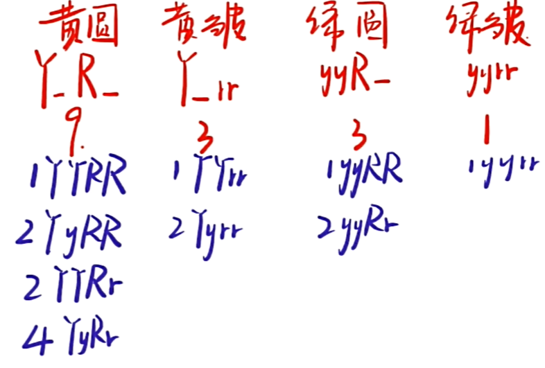

致死问题涉及到的特殊比例一般由此变形而来, 可由此推得致死原因. 

随后, 可以设计测交实验进行演绎. 使用杂合子子一代(YyRr)与隐形纯合子(yyrr)进行测交, 预测性状分离比为 $1 : 1 : 1 : 1$ . 

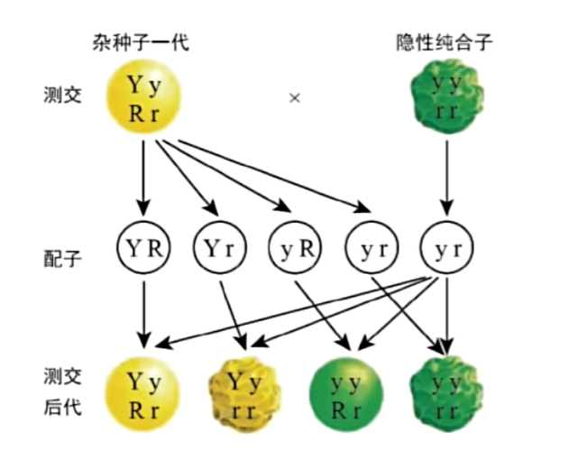

由此, 可以得出自由组合定律: 

1. 控制不同性状的遗传因子(基因)的分离和组合是互不干扰的; 
2. 在形成配子(减数分裂)时, 决定同一性状的成对遗传因子(基因)彼此分离, 决定不同性状的遗传因子(基因)自由组合. 

计算配子种数时, 也会使用乘法原理. 如 AaBBCc , 对于 A/a 基因有 2 种选择, 对于 B/b 仅一种选择, C/c 有两种选择, 故共 $2 \times 1 \times 2 = 4$ 种配子. 对于多对等位基因的题目, 有时不会明显地提示, 而是通过矛盾来引导. 若发现只使用两对等位基因无法得出相对应的结果时, 考虑增添等位基因. 

对于一些比例, 我们考虑分别研究一对相对性状. 如马铃薯的紫茎(A)与绿茎(a), 缺刻叶(B)与马铃薯叶(b), 紫茎缺刻叶 : 紫茎马铃薯叶 : 绿茎缺刻叶 : 绿茎马铃薯叶的比例为 $3 : 1 : 3 : 1$ (由 $(3 : 1) \times (1 : 1)$ 得到), 那么可以得出紫茎 : 绿茎的比例为 $(3 + 1) : (3 + 1) = 1 : 1$ , 推测亲本此对基因型为 Aa 与 aa, 缺刻叶 : 马铃薯叶的比例为 $(3 + 3) : (1 + 1) = 3 : 1$ , 故推测亲本此对基因型为 Bb 与 Bb, 综合为 AaBb 与 aaBb. 同理, 若出现 $1 : 1 : 1 : 1$ , 考虑由 $(1 : 1) \times (1 : 1)$ 得到, 推测亲本基因型为 AaBb $\times$ aabb 或 Aabb $\times$ aaBb (两种搭配方式). 实际上, 若题目出现 $\frac{1}{16}, \frac{3}{16}, \frac{9}{16}$ 时意味着性状分离比为 $9 : 3 : 3 : 1$ ( $9 + 3 + 3 + 1 = 16$ ); 出现 $\frac{1}{8}, \frac{3}{8}$ 时意味着性状分离比为 $3 : 1 : 3 : 1$ ( $3 + 1 + 3 + 1 = 8$ ); 出现 $\frac{1}{4}$ 时意味着性状分离比为 $1 : 1 : 1 : 1$ ( $1 + 1 + 1 + 1 = 4$ ). 

题目会对比例进行变形, 一般为将两项相加, 多种基因型共同表现为同一相对性状. 如 $12 : 3 : 1$ , 就将 $9$ 与 $3$ 相加得到. 故此种比例只需将所有数字相加, 若为 $16$ 则其原型为 $9 : 3 : 3 : 1$ ; 否则可能为其他比例的变形或有关致死问题. 

### 电泳图

可以使用 DNA 杂交探针进行 DNA 分子杂交技术, 使用[琼脂糖凝胶电泳技术(超链接待完善)]()显示结果, 得到如下的电泳图: 

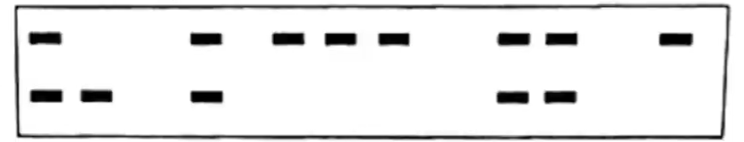

一般来说, 每一行代表一个基因, 每一列表示一个个体, 不同行间可以是等位基因, 也可以是非等位基因. 若条带存在则证明该个体存在条带所在的行所对应的基因. 

## 基因在染色体上

萨顿对蝗虫的生殖细胞进行研究, 发现基因与染色体行为相似. 例如: 

- 基因在杂交过程中保持完整性和独立性, 染色体在配子形成和受精过程中有相对稳定的形态结构; 
- 二者均在体细胞中成对存在, 在配子中存在一个; 
- 体细胞中的一对一者来自于父方, 一者来自于母方. 
- 非等位基因在形成配子时自由组合, 与非同源染色体在减数分裂 I 后期自由组合. 

基因与染色体行为平行, 故推断基因在染色体上, 使用了类比推理法, 通过可观察的染色体推理不可观察的基因. 当然, 此方法的正确性不高, 因此需要进一步验证. 故摩尔根开始对果蝇的遗传行为进行研究. 

果蝇作为遗传实验材料的优点有: 易饲养, 繁殖快, 子代数目多. 

于是摩尔根使用纯合子开始了以下实验: 

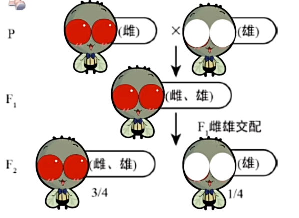

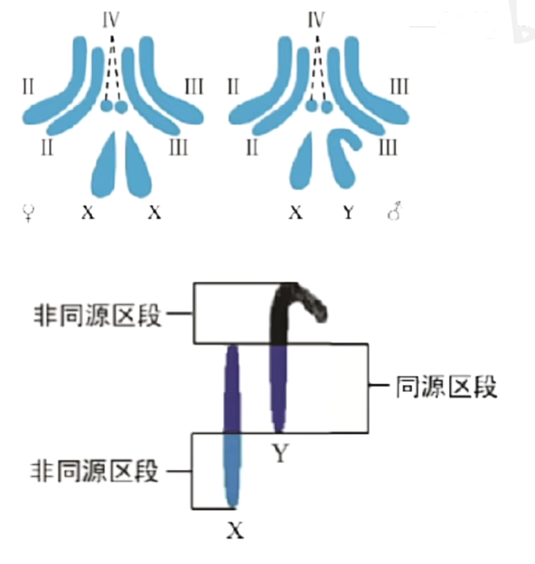

上图展示了果蝇染色体的形态. X 与 Y 为性染色体, 其余为常染色体. 可以发现, X 与 Y 的形态并不一致, 各自存在各自的特有区段. 这意味着, 在 X 特有区段上的基因不存在于 Y 上, 在 Y 特有区段上的基因不存在于 X 上, 而在同源区段上的基因则同时存在于 X 与 Y 上.  故我们可以分别假设控制眼色的基因位置. 使用 $X^A$ 与 $X^a$ 表示 X 上的 A 基因与 a 基因, $Y^A$ 与 $Y^a$ 表示 Y 上的 A 基因与 a 基因. 若此基因在 X 上不存在, 则仅写作 $X$ , $Y$ 同理. 

特殊地, 若基因位于 Y 特有区段中, 则雌性无对应的性状, 因为无 Y 染色体; 但若位于 X 特有区段或同源区段中, 则雌性与雄性均可能有对应的性状. 

通过推理, 我们排除了基因位于 Y 特有区段中的可能性, 但不能排除基因位于 X 特有区段或同源区段中的可能性, 故设计测交实验: 

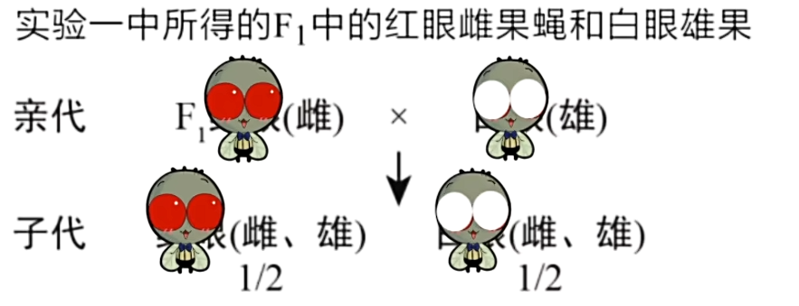
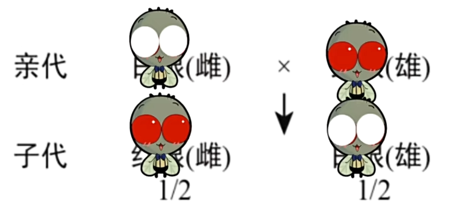

实际上, 第一个实验也是回交实验. 我们最终判定控制眼色的基因位于 X 特有区段中. 

摩尔根发明测定基因位于染色体上的相对位置的方法, 并认为基因在染色体上呈线性排列. 

## 伴性遗传

道尔顿首先发现了色盲患者的存在. 实际上, 决定某些遗传病(性状)的基因位于性染色体上, 遗传上总与性别有关, 故称为伴性遗传. 具体地, 可以分为 伴 X 隐性/显性遗传, 伴 Y 遗传等. 

对于某一隐性遗传病, 杂合子 $Aa$ 尽管不表现该病, 但其为该致病基因的携带者, 其子代可能出现该病. 

我们除以往使用的方式外, 还可以通过正反交实验来判断基因的位置(性染色体特有区段/常染色体(性染色体同源区段)/细胞质(线粒体/叶绿体)). 以果蝇的红眼对白眼为例, 若认为红眼雌性果蝇与白眼雄性果蝇杂交为正交, 则红眼雄性果蝇与白眼雌性果蝇杂交为反交(均使用纯合子). 若正反交的结果一致, 根据推理(对于正交, 先假设为 AA $\times$ aa, 子代为 Aa, 反交亦然; 或对于正交, 假设 $X^AX^A \times X^aY^a$ , 子代为 $X^AX^a$ 与 $X^AY^a$; 对于反交, $X^AY^A \times X^aX^a$ , 子代为 $X^AX^a$ 与 $X^aY^A$, 实验结果一致), 基因位于常染色体(或性染色体同源区段)上; 若正反交的结果不一致, 根据推理(对于正交, 假设 $X^AX^A \times X^aY$ , 子代为 $X^AX^a$ 与 $X^AY$; 对于反交, $X^AY \times X^aX^a$ , 子代为 $X^AX^a$ 与 $X^aY$ , 实验结果不一致), 基因位于 X 染色体的非同源区段. 特殊地, 若所有实验中, 子代性状均与母本一致, 则基因位于细胞质中(细胞质全部来源于母本); 若子代性状均与父本一致, 则基因位于 Y 染色体的非同源区段中. 

### 伴 X 隐性遗传

此类遗传病的特点为: 

- 男患多于女患. 因为男性只需要一个隐性基因即可致病, 而女性需要两个隐性基因同时存在. 
- 女病父子病. 因为女性患者的基因型为 $X^bX^b$ , 则其中一条 $X^b$ 必然来自于父亲, 传递给其子代, 故其父子的基因型必为 $X^bY$ , 患病. 

此类疾病的代表有: 

- 红绿色盲; 
- 血友病(血小板正常单凝血因子异常, 无法正常凝血导致血流不止). 

### 伴 X 显性遗传

此类遗传病的特点为: 

- 男患多于女患. 因为只要存在 $X^A$ 即会患病, 而女性存在两条 $X$ 染色体, 携带 $X^A$ 的概率更高. 
- 男病母女病. 因为男性患者的基因型为 $X^AY$ , 则其中一条 $X^A$ 必然来自于母亲(Y 只能由父亲提供), 并会传递给其女儿, 故其母女的基因型必为 $X^A\_$ , 患病. 

此类疾病的代表有: 

- 抗维生素 D 佝偻病(Ca 与 P 的吸收受阻). 

### 伴 Y 遗传

因为致病基因只在 Y 染色体上, 故无显隐之分, 且患者全部为男性, 女性不会患有此类疾病. 致病基因父传子, 子传孙, 具有世代连续性, 故也称为限雄遗传. 

此类疾病的代表有: 

- 外耳道多毛症. 

### 生物的性别决定

实际上, 除了通过 XY 染色体决定性别的生物(XY 型)外, 还存在其他方式决定生物性别. 下面对大部分性别决定方式进行总结: 

- 性染色体决定性别: 
    - XY 型: XX (同型)为雌性, XY (异型)为雄性, 原因主要为 Y 染色体上存在 SRY 基因(性别决定基因); 
    - ZW 型: ZZ (同型)为雄性, ZW (异型)为雌性, 与 XY 型相反, 多出现于鸟类动物. 注意, 发生牝鸡司晨(雌性个体因激素等原因转变为雄性个体, 行为与雌性个体相同)现象的雌性个体染色体仍然为 ZW, 不改变, 且后续可与雌性个体交配, 从而导致复杂的遗传学问题. 
- 染色体单双倍决定性别: 如黄蜂, 受精卵(双倍体, 2n)发育为雌性(蜂王与工蜂, 雌蜂食用蜂王浆(可令 DNA 去甲基化, 详见[表观遗传(超链接待补全)]())即可发育为蜂王, 否则发育为工蜂), 而卵细胞(单倍体, n, 未受精)直接发育为雄性(雄蜂). 雄蜂通过"假的"减数分裂仍然可以产生染色体数为 n 的精子. 
- 环境条件决定性别: 如海龟, 若孵化温度约 $30^\circ C \sim 35^\circ C$ , 则孵出的海龟大部分为雌性, 若孵化温度为 $20^\circ C \sim 27^\circ C$ , 则孵出的海龟大部分为雄性. 
- 常染色体决定性别: 通过常染色体上决定性别的基因的显隐性或其他条件来决定性别. 

### 遗传图谱

对于遗传图谱中遗传病的分析, 把握以下方法: 

- 无中生有为隐性, 隐性找女病, 女病父子病; 
- 有中生无为显性, 显性找男病, 男病母女病. 

注意, 以隐性疾病为例, 对于一位女性患者, 仅当其 **所有的** 父子均患病时, 才能判定此疾病致病基因 **可能** 位于 X 染色体特有区段上(不能完全确定, 还需结合已知条件); 只要出现一例违背此情况, 则说明致病基因位于常染色体上(必然). 显性疾病对男性患者的判断同理. 

## 基因的本质

遗传物质需要满足以下特点: 

- 储存生物所有信息; 
- 能遗传复制; 
- 能控制生命活动; 
- 能产生突变发生演化. 

蛋白质与核酸均符合以上特点, 故需要进行实验探究真正的遗传物质. 

### 肺炎链球菌体内转化实验

格里菲斯使用 R 型肺炎链球菌与 S 型肺炎链球菌在小鼠体内进行转化实验. S 型肺炎链球菌有多糖荚膜, 有毒, 会导致小鼠患有肺炎, 但最终是因为继发的败血症导致死亡; R 型肺炎链球菌无多糖荚膜, 无毒, 不致病, 但 R 型菌可以通过基因重组(吸收外源基因并整合到自身的遗传物质中, 故 S 型菌无法转化为 R 型菌, 因为导致多糖荚膜表达的基因仍然存在)转化为 S 型菌. 如图为实验过程: 

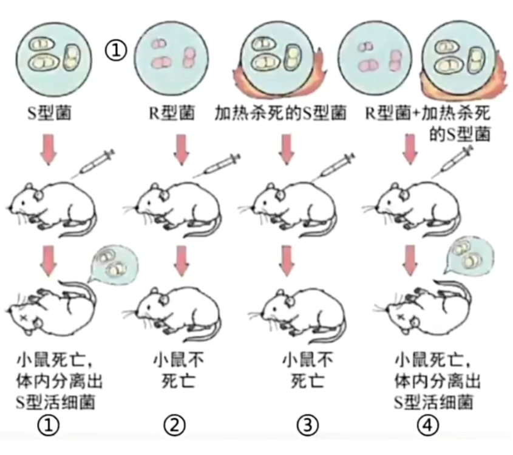

由此我们可以得出结论: 加热杀死的 S 型菌中, 含有某种使 R 型菌转化为 S 型菌的转化因子. 需要注意, 格里菲斯的体内转化实验并没有提出有关 DNA 的结论, 而只是得出所谓的"转化因子"的存在. 

### 肺炎链球菌体外转化实验

S 型菌由于有多糖荚膜, 故其菌落表面光滑; R 型菌由于无多糖荚膜, 故其菌落表面粗糙. 如图为艾弗里的体外转化实验过程: 

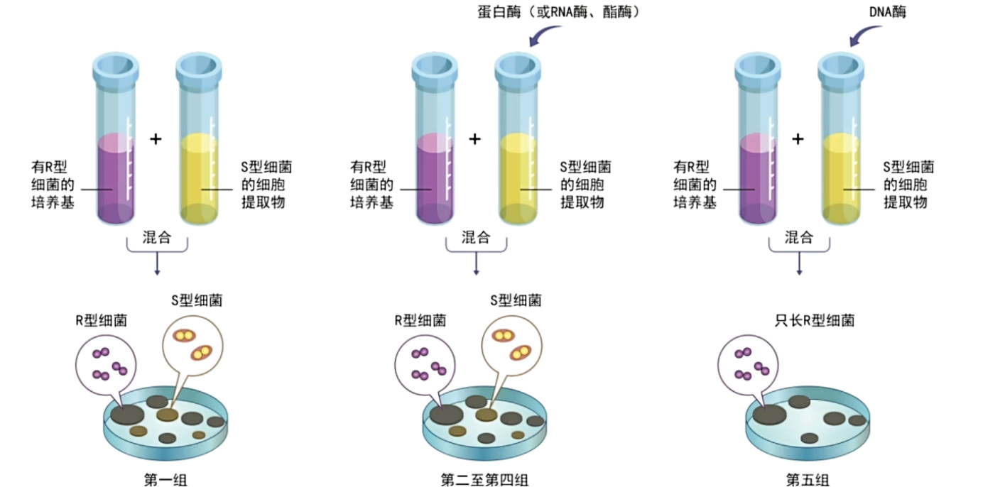

艾弗里使用酶解法(减法原则), 对不同物质逐一分析, 最终得出: DNA 是使 R 型菌产生稳定遗传变化的物质. 但是此实验仍然不能直观地证明 DNA (核酸)是遗传物质. 

注意 R 型菌转化为 S 型菌是小概率事件, 培养皿中的菌落大部分仍然为 R 型菌菌落, 并不是所有 R 型菌均能转化为 S 型菌. 

实际上, S 型肺炎链球菌的多糖荚膜不是由 DNA 的直接表达产物, 而是 DNA 通过表达出的酶控制生物性状, 属于间接途径. 

### 噬菌体侵染实验

赫尔希与蔡斯使用 $T_2$ 噬菌体与大肠杆菌, 借助同位素标记法设计了一种十分巧妙的实验, 来证明 DNA 是遗传物质. $T_2$ 噬菌体是一种专门寄生在大肠杆菌体内的病毒, 仅由蛋白质和 DNA 成分构成, 结构简单: 

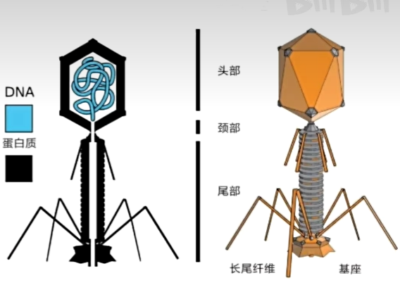

$T_2$ 噬菌体在侵染大肠杆菌后, 会在自身遗传物质的作用下, 利用大肠杆菌体内的物质(原料, 酶等, 注意逆转录病毒所使用的逆转录酶来自于病毒自身, 因为细菌中并不存在逆转录酶)来合成子代的组成成分, 进行大量繁殖. $T_2$ 噬菌体侵染的过程大致为: 

1. 吸附, 吸附于大肠杆菌上; 
2. 注入, 将自身的遗传物质注入大肠杆菌; 
3. 复制, 合成子代所需物质; 
4. 组装, 组装子代; 
5. 释放, 裂解大肠杆菌, 将子代释放. 

故考虑使用同位素标记法对两种复制分别研究. 需要标记蛋白质与 DNA 所特有的元素(S 与 P), 以和其他物质进行区分. 分别使用 $^{35}S$ 与 $^{32}P$ 标记两组大肠杆菌. 注意不能直接通过含有对应放射性元素的培养基进行标记, 因为噬菌体需要寄生于宿主细胞中. 故使用含 $^{35}S$ 或 $^{32}P$ 的培养基标记大肠杆菌, 然后将标记后的大肠杆菌与 $T_2$ 噬菌体混合培养, 即可得到目标噬菌体. 

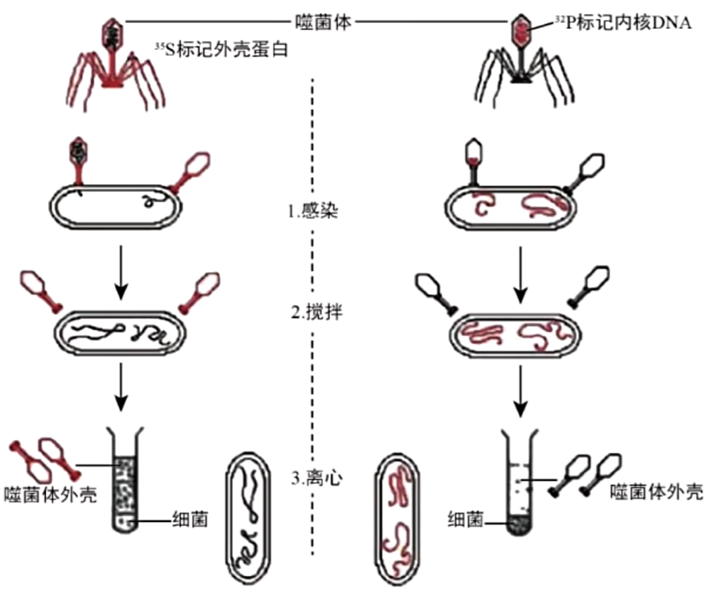

上图为实验过程(试管中黑点的密集程度代表放射性强弱, 而非微生物数量). 保温令标记后的噬菌体侵染大肠杆菌; 待侵染完成后, 搅拌使噬菌体从大肠杆菌上脱离吸附状态; 然后进行差速离心, 将噬菌体的蛋白质外壳分离至上清液, 大肠杆菌及噬菌体的遗传物质留在试管底部. 对于实验中包含的两组实验的不当操作: 

- 使用 $^{35}S$ 标记蛋白质外壳时, 需要充分搅拌与离心, 以保证具有放射性的蛋白质外壳彻底与大肠杆菌分离, 否则会导致试管底部也检出放射性. 保温时间是否适当对此组影响不大. 
- 使用 $^{32}P$ 标记 DNA 时, 注意保温时间不可过长或过短, 过长会导致大肠杆菌被裂解, 释放出子代噬菌体, 导致上清液中也出现放射性; 过短会导致噬菌体还未全部侵染大肠杆菌, DNA 分子没有全部进入大肠杆菌, 同样导致上清液中出现放射性. 搅拌与离心是否充分对此组影响不大. 

此实验得出了 DNA 是遗传物质的结论. 但其仍然未能排除蛋白质不是遗传物质的可能. 但只有结合此实验才能得出 DNA 为主要的遗传物质的结论, 否则"主要"二字不能被添加. 

### 烟草花叶病毒侵染实验

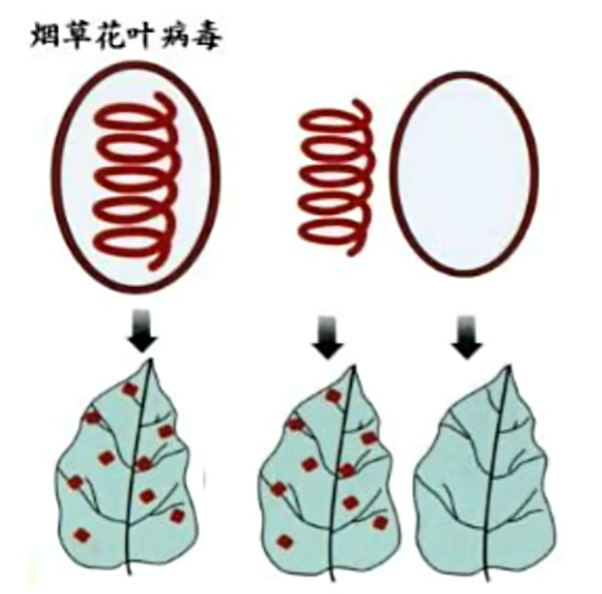

烟草花叶病毒(RNA 病毒, 由蛋白质外壳与 RNA 组成)会使叶片患病, 出现明显症状. 故将 RNA 与蛋白质外壳分离, 分别侵染叶片, 观察到 RNA 在侵染后叶片出现症状, 且能提取出烟草花叶病毒; 使用蛋白质外壳侵染则不会使叶片患病. 

此实验证明了 RNA 为烟草花叶病毒的遗传物质. 

综合上述 4 个实验, 可以推理出: 大部分生物的遗传物质是 DNA, 少数为 RNA. 因此, DNA 是主要的遗传物质. 注意, "主要"意味在生物界中, 大部分生物(动物, 植物, 细菌与真菌, DNA 病毒(体内只有 DNA))的遗传物质都为 DNA, 而 RNA 则是少数(RNA 病毒(体内只有 RNA)); 不存在同时将 DNA 与 RNA 作为遗传物质的情况(尽管很多生物体内同时存在 DNA 与 RNA 两种核酸), 故不能说对于某一生物, 其遗传物质主要为 DNA (应删除"主要"二字). 

常见的 RNA 病毒有: 

- 烟草花叶病毒;
- 流感病毒;
- 禽流感病毒;
- 狂犬病毒;
- HIV 病毒;
- 冠状病毒(SARS, MERS, COVID-19 等);
- 甲肝病毒(HAV);
- 丙肝病毒(HCV).

### DNA 的结构

威尔金斯与富兰克林使用 X 射线衍射技术获得了高质量的 DNA 衍射图谱. 沃森与克里克在此基础上推演出 DNA 的双螺旋结构. DNA 中含有两条反向平行的脱氧核苷酸链, 它们由 3', 5' - 磷酸二酯键(脱水缩合)连接. 在两条链间, 碱基通过氢键相接, A 与 T 间存在 2 条氢键, G 与 C 间存在 3 条氢键. 故 A 与 T 部分的 DNA 氢键较易断裂, DNA 较易解旋, 是 DNA 复制以及转录起点的特征. 

DNA 其中一条链存在两端, 分别为 3' 端与 5' 端(末端 C 的编号), 它们分别以游离的羟基(-OH)与游离的磷酸基团(P)结尾(详见[核苷酸的结构(超链接待补全)]()), 故也可称为羟基端与磷酸(基团)端. 在同一侧, 一条链的 3' 端与另一条链的 5' 端相配对, 故 DNA 为反向平行. 

DNA 中碱基的数量关系, 从根本上, 只有 $A = T$ 与 $G = C$ (两条链碱基总数的关系, 且可以发现嘌呤数 = 嘧啶数, 但对于 RNA 则不同), 且 $A_1 = T_2$, $T_1 = A_2$, $C_1 = G_2$, $G_1 = C_2$ (两条链之间的等价关系). 百分数(占比)通常转化为数量, 通过设碱基总数, 以免忘记区分占双链的比例还是单链. 还要注意共有多少对碱基还是多少个碱基. 在应用中, 画如下的图可以帮助解题: 

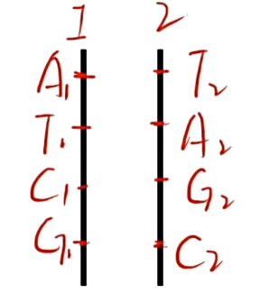

由以上结论, 可以推出很多推论, 如 A/T/C/G 在双链中的占比 = $A_1/T_1/C_1/G_1$ 在 1 号链中的占比 = $A_2/T_2/C_2/G_2$ 在 2 号链中的占比. 当然, 还有更多推论, 但无需记忆(包括以上占比推论), 现推即可. 

### 半保留复制

当时对于 DNA 的复制方式的观点普遍存在如下三种: 

- 全保留复制; 
- 半保留复制; 
- 分散复制(DNA 片段随机分配给两条子链). 

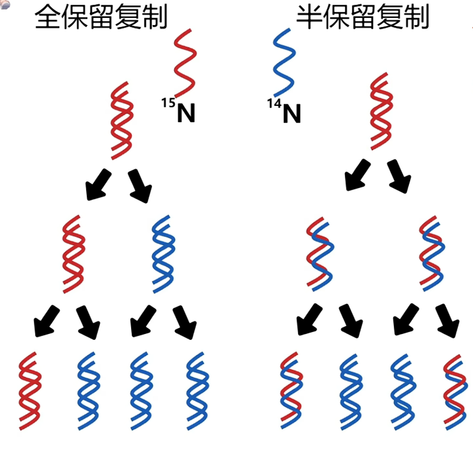
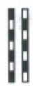

科学家巧妙地通过同位素标记法, 对 N 进行标记($^{14}N$ 标记为 $^{15}N$), 从而得到质量不同的 DNA 分子. 我们无法进行放射性检测, 因为同 $^{16}O$ 一样, $^{15}N$ 是非放射性同位素. 但可以通过质量进行区分, $^{15}N$ 占比越高, DNA 分子质量越大(这也是选取 $^{15}N$ 作为标记元素的原因). 实验过程大致如下: 

1. 在含 $^{15}NH_4Cl$ 的培养基中培养大肠杆菌(有繁殖快, 易培养, 结构简单等优点), 大肠杆菌的 DNA 中的 $^{14}N$ 被 $^{15}N$ 取代. 
2. 进行密度梯度离心(可以认为是更精细的差速离心, 能够稳定且均匀地分层), 发现仅存在试管底部一个条带, 称为重带. 在重带中, DNA 分子的两条链均为 $^{15}N$ 标记. 
3. 将部分大肠杆菌移植到含 $^{14}NH_4Cl$ 的培养基中培养一代, 然后进行密度梯度离心. 发现仅在试管中段存在条带, 称为中带. 在中带中, DNA 分子的两条链中仅一条由 $^{15}N$ 标记. 根据培养出的第一代所得出的实验结果, 可以排除全保留复制(会出现重带与轻带两条, 见图片), 但分散复制暂时无法排除. 
4. 继续培养出第二代, 进行密度梯度离心. 试管中段与上部存在条带, 即存在中带与轻带(DNA 分子的两条链均无 $^{15}N$ 标记). 至此我们可以排除分散复制, 因其永远仅会出现一条条带. 

至此, DNA 为半保留复制得证. 下面为具体的复制流程: 

1. 解旋酶将 DNA 解旋变为单链(解开氢键);
2. RNA 引物结合在模板链的 3' 端(RNA 引物需要注意与 PCR 时使用的 DNA 引物区分, 但它们都结合在母链的 3' 端); 
3. DNA 聚合酶使脱氧核苷酸(可用 dNTP)从引物的 5' 端开始连接(催化磷酸二酯键的形成), 依照碱基互补配对原则, 实现子链的延伸(延伸方向为从子链的 5' 端向 3' 端); 
4. 通过酶将所有的 RNA 引物片段替换为 DNA 片段, DNA 恢复双螺旋的状态. 

实际上, 真核生物的 DNA 复制有以下特点: 

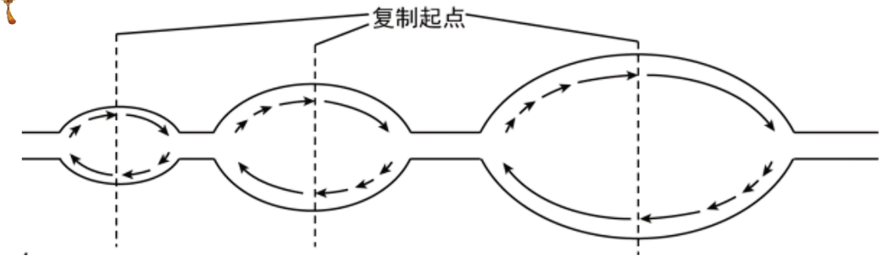

- 半保留复制; 
- 双向复制, 从复制起点同时向两个方向进行复制(一个复制起点会引出两个复制叉); 
- 多起点复制, 图中环(复制泡)越大代表开始得越早; 
- 边解旋边复制; 
- 半不连续复制, 即在复制时, 有一条链其子链的延伸方向与解旋酶移动方向相反, 故随着解旋酶的移动, 需要不断结合引物进行复制, 这导致了冈崎片段的形成. 

对于原核生物, 其 DNA 分子为环状, 有特殊地复制机制, 如复制原点等, 请读者自行探索. 

DNA 复制会发生于所有有 DNA 的地方, 如细胞核, 叶绿体, 线粒体, 拟核, 原核生物细胞质(质粒)等. DNA 复制发生在有丝分裂或减数分裂前的间期, 具体为 S 期. 复制需要 ATP 等物质进行供能. 

DNA 的精准复制由以下两点决定:

- DNA 分子的双螺旋结构为复制提供了精准的模板; 
- 碱基互补配对保证了复制的准确性. 

DNA 复制的意义为: 将遗传信息从秦代传递给子代, 从而保证了遗传信息的连续性. 

计算子代 DNA 的相关数量时, 总有以下规律: 

- 子代 DNA 总数 = $2^n$ ; 
- 子代含 $^{15}N$ 的 DNA 数量 = $2$ ; 
- 子代只含 $^{15}N$ 的 DNA 数量 = $0$ ; 
- 子代只含 $^{14}N$ 的 DNA 数量 = $2^n - 2$ ; 
- 含 $^{15}N$ 的 DNA 单链数量 = $2$ ; 
- 含 $^{14}N$ 的 DNA 单链数量 = $2^{n + 1} - 2$ ; 
- 经过 $n$ 代复制, 新合成的 DNA 单链总数 = $2^{n + 1} - 2$ ;
- 第 $n$ 代复制, 新合成的 DNA 单链数量 = $(2^{n + 1} - 2) - (2^{n} - 2) = 2^n$ .

无需死记, 画图即可得出. 

### 基因的表达

DNA 可以储存遗传信息的原因为其 4 种碱基的排列顺序不同. 碱基排列顺序千变万化导致了 DNA 分子的多样性, 而碱基特定的排列顺序导致了 DNA 分子的特异性. 

DNA上分布着许多基因, 基因通常是具有遗传效应的 DNA 片段(对于 RNA 病毒, 基因是具有遗传效应的 RNA 片段). 基因并不是连续分布在 DNA 上, 而是由非基因片段中的碱基序列将其分隔开. 

在基因表达过程中, 涉及到以下三种 RNA: 

- mRNA (信使 RNA): 在 DNA 与蛋白质间充当信使; 
- rRNA (核糖体 RNA): 与蛋白质结合构成核糖体; 
- tRNA (转运 RNA): 氨基酸的运载工具, 可以识别并结合氨基酸. 

需要注意的是, tRNA 尽管是 RNA, 但其仍然存在碱基互补配对的双链区域, 存在氢键, 如图, 且其 3' 端结合氨基酸(-OH 与氨基酸脱水缩合), 5' 端短于 3' 端. 

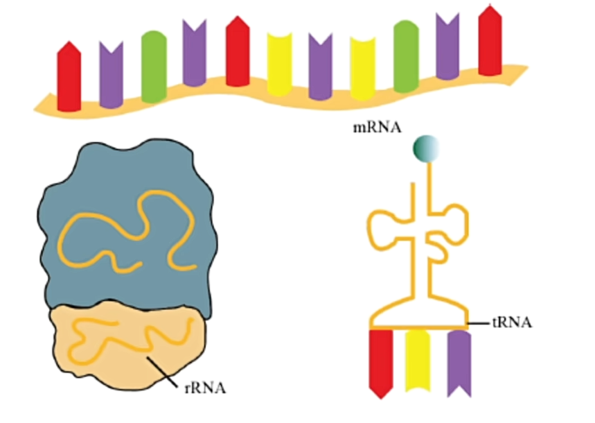

#### 转录

由于 DNA 分子不能随意进出核膜, 故需要 mRNA (信使 RNA) 进行转录. mRNA 可以通过核孔进出细胞核. 

转录的定义为: 以基因中的一条链为模板合成 RNA (mRNA, tRNA, rRNA)的过程. 下面以最常见的 mRNA 转录为例, 流程为: 

1. RNA 聚合酶与启动子结合并启动转录, 将 DNA 双链解旋(注意无专门的解旋酶, 边解旋边转录), 直到抵达终止子; 
2. 以其中一条链为模板链(另一条链为编码链, 转录出的 mRNA 若将 U 视为 T, 则其碱基序列与编码链相同), 依据碱基互补配对原则(有特殊的 A - U 配对, 前者一般默认为母链, 后者默认为子链), 将核糖核苷酸进行连接(催化磷酸二酯键的形成). 

过程中由 ATP 供能. 

随后, 在真核生物中, (前体) mRNA 需要进行一定的剪切, 剪去非编码区(内含子, 启动子, 终止子与增强子等); 而原核生物则不需要. 

#### 翻译

翻译是指游离在细胞质中的各种氨基酸, 以 mRNA 为模板合成具有一定氨基酸顺序的蛋白质的过程. mRNA 结合在核糖体的大亚基与小亚基之间(上文图片中蓝色与黄色区域交界处), 其上每 3 个相邻的碱基称为 1 个密码子, 决定一个氨基酸. 

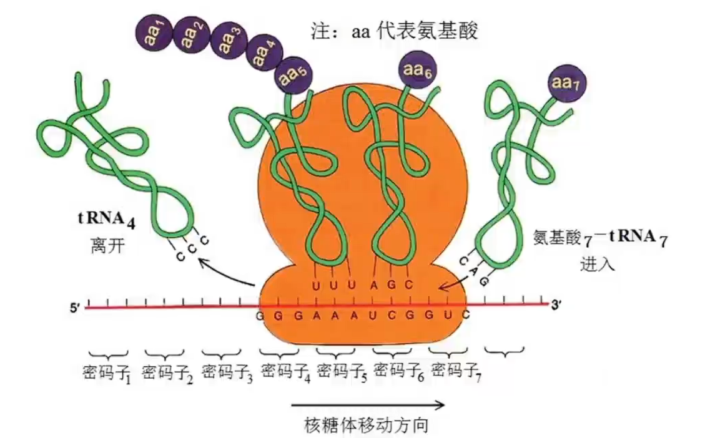

密码子中每个碱基可能有 A/U/C/G 四种可能, 故共有 $4^3 = 64$ 种可能的密码子. 但氨基酸仅有 21 种, 是因为可能有一或多种密码子对应同一个氨基酸(密码子的简并性, 这提高了生物对于突变等情况的容错能力). 当然, 也会有密码子不对应任何氨基酸, 如 UAA, UAG, UGA(UGA 少数情况下也会对应硒代半胱氨酸). 故仅有 62 种(或 61 种) tRNA 携带氨基酸. 如图为密码子表, 展示了密码子与氨基酸的对应关系. 

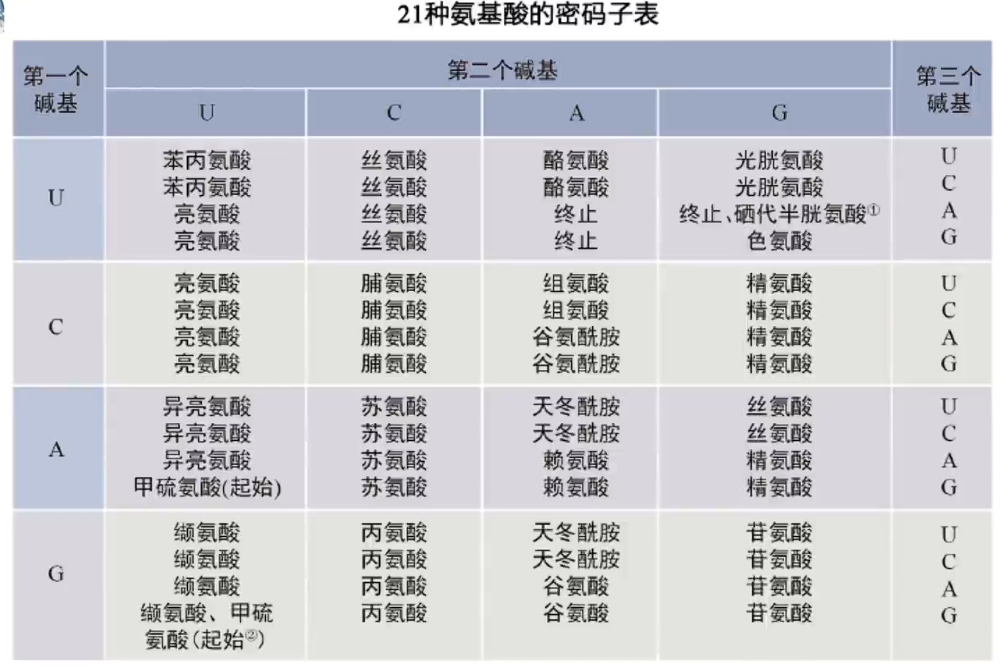

无需记忆密码子表. 

翻译需要从起始密码子开始, 终止密码子结束. 起始密码子一般为 AUG 一种, 极少数情况下, 如原核生物中也有 GUG 作为起始密码子的可能(真核生物一般对应缬氨酸, 非起始密码子). 终止密码子有 UAA, UAG, UGA(多数时候). 

tRNA 负责识别并结合氨基酸. tRNA 下缘存在 3 个碱基所形成的反密码子, 可以与密码子碱基互补配对, 从而将氨基酸运到核糖体. 核糖体同时允许且仅允许 2 个 tRNA 与 mRNA 结合, 从而催化这两个 tRNA 上的氨基酸进行脱水缩合形成肽链. 

实际上, 翻译的速度十分迅速, 如图, 在一条 mRNA 上, 可以同时结合多个核糖体, 进行多条相同的肽链的合成. 如此, 少量的 mRNA 分子可以迅速合成出大量的蛋白质. 同一条 mRNA 分子上, 核糖体上的肽链越长, 代表越早结合于 mRNA. 

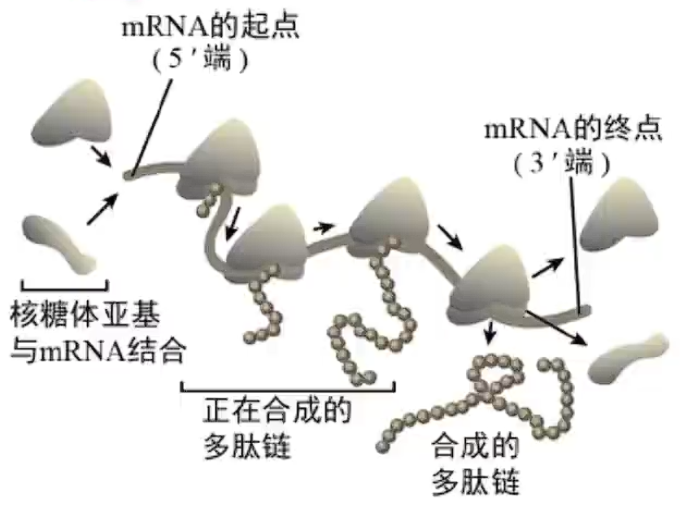

在原核生物中, 由于不存在核膜, 故可以边转录边翻译, 如图. 但真核生物不可. 

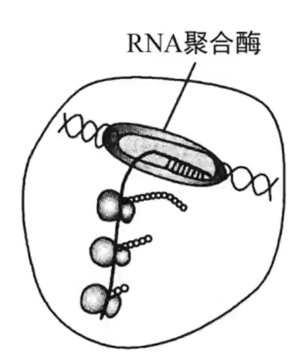

#### 中心法则

克里克十分有预见性地提出了中心法则. 中心法则实质上展示了不同生物体内遗传信息的传递过程. 早期的中心法则并不完善, 因为当时仍不了解以 RNA 作为遗传物质的生物. 但后续中心法则被补充完善: 

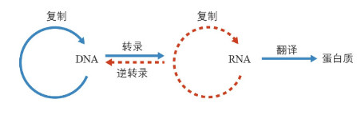

RNA 复制途径的生物有: 烟草花叶病毒, 流感病毒, 狂犬病毒等. 

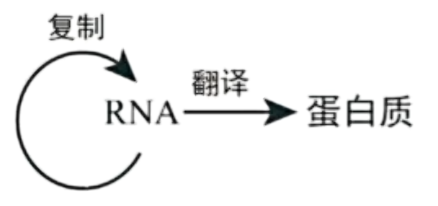

逆转录途径的生物有: HIV 等逆转录病毒. 它们不可以进行 RNA 复制, 需要在宿主细胞中首先逆转录为 DNA 再进行 DNA 复制与转录. 

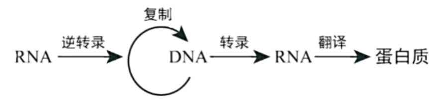

显然, 中心法则中的所有流向都能发生碱基互补配对. 

基因对生物体性状的控制方式有以下两种: 

- 直接控制: 基因通过控制蛋白质结构, 来控制生物体性状. 如正常红细胞的双凹圆盘状以及基因突变后, 氨基酸序列发生改变得到的镰状红细胞. 
- 间接控制: 基因通过酶的合成来控制代谢过程. 脂质, 糖类等非蛋白与非核酸产物都是通过此间接途径得到. 如动物的白化病, 是因为酪氨酸酶基因不能正常表达, 导致缺少酪氨酸酶, 生物无法通过酪氨酸合成黑色素, 故通体发白. 注意, 植物的白化苗是因为缺少叶绿体, 无法进行光合作用, 而非缺少黑色素, 需要区分. 

基因与性质不是一一对应的关系, 存在多个基因同时控制一个性状的情况(多因一效, 如花色), 也可以由一个基因控制多个性状(一因多效, 如 SRY 基因). 当然, 环境与基因共同对性状进行影响, 既可以是环境直接影响性状(如吸烟前后肺叶的颜色), 也可以是环境通过改变基因影响性状(如吸烟诱导抑癌基因与原癌基因发生突变, 导致抑癌蛋白失效或原癌蛋白异常激活, 进而导致肺癌), 还存在环境不改变基因, 但影响基因表达的情况, 即表观遗传. 

表观遗传是指生物体基因碱基序列保持不变, 但基因表达和表型发生可遗传变化的现象. 如染色体中基因或组蛋白的甲基化, 乙酰化, 泛素化, 磷酸化等修饰以及其他表观遗传的形式, 会导致基因表达下调或上调, 从而导致性状发生改变. 表观遗传可以实现对基因表达的调控. 实际上, 细胞分化的实质就是基因的选择性表达, 这与基因表达的调控有关. 

细胞质基因为母系遗传, 即总是由母本传递给子代. 细胞质基因主要位于线粒体与叶绿体中的 DNA 上, 它们都能进行半自主自我复制, 并借助线粒体或叶绿体中的核糖体, 通过转录和翻译控制某些蛋白质的合成, 如光合作用与呼吸作用所使用的酶等. (根据内共生理论, 被吞噬的原核生物应有核糖体, 且可以实现蛋白质的合成, 故为半自主细胞器)

## 变异

### 基因突变

基因突变指的是 DNA 分子中发生碱基的替换, 增添或缺失, 而引起的基因碱基序列的改变. 如遗传病镰刀型细胞贫血症, 是由于基因中的一个碱基对的突变(患病根本原因)导致一个氨基酸的替换, 血红蛋白发生异常(患病直接原因), 从而引发红细胞形态的改变, 进而影响正常功能. 

注意, DNA 分子上再非基因序列发生的碱基对的替换, 增添或缺失并不是基因突变. 基因突变限制在基因碱基序列的改变. 

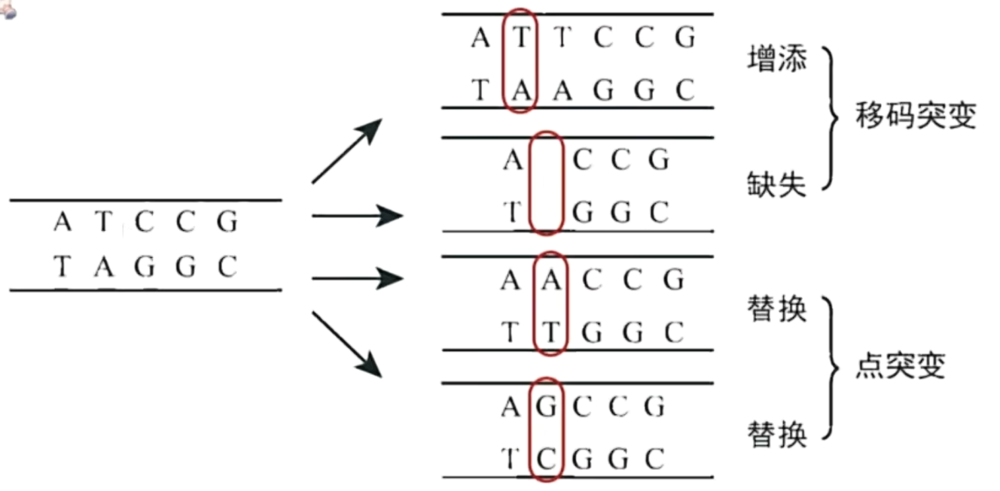

一般来说, 移码突变的危害较点突变更大. 因为移码突变可能导致密码子读取错位, 引发一整串氨基酸序列的改变, 而点突变只改变了一个氨基酸, 有时由于密码子的简并性甚至不会改变任何氨基酸. 实际上, 若同时增添或缺失三个碱基对, 导致的后果较轻, 因为在这种情况下, 改变的只有一个至两个氨基酸, 并为导致读取的错位. 倘若基因突变改变, 删除或增添了终止密码子, 会导致肽链的延长或缩短, 此时的后果可能比较严重. 

有些时候, 基因突变并不引起性状改变(中性突变): 

- 基因不编码蛋白质的 DNA 序列中的突变, 如非编码区(启动子, 终止子, 增强子等)与内含子; 
- 密码子的简并性; 
- 蛋白质中个别氨基酸的改变不影响蛋白质功能; 
- 某些显性或隐性突变, 如 AA 突变为 Aa , Aa 突变为 AA, 或 $Aa_1$ 突变为 $Aa_2$ 等. 

基因突变有以下特点: 

- 普遍性. 基因突变在生物界是普遍存在的. 
- 随机性. 基因突变可以发生在生物一生的任何时间与位置. 
- 不定向性. 基因突变可以导致不同的性质, 其本质为产生了复等位基因, 如 $A$ 基因可以突变为 $a_1, a_2$ 等. 
- 低频性. 在自然状态下, 基因突变的频率较低. 
- 少利多害性. 除了少数中性突变与有利突变以外, 更多的是有害突变, 使生物不适应环境. 

基因突变的诱因可能有: 

- 内因: DNA 复制偶尔错误, 碱基组成改变; 
- 外因: 
    - 物理因素: X 射线, 紫外线等辐射; 
    - 化学因素: 亚硝酸, 碱基类似物等化学物质; 
    - 生物因素: 某些病毒也会诱导基因突变. 

基因突变的结果为产生新基因(即等位基因), 从而导致产生新的相对性状. 故基因突变是变异的根本来源, 为进化提供最初的原材料. 

#### 癌变

癌细胞可以无限增殖; 细胞膜上糖蛋白等物质减少, 导致粘着性降低, 更易转移; 细胞的形态结构发生显著变化. 

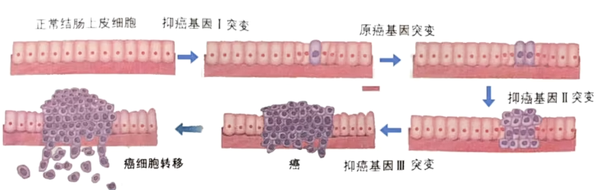

原癌基因的表达可以调控细胞的正常增殖, 抑癌基因的表达可以抑制不正常增殖的细胞. 故原癌基因与抑癌基因的突变, 会导致细胞的异常增殖, 不断积累进而导致癌症. 

### 基因重组

在生物体进行有性生殖的过程中, 控制不同性状的基因的重新组合为基因重组. 以下几种情况均为基因重组: 

- 减数分裂 I 前期发生的交叉互换会导致同源染色体上的非等位基因重组. 
- 减数分裂 I 后期发生的非同源染色体的自由组合会导致非等位基因自由组合. 
- 肺炎链球菌从 R 型菌转化为 S 型菌. 
- 基因工程中, 导入外源基因. 
- 逆转录病毒将自身的 DNA 整合到宿主细胞中以逆转录(逆转录病毒必须如此做, 否则无法存活). 

注意, 受精作用为精子与卵细胞的随机结合, 不属于基因重组. 

基因重组会导致产生新的基因型, 进而产生新的表型. 基因重组是变异的主要来源, 为进化提供丰富的原材料. 注意区分, 基因突变产生新的基因, 进而产生新的基因型; 而基因重组产生新的基因型, 但无法产生新的基因. 

### 染色体变异

生物体的体细胞或生殖细胞内染色体的数目或结构的变化, 称为染色体变异. 

#### 染色体数目变异

染色体组是指, 生物的体细胞中所含有的一套非同源染色体称为一个染色体组, 如图. 下图左侧为人类染色体核型图, 展示了两个染色体组; 右侧仅为一个染色体组. 体细胞中含有多少染色体组, 就为几倍体, 我们使用 $kn = N$ 来表示, 其中 $k$ 表示染色体组数, $N$ 表示体细胞中染色体总条数, 如人类为 $2n = 46$. 由此我们可以计算个体每个染色体组中所含的染色体条数, 为 $\frac{N}{k}$ . 特别地, 若个体由配子(如精子(花粉), 卵细胞等)直接发育而来, 则称为单倍体, 使用 $kn = N$ 表示, 不论其仅含有一个染色体组还是多个; 若由受精卵发育而来, 则为二倍体或多倍体生物. 实际上, 生物界中绝大多数生物均为二倍体生物, 即含有两套非同源染色体. 

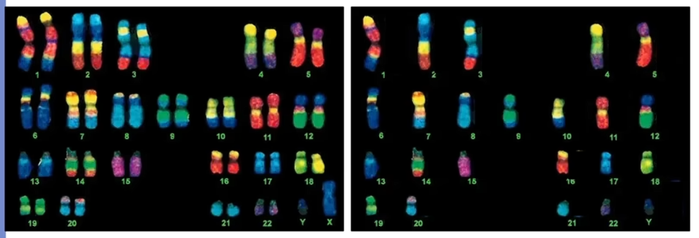

在下图中, 从左至右, 细胞中分别有 1, 2, 3, 4 个染色体组, 可以通过对同源染色体进行计数得到. 

若个体的基因型为 AAaa, 则其染色体组数为 4 个; 若基因型为 AAbbDD, 则染染色体组数为 2 个; 若基因型为 abCD, 则染染色体组数为 1 个, 均可通过数等位基因的个数, 即相同字母大小写个数的总和得到. 

绝大多数生物都是二倍体, 如马( $2n = 64$ ), 驴( $2n = 62$ )等. 多倍体生物多为植物, 往往茎秆粗壮, 种子与果实硕大, 营养物质含量丰富, 但发育延迟, 结实率低, 如马铃薯( $4n = 48$ ), 普通小麦( $6n = 42$ ), 小黑麦( $8n = 56$ )等. 对于单倍体生物, 如普通小麦的单倍体( $3n = 21$ ), 雄蜂( $1n = 16$ )等, 往往比较弱小. 若染色体组数为奇数时, 即对于 $(2k - 1)n = N, k \in \N_+$ 的生物, 染色体联会时会出现联会紊乱, 导致高度不育. 

染色体数目变异分为: 

- 倍数性改变. 即染色体数目的变化是以染色体组为单位而增减. 
- 非倍数性改变. 
    - 单体. 某一对同源染色体少了一条, 如 XO (特纳氏综合征, 性腺发育不良, 女性, 因为无 Y 染色体(无 SRY 基因)). 我们使用 O 表示空缺的染色体. 
    - 缺体. 某一对同源染色体全部缺失, 通常无法存活. 
    - 三体. 某对同源染色体多了一条, 如 21 三体综合征(唐氏综合征)等. 

染色体数目变异可能为染色体丢失, 或减数分裂时同源染色体或姐妹染色单体未分离等原因所致. 

对于 XXX, XXY, XYY 的性染色体组成, 其形成原因可能为: 

|性染色体组成|精子|卵细胞|
|:-:|:-:|:-:|
|XXX|XX 或 X|X 或 XX|
|XXY|XY 或 Y|X 或 XX|
|XYY|YY|X|

可以画图来分析究竟是减数分裂 I 后期同源染色体未分离还是减数分裂 II 后期姐妹染色单体为分离所致. 

XYY 男性所患有的疾病称为超雄综合征. 注意, 此种疾病并没有任何科学的研究证明其具有暴力倾向或犯罪倾向. 

#### 人工诱导多倍体

可以使用秋水仙素或低温诱导处理 **萌发中** 的种子或幼苗(分裂旺盛), 抑制有丝分裂过程中纺锤体的形成, 从而引起细胞内染色体数目加倍(后期着丝粒正常分裂, 但染色体无法被纺锤丝牵引至细胞两极, 细胞亦不会分裂为两个子细胞). 

如图为同源多倍体(染色体组来源于同一物种, 以三倍体无籽大西瓜为例)的培育过程. 

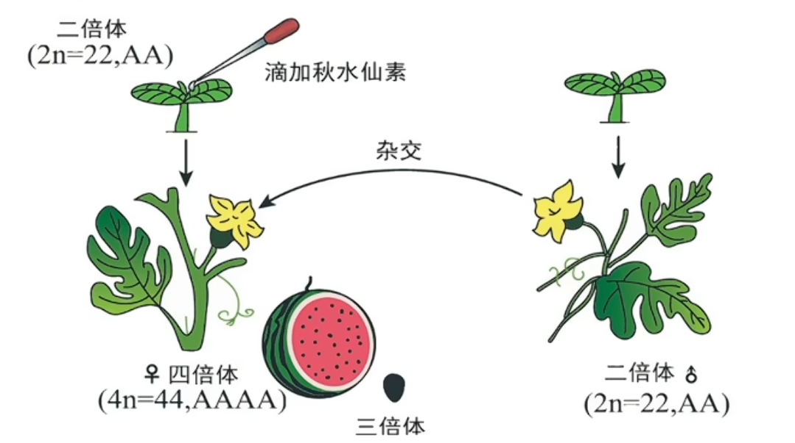
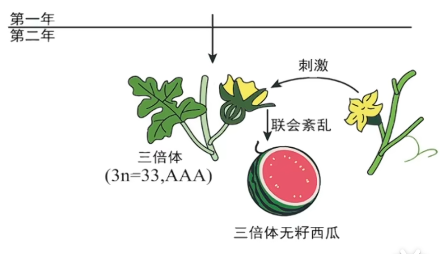

想要得到三倍体, 需要使用二倍体与四倍体进行杂交, 而四倍体可以人工诱导得到. 注意, 令二倍体与四倍体杂交后所产生的果实由子房发育而来, 其仍然为四倍体(或二倍体), 但其中的种子为三倍体西瓜的种子(受精卵发育为种子). 将此种子播种, 次年使用二倍体植株的花粉刺激三倍体植株的柱头, 使其子房膨大, 从而得到三倍体无籽西瓜. 

之所以无籽, 是因为三倍体所导致的联会紊乱. 实际上, 正常的香蕉是二倍体, 有籽; 但生活中食用的相交均为三倍体香蕉. 实际上, 不论是三倍体西瓜还是三倍体香蕉, 都不属于原本的二倍体西瓜与二倍体香蕉的物种了, 因为它们高度不育(无籽), 无法形成可育后代. 

而异源多倍体(染色体组来源于不同物种, 一般由不同种属间的杂交种染色体加倍形成, 以普通小麦为例)的培育过程如下. 

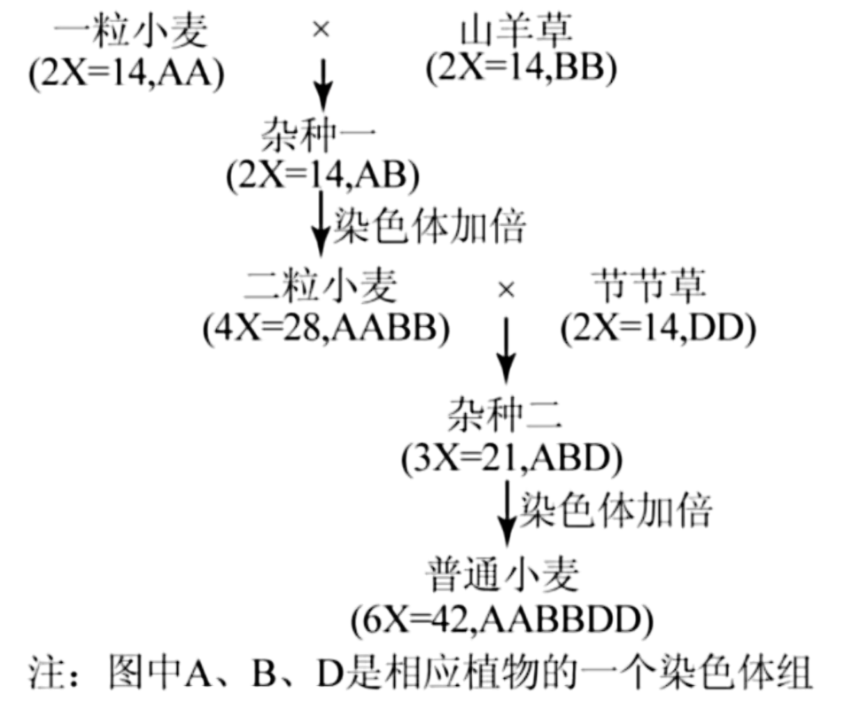

图中字母表示染色体组. 杂种一与杂种二理论上不属于一个物种, 因为其不含有同源染色体, 染色体无法联会, 不可育; 但一粒小麦, 二粒小麦, 普通小麦含有同源染色体(相同字母), 可育, 属于一个物种. 同理, 若马(2n = 64)于驴(2n = 62)杂交, 得到的异源二倍体骡子(2n = 63)由于不含有同源染色体, 甚至染色体数目为单数, 无法联会, 故无法完成减数分裂, 不可育. 

#### 染色体结构变异

染色体结构变异有以下几种情况: 

- 缺失. 染色体部分片段的丢失, 如图为联会时的形态. 如猫叫综合征. 

    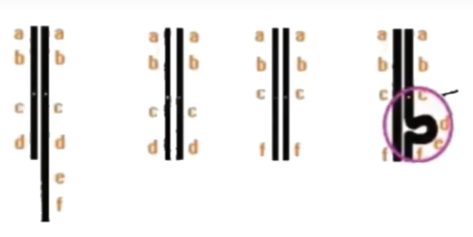

- 重复. 染色体原有片段的加倍重复出现, 如图为联会时的形态. 如果蝇复眼的缺失所引起的棒眼. 

    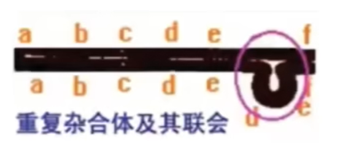

- 倒位. 染色体部分片段顺序发生改变, 如图为联会时的形态, 为实现相同区域的对齐, 会形成倒位环; 若倒位的区域过大则会形成第二种情况. 

    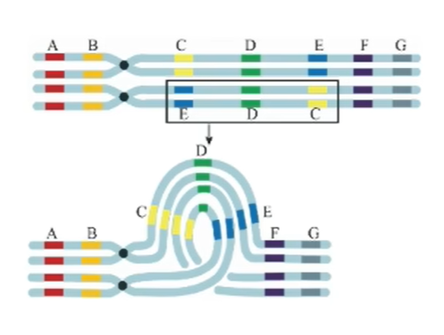
    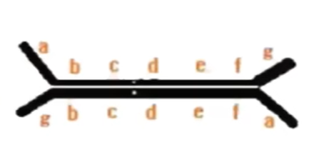

- 易位. **非同源** 染色体间部分片段的交换. 注意, 联会时发生的交叉互换发生在同源染色体间, 不属于染色体结构变异中的易位. 如图为联会时的形态. 

    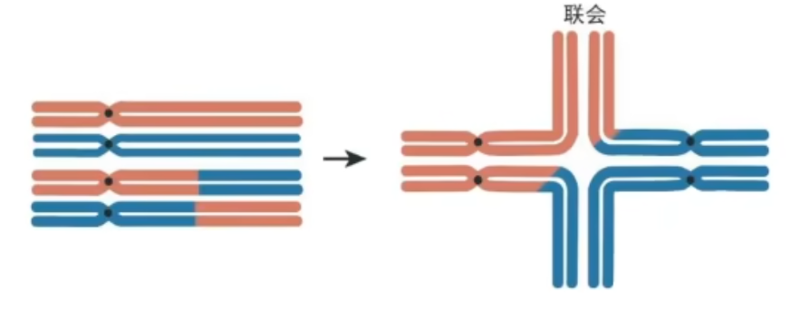

染色体结构变异的实质为 DNA 分子的断裂引起染色体断裂, 在断裂处发生错误连接导致染色体结构异常. 实际上, 染色体一般不易断裂, 但若受到物理, 化学因素的作用和远缘杂交的影响(外因), 或如细胞内的营养, 温度, 生理等异常变化(内因), 断裂频率可以显著提高.

基因突变与染色体结构变异也可能导致性别的改变, 而不改变性染色体组成, 因为只要无 SRY 基因即为女性. 会出现 XX 男性, XY 女性等, 均由于 SRY 基因异常出现. 

### 人类遗传病

人类遗传病通常是由于遗传物质改变而引起的人类疾病, 主要可以分为单基因遗传病, 多基因遗传病与染色体异常遗传病三大类. 

- 单基因遗传病: 受一对等位基因控制的遗传病. 
    - 常染色体隐性疾病: 白化病, 先天性聋哑, 苯丙酮尿症等. 此类疾病男女患病概率一致, 往往隔代遗传. 
    - 常染色体显性疾病: 多指, 并指, 软骨发育不全等. 此类疾病男女患病概率一致, 往往世代连续遗传. 
    - 伴 X 染色体隐性疾病: 红绿色盲, 血友病, 进行性肌营养不良等. 此类疾病男性患者普遍多于女性, 往往隔代遗传. 
    - 伴 X 染色体显性疾病: 抗维生素 D 佝偻病等. 此类疾病女性患者普遍多于男性, 往往代代遗传. 
    - 伴 Y 染色体疾病: 外耳道多毛症等. 此类疾病只存在男性患者, 在世代连续遗传在男性间. 
- 多基因遗传病: 受多对等位基因控制的遗传病. 如唇裂, 无脑儿, 原发性高血压, 青少年型糖尿病, 冠心病, 哮喘等. 此类遗传病患者在家族中聚集, 易受环境影响, 且群体中发病率较高. 
- 染色体异常遗传病: 由染色体变异引起的遗传病. 如性腺发育不良(特纳氏综合征), 21 三体综合征(先天性愚型), 猫叫综合征等. 此类遗传病的后果较为严重, 一般在胚胎期自然流产. 

对于人类遗传病的研究, 可以对遗传病的发病率与遗传方式进行调查. 对于发病率, 应在群体中随机抽样调查, 使用统计学方法进行计算. 若要调查遗传病的遗传方式, 需要在典型患者家系中进行. 由于多基因遗传病由于由多种基因导致, 故比较难调查; 染色体异常遗传病患者往往流产或在幼年时期死亡, 故无法调查; 所以一般对单基因遗传病进行调查. 

对于遗传病的检测与预防, 可以通过遗传咨询(通过家族病史进行分析与推算后代发病概率, 从而提供建议, 如选择终止妊娠等)与产前诊断(如羊水检查(对羊水中胎儿细胞进行检测, 分析细胞中的染色体与基因, 比较准确, 但有风险), B 超检查(对胎儿的形态结构进行检查, 也可根据 NT 值对染色体情况进行初步判断), 孕妇血细胞检查(检测母体环境, 当然也可以进行无创 DNA 检测, 通过母体血液中的胎儿细胞碎片, 对胎儿细胞的染色体进行检测), 基因检测等). 

## 进化

种群指生活在一定区域的同种生物全部个体的集合. 基因库为一个种群中全部个体所含有的全部基因. 种群是进化的单位. 在一个种群基因库中, 某个基因占全部等位基因的比例称为基因频率. 类似地, 基因型频率为一个种群基因库中, 某种基因型占全部该等位基因的基因型的比例. 

种群基因频率的变化是由突变(包括基因突变与染色体变异)与基因重组所导致的. 基因频率可以通过以下公式进行计算: 

1. $某基因频率 = \frac{该基因数目}{该基因各等位基因总数}$ ; 
2. $某基因频率 = 该基因纯合子的基因型频率 + \frac{1}{2} 杂合子的基因型频率$ (类似配子法对含某基因配子概率的计算). 

哈迪温伯格平衡定律提出, 若种群非常大, 所有雌雄个体都能自由交配, 无迁入迁出, 无自然选择, 无突变(即理想情况下), 则交配一代后达到平衡, 即基因频率与基因型频率保持不变. 实际上此定律就是配子法的计算方式, 有公式 $(p(A) + p(a))^2 = p^2(A) + 2p(A)p(a) + p^2(a) = p(AA) + 2p(Aa) + p(aa) = 1$ . 实际上使用配子法即可, 无需记忆此公式. 但要注意使用 $P(Aa) = 2p(A)p(a)$ 时系数 2 不要漏掉. 

达尔文提出了生物进化论, 其中主要包括: 

- 共同由来学说: 地球上所有生物都是由原始的共同祖先进化而来的. 
- 自然选择学说, 后文会进行介绍. 自然选择学说揭示了进化机制, 解释了适应的形成和物种形成的原因. 

支持生物进化论的证据有: 

- 化石证据, 即通过自然作用保存在地层中的古代生物的遗体, 遗物或生活痕迹等. 化石是研究生物进化最直接, 最重要的证据, 地层中不同位置的化石解释了生物由简单到复杂, 由低等到高等, 由水生到陆生的进化趋势. 
- 比较解剖学证据, 即比较不同物种之间器官, 系统的形态和结构(得出同源器官, 同功器官等). 
- 胚胎学证据, 即研究动植物胚胎形成和发育. 
- 细胞和分子水平的证据, 如不同生物体中同种蛋白质所差异的氨基酸数目, 越少则代表亲缘关系可能越近. 

拉马克进化理论的核心观点有: 

- 否定物种不变理论(即各种生物都是自古以来就如此的), 提出当今生物是由更古老的生物进化而来的; 
- 生物各种适应性特征是在进化过程中逐渐形成的; 
- 生物各种适应性特征的形成都是由于用进废退和获得性遗传. 

实际上, 用进废退与获得性遗传并不正确. 达尔文提出了他的自然选择学说进行解释. 总结来说, 其基本观点为: 过度繁殖, 生存斗争, 遗传变异, 适者生存. 可以解释为: 

- 过度繁殖(可遗传变异)为自然选择提供原材料; 
- 生存斗争是自然选择的过程, 是生物进化的动力; 
- 遗传变异是内因; 
- 适应是自然选择的结果; 
- 变异是不定向的, 环境定向选择决定进化方向. 

例如, 对于细菌耐药性的产生, 实则为抗生素对同一种群内不同抗药能力的细菌(由于不定向变异导致)的选择, 定向选择耐药的个体, 从而导致耐药的细菌存活并繁殖更多耐药的后代. 若一个细菌对多种抗生素产生了耐药性, 其很难被常规的抗生素杀死, 则称其为"超级细菌". 

达尔文的进化论对生物进化的原因提出合理解释, 使生物学第一次摆脱了神学的束缚, 走上了科学的轨道; 同时揭示了生命现象的统一性是由于所有生物都具有共同的祖先, 生物的多样性是进化的结果. 但是, 达尔文的进化论存在一些局限性, 如不能科学解释遗传和变异的本质; 对生物进化的解释局限于个体水平. 

当然, 人工选择也可以决定生物的进化方向, 定向选育对人类有益的品种. 

物种指的是能够在自然状态下相互交配, 并产生出可育后代的一群生物. 注意, 有些生物相互交配后可以产出后代, 但后代不可育, 如马与驴生出不可育的骡子, 故马于驴不属于同一物种; 二倍体西瓜与四倍体习惯结出三倍体无籽西瓜, 不可育, 故二倍体西瓜与四倍体西瓜也不属于同一物种. 

隔离指不同种群间的个体, 在自然条件下基因不能自由交流的现象. 常见的隔离类型有地理隔离(由于地理原因无法相互接触)与生殖隔离(无法产生可育后代)等. 生殖隔离是区分不同物种的主要依据, 出现生殖隔离则意味着不再属于同一物种. 同一物种经过长期的地理隔离, 由于不同的地理环境, 基因库差别加大, 可能达到生殖隔离, 从而产生新物种. 

协同进化可以指生物与生物之间的协同进化(如捕食者与猎物奔跑速度的加速), 也可以指生物与环境的协同进化(如地衣与蓝细菌对环境的改变). 协同进化导致生物多样性. 生物多样性可以分为基因(遗传)多样性, 物种多样性与生态系统多样性. 