# 元素与化合物

## 钠

自然界中钠元素只以化合物的形式存在, 无游离态的单质, 因为其单质十分活泼. 钠属于碱金属, 易失去一个电子, 具有强还原性. 

常温下为银白色固态, 质软(可用刀切割), 熔点低, 密度小于水, 大于煤油以隔绝氧气与水, 可用煤油以及石蜡油保存. 

$I A$ 族金属元素均可使用石蜡油保存, 因为密度均大于石蜡油. 除 $Li$ 以外的碱金属可以用煤油保存, 因为 $Li$ 密度比煤油小, 会浮在表面. 

钠与氧气的反应: 
$$
4Na + O_2 \xlongequal{\quad} 2Na_2O\\
2Na + O_2 \xlongequal[\quad]{\triangle} Na_2O_2
$$
$Na_2O$ 为白色物质(刚切开的钠与氧气反应失去金属光泽变暗), $Na_2O_2$ 为淡黄色物质, 硫单质($S$), 溴化银沉淀($AgBr$)也是淡黄色. 过氧根为 $O_2^{2-}$ . 

$Na$ 投入坩埚中加热, 先融化后燃烧, 发出黄色火焰, 燃烧为放热反应, 生成淡黄色 $Na_2O_2$ .

$Na$ 还可以再卤素单质中燃烧(燃烧反应不一定有氧气参与, 助燃剂即可). $2Na + X_2 \xlongequal[\quad]{\triangle} 2NaX, X = F, Cl, Br, I$ .

钠可以与水发生反应. $2Na + 2H_2O \xlongequal{\quad} 2NaOH + H_2\uparrow$ . 现象为 浮(密度比水小)熔(熔点低, 反应放热)游(产生气体)响(剧烈反应)红(加入酚酞生成碱性物质). 

钠与酸的反应更加剧烈; 与乙醇的反应弱于与水, 钠会沉在底部. 

与盐溶液先与水反应生成氢氧化钠后二次反应, 与熔融态盐可以正常反应.

注意钠等活泼金属引起的火灾不可用水或二氧化碳灭火器扑灭, 应用沙土. 像锂, 铝, 镁等金属可以在氮气, 二氧化碳中燃烧而无需氧气助燃. 

钠, 镁, 铝等金属元素的化合价仅有两种, 若此类金属单质形成化合物所失去的电子数与产物及比例无关, 一定可以直接计算, 消耗几摩尔金属即转移对应摩尔的电子. 

### 钠的氧化物

主要有氧化钠和过氧化钠. 二者通过 $2Na_2O + O_2 \xlongequal[\quad]{\triangle} 2Na_2O_2$ 转化. 

$Na_2O_2$ 可以作为供氧剂使用, 也可为消毒剂(强氧化性)或漂白剂(强氧化性漂白). 

|        |$Na_2O$   |$Na_2O_2$ |
|:------:|:--------:|:--------:|
|与 $H_2O$|$Na_2O + H_2O \xlongequal{\quad} 2Na^+ + 2OH^-$|$2Na_2O_2 + 2H_2O \xlongequal{\quad} 4Na^+ + 4OH^- + O_2\uparrow$|
|与 $CO_2$|$Na_2O + CO_2 \xlongequal{\quad} Na_2CO_3$|$2Na_2O_2 + 2CO_2 \xlongequal{\quad} 2Na_2CO_3 + O_2$|
|与 $H^+$ |$Na_2O + 2H^+ \xlongequal{\quad} 2Na^+ + H_2O$|$2Na_2O_2 + 4H^+ \xlongequal{\quad} 4Na^+ + 2H_2O + O_2\uparrow$|

常见的过氧化物有 $H_2O_2, Na_2O_2, K_2O_2, CH_3COOOH$ (过氧乙酸), $Na_2CO_3 \cdot H_2O_2$ (过碳酸钠) 等. 

漂白性的原理: 

|物理变化|化学变化      |<         |
|:--:|:--------:|:--------:|
|吸附漂白|氧化漂白(加热后不恢复颜色)|化合漂白(加热后恢复颜色)|
|活性炭等|$O_3$(臭氧), $HClO, H_2O_2, Na_2O_2$ 等|$SO_2$ 等  |

### 钠盐

向 $Na_2CO_3$ 溶液中滴加酸, 先 $CO_3^{2-} +H^+ \xlongequal{\quad} HCO_3^-$, 再 $HCO_3^- + H^+ \xlongequal{\quad} CO_2\uparrow + H_2O$ . 

$Na_2CO_3$ 又称纯碱或苏打, 可以用作清洁油污; $NaHCO_3$ 又称小苏打; $Na_2S_2O_3$ 硫代硫酸钠, 又称海波或大苏打. 小苏打对比苏打之所以成为 "小" 是因为: 
1. 式量(相对分子质量)小
2. 溶解度小(故侯氏制碱法用小苏打先析出)
3. 热稳定性差(受热分解)
4. 溶液碱性低

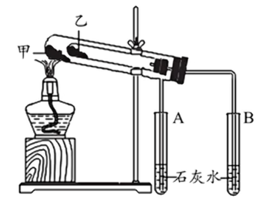

套管实验如图. 注意甲处放热稳定性好的 $Na_2CO_3$, 乙处放 $NaHCO_3$ 才能验证热稳定性差异.(因为甲处温度高) 考试时注意两物质的放置. 

侯氏制碱法: 注意先通入溶解度大的氨气在通入二氧化碳. 导管口在溶液面上方的是通入氨气的导管(为防倒吸). 还有碳酸氢钠析出, 不可拆. 

## 焰色试验

金属及其化合物在灼烧时火焰呈其特征颜色的物理过程, 涉及到电子跃迁.  

焰色试验首先要用盐酸(利于杂质被气化除去)清洗光洁无锈的铁丝或铂丝(无可见光焰色)作为蘸取待测液的载体; 灼烧铁丝或铂丝至无焰色(盐酸易气化除尽); 蘸取少量待测液; 灼烧, 观察钾元素的焰色时要通过蓝色钴玻璃滤光(滤掉钠元素发出的黄光, 放置掩盖微弱紫光). 

注意玻璃杯不可用, 其中含钠元素干扰. 

|金属元素|锂  |锶  |钙  |钠  |钡  |铜  |钾  |铷  |
|:--:|:-:|:-:|:-:|:-:|:-:|:-:|:-:|:-:|
|焰色  |紫红色|洋红色|砖红色|黄色 |黄绿色(绿色)|绿色 |紫色 |紫色 |

主要记忆钠(黄色), 铜(绿色, 记忆: 铜绿), 钾(紫色), 锂(紫红色), 钡(黄绿色(绿色), 记忆: 钡绿了). 

注意显特征焰色不一定没有其他杂质, 可能被掩盖. 

## 氯

氯元素在自然界中以化合物的形式存在, 其游离态单质 $Cl_2$ 具有强氧化性故在自然界中不存在. 

$Cl_2$ 在常温常压下是是黄绿色有刺激性气味的有毒气体. 易被液化储存在钢瓶(常温不反应)中, 可溶于水, 密度大于空气($M_{空气} \approx 28.8 g/mol$).  

$Cl_2$ 与金属单质反应, 因为氯气有强氧化性, 可以直接将物质氧化到最高价态(不论金属单质少量还是过量): 
1. $Na$ 在氯气中剧烈燃烧, 释放大量热, 生成白烟: $2Na + Cl_2 \xlongequal[\quad]{\triangle} 2NaCl$. 
2. $Fe$ 在氯气中剧烈燃烧, 释放大量热, 生成棕褐色烟: $2Fe + 3Cl_2 \xlongequal[\quad]{\triangle} 2FeCl_3$. 
3. $Cu$ 在氯气中剧烈燃烧, 释放大量热, 生成棕黄色烟: $Cu + Cl_2 \xlongequal[\quad]{\triangle} CuCl_2$.

$Cl_2$ 与非金属单质反应: 
1. $H_2$ 在氯气中安静地燃烧, 发出苍白色火焰, 集气瓶口有白雾: $H_2 +Cl_2 \xlongequal[\quad]{\triangle} 2HCl$.
2. $P$ 在氯气中燃烧, 释放大量热, 生成白色烟和雾: $2P + 3Cl_2 \xlongequal[\quad]{\triangle} 2PCl_3(l), PCl_3 + Cl_2 \xrightleftharpoons{\quad} PCl_5(s)$ .

### 次氯酸盐

$Cl_2$ 与水的反应制备新制氯水(歧化, 可逆反应):
$$Cl_2 + H_2O \xrightleftharpoons{\quad} H^+ + Cl^- + HClO$$

由于此反应为可逆反应, 且反应程度很小, 故新制氯水中多为氯气而非盐酸与次氯酸(故氯水呈现浅黄绿色). 注意氯水不是液氯, 液氯为氯单质. 新制氯水放置一段时间会因为次氯酸光照分解而变质为盐酸: 
$$2HClO \xlongequal[\quad]{光照或 \triangle} 2HCl + O_2\uparrow$$

由于平衡移动, 次氯酸减少也会导致溶于水的氯气减少, 故久置氯水可以认为是稀盐酸. 

次氯酸有漂白性, 但氯单质没有, 故氯气通入干燥红布条不褪色而湿润褪色. 氯气溶于水形成新制氯水有漂白性, 变为久置氯水后失去漂白性. 次氯酸使用酸碱指示剂时, 以石蕊试液为例, 会先变红后被漂白迅速褪色. 

酸性: $CH_3COOH > H_2CO_3 > HClO$. 

氯气与碱反应可以制取漂白液和漂白粉. 

$$Cl_2 + 2NaOH \xlongequal{\quad} NaCl + NaClO + H_2O\\
2Cl_2 + 2Ca(OH)_2 \xlongequal{\quad} CaCl_2 + Ca(ClO)_2 + 2H_2O$$

注意制取漂白粉要使用石灰乳(饱和含量大), 故离子方程式不可拆. 

以上反应不能加热进行(碱液需要用冷的), 会进行其他反应, 如: $3Cl_2 + 6NaOH \xlongequal[\quad]{\triangle} 5NaCl + NaClO_3 + 3H_2O$ . 

$NaClO$ 为漂白液($84$ 消毒液)的有效成分, $Ca(ClO)_2$ 为漂白粉的有效成分, 通过转化为 $HClO$ 生效(制成盐溶液方便储存), 变质原理(生效原理): $NaClO + CO_2 + H_2O \xlongequal{\quad} NaHCO_3 + HClO, Ca(ClO)_2 + CO_2 + H_2O \xlongequal{\quad} CaCO_3\downarrow + 2HClO, 2HClO \xlongequal[\quad]{光照} 2HCl + O_2\uparrow$ .

注意 $84$ 消毒液不可与洁厕灵($HCl$)混用: $ClO^- + Cl^- + 2H^+ \xlongequal{\quad} Cl_2\uparrow +H_2O$ .

氯气是强氧化剂, 如: 
$$
Cl_2 + H_2S \xlongequal{\quad} S\downarrow + 2HCl\\
Cl_2 + SO_2 +2H_2O \xlongequal{\quad} 2HCl + H_2SO_4
$$
(注意硫的不同价态的对应产物: $S^{2-} \to S, SO_2 \to SO_4^{2-}$, 一般不跳跃逐级上升).

氨与氯气的反应生成白烟(白色固体颗粒 $NH_4Cl$ ), 可以检查运输液氯的管道是否漏气: 
$$8NH_3 + 3Cl_2 \xlongequal{\quad} N_2 +6NH_4Cl$$

氯的单质与化合物可以对自来水消毒(强氧化性令蛋白质变性失活), 除了上文提及的强氧化性物质以外, 还有 $ClO_2$ 等. (当然 $O_3, K_2FeO_4$ (高铁酸钾)也可) . 但明矾( $KAl(SO_4)_2 \cdot 12H_2O$ )是净水剂而非消毒剂, 铝离子与水反应生成的 $Al(OH)_3$ 胶体只聚沉杂质, 无杀菌作用. 

氯气的尾气处理可以使用碱性溶液, 如氢氧化钠溶液, 碱石灰或石灰乳, 也可使用还原性溶液, 如 $FeCl_2, Na_2S$ 等. 

### 氯气的实验室制备

氯气的实验室制法(工业上使用氯碱工业制取): 
$$MnO_2 + 4HCl(浓) \xlongequal[\quad]{\triangle} MnCl_2 + Cl_2\uparrow + 2H_2O$$

这个反应必须在加热条件下与浓盐酸反应才可以制得氯气, 不浓不行不加热不行. 随着反应的进行, 浓盐酸逐渐变为稀盐酸, 反应会逐渐停止. 由于浓盐酸具有挥发性, 故制取氯气后要先除去氯化氢杂质(和水蒸气). 一般使用饱和食盐水除去氯化氢气体. 氯化氢极易溶于水, 故需要溶液洗气; 氯气也与水发生可逆反应, 故要增大溶液中氯离子浓度来控制平衡移动减小反应程度, 抑制氯气与水反应, 从而降低氯气溶于水的损失. 用中性或酸性干燥剂(如无水 $CaCl_2$ , $P_2O_5$ 或浓硫酸等)除水蒸汽(防止碱性干燥剂与氯气反应).

当然也可用高锰酸钾与浓盐酸制取氯气, 此反应无需加热(高锰酸钾氧化性更强): 

$$2KMnO_4 + 16HCl(浓) \xlongequal{\quad} 2KCl + 2MnCl_2 + 5Cl_2\uparrow + 8H_2O$$

所有除杂环节一定是: 除杂后除水. 因为洗气瓶中的液体会使气体再度含有水蒸气. 使用集气瓶收集氯气验满可以使用湿润的淀粉碘化钾试纸靠近瓶口, 若变蓝则收集完成. 

收集时可以选择排空气法或排液法. 氯气密度大于空气, 故应向上排空气, 且氯气有毒, 不能将排出的空气释放入大气中. 排液法的前提为排出液体不能溶解气体, 且如此收集的气体不干燥. 故选择饱和食盐水进行排液. 

### 氯离子检验

使用稀硝酸酸化的 $AgNO_3$ 溶液(或先加入稀硝酸再加入硝酸银溶液)检验 $Cl^-$ . 稀硝酸用于排除其余阴离子, 如 $CO_3^{2-}, OH^-$ , 与 $Ag^+$ 形成沉淀. 

含氯离子的现象为出现白色沉淀. 若沉淀为淡黄色或黄色, 则可能存在 $Br^-$ 或 $I^-$ . 这会对氯离子检验形成干扰.

## 铁

铁元素在自然界中大多以化合物的形式存在, 但也可像陨铁以单质的形式存在. 其在地壳中含量丰富, 排在第四位(氧硅铝铁钙). 铁元素时人体必须微量元素中含量最多的一种元素, 功能性铁元素主要参与氧的运输. 常温下, 纯净铁块为银白色, 铁粉与铁合金为黑色, 具有磁性. 常见的具有磁性的物质有 $Fe, Fe_3O_4$ 等. 

### 铁单质

铁的化合价主要为 $0, +2, +3$ , 其也存在 $+6$ 价, 如消毒与净水剂 $K_2FeO_4$ (高铁酸钾). 

铁单质易被氧化. 

- 与 $O_2$ : 在温和条件下被缓慢腐蚀为铁锈( $Fe_2O_3 \cdot xH_2O$ ), 在纯氧中点燃生成 $Fe_3O_4$ . 液氧可以保存于钢瓶中, 因为反应需要水或点燃条件. 
- 与 $Cl_2, Br_2$ : $2Fe + 3Cl_2 \xlongequal{\triangle} 2FeCl_3$ , 由于氯气强氧化性, 铁直接变为 $+3$ 价. 液溴, 液氯可以保存于钢瓶中, 因为反应需要加热. 
- 与 $S, I_2$ : $Fe + S \xlongequal{\triangle} FeS$ , 硫单质为弱氧化剂, 只能生成 $+2$ 价亚铁盐. 注意, $I_2$ 也只能将铁单质氧化为 $+2$ 价.
- 与 $H_2O(g)$ : $3Fe + 4H_2O(g) \xlongequal{高温} Fe_3O_4 + 4H_2$ . 需要特殊注意其产物. 实验装置如下图. 

  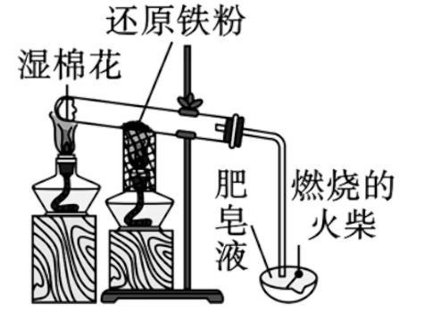

  图中湿棉花提供水蒸气, 肥皂液用于收集氢气, 火柴用于点燃氢气以验证(爆鸣声)并处理尾气. 酒精灯上放置金属网等效于酒精喷灯, 可以提供高温条件.

  故铁水使用的模具一定要干燥处理, 以防蒸发的水蒸气与高温的铁单质发生反应生成氢气, 以免爆炸.

- 与 $H^+, Cu^{2+}$ : 置换反应. 与 $Cu^{2+}$ 的反应为湿法炼铜.
- 与 $Fe^{2+}$ : 归中反应, $Fe + 2Fe^{3+} \xlongequal{\quad} 3Fe^{2+}$ .
- 与稀硝酸: 被氧化至 $+3$ 价.
- 与浓硝酸, 浓硫酸: 钝化. 

**常温下**, $Fe$ 或 $Al$ 与 **浓** $HNO_3$ 或 **浓** $H_2SO_4$ 会发生钝化, 即生成的氧化膜阻止反应继续发生, 反应快速停止. 

铁的冶炼可以使用 $CO$ 进行热还原. 高炉炼铁的方程式为: $Fe_2O_3 + 3CO \xlongequal{高温} 2Fe + 3CO_2$ . 原料可以为赤铁矿( $Fe_2O_3$ , 红棕色), 也可为磁铁矿( $Fe_3O_4$ , 黑色). 

### 铁的氧化物

铁的氧化物主要有三种: 
1. $FeO$ : 黑色粉末, 不稳定, 空气中受热易氧化为 $Fe_3O_4$ , 方程式为 $6FeO + O_2 \xlongequal{\triangle} 2Fe_3O_4$ . 
2. $Fe_2O_3$ : 俗名铁红, 红棕色粉末, 可用作颜料.
3. $Fe_3O_4$ : 反应中看做 $FeO \cdot Fe_2O_3$ , 有 $+2$ 与 $+3$ 价; 俗名磁性氧化铁, 黑色晶体, 可制作磁铁.

生成 $Fe_3O_4$ 的反应一共有三:

- $Fe$ 在 $O_2$ 中燃烧.
- 高温下, $Fe$ 与 $H_2O(g)$ .
- $FeO$ 被 $O_2$ 受热氧化.

由于铁氧化物中铁的价态, $HI$ 等还原性酸在与其反应时不仅要考虑酸性, 还要考虑还原性(离子还原性符合 $I^- > Fe^{2+} > Br^- > Cl^-$ ). 同理, 稀 $HNO_3$ 等氧化性酸也需要考虑其氧化性.

铁的氧化物与酸反应会涉及一系列复杂情况. 此时把握住原子守恒, 在适当的时候根据氧化还原规律进行计算即可. 当然, 必要时也可以列出总反应方程式. 

### 铁的氢氧化物

铁的氢氧化物有 $Fe(OH)_2$ (白色固体)与 $Fe(OH)_3$ (红褐色固体), 均难溶于水, 受热易分解, 方程式分别为 $Fe(OH)_2 \xlongequal{\triangle} FeO + H_2O$ 与 $2Fe(OH)_3 \xlongequal{\triangle} Fe_2O_3 + 3H_2O$ . 

$Fe(OH)_2$ 具有强还原性, 在空气中, 可以迅速被氧气氧化成 $Fe(OH)_3$ , 方程式为 $4Fe(OH)_2 + O_2 + 2H_2O \xlongequal{\quad} 4Fe(OH)_3$ . 水中现象为白色絮状沉淀迅速转化成灰绿色, 最后变成红褐色.

可以使用亚铁盐与 $NaOH$ 发生复分解反应制备 $Fe(OH)_2$ . 实验的关键在于防止 $Fe(OH)_2$ 被氧化. 我们采取以下三个措施:

- 煮沸配置使用的蒸馏水, 以除去水中的溶解氧.
- 胶头滴管伸入液面以下滴加液体. (其他实验如此操作为违规操作)
- 液体表面滴加植物油, 矿物油, 苯等物质隔绝氧气.

也可以使用如下装置制备, 其核心思想仍然为排尽装置中的空气, 隔绝氧气. 其过程如下: 

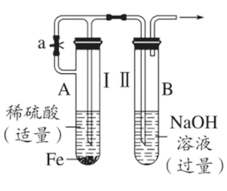

1. 检查气密性; 
2. 打开止水夹 $a$ , 利用 $I$ 试管产生的 $H_2$ 排尽装置内空气;
3. 待排尽后(尾气验纯以确定), 关闭止水夹 $a$ , 由于气压差, $H_2$ 会将液体压入 $II$ 管, 开始反应. 

当然, 在制备强还原性物质时, 也可以通入惰性气体(或还原性气体)充当保护气, 如稀有气体或 $N_2$ 等. 保护气一般"先来后走", 提前通入排走空气, 在反应停止后仍继续通入防止氧化. 也可加入还原性更强的保护剂, 如制备 $FeSO_4$ 溶液时, 加入 $Fe$ 粉. 

### 铁盐与亚铁盐

常见的亚铁盐与铁盐有: $FeSO_4 \cdot 7H_2O$ 是绿矾, 绿色固体; $FeCl_3$ 为棕色固体. 

$Fe^{2+}$ 在水中为浅绿色, $Fe^{3+}$ 在水中为黄色. 

$Fe^{2+}$ 可与 $OH^-$ 或 $CO_3^{2-}$ 形成沉淀; $Fe^{3+}$ 可与 $OH^-$ 形成沉淀(此处未涉及 [相互促进水解(待完善超链接)]() ), 且其只能存在于强酸环境中, 与 $Al^{3+}$ 一致. 

$Fe^{2+}$ 与 $Fe^{3+}$ 间的除杂可以通过氧化还原反应. 如将 $Fe^{2+}$ 转化为 $Fe^{3+}$ , 可以使用绿色氧化剂 $H_2O_2$ 等; 将 $Fe^{3+}$ 转化为 $Fe^{2+}$ , 可以使用 $Fe$ 等还原剂. 

$Fe^{3+}$ 可以与金属单质, 如 $Fe, Cu$ 等发生反应. 方程式如下: 

- $Fe + 2Fe^{3+} \xlongequal{\quad} 3Fe^{2+}$
- $Cu + 2Fe^{3+} \xlongequal{\quad} 2Fe^{2+} + Cu^{2+}$

$Fe^{3+}$ 与 $Cu$ 的反应可以用于刻蚀电路板. 

由方程式易知, 一般来说, 氧化性: $Fe^{3+} > Cu^{2+} > H^+ > Fe^{2+}$ ; 还原性: $Fe > H_2 > Cu > Fe^{2+}$ (将氧化性顺序中物质变成对应的还原产物并且倒置即可得到). 由此我们可以解决铁铜混合类的题目. 

特别地, 与 $Cl^-, Br^-$ 不同, 由于离子还原性符合 $I^- > Fe^{2+} > Br^- > Cl^-$ , $Fe^{3+}$ 可以与 $I^-$ 发生反应, $2Fe^{3+} + 2I^- \xlongequal{\quad} 2Fe^{2+} + I_2$ . 

#### 铁离子与亚铁离子的检验

由于铁离子与硫氰根离子的显色反应 $Fe^{3+} + 3SCN^- \xrightleftharpoons{\quad} Fe(SCN)_3$ , $KSCN$ (硫氰化钾)可以用于检验 $Fe^{3+}$ 的存在, 现象为溶液显血红色. 

$K_3[Fe(CN)_6]$ (铁氰化钾, [配合物(超链接待补全)]() )可以用于检验 $Fe^{2+}$ , 会产生蓝色沉淀(普鲁士蓝), 十分灵敏. 方程式为: $3Fe^{2+} + 2[Fe(CN)_6]^{3-} \xlongequal{\quad} Fe_3[Fe(CN)_6]_2\downarrow$ . 生成的沉淀中外界的铁为 $+3$ 价, 内界的铁为 $+2$ 价.

以上是比较优秀的检验方法, 当然还有其他方式:

- 观察法. 观察溶液颜色. 但溶液太稀难以观察; 且可能有其他情况颜色相同, 如 $CrO_4^{2-}, Br_2, I_2$ 溶液均为黄色.
- 沉淀法. 加入 $NaOH$ , 观察沉淀颜色. 对于 $Fe^{2+}$ 要求其浓度较高, 否则难以观察到白色絮状沉淀.
- 氧化还原法. 使用 $KMnO_4(H^+)$ 检测 $Fe^{2+}$ , 紫色褪去; 或淀粉 $- KI$ 溶液检测 $Fe^{3+}$ , 溶液变蓝. 此方法易受其他还原剂或氧化剂干扰.
- 间接显色法. 针对检验 $Fe^{2+}$ , 先加入 $KSCN$ 溶液排出 $Fe^{3+}$ 干扰, 后加入氯水或双氧水等氧化剂, $Fe^{2+}$ 转变为 $Fe^{3+}$ ,溶液变成血红色. 此方法要求加入的氧化剂不能过强过量, 以免氧化 $SCN^-$ ; 且体系中不应存在 $Fe^{3+}$ ; 不能引入如 $KMnO_4$ 等有色物质以免干扰显色观察.

### 合金

合金是由两种或两种以上的金属或金属与非金属熔合而成的, 具有金属特性的物质. 其硬度一般高于其纯的成分金属, 熔点一般低于其纯的成分金属. 

合金的物理, 化学或机械性能一般高于纯金属. 其性能可以通过调节所添加的元素种类, 含量与生成条件实现. 

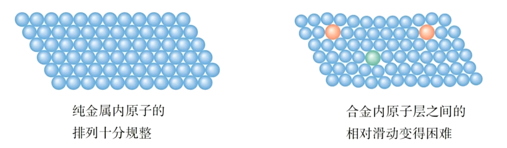

制成合金后, 结构发生了变化, 导致其性能发生变化. 如图, 原子大小变得不一, 导致层间相对滑动更加困难, 硬度变大. 其他的物体性质我们将在 [电子气理论(待补全超链接)]() 处解释. 

#### 铁合金

生铁与钢均为铁碳合金, 区别在于含碳量. 生铁含碳 $2\% \sim 4.3\%$ , 而钢含碳 $0.03\% \sim 2\%$ . 由于含碳量不同, 二者性能有所差异. 生铁硬度大, 抗压, 性脆, 可以铸造成型. 而钢具有良好的延展性, 机械性能好, 可以锻轧和铸造. 

铁碳合金又称碳素钢, 分为低碳钢, 中碳钢与高碳钢. 还有合金钢, 又称特种钢, 根据加入碳素钢元素的不同获得不同的特殊性能(基于碳素钢添加). 

#### 铝合金

铝是一种活泼金属, 在常温下与氧气发生反应, 在表面形成致密的氧化铝薄膜, 防止进一步氧化. 因此铝在空气中有良好的抗腐蚀性能. 我们可以增加膜的厚度, 或对膜进行着色处理, 来增加其性能. 

由于 $Al_2O_3$ 为两性氧化物, 故其不适于盛放酸性或碱性的物质. 含 $NaCl$ 的物质(如腌制食品)也不适于盛放在纯铝容器内, 因为 $Cl^-$ 会破坏氧化膜结构, 加速腐蚀.  

铝合金是目前用途广泛的合金之一. 

#### 新型合金

为解决氢能对储氢的要求, 储氢合金被发现. 其可以大量吸收 $H_2$ 形成金属氢化物, 加热后分解释放 $H_2$ 且速率快. 可以代替钢瓶运输氢气或液氢. 

钛合金因其极高的性能而闻名. 耐热合金, 记忆合金等也广泛应用于尖端领域. 

#### 稀土金属

$III B$ 族的 $Sc, Y$ , 以及镧系元素供共 $17$ 种元素被称为稀土元素, 它们在自然界中共生在一起, 性状相似. 其用途广泛, 是"新材料的宝库". 因其可以改善合金的性能, 故称为"冶金工业的维生素". 

## 铝

铝形成致密的氧化铝薄膜方程式为: $4Al + 3O_2 \xlongequal{\triangle} 2Al_2O_3$ . 

与铁一致, 铝也会发生钝化, 故其可以在 **常温** 下接触 **浓** 硫酸与 **浓** 硝酸. 

铝是活泼金属, 需要使用电解法制备. 由于 $AlCl_3$ 中为共价键, 熔融状态下不电离, 故选用 $Al_2O_3$ 进行电解, 并使用冰晶石( $Na_3AlF_6$ , 六氟合铝酸钠, 配合物)降低熔点. 方程式为 $2Al_2O_3(熔融) \xlongequal[冰晶石]{电解} 4Al + 3O_2\uparrow$ . 

铝热反应是使用铝粉还原一些金属氧化物, 得到难熔金属的一类反应. 可以用于冶炼稀有金属, 焊接铁轨, 定向爆破等. 以铁为例, 如图, 方程式为 $2Al + Fe_2O_3 \xlongequal{高温} Al_2O_3 + 2Fe$ . 

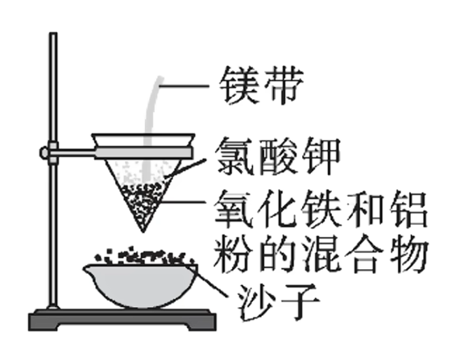

图中氧化铁与铝粉的混合物称为铝热剂. 我们使用镁带进行点燃(温度高), 并使用助燃剂氯酸钾( $KClO_3$ 受热分解释放 $O_2$ ). 一旦引燃铝热剂, 反应即可放出大量光与热, 反应极其剧烈. 

$Al$ 与 $NaOH$ 等强碱反应不会停留在 $Al(OH)_3$ 沉淀, 而是会继续反应生成 $[Al(OH)_4]^-$ (四羟基合铝酸根, 配离子), 方程式为: $2Al + 2NaOH + 6H_2O \xlongequal{\quad} 2Na[Al(OH)_4] + 3H_2\uparrow$ . 故铝单质不论与酸还是碱均可释放氢气, 有两性. 

### 氧化铝

氧化铝是白色固体, 熔点高, 硬度大, 难溶于水. 可以制造耐火材料, 也可用于冶炼铝. $Al_2O_3$ 为两性氧化物, 与强酸反应: $Al_2O_3 + 6H^+ \xlongequal{\quad} 2Al^{3+} + 3H_2O$ ; 与强碱反应: $Al_2O_3 + 2OH^- + 3H_2O \xlongequal{\quad} 2[Al(OH)_4]^-$ . 

### 氢氧化铝

氢氧化铝是白色固体, 难溶, 其胶体吸附能力强, 可以凝聚水中的悬浮物. 如净水剂明矾( $KAl(SO_4)_2 \cdot 12H_2O$ )通过电离出的 $Al^{3+}$ 进行水解, 生成 $Al(OH)_3$ 胶体从而达到净水的目的. 

$Al(OH)_3$ 有两性, 既可以与强酸反应( $Al(OH)_3 + 3H^+ \xlongequal{\quad} Al^{3+} + 3H_2O$ )也可以与强碱反应( $Al(OH)_3 + OH^- \xlongequal{\quad} [Al(OH)_4]^-$ ).  

$Al(OH)_3$ 不稳定, 受热易分解, $Al(OH)_3 \xlongequal{\triangle} Al_2O_3 + 3H_2O$ . 

我们可以通过一下三种方式得到 $Al(OH)_3$:

- $Al^{3+}$ 与过量弱碱, 如氨水 $NH_3 \cdot H_2O$ : $Al^{3+} + 3NH_3 \cdot H_2O \xlongequal{\quad} Al{OH}_3\downarrow + 3NH_4^+$ . 
- $[Al(OH)_4]^-$ 与过量弱酸, 如 $CO_2$ : $[Al(OH)_4]^- + CO_2 \xlongequal{\quad} Al(OH)_3\downarrow + HCO_3^-$ . 注意生成 $HCO_3^-$ 而非 $CO_3^{2-}$ , 因为 $CO_2$ 过量. 
- 相互促进水解, 方程式为: $Al^{3+} + 3[Al(OH)_4]^- \xlongequal{\quad} 4Al(OH)_3\downarrow$

需要注意的是, 如果使用了过量强酸或强碱, 则会一步反应到底, 变为 $Al^{3+}$ 或 $[Al(OH)_4]^-$ , 不会保留 $Al(OH)_3$ .

## 硫

### 硫单质

硫常见化合价有 $-2, 0, +4, +6$ . 在自然界中既存在游离态, 如火山口附近的硫单质, 也存在化合态. 

硫单质存在多种同素异形体, 如 $S_2, S_8$ 等. 我们统一使用 $S$ 来表示硫单质. 硫单质为淡黄色固体, 又称硫黄, 质脆, 难溶于水, 微溶于酒精, 易溶于二硫化碳 $CS_2$ (相似相溶), 熔沸点较低. 

在高中阶段, 淡黄色固体可能为:

- $S$ 单质;
- $AgBr$ ;
- $Na_2O_2$ .

硫单质有一定的氧化性, 如:

- $Fe + S \xlongequal{\triangle} FeS$ (黑色), $S$ 氧化性有限, $Fe$ 无法被氧化至 $+3$ 价. 
- $2Cu + S \xlongequal{\triangle} Cu_2S$ (黑色). 注意 $Cu$ 只能被氧化至 $+1$ 价. 
- $Hg + S \xlongequal{\quad} HgS$ (黑色), 可用于除去洒落的 $Hg$ . 
- $2Na + S \xlongequal{研磨} Na_2S$ (白色).
- $H_2 + S \xlongequal{\triangle} H_2S$ (无色, 强还原性, 臭鸡蛋味).

很多硫化物均极难溶, 如 $CuS, Ag_2S, PbS$ 等黑色沉淀. 由于极难溶的特性, 它们或可实现"弱酸制强酸", 如 $H_2S + CuSO_4 \xlongequal{\quad} CuS\downarrow + H_2SO_4$ . 它们甚至不溶于 $HCl$ , 稀 $H_2SO_4$ 等非氧化性酸. 

硫单质也有一定的还原性:

- $S + O_2 \xlongequal{点燃} SO_2$ (无色). 注意此反应无法生成 $SO_3$  .
- $3S + 6NaOH(浓) \xlongequal{\triangle} 2Na_2S + Na_2SO_3 + 3H_2O$ , 歧化反应. 故可用 **热** 的 $NaOH$ 溶液除附着在试管壁上的 $S$ . 也可使用 $CS_2$ 进行冲洗.
- $S + 2KNO_3 + 3C \xlongequal{\triangle} K_2S + N_2\uparrow + 3CO_2\uparrow$一硫二硝三木炭, 可用于制备黑火药.

### 硫的氧化物

硫的氧化物主要有 $SO_2$ 与 $SO_3$ . $SO_2$ 在常温与标况下均为无色气体, 有刺激性气味, 易溶于水( $1 : 40$ ), 密度大于空气, 有毒. $SO_3$ 在标况下为 **固体** , 常温常压下与水互溶. 故标况下 **无法** 使用 $V_m$ 计算 $SO_3$ . 两种气体尾气处理时均需要防倒吸, 因为较高的溶解度. 

#### 二氧化硫

$+6$ 价的 $S$ 较 $+4$ 价更稳定. 故 $+4$ 价 $S$ 的还原性较强. $+4$ 价硫对应的酸根为 $SO_3^{2-}$ , $+6$ 价对应的酸根为 $SO_4^{2-}$ . $SO_3^{2-}$ 与 $Ca^{2+}, Ba^{2+}, Ag^+, Cu^{2+}, Zn^{2+}, Fe^{2+}$ 等阳离子形成沉淀, 但这些沉淀易溶于酸, 故将 $SO_2$ 通入 $CaCl_2, BaCl_2$ 等溶液需要加入碱除去酸或加入氧化剂变为硫酸盐沉淀才可以出现浑浊.  

$SO_2$ 作为酸性氧化物, 有以下反应: 

- $SO_2(少) + 2NaOH \xlongequal{\quad} Na_2SO_3 + H_2O$ , 可用于尾气处理. 
- $SO_2(足) + NaOH \xlongequal{\quad} NaHSO_3$ .
- $SO_2 + CaO \xlongequal{\quad} CaSO_3$ , 在燃煤时加入生石灰可以有效防止 $SO_2$ 的逸散.
- $SO_2 + H_2O \xrightleftharpoons{\quad} H_2SO_3$ , 可逆反应, 故 $SO_2$ 水溶液中存在 $H_2O, SO_2, H_2SO_3, H^+, HSO_3^-, SO_3^{2-}, OH^-$ . 

故 $SO_2$ 也可使澄清石灰水变浑浊, 过量后恢复澄清, 但可通过气味与 $CO_2$ 进行区分. 

$H_2SO_3$ 是中强酸, 是指在弱酸中较强的酸, 仍然不能完全电离. 

$SO_2$ 具有强还原性(如 $SO_2 + X_2 + 2H_2O \xlongequal{\quad} SO_4^{2-} + 2X^- + 4H^+, X = Cl, Br, I$ ), 弱氧化性(如 $SO_2 + 2H_2S \xlongequal{\quad} 3S + 2H_2O$ , 归中反应), 以及漂白性. 

$SO_2$ 的漂白性是暂时的, 需要与色素分子(一般为有机色素, 如品红)进行化合变为其他无色物质, 不稳定, 加热后可复原. 故 $SO_2$ 的漂白性原理与 $H_2O_2, HClO, O_3$ 等氧化漂白不同, $SO_2$ 通入紫色石蕊溶液中, 溶液只变红不褪色. 注意因还原性使溶液褪色时不体现漂白性. 

二氧化硫可以用于漂白织物或纸张, 以及食品防腐(适量即可)与作为抗氧化剂, 制备硫酸等. 

雨水中会溶解 $CO_2$ , 故雨水普遍为弱酸性. 由于 $CO_2$ 饱和溶液 $pH$ 为 $5.6$ , 故 $pH$ 小于 $5.6$ 的雨水称为酸雨. $SO_2$ (燃煤)是导致硫酸型酸雨的原因; $NO_x$ (汽车尾气)是形成硝酸型酸雨的原因. 酸雨可能使土壤酸化, 农作物减产, 也可损坏建筑物, 增加呼吸道疾病发病率. 

我们可以开发新能源, 处理工厂废气, 或使用脱硫煤减少酸雨. 可以使用石灰法对煤进行脱硫, $CaCO_3 \xlongequal{高温} CaO + CO_2\uparrow, 2CaO + 2SO_2 + O_2 \xlongequal{\triangle} 2CaSO_4$ . 

此反应无法捕获 $CO_2$ , 因为生成的 $CaCO_3$ 热稳定性较差, 故无法缓解温室效应. 

$SO_2$ 可以通过 $Na_2SO_3 + H_2SO_4(浓) \xlongequal{\quad} Na_2SO_4 + SO_2\uparrow + H_2O$ 来制取(强酸制弱酸). 由于 $SO_2$ 易溶于水, 故 $H_2SO_4$ 不可过稀, 否则难以冒出气体. 但也不可过浓, 否则水分子过少, 电离程度较低, 反应速率慢. 故一般选用 $70\%$ 左右的浓硫酸. 

此反应为固液不加热的反应, 但由于固体 $Na_2SO_3$ 为粉末状, 故不可用启普发生器. 

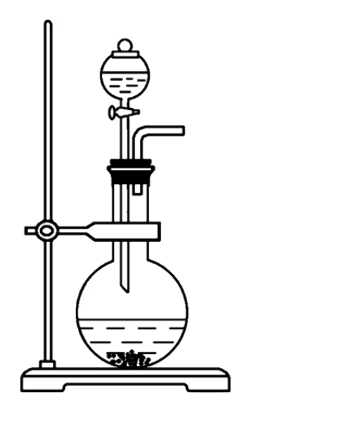

我们可以使用如图所示的装置. 检查气密性时, 可以使用液差法, 即使用止水夹关闭导出气体的导管, 开启分液漏斗的活塞, 若一段时间后观察到漏斗导管中存在一段稳定的液柱则证明气密性良好. 

$SO_2$ 作为酸性气体只能使用中性干燥剂(如无水 $CaCl_2$)或酸性干燥剂(如浓硫酸, $P_2O_5$ 等). 注意, 虽然 $SO_2$ 有强还原性, 浓 $H_2SO_4$ 具有强氧化性, 但由于二者变价元素均为 $S$ 且为相邻价态, 无法归终至中间价态, 故无法发生反应, 故可以使用浓硫酸进行干燥二氧化硫. 

收集时可以采用向上排空气法. 不可用排水法, 因为 $SO_2$ 易溶于水. 但可以用排液法, 排饱和 $NaHSO_3$ 溶液进行收集, 因气体在对应饱和酸式盐溶液中溶解度较小. 我们在主体气体中混杂酸性气体(如 $HCl$ )时使用的主体气体对应的饱和酸式盐溶液进行除杂原理相同. 

$SO_2$ 有毒, 需要尾气处理. 可以使用碱性物质(如 $NaOH$ 溶液)或氧化性物质(如酸性高锰酸钾溶液)进行处理. 因为其 $SO_2$ 溶于水, 易倒吸, 需要使用安全瓶(加装 **短进短出** 的空集气瓶在可能发生倒吸的装置前), 或使用如下防倒吸装置: 

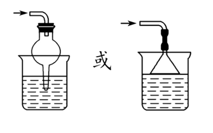

#### 三氧化硫

$2SO_2 + O_2 \xrightleftharpoons[\triangle]{催化剂(V_2O_5)} 2SO_3$ . 故 $S$ 单质在 $O_2$ 中燃烧无法生成 $SO_3$ . 有趣的是, 水溶液中的 $SO_2$ 易于与 $O_2$ 进行反应, $2SO_2 + O_2 + 2H_2O \xlongequal{\quad} 2H_2SO_4$ . 

$SO_3$ 具有酸性氧化物的通性, 如可以使用 $NaOH$ 处理尾气. 其极易溶于水, $SO_3 + H_2O \xlongequal{\quad} H_2SO_4$ , 极其剧烈.

### 硫酸

稀硫酸具备酸的通性. 其中的硫一般认为不具有氧化性. 而浓硫酸中 $H_2O$ 较少, $H_2SO_4$ 分子大量存在, 除强酸性外还具有强氧化性, 吸水性(吸收自由水或结晶水, 可为物理或化学变化)与脱水性(将有机物中的氢与氧按 $H : O = 2 : 1$ 的比例脱去, 导致有机物碳化, 化学变化, 如使纸张变黑, 故无法使用 $pH$ 试纸测定浓硫酸的酸性). 故浓硫酸可用作干燥剂, 脱水剂. 硫酸难挥发. 

硫酸对蔗糖进行脱水是化学变化; 硫酸吸收胆矾( $CuSO_4 \cdot 5H_2O$ )中的结晶水是化学变化, 而干燥气体或液体中的水为物理变化. 

在稀释浓硫酸时, 因其密度大于水, 且沸点大于水, 故应令酸入水, 沿杯壁缓慢注入, 并不断搅拌, 以防飞溅. 

黑面包实验是浓硫酸脱水性的直观展现. 向蔗糖中添加浓硫酸, 蔗糖先变黑( $C_{12}H_{22}O_{11} \xrightarrow{浓硫酸} 12C + 11H_2O$ , 体现脱水性), 后膨胀( $2H_2SO_4(浓) + C \xlongequal{\triangle} CO_2\uparrow + 2SO_2\uparrow + 2H_2O$ , 体现氧化性, 热量来自于第一步酸与脱出的水接触释放的热). 

浓硫酸具有强氧化性: 

- $2H_2SO_4(浓) + Zn \xlongequal{\quad} ZnSO_4 + SO_2\uparrow + 2H_2O$ ( $Zn$ 较活泼, 无需加热 )
- $2H_2SO_4(浓) + Cu \xlongequal{\triangle} CuSO_4 + SO_2\uparrow + 2H_2O$ ( $Cu$ 不活泼, 需加热 )
- $H_2S + 3H_2SO_4 \xlongequal{\quad} 4SO_2\uparrow + 4H_2O$ (也可能生成 $S\downarrow$ , 根据题目要求确定产物; 由此可知浓硫酸不能干燥 $H_2S$ 等还原性气体)

以上反应均体现了浓硫酸的酸性与氧化性, 有硫反应生成盐体现酸性, 也有硫化合价降低体现氧化性. 随着反应发生, 浓硫酸变为稀硫酸, 就不具备此种氧化性, 故而改变反应实质或停止反应. 

需要注意的是, 浓硫酸在反应中一般要注明"(浓)". 

浓硫酸对应的还原产物一般为 $SO_2$. 实际上, 反应中与 $S$ 有关的物质, 化合价一般只会在相邻的稳定价态( $-2, 0, +4, +6$ )间变化, 不会跨阶变化, 除非所遇见的氧化剂或还原剂非常强, 如浓 $H_2SO_4$ 与 $H_2S$ 的归中反应等特例. 

我们可以如图制备 $SO_2$ 气体: 

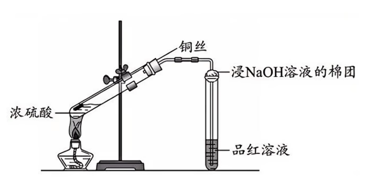

我们使用铜丝代替铜粉或铜片实验, 以拉伸控制反应速率. 将铜丝下端卷成螺旋状以增大接触面积, 增快反应速率. 浸有 $NaOH$ 的棉团可以吸收逸出的 $SO_2$ , 防止污染环境. 

开始加热, 铜丝表面有气泡生成, 品红溶液褪色; 将冷却后左侧试管中的物质缓慢倒入盛有水的烧杯中, 溶液呈蓝色( $CuSO_4$ 遇水电离出 $Cu^{2+}$ 才显蓝色). 

区分两种 $SO_2$ 制备方式的方法为观察是否加热发生装置. 本实验需要加热, 使用亚硫酸盐则无需加热. 

#### 浓硫酸的工业制法

在沸腾炉中令 $S$ (硫黄)或 $FeS_2$ (黄铁矿)在空气中燃烧, 生成 $SO_2$ . 过程中需注意粉碎固体反应物, 且空气从下方通入, 固体从炉顶加入, 形成"逆流"增大接触面积, 提高原料利用率. 

在接触室中使用 $V_2O_5$ 催化 $SO_2$ 变为 $SO_3$ . 注意温度控制在 $400 \sim 500 ^\circ C$ 间, 温度过高催化剂失活, 温度过低反应速率较慢. 

在吸收塔中将 $SO_3$ 溶于 $98.3\%$ 的浓硫酸中. 使用较浓的硫酸进行吸收以防反应时放热导致水汽化形成酸雾. 类似于沸腾炉, 我们也可从塔顶通入浓硫酸, 塔底通入 $SO_3$ , 形成"喷淋"状态以增大接触面积, 提高吸收率. 高中阶段认为此处为 $SO_3$ 与水进行反应, 但实际上为 $SO_3$ 与 $H_2SO_4$ 分子进行反应生成焦硫酸 $H_2S_2O_7$ . 

### 硫酸盐

$CaSO_4$ , 有 $CaSO_4 \cdot 2H_O$ (生石膏)与 $2CaSO_4 \cdot H_2O$ (熟石膏)两种结晶水化物. 二者可以通过 $2[CaSO_4 \cdot 2H_2O] \xlongequal{\triangle} 2CaSO_4 \cdot H_2O + 3H_2O$ 进行转化. 石膏可用于制作各种模型与医疗石膏绷带, 也可用于调节水泥硬化速率. 

水垢中有 $CaSO_4$ 成分, 其不能被酸除掉. 故可以通过反应 $CaSO_4(s) + Na_2CO_3(aq) \xlongequal{\quad} CaCO_3(s) + Na_2SO_4(aq)$ (溶解度大制溶解度小)将其转化为 $CaCO_3$ 从而使用酸除去. 

$BaSO_4$ 又称重晶石或钡餐, 既难溶于水, 又难溶于酸, 故可将其作为消化系统 X 射线检查的内服药剂, 即便其为重金属盐. 有反应 $BaSO_4 + 4C \xlongequal{高温} BaS + 4CO\uparrow$ . 

"矾"一般指含有结晶水的硫酸盐. 如胆矾(或蓝矾) $CuSO_4 \cdot 5H_2O$ , 由于其含有结晶水, 故显蓝色. 无水硫酸铜( $CuSO_4$ )为白色, 见水变蓝, 可用于检验是否有水, 但不能干燥. 农药"波尔多液"可使用硫酸铜溶液制备, 利用重金属铜进行杀虫.

绿矾为 $FeSO_4 \cdot 7H_2O$ , 可用于制备补血剂(因其含有 $+2$ 价铁, 为防止其被氧化, 通常搭配抗氧化剂(强还原剂), 如维生素 C 服用), 絮凝剂, 着色剂等. 

明矾为 $KAl(SO_4)_2 \cdot 12H_2O$ , 可作为净水剂, 膨化剂, 中药. 

大多数硫酸盐可溶, $BaSO_4, PbSO_4$ 难溶, $CaSO_4, Ag_2SO_4$ 微溶.

检验 $SO_4^{2-}$ 的操作为: 取少量待测液于试管中(所有检测一定要从取样开始描述), 先滴加适量盐酸酸化无明显现象(排除 $SO_3^{2-}, CO_3^{2-}, Ag^+$ 干扰), 再滴加几滴 $BaCl_2$ 溶液, 若生成白色沉淀则说明存在 $SO_4^{2-}$ . 

注意不能使用稀硝酸代替盐酸, 也不能使用 $Ba(NO_3)_2$ 溶液, 因为 $NO_3^-$ 遇见 $H^+$ 相当于稀硝酸, 具有强氧化性, $SO_3^{2-}$ 会转化为 $SO_4^{2-}$ , 故无法排除干扰. 若加入的是稀硝酸, 同时也无法排出 $Ag^+$ 的干扰. 

不能调换 $HCl$ 与 $BaCl_2$ 的顺序, 因为无法排出 $Ag^+$ 的干扰. 但其他干扰离子可以排除, 因为它们对应的沉淀在加入 $HCl$ 后会溶解, 但 $AgCl$ 与目标的 $BaSO_4$ 均不会. 因此不能直接加入盐酸酸化的 $BaCl_2$ 溶液, 而是需要分步加入(除非明确已知无 $Ag^+$ ). 

判断一个离子(以 $SO_4^{2-}$ 为例)是否沉淀完全的操作如下: 

1. 取少量上清液于试管中(一定要从取样开始描述);
2. 滴加能使其沉淀的溶液(示例所用为 $BaCl_2$ 溶液);
3. 若出现沉淀则未沉淀完全, 否则沉淀完全.

类似地, 判断沉淀是否洗涤干净也可以使用如下操作(以 $CuSO_4 + 2NaOH \xlongequal{\quad} Cu(OH)_2\downarrow + Na_2SO_4$ 为例, 判断 $Cu(OH)_2$ 上是否残留 $Na_2SO_4$ 杂质): 

1. 取最后一次洗涤液少许于试管中(需要描述取样, 且要体现最后一次);
2. 检验杂质离子其一的存在与否(示例所用为 $HCl + BaCl_2$ 检测 $SO_4^{2-}$ ).
3. 若未检出杂质离子(示例中为未出现白色沉淀), 则证明已经洗涤干净.

### 粗盐提纯

粗盐中主要含有 $MgCl_2, CaCl_2, Na_2SO_4$ 杂质, 即 $SO_4^{2-}, Ca^{2+}, Mg^{2+}$ 杂质. 考虑将杂质转化为沉淀/气体/水/ $NaCl$ (故不要引入难除掉的 $K^+, NO_3^-$ 等). 我们可以通过以下步骤解决: 

1. 除 $Mg^{2+}$ : 加入稍过量的 $NaOH$ , 沉淀为 $Mg(OH)_2$ ; 
2. 除 $SO_4^{2-}$ :加入稍过量的 $BaCl_2$ , 沉淀为 $BaSO_4$ ;
3. 除 $Ca^{2+}, Ba^{2+}$ : 加入稍过量的 $Na_2CO_3$ , 沉淀为 $CaCO_3, BaCO_3$ ( $Ba^{2+}$ 来自第二步稍过量的 $BaCl_2$ , 故 $Na_2CO_3$ 一定要在 $BaCl_2$ 后面的步骤中加入, 顺序不能调换);
4. 过滤沉淀, 以防重新溶解于盐酸;
5. 除引入的 $CO_3^{2-}, OH^-$ : 加入稍过量的 $HCl$ 溶液.
6. 蒸发结晶出 $NaCl$ 晶体, 在过程中加热除掉 $HCl$ (挥发).

注意蒸发结晶的正确操作为: 边加热边搅拌; 有较多晶体析出后, 停止加热, 使用余热将剩余液体蒸干.

## 氮

氮常见化合价有 -3 ( $NH_3, NH_4^+$ ), 0 ( $N_2$ ) , +2 ( $NO$ ), +3 ( $HNO_2$ , 亚硝酸), +4 ( $NO_2$ ), +5 ( $HNO_3$ ). 自然界中既存在其游离态(氮气), 又存在其化合态. 

氮气的结构式为 $N \equiv N$ . 氮气为无色气体, 难溶于水, 熔沸点很低. 密度(M = 28)约等于空气(M = 28.8), 因为空气中约 $\frac{4}{5}$ 均为 $N_2$ . 

$N_2$ 十分稳定, 常用于作保护气(因其中存在三键). 故氮气的反应一般需要发生条件: 

- $N_2 + 3Mg \xlongequal{点燃} Mg_3N_2$ , 即镁可以在氮气中燃烧. 故镁条在空气中燃烧, 产物不仅有 $MgO$ , 还有 $Mg_3N_2$ , 但主要产物为 $MgO$ , 因为 $O_2$ 的氧化性强于 $N_2$ .

  需要注意的是, $Mg$ 也可在 $CO_2$ 中燃烧, 方程式为 $2Mg + CO_2 \xlongequal{点燃} 2MgO + C$ . $Mg$ 也可与水蒸气发生反应: $Mg + H_2O(g) \xlongequal{点燃} MgO + H_2\uparrow$ ; 且 $Mg_3N_2$ 会发生强烈水解: $Mg_3N_2 + 6H_2O \xlongequal{\quad} 3Mg(OH)_2 + 2NH_3\uparrow$ , 故镁等化学物质导致的火灾不可使用水或 $CO_2$ 灭火器进行灭火.

- $6Li + N_2 \xlongequal{点燃} 2Li_3N$ , 故锂也可在氮气中燃烧.

- $N_2 + 3H_2 \xrightleftharpoons[催化剂]{高温, 高压} 2NH_3$ , 这是工业合成氨的方程式. 这是可逆反应, 故已知投料比无法得出产量(除非已知转化率); 但若已知反应了多少反应物则可以计算生成物的产量. 

- $N_2 + O_2 \xlongequal{放电/高温} 2NO$ , 注意放电与通电的区别. 故在雷雨天, 雷击会导致空气中氮气与氧气反应生成 $NO$ , 这是一种高能固氮的方式.

  注意, $N_2$ 与 $O_2$ 无法一步生成 $NO_2$ , 需要 $NO$ 与 $O_2$ 发生第二步反应才可.

氮的固定是指将大气中的游离态的氮( $N_2$ )转化为氮的化合物的过程. 如根瘤菌进行生物固氮, 雷雨天放电时雷电作用的高能固氮, 工业合成氨等人类固氮. 

### 氮的氧化物

氮的氧化物主要有 $NO$ 与 $NO_2$ 两种. 有时也会出现 $N_2O$ (氮 +1 价, 俗称笑气, 具有麻醉功效, 毒品), $N_2O_3$ (氮 +3 价), $N_2O_4$ (氮 +4 价, $NO_2$ 的二聚体), $N_2O_5$ (氮 +5 价). 

需要注意的是, $NO_2$ 的水溶液呈酸性, 其也属于酸性气体, 但不属于酸性氧化物, 因为其没有对应的酸, 属于不成盐氧化物. 但 $N_2O_3$ 与 $N_2O_5$ 分别对应 $HNO_2$ 与 $HNO_3$ , 是酸性氧化物. 且它们分别是亚硝酸与硝酸的酸酐(由含氧酸脱水得到的化合物, 并能与水反应重新生成原来的酸, 如 $CO_2$ 为碳酸酐, $SO_2$ 为亚硫酸酐, $SO_3$ 为硫酸酐等). 

注意, 氮的氧化物均有毒. 以下详细介绍 $NO$ 与 $NO_2$ : 

- $NO$ . 无色无味气体, 不溶于水, 密度略大于空气, 有毒.

  - $NO$ 可以迅速被 $O_2$ 氧化为 $NO_2$ , $2NO + O_2 \xlongequal{\quad} 2NO_2$ , 故 $NO$ 不能使用排空气法收集, 保存 $NO$ 也要隔绝氧气. 但可用排水法收集. 
  - 可以使用氧化剂吸收 $NO$ 尾气, 如 $5NO + 3MnO_4^- + 4H^+ \xlongequal{\quad} 3Mn^{2+} + 5NO_3^- + 2H_2O$ .
  - $2NO + 2CO \xlongequal[\triangle]{催化剂} N_2 + 2CO_2$ , 这是汽车尾气处理的方法. 汽车尾气中有 $NO_x$ , 故下文还会提及 $NO_2$ 尾气的处理方法.

- $NO_2$ . 红棕色气体, 具有刺激性气味, 常温下为气体, 标况下 **不是** 气体, 需要注意. $NO_2$ 有毒, 易溶(生成硝酸与 $NO$ ), 密度大于空气.

  - 存在歧化反应 $3NO_2 + H_2O \xlongequal{\quad} 2HNO_3 + NO$ , 故不可使用排水法收集 $NO_2$ . 我们若在反应时通入 $O_2$ , 可以将产物 $NO$ 转变为 $NO_2$ , 进而重新作为反应物继续参与反应, 这也是硝酸的工业制法, 总方程式为 $4NO_2 + O_2 + 2H_2O \xlongequal{\quad} 4HNO_3$ , 能提高氮元素的利用率. 
  - 有歧化反应 $2NO_2 + 2NaOH \xlongequal{\quad} NaNO_3 + NaNO_2 + H_2O$ , 故可用 $NaOH$ 等碱性物质处理 $NO_2$ 尾气.
  - $2NO_2 + 4CO \xlongequal[\triangle]{催化剂} N_2 + 4CO_2$ , 这是汽车尾气的处理方法.
  - $N_2O_4$ (无色气体, 氮 +4 价, 与 $NO_2$ 一致)是 $NO_2$ (红棕色气体)的二聚体, $2NO_2 \xrightleftharpoons{\quad} N_2O_4$ , 放热反应, 反应自发进行. 故常见的 $NO_2$ 中往往有一部分 $N_2O_4$ .

高中阶段可能出现的红棕色物质有: 

- 固体: $Fe_2O_3$ .
- 液体: $Br_2$ (液溴).
- 气体: $NO_2$ , $Br_2$ (溴蒸气).

氮氧化物 $NO_x$ 的危害较大: 

- 光化学烟雾: 汽车尾气中的 $NO_x$ 与烃在紫外线(太阳光照即可)作用下发生一系列反应, 生成有毒的烟雾.
- 硝酸型酸雨: $NO_x$ 与雨水反应生成 $HNO_2, HNO_3$ . 故硝酸型酸雨主要由燃油汽车尾气排放导致, 硫酸型酸雨主要由燃煤导致. 
- 臭氧空洞: $NO_x$ 与臭氧层中 $O_3$ 发生反应, 导致臭氧空洞.
- 令人体中毒: $NO_x$ 与血红蛋白结合, 导致其失去运氧能力.

对于氮氧化物溶于水的题型, 把握以下三个方程式: 

- $3NO_2 + H_2O \xlongequal{\quad} 2HNO_3 + NO$ , 若题目未涉及 $O_2$ 时使用, 需要把握通过体积差量来计算的思路; 
- $4NO_2 + O_2 + 2H_2O \xlongequal{\quad} 4HNO_3$ (4124 反应), 若同时通入 $O_2$ 与 $NO_2$ 可以考虑. 注意若 $O_2$ 过量则剩余 $O_2$ , 但若 $NO_2$ 过量则剩余 $NO$ , 因为过量的 $NO_2$ 会溶于水生成 $NO$ . 总之, 不会有 $NO_2$ 剩余. 
- $4NO + 3O_2 + 2H_2O \xlongequal{\quad} 4HNO_3$ (4324 反应), 若同时通入 $O_2$ 与 $NO$ 时可以考虑.

变化量(即参与反应的量)对于此种题型来说十分重要. 此类题型若有必要, 需要分类讨论. 若同时通入 $O_2, NO, NO_2$ 时, 需要同时考虑使用第二与第三两个方程式. 

### 硝酸

硝酸具有强氧化性. 稀硝酸对应的还原产物为 $NO$ , 浓硝酸对应的还原产物为 $NO_2$ . 故可能随着浓硝酸的反应变稀, 还原产物发生改变. 

故我们可以通过如下反应制备 $NO$ 与 $NO_2$ : 

- $3Cu + 8HNO_3(稀) \xlongequal{\quad} 3Cu(NO_3)_2 + 2NO\uparrow + 4H_2O$ (38324 反应), 使用排水法收集.
- $Cu + 4HNO_3(浓) \xlongequal{\quad} Cu(NO_3)_2 + 2NO_2\uparrow + 2H_2O$ (14122 反应), 使用排空气法收集.

注意, 若溶液中既存在 $H^+$ , 又存在 $NO_3^-$ , 则视为存在 **稀** 硝酸, 如混合 $HCl$ 与 $NaNO_3$ 溶液, 也认为其中存在稀硝酸, 具有氧化性. 但若 $NO_3^-$ 未遇见 $H^+$ , 其 **不能** 表现出氧化性.

硝酸会受热分解, $4HNO_3 \xlongequal{\triangle} 4NO_2\uparrow + O_2\uparrow + 2H_2O$ . 

金属与硝酸反应相关计算, 硝酸可能既显酸性又显氧化性. 可以借助化合价升降来解题, 也要会善于使用电子得失守恒与原子守恒, 仅关注电子在始末物质间如何转移, 而忽略中间复杂的化学变化. 若出现多种金属, 考虑能否整体看待, 若不能则可能需要设未知数解方程. 若使用稀硫酸与稀盐酸的混合酸, 稀硫酸的用途可能为提供 $H^+$ 并提供阴离子, 从而使更多的 $NO_3^-$ 进行氧化还原反应. 对于混合酸题型, 需要把握谁先反应完, 然后以反应完的物质相关数据进行计算. 

### 氨

氨气的化学式为 $NH_3$ , 其中有一个孤电子对, 故可以作为配体形成[配合物(待补全超链接)](), 如 $NH_4^+$ 为 $NH_3$ 与 $H^+$ 配合形成. 氨气无色, 具有刺激性气味. 氨气极易溶于水(与水间存在[氢键(待补全超链接)](), 且与水会发生反应), 故不能使用排水法收集, 在处理尾气时直接使用水进行吸收即可, 但需要防倒吸. 氨气密度小于空气, 故可以使用向下排空气法收集. $NH_3$ 间存在氢键, 故易液化, 可用作制冷剂(液氮汽化时吸热). 

我们可以设计喷泉实验验证氨气极易溶于水. 如图, 

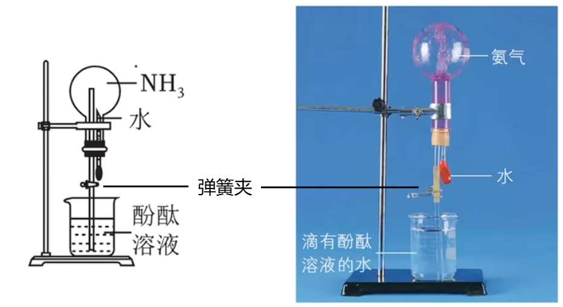

先打开弹簧夹, 确认酚酞溶液未因气压而上升. 然后挤压胶头滴管, 释放其中的水, 溶解氨气. 如此, 烧瓶中气压骤然减小(本质为出现压强差, 故不论是利用气体溶于水, 还是气体与溶液反应, 还是改变温度将气体液化, 均可以导致压强减小, 出现压强差, 引发喷泉), 下方的酚酞溶液迅速被吸至烧瓶中, 并遇见氨水变为红色. 所以, 本质上喷泉实验就是氨气导致的倒吸. 

当然, 其他极易溶于水的气体也可进行喷泉实验, 如 $HCl$ 气体, 同时将酚酞溶液改为石蕊溶液, 也可观察到红色喷泉. 胶头滴管中的水也可以换成任意与烧瓶中气体发生反应的溶液(如 $NaOH$ , 使得较不易溶于水的气体 如 $CO_2$ 等也可发生喷泉实验, 但是可能会对胶头有一定的腐蚀性), 或直接换为导管导入与烧瓶中气体反应的气体(如 $HCl$ 与 $NH_3$ ), 从而引发喷泉实验. 或者, 可以只使用单孔橡胶塞(正常情况下, 由于需要同时插入长导管与胶头滴管, 需要双孔橡胶塞), 利用氨气的扩散, 并使用热毛巾或手捂住烧瓶以加速扩散, 从而使氨气接触到下方的酚酞溶液, 从而引发喷泉. 

氨气有弱碱性, 其溶于水生成一水合氨(一元弱碱): $NH_3 + H_2O \xrightleftharpoons{\quad} NH_3 \cdot H_2O$ . 一水合氨电离方程式为: $NH_3 \cdot H_2O \xrightleftharpoons{\quad} NH_4^+ + OH^-$ . 其电离程度与醋酸( $CH_3COOH$ )相等, 故 $CH_3COONH_4$ (醋酸铵)溶液呈中性(参考[盐类水解(待补全超链接)]()). 

氨气溶于水形成氨水, 氨水中存在 $NH_3, NH_3 \cdot H_2O, NH_4^+, OH^-$ 等微粒. 氨水易挥发, 且 $NH_3 \cdot H_2O$ 易受热分解( $NH_3 \cdot H_2O \xlongequal{\triangle} NH_3\uparrow + H_2O$ ), 故氨水应盛装在棕色细口瓶中, 置于阴冷处保存. 

浓氨水受热分解也可用于实验室少量制备氨气, 如图所示: 

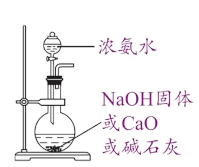

氢氧化钠固体/生石灰/碱石灰( $NaOH$ 与 $CaO$ 的混合物)的作用为溶解放热的同时增加溶液 $OH^-$ 浓度, 推动[平衡移动(超链接待完善)](), 从而促进 $NH_3$ 的生成. 

氨气是碱性气体, 也具有较强的还原性, 性质如下: 

- $NH_3 + HCl \xlongequal{\quad} NH_4Cl$ , 将蘸有氨水与蘸有挥发性酸(如盐酸, 硝酸, 醋酸)的玻璃棒靠近, 能看到白烟(铵盐晶体)生成.
- $4NH_3 + 5O_2 \xlongequal[\triangle]{催化剂(Pt)} 4NO + 6H_2O$ , 即氨的催化氧化( 4546 反应), 是工业制硝酸的重要一步. 但是, 除此方程外, 氨作为还原剂时, 一般只升价到 $N_2$ .
- $8NH_3 + 3Cl_2 \xlongequal{\quad} N_2 + 6NH_4Cl$ , 故可以使用浓氨水(挥发性强)检验氯气管道是否泄漏, 若泄露则出现 $NH_4Cl$ 白烟. 

氨有许多用途: 

- 液氨用作制冷剂;
- 制做氮肥; 
- 制硝酸, 分为三步: 
  1. $4NH_3 + 5O_2 \xlongequal[\triangle]{催化剂(Pt)} 4NO + 6H_2O$ ; 
  2. $2NO + O_2 \xlongequal{\quad} 2NO_2$ ; 
  3. $4NO_2 + O_2 + 2H_2O \xlongequal{\quad} 4HNO_3$ .
- 制作纯碱([侯氏制碱法(超链接待补全)]()).

由于氨气为碱性气体, 需要使用碱性干燥剂, 如碱石灰, 如图: 

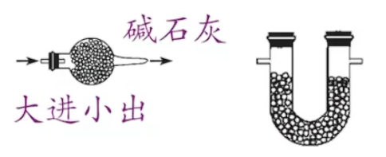

图中左侧为球形干燥管, 只能从粗管进细管出, 以保证气体充分干燥; 右侧为 U 形管, 二者都只能盛装固体干燥剂. 

注意, 氨气不能使用中性干燥剂无水 $CaCl_2$ 来干燥, 因为会发生反应生成 $CaCl_2 \cdot 8NH_3$; 也不能使用酸性干燥剂(如 $P_2O_5$ , 浓 $H_2SO_4$ 等), 会发生反应生成铵盐. 

可以使用如下装置进行向下排空气收集氨气: 

其中棉花需要蘸取能吸收氨气的溶液以防有毒的氨气逸散, 同时防止对流, 使得收集到氨气更为纯净. 

### 铵盐

大多数铵盐易溶于水, 且溶于水时会吸热, 如 $NH_4NO_3, NH_4Cl$ 等, 体系温度会降低, 故常用于制作冰袋. 

铵盐可以与强碱反应生成弱碱 $NH_3 \cdot H_2O$ , 若加热(或反应 **剧烈放热** , 如直接与 $NaOH$ 固体反应)则继续分解为 $NH_3$ :

- $NH_4Cl + NaOH \xlongequal{\quad} NaCl + NH_3 \cdot H_2O$ , 注意条件若为加热则一水合氨需要受热分解.
- $NH_4Cl + Ca(OH)_2 \xlongequal{\triangle} CaCl_2 + 2NH_3\uparrow + 2H_2O$ , 这是实验室制备氨气的方法. 一般不使用稀溶液, 因为 $NH_3$ 会重新溶于水中, 造成损失. 不建议使用 $NaOH$ , 因为在加热的条件下, $NaOH$ 对玻璃仪器的腐蚀比较显著, 也不能不加入任何碱, 详见下文; 也不建议使用 $NH_4NO_3, (NH_4)_2SO_4, NH_4HCO_3$ 等铵盐, 因为可能引入杂质气体, 或发生爆炸.

  可以使用如下装置进行制备氨气:

  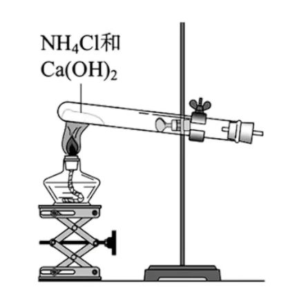

  因为反应为固固加热, 且会生成水, 故试管口倾斜向下, 避免冷凝水回流导致试管炸裂. 需要检查装置气密性, 然后将固体混合后, 平铺在试管底部以增大接触面积. 可以使用如下方式进行气密性检查: 将导管深入水槽中, 用手握住试管(改变温度来改变压强), 水槽中有气泡冒出, 松手后一段时间, 导管末端倒吸出现稳定液柱, 则证明装置气密性良好. 

故铵态氮肥在施用时不能与碱性肥料混施, 如草木灰 $K_2CO_3$ , 原因见[盐类水解(超链接待补全)](). 

铵盐易受热分解, 如: 

- $NH_4Cl \xlongequal{\triangle} NH_3\uparrow + HCl\uparrow$ , 在试管中加热, 试管底部固体消失, 但试管口会观察到白色晶体, 因为 $NH_3$ 与 $HCl$ 在试管口重新化合成 $NH_4Cl$ 晶体. 故此反应不能用于实验室制备 $NH_3$ , 会堵塞导管. 但可用此法实现从固体混合物中分离 $NH_4Cl$ (与 $I_2$ 类似, 加热升华, 在试管口遇冷凝华, 实现转移, 但若 $I_2$ 与 $NH_4Cl$ 混合则无法如此分离).
- $NH_4HCO_3 \xlongequal{\triangle} NH_3\uparrow + CO_2\uparrow + H_2O$ . 由此可知, 若盐对应的酸或碱不稳定, 则该盐往往也不稳定, 如铵盐, 碳酸氢盐等.
- $NH_4NO_3 \xlongequal{\triangle} NH_3\uparrow + HNO_3$ , 注意若条件合适, $NH_3$ 与 $HNO_3$ 可以继续进行氧化还原反应, 生成 $N_2O, N_2, O_2, NO_2, H_2O$ 等产物, 具体依据题目信息. 

由于铵盐易受热分解, 故保存铵态氮肥时, 需要密封, 低温保存. 

$NH_4^+$ 的检验方法为: 取少量样品溶于水, 加入 $NaOH$ 溶液并 **加热** (否则不一定有气体冒出), 若生成能使湿润的红色石蕊试纸变蓝的气体, 则证明存在 $NH_4^+$ . 

因为在高中阶段, 碱性气体仅有 $NH_3$ 一种. 

只使用一种试剂, 区分多种物质的溶液, 关键在于现象不同, 如无现象, 出现某颜色沉淀, 出现气泡, 有某种气味等, 或多种现象同时出现. 当然, 不要忘记此时可以互滴, 即改变少量与过量关系, 从而获取到不同的现象. 有时也可考虑加热等反应条件. 有时甚至可以使用已经鉴别出的物质作为鉴定试剂, 去检测其他物质, 当然, 此类题目一般比较困难.

## 干燥剂总结

干燥剂可以分为固态干燥剂(除浓硫酸外基本均为固态)与液态干燥剂(浓 $H_2SO_4$ ). 固态干燥剂需要使用球形干燥管或 U 形管盛放, 而液态干燥剂需要使用广口瓶盛放制成洗气瓶. 

干燥剂也可根据酸碱性分为: 

- 酸性干燥剂(干燥碱性或中性气体), 如硅胶(食品级干燥剂), 浓硫酸, $P_2O_5$ (遇水生成磷酸, 不能干燥食品)等.
- 碱性干燥剂(干燥酸性或中性气体), 如碱石灰, $CaO$ , $NaOH$ 固体等.
- 中性干燥剂(酸碱性或中性气体均能干燥), 如无水 $CaCl_2$ , 无水 $Na_2SO_4$ (主要用于有机物), 无水 $MgSO_4$ (有机物常用)等. 

当然, 可以使用的前提为不发生复分解, 氧化还原等反应. 一部分干燥剂有不能干燥的特例, 我们会在各个章节穿插讲解. 

注意, 无水 $CuCl_2$ 的吸水能力很小, 一般作为是否干燥的检测药品而非干燥剂使用. 

## 硅

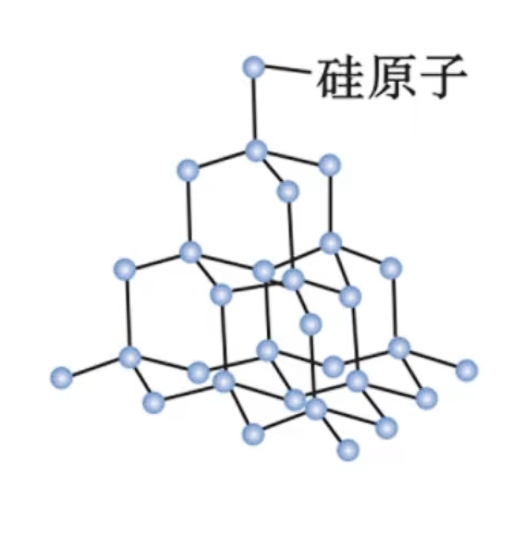

单晶硅为硅单质的晶体形态, 其为四面体立体网状结构, 如图. 单晶硅为带有金属光泽的灰黑色固体, 常温下化学性质不活泼, 如下: 

- $Si + 2F_2 \xlongequal{\quad} SiF_4$ ; 
- $Si + 4HF \xlongequal{\quad} SiF_4\uparrow + 2H_2$ ; 
- $Si + 2NaOH + H_2O \xlongequal{\quad} Na_2SiO_3 + 2H_2\uparrow$ ( $Na_2SiO_3$ 为白色, 可溶于水的粉末状固体, 其水溶液称为水玻璃(玻璃胶), 具有粘性, 可用作矿物胶; 硅酸钠也可用于制备硅胶, 或作为防腐剂与防火剂, 防止木材与纺织品的燃烧或变质).

若加热, 则可以发生更多反应: 

- $Si + 2Cl_2 \xlongequal{\triangle} SiCl_4$ ;
- $Si + O_2 \xlongequal{\triangle} SiO_2$ ;
- $Si + C \xlongequal{高温} SiC$ . 

若涉及到结构相关的计算, 详见[均摊法(超链接待完善)](). 

### 二氧化硅

二氧化硅的结构可以看做在单晶硅的结构中, 每条 $Si - Si$ 间插入 $O$ , 变为 $Si - O - Si$ , 立体网状结构不改变. 

$SiO_2$ 硬度大, 难溶于水, 不导电. $SiO_2$ 为酸性氧化物, 除 $HF$ 等外与大部分酸不反应, 可与碱反应: 

- $SiO_2 + 4HF \xlongequal{\quad} SiF_4\uparrow + 2H_2O$ . 故玻璃瓶可以盛装很多酸, 但不能盛装氢氟酸. 也可使用 $HF$ 来刻蚀玻璃. 
- $SiO_2 + 2NaOH \xlongequal{\quad} Na_2SiO_3 + H_2O$ , 故 $NaOH$ 不能盛放于带有磨口玻璃塞的玻璃瓶, 会生成矿物胶硅酸钠导致瓶塞黏结. 但玻璃瓶仍然可以盛放氢氧化钠, 因为其内壁光滑, 反应速率非常慢. 
- $SiO_2 + 2C \xlongequal{高温} Si + 2CO\uparrow$ , 用于制备高纯硅.
- $Na_2CO_3 + SiO_2 \xlongequal{高温} Na_2SiO_3 + CO_2\uparrow, CaCO_3 + SiO_2 \xlongequal{高温} CaSiO_3 + CO_2\uparrow$ , 用于制作玻璃.

因此, 石英坩埚与瓷坩埚的主要成分为 $SiO_2$ , 不能用于加热 $NaOH, Na_2CO_3$ 等碱性物质. 

### 硅酸

$H_2SiO_3$ 的酸性很弱, 甚至弱于碳酸. 其溶解度很小, 是少见的难溶于水的酸, 故硅酸在水中是沉淀. 硅酸的热稳定性很差, 易受热分解: $H_2SiO_3 \xlongequal{\triangle} SiO_2 + H_2O$ . 

硅酸浓度大时在水中易聚合形成透明, 胶冻状的硅酸凝胶. 经干燥脱水后得到多孔酸的硅酸干凝胶, 成为硅胶. 硅胶为多孔状, 吸附水分子能力强, 常用作干燥剂或催化剂的载体. 

由于硅酸酸性很弱, 故可以使用强酸制弱酸生成: 

- $Na_2SiO_3 + 2HCl \xlongequal{\quad} H_2SiO_3(胶体) + 2NaCl$ ;
- $Na_2SiO_3 + CO_2 + H_2O \xlongequal{\quad} H_2SiO_3\downarrow + Na_2CO_3$ , 此反应可以用于验证硅酸酸性弱于碳酸. 

### 无机非金属材料

传统无机非金属材料多为硅酸盐材料, 如陶瓷, 水泥, 玻璃等. 

硅酸盐中,  $Si$ 与 $O$ 构成了硅氧四面体, 并形成网状结构. 其结构特殊性, 决定了硅酸盐材料多为硬度高, 熔点高, 难溶于水, 化学性质稳定, 耐腐蚀等特点. 

常见的无机非金属材料有: 

- 陶瓷. 主要原料为黏土(含水的铝硅酸盐), 经高温烧结而成. 主要成分为 $Al_2O_3 \cdot 2SiO_2 \cdot 2H_2O$ . 由于其抗氧化, 抗腐蚀, 耐高温且绝缘, 可用于生产建筑材料, 绝缘材料或日用器皿.
- 玻璃. 主要原料为石英砂(主要为 $SiO_2$ ), 纯碱, 石灰石( $CaCO_3$ ), 在高温下经复杂的物理与化学变化制得. 可能发生的方程式有: $Na_2CO_3 + SiO_2 \xlongequal{高温} Na_2SiO_3 + CO_2\uparrow, CaCO_3 + SiO_2 \xlongequal{高温} CaSiO_3 + CO_2\uparrow$ . 主要成分为 $Na_2SiO_3, CaSiO_3, SiO_2$ . 可用于生产建筑材料, 光学仪器与各种器皿, 还可制造玻璃纤维用于高强度复合材料等.
- 水泥. 主要原料为黏土与石灰石. 经复杂的物理与化学变化, 加入适量石膏调节硬化速率, 再研磨成细粉得到水泥. 其主要成分为硅酸二钙, 硅酸三钙, 铝酸三钙. 水泥具有水硬性, 即与水掺和搅拌并静置后, 容易凝固变硬. 水泥, 沙子与碎石等与水混合可以得到混凝土, 大量用于建筑与水利工程.

综上, 黏土为陶瓷与水泥的原料之一, 而石灰石为玻璃与水泥的原料之一. 

新型无机非金属材料突破了传统的硅酸盐体系, 其中有一些为高纯度含硅元素的材料, 如单晶硅, 二氧化硅等, 还有一些含碳, 氮等其他元素. 如: 

- 硅单质的性质介于导体与绝缘体之间, 是应用最广泛的半导体材料(其余如 $Te, Sb, B, Ge, As$ 等元素应用不如 $Si$ 多). 晶体硅中的杂质会影响其导电性能, 因此必须制备高纯度的硅单质. 我们可以通过以下步骤: 

  1. 石英砂( $SiO_2$ )与焦炭在 $1800^\circ C \sim 2000^\circ C$ 下生成粗硅: $SiO_2 + 2C \xlongequal{1800^\circ C \sim 2000^\circ C} Si + 2CO\uparrow$ .
  2. 在 $300^\circ C$ 下生成三氯硅烷气体 $SiHCl_3$ : $Si + 3HCl \xlongequal{300^\circ C} SiHCl_3 + H_2$ .
  3. 还原三氯硅烷气体: $SiHCl_3 + H_2 \xlongequal{1100^\circ C} Si + 3HCl$ . 

  晶体硅可用于制造半导体, 芯片, 硅太阳能电池(太阳能板, 通过[光电效应(超链接待补全)](), 物理变化)等产品. 

- 二氧化硅是石英, 水晶, 玛瑙, 玻璃的主要成分, 但他们的纯度各不相同. 二氧化硅可以生产光导纤维, 用于光纤通信.

- 新型陶瓷有很多新的特性与功能, 如:

  - 碳化硅陶瓷( $SiC$ ), 俗称金刚砂, 具有类似金刚石的结构, 硬度很大, 可用于砂纸与砂轮的磨料. 其还具有优异的高温抗氧化性能, 可用作耐高温结构材料, 耐高温半导体材料等.
  - 氮化硅陶瓷( $Si_3N_4$ ), 耐磨耐高温, 具有润滑性, 可用于制作轴承零件, 发动机部件等.
  - 压电陶瓷可以实现机械能与电能的相互转化.
  - 透明陶瓷.
  - 生物陶瓷, 即氧化铝陶瓷, 抗氧化能力强, 生物相容性好.

- 碳纳米材料. 纳米材料指材料长/宽/高任意一维属于纳米尺寸的材料. 碳纳米材料包括富勒烯(碳原子构成的笼形分子, 如 $C_{60}$ 等, 具有超导性能), 碳纳米管(可看作石墨片层卷成的管状物, 比表面积大, 有高强度与优秀的电化学性能), 石墨烯(单层石墨, 电阻率低, 导热率高, 具有高强度)