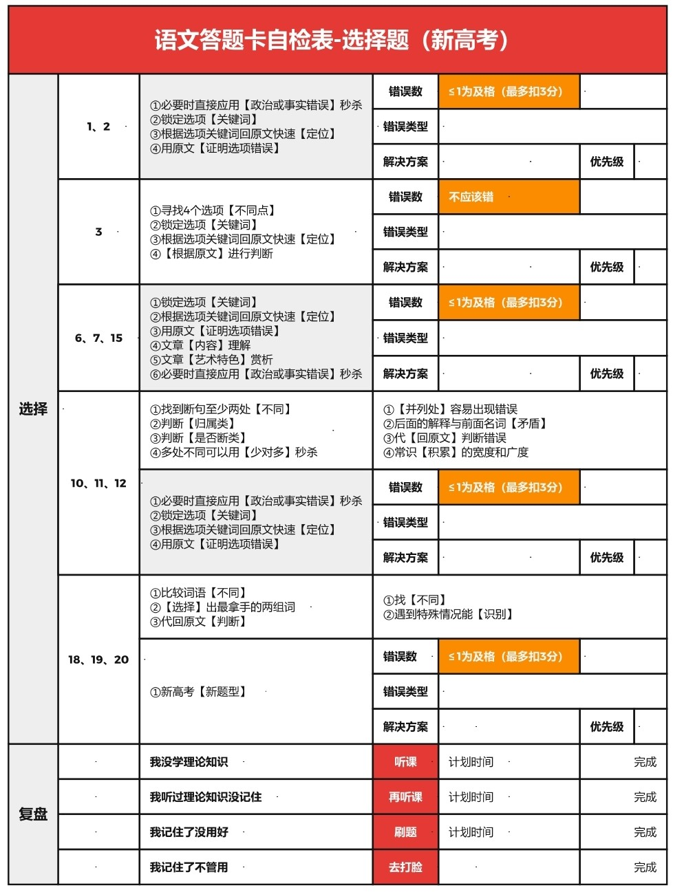

# 语文简介

高中阶段的语文考试题型大致相同, 不论高一还是高三, 均分为两篇现代文阅读(信息类文本阅读与文学类文本阅读), 两篇古诗文阅读(文言文与古诗词), 名句默写以及语言文字应用和作文. 语文学习没有固定的学习顺序, 你可以选择自己薄弱或感兴趣的部分进行阅读. 

考试中所有的阅读题中均涵盖选择题与大题. 处理现代文阅读建议首先读大题题干, 处理大题, 再回头处理选择题; 而对于古诗文阅读, 考虑先通过选择题中的选项理解文本, 再处理大题. 

对于选择题, 首先观察选项, 考虑证伪选项, 可以通过寻找事实错误或回归原文两种方法判断. 若迫不得已需要回归文本, 不要通读原文, 先找出选项中的关键词, 再去原文中比对查找到相关区域进行阅读. 当然, 关键词不需一模一样才锁定, 含义相似即可锁定. 

对于大题, 分为概括题( $What$ 题, 是什么, 有什么特点, 有何表层/深层含义), 手法题( $How$ 题, 如何做的, 用了什么手法)以及作用题( $Why$ 题, 为何这样做, 好处是什么). 首先判断题目是什么类型, 若非手法题亦非作业题即概括题. 当然, 语文大题的问法愈加丰富, 需要一定的做题经验来判断具体为那种题型. 其中概括题的出题角度最丰富最灵活, 其余两种题型也可能使用, 需要依据关键词判断范围, 回到原文寻找答案提炼信息, 主要考察概括能力; 手法题需要积累并识别使用了何种手法; 作用题考虑回答对其他元素的作用, 对于不同文体需要回答的方向不同. 

整场考试可能的做题顺序大致如下: 

1. 文学类文本阅读( $22 min$ ): 如小说或散文, 建议发下试卷后至开考前五分钟简单看完作文题目直接开始阅读, 因其逻辑较为简单, 大致了解即可, 用于进入考试状态.  
2. 名句默写( $3 min$ ): 较为简单, 可以先处理掉.  
3. 信息类文本阅读( $27 min$ ): 别慌张逐字对比. 
4. 文言文阅读( $20 min$ ): 直译即可, 大致理解文本意思.  
5. 古诗文阅读( $10 min$ ): 同上.  
6. 语言文字应用( $15 min$ ). 
7. 作文( $50 min$ ). 
8. 检查涂卡等( $2 min$ ). 

当然, 也欢迎将以上方法优化为适合自己的方案. 

这里提供 [@学过石油的语文老师](https://space.bilibili.com/39737405) 分享的考试复盘 [选择题自检表](https://www.bilibili.com/video/BV19M4y1P7iN) . 

<a href="./images/自检表.png" download="选择题自检表.png"> 点击下载. </a> 

