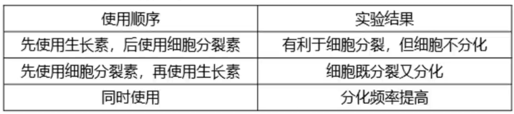
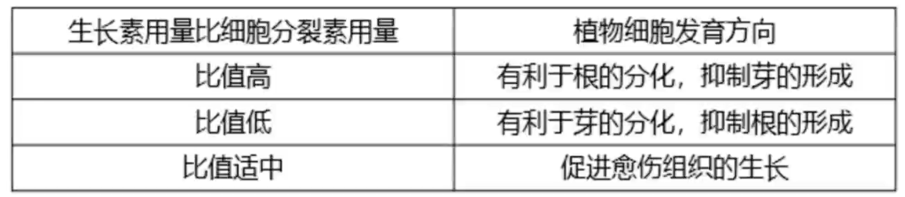

# 细胞工程

## 植物

### 植物组织培养

将离体植物器官, 组织, 细胞等(外植体)培养在人工配制的培养基上, 给予适宜的培养条件, 诱导其形成完整植株即是植物组织培养(无性繁殖). 原理为植物细胞的全能性. 

细胞分裂分化后仍具有产生完整生物体或分化成其他细胞的潜能为全能性, 因为基因的选择性表达, 故不是所有细胞都体现全能性. 细胞含有生物全部遗传信息. 表达全能性条件:
1. 完整细胞结构
2. 离体状态
3. 一定的营养, 激素及外界适宜环境

一般过程为:

$$外植体 \xrightarrow{脱分化} 愈伤组织 \xrightarrow{再分化} 生根生芽或变为胚状体 \xrightarrow{\quad} 完整植株$$

外植体一般选择幼嫩部位(分裂旺盛)或花药(得到单倍体)等. 

脱分化与再分化都是分化的一种, 都是基因的选择性表达. 注意脱分化不能光照, 否则会形成维管组织而非愈伤组织. 

愈伤组织是未分化的细胞, 是不定形的薄壁组织团块(故有细胞壁). 愈伤组织的特点有: 排列疏松, 无规则, 高度液泡化, 呈无定形的薄壁细胞, 具有分裂和未分化特性. 

再分化需要使用植物激素, 主要是生长素( $IAA$ )与细胞分裂素( $CTK$ ). 

胚状体是在离体培养的条件下, 未经过受精过程, 但经过胚胎发育过程形成的胚状类似物, 一般专指组织培养条件下产生的非合子胚(不是由受精卵发育而来). 

植物组织培养所用的培养基一般为 $MS$ 固体培养基, 其中有蔗糖(提供营养, 调节渗透压(利于吸水)), 激素, 琼脂(固体)等物质. 

对于外植体的消毒, 需要先流水冲洗(冲表面杂质, 如土), 在酒精消毒 $30s$ , 然后使用无菌水清洗若干次, 在用次氯酸钠溶液处理 $30min$ 后立即用无菌水冲洗数次. 

接种时需要先将外植体切成小段, 在酒精灯旁将其 $\frac{1}{3}$ 长度插入培养基中, 保证形态学上端向上, 下端向下. 培养时在 $18^\circ C \sim 22^\circ C$ 下培养即可. 

再分化时需要先诱导生芽再生根(防止损伤幼嫩根部), 由于其激素需求不同, 故需更换培养基. 诱导生芽需要光照诱导. 

进一步诱导形成试管苗后使其适应环境, 清洗后转移到消毒后的蛭石或珍珠岩中, 待其长壮后移栽入土. 

### 植物体细胞杂交

将不同种的植物细胞在一定条件下融合为杂种细胞, 并培育成新植物体. 

首先需要用纤维素酶与果胶酶去壁(需要在等渗或较高渗透压条件下, 防止无细胞壁支持吸水涨破)形成原生质体(较原生质层多液泡). 使用物理或化学方法诱导融合(实质是细胞核融合, 故染色体数为原先二者之和). 融合完成后可以再生壁(即融合完成的标志). 融合时可能有多种情况(如自身融合, 多细胞融合), 故需要进一步使用选择培养基等方法筛选. 然后使用植物组织培养技术培养成植株. 

遗憾的的是, 番茄与土豆细胞融合后所形成的植株并不能长番茄或土豆, 可能是因为遗传信息相互干扰. 

原理有: 细胞膜的流动性, 与植物细胞的全能性. 

优点为: 打破生殖隔离, 实现远缘杂交育种. 

其中诱导方法有: 
1. 物理方法: 电融合法, 离心法等;
2. 化学方法: 聚乙二醇 ( $PEG$ ) 融合法, 高 $Ca^{2+} -$ 高 $pH$ 融合法等.

### 植物细胞工程

植物繁殖新途径:
1. 快速繁殖, 利用植物组织培养技术. 优点: 无性繁殖, 保持优良遗传特性; 培养周期短, 繁殖率高.
2. 作物脱毒, 选取病毒少的组织如茎尖进行植物组织培养从而获得脱毒植物.
3. 人工种子, 将植物组织培养得到的胚状体, 不定芽, 顶芽, 侧芽等材料(不能是未分化的愈伤组织)包裹人工膜得到. 一般有人工种皮, 人工胚乳, 胚状体等部分. 也可加入固氮细菌, 农药, 激素, 除草剂等. 优点: 保持品种优良特性; 不受季节, 气候, 地域限制; 方便储存运输; 解决繁殖能力差, 结子困难或发芽率低的问题.

作物新品种培育:
1. 单倍体育种: 花药离体培养, 明显缩短育种年限, 后代稳定遗传且都是纯合子; 
2. 突变体
3. 转基因植物
4. 植物体细胞杂交

细胞产物的工业生产: 

次生代谢物是一类小分子有机物, 可用于抗虫抗病, 药物, 染料香料色素等. 可以通过植物细胞培养获取, 可能获得蛋白质, 脂肪, 糖类, 药物, 香料, 生物碱等.