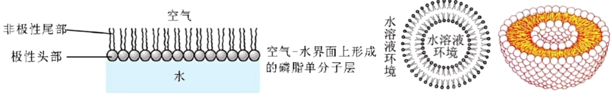
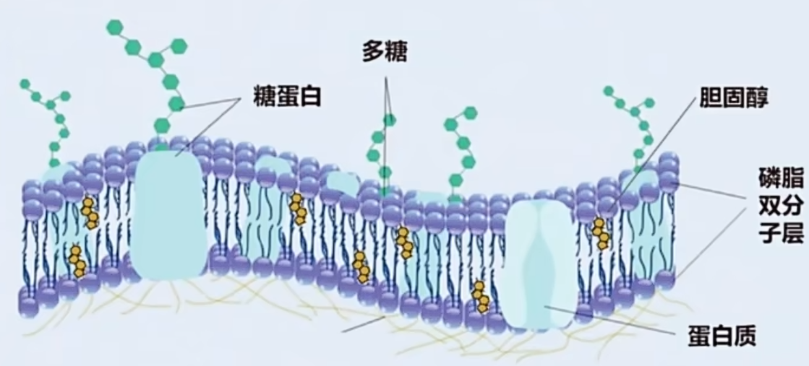
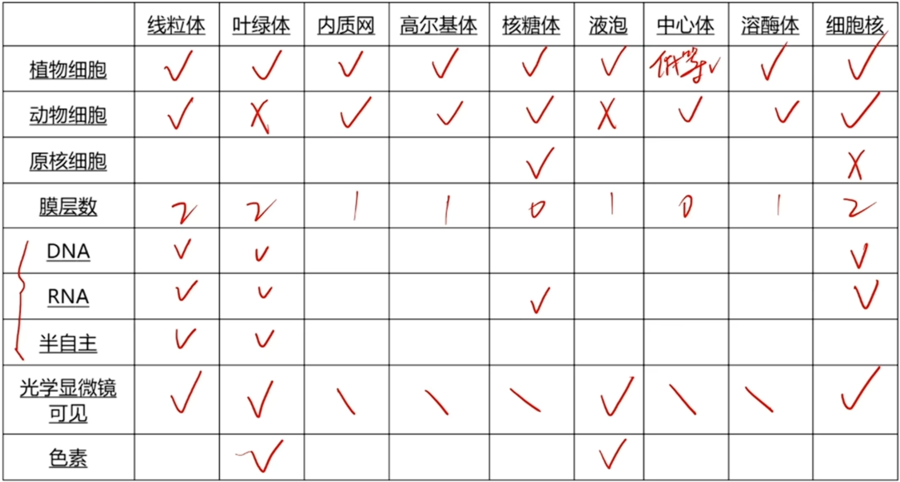
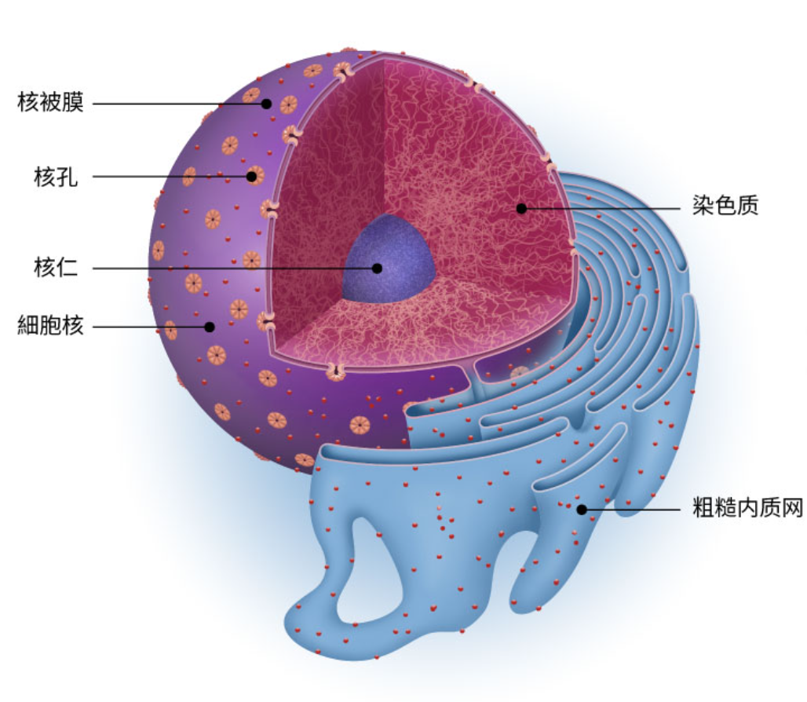

# 细胞

## 细胞膜

欧文顿对植物细胞进行通透性实验, 推测膜由脂质组成.  
二十世纪初分离哺乳动物红细胞膜(无细胞核细胞器(膜), 无细胞壁(易涨破))得知细胞膜含有磷脂与胆固醇, 其中磷脂最多.  
戈特和格伦德尔用丙酮从人的红细胞提取脂质, 在空气 $-$ 水界面上铺展成单层分子, 测得单分子层的面积为红细胞表面积的两倍, 推测细胞膜中脂质为连续两层分子排列.   
{ width=500px }  
丹尼利与戴维森通过研究细胞膜张力发现其低于油 $-$ 水表面, 推测其表面可能还附有蛋白质.  
罗伯特森在电子显微镜下发现细胞膜显示 "暗(蛋白质) $-$ 亮(脂质) $-$ 暗(蛋白质)" 三层结构. 他把生物膜描述为静态同一结构(其实不然).   

然后进行了人鼠细胞融合实验, 通过不同颜色的荧光标记物分别标记人与鼠的膜蛋白, 诱导其融合后培养发现两色荧光标记均匀散布与细胞膜而非位于原处有明显分界. 由此推得细胞膜具有流动性. 

桑格与尼克森提出生物膜的流动镶嵌模型. 

{ width=500px }

膜的成分及结构: 
1. 脂质(约 $50\%$): 磷脂与少量胆固醇(动物细胞), 磷脂双分子层构成膜的基本支架.
2. 蛋白质(约 $40\%$): 决定膜的功能, 镶嵌/嵌入/贯穿在磷脂双分子层中
3. 糖类(约 $2\% \sim 10\%$): 以糖蛋白(与糖类结合)或糖脂(与脂质结合)的形式存在, 只分布于细胞外侧.

糖蛋白只存在于细胞膜外侧, 具有识别(作为受体), 黏着, 保护等作用, 可用于信息交流. 

膜的结构特性: 具有一定的流动性. (磷脂分子和大部分蛋白质(如依附蛋白质)可以流动, 小部分贯穿蛋白质不可)

膜的功能特性: (一定的)选择透过性. (如病毒入侵, 细胞膜选择透过性失效) 选择透过性主要与磷脂双分子层与蛋白质有关. 

细胞膜的功能: 
1. 将细胞与外界环境隔开; 
2. 控制物质进出细胞(选择透过性); 
3. 进行细胞间的信息交流. 

台盼蓝染液可以区分死细胞与活细胞, 死细胞会被染成蓝色而活细胞不会, 体现细胞膜的选择透过性. 

细胞之间交流的方式: 
1. 循环系统运送信号分子(如激素)并与受体结合. 
2. 细胞直接接触, 细胞膜上的信息分子与受体结合(如精子与卵细胞). 
3. (植物)细胞间的胞间连丝进行物质运输与信息交流.

---

细胞可以分为细胞膜, 细胞核, 细胞质. 细胞质分为细胞质基质与细胞器. 细胞器存在于细胞质内, 被细胞骨架所固定, 只能被电子显微镜观察到, 为亚显微结构. 

{ width=500px }

## 细胞质基质

又称细胞溶胶, 成分有水, 无机盐, 脂质, 糖类, 氨基酸, (核糖)核苷酸, 酶等. 状态为透明的胶装物质; 功能是活细胞新陈代谢的场所, 为新陈代谢的进行提供物质和环境条件. 

线粒体, 叶绿体等细胞器中也存在类似的基质. 

## 细胞骨架

由蛋白质纤维构成的网架结构. 与细胞运动, 分裂分化及物质运输, 能量转化, 信息传递等生命活动密切相关. 

## 分泌蛋白

$$
氨基酸 \xrightarrow{脱水缩合} 多肽链 \xrightarrow{盘曲折叠} 蛋白质 \xrightarrow{分泌} 细胞外
$$

分泌蛋白是指在细胞内合成后, 分泌到细胞外发挥作用的蛋白质, 如消化酶, 抗体, 部分激素等. 

分泌蛋白的去向有: 
1. 细胞膜上的蛋白质
2. 细胞外
3. 溶酶体中的水解酶

以下的核糖体, 内质网, 高尔基体, 线粒体是参与分泌蛋白分泌过程的细胞器. 

### 核糖体

由蛋白质与 $rRNA$ 组成, 是合成蛋白质的场所(氨基酸脱水缩合为肽链).  
体积较小, 外形可以认为是一个小点, 实际上由小亚基与大亚基组成. 

核糖体无膜. 细胞中存在游离的与固着的核糖体两种. 游离的核糖体负责胞内蛋白的合成; 固着在内质网上的核糖体负责分泌蛋白的合成. 

一般认为核糖体是原核细胞唯一的细胞器. 

### 内质网

单层膜连接而成的网状结构. 分为粗面内质网与光面内质网. 粗面内质网有核糖体附着, 与蛋白质加工有关(多肽链初步盘曲折叠形成蛋白质); 光面内质网与脂质的合成相关. 内质网靠近细胞核. 

内质网形成囊泡包裹着待转运蛋白离开至高尔基体

### 高尔基体

来自内质网的囊泡与高尔基体膜融合, 经高尔基体修饰加工其中的蛋白质后形成囊泡包裹其离开至细胞膜, 并于细胞膜融合分泌到细胞外. 经由囊泡运输的过程需要线粒体功能; 在细胞膜分泌的过程属于胞吐. 

单层膜围成的扁平囊和囊泡, 对来自内质网的蛋白质进行加工, 分类和运输. 在动物细胞中与分泌物的形成有关; 在植物细胞中与细胞壁的形成有关. 故动物中分泌物较多或分泌蛋白多的部位高尔基体发达. 

研究分泌蛋白的合成路径的研究方法为: (放射性)同位素标记法(或同位素示踪法).   
同位素中中子数较多的一般具有放射性, 但氮 $- 15$ , 氧 $- 18$ 尽管中子数较多, 但不具有放射性, 故无法用于进行相关实验. 用的较多的同位素有氕/氘/氚, 碳 $- 14$ .

标记的前提是物质中含有此元素, 且此同位素具有放射性(或质量差别较大). 

### 线粒体

线粒体是双层膜, 成短棒状, 线形, 为细胞有氧呼吸的主要场所(第二, 三阶段). 线粒体内膜凸起形成嵴, 为增大内膜面积, 增加酶的附着位点. 线粒体基质中存在 $DNA, RNA$ 与核糖体, 因此能够合成一部分蛋白质, 还是需要细胞核指导合成蛋白质, 故属于半自主的细胞器. 

### 胞内蛋白

与分泌蛋白不同地, 胞内蛋白在游离的核糖体翻译出肽链后在细胞质基质内盘曲折叠直接进入细胞器(如线粒体, 叶绿体, 细胞核等, 但不包括溶酶体). 

## 叶绿体

与线粒体类似地, 叶绿体也为双层膜, 叶绿体基质中存在 $DNA, RNA$ 与核糖体, 属于半自主的细胞器. 叶绿体呈扁平的椭球形或球形, 为光合作用的场所. 内外膜均平整, 通过类囊体堆叠为基粒增大类囊体薄膜. 类囊体中含有光合色素, 参与光合作用. 叶绿体只存在于绿色植物的部分部位(如根尖等部位没有). 

## 液泡

存在于成熟植物细胞(分生组织无)中. 单层膜, 内含细胞液(由水, 无机盐, 色素(非光合色素, 不能进行光合作用), 糖类, 蛋白质等组成), 体积极大, 用于贮存以及调节细胞内的环境, 充盈的液泡可以保持植物细胞的坚挺. 

## 溶酶体

溶酶体为单层膜, 含多种水解酶. 可以分解自身衰老损伤的细胞器, 杀死侵入细胞的病毒细菌等, 与细胞凋亡有关(执行细胞自噬). 

## 中心体

无膜, 由两个垂直排列的中心粒蛋白以及周围物质组成, 与细胞有丝分裂有关(纺锤体形成). 一般分布于动物细胞和低等植物细胞中. 

## 细胞核

细胞核的结构可以分为核膜, 核孔, 核仁, 染色质(体). 核膜为双层膜, 将细胞核与细胞质分开, 并控制小分子物质进出细胞核. 核孔为细胞膜上的通道, 控制大分子物质进出细胞核. 核仁与 $rRNA$ 的合成以及核糖体的形成相关. 染色质由蛋白质与 $DNA$ 缠绕组成, 与染色体为同种物质在不同时期的不同形态, 易被碱性染料(醋酸洋红, 龙胆紫等)染成深色而得名. 

细胞核是遗传信息库; 是细胞代谢和遗传的控制中心. 

{ width=500px }

## 生物膜系统

只有真核生物才有生物膜系统, 由细胞膜, 细胞核膜, 细胞器膜, 囊泡组成. 在结构上具有流动性, 在功能上具有选择透过性. 

功能: 
1. 边界; 物质运输, 能量转换, 信息传递的过程中起决定性作用.
2. 提供多种酶的附着位点.
3. 分隔内外环境, 保证细胞生命活动高效有序进行.

各种生物膜之间或直接相连并更新(如细胞核膜, 内质网膜直接相连), 或通过囊泡进行联系. 囊泡也是有磷脂双分子层构成的结构, 包裹物质(一般是大分子, 也有部分小分子神经递质)并运输. 囊泡与膜的结合为生物膜的融合, 磷脂双分子层融合(故会影响膜面积), 双分子层之间的物质会留在生物膜之间.