# 细胞代谢

## 酶

探究历程:

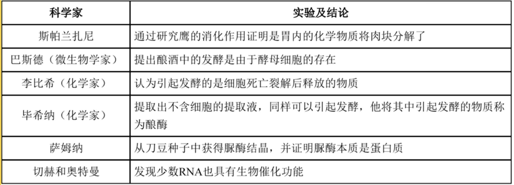{ width=500px }

(注: 新教材奥特曼可能修改为奥尔特曼. )

酶是活细胞产生(无法通过摄食获取)的具有催化作用(不参与反应)的有机物. 绝大多数酶是蛋白质, 少部分为 $RNA$ . 酶可以降低反应所需的活化能从而催化反应, 但酶本身不提供能量. 酶作为催化剂只加快反应速率, 不改变平衡状态和产物的量.

酶在生物体内外均可作用, 活细胞都可产生酶, 具有高效性, 专一性(特定酶催化特定反应), 作用条件温和(否则失活).

### 酶特性探究实验

实验原则:

1. 单一变量原则: 控制变量, 变量分为自变量, 因变量, 以及无关变量. 要控制无关变量各组一致.
2. 对照原则: 对照试验中, 除自变量以外, 其他无关变量不人为改变保持一致, 自变量为自然状态下的为对照组, 否则为实验组, 对比对照组与实验组之间因变量的差异.

酶的高效性体现在它的催化效率大约是无机催化剂的 $10^7 \sim 10^{13}$ 倍.

酶的专一性体现在其只能催化一种或一类化学反应, 通过底物与酶的活性部位相结合催化底物转化为产物, 而活性部位的结合位点限制了与酶结合的底物类型.

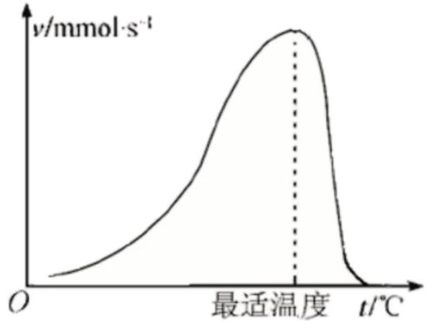{ width=500px }

与蛋白质变性类似地, 温度降低化学反应速率下降, 但酶不失活, 升高温度仍然可以恢复; 但温度升高酶逐渐变性, 再次降低温度无法恢复催化作用. 动物体内酶的最适温度大约在 $35 \sim 40\celsius$ 左右, 植物在 $40 \sim 50\celsius$ 左右. 保存酶制剂适于在低温($0 \sim 4\celsius$)保存.

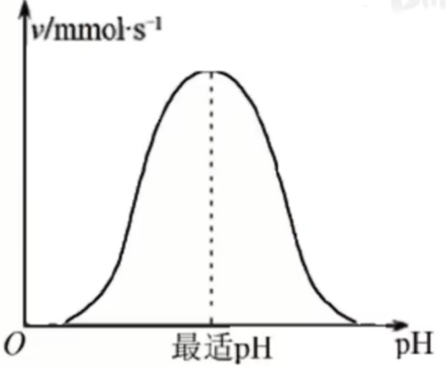{ width=500px }

过酸与过碱环境与高温一致, 会使酶失活, 不可逆. 各种酶的最适酸碱度差异较大, 如胃蛋白酶可以低至 $1.5$ , 胰蛋白酶高至 $8.0 \sim 9.0$ .

缓冲液可以保证溶液酸碱度($pH$)在一定限度内不发生改变.

酶的抑制剂: 酶的抑制剂分为可逆型与不可逆型, 不可逆型抑制剂与酶的结合位点结合后不再分离, 阻止酶与底物的结合; 可逆型抑制剂分为两种:

1. 竞争型抑制剂: 与底物竞争结合位点从而阻碍酶与底物的结合.
2. 非竞争型抑制剂: 通过改变酶的结合位点从而阻止酶与底物的结合.

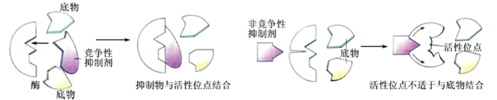{ width=500px }

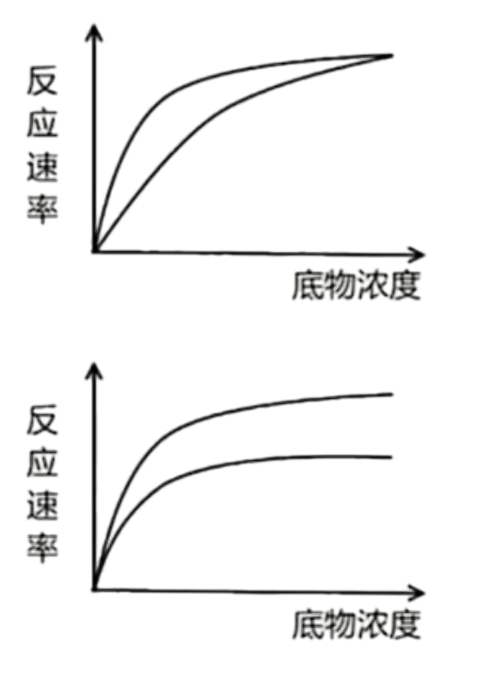{ width=500px }

第一幅图为竞争型抑制剂, 在底物浓度足够大时, 竞争型抑制剂竞争不过底物; 第二幅图为非竞争型抑制剂, 其与酶一旦结合, 酶上的结合位点形态发生改变, 不再有底物可以与之结合, 故即便底物足够多, 也不再提升反应速率.

## $ATP$

$ATP$ , 即腺苷三磷酸, 结构简式为 $A - P \sim P \sim P$ , 详细如下.

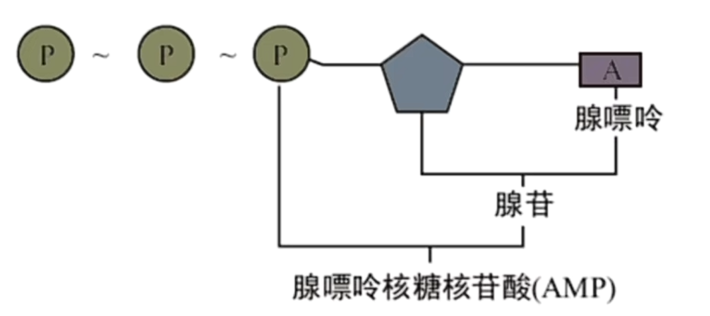{ width=500px }

$ATP$ 中 $A$ 代表腺苷, $T$ 代表三($tri-$)($D$ 代表二($di-$), $ADP$; $M$ 代表一($mono-$), $AMP$,), $P$ 代表磷酸基团, $\sim$ 代表高能磷酸键.

可以发现, $AMP$ 即腺嘌呤核糖核苷酸. 当然, 也有其他含氮碱基所对应的 $TTP, CDP, GMP, UTP$ 等.

$ATP$ 的特点:

1. 高能量: 高能磷酸键水解时释放很多能量
2. 不稳定性: 化学性质不稳定, 远端的高能磷酸键易水解

$ATP$ 三个磷酸基团的水解顺序为由远端至近端, 逐个水解. $ATP$ 为生命活动直接提供能量(葡萄糖等为间接提供能量), 是细胞内流通能量的"货币".

$ATP$ 的水解和合成:
$ATP \xrightarrow[\quad]{酶} ADP + Pi + 能量$ ,其中 $Pi$ 为磷酸基团, 释放的能量可以用于各项生命活动.  
$ADP + Pi + 能量 \xrightarrow[\quad]{酶} ATP$, 能量用以形成高能磷酸键, 其中的能量对于异养生物来说来自于呼吸作用所释放的能量, 对于自养生物来说在除呼吸作用之外, 还可以来自于光合作用所利用的光能或化能合成作用所利用的化学能.

以上两个反应不是可逆反应, 所需要酶的类型不同(一个是 $ATP$ 合成酶一个是 $ATP$ 水解酶), 且场所与能量来源也不同. $ATP$ 与 $ADP$ 的含量很少, 但相互转化非常迅速.

$ATP$ 所释放的能量可以为主动运输功能:

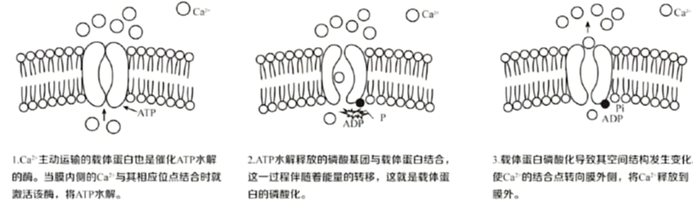{ width=500px }

囊泡的移动也需要能量.

## 细胞呼吸

细胞呼吸/呼吸作用: 有机物在细胞内氧化分解, 生成二氧化碳或其他产物, 释放出能量与 $ATP$ .

此过程需要酶的参与, 在温和的条件下发生, 能量被逐步释放, 但不剧烈发光发热.

细胞呼吸分为有氧呼吸与无氧呼吸, 有氧呼吸为大多数细胞的呼吸方式.

意义:

1. 提供能量.
2. 维持体温.
3. 为其他物质的合成提供原料.

### 有氧呼吸

细胞在氧气的参与下, 通过多种酶的催化作用, 把葡萄糖等有机物彻底氧化分解产生二氧化碳和水, 释放能量和大量 $ATP$ 的过程.

#### 第一步

第一步(葡萄糖分解, 糖酵解)发生在细胞质基质, 葡萄糖( $C_6H_{12}O_6$ )氧化分解为两个丙酮酸( $2 \times C_3H_4O_3$ )与四个还原氢( $[H]$ 或 $NADH$ , 还原性辅酶 $I$ , 由氧化性辅酶 $I$ ( $NAD^+$ ) 还原得到)以及能量(大部分以热能散失, 小部分储存在 $2 \times ATP$ 中) .

此过程中有 $2$ 个 $ATP$ 被消耗用于磷酸化葡萄糖, $4$ 和 $ATP$ 被生成, 故净收益是 $2$ 个 $ATP$ .

可以发现葡萄糖不进入线粒体, 无需穿过线粒体膜.

#### 第二步

第二步(丙酮酸分解($C$ 的氧化), 柠檬酸循环, 三羧酸循环)发生在线粒体基质, $2$ 个丙酮酸进入线粒体被氧化分解, 消耗 $6$ 分子的水, 生成 $6$ 个 $CO_2$, 以及 $20$ 个 $[H]$ 与能量(大部分为热能, 小部分储存在 $2 \times ATP$ 中).

#### 第三步

第三步(还原氢氧化($H$ 的氧化), 电子传递链)发生在线粒体内膜, 前两步生成的 $24$ 个 $[H]$ 将 $6 \times O_2$ 还原为 $12 \times H_2O$, 产生大量能量(大部分为热能, 少部分储存在大量 $ATP$ 中, 且较前两步要多).

能量主要由第三步释放, 线粒体内膜内凸成嵴, 为第三步提供充足空间.

可以发现氧气在第三步反应, 故需要穿过两层线粒体膜.

这里只给出总方程式:

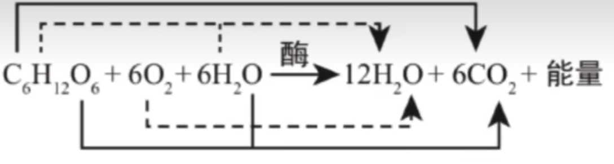{ width=500px }

注意两侧的水不能约掉, 反应条件为酶的催化, 有机方程式需要使用箭头, 能量不能省略. 图中的箭头标识了各元素的去向(值得注意的是水中的氧由且仅由氧气中的氧转化, 其余物质元素均为底物中(除了氧气)的全部此元素转化得到), 通过有氧呼吸具体步骤即可得到, 这在处理同位素标记的题型中会使用(注意 $^{18}O, ^{15}N$ 是稳定同位素, 无放射性, 以及时间足够长的情况下, 可能重复利用导致同位素标记的扩散, 如 $^{18}O_2 \to H_2^{18}O \xrightarrow{长时间} C^{18}O_2$).

系数之比($1 C_6 : 6O_2 : 6CO_2$, 气体系数大且二者相等)可能需要记忆, 计算题会使用.

不一定只有真核生物可以有氧呼吸, 部分原核生物(即便无线粒体)也可有氧呼吸(有对应的酶), 第二阶段发生在细胞质基质, 第三阶段在细胞膜内侧, 自身相当于一个特殊的线粒体, 内共生学说也可体现这一点(线粒体来源自真核细胞吞噬可有氧呼吸的原核细胞共生).

### 无氧呼吸

酵母菌, 乳酸菌, 马铃薯块茎, 水稻的根, 苹果的果实, 动物的肌细胞等均可以无氧呼吸.

无氧呼吸指细胞在无氧条件下, 通过多种酶的催化作用, 把葡萄糖等有机物不彻底氧化分解, 产生酒精与二氧化碳, 或乳酸, 并释放少量能量, 产生少量 $ATP$ 的过程.

无氧呼吸分为两个阶段, 均发生在细胞质基质.

#### 第一阶段

第一阶段与有氧呼吸一致, 详见有氧呼吸第一阶段.

#### 第二阶段

在细胞质基质中, 一分子葡萄糖所产生的两分子丙酮酸与四分子的还原氢在无氧环境下通过两个渠道之一转化为其他有机物:

$$
4[H] + 2C_3H_4O_3 \xrightarrow[\quad]{酶} 2C_3H_6O_3(乳酸)\\
4[H] + 2C_3H_4O_3 \xrightarrow[\quad]{酶} 2C_2H_5OH(酒精) + 2CO_2
$$

注意只有酒精发酵产生二氧化碳气体, 乳酸发酵不产生气体.

一般一种生物只通过其中一种转化途径. 乳酸发酵主要存在于动物的肌细胞, 乳酸菌, 马铃薯块茎, 甜菜块根, 玉米胚细胞等中; 酒精发酵主要存在于酵母菌, 与大部分植物(如植物泡水烂根的原因之一是无氧呼吸酒精积累毒害)中.

可以发现只有第一阶段释放少量能量, 第二阶段不释放能量, 能量储存于有机物(乳酸, 酒精)中.

无氧呼吸大部分能量储存在有机物(乳酸, 酒精)中未释放利用, 释放出的能量中多数作为热能散失, 少部分储存在 $ATP$ 中供生物利用. 故能量去向: 有机物(化学能) $>$ 热能 $>$ $ATP$ .

总反应式:

$$
C_6H_{12}O_6 \xrightarrow[\quad]{酶} 2C_3H_6O_3(乳酸) + 少量能量\\
C_6H_{12}O_6 \xrightarrow[\quad]{酶} 2C_2H_5OH(酒精) + 2CO_2 + 少量能量
$$

无氧呼吸不产生水.

系数之比($1C_6 : 2CO_2$, 气体系数大)可能需要记忆, 计算题可能会使用. 如若氧气消耗量 $=$ 二氧化碳生成量, 那么可能只进行有氧呼吸(可能还有乳酸发酵); 氧气消耗 $<$ 二氧化碳生成则同时进行有氧和无氧(酒精发酵); 氧气消耗 $>$ 二氧化碳生成则可能涉及脂肪的氧化分解; 不吸收氧气也不释放二氧化碳不意味着细胞死亡, 也可能是乳酸发酵; 仅二氧化碳生成, 无氧气消耗为酒精发酵.

可以通过总方程式发现不论是有氧还是无氧呼吸还原氢并没有积累.

根据不同生物对氧气的需求可以将生物分为

1. 好氧性(大多数生物, 可进行无氧呼吸, 但不能长期离开氧气)
2. 厌氧型(乳酸菌, 破伤风杆菌等, 不会进行有氧呼吸)
3. 兼性厌氧菌(酵母菌, 大肠杆菌(消化道内为无氧环境)等, 既可以有氧, 也可以无氧)

检测二氧化碳的有无可以使用澄清石灰水(通入变浑浊), 或使用溴麝香草酚蓝溶液(随着通入由蓝变绿再变黄).

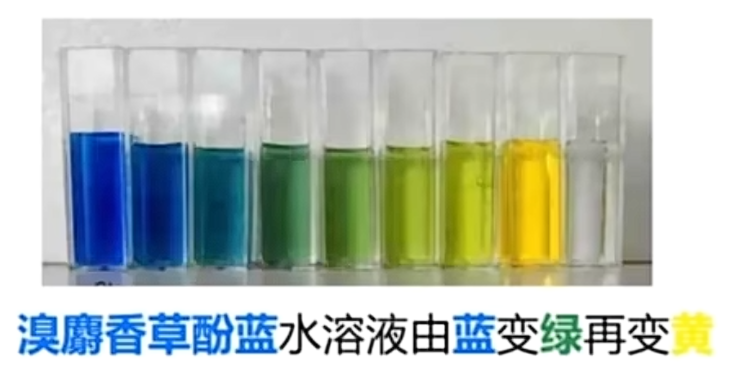{ width=500px }

检测酒精可以使用酸性重铬酸钾溶液, 重铬酸钾在酸性条件下与酒精反应由橙色变为灰绿色.

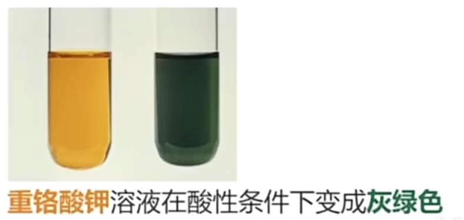{ width=500px }

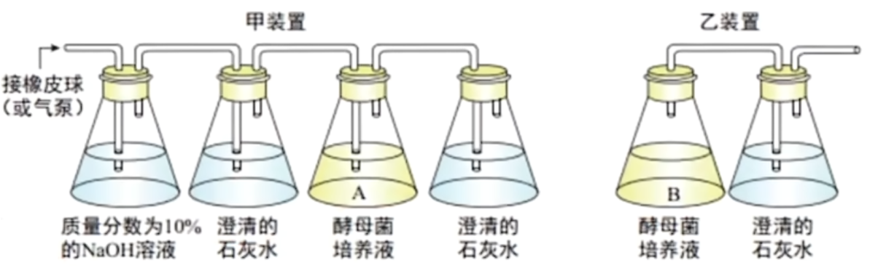{ width=500px }

可以使用如图装置检测酵母菌的呼吸方式. 注意向酵母菌培养液中通入空气时要使用氢氧化钠除去二氧化碳, 以免干扰检测(甲装置第一个澄清石灰水用于检测是否除尽 $CO_2$ ). 当然, 乙装置需要无氧环境, 需要先封口放置一段时间消耗瓶中氧气再接入澄清石灰水.

注意由于葡萄糖(还原糖)也会使酸性重铬酸钾褪色, 故应当放置一段时间确保葡萄糖消耗完全后再取样进行酒精检测.

探究绿色植物时需要放置于黑暗条件下以免光合作用干扰.

### 影响细胞呼吸的因素

内因: 遗传因素, 决定酶的种类与数量. 如呼吸速率旱生植物小于水生植物, 阴生植物小于阳生植物(不同植物); 幼苗期, 开花期高于成熟期(同一植物不同时期); 生殖器官大于营养器官(同一植物不同器官)等.

外因: 有反应总方程式可得, 温度(酶活性), 氧气浓度, 二氧化碳浓度, 水分等会影响呼吸速率. 应用分别有: 低温储存果蔬(适度, 零下会冻伤), 大棚种植夜间与阴天降温减少有机物消耗; 透气的纱布包扎伤口避免厌氧菌(如破伤风杆菌, 伤口较深时无氧呼吸易繁殖, 需注射血清), 酿酒时早起通气扩大培养, 后期密闭产生酒精, 土壤松土, 稻田排水提高土壤含氧量, 促进有氧呼吸进而促进主动运输吸收矿质元素, 无土栽培向培养液通气防止无氧呼吸烂根, 低氧保存果蔬减少有机物消耗, 有氧运动而非无氧运动减少乳酸产生使肌肉酸痛; 增加二氧化碳浓度抑制呼吸作用, 减少有机物消耗, 延长果蔬保鲜时间; 储存种子要先晒干除去部分自由水, 保持干燥减弱呼吸, 但水分较多的果蔬需要湿度适宜以保鲜.

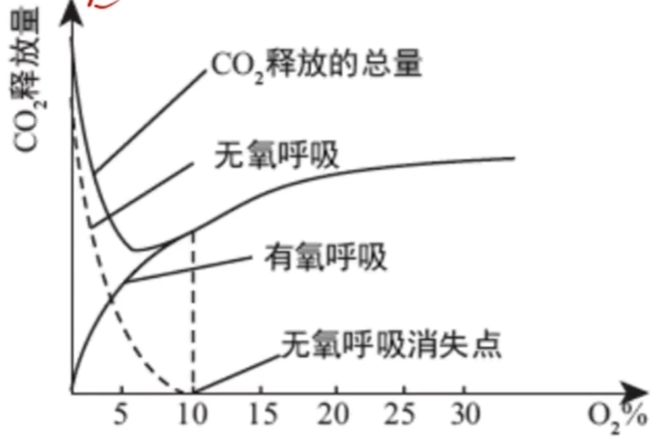{ width=500px }

图中 $CO_2$ 释放最少的点($5\%$ 左右)就是最适宜蔬果保存的氧气浓度(因为 $CO_2$ 中的 $C$ 对应这有机物的消耗).

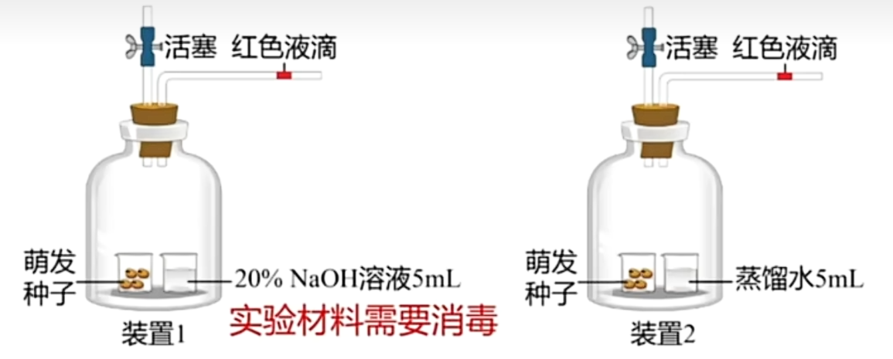{ width=500px }

($U$ 形管装置同理)

实验材料需消毒避免杂菌干扰. 种子进行酒精发酵.

$NaOH$ 用于吸收 $CO_2$ , 故影响装置 $1$ 液滴移动的气体为瓶中空气($O_2$)的减少量; 蒸馏水形成对照, 防止蒸发的水蒸气干扰, 装置 $2$ 影响液滴移动的为氧气的吸收与二氧化碳释放的差值. 注意若瓶中气体不移动不一定只进行有氧呼吸, 也可能是种子死亡.

实际上实验还需要两组空白对照(将装置中的种子改为等量灭活(煮熟的)种子), 以排除温度与气压等理化因素的干扰.
