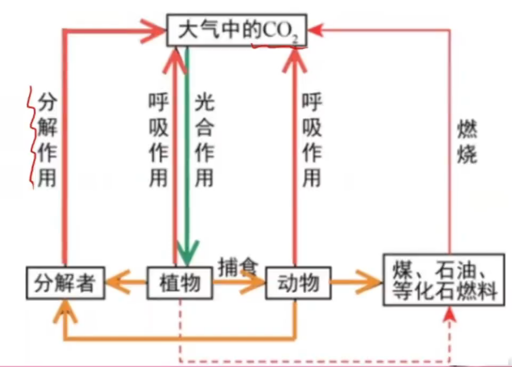
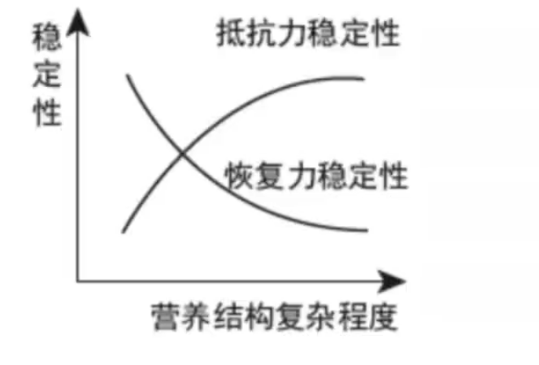
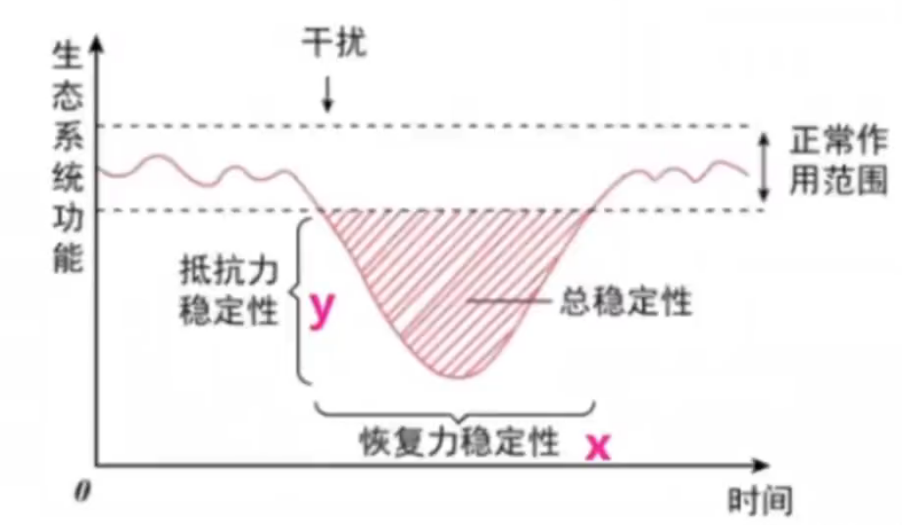

# 生态系统

---

[【10 分钟搞定生态系统能量流动【选必二知识】| 0 基础救星】](https://www.bilibili.com/video/BV1NG4y1g75M?vd_source=52aa8bd45c28e534d02e312968f55355)

[【生态系统物质循环 信息传递 及稳定性【选必二知识】| 0 基础救星】](https://www.bilibili.com/video/BV1rY41127Na?vd_source=52aa8bd45c28e534d02e312968f55355)

---

## 生态系统的能量流动

### 能量

定义: 生态系统中能量的 **输入, 传递, 转化, 散失** 的过程成为生态系统的能量流动.同化: 是指生物体将外界的物质（主要是从食物中获取的营养物质）转化并合成为自身生物质（即自身体内组织）的过程.过程:

1. 能量输入
   - 来源: 太阳能(也可以是人工/化能合成)
   - 起点: 绿色植物将太阳能通过光合作用转化为化学能储存在在有机物中
   - 总量: 生产者所固定的太阳能总量
2. 能量传递
   - 途径: 食物链, 食物网
   - 形式: 有机物中的化学能
   - 举例: 林德曼在赛达伯格湖定量分析能量流动
   - 能量去向(简单列举, 详细的在下面):
     1. 呼吸消耗(热能)
     2. 体内储存的能量/流入下一营养级(被下一营养级同化, 最高营养级不会)
     3. 分解者
     4. 暂时未利用
   - 需要不断向系统内补充能量(物质不用)
   - 能量流动特点:
     1. 单向流动
     2. 逐级递减
3. 能量来源去路(一来三去)
   - 来源:
     1. 捕食同化(生产者是太阳光, 仅吸收$1\%$可见光)
     2. 人工给予(可选)
   - 去路(注意两个空的时候写呼吸和生长发育繁殖, 多个空写呼吸和下一营养级/分解者/未利用):
     1. 呼吸消耗散失(热能)
     2. 生长, 发育, 繁殖 $\to$ 下一营养级(最高级消费者没有)/分解者利用/未利用
   - 性质(粪便量计算包括在在上一营养级给分解者的能量中, 可以理解为无法被利用的上一营养级的能量):
     $$
     摄入量 = 同化量(吸收量) + 粪便量
     $$
4. 传递效率
   1. 范围: 大约是$10\%$ ~ $20\%$, 故一般不超过$5$个营养级.
   2. 公式:
      $$
      能量传递效率 = \frac{下一营养级同化量}{上一营养级同化量} \times 100\%
      $$
   3. 缩短食物链不可以提高传递效率, 只可以提高能量利用率(呼吸消耗损失的少了)

### 通过能量判断营养级/食物网

原理:

1. 能量单向流动逐级递减
2. 数值相似的属于同一营养级, 相差$5$ ~ $10$倍左右的属于相邻的两个营养级(能量传递效率)

### 能量流动最值计算

最少消耗(获得最多):

$$
最短食物链\&最大传递效率(20\%)
$$

最多消耗(获得最少):

$$
最长食物链\&最小传递效率(10\%)
$$

切入点(比例是指有多少比例延给定的食物链流动):

$$
在每条食物链分叉点处标清流动能量所占比例, 比例是谁(给定比例的生物)谁入手
$$

注意(看从低级向高级推还是从高级向低级倒推):

$$
正推乘传递效率, 逆推除以传递效率
$$

### 生态金字塔

1. 能量金字塔
   - 将单位时间内各个营养级所得到的能量由低到高绘制成图成为能量金字塔, 能量金字塔 **自然情况下** 不会倒置, 营养级别越低, 占有的能量越多. (人工生态系统可能倒置) 一般符合$生产者 > 分解者 > 消费者$.
2. 生物量金字塔
   - 每个营养级的生物量(干重)绘制成金字塔, 在陆地生态系统中 **一般** 不会倒置. (倒置举例: 浮游植物被动物捕食, 浮游植物个体质量小, 寿命短, 一段时间内生物量较小)
3. 生物数量金字塔
   - 以每一个营养级个体数量绘制成金字塔, 可能 **会倒置** . (一般来说捕食者数量大于被捕食者, 但是有些生物如昆虫捕食树, 昆虫数量多而树数量少)

---

## 生态系统的物质循环

概念: 组成生物体的 C, H, O, N, P, S 等 **元素** , 都不断地进行着从 **非生物环境** 到 **生物群落** , 又从生物群落到非生物环境的过程.特点:

1. 全球性, 因此又叫生物地球化学循环
2. 循环性, 物质可以被生物群落反复利用

碳循环:如何实现碳中和(读图):

1. 减少$CO_2$排放(具体为减少化石燃料燃烧, 开发新能源)
2. 增加$CO_2$固定(具体为植树造林)

有关题目突破点: 先找双向箭头, 万箭穿心者为大气中的$CO_2$, 光芒万丈者为生产者. (可以判断出一个然后双向箭头连接的就是另一个) 剩下的里面被指地比较多的是分解者, 其余的为消费者(可以有多个).

长期放牧导致草场退化原因: 动物本应返回给草场的能量被人类利用.

能量流动/物质循环联系

| 项目 |      能量流动      |          物质循环          |
| :--: | :----------------: | :------------------------: |
| 形式 |   以有机物为载体   | 以无机物和有机物的形式流动 |
| 范围 |  生态系统各营养级  |       生物圈(全球性)       |
| 特点 | 单向流动, 逐级递减 |     反复利用, 循环流动     |

联系:

1. 能量流动和物质循环是生态系统的主要功能 (还有信息传递), 二者同时进行. 彼此相互依存, 不可分割.
2. 能量的固定, 储存, 转移和释放都离不开物质合成和分解的过程. **物质是能量的载体,** **能量是物质在生态系统里往复循环的动力.**
3. 生态系统的各个组成成分, 通过能量流动和物质循环, 紧密的联系在一起, 形成一个统一的整体.

生物富集: 生物体从周围环境吸收、积蓄某种元素(如$Pb, Hg$等)或难以降解的化合物(如$DDT, 666$等)，使其在机体内浓度超过环境浓度的现象.

---

## 生态系统的信息传递

1. 信息的种类:

|                   实例                   |   种类   |                   传递形式                   |
| :--------------------------------------: | :------: | :------------------------------------------: |
|           光, 声, 温度, 磁力等           | 物理信息 |            通过物理形式传递的信息            |
| 植物的生物碱, 有机酸等, 动物的性外激素等 | 化学信息 | 生物在生命活动中产生的可以传递信息的化学物质 |
|         蜜蜂跳舞, 孔雀开屏等动作         | 行为信息 |                动物的特殊行为                |

2. 信息传递在生态系统中的作用
   - 利于 个体生命活动的正常进行
   - 利于种群繁衍
   - 调节种间关系, 维持生态系统稳定
3. 信息流动具有双向性
   - 生物与生物
   - 生物与环境 (环境可以给生物传递物理, 化学信息, 但行为信息不可; 生物可以改变环境)

---

## 生态系统的稳定性

1. 生态平衡
   - 结构平衡: 生态系统各组分稳定
   - 功能平衡: 物质循环, 能量流动正常进行
   - 收支平衡: 生产者固定与所有生物消耗相对稳定
2. 稳定性
   - 抵抗力稳定性: 保持原状的能力(越复杂越稳定)
   - 恢复力稳定性: 破坏后恢复原状的能量(越简单越易恢复)

图一: 两种稳定性都很低的生态系统:

$$
荒漠, 苔原
$$

图二: $y$越大, 抵抗力越差(受影响大); $x$越大, 恢复力越差(恢复时间长)

3. 反馈调节
   - 负反馈调节: 生态系统 **稳定性** 的原因(如 狼-兔-草食物链; (自然产生)森林火灾)
   - 正反馈调节: 超过调节能力, 导致 **严重破坏** (如 严重砍伐; 极度放牧; 废水大量排放)

如何提高生态系统稳定性:

- 控制对生态系统的干扰, 不超过生态系统自我调节能力, 合理利用生态系统
- 利用强度大的给予相应物质能量投入, 保证生态系统内部结构与功能协调

---
