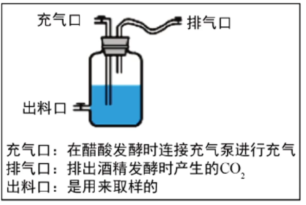
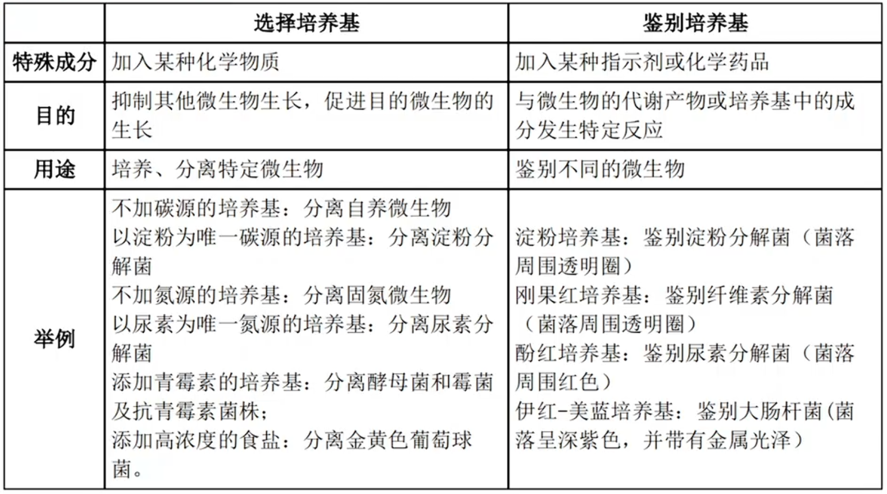
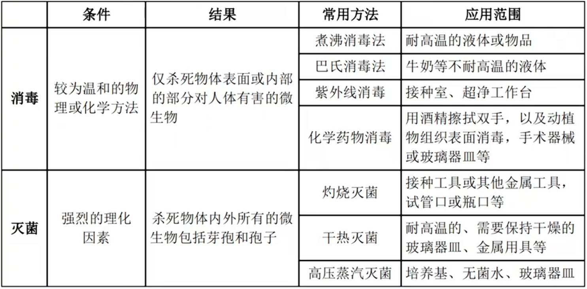
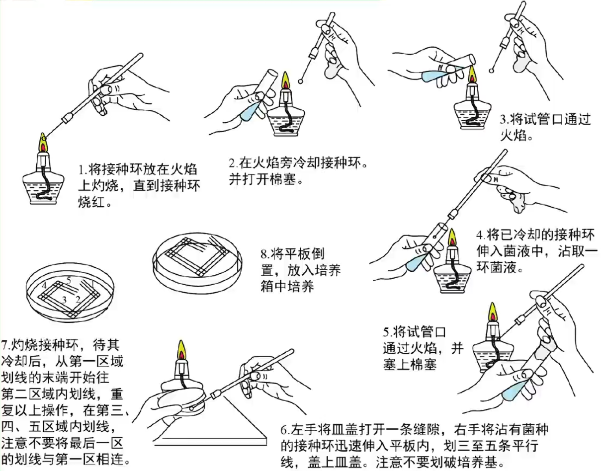
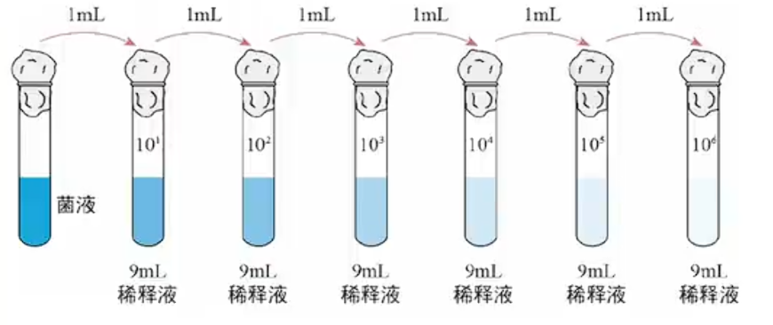
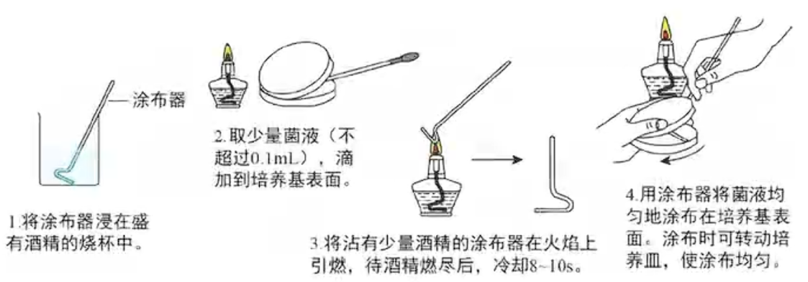

# 发酵工程

## 传统发酵技术

直接利用天然存在的微生物或前一次保存下来的菌种进行发酵为传统发酵技术. 与发酵工程不同地, 传统发酵技术的菌种不单一, 而发酵工程所用菌种为单一菌种. 

### 果酒

使用果皮上附着的野生酵母菌(异养, 兼性厌氧菌, 单细胞真菌, 出芽生殖). 一般为 $18^\circ C \sim 30^\circ C$ 进行发酵, 酵母菌最适温度为 $28^\circ C$ (温度主要影响酶活性). 发酵时 $pH$ 约为 $5.0 \sim 6.0$ . 

以葡萄为例, 酿酒时需先用温水清洗实验器皿并用 $70\%$ 的酒精进行消毒处理. 而后挑选新鲜无霉斑的葡萄并冲洗, 注意不要反复冲洗洗去表皮上的酵母菌; 清洗时不要去除枝梗以免杂菌侵入. 

以上是果醋果酒发酵罐. 酵母菌首先需要有氧环境大量繁殖, 当密封瓶中氧气耗尽后进行酒精发酵(故瓶中需留有 $\frac{1}{3}$ 空气并不时放气排除 $CO_2$ 以防发酵液溢出; 如果使用塑料瓶可以拧松瓶盖, 但不能拿下以防杂菌污染). 随着酒精的积累, 杂菌增殖被抑制. 

检测酒精可以使用酸性重铬酸钾溶液, 出现灰绿色即有酒精生成. 

### 果醋

酿玩果酒后可以继续在同一发酵罐内酿造果醋(当然也可使用葡萄糖直接酿醋), 使用醋酸菌(异养需氧型细菌). 醋酸酿造时温度较果酒高, 为 $30^\circ C \sim 35^\circ C$ . 醋酸菌有两种途径生成乙酸: 
1. 当氧气, 糖源均充足时, $C_6H_{12}O_6 \xrightarrow{酶} CH_3COOH$
2. 当氧气充足, 缺少糖源时, $C_2H_5OH \xrightarrow{酶} CH_3CHO \xrightarrow{酶} CH_3COOH$

不论是何种途径酿造时都需要不断通气. 由于醋酸堆积杂菌生长也会被抑制. 

### 腐乳

主要为毛霉(真菌, 孢子生殖, 具有白色菌丝, 异养需氧型)发挥作用. 毛霉可以将豆腐中的蛋白质通过蛋白酶分解为肽和氨基酸, 将脂肪通过脂肪酶水解为甘油和脂肪酸. 

制作腐乳首先需要切块豆腐, 保留 $70\%$ 的含水量以确保腐乳成形, 在 $15 \sim 18^\circ C$ 下培养. 在毛霉长出后培养时需要逐层加盐, 同时越接近瓶口盐越厚, 以防杂菌污染(毛霉已经长完)同时增加风味, 也可析出豆腐中水分, 使豆腐变硬以防止过早酥烂并浸提毛霉菌丝上的蛋白酶. 

之后准备卤汤, 准备卤汤时也可在卤汤中根据口味加入酒精以增加风味(与有机酸形成酯)并抑制杂菌, 一般含量 $12\%$ 左右, 过高会抑制蛋白酶活性, 过低会使其他微生物生长腐败. 香辛料同理. 加入卤汤(瓶口过火焰杀菌)后密封腌制数月即可. 腌制过程中有机物会逐渐减少, 但物质种类会随着发酵上升. 

### 泡菜

乳酸菌(原核细菌, 异养厌氧型)不仅可用于酸奶, 也可用于泡菜. 酿造原理为乳酸发酵, 使用空气中或上一次用于发酵的菌种发酵. 

首先需要配置食盐水, 煮沸(消毒并出去水中溶解氧)冷却, 加入材料置入泡菜坛, 注意需要使食盐水没过材料. 需要坛沿注水隔绝空气. 一般在 $20^\circ C$ (或室温)下发酵, 无氧环境与乳酸会抑制其他杂菌生长. 

泡菜发酵时会产生亚硝酸盐, 由硝酸盐还原菌促进硝酸盐还原形成, 可能转变为致癌物亚硝胺. 亚硝酸盐含量的测定方法为标准比色法, 反应形成的玫瑰红色产物与已知浓度的标准显色液或比色卡进行比较可以估算出亚硝酸盐的大致含量. 亚硝酸盐含量应该会随时间先上升后下降, 故需要腌制久一点. 

## 培养基与无菌技术

微生物: 包括细菌, 真菌, 病毒, 以及一些原生生物. 故动物加植物加微生物就包括所有生物. 培养基可为微生物生长繁殖的营养基质, 用于培养, 分离, 鉴定, 保存微生物或积累其代谢产物. 一般地, 培养基需要水, 碳源, 氮源和无机盐. 特殊地不同培养基还有可能的 $pH$ , 特殊营养物质与气体需求(如乳酸菌需要酸性环境, 需要添加维生素与无氧环境). 

### 培养基

碳源可以为无机碳源如 $CO_2$ , 碳酸盐等, 也可为有机化合物如葡萄糖, 尿素(也可为氮源), 牛肉膏, 蛋白胨等. 氮源同理, 可为氮气(固氮微生物, 利用空气中氮源), 氨气(硝化细菌), 铵盐, 硝酸盐, 亚硝酸盐等无机物, 也可为蛋白质及其各类降解产物, 嘌呤, 嘧啶等有机物. 

可以发现, 可使用无机碳源的生物为自养型生物, 只能使用有机碳源的生物为异养型生物. 

培养霉菌时一般为酸性环境, 细菌时一般为中性或微碱性环境. 

培养基可以根据物理性质, 化学成分或用途分类. 

根据物理性质, 培养基可以分为液体培养基(工业生产, 扩大培养), 固体培养基(微生物分离鉴定, 活菌计数, 保存菌种, 一般加入琼脂作为凝固剂), 以及介于二者之间的半固体培养基(观察微生物运动, 菌种鉴定). 

根据化学成分, 可以分为天然培养基与合成培养基. 根据用途, 可以分为选择培养基和鉴别培养基. 

伊红-美蓝培养基现作伊红-亚甲蓝培养基. 

鉴定尿素分解菌可以使用酚红进行, 注意不是酚酞, 酚红更灵敏. 尿素分解菌通过脲酶分解尿素产生氨, 呈现碱性环境(也有酸性菌种). 可以通过尿素作为唯一氮源进行选择培养. 

透明圈主要看菌落直径与透明圈直径之比来区分菌落分解特定物质的能力. 

获取青霉素时一般使用乳糖而非葡萄糖, 因为葡萄糖不充足时青霉菌会分泌青霉素杀死其他细菌以保证自身所需能量. 

### 无菌技术

注意不能对人体进行灭菌处理; 高压蒸汽灭菌法是湿热灭菌最具代表性的一种. 

操作者一般在超净工作台中操作并在附近点燃酒精灯以提高温度抑制杂菌. 

## 微生物的纯培养及计数

### 纯培养

由单一个体繁殖所获得的微生物群体称为纯培养物, 此过程成为纯培养. 

整个过程可以分为配置培养基, 灭菌, 接种, 分离, 培养几个步骤. 注意培养基配置完成后需灭菌使用, 一般采用高压蒸汽灭菌法. 

接种微生物的方法主要有两种, 均以获得单菌落为目的. 

#### 平板划线法

使用接种环在琼脂固体培养基表面连续划线, 将聚集的菌种逐步稀释到培养基表面. 一般划线五次, 在最后一次末端可以发现单菌落. 

注意棉塞不要放下, 划线时培养皿盖不要完全掀开, 每一次划线前都需灼烧灭菌(首次需冷却再蘸取菌液, 后续不再蘸取菌液, 使用上一次留在培养基上的菌种进行稀释), 操作完成后要对工具进行灭菌, 整个过程需在酒精灯旁完成. 

此种方法不能进行计数, 只能用于得到单菌落. 

可以发现, 若一共划线五个区域, 共需灼烧接种环 $6$ 次. 

#### 稀释涂布平板法

将菌液进行一系列梯度稀释(可以使用无菌水), 然后涂布到琼脂固体培养基表面进行培养. 

涂布时转动培养皿而非涂布器, 类似烙煎饼一般. 

稀释涂布平板法是均匀接种, 故可以用于计数, 只需知道稀释倍数与培养后的菌落数, 就可大致估算整个菌液的含量. 

#### 培养

接种完成后需要倒置培养(倒平板). 同时还需一个未接种的培养基作为对照以免培养基未灭菌完全. 

倒平板的原因如下: 
1. 防止冷凝水低落杂散菌落
2. 防止冷凝水污染后滴入培养基

临时保藏可以在固体斜面培养基上于 $4^\circ C$ 冰箱保藏; 长期保藏需甘油管藏, 加入甘油后于 $-20^\circ C$ 下长期保存. 

### 计数

#### 活菌间接计数法

使用稀释涂布平板法培养出单菌落后进行计数. 需要至少三个平行重复, 选择菌落数为 $30 \sim 300$ 之间的平板计数(不适宜需修改稀释倍数, 一般细菌为 $10^4 \sim 10^6$ 倍, 放线菌为 $10^3 \sim 10^5$ 倍, 真菌为 $10^2 \sim 10^4$ 倍), 还需空白对照以确认平板未被污染. 

如此计数的结果偏小, 因为**当两个或多个细胞连在一起时, 平板上观察到的只是一个菌落**. 显然死菌不会长成菌落故对比显微镜直接计数法此处无误差. 

#### 显微镜直接计数法

利用特定的细菌计数板(计数较小微生物如细菌)或血细胞计数板(计数较大微生物如酵母菌, 血细胞, 藻类)在显微镜下观察计算微生物数量, 同样为估计值. 此种方法更快速直观, 比起培养单菌落. 

但此时计数结果偏大, 且误差较大, 因为无法区分死菌或活菌(除非进行染色).