# 基因工程

按照人的需求通过转基因技术赋予生物新遗传特性即是基因工程. 基因工程在 $DNA$ 分子水平上进行, 故又称基因拼接技术或 $DNA$ 重组技术.

基因工程的实质是基因重组(整段 $DNA$ 在细胞内或细胞间甚至不同物种间进行交换, 并在新的位置复制, 转录, 翻译). 减 $I$ 前期的交叉互换与减 $I$ 后期的自由组合也是基因重组, 以及 $R$ 型菌转化为 $S$ 型菌等.

基因工程在微生物上成果最多, 因为其具有结构和遗传物质简单, 生长繁殖快, 对环境因素敏感, 容易进行遗传物质操作等优点.

基因拼接的理论基础:

1. $DNA$ 是生物主要遗传物质
2. $DNA$ 基本组成单位都是 $4$ 种脱氧核苷酸
3. 双链 $DNA$ 分子的空间结构都是规则的双螺旋结构

外源基因在受体内表达的理论基础:

1. 基因是控制生物性状的独立遗传单位
2. 遗传信息都遵循中心法则阐述的信息流动方向
3. 生物界共用一套遗传密码

## 工具

### 限制酶

限制酶的全称是限制性内切核酸酶, 主要是原核生物中分离纯化得到. 可以识别双链 $DNA$ 分子的某种特定核苷酸序列(识别序列), 且使每一条链中特定部位的两个核苷酸之间的磷酸二酯键断开, 从而形成平末端(沿中轴线切割)或粘性末端(分别在中轴线两侧切割).

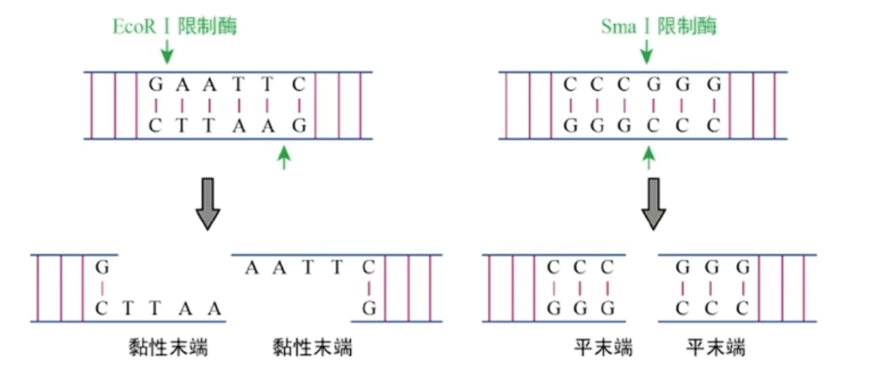{ width=500px }

注意不同的酶识别序列不同, 但可以切割出相同的粘性末端(凸出部分), 它们互为同尾酶. 注意写粘性末端序列时要写短杠, 并且要从 $5'$ 端写到 $3'$ 端, 这也是所有片段的读取方式, 也是所有转录/复制/翻译的进行方向(子链的或 $mRNA$ 模板链的 $5'$ 端).

### $DNA$ 连接酶

将双链 $DNA$ 片段连接起来, 恢复被限制酶切开的两个核苷酸之间的磷酸二酯键. 常见种类有 $E.coli \; DNA$ 连接酶和 $T4 \; DNA$ 连接酶.(二者都可连接平末端或粘性末端, 但前者对平末端的连接效率很低)

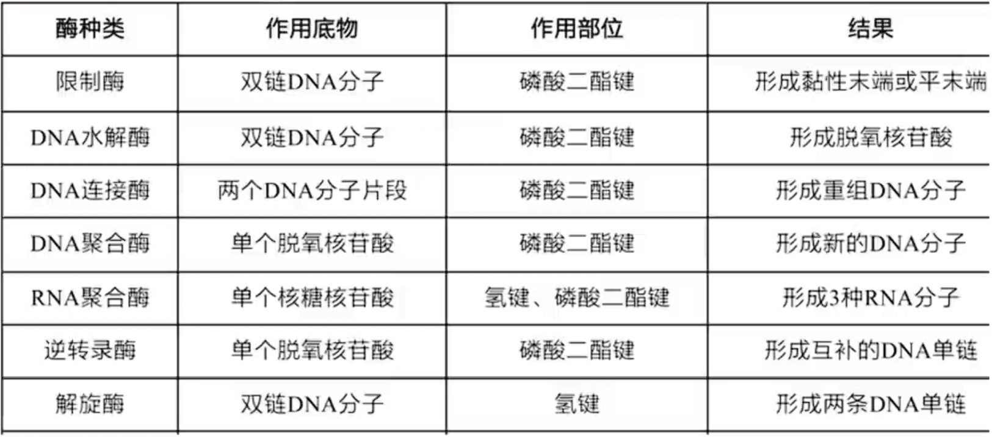{ width=500px }

### 载体

载体(运载体)的作用有:

1. 将外源基因转移到受体细胞中
2. 利用载体在受体细胞内对外源基因进行大量复制

条件:

1. 能在受体细胞中稳定保存并复制
2. 至少一个限制酶切位点, 供外源基因片段插入其中
3. 具有标记基因(一般为抗性基因或荧光蛋白基因或显色反应有关的基因), 便于重组 $DNA$ 的筛选
4. 大小合适, 便于操作
5. 对受体细胞无害

种类: 质粒(有自我复制能力的小型环状双链 $DNA$ 分子, 独立于核或拟核(原核真核都存在), 裸露, 结构简单, 主要作用于细菌), 噬菌体(作用于细菌), 动植物病毒(作用于动植物)等.

其中质粒最常用, 使用时一般需要先人工改造.

## $PCR$

$PCR$ , 即聚合酶链式反应, 又称基因的体外扩增法, 可以在体外快速扩增 $DNA$ 序列或特定基因. 原理为 $DNA$ 的半保留复制. 其过程与细胞内 $DNA$ 复制过程类似, 但有部分区别.

可以分为四步:

1. 目的基因的筛选与获取
2. 基因表达载体的构建
3. 将目的基因导入受体细胞
4. 目的基因的检测与鉴定

### 目的基因的筛选与获取

目的基因用于改变受体细胞性状或获得预期表达产物, 如生物抗逆性, 优良品质, 生产药物, 毒物降解和工业用酶等相关的基因.

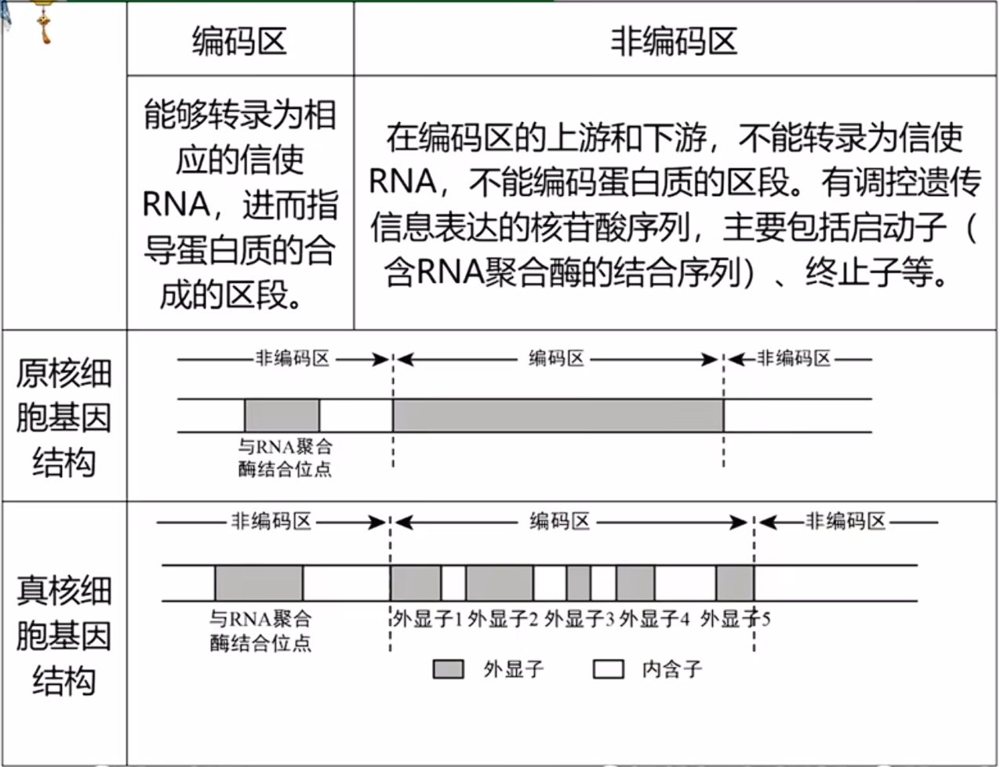{ width=500px }

上图为基因的结构. 其中与 $RNA$ 聚合酶结合位点就是启动子, 终止子图中未体现, 应在下游非编码区中用于停止转录. 注意启动子/终止子用于调控转录, 在基因非编码区上; 起始密码子/终止密码子用于调控翻译, 在 $mRNA$ 上.

真核生物编码区转录之后的前体 $mRNA$ 需要进一步加工(切除启动子, 内含子, 终止子对应部分)才成熟具有生物活性成为 $mRNA$. 但原核生物并没有此步骤, 对于外源基因也无法正确切除内含子, 在转基因时需要考虑.

注意即使启动子, 内含子, 终止子被切除, 但其仍然为基因的一部分, 即属于有遗传效应的片段, 而非无遗传效应, 不属于非基因序列.

可以通过序列数据库(如 $GenBank$)与序列对比工具(如 $BLAST$)等筛选相关已知结构和功能清晰的基因.

筛选后获取目的基因可以通过多种方式, 如下表.

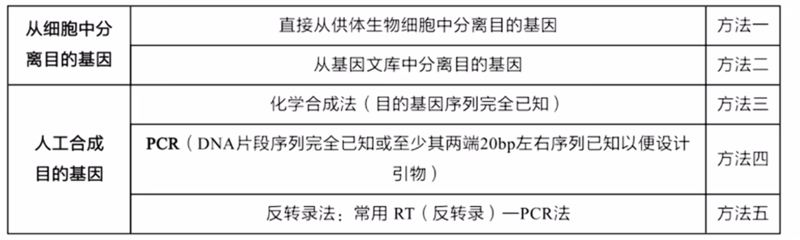{ width=500px }

其中方法一适合结构简单的原核生物, 而方法二适合复杂的真核生物, 方法三适用于片段较短情况. 下面详细介绍.

方法一: 直接从供体细胞(一般是原核生物)中提取目的基因, 最常用"鸟枪法", 又称"散弹射击法". 适用于从简单的基因组中分离目的基因, 如原核基因, 质粒或病毒. 先将限制酶将供体细胞 $DNA$ 切成许多片段, 将这些片段载入载体并转入不同受体细胞, 并在受体细胞内扩增, 通过菌落原位杂交法或基因产物检测法等找出含有目的基因的细胞.

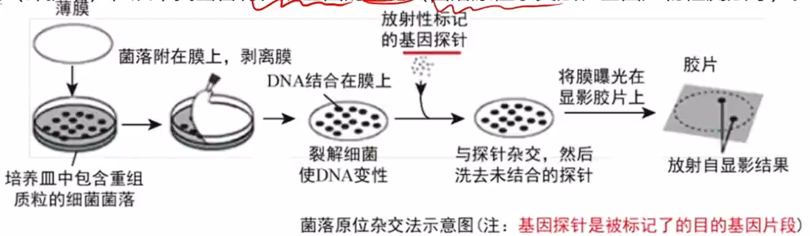{ width=500px }

方法二: 构建基因文库并从中分离目的基因. 基因文库为将含有某种生物(一般是真核生物)不同基因的许多 $DNA$ 片段, 导入到受体菌的群体中储存, 各个受体菌分别含有这种生物的不同的基因. 基因文库可以分为基因组文库与部分基因文库(如 $cDNA$ 文库, 逆转录形成, 需要逆转录酶; 或特定染色体上所有基因组成的文库等). 由图可知, $cDNA$ 文库其实较基因组文库少了启动子终止子(非编码区), 内含子(成熟 $mRNA$ 剪切)的基因, 只包含外显子的编码序列, 所以基因量大大减少. 而且 $cDNA$ 文库只含有生物表达了的基因, 未表达的不含有, 而基因组文库全部都有(例如想获得胰岛素基因, 不可从胰岛 $A$ 细胞 $cDNA$ 文库中获取, 因为其未表达此基因). 因为 $cDNA$ 文库不含内含子, 所以可以实现物种间的基因交流. 综上, 真核生物基因一般从 $cDNA$ 文库中获取比较方便.

基因文库比鸟枪法的特点是, 基因数目多, 且文库可重复利用, 而鸟枪法培养的细胞为一次性.

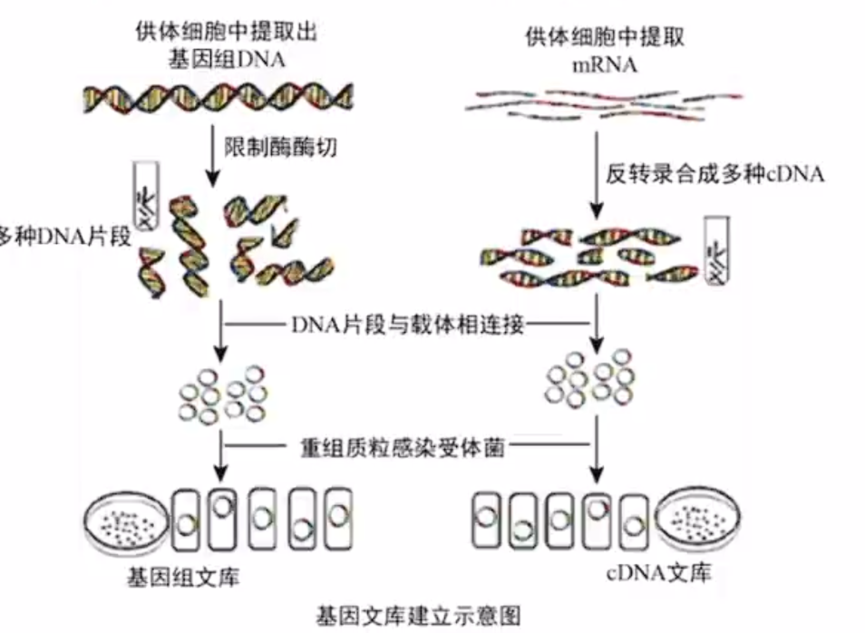{ width=500px }
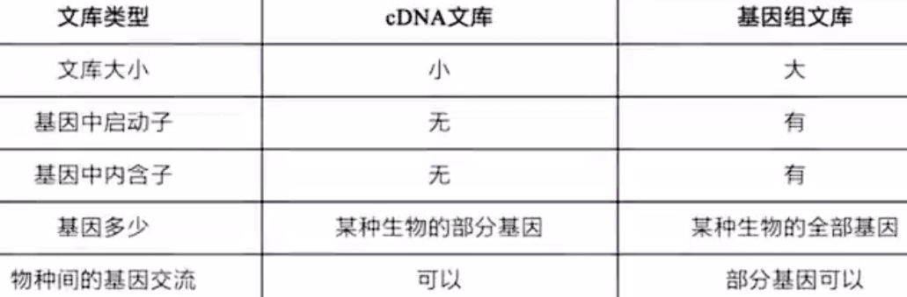{ width=500px }

方法三: 化学合成法, 适用于长度较短, 碱基序列已知的 $DNA$ , 如引物, 基因探针, 人工接头等. 可通过已知的蛋白质氨基酸序列推测 $mRNA$ 的核苷酸序列, 再依此推测目的基因的核苷酸序列, 然后化学合成目的基因.

方法四: $PCR$ . 详见 $PCR$ 部分.

方法五: $RT - PCR$ 法, 即反转录 $- PCR$ 法, 如图.

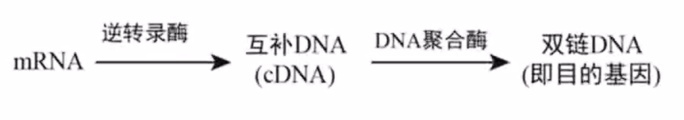{ width=500px }

接下来是扩增获得的基因.

条件:

1. 模板: $DNA$ 母链
2. $4$ 中脱氧核苷酸($dNTP$, 既作为原料又可供能, $d$ 代表着脱氧($NTP$ 基于核糖核苷酸, $dNTP$ 基于脱氧核糖核苷酸))
3. 引物: 此处为 $DNA$ 引物, 结合在母链的 $3'$ 端, 使 $DNA$ 聚合酶能够从引物的 $3'$ 端开始连接脱氧核苷酸. 通常为 $20 \sim 30$ 个脱氧核苷酸( $bp$ , 碱基对)(过短导致特异性不强, 因此只需知道引物部分很短的碱基序列即可进行 $PCR$ , 无需知道完整序列), 且引物自身与之间不应存在互补序列(如 $AACTGCAGTT$, 两侧序列互补)以防折叠或配对. 进行 $PCR$ 时需要两种不同的引物.
4. 耐高温的 $DNA$ 聚合酶($Taq DNA$ 聚合酶), 催化合成子链
5. 缓冲液: 提供合适酸碱度与某些离子(如激活 $Taq$ 酶活性的 $Mg^{2+}$).

注意 $PCR$ 通过高温解旋, 无需解旋酶.

一个循环过程:

1. 变性, 升温至 $90^\circ C$ 以上, 解旋(不是边解旋边复制)
2. 复性, 降温至 $50^\circ C$ 左右, 引物结合
3. 延伸, 升温至 $72^\circ C$ 左右, 子链延伸

一般需要多个循环达到目的. 若进行 $n$ 次循环, 则产生 $2^n$ 条 $DNA$ 分子, 含有母链的 $DNA$ 分子有且仅有 $2$ 条(即只含有一种引物的 $DNA$ 分子). 消耗引物的数量即形成子链的数量, $2^{n+1} - 2$ 个. 含完整目的基因的 $DNA$ 有 $2^n - 2n$ 个.

若想获得目的基因, 需要进行循环的个数有所区别:

- 母链即目的基因: $1$ 次
- 目的基因在两端: $2$ 次
- 目的基因在中段(最常见): $3$ 次

很多时候需要画图. 下面给出一个好题:

[画图法](https://www.bilibili.com/video/BV1YC4y1o7E3/?p=140&share_source=copy_web&vd_source=52aa8bd45c28e534d02e312968f55355&t=786)

### 基因表达载体的构建

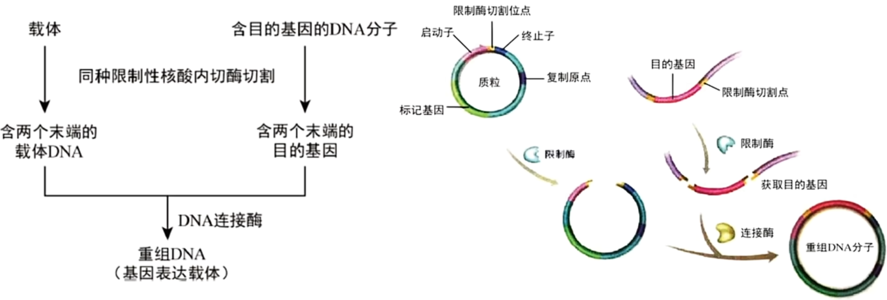{ width=500px }

此图中同种限制酶也可用同尾酶. 一般采用双酶切, 即片段左右两侧采用不同粘性末端的限制酶切割以防二者自连或反接等, 保证目的基因与载体定向连接. 注意切割时不能破坏任何必要的结构(如双标记基因可以切其中一个插入目的基因用于影印法筛选, 即双抗法). 连接时只需有相同粘性末端即可连接, 无需一定为相同酶切割.

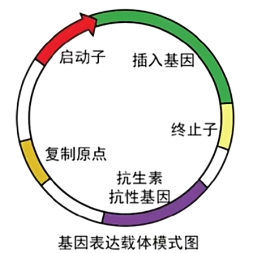{ width=500px }

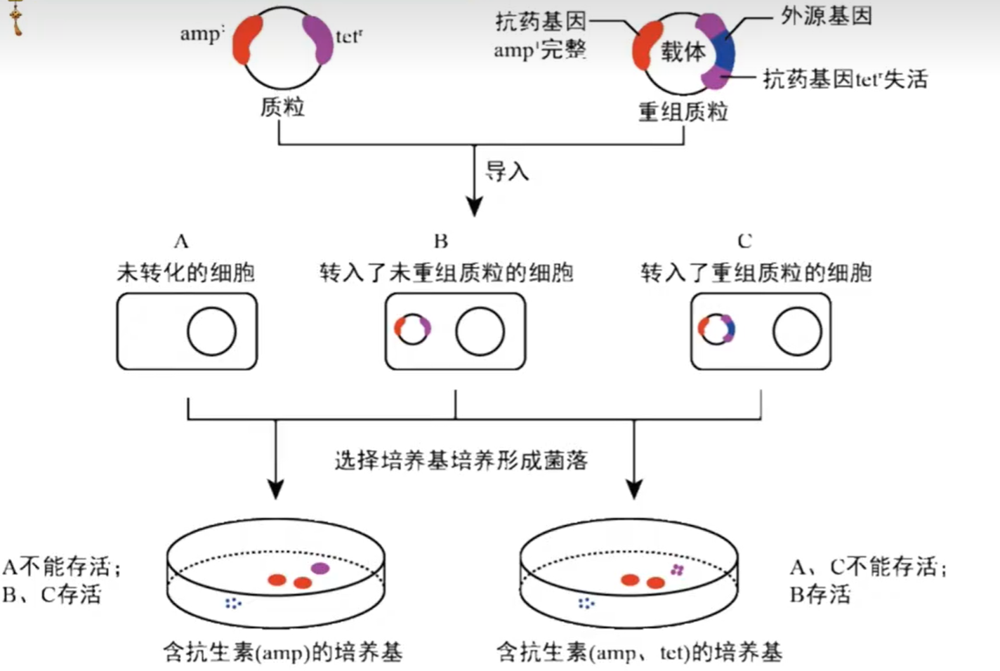{ width=500px }

如图为基因表达载体所必须得部分, 其中启动子为 $RNA$ 聚合酶识别和结合的部位, 驱动基因转录; 终止子为 $RNA$ 聚合酶脱离部位, 终止转录; 标记基因用于鉴别受体细胞中是否含有目的基因. 复制原点( $ori$ )为 $DNA$ 复制起始的位置, 与启动子区别.

启动子应被受体细胞所识别, 如将人的基因导入大肠杆菌, 则需要大肠杆菌启动子而非人的启动子.

$$
启动子\begin{cases}
组成型启动子(强启动子, 管家基因所需): 持续恒定的表达\\
组织特异性启动子(奢侈基因所需): 仅在特定的器官, 组织, 细胞中表达\\
诱导型启动子: 诱导后转录活性开启或大幅增强
\end{cases}
$$

### 将目的基因导入受体细胞

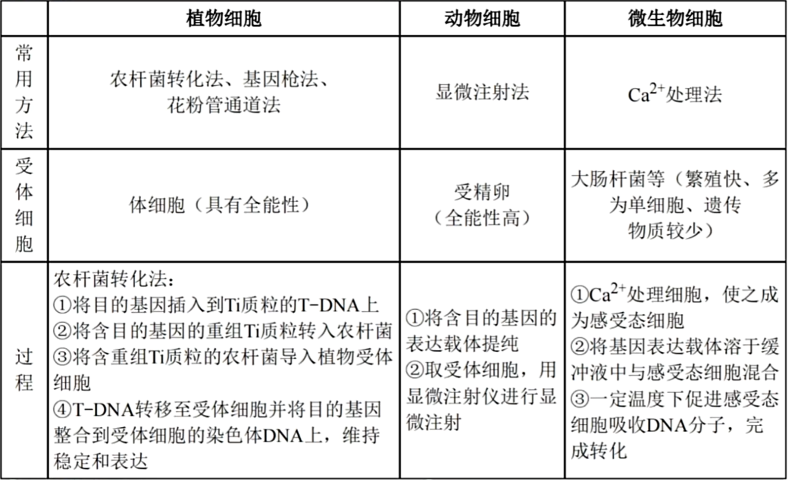{ width=500px }

其中最重要的是农杆菌转化法. 农杆菌转化一般侵染双子叶植物与裸子植物, 几乎不侵染单子叶植物(但技术进步也可以侵染单子叶植物). 农杆菌中有 $Ti$ 质粒, 其上有 $T - DNA$ 分子, 可在侵染植物时将 $T - DNA$ 分子导入植物细胞, 并插入整合到植物染色体的 $DNA$ 中. 若将目的基因插入到 $T - DNA$ 中就可以成功导入植物细胞, 可制备表现新性状的植株.

转化指目的基因进入受体细胞, 并稳定存在且表达的过程.

花粉管通道法为我国自创的方法.

感受态为易于从周围吸收 $DNA$ 分子的状态.

### 目的基因的检测与鉴定

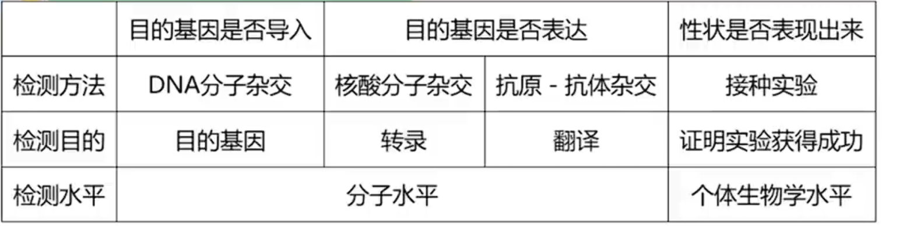{ width=500px }

探针为在含目的基因的单链 $DNA$ 片段(或 $RNA$ 片段)上用放射性同位素或荧光分子(能被检测)标记. $DNA$ 分子杂交技术为将转基因生物的基因组提取出来( $PCR$ ), 使用探针与基因组 $DNA$ 杂交, 若显示出杂交带则表明目的基因成功导入.

同理, 核酸分子杂交技术与前者的区别仅在探针与 $mRNA$ 杂交. 故若细胞具有完整的遗传物质, 即便不表达对应性状也可用探针与基因组 $DNA$ 杂交出现杂交带(选择性表达不影响 $DNA$ 本身存在); 但与 $mRNA$ 杂交需要表达对应性状才会出现杂交带, 因为不表达就不会转录出对应 $mRNA$ .

若用荧光标记抗原(所需的蛋白质)制备带有荧光标记的特异性抗体(相当于前文的探针的作用), 用其与转基因生物中提取出的蛋白质进行特异性结合, 检测杂交带即可实现抗原 $-$ 抗体杂交技术.

特定的接种实验可以写作 $\dots$ 接种实验.

## $DNA$ 的粗提取与鉴定实验

粗提取原理:

1. $DNA$ 不溶与酒精, 但某些蛋白质溶, 可以初步分离
2. $DNA$ 在不同 $NaCl$ 溶液中溶解度不同, 能溶于 $2 mol/L$ 的 $NaCl$ 溶液.

鉴定原理: 用食盐水溶解 $DNA$ 后在一定温度下(水浴加热), $DNA$ 遇二苯胺试剂会呈现蓝色.

一般选择富含 $DNA$ 的材料, 注意不要选择哺乳动物红细胞等不当材料.

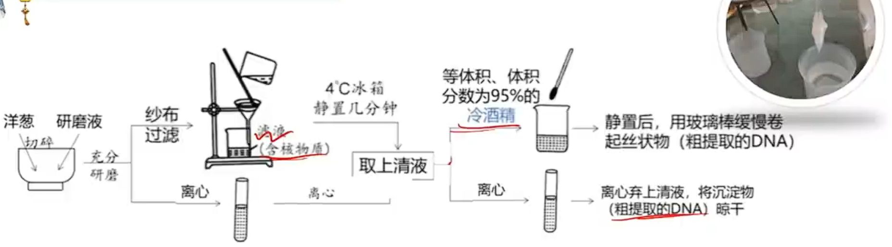{ width=500px }

其中有两条路线, 均可实现粗提取. 研磨液中含洗涤剂(瓦解细胞膜和核膜, 溶解脂质)与 $NaCl$ (溶解 $DNA$ ).

使用冰箱与冷酒精的优点:

1. 抑制核酸水解酶的活性, 防止 $DNA$ 降解
2. 抑制分子运动, 易于 $DNA$ 形成沉淀析出
3. 低温有利于增加丝状 $DNA$ 分子的柔韧性, 减少断裂.

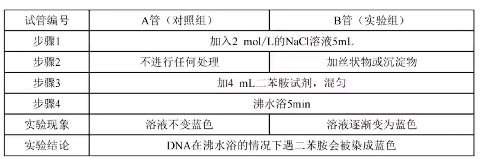{ width=500px }

## 琼脂糖凝胶电泳

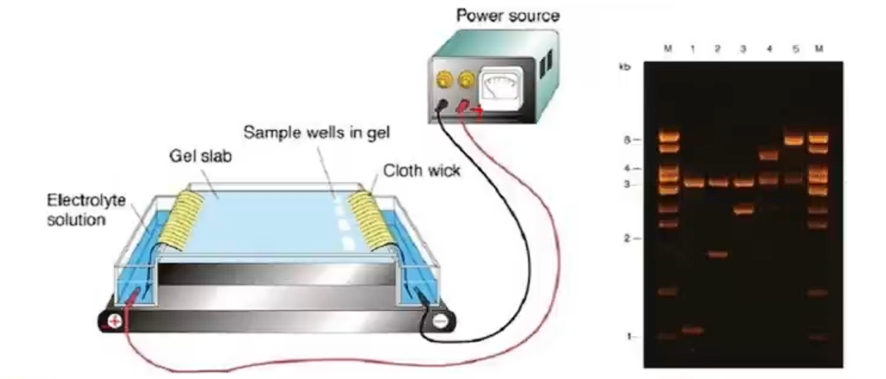{ width=500px }

用于检测基因是否正确扩增.

原理:

1. $DNA$ 分子带电荷, 在外加电场作用下向异性电极移动.(在碱性缓冲液中带负电) $DNA$ 分子质量越小(越短), 迁移速率越快.
2. 凝胶中 $DNA$ 分子可以通过核酸染料(如 $EB +$ 紫外线照射)染色被检测出来.

电泳时需要 $Marker$ ($M$, 标准样), 一个已知质量的 $DNA$ 样品, 作为对照确定待测样品中 $DNA$ 的质量.

材料: 电泳装置(电泳仪, 电泳槽, 制胶槽, 梳子(插点样孔)), 微量移液器(无需对枪体灭菌, 用一次更换新的枪头并灭菌即可), 紫外检测仪, 电泳缓冲液(没过凝胶 $1 mm$), 凝胶载样缓冲液, 琼脂糖, 核酸染料等.

注意过程中需要灭菌操作以免外源 $DNA$ 污染; 缓冲液和酶需要在 $-20^\circ C$ 下保存, 使用前在冰块上缓慢融化.

$DNA$ 荧光条带:

1. 有无条带代表是否成功扩增出待测样品中 $DNA$ . 无条带可能由于无 $DNA$ 模板, 或引物不合适, 条件不合适.
2. 条带亮度与粗细代表扩增 $DNA$ 的数量, 越亮越粗数量越多.
3. 条带位置代表 $DNA$ 的大小, 距离点样孔越远跑得越快质量越小.
