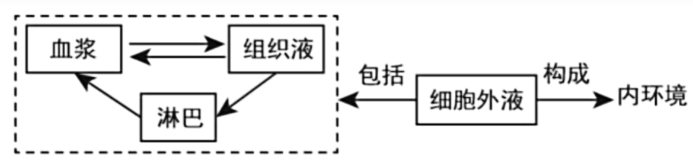
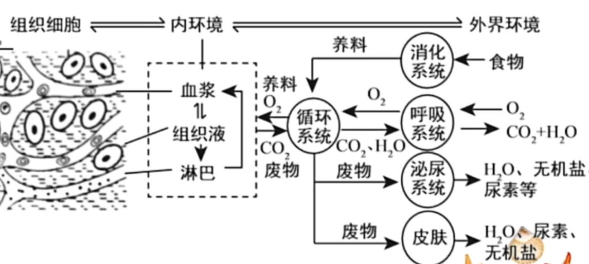

# 稳态与调节

## 内环境
$$
\begin{cases}
体液 \begin{cases}
1. 细胞内液 \quad (约 \frac{2}{3})\\
2. 细胞外液 \quad (约 \frac{1}{3}) \begin{cases}
血浆\\组织液\\淋巴液
\end{cases}
\end{cases}\\
外分泌液
\end{cases}$$
内环境: 
$$多细胞生物体内细胞生活的直接环境, 即细胞外液$$

如图显示了三种细胞外液的流动关系. 如果需要根据示意图判断分别是什么液体, 可以从淋巴液入手, 全部为单箭头.

血浆主要成分: 约 $90\%$ 为水, 其余 $10\%$ 分别是: 蛋白质($7\%-9\%$),无机盐(约 $1\%$ ), 以及血液运输的其他物质, 包括各种营养物质(如葡萄糖), 激素, 各种代谢废物等. 血浆的蛋白质含量普遍要高于组织液和淋巴液.

不属于内环境的成分: 细胞内(如呼吸酶)与细胞膜上(如受体)的成分与体外(如唾液淀粉酶)的成分, 以及其余一些显然不可能存在于体液内的物质.

渗透压: 溶液中的溶质微粒对水的吸引力, 取决于取决于单位体积内溶质微粒的数目(不是质量, 也不是质量浓度, 而是物质的量浓度), 数目越多渗透压越高, 越容易吸水. 血浆渗透压主要受无机盐和蛋白质影响, 其中无机盐因为相对质量较低, 数目较多, 故血浆渗透压主要受无机盐离子($Na^+/Cl^-$ 占 $90\%$ 以上)的影响.

$pH$ 值: 血浆 $pH$ 维持在 $7.35 $ ~ $ 7.45$ 之间, 由缓冲对 $H_2CO_3/HCO_3^-$ 与 $H_2PO_4^-/HPO_4^{2-}$ 维持.

温度: $37^\circ C$ 左右.

内环境作用:
1. 细胞通过内环境与外界进行物质交换.
2. 内环境是细胞生存的直接环境.

稳态: 正常机体通过调节作用, 使各个器官, 系统
协调活动, 共同维持内环境的相对稳定状态叫做稳态.  
正常情况下, 内环境各种化学成分和理化性质保持在
相对稳定状态. 

调节方式: 
$$神经-体液-免疫调节网络$$
机体的调节能力有一定限度.

穿膜层数: 注意单层细胞有时候图片只画一条线, 但要穿过的话是进出两层膜; 线粒体双层膜, 其余涉及到的膜均为单层膜.

组织水肿: 组织间液体(组织液)过多导致肿胀. 原因如下: 
1. 血浆渗透压降低
   - 营养不良, 蛋白质摄入不足, 血浆蛋白减少.
   - 过敏/肾小球肾炎, 毛细血管壁通透性增加/破损, 血浆蛋白进入组织液(组织液渗透压也会升高)/原尿, 血浆蛋白减少.
2. 组织液渗透压升高
   - 淋巴管阻塞, 淋巴循环受阻, 组织液不能渗入淋巴管且组织液中蛋白质增加.
   - 组织细胞代谢旺盛, 代谢产物增多.

各系统间的联系如图. 箭头最多的就是循环系统, 单箭头进入循环系统的是消化系统提供营养, 双箭头是呼吸系统吸入呼出气体, 泌尿系统和皮肤均排除代谢废物, 有时泌尿系统可能会有双箭头代表重吸收作用.  
以上是直接参与物质交换的系统, 但是还有神经系统, 内分泌系统, 免疫系统起调节作用, 分别可以对应神经调节, 体液调节, 免疫调节.