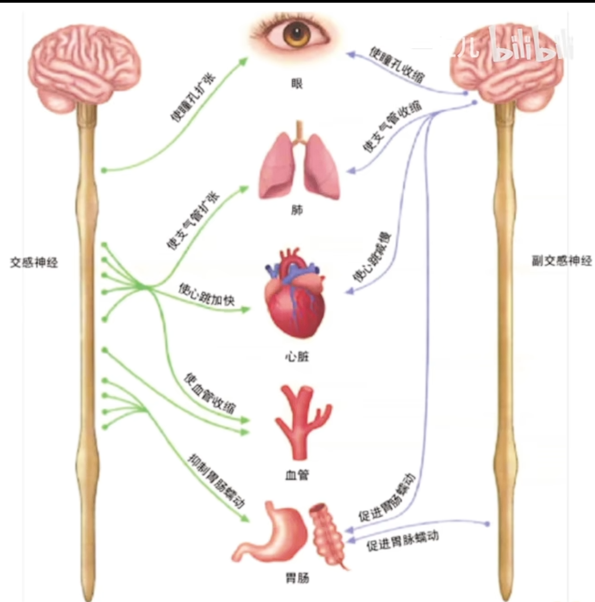
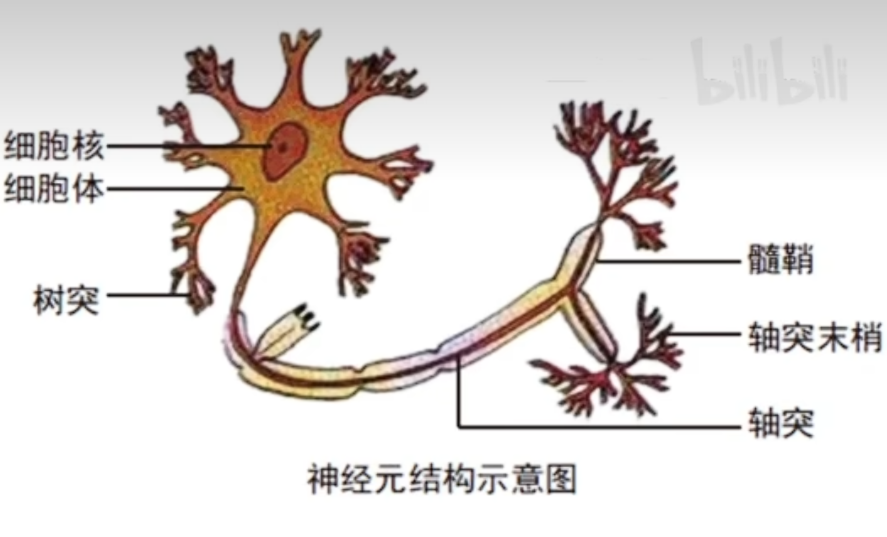
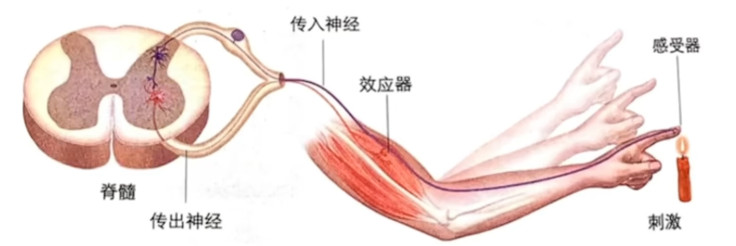
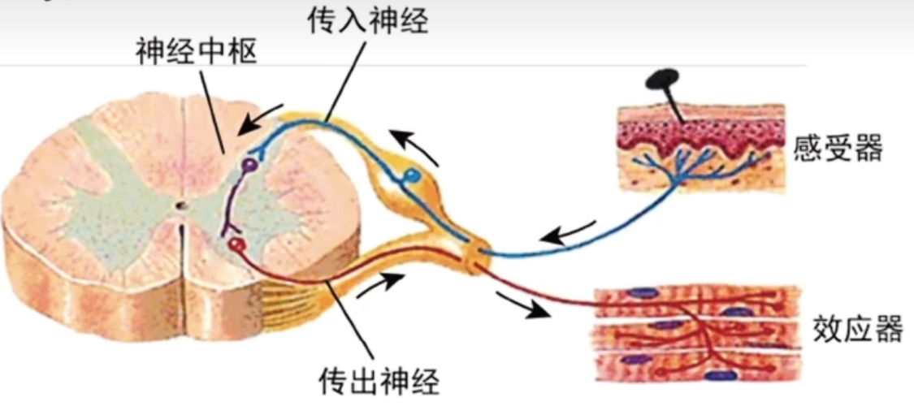
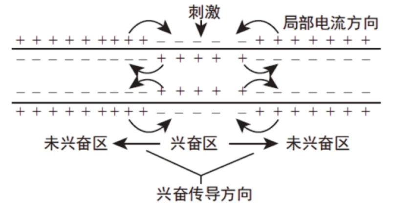
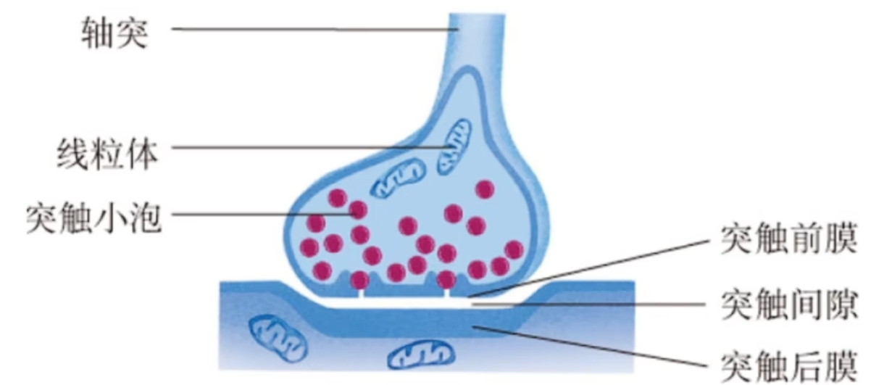
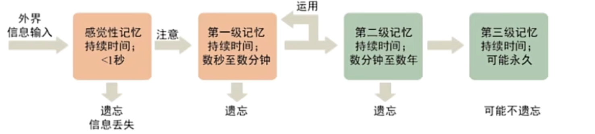
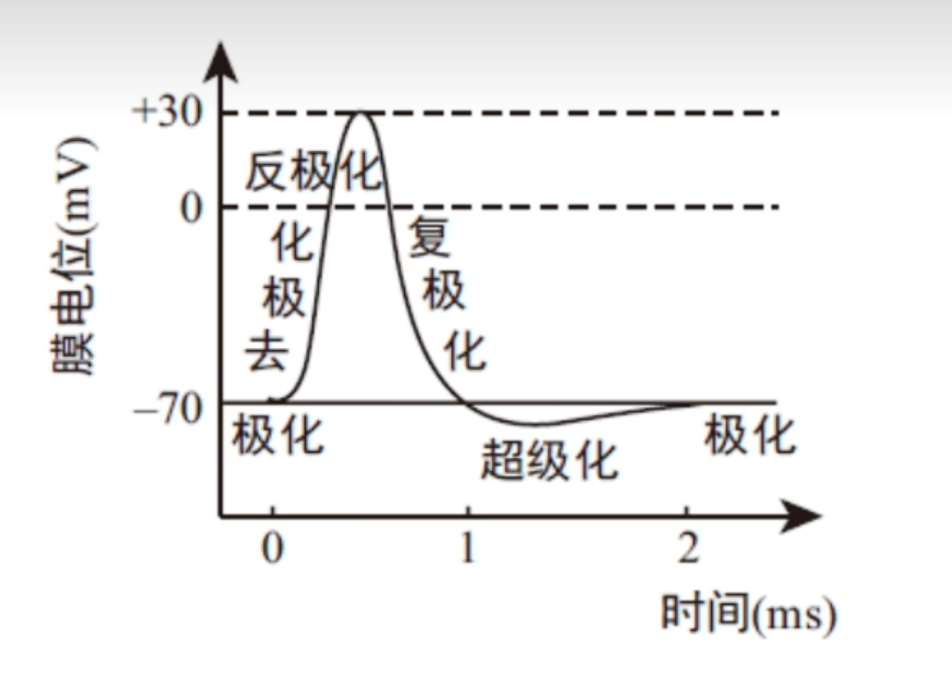

# 神经调节

## 神经系统的基本结构

$$
\begin{cases}
中枢神经系统 
\begin{cases}
脑: 大脑, 小脑, 脑干, 下丘脑\\
脊髓
\end{cases}\\
外周神经系统
\begin{cases}
脑神经 (12对) \\
脊神经 (31对)
\end{cases}
\end{cases}
$$

外周神经系统也可以分成传入神经和传出神经:
$$
外周神经系统
\begin{cases}
传入神经 (感觉神经) \\
传出神经 (运动神经)
\begin{cases}
躯体运动神经 \\
内脏运动神经 \to 自主神经系统 
\begin{cases}
交感神经 \\
副交感神经
\end{cases}
\end{cases}
\end{cases}
$$

### 中枢神经系统

脑:
1. 大脑: 包括左右两个半球, 表面是大脑皮层. 大脑皮层是调节生命活动的最高级中枢.
2. 脑干: 有许多维持生命活动的必要中枢, 调控心跳, 呼吸等重要的生命活动.
3. 小脑: 协调运动, 维持身体平衡.
4. 下丘脑: 其中有体温调节中枢, 水盐调节中枢等, 还与生物节律有关.

脊髓: 低级中枢, 传导和反射.  
中枢神经系统里的每一个器官均可以称作是神经中枢.  

### 外周神经系统

上图是自主神经系统示意图. 交感神经和副交感神经是支配内脏, 血管, 腺体的 __传出神经__ , 他们的活动不受意识支配, 且交感神经和副交感神经的作用一般是相反的. 上图中特别注意血管只由交感神经控制使其收缩; 肠胃是一个被交感神经所抑制, 副交感神经所促进的器官, 与其他器官恰好相反.  

## 组成神经系统的细胞

有神经元和神经胶质细胞两类.  
1. 神经元: 结构与功能的基本单位. 由细胞体, 树突, 轴突等构成. 树突较轴突短而粗, 用于接受信息并传至胞体, 轴突长而较细, 将信息从胞体传向其他神经元, 肌肉或腺体. 轴突呈纤维状, 外表有一层髓鞘, 构成神经纤维; 许多神经纤维集结成束, 外面包有一层包膜, 构成一条神经. 其功能是: 接受刺激, 产生并传导兴奋.
2. 起辅助神经元的作用, 具有 __支持, 保护, 营养, 修复__ 神经元的功能. 并且还参与构成神经纤维表面的髓鞘.

## 反射

定义: 在中枢神经系统的参与下(意味着必须要有神经系统, 植物就不可以, 但植物有应激性), 机体对外界刺激所产生的规律性反应(需要有刺激有反应).  
反应分为非条件反射和条件反射. 非条件反射与生俱来, 由小脑, 脑干, 脊髓等低级中枢参与; 条件反射是后天学习形成的, 由高级中枢大脑皮层参与. 故有大脑皮层参与的反射一定是条件反射. 

反射是神经调节的基本方式, 反射弧是完成反射的结构基础. 反射弧包括: 
1. 感受器: 即传入神经末梢, 感受刺激并产生兴奋.
2. 传入神经
3. 神经中枢
4. 传出神经
5. 效应器: 由传出神经末梢及其支配的肌肉或腺体组成, 对刺激做出应答反应.

判断神经元数量: 看胞体个数. 传入神经上的球形凸起是其胞体, 叫做神经结. 判断传入/传出神经的方式有三种:
1. 神经结在传入神经上
2. 脊髓: 小角进大角出
3. 突触的方向

 

常见的反射, 缩手反射由三个神经元参与, 为三元反射弧, 而膝跳反射只有两个神经元参与, 为二元反射弧. 

条件反射是在非条件反射的基础上通过学习和训练而建立的. 条件反射建立之后要维持下去还需要非条件刺激的强化, 如果反复应用条件刺激而不给予非条件刺激, 条件反射就会消退. 条件反射的消退不是条件反射的简单丧失, 而是中枢把原先引起兴奋性效应的信号转变为产生抑制性效应的信号.  

## 兴奋的传导

微电极/灵敏电流计: 向电流方向(负电位)偏转, 即向兴奋的方向偏转.

静息电位: 神经细胞在静息状态时, 细胞膜外为正电位, 细胞膜内为负电位(外正内负), 存在电位差, 即静息电位.  
动作电位: 兴奋时, 膜外侧变为负电位, 内侧变为正电位(外负内正), 此时形成了动作电位.  
在神经系统中, 兴奋是以电信号的形式沿神经纤维传导的, 即电信号也叫神经冲动.  
电位是相对的, 用膜内侧电位减去膜外侧电位即可得到电位差的数值. 

产生静息电位和动作电位的原因是细胞内外离子浓度差. 不论在兴奋状态还是静息状态, 细胞内钾离子浓度总是大于细胞外, 钠离子浓度总是小于细胞外. 动作电位主要由 $Na^+$ 产生, $Na^+$ 大量内流使得细胞膜内侧电位变为正电位, 恢复静息电位时, $K^+$ 主要发挥作用, 其大量外流导致膜内侧电位下降至负电位. 以上离子的运输均为协助扩散, 需要细胞膜内外的浓度差实现. 想要维持这种浓度差, 主动运输 ( $Na^+ - K^+$ 泵) 也在不断发挥作用维持离子浓度差.  

如图显示了神经元上兴奋传导的机理, 可以发现, 在细胞膜内侧电流方向与兴奋传导方向一致, 外侧相反. 同时, 在立体神经上兴奋时双向传导的, 而体内神经(包括反射弧中的神经)只能单向传导.

兴奋通过突触在神经元间进行传递, 突触的结构包括突触前膜, 突触间隙以及突触后膜. 突触小体是指轴突末梢膨大的部分, 其膜为突触前膜, 其中含有突触小泡(囊泡, 内含神经递质)以及大量线粒体(为胞吐供能). 突触后膜可以由胞体膜, 树突膜, 肌肉或腺体膜充当. $Ca^{2+}$ 进入细胞促进突出小泡前移并释放.  

涉及到的信号转化: 电信号 $\to$ 化学信号 $\to$ 电信号, 题目有提示可以加入光信号, 声音信号等. 

神经递质分为兴奋性神经递质(乙酰胆碱, 谷氨酸等)和抑制性神经递质(甘氨酸, 氨基丁酸等), 分别可以与突触后膜上特异性受体结合通过改变突触后膜钠离子或氯离子的通透性使下一个神经元兴奋或抑制. 神经递质是一种信号分子, 不起催化作用, 与受体结合后就被回收或失活水解, 防止持续兴奋或抑制. 

通过突触传递兴奋的特点有单向传递: 神经递质只存在于突触小体中, 由突触前膜释放, 作用于突触后膜; 突触延搁: 神经递质释放, 扩散所需要的时间较长. 

由兴奋传递的特点我们可以得到如下应用: 改变神经递质的合成与释放, 或者改变其受体(减少或竞争受体), 或改变其回收或失活来调节兴奋传递, 实现特定目的(如毒品, 止痛药等). 

---

神经系统存在分级调节, 即高级中枢调控相对低级的中枢. 

人脑特有的高级功能是语言功能, 其实现通过书写性语言中枢( $W$ 区, $Write$ ), 运动性语言中枢( $S$ 区, $Speak$ ), 听觉性语言中枢( $H$ 区, $Hear$ ) , 视觉性语言中枢( $V$ 区, $View$ ) 实现(当然还需要躯体运动中枢, 躯体感觉中枢, 视觉中枢以及听觉中枢等的参与). 特定脑区发生障碍, 语言功能受损, 但正常的感觉仍然存在(如 $H$ 区受损, 听不懂说话但是能听见声音). 

人体的运动功能在中央前回被控制. 特点为: 上下倒置(头面部除外, 叫上方的部分控制下体), 左右倒置(左脑控制右半部分身体), 面积越大对应的躯体运动越精细.  

学习和记忆也是人脑的高级功能, 记忆分为四个阶段, 其中感觉性记忆和第一级记忆属于短时记忆, 与海马体有关, 而第二级记忆和第三级记忆属于长时记忆, 与突触形态即功能的改变以及新突触的形成有关.   

情绪分为消极情绪和积极情绪. 当消极情绪达到一定程度时就会产生抑郁, 通常是短期的, 若长期抑郁就会转变为抑郁症.   

## 膜电位变化曲线

以膜外电位为零电位, 在膜异侧接电表的图像如图. 其中去极化为钠离子内流, 复极化为钾离子外流, 超极化的恢复因为钠钾泵的存在. 其中钠钾泵始终工作. 极化, 即存在电位差的状态. 由图像可知钠离子影响动作电位, 钾离子影响静息电位, 内外浓度差越小, 电位数值(绝对值)越小.