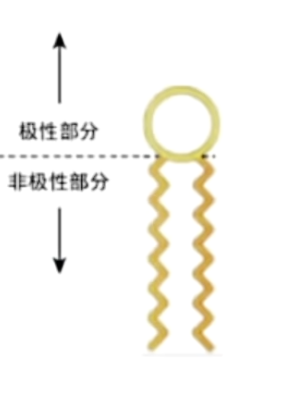
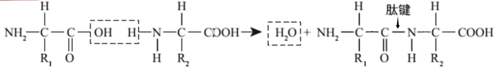
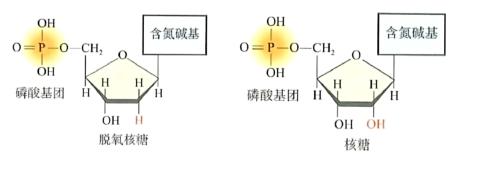
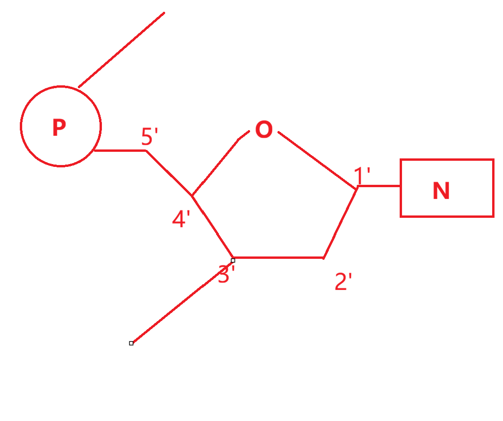
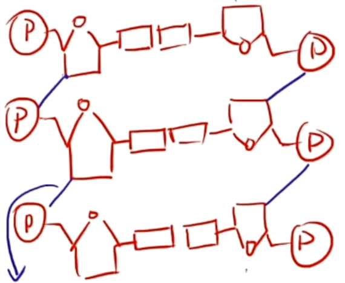
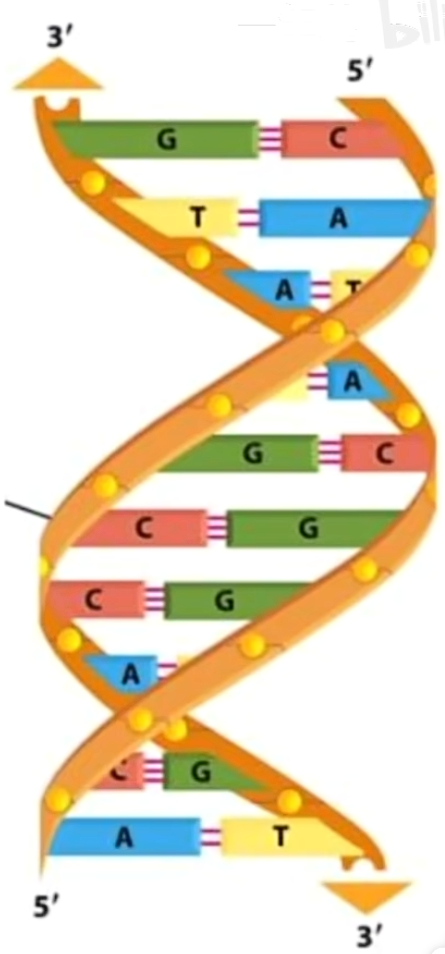

# 有机化合物

## 组成细胞的元素

组成细胞的元素分为大量元素 $C, H, O, N, P, S, K, Ca, Mg$ 与微量元素 $Fe, B, Cu, Mo, Zn, Mn$ 等. 其中 $C$ 为最基本的元素(碳链构成骨架), 基本元素包含 $C, H, O, N$ (细胞中含量前四位), 主要元素 $C, H, O, N, P, S$ 构成细胞中的有机物. 微量元素是生物体所必须的. 

人体内鲜重含重最高的化合物为 $H_2O$, 元素依次为 $O, C, H, N$ (氢的相对原子质量过小). 干重含重最高的为蛋白质, 元素依次为 $C, O, N, H$ . 

元素的(种类)统一性: 
1. 生物界与非生物界: 组成生物体的元素在无机自然界都可以找到.
2. 生物界内: 在不同的细胞内, 元素的种类大体相同.
元素的(含量)差异性:
1. 生物界与非生物界: 各种元素在生物体内和自然界中的含量差异很大
2. 生物界内: 不同生物组织的细胞中各种元素的含量有差别.

元素的作用有: $B$ 促进花粉的萌发和花粉管的伸长; 哺乳动物缺 $Ca$ 会出现抽搐; $Mg$ 是叶绿体中重要元素; $Fe$ 是组成血红蛋白的重要成分, 等等. 

## 组成细胞的化合物

细胞中含量最多的化合物是水, 最多的有机物为蛋白质. 

化合物的统一性(种类): 在不同的生物细胞内, 化合物的种类大致相同. 
化合物的差异性(含量): 不同生物组织的细胞中各种化合物的含量有差别. 

## 细胞中的水

不同种类生物体, 不同生长发育时期, 不同性别, 不同组织器官中含水量不同. 

细胞内绝大部分水以(游离)自由水的形式存在, 小部分为结合水. 
自由水的作用: 
1. 细胞内良好溶剂
2. 参与生化反应
3. 提供液体环境
4. 运送营养物质与代谢废物

结合水作用: 细胞结构的重要组成成分. 

自由水与结合水可以相互转化. 自由水流动性强, 可参与物质代谢, 故代谢旺盛, 抗逆性弱(环境适宜)时结合水转化为自由水(便于使用), 反之同理, 代谢缓慢, 抗逆性强(环境恶劣)时自由水转化为结合水(结合水干旱时不易蒸发, 寒冷时不易冻结). 

晒种子晒干(部分)自由水, 烘干种子烘干自由水和结合水. 失去部分自由水不致命, 新陈代谢减缓, 失去结合水生物体死亡. 冬天落叶减少自由水防止叶片结冰, 增强抗逆性. 

自由水和结合水的比例影响组织的形态特点. 如心脏与血液含水量均很高, 但心脏为固体, 而血液为液体, 因为心脏中结合水与自由水的比例较高. 

## 细胞中的无机盐

无机盐在细胞中含量很少, 仅占鲜重的 $1\%$ ~ $1.5\%$ , 大多以游离的离子存在. 

无机盐的作用: 
1. 是复杂化合物的重要组成成分.
2. 维持生命活动(如酸碱平衡, 渗透压平衡).

|元素       |生理作用      |缺乏症       |
|:-------:|:--------:|:--------:|
|$I^-$    |甲状腺激素的组成成分|地方性甲状腺肿; 幼儿患呆小症(身体智力均缺陷)|
|$Fe^{2+}$|血红蛋白的组成成分 |缺铁性贫血     |
|$Ca^{2+}$|降低神经系统的兴奋性|抽搐        |
|$K^+$    |维持细胞内液渗透压稳定; 影响神经系统的兴奋性|心律失常      |
|$Na^+$   |维持细胞外液渗透压稳定; 影响神经系统的兴奋性|神经与肌肉细胞的兴奋性降低, 肌肉酸痛, 乏力|

## 糖类

组成: $C, H, O$ ($(CH_2O)_n$, 碳水化合物)

根据糖类水解后的物质, 可以分为单糖, 二糖, 多糖. 单糖指不能再水解的糖, 可直接被吸收. 二糖为两个单糖脱水缩合而成. 多糖水解后能形成很多单糖(葡萄糖), 所有多糖均为葡萄糖聚合而成, 但结构不同. 

$$糖类\begin{cases}
单糖\begin{cases}
五碳糖: 核糖(RNA中), 脱氧核糖(DNA中)\\
六碳糖: 葡萄糖, 果糖, 半乳糖\end{cases}\\
二糖\begin{cases}
蔗糖(葡萄糖 + 果糖): 植物细胞中\\
麦芽糖(葡萄糖 + 葡萄糖): 发芽的谷物中\\
乳糖(葡萄糖 + 半乳糖): 动物乳汁\\
\end{cases}\\
多糖\begin{cases}
淀粉: 植物储存能量\\
糖原: 动物储存能量\begin{cases}
肝糖原\\
肌糖原\\
\end{cases}\\
纤维素: 构成植物细胞壁(难以消化吸收)\\
\end{cases}
\end{cases}$$

糖类的功能: 
1. 生命活动主要的能源物质(供能与储能), 其中葡萄糖为细胞生命活动的主要能源.
2. 组成细胞与生物体的结构成分

纤维素(膳食纤维)被称为第七营养素, 不能为人体功能, 但能促进肠胃蠕动. 食草动物通过消化道内微生物分解纤维素.   
几丁质, 又称壳多糖, 存在于甲壳类动物壳中或真菌细胞壁中, 支撑身体骨架, 保护身体. 

## 脂质

脂质不是生物大分子.  
组成: $C, H, O$, 部分含有 $N, P$ .   
脂质分为脂肪, 磷脂和固醇.

脂肪又称甘油三酯, 由三分子脂肪酸与一分子甘油酯化而成. 脂肪在常温下有两种存在形式, 动物脂肪多以固态存在, 植物脂肪多以液体存在, 原因是动物脂肪含饱和脂肪酸, 而植物含有不饱和脂肪酸. 

脂肪的功能
1. 脂肪是良好的储能物质(与糖类相比, 脂肪中$C, H$较多而$O$少, 等质量的两种物质氧化分解时, 脂肪耗氧多且供能多)
2. 保温
3. 减压, 缓冲(器官之间)

脂肪向糖类转化要难于糖类向脂肪转化. 

{ width=300px }

磷脂分子的极性部分亲水, 非极性部分亲脂, 构成细胞膜与细胞器膜. 

固醇分为胆固醇, 性激素与维生素 $D$ . 胆固醇只存在于动物体内, 为构成动物细胞膜的重要成分, 在人体内参与血液运输. 性激素促进生殖器官的发育与生殖细胞的形成. 维生素 $D$ 可以促进人体对钙和磷的吸收. 

## 蛋白质

蛋白质为生命活动的主要承担者, 不同蛋白功能不同, 与其组成与结构相关. 其基本组成单位为氨基酸. 组成元素为 $C, H, O, N, S$ .  

|类别  |<   |功能        |举例        |
|:--:|:--:|:--------:|:--------:|
|结构蛋白|<   |构成细胞和生物体结构的重要物质|肌肉, 头发指甲(角蛋白), 羽毛, 蛛丝等|
|功能蛋白|调节功能|对细胞和生物体的生命有重要调节作用|胰岛素, 生长激素等|
|^   |催化作用|催化细胞内的多种反应|大多数酶      |
|^   |运输作用|蛋白质具有运输功能 |血红蛋白等     |
|^   |免疫作用|抵御抗原      |抗体等       |

### 氨基酸

生物体中组成蛋白质的氨基酸共有 $21$ 种.  
氨基酸分子的结构通式为:
$$
R\\
|\\
\quad NH_2 - C - COOH\\
|\\
H
$$
其中 $-NH_2$ 为氨基, $-COOH$ 为羧基, $-R$ 为侧链基团, 不同种类氨基酸 $R$ 基不同, 故共有 $21$ 中 $R$ 基.  

氨基酸的元素组成为: $C, H, O, N$, 有些含有 $S$ .  
其中在人体中能合成的氨基酸为非必需氨基酸, 必须从外界环境中直接获取的氨基酸为必需氨基酸. 

氨基酸构成蛋白质分为两步. 首先氨基酸脱水缩合形成肽链. 二肽为两个氨基酸缩合而成的化合物, 多肽多个氨基酸缩合而成的化合物, 其中氨基酸通过肽键相接. 多肽呈链状结构即肽链, 环状为环肽. 然后肽链经过盘曲折叠形成具有空间结构的有活性的蛋白质. 盘曲折叠的过程中可能会形成氢键与二硫键( $-SH + HS- \to - S - S - + 2H$ ). 

数有几个氨基酸可以通过肽键, 找含有 " $- CO - NH -$ "(肽键旧形式)的结构并断开. 脱水缩合后水中的氢一个来自于氨基, 一个来自于羧基; 氧来自于羧基. 

{ width=300px }

计算质量时可以用 $氨基酸总重 - 脱去水总重(一个肽键贡献18) - 二硫键总重(一条二硫键贡献2(脱去2个氢))$ 计算. 

蛋白质结构多样性的原因: 
1. 氨基酸种类不同;
2. 氨基酸数目不同
3. 氨基酸排列顺序不同
4. 肽链盘曲折叠方式及空间结构不同.

蛋白质变性的原因: 过酸过碱, 重金属盐, 温度过高(过低不会变性, 活性会降低), 紫外线等. 注意与盐析区分, 蛋白质变性失活但盐析不失活. 蛋白质变性的实质是蛋白质空间结构破坏, 但肽键, 肽链未被破坏.

## 核酸

分为 $DNA$ (脱氧核糖核酸) 与 $RNA$ (核糖核酸) . 其中 $DNA$ 为双螺旋结构(双链), 存在于细胞核, 线粒体, 叶绿体中; $RNA$ 为单链螺旋结构, 主要存在于细胞质中, 少量存在于细胞核, 线粒体, 叶绿体中.   
组成元素有: $C, H, O, N, P$ .

### 核苷酸

组成核酸的基本单位为核苷酸. 组成 $DNA$ 的为脱氧核糖核苷酸(脱氧核苷酸), $RNA$ 的为核糖核苷酸. 

{ width=300px }

{ width=300px }

脱氧核苷酸与核糖核苷酸的差异在脱氧核苷酸 $2'$ 号碳上少一个氧, 分别含有脱氧核糖与核糖. 二者均有磷酸基团, 含氮碱基, 但含氮碱基的类型不完全相同. 脱氧核苷酸有 $A, T, C, G$ 四种含氮碱基, 而核糖核苷酸有 $A, U, C, G$ 四种($A, U, T, C, G$中文分别为腺嘌呤, 尿嘧啶, 胸腺嘧啶, 胞嘧啶, 鸟嘌呤). 嘌呤为双环结构, 嘧啶为单环结构(可以记忆为嘌呤零(圈)比较多). 可以发现二者 $A, C, G$ 相同, 区别在于 $T$ 和 $U$ .

可以发现共有五种含氮碱基, 四种脱氧核苷酸, 四种核糖核苷酸, 八种核苷酸. 

### 双螺旋

{ width=300px }

一条脱氧核苷酸链核苷酸之间通过磷酸二酯键(蓝箭头指出部位)连接. 两条链通过氢键连接. 值得注意的是, $A = T$ 之间通过两条氢键相连, 但 $C \equiv G$ 间为三条氢键, 故 $C \equiv G$ 碱基对含量高的脱氧核酸更加稳定(记忆: $G, C$ 较胖, 氢键条数多). 以及, 两个碱基之间可以通过氢键相连(不同链上), 也可以通过"脱氧核糖 - 磷酸基团 - 脱氧核糖" 相连(同一条链上). 可以发现, 核酸间总是符合 $A - T$ ($A - U$), $C - G$ 之间配对, 即符合碱基互补配对原则. 

{ width=300px }

如图, 两条链反向平行(由 $5'$ 端的磷酸基团与 $3'$ 端的五碳糖可以看出), 形成双螺旋结构. 题目有时会框起一个结构问是不是核苷酸, 要注意磷酸基团接在 $5'$ 号碳上的才是当前核苷酸的, 否则是上一个核苷酸的. 

核酸的作用: 
1. 核酸是细胞内携带遗传信息的物质
2. 核酸在生物体的遗传, 变异和蛋白质的生物合成中具有极其重要的作用.

只要有细胞结构, 不论是真核生物还是原核生物, 均含有 $RNA$ 与 $DNA$ , 且 $DNA$ 作为遗传物质. 病毒分为 $DNA$ 病毒和 $RNA$ 病毒, 前者仅有 $DNA$ 并以其作为遗传物质, 后者仅有 $RNA$ 并以其作为遗传物质. 

## 生物大分子

生物大分子是由许多单体连接成的多聚体, 以碳链为骨架. 

|生物大分子|基本单位|
|:---:|:--:|
|多糖   |葡萄糖 |
|蛋白质  |氨基酸 |
|核酸   |核苷酸 |

注意脂肪不是生物大分子.

## 物质鉴定

### 还原糖鉴定

选材: 富含还原糖(麦芽糖, 果糖, 葡萄糖, 注意蔗糖一定不是还原糖), 白色或接近白色的物质(显色试验).  
实验试剂: 斐林试剂(甲液 $0.1g/mL$ 的 $NaOH$ 溶液, 乙液 $0.05g/mL$ (比双缩脲试剂高)的 $CuSO_4$ 溶液).  
实验原理: 氢氧化铜被还原糖还原为氧化亚铜. 

$$
斐林试剂(Cu(OH)_2, 蓝色沉淀) + 还原糖 \xrightarrow[50\degree C \sim  60\degree C]{水浴加热} 砖红色沉淀(Cu_2O)
$$

注意斐林试剂要现配现用, 防止氢氧化铜沉淀凝固. 班氏试剂或本尼迪特试剂是改良版的斐林试剂, 存在抗凝剂, 无需现配现用. 使用时需要甲乙液先混合配置斐林试剂后倒入待测液中, 与下面的双缩脲试剂区分. 

碘液用于测定淀粉而非还原糖, 遇淀粉显蓝色. 

### 蛋白质鉴定

选材: 富含蛋白质的浅色物质.  
试剂: 双缩脲试剂($A$ 液 $0.1g/mL$ 的 $NaOH$ 溶液, $B$ 液 $0.01g/mL$ (浓度较斐林试剂小)的 $CuSO_4$ 溶液).  
实验原理: 碱性环境下铜离子与肽键络合形成紫色络合物. 

$$
蛋白质(肽键) + 双缩脲试剂 \xrightarrow{\qquad} 紫色溶液
$$

注意这里不同的是, 要先向待测液中加入 $A$ 液以提供碱性环境, 再滴入若干滴 $B$ 液进行反应, 无需水浴加热溶液即变为紫色. 注意双缩脲试剂是用来检测肽键(至少两个)的, 故多肽(三肽及以上)也可显色, 并不是只有蛋白质能显色(显然氨基酸与二肽不可显色). 当然, 酶等物质也可显色, 比较易错的蛋白酶(也是蛋白质)加入蛋白质也是可以显色的. 

由于双缩脲试剂(显色试剂一般很灵敏)十分灵敏, 故只需滴加几滴较稀的硫酸铜溶液即可; 而斐林试剂作为沉淀需要一定量的铜离子, 故较浓的硫酸铜被使用. 当然, 条件不允许时, 使用斐林试剂加水代替双缩脲试剂是被允许作为粗略鉴定的. 

### 脂肪的鉴定

选材: 富含脂肪, 颜色浅或近于白色的植物种子(如花生种子).  
试剂: 苏丹$III$ 染液(将脂肪染成橘黄色). (苏丹$IV$ 染液也可, 染成红色). 
首先需要取材制片, 将子叶削成薄片, 单层细胞为佳(因为要用显微镜观察). 而后滴入数滴苏丹$III$ 染液染色, 再用 $50\%$ 的酒精(注意不是 $75\%$ 医用酒精)洗去浮色并制成临时装片. 最后用显微镜观察. 

当然, 使用子叶再白纸上划痕等方式检验脂肪均可以接受.

## 探究无机盐功能

对照组: 完全培养液培养.  
实验组: 缺某种元素的培养液培养, 出现症状后加入此元素继续培养, 症状消失.