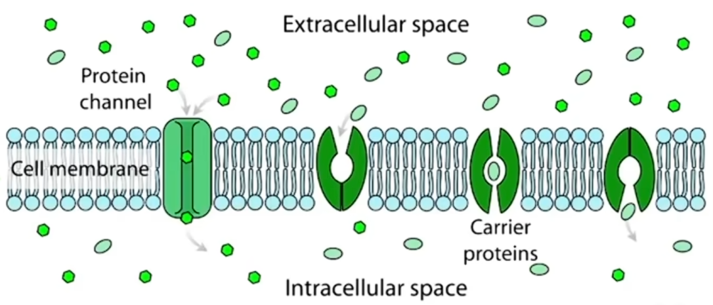
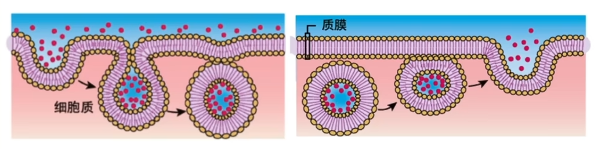
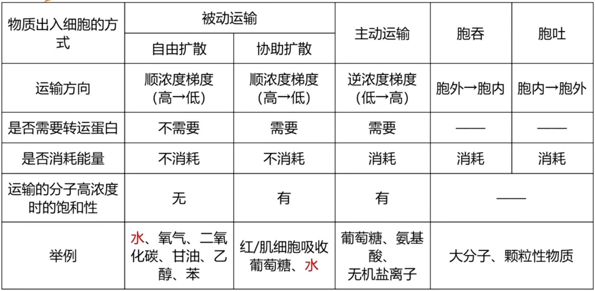
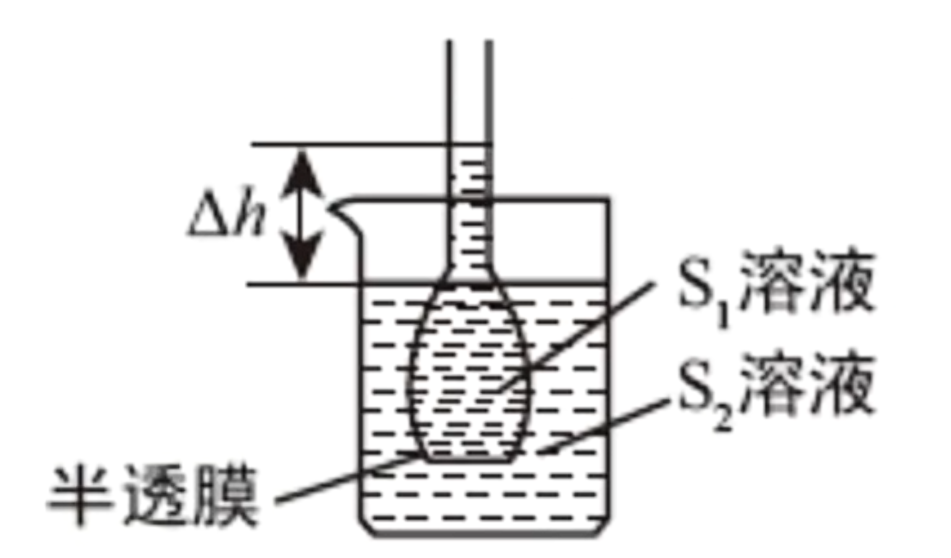
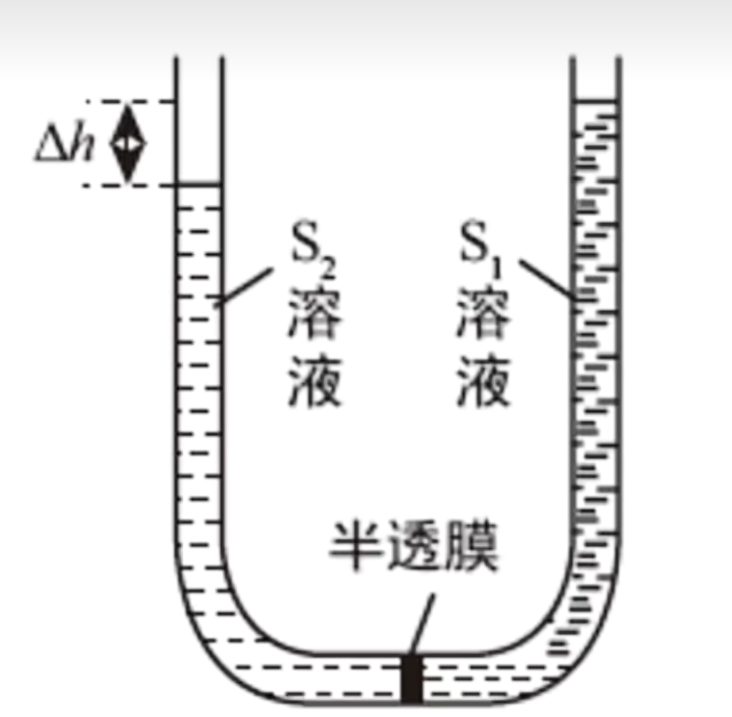
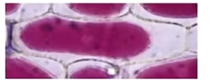

# 物质运输

渗透作用: 水分子或其他溶剂分子透过半透膜从低浓度向高浓度溶液的扩散(维持两侧水分子数目一致的趋势). 渗透压: 溶质微粒对水的吸引力.  

红细胞浸泡在不同浓度的盐溶液内失水皱缩与吸水涨破的原因就是渗透作用. 当盐溶液浓度过高时, 从红细胞流出的水多于流入的水(既有正向也有逆向, 只是量的多少, 达到动态平衡时两侧水分子一样多, 但仍然有水的交换), 红细胞吸水; 反之同理. 植物细胞的细胞膨胀(有细胞壁故不会涨破)与质壁分离也是因为渗透作用. 

渗透作用的条件: 
1. 半透膜(只允许溶剂分子透过, 不允许溶质分子透过, 细胞膜/原生质层充当半透膜)
2. 半透膜两侧存在浓度差

半透膜 $\ne$ 生物膜, 对于物质进出的控制, 半透膜是由孔径决定的, 而生物膜是选择透过性. 

应用: 生理盐水(等渗溶液), 盐碱地或一次施肥过多导致烧苗, 糖渍或盐渍食品影响微生物吸水不易变质. 

## 自由扩散

又称简单扩散, 受细胞膜内外物质浓度差影响, 水(实际上更多是通过水通道蛋白协助扩散), 氧气, 二氧化碳(气体扩散), 甘油, 乙醇, 乙二醇, 笨(脂类物质(相似相溶)), 尿素等. 

扩散(自由扩散与协助扩散, 被动运输)不需要能量(自由扩散不需要转运蛋白), 但需要浓度差, 且只能从高浓度向低浓度扩散(顺浓度梯度), 浓度差越大, 扩散速率越快.

## 协助扩散

又称易化扩散, 受细胞膜内外物质浓度差影响, 以及细胞膜上转运蛋白的种类及数量影响, 葡萄糖(进入红细胞, 肌细胞), 水(大部分)均是通过协助扩散跨膜运输. 

转运蛋白分为通道蛋白与载体蛋白两种, 其中通道蛋白运输速率更快; 载体蛋白需要与特定分子结合后自身构象发生改变进而运输, 运输速率较慢. 

协助扩散可以通过两种转运蛋白(通道蛋白, 载体蛋白)进行, 但若遇见 $\dots$ 通道一定为协助扩散. 协助扩散

## 主动运输

自由扩散和协助扩散为被动运输. 

主动运输可以逆浓度梯度运输, 受膜上载体蛋白的种类和数量, 以及能量的影响, 可以运输葡萄糖, 氨基酸, 无机盐离子等. 主动运输只能通过载体蛋白而不能通过通道蛋白实现, 但协助扩散可以通过两种转运蛋白实现. 主动运输因为要逆浓度梯度运输, 故需要消耗能量. 

部分参与主动运输的载体蛋白成为 $X - X$ 泵, 如 $Na^+ - K^+$ 泵, 故"泵" 一定是主动运输, 需要消耗能量. 

意义: 保证了活细胞能够按照生命活动的需要主动选择吸收所需要的营养物质, 排除代谢废物和对细胞有害的物质.

## 胞吞胞吐

胞吞胞吐不属于跨膜运输(不跨越生物膜), 物质被膜上的蛋白质识别后引起细胞膜内陷, 形成囊泡并裹挟物质进入细胞. 通过胞吞胞吐的物质主要为大分子物质(神经递质小分子也可以), 大分子物质主要通过胞吞胞吐进出细胞. 胞吞胞吐受到能量的影响, 需要消耗能量. 胞吞胞吐体现了细胞膜的流动性. 

分泌蛋白, 细菌(进入细胞被溶酶体降解)等物质需要通过胞吞胞吐进出细胞. 

运输时分子的高浓度饱和性是指在内外浓度差较高时, 运输速率是否会进一步随着浓度差升高而上升. 需要通过转运蛋白的运输方式速率与转运蛋白的数量有关, 若转运蛋白全部被占用则速率不会进一步上升, 故具有饱和性. 

## 质壁分离

扩散作用发生时分子两方向移动均有, 只是主导方向不同, 下文不再赘述. 

初始页面浓度等高. 令 $S_1$ 溶液为蔗糖溶液, $S_2$ 溶液为水溶液($S_1$ 不为水, $S_2$ 不为蔗糖溶液的原因是排除水因重力向下扩散的可能性). 水分子向浓度高的 $S_1$ 部分扩散, 水柱上升. 

平衡时出入半透膜的水分子一致, 渗透压与 $\Delta h$ 部分水柱的重力平衡, 故 $S_1$ 部分溶液浓于 $S_2$ 部分. 当然也可以从溶质分子(蔗糖, 二糖)不穿过半透膜, $S_2$ 部分始终为水来分析. 

将 $S_1$ 溶液改为高浓度蔗糖溶液, $S_2$ 为低浓度蔗糖溶液同理, 仍然 $S_1$ 浓度高于 $S_2$ , 可以用力的平衡(上文)解释. 在记忆上可以类比勒夏特列原理, 只阻碍, 不消除/逆转.  

此装置同理. 增加难度, 将 $S_1, S_2$ 区域放入体积, 质量浓度相同的蔗糖与葡萄糖溶液(葡萄糖属于单糖, 小分子物质, 可以穿过半透膜). 首先判断两侧渗透压, 易知 $S_2$ 葡萄糖区域溶质微粒数目多, 渗透压大. 

显然水分子小于葡萄糖分子, 故水分子透过半透膜的速率大于葡萄糖. 初始时水通过半透膜的速率更大, 由于渗透压水分子向 $S_2$ 区域扩散页面上升, $S_1$ 区域页面下降. 随着葡萄糖因扩散作用向 $S_1$ 区域移动, 由于溶质微粒不用像溶剂一样考虑重力, 故最终两侧葡萄糖微粒数趋于平衡. 对水来说渗透压的影响需要考虑溶质微粒的总数, 在葡萄糖分子扩散完全后 $S_1$ 区域微粒数更多(多出蔗糖), 渗透压高, 水分子向右扩散, 则 $S_1$ 区域液面上升, $S_2$ 区域液面下降, 形成图示状态. (两区域浓度仍然可以考虑力的平衡分析; 若实在不理解量的多少可以假设葡萄糖与蔗糖微粒数分别为 $200, 100$ 个分析). 

故总的来看, $S_2$ 区域页面先上升后下降. 

以下为质壁分离实验. 在成熟植物细胞中, 我们认为主要由液泡中的细胞液吸水与失水, 故统一将细胞膜, 细胞质, 液泡膜称为原生质层, 作为半透膜. 细胞壁有全透性(物质随意穿过), 且不易变形, 但原生质层伸缩性很好. 原生质体为植物细胞除细胞壁的部分.  

成熟的, 活的植物细胞(含中央大液泡)才可以质壁分离(死细胞膜全透), 实验时为方便观察液泡中最好含有色素(不是质壁分离的条件, 或者通过叶绿体, 或外界溶液有色也可观察). 紫色洋葱鳞片叶(外表皮)是很好的材料. 正常制单层细胞片低倍镜观察作为对照; 滴加 $0.3 g/mL$ 蔗糖溶液(浓度适宜, 防止过度失水致死, 否则无法观察质壁分离的复原)并用吸水纸吸引, 低倍镜观察得到如图图像; 滴加清水并吸引, 低倍镜观察, 质壁分离复原, 液泡由小变大, 由深变浅. 注意实验全程使用低倍镜观察. 

上图中质壁分离, 液泡失水缩小, 颜色有浅变深, 细胞外界溶液(此处为蔗糖溶液)充斥细胞壁与原生质层间(细胞壁的全透性). 不要使用酸碱性溶液或酒精等具有消毒功能的液体实验. 

若使用可以通过跨膜运输透过原生质层的溶液(如 $8\%$ 的食盐水, $5\%$ 的硝酸钾溶液, 甘油, 尿素, 乙二醇等), 在质壁分离后会自动复原(不断吸收此类物质直至胞内浓度大于胞外, 细胞开始吸水, 质壁分离复原). 而无法被细胞吸收的如蔗糖等物质则需要滴加清水复原. 

本实验为自身前后对照, 三次观察显微镜, 第二次(质壁分离)与第一次(初始)对照, 第三次(质壁分离复原)与第二次(质壁分离)对照. 

若题目给出一副图像, 即使细胞膜与细胞壁不贴合, 其状态仍无法确定, 可以是正在失水/吸水/最大失水状态.