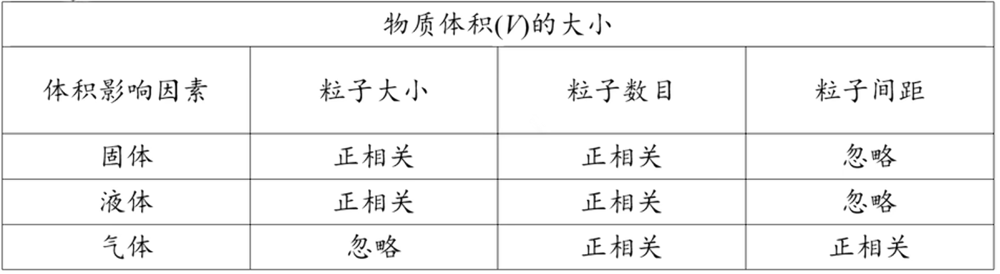
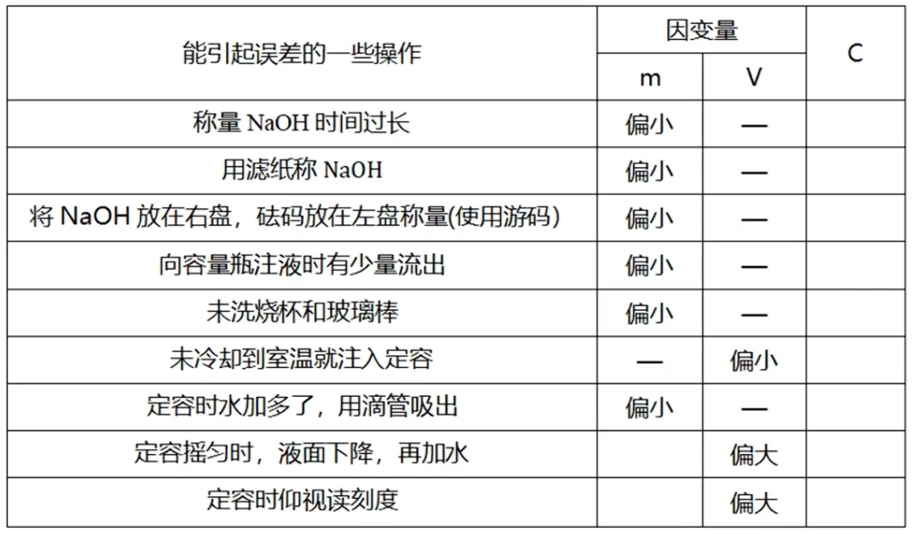
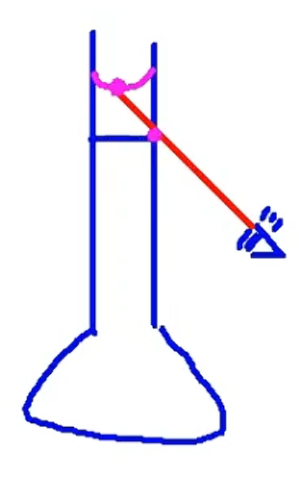

# 物质的量

宏观上, 物质按照质量关系进行化学反应; 微观上, 化学反应按微观粒子的数目进行, 但其质量难以称量. 为沟通宏观微观, 使用物理量物质的量( $n$ ), 表示含有一定数目粒子的集合体, 单位 $mol$ (还有 $mmol, \mu mol, kmol$ 等). 公式: 

$$n = \frac{N}{N_A}$$

其中 $N$ 为粒子数, 无单位, $N_A$ 为阿伏伽德罗常数(每摩尔物质所具有的微粒数目), 单位 $mol^{-1}$ , 约为 $6.02 \times 10^{23}$ . 可以发现, 物质的量可以理解为"一包"粒子, 其中有 $N_A$ 个微粒, 但 $1 mol$ 粒子不是一个微粒. 物质的量不能描述宏观物体, 如 $1 mol$ 人是不可取的. 

方程式计量数之比也是各物质参加反应的物质的量之比. 在做计算题时, 写方程式再根据计量数之比处理事一种基础的方法. 当然更简单地, 可以直接根据守恒等来判断物质之间关系式关系量(写方程式就是为了特定几个物质的比例), 从而得到各物质的比例, 解决问题. 

摩尔质量 $M$ 是每摩尔物质所具有的质量, 单位 $g/mol$ 等. 当使用 $g/mol$ 为单位时, 数值上等于相对原子/分子质量(是不同物理量, 定义, 含义不同), 公式:

$$n = \frac{m}{M}$$

若写为连等式: $\frac{N(微观)}{N_A} = n = \frac{m(宏观)}{M} = \frac{V(宏观)}{V_m}$ , 可以发现, 物质的量建立微观与宏观的联系, 故要先计算. ($V$ 详见下文, 体积可称量)

摩尔质量也可以用 $M(g/mol) = 每个原子/分子的质量(\frac{m}{N}, g) \times N_A(mol^{-1})$ 计算得到.  

混合物质的摩尔质量可以用 $\frac{总质量}{总物质的量}$ 得到, 也可以用 $M(组分 1) \times 其物质的量分数/质量分数 + M(组分 2) \times 其物质的量分数/质量分数 + \dots = \bar{M}$ . 如空气的平均摩尔质量 $M(空气) \approx 28 \times \frac{4}{5} + 32 \times \frac{1}{5} \approx 28.8 g/mol$ .

后文均使用气体分子(稀有气体是单原子分子). 

物质体积的大小的影响因素如下. 

{ width=500px }

其中(理想)气体自身粒子的体积可以忽略, 与容器的大小(压强, 分子间距)等有关. 下面我们详细讨论理想气体的体积. 

理想气体分子间距离受到温度(热胀冷缩)与压强(改变容器体积)的影响, 且理想气体体积在分子数相同的条件下只受分子间距离的影响, 故在标准情况下, $1 mol$ 不同气体的体积相同. 由此我们可以引出气体摩尔体积的概念: 每摩尔气体所占体积. 

$$n = \frac{V}{V_m}$$

其中 $V_m$ 是气体摩尔体积, 单位 $L/mol$ 或 $m^3/mol$, 常数; $V$ 是气体体积. $V_m$ 在标况($0\celsius, 101 kPa$) 下为 $22.4 L/mol$ , 常温常压($25\celsius, 101 kPa$)下为 $24.5 L/mol$ . 使用 $V_m$ 计算时必须指明状态(压强与温度), 且只能用于气体. 气体摩尔体积的单位使用 $g/mol$ 也可以被接受, 故有: $n = \frac{m}{V_m}, M = \rho V_m, \rho = \frac{m}{V}$ . 

理想气体状态方程: 
$$pV = nTR$$  

其中 $p$ 为压强, $T$ 为温度, $R$ 为常数. 用此公式可以进行定性(确定不变的量, 找到剩余的量之间是正比/反比关系)或定量分析. 可以得到变形式
$$pM = \rho RT$$

$\rho$ 为气体密度, 使用方法同上. 由此公式可以发现气体摩尔质量与密度的关系, 从而可以判断气体分层的位置. 

溶质的质量分数: 混合气体或溶液内特定物质质量所占总质量的比例, 用 $\omega = \frac{m}{m_总} \times 100\%$ 表示, 单位为 $1$ . 

物质的量浓度: 混合气体或液体内特定物质物质的量所占总体积的比例, 用 $c = \frac{n}{V}$ 表示, 单位为 $mol/L$ . 注意 $V$ 需要用总体积, 可能由多部分组成. 不论是质量分数还是物质的量浓度, 溶液一旦配置好就不会变化, 与取用的体积无关. 

溶液稀释公式:
$$n =cV;\\c_浓V_浓 = c_稀V_稀$$

此公式由溶质物质的量不变得到. 

可以衍生出以下公式, 用于转化质量分数与物质的量浓度: 

$$c = \frac{1000\rho \omega}{M}$$

注意这里密度的单位为 $g/ml$, 因此乘 $1000$ 转化单位, 若单位为 $g/L$ 则不用乘 $1000$ . 

涉及密度的题目一般用于质量与体积相互转化. 

练习(判断正误): $100 g 质量分数为 17\% 的 H_2O_2 溶液含有的氧原子数目为 N_A. $

错误的. 溶液水中含有大量氧原子无法计算. 

若题目有混合物总体的数据但不告诉各个物质的占比, 此时考虑极值法, 即假设全部为某一物质求出结果, 会得到一个区间(或一个数值, 当两端点相等时), 就可以依此解决问题. 

在此部分计算题中要建立起以原子视角看待问题的思维, 如 $Na$ 与足量氧气反应生成 $Na_2O, Na_2O_2$ 的混合物, 钠失去的电子数为 $N_A$ , 在此处反应可以看做 $Na \xrightarrow{\quad} Na^+$ , 其余不用考虑, 即可分析出答案. $Mg$ 在空气中的燃烧同理, 不论与谁反应均会变为正二价. 

要小心可逆反应在此章节, 或是有限度的反应(浓变稀(如实验室制氯气等), 钝化等), 或是胶粒(很多聚集在一起). 

## 容量瓶

实验仪器: (天平, 药匙(涉及固体)) 量筒, 烧杯, 玻璃杯, 容量瓶(写清规格), 胶头滴管. 

容量瓶的规格有特定几种: $50mL, 100mL, 250mL$ 等, 若要配置 $200mL$ 溶液, 需要先使用 $250mL$ 容量瓶(上取整)配置再取 $200mL$ . 容量瓶的使用温度为 $20\celsius$ . 

容量瓶使用时需要先检漏, 检查是否漏液. 操作顺序为: 装水, 塞盖, 倒立, 正立, 旋转磨口玻璃塞 $180^\circ$ , 倒立, 正立并完成检漏. 

配置溶液的过程分为:
1. 计算, 注意容量瓶的选择必须是正确的规格, 以及计算与仪器精度. 
2. 溶解, 用量筒量取蒸馏水, 将药品在烧杯中溶解, 注意不能直接在测量仪器(量筒, 容量瓶)中溶解.
3. 搅拌, 回到室温后(防止溶解吸放热). 
4. 倒入容量瓶, 使用玻璃棒引流至刻度线以下. 
5. 摇晃震荡
6. 洗涤烧杯中残留的药品并倒入容量瓶.
7. 定容, 倾倒时同样需要引流, 当液面接近刻度线时, 需要改用滴管. 若超过刻度线则需要从头开始.

{ width=300px }

注意摇匀后溶液会粘在刻度线以上, 液面略微下降, 此时不可补加水. 俯仰视问题要注意操作人员目光始终盯紧刻度线, 画图解决问题. 

{ width=500px }

## 十字交叉法

注: 以下几种方法适合以题带点, 方便理解. 

十字交叉法是一种普适的方法, 用于求解二元混合体系平均与比例互求问题.

[更具体地请看杰哥的课](https://www.bilibili.com/video/BV1Qi4y1R7tW/?p=39&share_source=copy_web&vd_source=52aa8bd45c28e534d02e312968f55355&t=333)

## $c$ 与 $\omega$ 大小比较

[难以用文字描述, 推荐大家看杰哥的课](https://www.bilibili.com/video/BV1Qi4y1R7tW/?p=40&share_source=copy_web&vd_source=52aa8bd45c28e534d02e312968f55355&t=928)

## 差量法

由于难以直接确定混合产物或其他原因, 导致我们必须通过差值来进行运算. 

[详细内容请看杰哥的课程](https://www.bilibili.com/video/BV1Qi4y1R7tW/?p=41&share_source=copy_web&vd_source=52aa8bd45c28e534d02e312968f55355&t=1029)

## 与钠有关的计算

[$偷懒, \以\后\记\得\补\上$](https://www.bilibili.com/video/BV1Qi4y1R7tW/?p=42&share_source=copy_web&vd_source=52aa8bd45c28e534d02e312968f55355)

【高中化学基础与解法全集（涵盖所有）|长期更新|从零开始拯救所有学渣！】 https://www.bilibili.com/video/BV1Qi4y1R7tW/?p=41&share_source=copy_web&vd_source=52aa8bd45c28e534d02e312968f55355

【高中化学基础与解法全集（涵盖所有）|长期更新|从零开始拯救所有学渣！】 https://www.bilibili.com/video/BV1Qi4y1R7tW/?p=40&share_source=copy_web&vd_source=52aa8bd45c28e534d02e312968f55355

【高中化学基础与解法全集（涵盖所有）|长期更新|从零开始拯救所有学渣！】 https://www.bilibili.com/video/BV1Qi4y1R7tW/?p=39&share_source=copy_web&vd_source=52aa8bd45c28e534d02e312968f55355

【高中化学基础与解法全集（涵盖所有）|长期更新|从零开始拯救所有学渣！】 https://www.bilibili.com/video/BV1Qi4y1R7tW/?p=38&share_source=copy_web&vd_source=52aa8bd45c28e534d02e312968f55355

复习这四个.