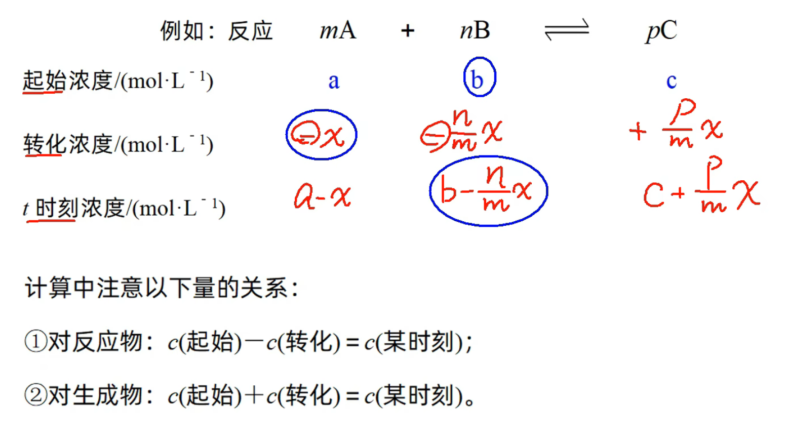
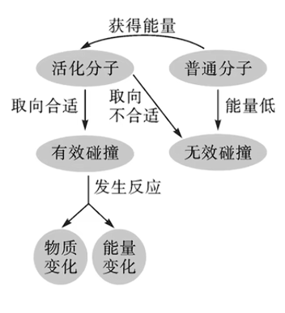
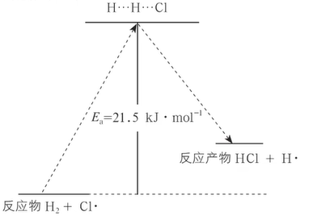
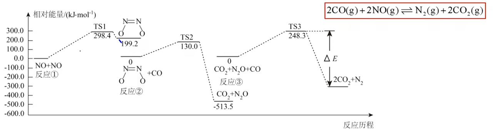

# 化学反应速率

概念(不强求用浓度表示, 也可以用物质的量或分压表示): 
$$定量描述化学反应进行的快慢的物理量$$
数学表达式($\Delta c$是反应物或生成物浓度变化量(正值), $\Delta t$是时间):
$$v = \frac{\Delta c}{\Delta t}$$
单位(仅给出国际单位):
$$mol \cdot L^{-1} \cdot s^{-1} 或 mol / (L \cdot s)$$
注意: 
1. 化学反应速率是一段时间内的平均速率, 而不是瞬时速率(高中阶段瞬时速率只能从图表斜率处看)
2. 化学反应速率均取正值
3. 不用固体($s$)和纯液体($l$)的浓度表示化学反应速率(因为它们的浓度可以看做是一个常数不变)

化学反应速率与化学计量数的关系:
1. 同一反应用不同物质表示化学反应速率时, 其数值大小可能不同, 但表示的意义相同.
2. 对于反应$mA(g) + nB(g) == pC(g) + qD(g)$, 当单位相同时, 化学反应速率的数值之比等于方程式中各物质的化学计量数之比, 即$v(A) : v(B) : v(C) : v(D) = m : n : p : q$ 或 $\frac{v_A}{m} = \frac{v_B}{n} = \frac{v_C}{p} = \frac{v_D}{q}$(关联同一个反应的两个速率可以使用, 但是要注意先化成比例的形式)

比较速率大小: 
1. 统一单位
2. 化成同一个物质(一般选择化学计量数为$1$的物质, 好转化(除以对应计量数即可))

## 三段式法
对于比较复杂的化学反应速率计算, 常用三段式解决.  
{ width=500px }  
注意计算的时候单位必须一致(譬如 __不能__ 有些填浓度有些填物质的量, 建议填数时带单位); 不要忽略体积; 大胆设未知数.

---

## 影响化学反应速率的因素

### 化学反应速率的测定

我们可以通过实验测定化学反应速率, 比较典型的例子有以下几个.
1. $S_2O_3^{2-} + 2H^+ \xlongequal{\quad} SO_2\uparrow + S\downarrow + H_2O$
2. $H_2O_2 \xlongequal{MnO_2} 2H_2O + O_2\uparrow$

通过以上实验可以得出影响化学反应速率的因素:
1. 内因(最主要): 参加反应的物质本身性质.
2. - 浓度: 在有气体参加或溶液中发生的反应, 增大浓度, 反应加快; 减小浓度, 反应减慢. 特殊地, 改变纯液体或固体的量并不会改变其浓度, 即不会改变速率. 但是增大固体表面积会增大反应速率.  
   - 压强: 主要这里我们认为改变压强即改变容器体积(或溶剂体积). 压强影响速率要落脚到浓度(所以说对于只涉及纯液体/固体的反应 __无影响__), 比如说 __恒温恒容__ 下充入无关气体(如稀有气体等), 压强的确会增大, 但反应速率不变, 因为反应物浓度没发生改变; 当 __恒温恒压__ (体积可变)下充入无关气体, 则会增大体积导致反应物浓度减小速率减慢.
   - 温度: 温度升高, 正逆反应速率同时增大; 反正同理.  
   - 催化剂: 改变反应历程, 改变反应活化能来改变速率. 自身参与反应但是反应始末催化剂质量和化学性质不变, 即先消耗再生成. 下面会详细介绍.  

注意以上影响反应速率, 正反应速率与逆反应速率同增同减, 导致平衡移动的是它们的变化幅度有区别.  

大多数反应并非由简单碰撞就可以完成的, 需要经过很多不可拆分的基元反应实现. 

有效碰撞模型: 基元反应发生的先决条件是反应物分子发生有效碰撞. 其实, 并非每次碰撞都是有效碰撞, 能够发生有效碰撞的分子叫做活化分子, 其具有更高的能量; 分子除了需要足够的能量, 还需要适合的碰撞取向才能发生有效碰撞. 总之就是下图所示.

{ width=500px }

在一定条件下, 活化分子所占的百分数是不变的. 活化分子百分数越大, 有效碰撞就越多, 速率快. 改变温度由此影响速率. 单位体积内活化分子数越多, 碰撞多, 有效的自然多, 速率快. 改变浓度/压强就是由此改变反应速率.

{ width=300px }

如图, $E_1$ 是正反应活化能, $E_2$ 是逆反应活化能. 显然, 反应需要先到达活化能才能发生. 而催化剂可以通过走其他的反应历程来实现降低活化能. 催化剂也可以看做是降低了成为活化分子的门槛, 提升了活化分子百分数.  

### 化学反应历程

只经过一步的反应称作基元反应. 多步为复杂反应. 常见的多数反应都是复杂反应. 

{ width=300px }

如图, $TS1$ 等是过渡态, 中间生成但随即消耗不出现在总反应里的是中间产物, 图中有三步基元反应. 

化学反应速率方程: $v = k \cdot c^m(A) \cdot c^n(B)$, 其中一般情况下 $A, B$ 物质为部分反应物, $m, n$ 与化学计量数无关, 只能通过实验测定(题目会给表格, 需要控制单一变量); $k$ 为反应速率常数, 通过阿伦尼乌斯经验公式可以得到: 
$$
lnk = -\frac{E_a}{RT} + lnA
$$
可以看出反应速率与活化能, 温度相关. 同时活化能越大的反应对温度的变化越敏感, 由此可以解释温度变化导致的平衡移动.   
当反应为基元反应时, 速率方程可以有反应方程式得到, 对于 $CO + NO_2 = CO_2 + NO$ 而言:
$$
v_正 = k_正c(CO)c(NO_2)\\
v_逆 = k_逆c(CO_2)c(NO)
$$
即写出所有的反应物, 浓度的次数为化学计量数. 前提是基元反应. 同样地, 若反应为基元反应, 当 $v_正 = v_逆 \Rightarrow k_正c(CO)c(NO_2) = k_逆c(CO_2)c(NO)$ 时, 反应平衡, 有 $K = \frac{k_正}{k_逆} = \frac{c(CO_2)c(NO)}{c(CO)c(NO_2)}$

催化剂具有选择性, 对不同的反应催化效果不同, 可以由此减小副反应的影响. 催化剂一般要维持在其活性温度范围内; 有些物质会使催化剂失效, 成为催化剂中毒. 

竞争反应中, 平衡后生成较多的产物能量低. 由此可以画反应历程图.