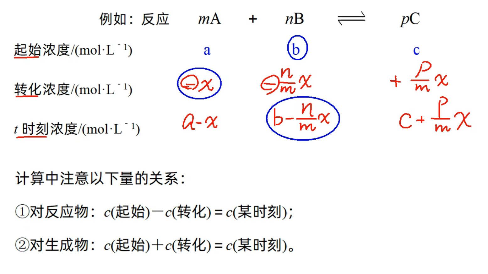

# 化学反应速率

---

[化学反应速率基本概念与计算](https://www.bilibili.com/video/BV1Qi4y1R7tW?p=100&vd_source=52aa8bd45c28e534d02e312968f55355)

---

概念(不强求用浓度表示, 也可以用物质的量或分压表示):

$$
定量描述化学反应进行的快慢的物理量
$$

数学表达式($\Delta c$是反应物或生成物浓度变化量(正值), $\Delta t$是时间):

$$
v = \frac{\Delta c}{\Delta t}
$$

单位(仅给出国际单位):

$$
mol \cdot L^{-1} \cdot s^{-1} 或 mol / (L \cdot s)
$$

注意:

1. 化学反应速率是一段时间内的平均速率, 而不是瞬时速率(高中阶段瞬时速率只能从图表斜率处看)
2. 化学反应速率均取正值
3. 不用固体($s$)和纯液体($l$)的浓度表示化学反应速率(因为它们的浓度可以看做是一个常数不变)

化学反应速率与化学计量数的关系:

1. 同一反应用不同物质表示化学反应速率时, 其数值大小可能不同, 但表示的意义相同.
2. 对于反应$mA(g) + nB(g) == pC(g) + qD(g)$, 当单位相同时, 化学反应速率的数值之比等于方程式中各物质的化学计量数之比, 即$v(A) : v(B) : v(C) : v(D) = m : n : p : q$ 或 $\frac{v_A}{m} = \frac{v_B}{n} = \frac{v_C}{p} = \frac{v_D}{q}$(关联同一个反应的两个速率可以使用, 但是要注意先化成比例的形式)

比较速率大小:

1. 统一单位
2. 化成同一个物质(一般选择化学计量数为$1$的物质, 好转化(除以对应计量数即可))

### 三段式法

对于比较复杂的化学反应速率计算, 常用三段式解决.

注意计算的时候单位必须一致(譬如 __不能__ 有些填浓度有些填物质的量, 建议填数时带单位); 不要忽略体积; 大胆设未知数.

---

*以上所有内容均为个人整理的$一化儿$公开课程笔记

本作品采用 知识共享署名-非商业性使用 4.0 国际许可协议 (CC BY-NC 4.0) 进行许可.
$\textcopyright$ $2025$ $Zheng$
