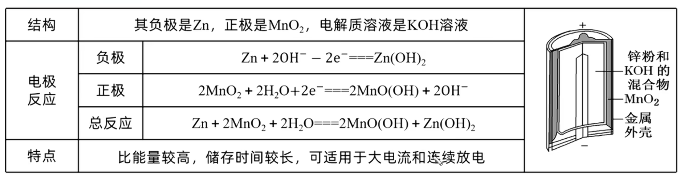
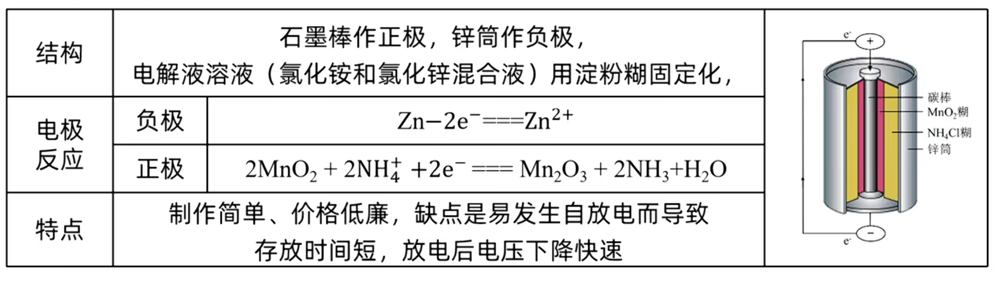
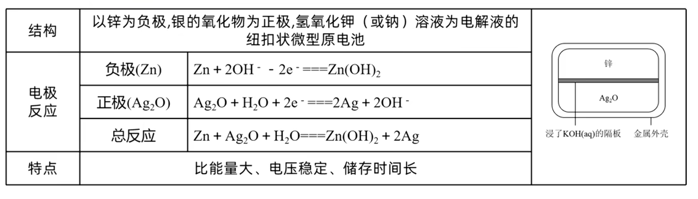
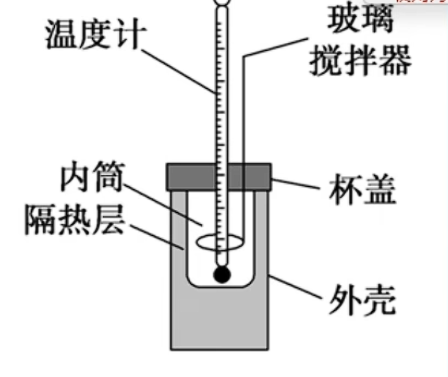
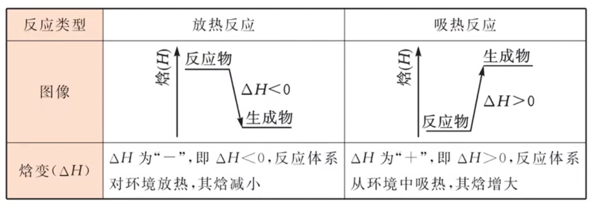
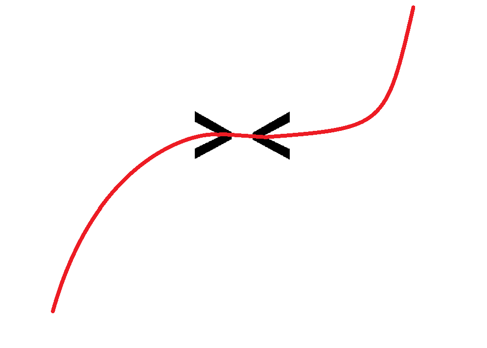
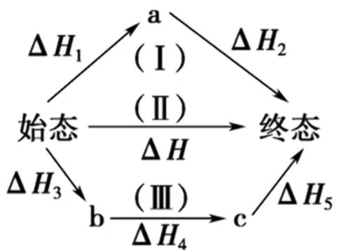

# 化学反应与能量

## 电

### 原电池

将化学能转化为电能的装置, 将一个可以自发的氧化还原反应强制分开在两个区域进行, 用导线相连, 电子定向从负极流经导线前往正极, 形成电流 (有电势差存在, 正极电势高, 负极电势低). 在溶液内离子的移动导电, 维持电中性, 配合电子形成闭合回路. 

于是可以得到: 
- 负极失电子发生氧化反应(失负, 师傅), 正极得电子发生还原反应.
- 电子(流)从正极流向负极, 导线中电流由正极流向负极.
- 阳离子往正极移动, 阴离子往负极移动 (正正负负)

{ width=300px }

如图为单液原电池与双液原电池. 其中盐桥中有饱和 $KCl$ 溶液和琼胶, 用于维持电中性并形成闭合回路. 盐桥中离子移动仍然遵循 "正正负负" 的原则. 有时会用到离子交换膜, 就是只有特定离子可以通过的膜. 

电极反应方程式与离子方程式类似, 但是其中可以有电子存在; 总方程式为正负极方程式按比例相加约掉电子得到. 例如锌铜原电池的电极方程式如下( $-e^-$ 代表失电子, 负负得正可以看做正电荷 ):  

$$
负极: Zn - 2e^- \xlongequal{\quad} Zn^{2+} \\
正极: Cu^{2+} + 2e^- \xlongequal{\quad} Cu \\
总反应: Zn + Cu^{2+} \xlongequal{\quad} Cu + Zn^{2+}
$$

可以发现较为活泼的金属做负极, 而正极可以是活动性较弱的金属或非金属, 其中惰性电极一定不参与反应, 如 $Au, Pt, C$ 等.

原电池的应用: 

1. 加快反应速率, 因为正负电极有电势差, 电子流动更容易. 如 $Zn$ 与 $H^+$ 的反应, 若假如 $Cu^{2+}$ 则构成原电池加快反应速率.
2. 比较金属活动性强弱, 特例: 活泼金属单质因自身性质不参与反应 $Mg - Al - NaOH$ 原电池, 以及钝化 $Fe - Cu - HNO_3(浓)$ .
3. 金属腐蚀防护, 方法之一是牺牲阳极法(另一种为外加电流法, 在电解池部分), 此处阳极是沿用的旧称谓, 即失电子的负极, 可以让被保护的金属做正极, 活动性更强的另一种金属做负极 (牺牲阳极), 负极不断反应, 质量减少 (故需要定期更换), 而正极金属被保护起来不被氧化失电子.

常见的化学电源有一次电池, 二次电池以及燃料电池.    
一次电池就是放电之后不可充电的电池, 其中电解液制成胶装或糊状, 不流动, 故也可称为干电池. 常见的一次电池有锌锰干电池(酸性/碱性), 纽扣式银锌电池等.  

{ width=300px }

{ width=300px }

{ width=300px }

  二次电池又称蓄电池, 其在放点时发生的氧化还原反应在充电时可以逆向进行(把反应物生成物交换), 充电时为电解池(详见后文), 阴极就是放电时负极, 阳极就是放电时正极, 一般通过画电子流确定正负/阴阳极, 常见的有铅酸蓄电池, 镉镍电池, 锂离子电池. 

其中铅酸蓄电池比较重要. 其正极材料为 $PbO_2$, 负极为 $Pb$, 电解液为 $H_2SO_4$, 可以记忆为 "正氧负铅" "付钱(负铅)" . 其反应方程如下. 
$$
总反应: PbO_2 + Pb + 2H_2SO_4 \xrightleftarrows[充电]{放电} 2PbSO_4 + 2H_2O \\
负极: Pb - 2e^- + SO_4^{2-} \xlongequal{\quad} PbSO_4\\
正极: PbO_2 + 2e^- + SO_4^{2-} + 4H^+ \xlongequal{\quad} PbSO_4 + 2H_2O\\
阴极: PbSO_4 + 2e^- \xlongequal{\quad} Pb + SO_4^{2-}\\
阳极: PbSO_4 + 2H_2O - 2e^- \xlongequal{\quad} PbO_2 + SO_4^{2-} + 4H^+
$$

锂离子电池本质上很简单, 但是锂离子会嵌入在一个石墨中, 类似笼状结构, 让方程式显得复杂. 注意这里 $C$ 为 $0$ 价, $Li_xC_y$ 等并不是化合物, 本质上是锂单质, 所以锂电池不能有水, 调平电荷用 $Li^+$ (唯一离子). 
$$
总反应: Li_xC_y + Li_{1-x}CoO_2 \xrightleftarrows[充电]{放电} LiCoO_2 + C_y\\
负极: Li_xC_y - xe^- \xlongequal{\quad} xLi^+ + C_y\\
正极: Li_{1-x}CoO_2 + xe^- + xLi^+ \xlongequal{\quad} LiCoO_2
$$

燃料电池可以连续将燃料和氧化剂(一般是氧气)的化学能转化为电能, 与正常燃烧极为类似(总方程式也是几乎一致), 但其清洁, 安全, 高效, 能量转化率超 $80\%$. 在燃料电池中, 氧气做正极, 燃料做负极. 

以氢氧燃料电池为例(观察可以发现所有燃料电池正极反应比较固定, 均为氧气与四个电子的反应, 可以记忆). 

$$
总反应: 2H_2 + O_2 \xlongequal{\quad} 2H_2O\\
酸性负极: H_2 - 2e^- \xlongequal{\quad} 2H^+\\
酸性正极: O_2 + 4e^- + 4H^+ \xlongequal{\quad} 2H_2O\\
碱性负极: H_2 + 2OH^- - 2e^- \xlongequal{\quad} 2H_2O\\
碱性正极: O_2 + 4e^- + 2H_2O \xlongequal{\quad} 4OH^-
$$

分析电化学题目主要分析电极反应方程式与离子移动. 注意题目中给出的箭头与信息, 如果实在找不到电极上谁在反应, 可以考虑氧气, 因为氧气十分常见. 同时在写电极反应方程式时要注意介质是什么, 比如说 $H^+/H_2O$ (酸性), $OH^-/H_2O$ (碱性), $CO_3^{2-}/CO_2$ (熔融碳酸盐), $O^{2-}$ (熔融金属氧化物) 等, 可以用来调平电荷. 

还需要注意物质与介质能否共存, 比如 $C_2H_6$ 燃料电池在酸性条件下生成 $CO_2$ , 在碱性条件下生成 $CO_3^{2-}$ ; $Fe$ 失电子只能升到 $+2$ 价, 因为如果升到 $+3$ 价则会与 $Fe$ 单质反应变为二价; 生成 $Fe^{3+}/Al^{3+}$ 时的环境一定是强酸性, 还要小心这两个离子与阴离子的相互促进水解. 有些复杂题目方程式中有很多未知数, 此时可以先考虑调平电荷或原子守恒再去配氧化还原系数.  

在写反应方程式时, 如果出现有机物且不知道某个元素的化合价, 可以先写出结构, 再根据共价键两端原子电负性强弱确定电子归属, 一条键可以贡献 $1$ 价(电负性相同均贡献 $0$ 价), 最后把每条键贡献的化合价相加就是特定原子的化合价了.  

一些题目会问一些正负极相关物质的关系, 此时需要通过电子按比例来联系. 当然, 判断有多少离子移动时也需要配合电子维持电中性, 移动的离子电荷数等于电子电荷数, 而非生成多少离子就迁移多少离子. 

  有膜的复杂问题需要分析离子如何移动. 判断是阴/阳离子膜可以先假设其为一种, 找矛盾, 或者看离子转移方向(在电极方程式中), 或者看题目中信息. 双极膜(其中的 $H_2O$ 可以解离为 $H^+$ 与 $OH^-$, 解离的水的个数等于转移电子数) , 同时允许阴阳离子通过的膜也是一类比较新颖的题目, 需要结合题目中信息做题, 实际上膜就是阻值氧化剂和还原剂直接接触, 或者获取特定的产物. 电池电动势取决于反应物, 比如 $[Cu(NH_3)_4]^{2+}$ 的电动势小于 $Cu^{2+}$ 的.  

问离子浓度变化(包括 $pH$), 需要从离子消耗/生成与溶液消耗/生成两方面入手, 从电极反应方程式去找变化. 

空穴( $h^+$ ): 可以看做是 $- e^-$ 从而转化成已学过的知识. 

### 电解池

将电能转化为化学能的装置. 

电解池阳极与电源正极相连, 电势高, 失电子, 发生氧化反应; 阴极与负极相连, 电势低, 的电子, 发生还原反应. 离子移动符合 "阴阳相吸" 的规则, 即阴离子往阳极移动, 阳离子往阴极移动. 电解池与原电池区别在原电池有外加电源 (电解池氧化还原反应不自发, 而原电池自发).    

拿到电解池题目要先判断谁放电, 判断产物, 需要用到放电顺序. 以下是一些常见粒子放电顺序(水溶液中, 熔融态无 $H_2O$ 项). 
$$
阴极(氧化性): Ag^+ > Fe^{3+} (变 Fe^{2+}) > Cu^{2+} > H^+ (酸/部分强酸弱碱盐) > Fe^{2+} > Zn^{2+} > H_2O (H^+) > K^+/Ca^{2+}/Na^+/Mg^{2+}/Al^{3+}/Li^+等 \\
阳极(还原性): 非惰性金属电极 > S^{2-} > I^- > (Fe^{2+}) > Br^- > Cl^- > (Mn^{2+}) > OH^- > H_2O (OH^-) > 最高价含氧酸根阴离子
$$

可以发现放电顺序在水后面的离子在水溶液中均难以放电, 电解活泼金属盐溶液或最高价含氧酸根盐溶液相当于电解水(但是离子还是 "阴阳相吸" 维持电中性), 一般采用电解熔融盐获取活泼金属单质.  

注意放点顺序不是绝对的, 可以通过调控浓度来调控产物 (如条件合适可以在水溶液中电解出 $Zn$) . 还要小心盐类水解所带来的酸/碱性环境.   

电解水反应如下 (正氧负氢): 
$$
总反应: 2H_2O \xlongequal{电解} 2H_2\uparrow + O_2\uparrow \\
酸性阴极: 2H^+ + 2e^- \xlongequal{\quad} 2H_2\uparrow \\
酸性阳极: 2H_2O - 4e^- \xlongequal{\quad} O_2\uparrow + 4H^+ \\
碱性阴极: 2H_2O + 2e^- \xlongequal{\quad} H_2\uparrow + 2OH^- \\
碱性阳极: 4OH^- - 4e^- \xlongequal{\quad} O_2\uparrow + 2H_2O
$$

想要恢复电解质溶液所要加的物质判断, 只需要看什么物质(原子)走了(气体/沉淀/附着在电极上), 然后按照原子最简整数比凑成物质添加进溶液. 

氯碱工业即电解饱和 $NaCl$ 溶液, 生成 $Cl_2, H_2, NaOH$ 等, 方程式如下: 
$$
阳极: 2Cl^- - 2e^- \xlongequal{\quad} Cl_2\uparrow \\
阴极: 2H_2O + 2e^- \xlongequal{\quad} H_2\uparrow + 2OH^- \\
总反应: 2NaCl + 2H_2O \xlongequal{电解} H_2\uparrow + Cl_2\uparrow + 2NaOH
$$
氯碱工业要求使用惰性电极, 中间有阳离子交换膜(因为要隔离 $OH^-$ 与 $Cl_2$) .

电镀时电解池的应用之一. 镀层金属要放在阳极, 质量逐渐减小, 转移至阴极的待镀金属表面. 电解质溶液浓度不变, 写不出总反应式, 只是镀层金属发生转移, 增加的质量等于减少的质量. 

电解精炼金属(如铜)也是电解池的应用之一. 和电镀类似地, 精炼铜也相当于将阳极上的粗铜转移至阴极上的纯铜, 可以看做是待镀金属与镀层金属是同种金属的电镀. 此过程分为三个阶段. 第一阶段是比铜更活泼的金属(如  $Zn, Fe, Ni$ )放电进入溶液, 所以电解液需要含铜离子的盐溶液以确保在阴极析出的是 $Cu$ . 第二阶段是大量 $Cu$ 放电.  第三阶段是粗铜中的不活泼金属(如 $Ag, Au, Pt$ )会随着铜的消耗而沉到底部, 形成阳极泥, 且十分贵重. 也可以用阳极泥来记忆金属由阳极转移至阴极. 可以发现阳极粗铜减少的质量不止有 $Cu$, 还有其他杂质金属, 所以要注意此处相较于电镀没有等量关系. 整个流程体现了提纯金属的一种很好的套路, 即让控制浓度或电压使比主流金属更不活泼的不进入溶液, 更活泼的进入有主流金属离子的盐溶液/熔融盐, 由于放电顺序主流金属在阴极优先聚集析出.   

计算题一般通过转移电子相等或总反应关联阴阳极方程, 来确定所求的物质与已知之间的比例关系. 题干中的装置目的以及选项会提示产物(如杀菌意味着 $Cl^-$ 变为 $ClO^-$ ), 要注意标划. 若题目中反应与有机物相关, 判断氧化还原的时候, 加减氢加减氧都是变价的标志 (或者更简单地, 将有机物用一个字母代替, 当成一个元素去分析化合价).

间接氧化/还原, 即二次反应, 就是在电极上反应的物质又在溶液中与所需产物的原料进行反应, 间接把电极得失的电子给到所需物质, 在某些情况下可以提高反应的效率. 若在电极上反应的物质可以循环利用, 则其可以视为催化剂, 只负责给出/拿走电子. 其实二次反应的题目只需要多写一个二次反应的氧化还原方程式就能解决问题. 

### 金属腐蚀

金属腐蚀就是金属失电子被氧化. 分为化学腐蚀与电化学腐蚀, 它们通常同时发生. 化学腐蚀就是金属直接与去表面接触的物质(如 $Cl_2, O_2, SO_2$)直接反应, 无电流产生. 电化学腐蚀就是不纯金属(如合金)接触到电解质溶液(在金属表面形成薄水膜)形成原电池, 较活泼的金属被腐蚀, 产生微弱电流. 电化学腐蚀由于形成原电池导致反应速率加快, 且难以有绝对干燥的环境, 所以电化学腐蚀更普遍且危害更大.  

析氢腐蚀与吸氧腐蚀(见下文)相比更不常见, 条件更苛刻. 其需要强酸性环境才能发生(弱酸性也不行). 腐蚀的时候氢离子放电会放出氢气, 所以称为析氢腐蚀. 

吸氧腐蚀会发生在酸性很弱或中性环境(如海水)下, 溶液中溶解一定量氧气. 腐蚀的时候会吸收氧气放电, 故称为吸氧腐蚀. 值得一提的是氧气放电时正极反应一般是通过反应物的水解离生成氢离子或氢氧根离子, 它们写在生成物中用来调平电荷.(即水在金属腐蚀题目中不得电子) 有时候不清楚正极谁放电, 就可以考虑氧气. 

保护金属的方式有很多. 其中比较有特色的是牺牲阳极法和外加电流法.  
牺牲阳极法中, 需要一块更加活泼的金属与被保护的金属形成原电池, 让活泼金属放电从而保护正极上的金属. 牺牲阳极就是失电子的负极, 所谓牺牲就是负极上的金属需要被氧化消耗, 所以要定期更换.  
外加电流法是基于电解池原理设计的金属防护方法. 此时的阳极称作辅助阳极, 只导电不放电, 故一般采用惰性电极. 这种防护方法需要电源, 让被保护金属做阴极, 和牺牲阳极法一样, 都是让电子流"灌进"被保护金属从而阻值其失电子放电.  

镀金属也是防护金属腐蚀的有效措施. 比如镀铝, 镀锡可以在表面形成致密的氧化膜来减缓金属腐蚀. 但是一旦破损, 镀铝/锌等活泼金属则会形成牺牲阳极法继续生效, 但是镀锡等较不活泼金属则会将被保护金属作为牺牲阳极而加速腐蚀.  

"干千年, 湿万年, 不干不湿就半年" 体现了金属腐蚀速率的差异.干燥环境与浸泡在水中分别缺少水与氧气导致金属腐蚀减缓, 但若既有水又有氧气则腐蚀速率很快.

## 热

这部分关于化学反应中的热量与焓变. 如图是中和热测定的实验装置. 中和热是指强酸与强碱的稀溶液发生中和反应生成 __一摩尔液态__ 水所放出的热量, 约为 $57.3 kJ/mol$ .

{ width=500px }

注意此处需要玻璃搅拌器而非金属搅拌器避免热量散失, 更不能用温度计搅拌或振荡防止做功生热, 同时要快速倒入反应物, 所以说不能一边滴定一边测定反应热. 初始温度为反应物温度平均值, 用温度计读取反应后温度并作差, 三次平行重复实验删除坏点. 计算公式:  $Q = Cm\Delta t$ , 其中 $C$ 为比热容. 在高中范围内我们认为稀溶液的比热容与水一致, 故需要用稀溶液(而且浓溶液加入水也会放热).    

误差分析: 
1. 浓溶液入水放热
2. 弱酸弱碱电离吸热
3. 固态液态气态相互转换的热量变化 (沉淀可以看作液态转变为固态)

焓: $H$, 单位 $J$ 或 $kJ$, 公式: $H = U + pV$, $Q = U + W$, 其中 $U, W, p, V$ 分别为内能, 功, 压强以及体积. 若在等压反应中, 能量没有转变为光能, 电能等能量, 则有 $Q = \Delta H$, $Q$ 为反应热, $\Delta H$ 为焓变, 有正负表示吸热/放热, 书写时正负号要保留.  

{ width=500px }

可以通过画箭头的方式来记忆焓变正负对应的吸放热. 

{ width=500px }

即先将正负号化为 $\Delta H \gtrless 0$, 然后在大于/小于号上画一个类似正弦函数的图形, 根据箭头指向的趋势即可判断内能上升还是下降, 即吸热还是放热. 

通过键能计算反应热: $\Delta H = 反应物总键能 - 生成物总键能$ , 断键需要吸热, 成键需要放热.

热化学方程式比起普通化学方程式不需要沉淀, 气体符号, 但是需要标注各物质的状态 ($s, l, g$ 分别为固态, 液态, 气态, $aq$ 表示溶液, 能量依次升高) 和反应的焓变, 单位为 $kJ/mol$, 表示每摩尔物质反应所带来的焓变. 若方程式乘除一个系数, 那么焓变也要乘除对应的系数(取逆反应同理, 乘 $-1$ ) . 注意 $\Delta H$ 的正号也要保留; 化学计量数可以是分数; $\Delta H$ 表示每摩尔物质反应彻底所放出的热量, 而非投料. 

比较焓变大小画图判断, 能量高的物质画横线写在上面, 低的写在下面, 比较能量变化即可, 物质的三态, 同素异形体(也有能量差别) 等均可以如此判断. 

燃烧热指的是 $1 mol$ (化学计量数为 $1$ 时对应的 $\Delta H$)纯净(混合物不可)可燃物质完全燃烧生成最稳定燃烧产物(才是完全燃烧)时所放出的热量. 产物的对应关系为: $C \to CO_2(g), N \to N_2(g), H \to H_2O(l) , S \to SO_2(g)$ . 注意燃烧热有两种写法, 或只写正值 $XXX kJ/mol$ , 或写 $\Delta H = -XXX kJ/mol$ . 

### 盖斯定律

化学反应的反应热只与反应体系的始末有关, 与途径无关. 

{ width=300px }

如图, 由 $\Delta H = \Delta H_1 + \Delta H_2 = \Delta H_3 + \Delta H_4 + \Delta H_5$ .

题目会给出多个方程式及其焓变让我们求目标方程式的焓变. 我们需要运用盖斯定律加减配凑方程式来求解. 一般我们通过特征物质(即所有方程式中仅出现一次的物质)来确定各方程式的系数. 一般所有方程式都会用到, 若到最后有没有使用的一定是用来补全方程式的. 方程式加减乘除焓变同理. 

反应历程图求焓变一般先找出始末能量差再判断正负号.  
燃烧热有关焓变符合反应物燃烧热(各物质按化学计量数相加)减去生成物燃烧热(同理), 注意这是题目没给其他条件下适用, 出题人凑好了, 但是如果有其他条件就说明还需要消掉一些物质. (氧气, 二氧化碳等不可燃物质代零即可) 

标准摩尔生成焓可以看做物质的相对能量, 直接生成物能量和减反应物能量和即可(最稳定单质为零).