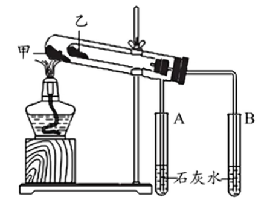

# 元素与化合物

## 钠

自然界中钠元素只以化合物的形式存在, 无游离态的单质, 因为其单质十分活泼. 钠属于碱金属, 易失去一个电子, 具有强还原性. 

常温下为银白色固态, 质软(可用刀切割), 熔点低, 密度小于水, 大于煤油以隔绝氧气与水, 可用煤油以及石蜡油保存. 

$I A$ 族金属元素均可使用石蜡油保存, 因为密度均大于石蜡油. 除 $Li$ 以外的碱金属可以用煤油保存, 因为 $Li$ 密度比煤油小, 会浮在表面. 

钠与氧气的反应: 
$$
4Na + O_2 \xlongequal{\quad} 2Na_2O\\
2Na + O_2 \xlongequal[\quad]{\triangle} Na_2O_2
$$
$Na_2O$ 为白色物质(刚切开的钠与氧气反应失去金属光泽变暗), $Na_2O_2$ 为淡黄色物质, 硫单质($S$), 溴化银沉淀($AgBr$)也是淡黄色. 过氧根为 $O_2^{2-}$ . 

$Na$ 投入坩埚中加热, 先融化后燃烧, 发出黄色火焰, 燃烧为放热反应, 生成淡黄色 $Na_2O_2$ .

$Na$ 还可以再卤素单质中燃烧(燃烧反应不一定有氧气参与, 助燃剂即可). $2Na + X_2 \xlongequal[\quad]{\triangle} 2NaX, X = F, Cl, Br, I$ .

钠可以与水发生反应. $2Na + 2H_2O \xlongequal{\quad} 2NaOH + H_2\uparrow$ . 现象为 浮(密度比水小)熔(熔点低, 反应放热)游(产生气体)响(剧烈反应)红(加入酚酞生成碱性物质). 

钠与酸的反应更加剧烈; 与乙醇的反应弱于与水, 钠会沉在底部. 

与盐溶液先与水反应生成氢氧化钠后二次反应, 与熔融态盐可以正常反应.

注意钠等活泼金属引起的火灾不可用水或二氧化碳灭火器扑灭, 应用沙土. 像锂, 铝, 镁等金属可以在氮气, 二氧化碳中燃烧而无需氧气助燃. 

钠, 镁, 铝等金属元素的化合价仅有两种, 若此类金属单质形成化合物所失去的电子数与产物及比例无关, 一定可以直接计算, 消耗几摩尔金属即转移对应摩尔的电子. 

### 钠的氧化物

主要有氧化钠和过氧化钠. 二者通过 $2Na_2O + O_2 \xlongequal[\quad]{\triangle} 2Na_2O_2$ 转化. 

$Na_2O_2$ 可以作为供氧剂使用, 也可为消毒剂(强氧化性)或漂白剂(强氧化性漂白). 

|        |$Na_2O$   |$Na_2O_2$ |
|:------:|:--------:|:--------:|
|与 $H_2O$|$Na_2O + H_2O \xlongequal{\quad} 2Na^+ + 2OH^-$|$2Na_2O_2 + 2H_2O \xlongequal{\quad} 4Na^+ + 4OH^- + O_2\uparrow$|
|与 $CO_2$|$Na_2O + CO_2 \xlongequal{\quad} Na_2CO_3$|$2Na_2O_2 + 2CO_2 \xlongequal{\quad} 2Na_2CO_3 + O_2$|
|与 $H^+$ |$Na_2O + 2H^+ \xlongequal{\quad} 2Na^+ + H_2O$|$2Na_2O_2 + 4H^+ \xlongequal{\quad} 4Na^+ + 2H_2O + O_2\uparrow$|

常见的过氧化物有 $H_2O_2, Na_2O_2, K_2O_2, CH_3COOOH$ (过氧乙酸), $Na_2CO_3 \cdot H_2O_2$ (过碳酸钠) 等. 

漂白性的原理: 

|物理变化|化学变化      |<         |
|:--:|:--------:|:--------:|
|吸附漂白|氧化漂白(加热后不恢复颜色)|化合漂白(加热后恢复颜色)|
|活性炭等|$O_3$(臭氧), $HClO, H_2O_2, Na_2O_2$ 等|$SO_2$ 等  |

### 钠盐

向 $Na_2CO_3$ 溶液中滴加酸, 先 $CO_3^{2-} +H^+ \xlongequal{\quad} HCO_3^-$, 再 $HCO_3^- + H^+ \xlongequal{\quad} CO_2\uparrow + H_2O$ . 

$Na_2CO_3$ 又称纯碱或苏打, 可以用作清洁油污; $NaHCO_3$ 又称小苏打; $Na_2S_2O_3$ 硫代硫酸钠, 又称海波或大苏打. 小苏打对比苏打之所以成为 "小" 是因为: 
1. 式量(相对分子质量)小
2. 溶解度小(故侯氏制碱法用小苏打先析出)
3. 热稳定性差(受热分解)
4. 溶液碱性低

套管实验如图. 注意甲处放热稳定性好的 $Na_2CO_3$, 乙处放 $NaHCO_3$ 才能验证热稳定性差异.(因为甲处温度高) 考试时注意两物质的放置. 

侯氏制碱法: 注意先通入溶解度大的氨气在通入二氧化碳. 导管口在溶液面上方的是通入氨气的导管(为防倒吸). 还有碳酸氢钠析出, 不可拆. 

## 焰色试验

金属及其化合物在灼烧时火焰呈其特征颜色的物理过程, 涉及到电子跃迁.  

焰色试验首先要用盐酸(利于杂质被气化除去)清洗光洁无锈的铁丝或铂丝(无可见光焰色)作为蘸取待测液的载体; 灼烧铁丝或铂丝至无焰色(盐酸易气化除尽); 蘸取少量待测液; 灼烧, 观察钾元素的焰色时要通过蓝色钴玻璃滤光(滤掉钠元素发出的黄光, 放置掩盖微弱紫光). 

注意玻璃杯不可用, 其中含钠元素干扰. 

|金属元素|锂  |锶  |钙  |钠  |钡  |铜  |钾  |铷  |
|:--:|:-:|:-:|:-:|:-:|:-:|:-:|:-:|:-:|
|焰色  |紫红色|洋红色|砖红色|黄色 |黄绿色(绿色)|绿色 |紫色 |紫色 |

主要记忆钠(黄色), 铜(绿色, 记忆: 铜绿), 钾(紫色), 锂(紫红色), 钡(黄绿色(绿色), 记忆: 钡绿了). 

注意显特征焰色不一定没有其他杂质, 可能被掩盖. 

## 氯

氯元素在自然界中以化合物的形式存在, 其游离态单质 $Cl_2$ 具有强氧化性故在自然界中不存在. 

$Cl_2$ 在常温常压下是是黄绿色有刺激性气味的有毒气体. 易被液化储存在钢瓶(常温不反应)中, 可溶于水, 密度大于空气($M_{空气} \approx 28.8 g/mol$).  

$Cl_2$ 与金属单质反应, 因为氯气有强氧化性, 可以直接将物质氧化到最高价态(不论金属单质少量还是过量): 
1. $Na$ 在氯气中剧烈燃烧, 释放大量热, 生成白烟: $2Na + Cl_2 \xlongequal[\quad]{\triangle} 2NaCl$. 
2. $Fe$ 在氯气中剧烈燃烧, 释放大量热, 生成棕褐色烟: $2Fe + 3Cl_2 \xlongequal[\quad]{\triangle} 2FeCl_3$. 
3. $Cu$ 在氯气中剧烈燃烧, 释放大量热, 生成棕黄色烟: $Cu + Cl_2 \xlongequal[\quad]{\triangle} CuCl_2$.

$Cl_2$ 与非金属单质反应: 
1. $H_2$ 在氯气中安静地燃烧, 发出苍白色火焰, 集气瓶口有白雾: $H_2 +Cl_2 \xlongequal[\quad]{\triangle} 2HCl$.
2. $P$ 在氯气中燃烧, 释放大量热, 生成白色烟和雾: $2P + 3Cl_2 \xlongequal[\quad]{\triangle} 2PCl_3(l), PCl_3 + Cl_2 \xrightleftharpoons{\quad} PCl_5(s)$ .

$Cl_2$ 与水的反应制备新制氯水(歧化, 可逆反应):
$$Cl_2 + H_2O \xrightleftharpoons{\quad} H^+ + Cl^- + HClO$$

由于此反应为可逆反应, 且反应程度很小, 故新制氯水中多为氯气而非盐酸与次氯酸(故氯水呈现浅黄绿色). 注意氯水不是液氯, 液氯为氯单质. 新制氯水放置一段时间会因为次氯酸光照分解而变质为盐酸: 
$$2HClO \xlongequal[\quad]{光照} 2HCl + O_2\uparrow$$

由于平衡移动, 次氯酸减少也会导致溶于水的氯气减少, 故久置氯水可以认为是稀盐酸. 

次氯酸有漂白性, 但氯单质没有. 氯气溶于水形成新制氯水有漂白性, 变为久置氯水后失去漂白性. 次氯酸使用酸碱指示剂时, 以石蕊试液为例, 会先变红后被漂白迅速褪色. 

酸性: $CH_3COOH > H_2CO_3 > HClO$. 

氯气与碱反应可以制取漂白液和漂白粉. 

$$Cl_2 + 2NaOH \xlongequal{\quad} NaCl + NaClO + H_2O\\
2Cl_2 + 2Ca(OH)_2 \xlongequal{\quad} CaCl_2 + Ca(ClO)_2 + 2H_2O$$

注意制取漂白粉要使用石灰乳(饱和含量大), 故离子方程式不可拆. 

以上反应不能加热进行(碱液需要用冷的), 会进行其他反应, 如: $3Cl_2 + 6NaOH \xlongequal[\quad]{\triangle} 5NaCl + NaClO_3 + 3H_2O$ . 

$NaClO$ 为漂白液($84$ 消毒液)的有效成分, $Ca(ClO)_2$ 为漂白粉的有效成分, 通过转化为 $HClO$ 生效(制成盐溶液方便储存), 变质原理(生效原理): $NaClO + CO_2 + H_2O \xlongequal{\quad} NaHCO_3 + HClO, Ca(ClO)_2 + CO_2 + H_2O \xlongequal{\quad} CaCO_3\downarrow + 2HClO, 2HClO \xlongequal[\quad]{光照} 2HCl + O_2\uparrow$ .

注意 $84$ 消毒液不可与洁厕灵($HCl$)混用: $ClO^- + Cl^- + 2H^+ \xlongequal{\quad} Cl_2\uparrow +H_2O$ .

氯气是强氧化剂, 如: 
$$
Cl_2 + H_2S \xlongequal{\quad} S\downarrow + 2HCl\\
Cl_2 + SO_2 +2H_2O \xlongequal{\quad} 2HCl + H_2SO_4
$$
(注意硫的不同价态的对应产物: $S^{2-} \to S, SO_2 \to SO_4^{2-}$, 一般不跳跃逐级上升).

氨与氯气的反应生成白烟(白色固体颗粒 $NH_4Cl$ ), 可以检查运输液氯的管道是否漏气: 
$$8NH_3 + 3Cl_2 \xlongequal{\quad} N_2 +6NH_4Cl$$

氯的单质与化合物可以对自来水消毒(强氧化性令蛋白质变性失活), 除了上文提及的强氧化性物质以外, 还有 $ClO_2$ 等. (当然 $O_3, K_2FeO_4$ (高铁酸钾)也可) . 但明矾( $KAl(SO_4)_2 \cdot 12H_2O$ )是净水剂而非消毒剂, 铝离子与水反应生成的 $Al(OH)_3$ 胶体只聚沉杂质, 无杀菌作用. 

氯气的尾气处理可以使用氢氧化钠溶液或碱石灰. 

氯气的实验室制法(工业上使用氯碱工业制取): 
$$MnO_2 + 4HCl(浓) \xlongequal[\quad]{\triangle} MnCl_2 + Cl_2\uparrow + 2H_2O$$

这个反应必须在加热条件下与浓盐酸反应才可以制得氯气, 不浓不行不加热不行. 随着反应的进行, 浓盐酸逐渐变为稀盐酸, 反应会逐渐停止. 由于浓盐酸具有挥发性, 故制取氯气后要先除去氯化氢杂质(和水蒸气). 一般使用饱和食盐水除去氯化氢气体. 氯化氢极易溶于水, 故需要溶液洗气; 氯气也与水发生可逆反应, 故要增大溶液中氯离子浓度来控制平衡移动减小反应程度, 抑制氯气与水反应, 从而降低氯气溶于水的损失. 用中性或酸性干燥剂(如浓硫酸)除水蒸汽(防止碱性干燥剂与氯气反应).

当然也可用高锰酸钾与浓盐酸制取氯气, 此反应无需加热(高锰酸钾氧化性更强): 
$$2KMnO_4 + 16HCl(浓) \xlongequal{\quad} 2KCl + 2MnCl_2 + 5Cl_2\uparrow + 8H_2O$$

所有除杂环节一定是: 除杂后除水. 因为洗气瓶中的液体会使气体再度含有水蒸气. 使用集气瓶收集氯气验满可以使用湿润的淀粉碘化钾试纸靠近瓶口, 若变蓝则收集完成. 

$\{物理静电屏蔽, 数学极点极线和【【初高衔接】根的分布问题——高中没细讲，初中没学过】 https://www.bilibili.com/video/BV1fX4y1L7ih/?share_source=copy_web&vd_source=52aa8bd45c28e534d02e312968f55355}$