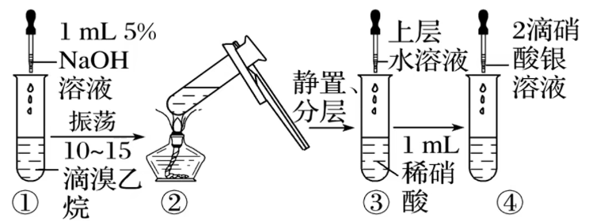
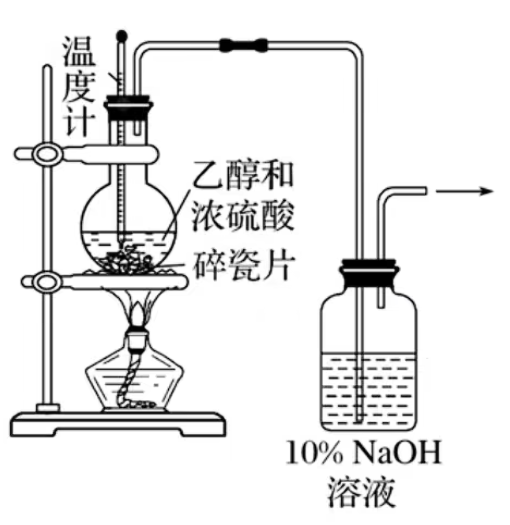

# 有机化学

## 必修部分

有机化合物(有机物)为绝大多数含碳化合物, 除 $CO, CO_2$ , 碳酸(氢)盐, $SCN^-, CN^-$ 等外. 烃为仅含碳氢的有机化合物. 烷烃为饱和烃, 碳原子间以单键(双键三键是不饱和键)结合. 烷烃有链状烷烃与环烷烃.

分子式形如 $C_6H_{12}O_6$ , 直接由离子或原子构成的物质如 $NaCl, Fe$ 等不是分子式. 最简式(实验式)为最简整数比, 如 $NacCl, SiO_2, CH_2O$ . 电子式直接表示原子的价电子. 结构式用 $-$ 代替一对共用电子对, 有机物中常见的共价键数目为 $C(4), H(1), O(2), N(3)$ . 结构简式为省略 $C - H, O - H$ 等键的式子, 更多时候可以选择性保留 $C - C$ 等键以表示碳骨架. 键线式体现键角等结构, 省略氢原子, 端点若无标注则为碳原子, 省略的氢原子十分容易忽略一定注意. 球棍模型要体现原子的相对大小与空间分布, 判断时要注意, 空间填充模型同理, 均为分子空间结构模型.

碳链可以是直链, 也可有支链, 当然也可能有碳环(或包含其他元素的杂环), 其中五元环与六元环比较稳定.

$\Omega$ 为不饱和度, $\Omega = 0$ 时为链状烷烃($C_nH_{2n + 2}$), 每一个不饱和度就要少两个氢, 常见计入不饱和度的有双键($1$), 三键($2$), 环($1$), 苯环($4$), 卤素($0$, 与氢等效), $O$ ($0$) , $-NO_2$ ($1$).

链状烷烃通式为 $C_nH_{2n + 2}, \Omega = 0$ , 环烷烃通式与烯烃一致为 $C_nH_{2n}, \Omega = 1$ . 烷烃的习惯命名法如下:

1. 使用十天干(甲乙丙丁戊己庚辛壬癸)或数字命名, 如丁烷, 十二烷等.
2. 使用正, 异, 新等区分碳架异构.

甲烷为正四面体形, 键长键能键角相同, 键角为 $109^\circ 28'$ , 四个氢等效, 用二氯代物只有一种而非两种即可验证非平面正方形. 直链烷烃实际上由于键角问题是折线型, 因此键线式需要体现.

大多数有机物熔沸点低, 难溶于极性溶剂水, 易溶于(低)非极性有机溶剂(相似相溶). 密度小于水(是烃则轻), 可分层. 碳原子数越多, $M$ 越大, 范德华力越强, 熔沸点越高. 支链越多, 分子间距增大, 分子间作用力减小, 熔沸点降低. 标况下甲乙丙丁烷烃为气态, 十七烷及以上为固态, 其余为液态.

有机物易燃(所以大多有机物都可发生燃烧的氧化反应), 受热易分解. 有机反应有较多副反应, 使用 $\xrightarrow{\quad}$ 连接. 有机反应对条件要求高, 一般需要 $\triangle, h\nu$ (光照), 催化剂等.

由于同分异构的存在, 分子式确定的物质不能保证是纯净物.

烷烃比较稳定, 不被高锰酸钾氧化, 可燃烧氧化(作为石油与天然气的主要成分). 有机化学中得氧失氢为氧化, 得氢失氧为还原. 高温下会分解为碳数较少的烷烃与烯烃, 或如 $CH_4 \xrightarrow[\quad]{高温} C + 2H_2$ 制备焦炭与氢气. 光照下烷烃会与卤素单质发生取代反应, 此反应分步进行, 产物往往同时存在多种, 如 $CHCl_3$ (氯仿, 有机溶剂). 标况下 $CH_3Cl$ 为气态, 从 $CH_2Cl_2$ 开始为液态, 密度大于水(氯原子重量大).

## 选修部分

有机需要用拼插积木的角度看待, 一条共价键实际上就是两个单电子(共用电子对), 基团上的半条键为一个单电子, 在很多时候断键与成键十分灵活, 如消去反应脱去小分子后剩余的两个半条键相互拼起组成了新的 $\pi$ 键等, 下文会进一步讲解此能力.

大部分有机物可燃, 会发生燃烧这一剧烈氧化反应断掉所有的键, 故下文不再赘述过多, 此处统一提醒题目询问此物质是否可发生氧化反应不要忘记燃烧.

有机物中原子的化合价需要逐条考察其共价键, 如 $CH_3CH_2OH$ 中的 $\beta - $ 碳, 一条 $C - C$ 键由于电负性相同, 对化合价贡献为 $0$ ; 一条 $C - O$ 键由于氧电负性较大故对 $C$ 的化合价贡献为 $+1$ , 对 $O$ 贡献为 $-1$ ; 两条 $C - H$ 键由于碳电负性较小, 故单条键对 $C$ 的贡献为 $-1$ , 对 $H$ 为 $+1$, 两条均如此, 故 $\beta - $ 碳化合价为 $0 + 1 - 1 - 1 = -1$ 价. 若有双键则也需要分开看, 单根键贡献为 $1$ 则双键可一次性贡献 $2$ , 三键同理贡献 $3$ . 实际上无机物若已知结构式也可如此分析, 但要注意配位键两个电子归属于同一原子(供体), 故可以直接忽略此键(因为此方法我们将所有键都视为离子键, 共用电子对完全偏移, 配位键提供的电子对回到供体, 相当于无此键). 特别注意若整体带电性为离子, 需要先找到外界电荷的归属原子并计入其化合价, 如 $[Co(NH_3)_5Cl]^{2+}$ , 配体有 $NH_3$ 与 $Cl^-$ , 故 $+2$ 的正电荷分配给 $Cl$ 一个负电荷, 还剩 $+3$ 正电荷, 又因 $NH_3$ 为电中性, 故可知剩余的 $+3$ 正电荷应分配给 $Co$ ; 继续考察 $Co$ 的化学键, 注意到其六条键均为共价键, 故综上化合价为 $+3 + 0 = +3$ 价.

烷基( $-C_nH_{2n + 1}$ )同分异构数目:

|     名称     | 甲基 | 乙基 | 丙基 | 丁基 | 戊基 | 己基 |
| :----------: | :--: | :--: | :--: | :--: | :--: | :--: |
| 同分异构种数 | $1$  | $1$  | $2$  | $4$  | $8$  | $17$ |

卤素的存在形式多样, 其用途也不完全相同, 以溴为例.

|           存在形式            |              用途              |
| :---------------------------: | :----------------------------: |
|       溴水 $Br_2/H_2O$        | 加成, 取代, 氧化(利用 $HBrO$ ) |
|      液溴或溴蒸气 $Br_2$      |        取代, 加成, 萃取        |
| 溴的四氯化碳溶液 $Br_2/CCl_4$ |           加成, 萃取           |

### 命名

系统命名法中若位置确定(如氯乙烯而非 $1 - $ 氯乙烯, 以及羧基必为 $1$ 号时不写 $1 - $ ) .

### 芳香烃

若取代基无同分异构, 苯环上若存在一个取代基则同分异构仅 $1$ 种(等效) , 若两个取代基则有邻间对 $3$ 中, 若三个取代基则需要分类讨论:

|  取代基类型  | $AAA$ 型 | $AAB$ 型 | $ABC$ 型 |
| :----------: | :------: | :------: | :------: |
| 同分异构种类 |  $3$ 种  |  $6$ 种  | $10$ 种  |

若超过 $4$ 个取代基则一般可以将 $H$ 看做取代基从而转化为少于三个(否则题目复杂度过高).

### 卤代烃

卤代烃是将烷烃转化为醇类或烯类物质的桥梁, 烃分子中氢元素被卤素原子取代后生成的化合物即为卤代烃(烷烃不活泼, 光照卤代为少数可发生的反应), 官能团为碳卤键( $C - X, X = F, Cl, Br, I, \dots$ ).

卤代烃一般使用系统命名法, 将卤素原子作为取代基. 常见卤代烃有 $CH_2=CHCl$ (氯乙烯, 聚氯乙烯塑料的单体) , $CF_2=CF_2$ (四氟乙烯, 其聚合物又称特氟龙, 可用于不粘锅图层或酸碱通用滴定管)等.

常温下卤代烃除 $CH_3Cl, CH_3CH_2Cl, CH_2=CHCl$ 等少数为气体外, 大多数为液体或固体. 卤代烃不溶于水, 可溶于有机溶剂, 且一般分层时卤代烃由于卤素相对分子质量较大而位于下层(但脂肪烃的一氟或一氯代物密度小于水), 且其密度随碳原子增加而减小(卤素所占比例下降). 卤代烃可作为有机溶剂, 如 $CCl_4, CHCl_3$ (氯仿)等. 卤代烃熔沸点大于其对应的烃, 因为相对分子质量大, 范德华力大.

碳卤键 $C - X$ 中由于 $X$ 电负性普遍较大, 故会形成极性较强的共价键 $C^{\delta+} - X^{\delta-}$ . 且因部分 $X$ 的半径较大导致部分 $C - X$ 键长长, 键能小. 综上两点 $C - X$ 较活泼易断裂, 使得 $X$ 被取代.

#### 水解反应

水解反应实际上就是取代反应的一种, 将 $NaOH$ 溶液滴入 $CH_3CH_2Br$ , 静置分层后去上清液并滴入硝酸酸化的硝酸银(不酸化则 $OH^-$ 与 $Ag^+$ 反应生成 $AgOH$ 与其分解产物 $Ag_2O$ 沉淀, 干扰实验现象)溶液以检验 $Br^-$ , 发现出现淡黄色 $AgBr$ 沉淀, 证明反应产生 $Br^-$ 以及溴乙烷中存在溴元素(有机物中 $C - X, X$ 不电离). 氯代烃, 碘代烃等同理, 通过 $AgCl$ (白色), $AgI$ (黄色)沉淀验证. 反应条件为 $NaOH$ 水溶液, 加热, 总反应方程式为:

$$CH_3CH_2Br + NaOH \xrightarrow[\triangle]{H_2O} CH_3CH_2OH + NaBr$$

可以发现反应为羟基取代溴原子的过程, 但实质上是水 $H - OH$ 中的羟基与溴乙烷发生取代, 随后生成的 $HBr$ 与氢氧化钠发生反应生成盐. 可以发现加入氢氧化钠可以及时清理产物 $HBr$ 以拉动反应正向进行.

可以发现水解反应可以将卤代烃转化为醇类物质, 即下 $- X$ 而上 $- OH$ .

#### 消去反应

消去反应是有机物脱去小分子(如 $H_2O, HX$ 等)而产生含不饱和键的化合物的反应.

如 $CH_3CH_2Br + NaOH \xrightarrow[\triangle]{CH_3CH_2OH} CH_2 = CH_2 \uparrow + NaBr + H_2O$ 就为消去反应, 反应条件为 $NaOH$ (醇溶液) , 加热.

可以验证反应产物是否含有不饱和键, 一溴丁烷反应过后烯烃气体中混杂挥发的乙醇, 故需要先使用水洗气溶解乙醇才可通入酸性 $KMnO_4$ 溶液检验双键, 防止乙醇被氧化干扰实验.

{ width=300px }

注意卤代烃消去存在条件, 即需要含两个碳以上, 且 $\beta - $ 碳原子上必须有 $H$ 存在才可消去(官能团旁的碳原子为 $\alpha - $ 碳, $\alpha - $ 碳相邻的碳为 $\beta - $ 碳). 由于苯环的特殊结构, 直接连接在苯环上的卤素原子不可消去.

若有多个符合条件的 $\beta - $ 碳, 则可能有多种消去产物. 当然若合理消去反应也可形成三键.

注意消去反应需要醇溶液, 与上文水解反应的水溶液区分(水解一定需要水, 故需水溶液), 可以用"前醇后不醇"记忆, 即反应前加入醇类则反应后一定不生成醇类.

可以发现消去反应可以两侧各下一个原子(团)而上不饱和键. 且有以下路径: $C_2H_5 - OH, C_2H_5 - X \xrightleftarrows[加成]{消去} CH_2 = CH_2$ .

### 醇

醇类的官能团为醇 $- OH$ , 注意羟基若连接在苯环上则为酚羟基, 此物质为酚类而非醇类, 详见下文.

甲醇又称木精, 为无色, 具有挥发性的液体, 易溶于水(存在羟基与水形成氢键), 有毒, 误服会损伤视神经致失明, 常用于化工生成与汽车燃料. 当然, 假酒就是指将酒精乙醇替换为甲醇.

乙二醇与丙三醇均为无色粘稠, 具有甜味的液体, 易溶于水与乙醇, 为化工原料, 其中乙二醇为汽车发动机防冻液主要成分, 也是涤纶等高分子化合物的重要原料; 丙三醇具有极强的吸水能力, 可用于制造日用化妆用品(具有三个羟基, 与水形成三条氢键, 可锁住水分子阻止水分逸散到大气中).

由于氢键的影响, 醇的熔沸点远高于对应烃的熔沸点, 且氢键数目越多熔沸点就越高. 醇的密度比水小. 醇在水中的溶解度随碳链增长而减小, 因为羟基所占的比例逐渐减小, 羟基越多溶解度越大, 故甲醇, 乙醇, 丙醇, 乙二醇, 丙三醇等低级醇可与水任意比例互溶.

由于氧的电负性较强, $C - O - H$ 中的两条键均易断裂.

#### 置换反应

置换反应体现 $O - H$ 的活泼性.

无水乙醇可与 $Na$ 反应生成乙醇钠 $C_2H_5ONa$ 与氢气, 类似的还有甲醇锂, 乙醇钙等. 反应时, 钠沉在无水乙醇底部(反应较水不剧烈, 因为烷基为推电子基(注意仅限碳 $sp^3$ 杂化, $sp, sp^2$ 杂化的碳如双键, 三键, 苯环均为吸电子基), 极性降低), 表面有气泡产生, 固体慢慢消失, 加入酚酞后溶液变红(乙醇钠为强碱性物质). 乙醇钠在水中会剧烈水解, 方程式为 $CH_3CH_2ONa + H_2O \xrightarrow{\quad} CH_3CH_2OH + NaOH$ .

#### 取代反应

醇可以与较浓的氢卤酸 $HX$ 发生取代反应, 如 $CH_3CH_2OH + HBr \xrightarrow[\quad]{\triangle} CH_3CH_2Br + H_2O$ . 此取代反应体现 $C - O$ 的活泼性.

醇还可与酸(羧基)发生酯化反应(取代反应的一种), 符合"酸脱羟基醇脱氢"的规律(可用同位素标记法, 标记醇中的 $^{18}O$ , 测生成水的相对分子质量即可, 注意由于可逆反应, 部分 $^{18}O$ 仍然在醇中). 注意条件为 $\xrightleftharpoons[\triangle]{浓 H_2SO_4}$ , 生成酯. 酯的命名根据酸和醇命名, 如甲酸与乙醇生成甲酸乙酯, 可知 $A$ 酸与 $B$ 醇生成 $A$ 酸 $B$ 酯. 注意所有有机反应不要忘记小分子, 建议生成物先写小分子.

醇还可分子间脱水(两个醇一个脱羟基一个脱氢, 相互取代), 反应为 $2C_2H_5OH \xrightarrow[140\celsius]{浓 H_2SO_4} C_2H_5 - O - C_2H_5 + H_2O$ . 注意温度需要严格控制, 否则会有其他产物(详见下文). $- O -$ 为醚键(注意与过氧基 $- O - O -$ 区分, 过氧基具有强氧化性与受热/光照易分解的特性而醚类物质无), $C_2H_5OC_2H_5$ 为二乙基醚, 又称二乙醚或乙醚, 故乙醚中有四个碳, 类似地还有甲基乙基醚(甲乙醚), 甲基异丙基醚(分别写出左右的取代基即可命名)等. 乙醚无色易挥发, 微溶于水, 有特殊气味, 有麻醉作用, 可作为有机溶剂.

#### 消去反应

硫酸酒精三比一, 温度迅速一百七即描述了乙醇的消去反应(分子内脱水)过程. 需要注意需要酸入醇防迸溅, 冷却后再倒入反应装置并加入碎瓷片防止暴沸. 碎瓷片(或沸石)防暴沸实际上为物理效果, 碎瓷片含有许多微小气孔, 其中储存的气体在受热后会膨胀, 冒出气泡, 从而减缓反应速率, 实际上毛细管也有同样作用. 随后温度需要迅速生至 $170\celsius$ 以免分子间脱水形成醚(生成的乙醚无法被后文氢氧化钠溶液除掉, 因为其微溶于水且不与碱反应, 只能蒸馏除掉, 故要尽量减少其生成). 故需要温度计直接插入溶液以测量温度而非在液面以上. 随后需要将产生的气体通入 $NaOH$ 溶液除杂(乙醇与后文提及的碳单质会被浓硫酸氧化生成 $CO_2$ 与 $SO_2$ , 其中 $SO_2$ 与挥发的乙醇会被高锰酸钾氧化, 干扰实验现象, 故需要通入氢氧化钠水溶液除 $CO_2, SO_2$ 与挥发的乙醇), 再分别通入酸性 $KMnO_4$ 与 $Br_2(CCl_4)$ 中, 发现二者均褪色, 证明有不饱和键生成(分别为乙烯被氧化与被加成); 反应装置中有黑色固体生成(浓硫酸将乙醇脱水炭化生成碳单质(炭黑)).

{ width=300px }

其反应方程式为:

$$C_2H_5OH \xrightarrow[170\celsius]{浓 H_2SO_4} CH_2 = CH_2\uparrow + H_2O$$

分子内脱水需要条件, 即羟基邻位上的碳需要有氢原子, 同上文卤代烃发生消去反应的条件.

要注意区分醇的分子内脱水(消去)与分子间脱水(取代)的温度区别, 因为他们反应物与催化剂一致.

可以发现很多有机反应(尤其有水生成)均需要浓硫酸作为催化剂, 因为其吸水性可以吸走生成的水, 拉动平衡正移. 脱水时浓硫酸亦可作为脱水剂催化反应.

#### 氧化反应

乙醇燃烧为剧烈氧化反应, 其火焰呈淡蓝色, 放出大量热.

乙醇可以催化氧化为乙醛再被氧化为乙酸(连续氧化), 或直接一步被强氧化剂氧化为乙酸.

连续氧化:

$$CH_3CH_2OH \xrightarrow[减少2H, 失去2e^-, 消耗\frac{1}{2} O_2, \alpha - 碳化合价升高2]{Cu/Ag 催化, O_2 氧化, \triangle} CH_3CHO \xrightarrow[增加1O, 失去2e^-, 消耗\frac{1}{2} O_2, 醛基碳化合价升高2]{Cu催化, O_2氧化, \triangle或银氨溶液/新制氢氧化铜氧化, 水浴加热} CH_3COOH$$

或一步氧化(本质上就是分步连续氧化):

$$CH_3CH_2OH \xrightarrow[减少4H, 失去4e^-, 与官能团相连的碳化合价升高4]{(H^+) KMnO_4 或 (H^+) K_2Cr_2O_7} CH_3COOH$$

醇到醛的实验流程为:

$$铜丝(Cu + O_2) \xrightarrow{\triangle} 变黑(CuO) \xrightarrow{趁热插入乙醇溶液(\triangle)} 变红(Cu + CH_3CHO)$$

可以发现以上步骤中铜为催化剂, 故总方程式为 $2CH_3CH_2OH + O_2 \xrightarrow[\triangle]{Cu} 2CH_3CHO + 2H_2O$ . 实际上为乙醇脱两个 $H$ 并形成 $C = O$ 双键的过程.

而醛到酸总体上则是下一个 $-H$ 上一个 $-OH$ 的过程(或直接认为插入一个 $- O -$ ).

总结上文可得有机中氧化反应为去氢加氧, 而还原反应为加氧去氢.

可以发现醇催化氧化的条件为与 $-OH$ 相邻的 $C$ 上必须有 $H$ (即存在 $\alpha - $ 氢), 与消去不同. 但实际上醇催化氧化不只可以生成醛, 还可生成酮(管能团为酮羰基 $- CO -$ , 碳氧双键), 若羟基在碳链中部而非两端, 且无法继续氧化成酸. 综上, 可知: 若有 $2$ 个 $\alpha - $ 氢, 则可氧化成酮再到酸; 若有 $1$ 个 $\alpha - $ 氢, 则可氧化成酮, 不可继续氧化为酸; 若无 $\alpha - $ 氢则无法催化氧化.

对于一步氧化同理(因为本质相同), 若有 $2$ 个 $\alpha - $ 氢则可直接一步氧化为酸, 否则无法成为对应的酸.

可以以此为原理查酒驾: $K_2Cr_2O_7(六价铬, 橙红色) + C_2H_5OH + H_2SO_4 \xrightarrow{\quad} Cr_2(SO_4)_3(三价铬, 绿色) + CH_3COOH + K_2SO_4 + H_2O$ , 变色即酒驾.

符合 $C_nH_{2n}O$ 通式的可能是饱和一元醇或醚(实际上是将 $- O -$ 塞入任意两个原子间), 故需要考虑碳链异构和官能团异构. 考虑分碳法, 以 $C_4H_{10}O$ 为例, $R_1 - O - R_2$ , 若 $R_1$ 分得 $4$ 则 $R_2$ 分得 $0$ , 若 $R_1$ 分得 $3$ 则 $R_2$ 分得 $1$ , 若 $R_3$ 分得 $2$ 则 $R_2$ 分得 $2$ , 此后无需继续分, 因为 $R_1$ 和 $R_2$ 对称等效, 继续则会重复. 分完碳之后对每个分法计算左右 $R$ 基的同分异构数目相乘再相加每种分法即可, 烷基同分异构上文曾给出. 实际上, 酯基与羧基, 酮羰基与醛基, 甚至苯环(苯环上仅限有两个取代基)也均可使用分碳法, 但要注意可分配的碳数需要减去预留在中间的, 以及 $-COO-$ 的结构可以旋转, 故不要漏想, 在上述步骤后需要乘 $2$ ; 苯环则需要额外考虑两个取代基的邻间对位置故应乘 $3$ . 当然也可从另一角度, 考虑 $- O -$ 或 $-CO-$ 或 $-COO-$ 或苯环插入已经按不同同分异构排好的碳链(酯基和羧基情况需要乘 $2$ 以旋转 $-COO-$ ; 苯环需要乘 $3$ 考虑邻间对), 在不同情境下可能便利度不同.

故由此可知分子式差 $CH_2$ 不一定为同系物, 因其官能团可能异构, 但如 $C_3H_7OH, C_4H_9OH$ 等互为同系物是正确的, 因其表示出其官能团.

注意羟基不能直接接在双键碳上(酚羟基接在苯环上, 苯环中为大 $\pi$ 键而非双键), 会发生异构化, 将 $C=C-OH$ 重排为 $C-C=O$ , 即转化为醛或酮, 因为 $C=O$ 比 $C=C$ 更稳定, 而分子趋稳.

### 酚

羟基与苯环直接相连为酚, 官能团为酚羟基. 一般使用 $-Ph$ 代表苯基(不是官能团, 为取代基), $-Ar$ 代表芳基, 为芳香族化合物去掉一个氢原子后的取代基, 同样不为官能团. 注意 $Ph-CH_2OH$ 为醇而非酚.

最简单的酚类物质为苯酚, 即 $Ph-OH$ . 苯环蕴藏 $12$ 个共面原子, 由于 $-OH$ 中 $O$ 为 $sp^3$ 杂化, 故 $C - O$ 与 $O - H$ 成一定角度, 故 $H$ 可能旋转进入平面, 故苯酚至多 $13$ 原子共平面. 但共线仅有苯环蕴藏的 $4$ 个共线原子, 因为 $O$ 为 $sp^3$ 杂化, 羟基上 $H$ 无法旋转进入.

苯酚为无色晶体, 具有特殊气味, 易溶于有机溶剂, 微溶于水(即便有氢键, 苯环大大减弱了羟基所占比例), 但温度高于 $65\celsius$ 后可与水混溶(任意比例互溶).

苯酚有毒, 对皮肤有腐蚀性, 若沾到皮肤则需用酒精冲洗(苯酚仅微溶于水)再用水冲洗. 放置较久的苯酚往往为粉红色(变为苯醌, 其为(粉)红色), 因为部分苯酚被空气中氧气氧化所致, 故可知苯酚具有还原性.

#### 酸性

由于苯环为吸电子基, 导致 $O - H$ 极性增大, 导致 $H$ 更为活泼(甚至可在水中部分电离显弱酸性, 故其又称石炭酸), 从而与醇羟基性质产生差异.

苯酚的酸性介于 $H_2CO_3$ 与 $HCO_3^-$ 间, 酸性较小, 故其水溶液不能使酸碱指示剂变色. 若加入氢氧化钠发生中和反应则可制得钠盐 $Ph-ONa$ , 其易溶于水. 故向苯酚的浑浊水溶液中加入碱则浑浊消失变澄清, 可若再次加入强酸, 则由于强酸制弱酸再次生成苯酚, 故重新变浑浊. 由此可知若想除去苯酚中的苯, 只需先加 $NaOH$ 溶液, 苯酚变为盐进入水层, 苯与水分层, 分液后向水层加入盐酸即可恢复苯酚.

若向苯酚钠中通入 $CO_2$ 则相当于碳酸(较强)制苯酚(较弱), 但需注意反应只能进行到 $HCO_3^-$ (不论二氧化碳少量还是过量), 因为碳酸氢根酸性弱于苯酚, 不能进一步强酸制弱酸. 这与次氯酸一致, 因为二者酸性均在碳酸与碳酸氢根间. 不同地是, 羧基酸性强于碳酸, 故羧基与碳酸氢钠, 碳酸钠均可反应.

我们可以滴加饱和 $Na_2CO_3$ 与 $NaHCO_3$ 溶液验证苯酚酸性介于两酸之间. 向苯酚固体滴入碳酸钠后发现苯酚溶解(变为苯酚钠溶于水), 不产生气体( $CO_2$ ), 证明苯酚酸性强于碳酸氢根, 因为强酸制弱酸, 同时不产生气体证明苯酚酸性弱于碳酸; 若滴入碳酸氢钠则固体不溶解, 证明苯酚酸性弱于碳酸.

当然苯酚与醇羟基一致也可与 $Na$ 反应生成苯酚钠和氢气.

要注意很多时候酯消耗一摩尔碱在碱性条件下水解, 若还回的羟基连在苯环上, 则不要忘记多消耗一摩尔碱以与酚羟基反应.

#### 取代反应

向苯酚稀溶液中逐滴加入过量饱和溴水, 发现产生白色沉淀(十分灵敏, 可用于苯酚定性检验或定量测定). 注意滴加顺序, 实际上产物难溶于水与溴水但易容与苯酚, 故若$\asdads$

酚羟基为邻对位定位基, 即酚羟基使苯环上邻对位氢原子更活泼, 易被取代. 如苯酚与浓溴水发生反应生成 $2, 4, 6 - $ 三溴苯酚白色沉淀以及溴化氢, 仅羟基间位上的氢被保留, 邻对位的氢被溴取代.

与苯的溴代进行对比, 苯酚反应物为浓溴水, 而苯使用液溴; 苯酚无需催化剂而苯使用 $FeBr_3$ ; 苯酚一次性取代 $3$ 个溴原子而苯酚仅 $1$ 个; 苯酚反应快, 灵敏而苯反应较慢. 综上可得苯酚的溴代比苯要容易, 因为酚羟基活化苯环.

实际上, 除了酚羟基, 还有烷基, $-NH_2$ , $-OCH_3$ (甲氧基)等为邻对位定位基; $-NO_2$ , $-CN$ , $-SO_3H$ (磺酸基) , $-CHO$ , $-COOH$ , $-COOR$ , $-CONH_2$ (酰胺基), $-COR$ (酰基)等为对位定位基.

#### 显色反应

向苯酚稀溶液中滴加 $FeCl_3$ 溶液, 溶液变为紫色, 由此可检验酚类的存在(特征反应, 类似银镜反应或新制氢氧化铜用于检测醛基, 都为特征反应). 方程式为 $6Ph-OH + Fe^{3+} \xrightarrow{\quad} [Fe(PhO)_6]^{3-} + 6H^+$ , 原理为生成了紫色的配合物(配合物旧称络合物).

#### 氧化反应

根据上文苯酚可被氧气氧化, 当然其也可被酸性高锰酸钾溶液等强氧化剂氧化, 使其褪色.

#### 加成反应

苯酚种苯环可被氢气加成生成环己醇, 条件为催化剂/加热, 实现有酚到醇的转化.

### 醛

醛的官能团为醛基 $-CHO$ . 自然界中许多植物香料的特殊香味来源于醛, 如肉桂中的肉桂醛, 杏仁中的苯甲醛(最简单的芳香醛, $Ph - CHO$ , 俗称苦杏仁油, 为苦杏仁气味的无色液体, 常用于制造染料香料及药物).

乙醛为无色, 有刺激性气味的液体, 密度比水小, 易挥发, 能与水与乙醇互溶(存在氢键 $C = O \cdots H  - O$ )

甲醛俗名蚁醛, 无色, 为有强烈刺激性气味的气体(注意是气态), 易溶于水, 其水溶液为福尔马林, 具有防腐与杀菌能力, 常用于消毒与浸制标本(不可用于保鲜海鲜), 制备农药与消毒剂, 用作香料染料, 制造酚醛树脂, 脲醛树脂, 维纶等. 甲醛分子 $HCHO$ 中有两个醛基, 共用同一个 $C = O$ . 故其可被氧化为 $HOCOOH$ , 即 $H_2CO_3$ 碳酸, 进一步变为 $CO_2 + H_2O$ . 若在碱性条件下被氧化则变为碳酸根 $CO_3^{2-}$ .

由于醛一定在碳链末端, 与羧基类似, 若其为主官能团则无需写 $1 - $ , 因为必定确定其在 $1$ 号碳上.

我们已经学习过醇的分步氧化, 实际上醛可以向两侧走, 即可被还原成醇, 也可被氧化成酸.

#### 加成反应

醛基可以催化加氢得到醇, 如 $CH_3CHO + H_2 \xrightarrow[\triangle]{催化剂} CH_3CH_2OH$ . 由于是加氢, 此反应也可看做为醛被还原成醇(且必为端醇, 即羟基在端碳上).

实际上, 酮羰基也可催化加氢得到醇(与上文区分, 此处不是端醇), 也可看做醇催化氧化生成酮的逆向过程. 在高中, 我们一般认为碳氧双键的催化加氢只有醛基与酮羰基能反应, 其余官能团如羧基, 酯基, 酰胺基等一般认为不可催化加氢.

由于碳氧电负性差值较大, 故 $C = O$ 被极性分子加成时, 带正电的原子(团)连接在 $O$ 上, 带负电的原子(团)连接在 $C$ 上, 如 $HCN$ 加成为 $2 -$ 羟基丙腈(腈为 $-CN$ 为主官能团的物质):

$$CH_3CHO + HCN \xrightarrow{\quad} CH_3CH(OH)CN$$

可以发现此反应可以增长碳链, 可能用于有机合成.

醛基的 $\alpha - $ 氢由于 $C = O$ 吸电子的影响具有一定的活泼性, 实际上, 不只醛基, 像酮羰基, 羧基, 酯基等含有 $C = O$ 结构的官能团均为吸电子基, 其 $\alpha - $ 氢具有一定活泼性, 更容易发生反应.

羟醛缩合反应就是一个体现, 其也是一种常用的增长碳链的方式. 发生羟醛缩合的前提为醛基必须含有 $\alpha - $ 氢, 因其本质就是醛中 $\alpha - $ 氢的加成另一个醛分子的 $C = O$ 的反应. $\alpha - $ 氢与碳链断键脱落下来, 由于氢带正电, 故加成到另一分子中 $C = O$ 中 $O$ 上形成 $-OH$ , 碳链则加成到同一 $C = O$ 中 $C$ 上从而延长碳链. 如 $2CH_3CHO \xrightarrow{催化剂} CH_3CH(OH)CH_2CHO$ ( $\beta - $ 羟基醛, 此物质不稳定易失水, 下一个醛基的 $\alpha - $ 氢与羟基变为水同时形成双键, 进一步反应得到 $\alpha, \beta - $ 不饱和醛) $\xrightarrow[\triangle]{催化剂} CH_3CH=CHCHO + H_2O$ .

#### 氧化反应

正如上文, 醛基可以被氧化成为酸, 此处介绍银镜反应与与新制氢氧化铜(斐林试剂)的反应.

银镜反应为银氨溶液与醛的反应, 银氨溶液( $[Ag(NH_3)_2]OH$ , 氢氧化二氨合银)的配置方法如下: 向洁净试管(后续银镜反应也在此发生, 不洁净无法形成光亮银镜, 即便可以反应)中加入 $AgNO_3$ 溶液, 边振荡边逐滴加入稀氨水, 试管中先生成 $AgOH$ 沉淀, 继续加入稀氨水至沉淀溶解即制备完成, 因为 $AgOH + 2NH_3 \cdot H_2O \xlongequal{\quad} [Ag(NH_3)_2]OH + 2H_2O$ 中生成的配合物可溶. $[Ag(NH_3)_2]^+$ (银氨络(合)离子)中 $Ag^+$ 具有弱氧化性, 故可氧化醛基.

向银氨溶液中滴入几滴乙醛(为得到光亮银镜不能滴多), 并在热水浴(受热均匀易得光亮银镜)中加热, 即可得到光亮的银镜. 反应方程为:

$$CH_3CHO + 2[Ag(NH_3)_2]OH \xrightarrow{\triangle} 2Ag\downarrow + CH_3COONH_4 + 3NH_3 + H_2O$$

生成物及其计量数可以记忆为"水银氨, $123$ , 再加 $1$ 个羧酸铵", 再反推反应物计量数即可. (一个醛基为 $123$ , 两个就为 $246$ , 以此类推, 但还是要结合实际检验一下)

此反应可用于检验醛基的存在并可确定其个数, 工业上可用于对玻璃涂银制镜和制保温瓶瓶胆. 制成的银镜可以用稀硝酸 $HNO_3$ 浸泡洗去.

新制氢氧化铜可以通过向装有过量 $NaOH$ (创设碱性环境)的试管里滴加几滴 $CuSO_4$ 溶液得到(蓝色絮状沉淀即为 $Cu(OH)_2$ , 弱氧化剂). 随后加入醛基并加热即可检验(注意生物学上斐林试剂要求水浴加热就足够, 但化学上新制氢氧化铜要求酒精灯明火加热, 且加热到沸腾才会有明显红色沉淀产生(但不能沸腾过久以免黑色沉淀 $CuO$ 生成), 因为反应物不同故条件不同), 可以发现生成砖红色沉淀氧化亚铜 $Cu_2O$ (铜为 $+1$ 价).

新制氢氧化铜与银氨溶液必须现配现用以免变质.

同银镜反应, 此反应生成盐而非酸, 因为碱性环境. 反应如下:

$$CH_3CHO + 2Cu(OH)_2 + NaOH \xrightarrow{\triangle} CH_3COONa + Cu_2O\downarrow + 3H_2O$$

同样地此反应也可用于检验醛基及其个数. 医学或生物学中葡萄糖(如尿糖检测)等还原糖(具有醛基的糖类)的检测即为此反应.

注意上述两反应可以检验醛基, 但不是醛类的特征反应, 因为甲酸( $HCOOH$ )既含有醛基又含有羧基(共用一个 $C = O$ ), 甲酸酯( $HCOOR$ )同理含有醛基与酯基.

当然, 醛也可被强氧化剂如高锰酸钾或重铬酸钾等反应. 由于溴水也有氧化性(其中的 $HBrO$ ), 故也可氧化醛基(高中阶段如此认为即可). 注意溴的四氯化碳溶液( $Br_2/CCl_4$ )不可氧化醛基, 因为其中无 $HBrO$ . 当然, 醛也可燃烧, 为氧化反应.

### 酮

丙酮为最简单的酮, 因为酮羰基两旁只能接碳原子. 丙酮为无色透明液体, 易挥发, 能与水和乙醇互溶.

由于酮不能被氧化剂进一步氧化, 故可区分其与醛. 与醛类似, 酮可以催化加氢, 也可与 $HCN$ 加成. 但可发生燃烧的氧化反应.

酮为重要的化工原料与有机溶剂, 可用于化学纤维, 乙炔等的溶剂, 还可用于生产有机玻璃, 农药及涂料等.

### 腈

### 酸

酸酐
