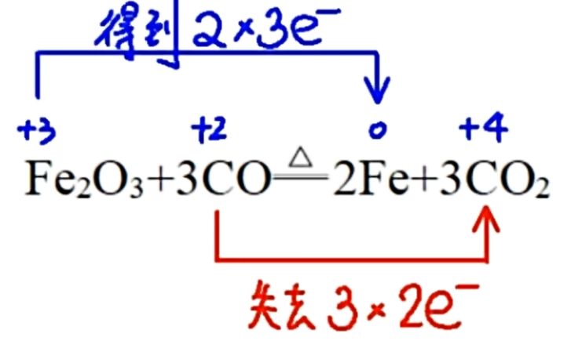
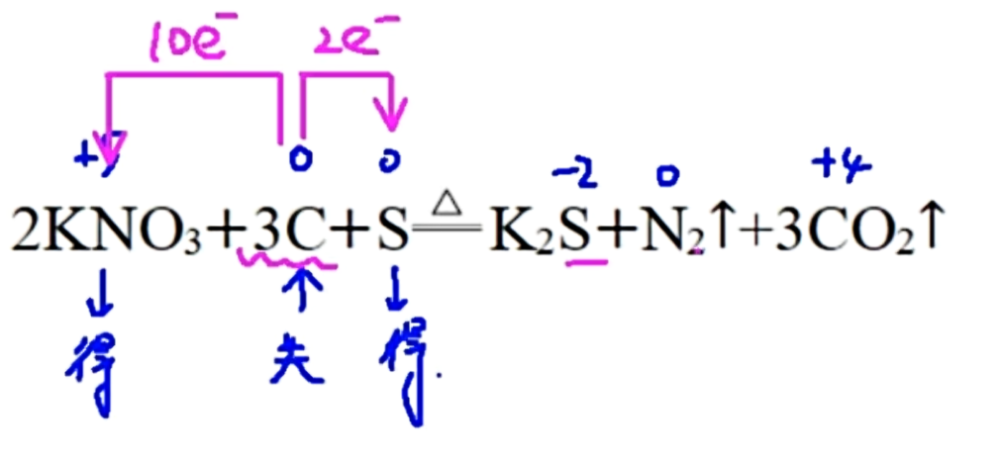

# 氧化还原

化合价: 单质化合价为零, 化合物化学式总化合价为零. 有些元素化合价十分典型需要记忆. 金属为正价; $H$ 与非金属元素组合一般为 $+1$ 价($SiH_4, B_2H_6$ 除外), 金属氢化物中显 $-1$ 价. $O$ 一般显 $-2$ 价, 过氧化物中显 $-1$ 价, 超氧化物为 $-\frac{1}{2}$, $OF_2$, $O_2F_2$ 显正价. $Cr$ 一般有 $+3$ 与 $+6$ 价; $Mn$ 有 $+2$ 与 $+7$ 价. $Ti$ 常见 $+4$, $V$ 常见 $+5$ . 

## 氧化还原反应

有化合价变化(即电子转移)的反应即氧化还原反应. 
口诀: 
$$升失氧还(还氧), 降得还氧(氧还)$$
电子转移与共用电子对的偏移是化合价变化的原因. 

歧化反应: 同一物质同一元素同一价态化合价既有升高又有降低是歧化反应的特征.  
归中反应: 同一元素的高低两种价态化合价向中间靠拢但不交叉是归中反应的特征. 

氧化剂: 得到电子的物质, 如 $Ag^+, Cu^{2+}, ClO^-, HNO_2$ 等.  
还原剂: 失去电子的物质, 如 $NaBH_4$ (氢为 $-1$ 价) 等.  
氧化产物: 还原剂失电子被氧化生成的产物, 不常见的有 $CO( O_2 少量或高温下 C 过量)$ .  
还原产物: 氧化剂得电子被还原生成的产物, 常见的有 $Mn^{2+}, Cr^{3+}, NO_2(浓硝酸), NO(稀硝酸)$ .  

氧化剂具有氧化性, 还原剂具有还原性. 氧化产物的氧化性弱于氧化剂, 还原产物的还原性弱于还原剂(通电/高温高压条件可能不适用). 还原性顺序: $S^{2-} > I^- > Fe^{2+} > Br^- > Cl^- > Mn^{2+}$ , 留点铁锈(长)绿毛; (单质的)氧化性顺序由离子的还原性顺序可知: $MnO_4^- > Cl_2 > Br_2 > Fe^{3+} > I_2 > S$ . 

题目问一个酸体现了什么性质, 若全部参与氧化还原则仅体现氧化性或还原性, 若不参与氧化还原则体现酸性, 若部分参加氧化还原则同时体现氧化性和酸性. 

### 双线桥与单线桥

### 氧化还原配平

灵活. 守恒, 正推, 逆推, 捆绑打包, 混合使用. 注意用什么离子调平电荷. 若酸性用氢离子, 碱性用氢氧根, 若题目没有说则看看各离子隐含条件, 或先用水配一般就能写出.