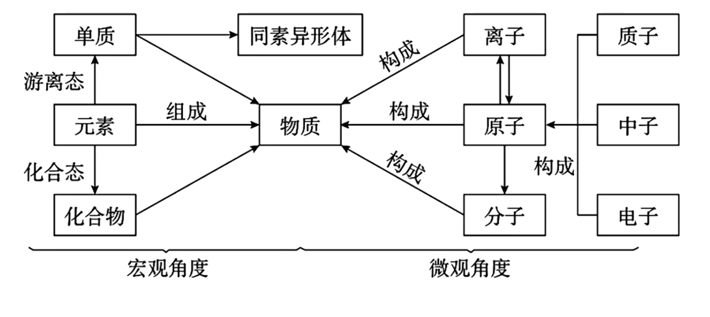
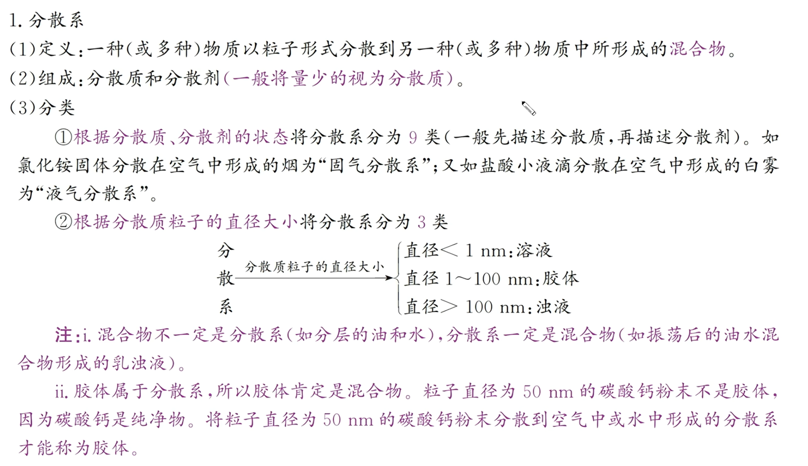

# 物质的分类及转化

{ width=300px }

同素异形体: 同种元素形成的不同单质, 如 $O_2, O_3$ , 他们不是同一种物质, 相互转化属于化学变化; 只含同种物质不一定是纯净物, 如氧气与臭氧的混合物. 

$$氧化物
\begin{cases}
成盐氧化物
\begin{cases}
酸性氧化物\\
碱性氧化物\\
两性氧化物
\end{cases}\\
不成盐氧化物: NO, NO_2, CO 等
\end{cases}$$

酸性氧化物由大多数非金属元素与氧元素组合(特例: $NO, NO_2, CO$ 是不成盐氧化物; $Mn_2O_7$ 也是酸性氧化物).  
碱性氧化物由大多数金属元素与氧元素组合(特例: $Mn_2O_7$ 为酸性氧化物; $Al_2O_3$ 为两性氧化物; $Na_2O_2$ 为过氧化物).  
两性氧化物: $Al_2O_3, ZnO, Ga_2O_3, BeO$ 等. ($SiO_2$ 尽管能与 $HF$ 反应, 但产物不是盐, 故其仅为酸性氧化物)  

## 分散系

{ width=300px }

胶体本质特征为分散质粒子直径为 $1$ ~ $100 nm$ , 溶液小于 $1nm$ , 浊液大于 $100nm$ . 

丁达尔效应: 光束通过胶体形成光的通路, 用于区别胶体和溶液. 

电泳: 通电时, 带电胶体粒子定向移动. 胶体本身不带电, 胶体粒子才可能带电(也可以不带电, 如淀粉胶粒). 可以用于电泳电镀, 静电除尘.

聚沉: 胶体分散质粒子聚集形成较大微粒形成沉淀析出. 可以通过加热, 搅拌, 加入电解质, 加入相反电荷胶体粒子的胶体(胶体粒子不沉淀的原因是具有相同电荷而排斥)可以诱发聚沉. 可以用于氯化铁止血, 石膏($CaSO_4$)点豆腐, 入海口三角洲形成, 明矾($KAl(SO_4)_2\cdot12H_2O$)净水, 墨水混用堵塞钢笔等. 注意向 $Fe(OH)_3$ 胶体中滴加稀硫酸, 会先聚沉后溶解. 

渗析: 利用半透膜分离溶液和胶体. 因为溶液分散质粒子直径小于半透膜孔径, 而胶体大于其. 可以用于血液透析, 淀粉葡萄糖分离. 注意无论是胶粒还是溶液分散质均可通过滤纸, 故不可用过滤分离. 

### 胶体的制备

将 $5$ ~ $6$ 滴 $FeCl_3$ 饱和溶液滴入 $40mL$ 煮沸蒸馏水(不能是碱性溶液以防直接沉淀)中, 继续煮沸(盐类水解平衡移动)至溶液呈红褐色, 停止加热(防止聚沉), 尽量不搅拌以防聚沉. 方程式为 $FeCl_3 + 3H_2O \xlongequal[\quad]{\triangle} Fe(OH)_3(胶体) + 3HCl$ . 

## 酸碱盐

### 酸

电离出的阳离子全都是 $H^+$ 的化合物. 以此可知 $NaHSO_4$ 不是酸. 酸可以分为含氧酸和无氧酸, 或按照可电离出的 $H^+$ 的个数分为一元酸, 二元酸, 多元酸. 注意分子式中有几个氢不代表就电离几个(仅有羟基上的氢可以电离), 如 $H_3PO_4, H_3PO_3, H_3PO_2$ 分别电离 $3, 2, 1$ 个氢离子. 也可以按照酸性强弱(能否完全电离)分为强酸和弱酸. 强酸需要记忆的有 $HCl, HBr, HI, H_2SO_4, HNO_3, HClO_4$ . 在高中阶段可以认为其他酸均非强酸. 

较强酸可以制较弱酸(存在例外, 如 $H_2S + CuSO_4 \xlongequal{\quad} CuS\downarrow + H_2SO_4$ ), 类比溶解度大的盐制溶解度小的盐.  

### 碱

电离出的阴离子全都是 $OH^-$ 的化合物. 以此可知 $Cu_2(OH)_2CO_3$ 不是碱. 碱可以分为易溶性碱($NaOH , KOH, Ba(OH)_2$), 微溶性碱( $Ca(OH)_2$ , 石灰乳), 难溶性碱(剩余所有碱). 也可以分为强碱与弱碱. 强碱有 $Ba(OH)_2, Ca(OH)_2, NaOH, KOH$ 等, 其余为弱碱(如 $NH_3 \cdot H_2O$, 温度较高时为 $NH_3\uparrow + H_2O$). 

### 盐

能电离出金属阳离子(包括铵根离子)和酸根阴离子的化合物. 可以分为正盐( $CuCl_2$ 等), 酸式盐(仍然能电离出氢离子, 如上文中的硫酸氢钠), 碱式盐(仍然能电离出氢氧根离子, 如上文中的碱式碳酸铜), 复盐(能电离出的阳离子(除氢离子)大于等于两种, 如十二水合硫酸铝钾, 明矾). 当然, 酸式盐与碱式盐并不意味着其溶液的酸碱性, 需要根据电离/水解平衡来判断(如 $NaHCO_3$). 也可以分为易容性盐, 微溶性盐(如 $CaSO_4, MgCO_3, Ag_2SO_4$), 难溶性盐(如 $BaSO_4$).