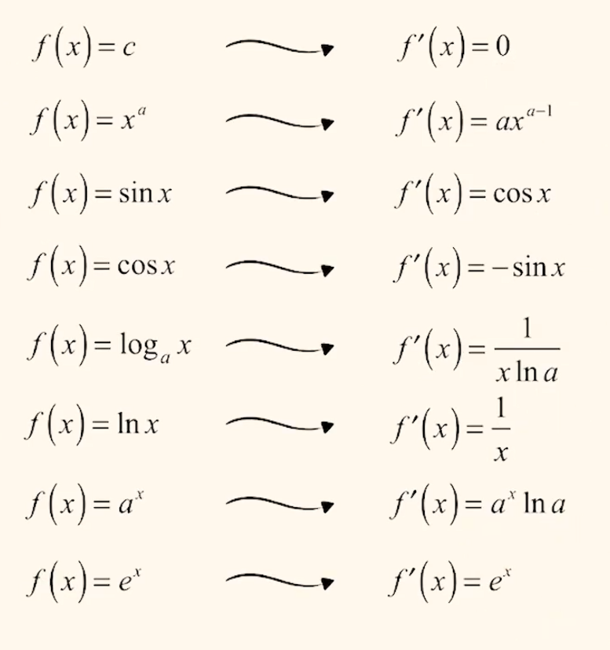
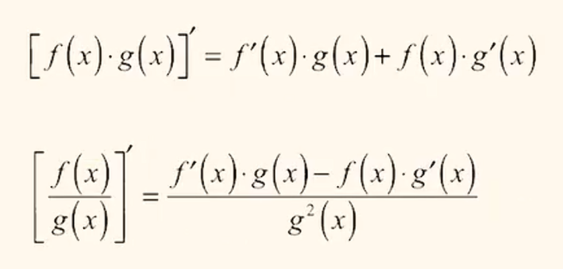
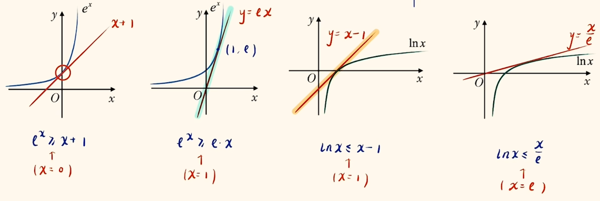
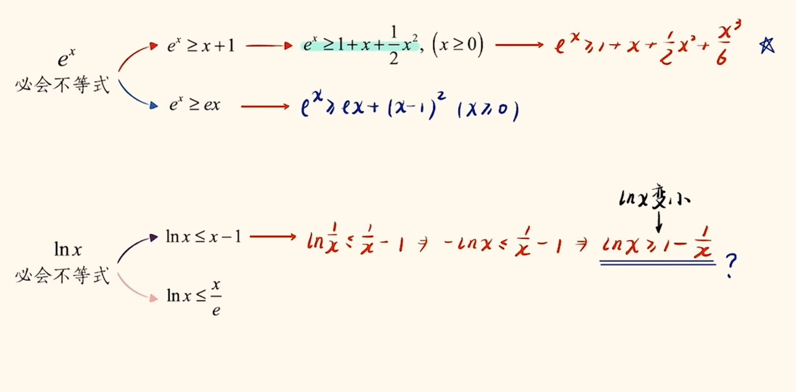
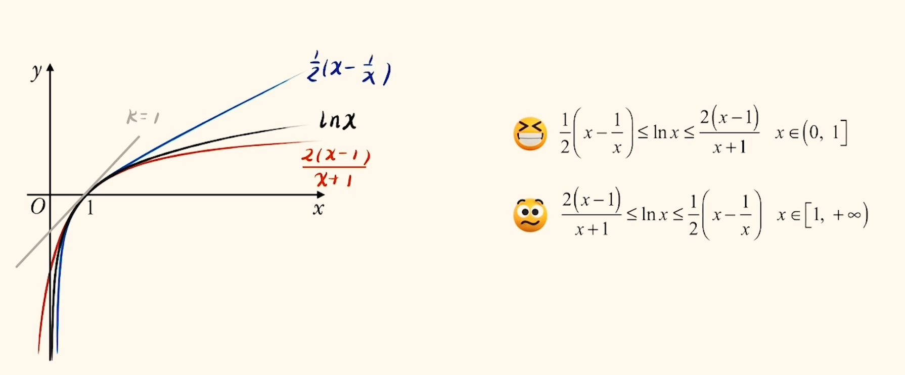
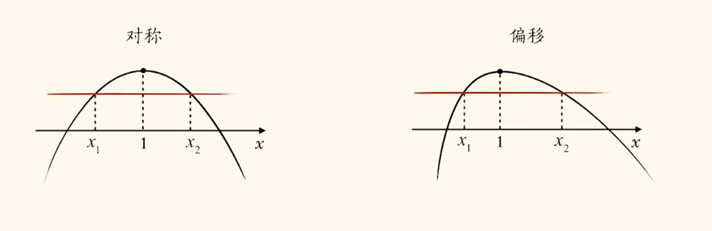
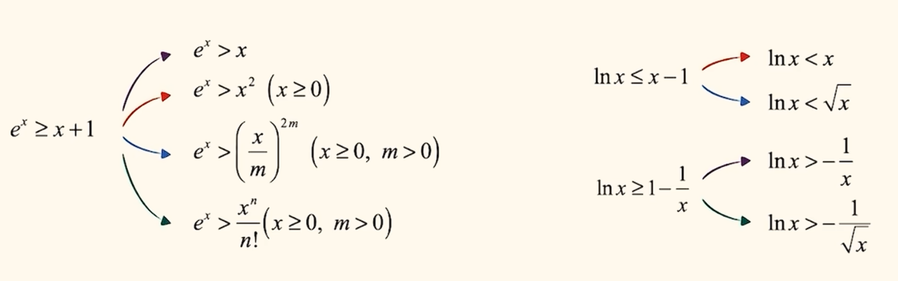

# 导数

导数可以认为是在函数某点处的斜率值. 其极限表达形式如下:

$$f'(x_0) = \lim_{\Delta x \to 0} \frac{f(x_0 + \Delta x) - f(x_0)}{\Delta x}$$

解决此类题目可以通过画图解决, 或将两个括号中的内容按符号操作并与分母比较, 得出是 $f'(x_0)$ 的几倍, 然后配凑即可.

$y'|_{x = 0}$ 是函数 $y$ 在 $0$ 处的导数值.

可以求出导函数 $f'(x)$ , 一些规则如下:

$$
[f(x) \pm g(x)]' = f'(x) + g'(x)\\
[af(x)]' = af'(x)
$$

$$\{f[g(x)]\}' = f'[g(x)] \cdot g'(x)$$

## 切线问题

"在"的表述为此点在函数图像上, "过"不一定(可能有多个切点, 因此代入不论是否在函数上也要按照"过"的操作). 若不知道切点("过"的情况), 则设切点, 列点斜式, 斜率可以用导数值或两点坐标表示两次.

公切线需要设出两个切点, 在两个切点处列两个点斜式, 这两个式子应该一模一样, 由此解出答案, 此类题目难点在于化简这两个式子, 经常需要同时取指对等操作消元.

## 单调性

显然有:

$$f'(x) > 0 , f(x) 单调递增\\f'(x) < 0 , f(x) 单调递减\\f(x) 单调递增, f'(x) \ge 0\\f(x) 单调递减, f'(x) \le 0$$

求完导后要尽量因式分解(尤其是导后很复杂的(如 $(2 - x)e^x + \frac{1}{2}x^3 - x + 2$ 这种很明显提示有 $(2 - x)$ 公因式), 注意一定要试试并且要彻底, 有时三次函数等也可继续将前两项提出 $x^2$ 后因式分解, 带有根号的可以换元尝试因式分解, 含参二次函数也要注意能否分解等), 只研究不恒正/负的部分即可, 一般也会将分式等通分. 遇到一大坨式子不要慌, 先观察次数是否相似, 如 $2x - 2$ 与 $1 - \frac{1}{x}$ 次数都相差 $1$. 注意有 $e^x, e^{2x}$ 时也要考虑能否十字相乘分解为类二次函数, 然后再找零点使用穿根法画图. 高次函数猜根尝试因式分解更普遍.

极值点为"凸起的点", 其两侧单调性改变. 极值点是导函数的变号零点(穿过横轴, 若不则不是极值点, 单调性不改变). 分为极大值点和极小值点. 函数最值可能在极值点或定义域端点取得. 极值点只是一个局部的概念.

看图像时要尝试代入特殊点, 以及趋近于无穷处或零处的函数值. 确定是否有零点可以将一个函数拆分成两个简单函数找交点.

求导前一定要看看函数单调性是否显然(增减函数规律), 从而避免求多次导.

求导前要先观察, 如大部分项都是 $x$ 的几次方, 只有一两项是指对等, 可以提出一个 $x$ 更好分析(指对项会变为分式但整体更简单). 当然这只是一种尝试路径.

## 不等式证明/取值范围

$对数单身狗$ (自己成为一项, 甚至也要将参数乘除移开) $, 指数找朋友$ (与幂函数, 三角函数和参数等乘除在一起) , 有关指对的不等式或函数要注意先变形指对(如不等式同时乘除, 移项构造函数, 指对自身性质等)再分析, 在复杂题目尤其是同时有指对和三角的题目中很必要.

若题目出现比较对称的分式(一般在同构或极值点偏移中出现, 如 $\frac{x}{e^x} < \frac{2 - x}{e^{2 - x}}, x \in (0, 1)$), 可以考虑交叉相乘, 这样能够消掉分式的同时求导后易于找到公因式. 当然这个例子更常见的思路是将指数放在一起求导分析, 也可做, 或者更本质地, 将指数放在一起后使用下头公式(当然可以理解为对数上太复杂要下头), 将 $\ln$ 中的分式换元处理(这本身就是常见的处理方式, 将指对内的内容换元成一个简单的未知数从而展现原型), 可以得到飘带放缩, 这个方法在大指数和大分式同时出现在两侧时十分常用(因为对数的很多放缩都是分式形式, 所以向对数转化).

当题目参数有范围时(或者以参数为主元有最小值), 且参数形式比较单一(如仅出现 $a$ 等), 可以考虑变换主元. 变换主元后也要先去看单调性从而消去参数(一般单调好分析, 若不单调可以考虑先放缩一下, 尤其是关于三角函数的题目). 当然, 也不是所有符合此限制的题目都可以变换主元, 有时需要回归分类讨论或用单调性先消去自变量. 其实, 像 $alnx + \sqrt{1 + x} - \frac{\sqrt x}{2a}$ 这样以 $a$ 为主元时不单调的函数, 也可先用必要探路大致确定 $a$ 的范围(或本来就已知), 然后同除 $a$ 将 $a$ 与正负不确定的 $lnx$ 分开(亦可解释为对数单身狗)变为 $lnx + \sqrt{1 + x} \cdot \frac{1}{a} - \frac{\sqrt x}{2} \cdot (\frac{1}{a})^2$ 从而变为对 $\frac{1}{a}$ 的单调函数. 总之就是尽量将 $a$ 与正负恒等的项乘在一起可以转化为单调函数, 当然 $a$ 的存在形式都可, 如 $\frac{1}{a}$ 等, 要大胆变形尝试.

分离参数是很常用的方法, 在参数形式少时首先尝试(尤其是难题仅出现一次时, 能分离一定要分离, 即便可能引入绝对值(去绝对值变成两个不等式很多时候也比正着做简单很多)). 分离时参数可以与常数一起分离到不等式一侧, 或者参数的任意形式如 $\frac{1}{a}, e^a$ 等都可.

当然有时需要最本质的分类讨论.

有时也需要将复杂函数(特别是出现三角函数等)拆分成两个简单函数, 都易于画图, 而非一定要完全分离参数.

两个凹凸函数的临界情况可能是相切有公共切点, 一般画图分析, 设出切点列方程.

双变量恒成立问题都可以转化为两个最值比较, 可以先固定一个看一个变量, 然后再看另一个变量.

$x_1, x_2$ 地位等价, 需要去绝对值, 可以 $不妨设 x_1 > x_2$ . 然后有两种思路, 或同构, 或整体看待(比如只有 $x_1 \pm x_2, \frac{x_1}{x_2}$ 等).

隐零点问题抓住一个等式来代换即可. 但隐零点 $x_0$ 范围越精确, 可以证明的不等式就越精确, 往往需要零点存在定理来精确范围. 证明连不等式两侧时, 往往一侧需要用代换后的式子, 一侧需要代换前复杂的式子. 不等式中有 $e$ 等特征时要考虑需不需要带值引入. 题目中有整数参数取值范围时一般可以考虑隐零点.

当需要从等式引入不等号, 或指对同时出现(此时也可考虑隐零点或同构), 或有多种根号里的多项式(如同时出现 $\sqrt x, \sqrt{x + 1}$ 等多种根号, 整式性质明显, 指对碍事), 需要消掉 $e^x, lnx$ 等时考虑放缩. 当然, 式子太复杂或指向很明确(如复杂式中多次出现 $x + 1$ 与 $e^x$ , 或者更简单地式子由指对其一与幂项构成等)可以尝试切线放缩(但不确定是否足够精确).

以上是基本的切线放缩. 选用不等式时, 若题目中含有 $e, ex, ex^2$ 等项时考虑使用含有 $e$ 的切线放缩. 注意放缩时要注意次数比较, 不要放缩过度, 若次数不合适需要选用更高阶的放缩式(因此要注意每个放缩式的次数), 如下.

更为精确的飘带放缩如下.

飘带放缩的特征可能有 $x + 1, 1 - x$ 等项同时出现, 或 $x - \frac{1}{x}, \frac{x^2 - 1}{x}$ 出现等其等价变形. 其实飘带放缩与对数均值不等式的关系十分密切.

飘带放缩不仅精确, 当参数分居 $1$ 两侧且都需要放缩时, 飘带放缩可以用同一套函数进行放缩, 如 $b > 1 > a > 0$ 时, 由于 $a, b$ 分居 $1$ 两侧, 所以可以有 $飘带(a) \le F(a) \le F(b) \le 飘带(b)$ 等, 十分对称, 适合地位等价的题目.

有时不等式可能看不出来是放缩式, 可以将指数和对数部分换元, 形式就出来了.

估计三次函数(或有二次和分式)最值的一种方法是, 现将其转换为含有二次项和分式的形式, 把二次项凑完全平方, 这样就可以转化为完全平方式与对钩/双刀函数的组合函数, 由此就可求最值. 在不要求精确或精确值有根号的情况下十分常用. 如 $x^2 - x + \frac{e}{x} \Rightarrow x^2 - 2x + 1 + x + \frac{e}{x} > 0 + 2 \sqrt e - 1$ (无法取等).

端点效应使用时, 一般是当函数表达式很长很复杂, 已知一个不等式恒成立(一般化成一侧是常数, 更普遍的会化为 $0$, 以下默认化为 $0$ ), 求参数取值范围. 想要满足恒成立, 在端点处必然成立, 这样我们就可以初步得到参数取值范围(但很多时候这就是答案). 接下来我们只需要证明端点就是限制最严格, 即取得最值处即可(充分性证明, 一般需要证明单调性). (否则端点效应失效, 因为端点效应只是使用必要性, 或者说是用局部推测整体) 充分性证明就可以使用前面得到的参数取值范围以简化证明过程(如使用变换主元等技巧消掉参数(放缩一下也可以, 根据题目提示), 因此题目一般也符合参数形式单一, 即主元法的限制).

值得说明的是, 如题目给出 $f(x) \ge 0$ 在 $[1,+\infty)$ 上恒成立, 若有 $f(1) > 0$ 是基础情况; 若 $f(1) = 0$ 则需要再保证 $f'(1) \ge 0$ , 但是若 $f'(1) = 0$ 就需要更进一步的 $f''(1) \ge 0$ , 以此类推.

实际上, 若更加严格地, 我们还需要证明不满足得到的参数取值范围时给出的不等式恒不成立. 实际上这一过程已经隐含在前面的分析中, 只需要写上如下一句话即可:

$$当 a \dots (不满足得到的范围)时, \exist x_0 使得 x \in [\dots(题目给出的范围)], f'(x) \le 0, f(x) \le f(\dots (自变量边界)) = 0, 不符合题意. $$

上述文本实际上就是将我们求得的参数取值范围(临界情况)作为分类讨论依据(如 $a \le 3$ 讨论 $a \le 3$ 与 $a > 3$ 两种, 而 $a > 3$ 按照上述语句逻辑分析不合题意).

端点效应会失效, 若端点处不是最值(一般简化为函数不单调). 有时当带入端点时会发现是一个不是极限情况的常数, 如题目恒成立不等式要求 $\ge 0$ , 带入后发现端点处为 $1$ (甚至是无穷等都可能)并不是 $0$ 的极限情况, 此时端点效应就失效了. 更隐蔽的, 有时即便这个点是在极限情况, 但是其不是(唯一)最值, 即函数不单调, 那么端点效应大概率就会失效. 失效时应该去找真正的极小值使其满足题意(正常求导分析极值点即可). 所以使用端点效应应该优先判断是否失效. 其实很简单, 前面简单的情况比较容易辨别且不用特殊操作, 复杂情况就需要先在草稿纸上试端点极其导数, 判断是否满足 $f(x_0) = 0 且 f'(x_0) = 0$ (极值点处与横轴相切)有解(直接猜根(范围内的特殊点, 有可能猜不出来), 或先消元, 之后一般需要猜, 猜令 $e^x, lnx$ 等系数为零或 $\ln$ 中的式子为 $1$ 等更常见(不需要找出所有解, 因为只是必要探路缩小范围, 而非一定是真正结果(实际上很多时候都是真正结果, 即只有一个根))), 若有解则意味着函数内部有一个极值点, 函数不单调, 端点效应失效(还有一个边界限制处, 在这里分离参数或其他方法分析限制即可); 若不失效则将步骤书写在答题纸上并充分性证明.

有时端点处不能取到, 只能逼近, 那么我们可以使用洛必达法则.

实际上, 端点效应是必要探路的一个特殊方法. 必要探路就是找定义域内的特殊点, 一般是端点(前提是不失效), 极值点(端点效应失效, 列 $f(x_0) = 0 且 f'(x_0) = 0$ 直接猜根(范围内特殊点, 可能不行)或消元猜根得到极值点 $x_0$ 代入分析), 零点(猜根, 有明显根), 使参数失效的点(系数为 $0$ 等)等, 并在此得到参数粗略的取值范围. 当使用端点效应得到单调函数时(端点效应不失效)就使用端点效应, 不单调或一开始就没给出自变量取值范围但问法明显是必要探路(已知恒成立 $+$ 求参数取值)则考虑找明显的零点或极值点(上述的失效解决情况). 当然无论哪一种点效应都需要在得出初步范围后进行验证证明(零点等可以带入说明一下).

有时候一个题目可能有多种特征, 多个解法, 因此尝试的路径也有优劣. 比如"整数"字样一般会考虑隐零点, 但若题目给出了必要探路典型问法, 用必要探路会更可取. 此时一般考虑能把 $e^x, lnx$ 这种显然与整数估计不符的项通过探路代值代掉. 当然也可以什么都不想直接尝试像 $0, 1, e$ 等这样的特殊点.

凹凸反转是将一个函数(通常是指对函数)分为两个简单可以画图的部分(常见操作是同时(乘)除以一个式子使得两侧都便于分析), 一个为凹函数, 一个为凸函数, 这样就有可能找出大小关系(共切线切点等), 也可避免一些隐零点等问题.

提醒一下, 若式子里一个东西总出现超过两次, 即使有其中参数的其他形式, 也要考虑向这个形式转化.

若当题目要证的不等式常数一侧很奇怪, 可能是一个函数带入某个点的值, 大概率会在过程中构造出这个函数并且单调性分析(脱衣服).

泰勒展开式很多题目会作为背景出现, 通常不会明说, 但解析式中可能有展开式的部分项, 且一般会有难处理的项(如 $e^x, lnx$ , 三角函数等), 提示需要用其放缩一下.

当导数与三角函数结合时, 经常把三角函数分为好几个部分来规避数形结合的失分, 因为三角函数的浪形总是只有一小部分是关键的, 特殊叙述这部分即可(以免使用的 $x \ge sinx$ 等放缩不等式在其他地方不成立, 或靠近无穷端出现大量规律重复性的内容时, 可以分为接近原点的部分和远离原点的两部分, 且远离原点的部分往往采取大胆粗糙的放缩, 与靠近原点的精细分析区别).

同构分为部分同构与整体同构, 当出现一堆指对同时有 $x^a$ 的项时考虑. 部分同构实际上就是换元, 常见地, 若出现 $x^ae^{bx}$ 时可以考虑变形为 $e^{alnx + bx}$ (朗博同构). 注意 $a, b$ 可以为负数, 写成分数形式. 当然见到这个结构转化后也不一定会出现同构形式, 可能需要切线放缩(放掉大 $e^{\dots}$等)等就可以直接证明求解(当然朗博同构更普遍的是一个变形技巧而非一定要找出同构换元). 整体同构多为适用同一个解析式, "指幂对幂"结构很常蕴含整体同构, 因为 $x = e^{lnx} = lne^x$ (幂可以写成指或对的形式)(判断如何变有两种方法, 由于函数式(一般认为最外层的是函数解析式中会有的, 内层一般是变量的形式)一致, 则需要将没有的特征(如指/对)搞出来, 由此得到如何变; 或者用同时升降级的思想, $lnx$ 与 $x$ 和 $x$ 与 $e^x$ 之间都是差一级, 所以 $lnx$ 对应可以变为 $x$ , $x$ 可以对应变为 $e^x$ , 降级同理), 所以很多时候是 $x$ 和 $lny$ 或 $x$ 和 $e^y$ 等看做同构函数的两个变量(实际上就是等式两边所有项都差一级, 在变量处做升降级, 同升降一级处理成同构). 我们很多时候需要自己向此模型取凑, 即让符号两侧式子尽可能的差相同级. 整体同构后常用脱衣服(若不单调有时可能自变量都在同一个单调区间内仍然可用, 若不确定则要分类讨论(但是实际上无法脱衣服的一般对答案无影响, 可能可以通过正负分析(负数一定小于正数)得到))等方法操作得出不等式. 有时候两侧没有幂的部分, 可以同时加上(具体加什么看指/对处的提示, 要确保加上后有相同形式(这样才能确保等式一侧是同一个变量)). 如 $e^{x + m} + m \ge lnx \Rightarrow e^{x + m} + x + m \ge x + lnx$ , 由此出现指幂对幂模型. 实际上, 指对(幂)同时出现(更可能是指对同时出现, 因为可以增减"幂"项)就可以想着向此模型凑, 而非一定完全符合此模型顺序才能用(所以才需要在指对都在符号同侧时令其分开至两侧, 这个操作十分必要). 参数也需要优先在未知数前向相同形式去凑, $a = e^{lna} = lne^a$ , 这样就方便增减"幂"项判断. 值得说明的是, 指幂对幂结构不一定是加减相连, 乘除也可, 因此增减"幂"项时乘除也可. 有时符号两侧的幂项可能是反着的, 需要调换位置, 使得相同变量放一起.

极值点偏移问题往往是题目给出函数值相等条件, 问关于两个变量的一个不等式, 因此我们需要考虑消元, 有时需要穿衣服等技巧. 极值点偏移问题大致有三种处理方式:

1. 单调性 $+$ 构造函数消元
2. 齐次式或比值换元
3. 指对均值不等式

极值点偏移的问题有非对称(式子可能对称, 但是符号是不等号, 图像不对称)的特征, 会出现多个变量, 对于多变量问题最显然的思路是消元. 上述三种处理方式实际上就是消元方式.

单调性 $+$ 构造函数消元的办法往往需要先分离两个变量至不等式两侧, 通过对两边取值范围分析一般可以得到两侧同属于一段单调区间内(不行则考虑换方法, 从此也可看出我们只关心函数如何增减, 并不关心是否穿过横轴, 有些时候画图根本不需要费力去判断), 由此就可以穿衣服, 然后代换函数值(题目一般会给出两个变量函数值相等条件)从而消元, 最后带入解析式证明不等式即可(因为已经消元了). 很多时候最后的不等式证明往往考察数学功底.

很多时候极值点偏移问题可以先用基本不等式转化为更简单的问题, 如想证 $x_1^2 + x_2^2 > 2$, 使用 $x_1^2 + x_2^2 \ge \frac{(x_1 + x_2)^2}{2}$ , 只要证 $x_1 + x_2 > 2$ 即可.

很多时候不对称的问题如 $x_1 + 2x_2 > 3$ (已知 $x_1 < x_2, x_1 + x_2 > 2$ (一般后面这个对称条件需要接下来证明, 题目不会给, 本质上就是把不对称问题转化为对称问题))可以转化成对称的问题, 通过放缩, 即 $x_1 + x_2 + x_2 > x_1 + x_2 + \frac{x_1 + x_2}{2}$ (凑对称) $> \frac{3}{2}(x_1 + x_2) > 3$ .

练习: $x_1x_2 < x_1 + x_2$ 可以如何变形. 最好想的就是同除 $x_1x_2$ 变形为 $\frac{1}{x_1} + \frac{1}{x_2}$ 与 $1$ 的关系, 但是这样需要考虑 $x_1x_2$ 正负, 而且还需要看解析式中是否好凑 $\frac{1}{x}$ 项. 当然这种式子也可以移项去因式分解为 $(x_1 - 1)(x_2 - 1) < 1$ , 然后换元解决问题, 这样就可以同时保证对称与形式简单(这也是基本不等式题目中常见操作). 当然看见乘积与和的形式可能会想基本不等式或完全平方式(但是没保证自变量取值所以不采用). 但是如何变形最终还是要取决于题目解析式的形式与特征.

练习: $f(x) = e^x + cosx - ex, x_1, x_2 \in (0, \pi)(x_1 \ne x_2), f(x_1) = f(x_2), x_0 为 f(x) 极值点, 求证: x_1 + x_2 < 2x_0.$ 很显然这个题明确告诉我们需要隐零点的方法. 观察到这个函数既有指数又有三角函数, 十分复杂, 但为判断单调性仍然求导, 画出图像后(无法判断与横轴位置关系, 而且也没必要, 如前文所说), 对所求式进行变形, 只要证 $g(x) = f(x) - f(2x_0 - x) < 0$ 即可. 考虑对 $g(x)$ 求导, 值得说明的是此时求导无需将 $f(x)$ 等完全展开, 只需要利用复合函数求导即可避免抄写很长的解析式(但要注意一定不要忘记内层导). 求导完后常规将相似的项放在一起, 有 $e^x + e^{2x_0 - x} - sinx - \sin(2x_0 - x) - 2e$ , 接下来难以变形或画图, 因为 $x_0$ 的具体大小不清晰, 所以考虑隐零点代换 $e^{x_0} = sinx_0 + e$ , 注意到没有能够直接代换的地方, 所以需要凑, 显然对于 $sinx_0$ 项难以凑出(因为如果将 $\sin(2x_0 - x)$ 拆开就没法做了), 所以我们观察 $e^x + e^{2x_0 - x}$ 部分, 注意到两指数相加可以消掉 $x$ 从而出现 $e^{x_0}$, 大胆使用基本不等式放缩(本题难点), 有 $2e^{x_0} - sinx - \sin(2x_0 - x) - 2e = 2sinx_0 - sinx - \sin(2x_0 - x)$ , 至此只剩下三角函数, 可以考虑将最后一项展开(可做比较复杂), 但是观察到后两项中三角函数中的式子相加可以消掉 $x$ , 所以想到和差化积(一堆三角函数相加减或有三角函数相乘除一定要往这方面想), 有 $2sinx_0 - 2sinx_0\cos(x - x_0) = 2sinx_0(1 - \cos(x - x_0))$ , 接下来正负就好分析了, 然后一路画图回推即可证明完毕.

对数均值不等式:

$$
\sqrt{ab} < \frac{a - b}{\ln a - \ln b} < \frac{a+b}{2}
$$

其中 $lna - lnb$ 也可写成 $\ln\frac{a}{b}$ . 右侧不等式常变形为 $2(a - b) < (a + b)(lna - lnb)$ . 这里也蕴含了一个齐次式: $\ln\frac{a}{b} = 2 \frac{a - b}{a + b} = 2 \frac{\frac{a}{b} - 1}{\frac{a}{b} + 1}$ , 接下来换元即可.

以下以例题 $f(x) = \frac{x}{e^x} , f(x_1) = f(x_2)$ 讲解.

这里就可以初见对数均值不等式与齐次式的消元能力. 例如 $\frac{x_1}{x_2} = e^{x_1 - x_2}$ 这种的有两个变量做比, 还有两个变量加减, 并且相差一阶的(或者有幂项和对数项), 往往可以考虑向对数均值不等式考虑. 例子里同时下头有: $x_1 - x_2 = \ln\frac{x_1}{x_2} \Rightarrow \frac{x_1 - x_2}{\ln\frac{x_1}{x_2}} = 1$ , 由此我们得到了一个可以用于 $1$ 的代换的式子, 可以用于升次, 这就是齐次式解法, 如求证 $x_1 + x_2 > 2$ , 转化为 $x_1 + x_2 > 2\frac{x_1 - x_2}{\ln\frac{x_1}{x_2}} \Rightarrow \ln\frac{x_1}{x_2} > 2\frac{x_1 - x_2}{x_1 + x_2} = 2\frac{\frac{x_1}{x_2} - 1}{\frac{x_1}{x_2} + 1}$ , 往后就可换元证明了.

同样地, 想证 $x_1x_2 < 1$ , 可以考虑一边降次一边升次, 这是更常见的操作相比于找一个能升两次的式子. 同时开根有 $\sqrt{x_1x_2} < 1$ , 使用上述代换有 $\sqrt{x_1x_2} < \frac{x_1 - x_2}{\ln\frac{x_1}{x_2}}$ 便得到了对数均值不等式, 或者继续往下做有 $\ln\frac{x_1}{x_2} < \frac{x_1 - x_2}{\sqrt{x_1x_2}} = \sqrt\frac{x_1}{x_2} - \sqrt\frac{x_2}{x_1}$, 令 $t = \sqrt\frac{x_1}{x_2}$ 换元即可.

当极值点偏移的题目中出现了参数往往需要特殊处理(因为目标不等式中一般是没有参数的必须消掉), 比如约掉, 如 $\frac{1}{3}(x_2 - x_1) - \frac{3a}{x_1 + 2x_2} + \frac{aln\frac{x_1}{x_2}}{x_1 - x_2} > 0$ 这样的式子(暂时不考虑对数均值不等式做法), 已知 $x_1 < x_2$ , 即第一项大于零, 注意到后两项的形式较为相近, 且次数形式一致(对数认为是零次即可, 均为零次比一次, 且分子都有参数 $a$), 考虑单独看后两项为正即可, 如此构造不等式便可约掉 $a$ 去分析证明了. 同理, $lnx_1 - ax_1 + 1 = 0$ 与 $lnx_2 - ax_2 + 1 = 0$ 想消掉 $a$ 很简单, 将 $ax$ 项移到右侧, 做比即可.

用齐次消元的前提是, 函数解析式比较简单(可以容易地找到一个常数代换式), 且目标不等式简单, 用齐次消元往往简单, 总之就是简单题齐次式是可能好用的. 所以, 我们有更普遍的比值代换解法. 可以发现前文所有换元都是 $t = \frac{x_1}{x_2}$ , 实际上大部分时候可以直接设 $t = \frac{x_1}{x_2} \Rightarrow x_1 = tx_2$, 这样就可以直接暴力换元为单变量 $t$ 的问题了, 这就是比值代换. 之后可以将 $x_1$ 和 $x_2$ 全部用 $t$ 来表示(不一定表示的是 $x$ , $lnx$ 等形式也可以接受), 这样不等式就变为关于 $t$ 的不等式了. 建议大家直接忘掉前面讲的齐次式法, 遇到题目直接比值代换.

$指对均值不等式法\小\猪\快\更!!!$

这里还给出对数均值不等式的指数形式:

$$
e^{\frac{x+y}{2}} < \frac{e^x - e^y}{x - y} < \frac{e^x + e^y}{2}
$$

## 零点问题

实际上就是单调性 $+$ 零点存在定理, 主要操作是找点用零点存在定理. 极限分析可能会扣分, 故建议找点. 找的点一定含有参数, 不是一个具体数字, 对于表达式很复杂时找点常用放缩. 找点(放缩)口诀"同号有界直接干掉, 异号有界限定条件". 首先先分析每一项在自变量趋近零/无穷(看题目要求是要取很小的点还是很大的点)时, 它们的变化趋势. 若某项有界(即无限趋近于某个常数, 如 $0$ )且符号相同(从哪个方向趋近边界), 则可以直接放缩掉; 若有界但符号相反, 则需要限定条件(自变量取值范围, 这个范围随便给(前提是可以卡出另一个合理的边界)可以很粗糙)从而创造另一个边界. 如想取 $\dots < 0$ , 则趋于 $0^-$ 的项可以直接干掉, 趋于 $0^+$ 的项需要限定条件(限制自变量取值范围从而创造另一合适的同号的边界, 因为有界的话影响可以忽略, 因此无界项不可以限定条件干掉, 只可以放缩消去). 可以发现这个放缩十分不精确, 因为只需要找到任意一个点, 所以在放缩不等式选取时也可以大胆使用粗略的放缩放掉很多指对项(即平常说的"跨阶问题大胆放缩"(也要注意不要过度, 要判断次数再放缩), 有时放缩时为了放缩不等式成立或避免一些项的正负不定/改变(如趋近正无穷的项有可能在放缩后再某些取值下为负数)也会限定一下条件). 必须说明的是, 为了避免我们找的点不在我们人为限定的条件范围之内, 通常采用加/减(具体看放缩方向)常数的方法(如找到 $x_0$, 限定 $x \ge 1$ , 则取点 $x_0 + 1$).

可以注意到取点最后往往会把复杂函数转化为二次函数(也不一定, 不必须)(这个二次函数可能是类二次函数, $x^2$ 与 $x$ , $e^{2x}$ 与 $e^x$ (但是此时不含 $e^x$ 的 $x$ 等需要看做常数项)等均可以, 要注意识别), 但是二次函数亦有好有坏, 能提出公因式的二次函数往往好分析(即能分离 $x$ 与参数, 像仅有 $x^2$ 和常数项, 或 $x(x - 1)$ 这样无常数项的(一般可以根据条件只看一个括号), 可以直接求解 $x$ 取值的); 但是如果是一个任意的二次函数如 $x^2 - bx - a$ ($a$ 可能很复杂, 可能还有指对等)的话, 有两种方法, 可以直接用求根公式, 但仅限于 $a$ 比较简单时; 更推荐先限定 $x$ 范围, 将 $a$ 项乘 $x$ 放缩/代换为 $ax$ 项, 这样就消去常数项了, 如 $a > 0$ , 想消去常数 $-a$ , 可以限定 $x > 1$ (因为是异号有界, 如果是同号常数的话肯定早就被直接干掉了), 同乘 $-a$ 变号有 $-ax < -a$ 即可放缩消去(要注意不等号方向需要凑得合适). 值得说明的是, 有些题目并不会告诉你常数 $a$ 的正负, 需要我们使用不等式 $-|a| \le a \le |a|$ 先放缩一下, 变为正负已知的绝对值, 这样就可以继续分析了. 正如前文所说, 有这种常数项实际上就是异号有界限定条件的一种特殊情况(异号有界无 $x$ 无法限定条件, 就要人为加上一个 $x$, 但是加之前就限定条件了).

还有一个小技巧就是异号有界限定条件时, 若这一项是个分式, 可以先尝试放缩(因为有界所以可以大胆放缩)使得上下分子分母约掉, 有时甚至可以避免限定条件(但是一定要保证式中有 $x$ 才能取到点, 不能全部 $x$ 都消掉了). 如 $\frac{ax}{e^x} \to 0^-, a<0$ , 需要往 $\dots > 0$ 方向放缩, 可以有 $\frac{ax}{e^x} > \frac{ae^x}{e^x} = a$ , 这样就不用限定条件了. 那么这样的跨界放缩不等式有哪些, 如下.

可以发现以上不等式都是大家熟悉的不等式, 但是干掉了常数项或改变了次数(防止放缩过度)等. 注意这些不等式是经验公式不精确不能取等, 在往常的放缩中不建议使用. 这些跨阶不等式可以用于升降阶, 对于"小弟"可以升阶(不能超过"大哥", 但要尽量与"二哥"次数一致), "二哥"可以降阶等("大哥"可以降, 但是不能比"小弟"还小, 就是正负符号不能反了).
