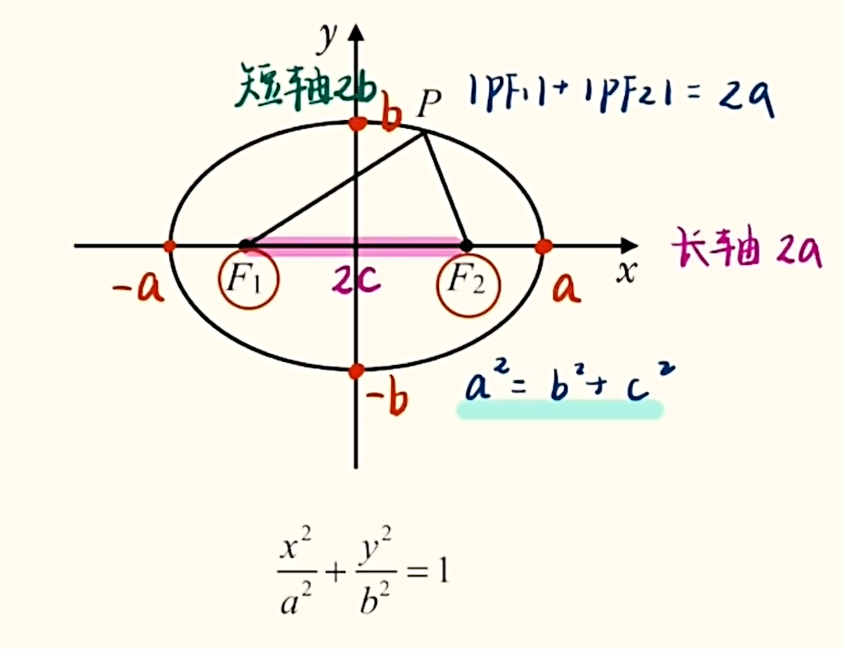
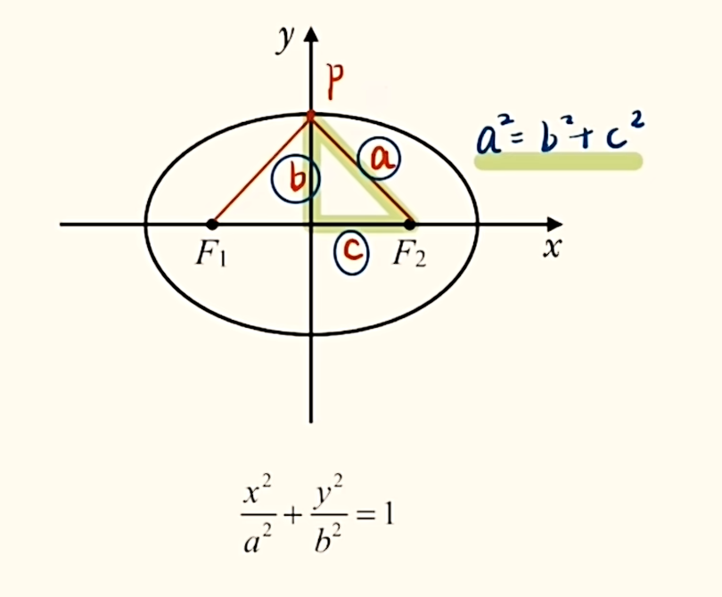
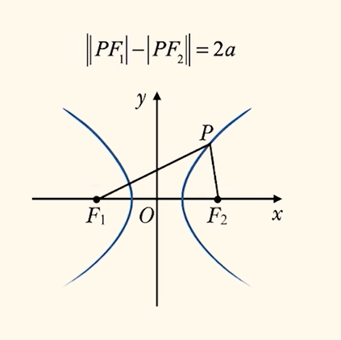
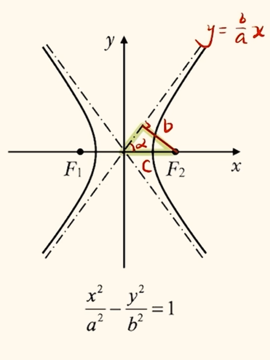
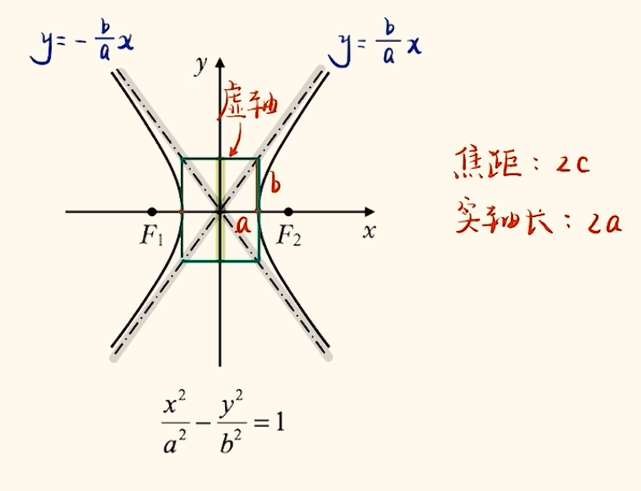
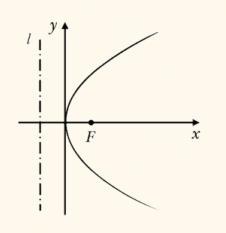
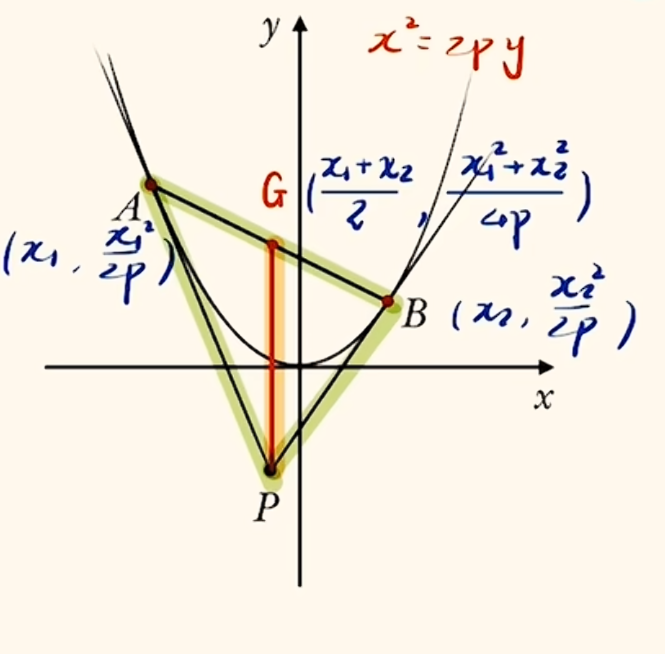
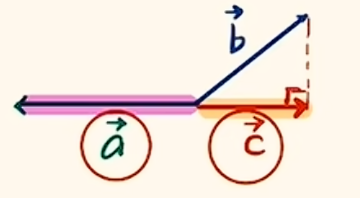
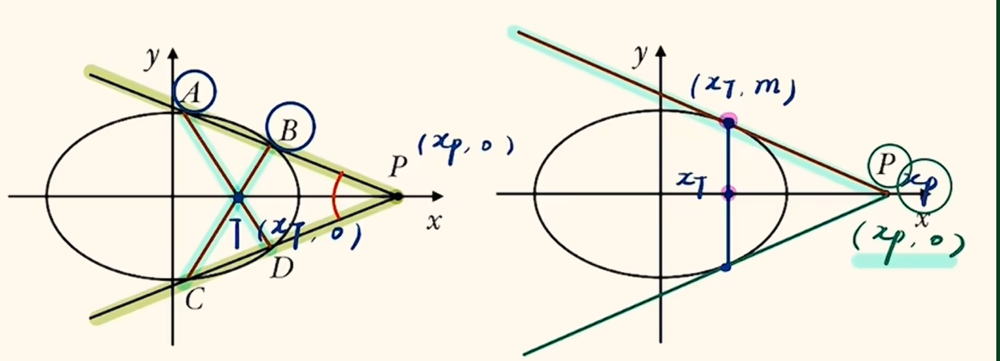

# 圆锥曲线

## 椭圆

{ width=500px }

{ width=500px }
焦点位置: 标准方程分母上的数字哪一个大就在哪一个上面对应字母的轴上.  
离心率$e$: 刻画椭圆的扁平程度.

$$
e = \frac{c}{a}, e \in (0, 1)
$$

当$e \to 0$时, 椭圆越趋近于一个圆($0$比较圆); 当$e \to 1$时, 椭圆越扁($1$比较扁).

### 定义

#### 第一定义

内容: 两定点$F_1, F_2$到一动点$P$距离之和是定值$2a$的点集, 即:

$$
|PF_1| + |PF_2| = 2a
$$

### 求离心率

本质: 找$a, b, c$的关系.  
补充公式(不用记, 联立$a^2 = b^2 + c^2$与$e = \frac{c}{a}$即可, 这里也给出双曲线的公式对比学习):

$$
e_椭 = \sqrt{1 - \frac{b^2}{a^2}}
$$

$$
e_双 = \sqrt{1 + \frac{b^2}{a^2}}
$$

特殊值法(选填可用): 因为离心率是比值, 所以可以带特殊值(如$1$)求离心率.  
齐次式: 同时除以$a^i, i \in \{1, 2, 3, \dots\}$整体求解$e$.  
离心率的求解可能会涉及到一些几何知识, 遇到复杂图形先把图像摆正拿出来, 然后使用全等/对称/几何性质去解决问题. 在解三角形的时候要令未知数尽可能的少, 尽可能往低次化.  
很多离心率范围问题能转化成原点$O$或焦点$F$到椭圆上一点$P$的距离问题, 距离$|OP|$满足: $b\le |OP| \le a$, $|FP|$满足: $a-c \le |FP| \le a+c$.  
离心率问题与立体几何结合: 把立体图形通过不同视图转化成平面图像找边的关系.

### 焦点三角形

构造: 两个顶点是焦点, 一个点在椭圆上的三角形. 一般看见一个椭圆上的点连接了一个焦点, 要连接另一个焦点区构造焦点三角形.

找焦点三角形边的比例关系的时候可能需要用解三角形的知识去求$a, c$关系, 忘记的别忘了回顾相关部分.

### 暴力计算

例如求两点/点线之间的距离, 难以用肉眼看出答案, 则需要表示并用函数的思想解决问题.

### 三角换元

对于一个二元二次式(椭圆等方程正是这样的), 建立二次幂于一次幂的联系, 带入消元或运算的时候可能十分麻烦, 我们可以把式子化简成$A^2 + B^2 = 1$的形式, 注意到此形式与$\sin^2x + \cos^2x = 1$十分相似, 则我们可以令$\begin{cases} \sin\theta = A \\ \cos\theta = B \end{cases}$ , 然后用三角函数表示$x, y$(化简为$x = \dots, y = \dots$), 来联系三角函数知识化简运算(消元只留下$\theta$一个变量).

### 直线与椭圆的位置关系

联立: 求交点坐标/直线椭圆位置关系时联立.  
交点个数: 联立消元求$\Delta$.

例题:  
已知点 $A(0, -2)$ , 椭圆 $C: \frac{x^2}{4} + \frac{y^2}{2} = 1$ , 设过点 $A$ 且斜率为 $k$ 的直线 $l$ 与 $C$ 相交于 $P, Q$ 两点.

$I.$ 求 $k$ 的取值范围;  
$II.$ 设 $M$ 为椭圆 $C$ 的上顶点, 直线 $MP, MQ$ 的斜率分别为 $k_1, k_2$, 证明: $k_1 \cdot k_2$为一个定值;  
$III.$ $O$ 为坐标原点, 求 $\triangle OPQ$ 面积的最大值;  
$IV.$ 求 $|PQ|$ 的最大值;  
$V.$ 设 $G$ 为线段 $PQ$ 的中点, 直线 $OG$ 的斜率为 $k_0$, 请证明 $k_0 \cdot k$ 为一个定值, 并求出 $G$ 的轨迹方程;  
$VI.$ 设 $T$ 为点 $P$ 关于 $y$ 轴的对称点, 证明: 直线 $TQ$ 过定点, 并求出定点的坐标;  
$VII.$ 设 $M, N$分别为椭圆 $C$ 的上, 下顶点, $H$ 为直线 $PN$ 与 $MQ$ 的交点, 证明: 点 $H$ 在某定直线上.

解答思路:  
$I.$ 联立并求满足 $\Delta > 0$ 的 $k$ 的范围即可.  
$II.$ 联立之后直接求两交点的坐标很麻烦, 我们先设两点坐标 $(x_1, y_1), (x_2, y_2)$, 然后使用韦达定理(根与系数关系)来确定两交点之间的关系. 然后表示结果消元即可, 一定能化简出韦达定理的形式.  
$III.$ 面积相关的问题要考虑是否可以转化, 通过割补法把动底动高其一转化成固定的线段(往定点上靠). 如果要求有关 $|x_1 - x_2|$ (或者 $x_1 - x_2$ )的表达式, 可以转换成 $|x_1 - x_2| = \sqrt{(x_1 - x_2)^2} = \sqrt{(x_1 + x_2)^2 - 4x_1x_2} = \frac{\sqrt{\Delta}}{|A|}$ 使用韦达定理或化简.  
$IV.$ 求弦长: 用弦长公式 $|PQ| = \sqrt{1 + k^2}|x_1 - x_2| = \sqrt{1 + \frac{1}{k^2}}|y_1 - y_2|$ (两点都在曲线上 $|x_1 - x_2|$ 可以化简为 $\frac{\sqrt{\Delta}}{|A|}$ ), 用完之后会出现一个一次比二次的式子, 需要先把分母放到根号里面再处理. 注意弦长公式是通用的, 任意两点均可以使用.  
$V.$ 求轨迹方程: 就是求 $x, y$ 之间的关系, 消掉其他参数. 注意轨迹方程是有范围限制的, 比如此题轨迹是一个椭圆, 但只能取在 $C$ 内的部分, 所以要对 $y$ 进行限制. 我们要求出最小的纵坐标, 就需要联立两个椭圆. 相比较于椭圆与直线的联立(二次与一次), 两个圆锥曲线的联立是比较简单的.  
$VI.$ 定点问题: 圆锥曲线里的很多问题都是可以先猜后证的, 如定点定线/定值问题, 可以通过特殊位置(相切, 过原点/焦点/顶点)/特殊值/对称性(在轴两侧画两个对称的情况并且放到同一个坐标系中)/两种情况确定定点定线定值/极限等方法得到答案或满足的条件.

## 双曲线

{ width=500px }

其实基本和椭圆类似, 这里给出二者的对比表格.

|                                                                                                                  |                                       椭圆                                        |                                          双曲线                                           |
| :--------------------------------------------------------------------------------------------------------------: | :-------------------------------------------------------------------------------: | :---------------------------------------------------------------------------------------: |
|                                                     第一定义                                                     |                $\vert\vert PF_1\vert - \vert PF_2\vert\vert = 2a $                |                         $\vert PF_1\vert + \vert PF_2\vert = 2a$                          |
|                                                     第二定义                                                     |  一点到一直线 $x = \pm \frac{c}{a^2}$ 的距离与其到另一点的距离之比为 $e$ 的点集   |                                             <                                             |
|     第三定义(一条过原点的弦与椭圆两交点 $A, B$ 与椭圆上一点 $P$ 相连, 其斜率积 $k_{AP} \cdot k_{BP}$ 为定值)     |                     $k_{AP} \cdot k_{BP} = - \frac{b^2}{a^2}$                     |                          $k_{AP} \cdot k_{BP} = \frac{b^2}{a^2}$                          |
|                               垂径定理, $AB$ 是一条弦, $P$ 为 $AB$ 中点, 连结 $OP$                               |                        $k_{OP}k_{AB} = - \frac{b^2}{a^2}$                         |                 $k_{OP}k_{AB} = \frac{b^2}{a^2}$ (渐近线上的点也可以使用)                 |
|                                              方程(焦点在 $x$ 轴上)                                               |                      $\frac{x^2}{a^2} + \frac{y^2}{b^2} = 1$                      |                          $\frac{x^2}{a^2} - \frac{y^2}{b^2} = 1$                          |
|                                                       通径                                                       |                                 $\frac{2b^2}{a}$                                  |                                             <                                             |
|                                             离心率 $e = \frac{c}{a}$                                             |                                  $e \in (0, 1)$                                   |                                   $e \in (1, +\infty)$                                    |
|                                                  $a, b, c$ 关系                                                  |                                 $a^2 = b^2 + c^2$                                 |                                     $c^2 = a^2 + b^2$                                     |
|                                                $a, b, c$ 几何意义                                                |                                       如图                                        |                                           如图                                            |
|                                        焦半径( $P$ 点坐标为 $(x_0, y_0)$)                                        |                        $PF_1 = a + ex_0, PF_2 = a - ex_0$                         |                $PF_1 = \vert a + ex_0\vert , PF_2 = \vert a - ex_0\vert $                 |
|                                                     特殊图形                                                     |                                       如图                                        |          { width=500px }           |
|                            焦点弦 (两交点 $A, B$ 坐标分别为 $(x_1, y_1), (x_2, y_2)$)                            |                               $2a \pm e(x_1 + x_2)$                               |                     $\vert a \pm ex_1\vert + \vert a \pm ex_2\vert $                      |
| 焦点三角形面积 ( $r$ 为内切圆半径, $\theta$ 为 $\angle F_1PF_2$, 可以实现 $\theta, y_P, r$ 知一求二, 知二求 $e$) | $S_{\triangle F_1F_2P} = b^2 \tan \frac{\theta}{2} = c\vert y_P\vert = (a + c) r$ | $S_{\triangle F_1F_2P} = \frac{b^2}{\tan \frac{\theta}{2}} = c\vert y_P\vert = (a + c) r$ |

{ width=500px }

可以发现椭圆和双曲线中垂径定理是第三定义的特殊形式. 其结论正负与曲线方程中符号相反, 椭圆为 $- \frac{b^2}{a^2}$, 而双曲线为 $\frac{b^2}{a^2}$ . 一般来说, 一条过原点的直线, 一个点与两顶点相连, 或出现弦中点时可以使用此结论. $\frac{b^2}{a^2}$ 这种式子与离心率平方 $e^2$有很好的关联.

$$
直线方向向量可以表示为(1, k_1), (1, k_2)\\
\begin{cases}
1 + k_1k_2 (数量积) = 0 \Rightarrow 直角\\
1 + k_1k_2 > 0 \Rightarrow  锐角\\
1 + k_1k_2 < 0 \Rightarrow 钝角
\end{cases}
$$

焦点位置: 哪一个字母在方程靠前的被减数的位置就在哪条轴上.

双动点问题: 先将一个点固定住讨论另一个点. 在圆锥曲线内一般需要结合定义求解.

渐近线: 对于焦点在 $x$ 轴上的双曲线, $y = \pm \frac{b}{a} x$ 为其两条渐近线. 特殊地, 当 $e = \sqrt{2}$ 时, 两条渐近线垂直, 称此双曲线为等轴双曲线, $a = b$ . 其实, 求渐近线有一个更通用的办法, 即将方程 $\frac{x^2}{a^2} - \frac{y^2}{b^2} = 1$ 改写成 $\frac{x^2}{a^2} - \frac{y^2}{b^2} = 0$, 解出 $y$ 与 $x$ 的关系式即渐近线方程.

### 直线与双曲线的位置关系

与椭圆不同地, 除了要判断斜率不存在以及 $\Delta$意外, 双曲线与直线联立可能出现二次项系数为零的情况, 此时直线与双曲线至多一个交点(直线与渐近线平行), 需要单独考虑. 其他情况联立判断 $\Delta$ 即可.

若题目限定在左枝上有两个交点, 则需联立限定两根之和和两根之积分别小于零即可. 右枝同理, 需要限定两根之和与两根之积大于零. 若要求左右两只各一个交点, 则需要有 $\begin{cases}x_1 + x_2 \gtrless 0 (不作限制或根据 k 判断) \\ x_1 x_2 < 0\end{cases}$ 来确定最后的取值范围. 这个限定有时很隐蔽, 需要注意.

不止是过 $x$ 轴定点时反设直线, 双曲线和抛物线很适合反设直线, 若题目要求直线与双曲线在同一支上有两个交点, 或者与抛物线有两个交点, 那么直线水平的情况就可以排除, 从而避免分类讨论斜率不存在.  
反设直线垂直等价于 $\lambda_1\lambda_2 = -1$.

## 抛物线

抛物线上任意一点到焦点的距离等于其到准线的距离, 当对称轴在 $x$ 轴上时, 交点和准线分别为 $(\frac{p}{2}, 0)$ 及 $x = \frac{p}{2}$, 方程为 $y^2 = 2px$. 故可以发现, 方程中系数除以 $4$ 即是焦点的坐标.

{ width=500px }

焦半径公式 (这是焦点在 $x$ 轴上的形式, 以下 $\theta$ 为倾斜角, 若 $|BF| > |AF|$ 则需要调换用角度表示的焦半径的分母) :

$$
\begin{cases}
|AF| = x_1 + \frac{p}{2} = \frac{p}{1 - \cos\theta}\\
|BF| = x_2 + \frac{p}{2} = \frac{p}{1 + \cos\theta}
\end{cases}
$$

焦点弦长公式:

$$
|AB| = x_1 + x_2 + p = \frac{2p}{\sin^2\theta}
$$

面积公式(注意与焦点弦长区分, 可以类比记忆, $2$ 在分子分母不同位置, 焦点弦长应该是长度 $p$ 的一次幂 $2$ 作系数, 而面积应该是二次幂, 分母的 $2$ 与分子的相反在指数/系数的位置):

$$
S_{\triangle OAB} = \frac{p^2}{2\sin\theta}
$$

四个相切圆 (直角关系, $A'$ 与 $B'$ 为 $A, B$ 在准线上的投影, 经常点圆心连接梯形中位线结合中点弦去做题):

$$
以 AB 为直径的圆与准线相切, 以 AF 或 BF 为直径的圆与 y 轴相切, 以 A'B' 为直径的圆与 AB 相切
$$

中点弦公式(不要求过焦点, 下面是焦点在 $x$ 轴上的情况):

$$
y_0\cdot k = p
$$

以上结论很多都可以用通径记忆, 通径长度为 $2p$ .

抛物线上任意两点的连线方程为:

$$
(y_1 + y_2)y = 2px + y_1y_2
$$

### 阿基米德三角形

在抛物线外任意取一点 $P$, 过 $P$ 做抛物线两条切线切于点 $A, B$, 连接 $AB$ , $\triangle PAB$ 即为阿基米德三角形.

{ width=500px }

以下列举几个常用结论.  
若我们已知 $A, B$ 坐标分别为 $(x_1, \frac{x_1^2}{2p}), (x_2, \frac{x_2^2}{2p})$, 则有 $P(\frac{x_1 + x_2}{2}, \frac{x_1x_2}{2p})$ .(即两点横坐标的算术平均数, 纵坐标的几何平均数) 取 $AB$ 弦中点 $G$ , 则有 $PG \parallel y$ 轴, 且 $PG$ 中点 $M$ 在抛物线上. 由 $PG$ 分割三角形, 可以用割补法求得 $S_{\triangle ABP} = \frac{|x_1 - x_2|^3}{8p}$ .

## 大题

#### 构图

自己画一遍图找图"因谁而变". 可以从"设点"和"设线"两种入手. 设点有时不需要联立, 但需要椭圆方程消元; 设线需要联立; 最关键的是找准因谁而动, 谁动就设谁.

#### 翻译

有时条件有多种等价的翻译方法, 此时要找谁特殊(如定点定直线), 就以谁翻译.

常见的翻译如下:

1. 直角 $\Rightarrow$ 数量积
2. 重心 $\Rightarrow$ 坐标为三点平均
3. 以...为直径的圆过某点 $\Rightarrow$ 直角 $\Rightarrow$ 数量积
4. 中点 $\Rightarrow$ 中点坐标公式
5. 两直线平行 $\Rightarrow$ $k$ 相等 或 均不存在
6. 两直线垂直 $\Rightarrow$ $k_1k_2 = -1$ 或 $k_1 = 0, k_2$ 不存在.
7. 等腰/等边三角形/关于直线对称 $\Rightarrow$ (三线合一)中垂线
8. 坐标之比 $\frac{y_1}{y_2}$ 用齐次式 $\frac{(y_1 + y_2)^2}{y_1y_2} = \frac{y_1}{y_2} + \frac{y_2}{y_1} + 2$ 翻译.
9. 两点均在椭圆上且其他翻译方法不好用, 直接带入曲线方程两式相减(点差法)即可与其他条件联系.
10. 求弦长端点在同一曲线上才能用韦达定理转化, 若不在同一曲线则要先考虑几何转化(延长/缩短线段).
11. 两弦长/向量模长乘积(求最值)可以转化成数量积 { width=500px } $\vec{a} \cdot \vec{b} = \vec{a} \cdot \vec{c} = -|\vec{a}||\vec{c}|$
12. 锐角/钝角/直角判断用数量积
13. 求角度可以
    - 数量积
    - 找直角三角形
    - 到角公式(割补法)
14. (倾斜角)角度相加减用三角恒等变换翻译或找出对应的角.
15. 两直线斜率和为零, 即两直线关于过它们焦点垂直于 $x$ 轴的直线对称, 蕴含着此对称轴为两条直线所成角的角平分线, 一般会再次利用对称轴与 $x$ 轴垂直将夹角用角分线转化为一半再用直角转化为倾斜角最后换为斜率.

#### 计算

消元化简既可, 有相同结构的直接同理可得. 若直线方程过于复杂可以先设点斜式联立最后比对/带入.

### 弦长

用弦长公式.  
若求弦长比例, 则考虑转化为横/纵坐标(一般是纵坐标).
若弦长为定值, 一个端点坐标已知, 那么可以通过韦达定理求出另一点坐标, 然后使用通用的弦长公式做(二坐标直接相减反而更简单).

### 面积

#### 三角形

1. 弦长 $+$ 点到直线距离
2. 割补法(水平/竖直分割或补形, 一般是找固定的横截距与纵截距) $+$ $|x_1 - x_2| = \frac{\sqrt\Delta} {|A|}$ ($y$ 同理)

#### 四边形

1. $S = \frac{1}{2}|AC||BD|\sin\theta$, 其中 $|AC||BD|$ 为对角线, $\theta$ 为对角线夹角. 特殊地, 若对角线垂直则有 $S = \frac{1}{2}|AC||BD|$ .
2. 分割成两个三角形, 用两次点到直线距离公式以及一次弦长公式求(对角线是圆锥曲线的弦).

求面积最值时可能会出现分式, 若上下次数相同且一者是一个多项式平方, 一者是两个不同多项式相乘, 可以考虑用基本不等式. 两个不同的多项式(可以先试试相加, 再试试把系数乘进去, 实在不行再待定系数)配凑相加是平方多项式的倍数, 求最值, 乘法加法互换, 用基本不等式. 如 $(\frac{2(x_0^2 + 1)(4x_0^2 + 1)}{(2x_0^2 + 1)^2})_{max} = \frac{(2x_0^2 + 2)(4x_0^2 + 1)}{(2x_0^2 + 1)^2} \le \frac{(\frac{6x_0^2 + 3}{2})^2}{(2x_0^2 + 1)^2} = \frac{9}{4}$ .

### 定点问题

$$
l_{AB} 过定点
\begin{cases}
k_{PA} + k_{PB} = 非零定值\\
k_{PA} \cdot k_{PB} = 定值\\
\vec{PA} \cdot \vec{PB} = 定值
\end{cases}
$$

其中 $P, A, B$ 为椭圆上的点.

注意若 $k_{PA} + k_{PB} = 0$ , 则会有 $k_{AB}$ 为定值, 可以用特殊值位置求得, 当 $A, B$ 两点重合, 即 $PA, PB$ 均垂直于 $x$ 轴时, 此时过 $A$ 或 $B$ 点的切线斜率就是 $k_{AB}$ , 半代入求解.

{ width=500px }

若点 $P$ 不在曲线上, 如图, 仍然有 $k_{PA} + k_{PB} = 0$, 则 $AD$ 与 $BC$ 的交点 $T$ 为 $x$ 轴上定点, 可以用特殊位置法, 令 $AD$, $BC$ 重合垂直于 $x$ 轴成为切点弦, 此时就可以半代入改写求得点 $T$ 坐标, 得到结论 $x_T \cdot x_P = a^2$ .

在复杂点线关系中要先找准谁是由谁来的, 画洛逻辑示意图, 按顺序依次确定.

### 切线问题

切点弦/切线速写(半带入): $Ax^2 + By^2 + Cx + Dy + E = 0 \to Ax_0x + By_0y + C \cdot \frac{x_0 + x}{2} + D \cdot \frac{y_0 + y}{2} + E = 0$ .

由于半代入后直线的形式比较复杂, 很多时候需要先设出直线进行联立, 最后一条直线的两种形式可以得出答案.

圆锥曲线外一点引两条切线, 可以考虑同构. 同构一般不需要指明确切设的是那条线, 化简可以得到一个方程, 一般考虑将两直线的参数看做主元, 可以得到两根的关系.

### 四点共圆

#### 圆幂定理

令 $T$ 为 $AD$, $BC$ 交点, 若有 $TA \cdot TD = TB \cdot TC$, 则 $A, B, C, D$ 四点共圆. $T$ 可以在圆内, 也可以在圆外. (用相似易证.) 反推也可.

#### 圆锥曲线上的四点共圆

若曲线上有 $k_{AD} + k_{BC} = 0$ (任意两两相加都可), 则四点共圆. 此时当然符合普适的圆幂定理. 反推也可.

$\极\点\极\线\重\制$
