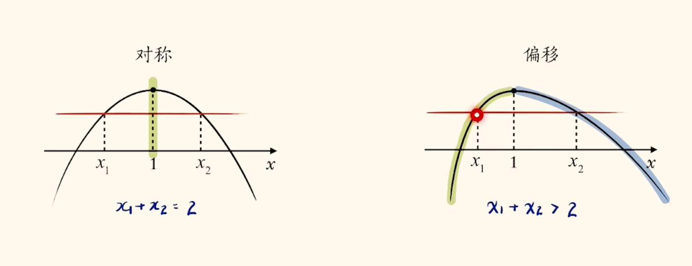

# 极值点偏移

## 概念

极值点偏移, 就是对于一个函数来说, 它并非完全对称(函数值相等的两个点$\frac{x_1 + x_2}{2} = x_{mid} = x_极$), 而是$"$长歪了$"$(符合$\frac{x_1 + x_2}{2} = x_{mid} < x_极$ 或 $\frac{x_1 + x_2}{2} = x_{mid} > x_极$的函数). 题目一般会要求我们证明一个关于$x_1$ 和 $x_2$(不一定对称)的不等式(不一定是相加, 但很多时候都要转换为$x_1 + x_2$).

解决策略(本质都是为了 __消元__ ):

1. 单调性(与根有关的问题常见策略)$+$构造函数
2. 齐次式或比值换元
3. 指对均值不等式

---

## 单调性$+$构造函数

其实本质就是极值点两侧各有单调性, 只要用题目条件把$x_1$和$x_2$首先放到不等号 __两边__ , 然后发现单调性一致(必须得放在 __同一个单调区间__ 内)就可以构造函数然后$"$穿衣服$"$了, 然后使用题目给的$f(x_1)$和$f(x_2)$的关系消元即可得到一个只关于一个变量的不等式, 然后就变成证明不含参不等式的题目了.

那么其实证明不等式也有很多方法. 如对称的分式直接十字相乘, 避免分式难处理; 变量在指数上使用下头公式; 对数内是一个包含变量的一大坨, 考虑换元; 有多个指/对数时指数找朋友, 对数单身狗; 对于有平方项和减号的式子考虑平方差; 对于分式可以尝试去倒数(就像对于指数考虑下头一样); 判断(导)函数是否恒大于/小于零, 有单调性的话可以尝试猜根等等.

若要求的不等式不对称, 可以考虑是两个不等式相加得到的结果, 如$x_1 + 2x_2 > 3$可以由$x_1 + x_2 > 2$及$x_2 > 1$相加得到.

---

*以上所有内容均为个人整理的$一数$公开课程笔记

本作品采用 知识共享署名-非商业性使用 4.0 国际许可协议 (CC BY-NC 4.0) 进行许可.
$\textcopyright$ $2025$ $Zheng$
