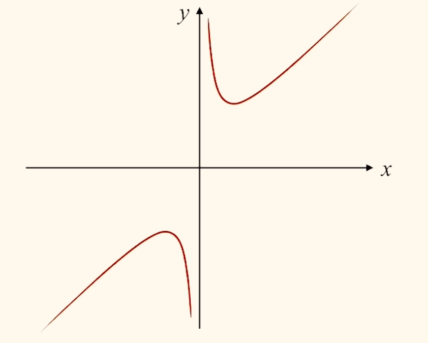
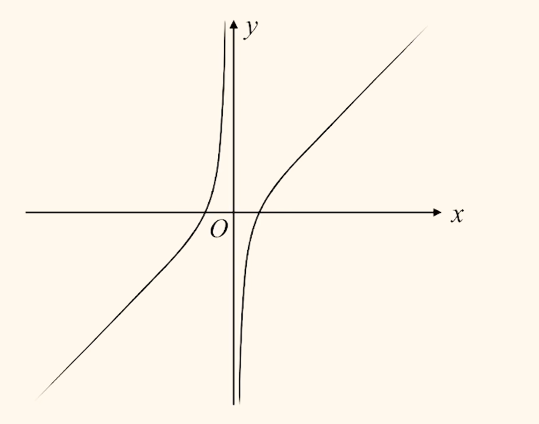
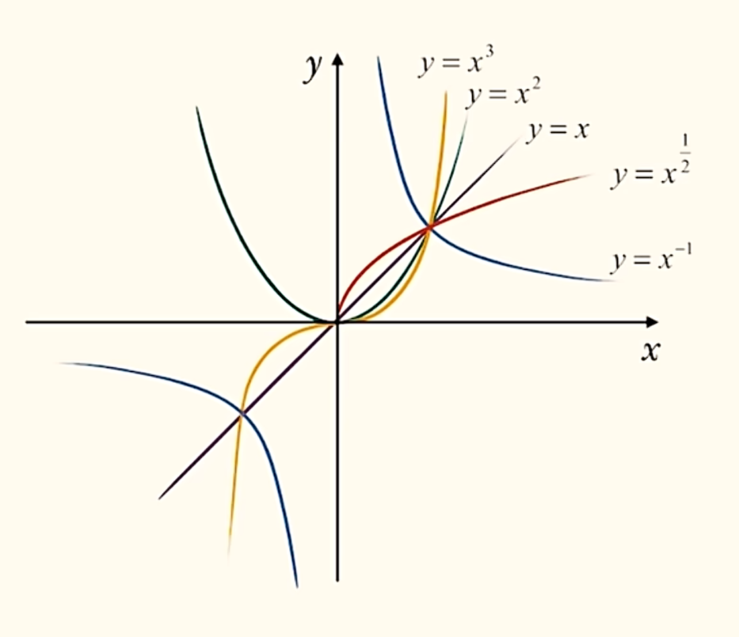
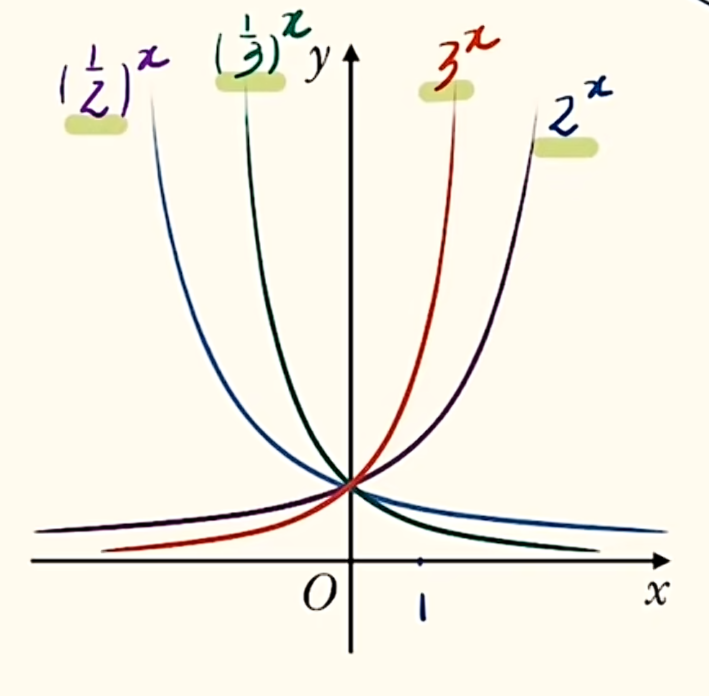
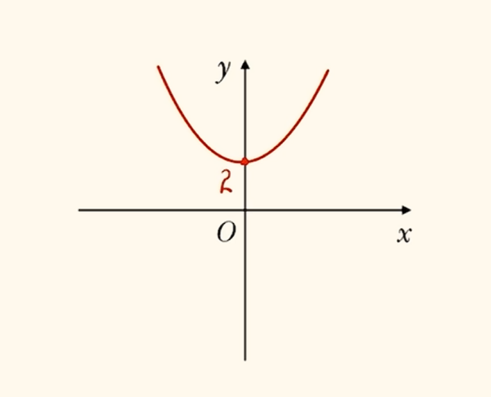
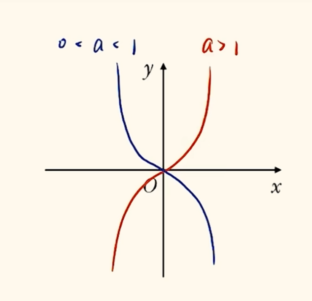
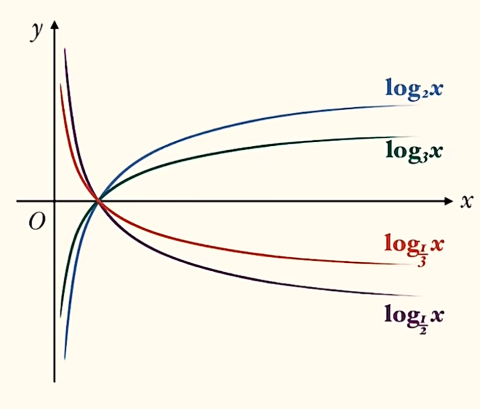
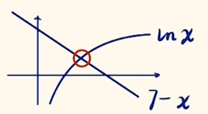
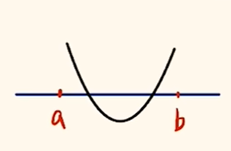
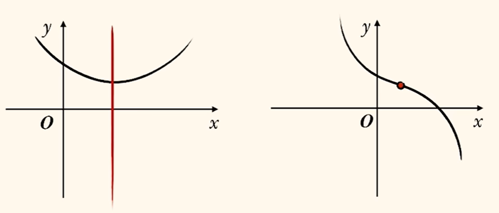

# 函数

我们使用 $f(x)$ 表示关于 $x$ 的函数 $f$ . 括号中的内容表示函数自变量的取值. 定义域为自变量的取值范围, 值域为因变量的取值范围. 

区间: $[a, b]$ 表示闭区间, 左右端点可以取得; $(a, b)$ 为开区间, 端点取不到; $[a, b), (a, b]$ 同理. 要求 $b > a$ . 

定义域的取值范围:
若已知函数表达式, 则根据表达式的特性确定定义域. 一般来说一共以下五种: 
1. 分式分母不为零
2. 根式下大于等于零
3. 零次幂底数不为零
4. 正切函数定义域
5. 对数真数大于零
 
抽象函数把握住 $f(x)$ 定义域不变即可, 即括号中的表达式取值范围一致. 

求解析式可以用以下方法: 
1. (已知函数类型)待定系数法
2. 换元或配凑或整体代换(已知 $f(\dots)$ 求 $f(x)$ )
3. 构造方程组(当同时出现两个不同 $f(\dots)$ 时, 通过将 $x$ 代换使得两个 $f(\dots)$ 互换, 如 $x \to -x, x \to \frac{1}{x}$)

注意求出表达式一定要求定义域. 

分段函数可以通过画图来避免分类讨论. 

求值域先画图, 后根据定义域截图像. 

## 分式函数求值域

### 一次比一次

若分式为 $\frac{ax + b}{cx + d}$ , 则竖直渐近线为令分母为零时自变量的取值 $x = - \frac{d}{c}$ , 水平渐近线为 $y = \frac{a}{c}$ (最高次项系数之比). 确定了渐近线后只需要带入特殊点即可画图, 一般选择 $(0, f(0))$ .

### 对钩与双刀函数

对钩函数是 $f(x) = ax + \frac{b}{x}, a, b > 0$ 所对应的函数图像. 对勾函数 $x > 0$ 时的最小值可以有基本不等式求得. 

双刀函数是 $f(x) = ax - \frac{b}{x}, a, b > 0$ 所对应的函数图像. 

### 二次比一次/一次比二次

换元一次的部分. 

### 二次比二次

凑分母把分子换为一次即可. 

## 恒成立问题

恒成立问题可以结合实际例子翻译问题(即考虑最极限的边界情况). 

恒成立即求函数最值. 可以考虑一下三种方法: 
1. 分类讨论
2. 必要性探路
3. 分离参数

若有双变量恒成立问题, 先翻译一侧, 然后固定这一侧去翻译另一侧, 如 $\forall x_1, x_2, f(x_1) \le g(x_2)$ , 先有 $f(x_1)_{max} \le [g(x_2)]$ , 再有 $[f(x_1)_{max}] \le g(x_2)_{min}$ ( $[]$ 括起表示固定, 看作常数). 当然更建议直接用实际例子. 然后着手考虑两侧均有最值的不等式, 一般先将一侧最值求出来. 

### 动轴定区间问题

分类讨论并注意两端点与顶点取值即可. 

### 必要性探路

即代入边界值得到一些粗糙但成立的结论从而避免不必要的分类讨论. 当然必要时还是需要分类讨论. 

### 分离参数

即把参数单独放到不等号一侧, 变为分析函数的问题.

## 单调性

注意单调区间之间不能用并集符号连接, 应该用与. 单调区间一定在定义域内, 故写单调区间建议全部开区间. 

分段函数看增减性时要注意两段之间的突变是向上还是向下. 

证明单调性可以利用定义(作差/作比)或求导. 详见导数章节, 此处不再展开. 

出现 $f(\dots) \gtreqless f(\dots)$, 考虑利用单调性"脱衣服", 变为括号内式子的不等关系. 当然, 其逆运算穿衣服在需要知道两个函数值大小关系时也有用. 或者, 若出现 $f(\dots) \gtreqless m$, $m$ 为常数时, 要找对应的 $f(\dots) = m$ 从而转化为可以脱衣服的形式. 当然, 穿脱衣服时由于需要将内容放入 $f()$ 的括号中, 故前提先满足定义域. 

常见隐含单调性的式子有: 
1. $当 x_1 > x_2 时, f(x_1) > f(x_2) 恒成立$
2. $(x_1 - x_2)[f(x_1) - f(x_2)] > 0$
3. $\frac{f(x_1) - f(x_2)}{x_1 - x_2} > 0$
4. $(x_1 - x_2)[x_1f(x_1) - x_2f(x_2)] > 0$
5. $(x_1 - x_2)[\frac{f(x_1)}{x_1} - \frac{f(x_2)}{x_2}] > 0$
6. $\forall x_1, x_2 \in (0, +\infty), x_1 > x_2, 有 \frac{f(x_1)}{x_2^2} - \frac{f(x_2)}{x_1^2} > 0$
7. $(x_1 - x_2)[x_2^2f(x_1) - x_1^2f(x_2)] > 0$

很多时候见到形式相似的就要猜条件是关于单调性的. 还要有意识的将相同变量放一起, 不同变量放两边. 有时也能化简出关于另一个函数的单调性(如上述 $4$, 就有 $g(x) = xf(x)$ 的单调性, $5, 6$同理). 上述 $7$ 可以考虑左右同除 $x_1^2x_2^2$ 来分离变量构造函数, 这也是常见技巧. 

### 复合函数

复合函数的单调性满足同增异减, 即 $y = f(g(x))$ , 若 $f(x), g(x)$ 均为增/减函数, 则 $y$ 为增函数; 若 $f(x), g(x)$ 一增一减, 则 $y$ 为减函数. 

函数中若多次出现相同结构(整式)考虑设出来构造复合函数.  

## 奇偶性

遇见一个复杂函数要从单调性与对称性(奇偶性)两方面入手. 

奇函数即函数图像关于原点中心对称, 满足 $f(x) = -f(-x)$; 偶函数即函数图像关于 $y$ 轴轴对称, 满足 $f(x) = f(-x)$ .

可以注意到奇函数的一个特性: 若函数在 $x = 0$ 处有定义, $f(0) = 0$, 很多时候这是一个隐含条件. 比如在已知奇偶性求参数的题型里, 我们一般代特殊值解决, 如 $0, \pm 1$ .

函数的奇偶性为我们研究函数提供便利, 若已知函数奇偶性, 那么作图可以减小一半工作量(当然题目会只给你一半解析式让你求另一半, 利用好负号即可); 它们的式子还隐含着奇函数可以把 $f(-\dots)$ 中的负号提出来(当然也可以放进去), 偶函数可以直接删掉其中的负号. 

一个函数具有奇偶性的前提是其定义域对称. 故判断奇偶性要先看定义域是否对称. 已知奇偶性求参数取值也可以使用对称的定义域来解出参数. 

常见的奇函数有: 
1. $y = x^{2k-1}, k \in \mathbb{Z}$
2. $y = ax \pm \frac{b}{x}$

常见的偶函数有: 
1. $y = x^{2k}, k \in \mathbb{Z}$
2. $y = |x|$

当然, 具有奇偶性的函数加减乘除后的函数也有规律. 
- 奇函数 $+$ 奇函数 $=$ 奇函数
- 奇函数 $+$ 偶函数 $=$ 非奇非偶函数
- 奇函数 $\times$ 奇函数 $=$ 偶函数
- 奇函数 $\times$ 偶函数 $=$ 奇函数

可以使用特殊函数或 $x, x^2, x^3, x^4$ 加减乘除来记忆. 当然以上加/减, 乘/除可以替换.

当遇见奇函数 $+$ 非奇非偶函数(但看起来很像典型的奇/偶函数的变形)时, 可以考虑构造 $f(x) + f(-x)$, 可以消掉奇函数(相加为零)得到一些非奇非偶函数内蕴含的关于中心对称的式子. 

## 对称性

除了奇偶性以外, 更一般的对称性也可以用表达式体现. 
$$轴对称: f(a + x) = f(b - x)\\
中心对称: f(a + x) + f(b - x) = c$$

可以发现, 轴对称两个 $f$ 为等号(或移项后负号)相连, 且两括号内相加可以消掉 $x$, 用中点坐标公式求一下即有对称轴: $x = \frac{a + b}{2}$ .  
中心对称两个 $f$ 用加号相连, 且式中存在常数项; 括号内两式相加也可消掉 $x$, 易求对称中心 $(\frac{a + b}{2}, \frac{c}{2})$. 

二者的共性是两括号中未知数一正一负且系数相反, 相加可以消掉. 但周期性的表达式不同, 括号内未知数同号: 
$$f(x + a) = f(x)$$
其中 $a$ 为周期. 其实, 只要括号内同号均可以翻译成周期. 如: 
$$
f(x + a) = - f(x), 周期为 2a; \\
f(x + a) = \frac{k}{f(x)}, 周期为 2a. \\  
$$
注意 $f(x + a) = -\frac{k}{f(x)}$ 的周期是 $2a$ 而非 $4a$ , 即上面 $k$ 可以取负数而不影响周期. 上述二式用迭代法即可证明. 当然, 我们遇见括号内均为同号但表达式比较复杂时, 可以考虑往下迭代并带入原始表达式, 基本上可以化简. 如 $f(x + 1) = f(x) - f(x - 1)$ 迭代后(括号内各项加一, 做等式左侧同样的操作)得到 $f(x + 2) = f(x + 1) - f(x)$, 代入 $f(x + 1)$ 有 $f(x + 2) = f(x) - f(x - 1) - f(x) = f(x - 1)$. 

中心对称与奇函数一样, 对称中心是完全已知的点, 若其在对称中心有定义, 则必经过对称中心是一个隐含条件. 

两个对称性可以推导周期性. 若:
$$
两条对称轴x = a, x = b \Rightarrow T = 2|a - b|; \\
两个对称中心 (a, k), (b, k) \Rightarrow T = 2|a - b|; \\
一条对称轴一个对称中心 x = a, (b, k) \Rightarrow T = 4|a - b|. 
$$

可以使用三角函数图像记忆. 

式子中出现 $f(x), f(y)$ 等多个未知数, 一般先要代特殊点. 一般尝试代 $0, \pm 1, \pm x, \pm y, \pm \frac{1}{x}, \pm \frac{1}{y}$ 等. 若题目求证对称轴或对称中心, 需要先自己构造代数式然后直接代换, 如 $f(2x) + f(2y) = 2 f(x + y)f(x - y)$, 求证 $(\pi, 0)$ 为对称中心, 构造 $f(\pi + x) + f(\pi - x) = 0$. 然后令 $2x$ 取 $\pi + x$, $2y$ 取 $\pi - x$ 化简即可根据题目其他条件证得. 要用定义证明这种函数的单调性, 还要善于利用奇偶函数移动负号与题目中的表达式. 

为了观察方便, 像 $f(2x - 1)$ 等形式求证其对称轴/对称中心可以现将其设为 $g(x)$ 列表达式, 最后替换回去. 这也是唯一严谨的证明方式(画图不严谨).

遇见两个 $f(\dots)$ 或多个 $f(\dots)$ 相加 $\gtreqless$ 一个值, 则可以考虑函数具有对称中心. 

## 幂函数

形如 $f(x) = x^a$ 的函数. 注意系数必须为 $1$. 

注意指数是分数时需要考虑根式限制的定义域. 还有指数运算时指数上的分数约分需要考虑对结果正负所带来的影响. 遇见根号变为指数方便运算. 注意 $\sqrt[n]{\dots^n}$ , 若 $n$ 为偶数则开出来为 $|\dots|$ .

恒过定点 $(1, 1)$ .

## 指数函数

形如 $f(x) = a^x, a>0, a \ne 1$ 的函数. 

值域: $(0, +\infty)$ ; 定点: $(0, 1)$ .

若出现含参指数型函数求定点, 只需要找与参数取值无关的点即可.

复杂解析式可以考虑变形(上下同时除以一个单项式等)使未知数集中在一起便于分析. 

类二次函数: $y = a^x + a^{-x}$ ;  
类三次函数: $y = a^x - a^{-x}$ .  

类二次函数是偶函数, 类三次函数是奇函数. 二者与对钩, 双刀函数的图像类似地可以用"渐进"的思想来不严谨地画. 

这两种函数与 $a^{2x} + a^{-2x} \pm 2$ 存在平方关系, 两种同时存在时可以构造复合函数转化为二次函数解决.

$$y = \frac{a^x - a^{-x}}{a^x + a^{-x}}\\
y = \frac{a^x - 1}{a^x + 1}$$

以上代表了两类奇函数. 即使上述二式分子分母调换, 或减号前后倒置, 均不影响其为奇函数. 只要见到分子分母同有相似的指数与其倒数/相似的指数与常数且上下连接符号相反即可猜想其为奇函数. 

典型的奇函数还有: 
$$y = \ln \frac{x + a}{x - a}\\
y = \ln(\sqrt{x^2 + 1} \pm x)$$

第一种特征为对数里套了一个大分式, 第二种特征为对数里套了一个大根式. 

## 对数函数

形如 $f(x) = \log_ax, a > 0, a \ne 1$ 的函数为对数函数. 其中 $x > 0$, 定义域为 $(0, +\infty)$ , 特别注意. 

特殊地, $\log_a1 = 0; \log_aa = 1$, 这也是函数图像中的定点($(1, 0)$). 

有: $a^{\log_ab} = b, x = \log_aa^x$ , 体现了指对运算为互逆运算. 有时解对数不等式需要使用此变形, 如 $\log_a2 < 2, 0< a <1  \Rightarrow a^{\log_a2} > a^2 \Rightarrow  2 > a^2$ .

下头公式: $\log_{x^m}y^n = \frac{n}{m}\log_xy$ . 逆用也可以上头. 推广可得 $\log_xy = \log_{x^m}y^m$ .

底数相同时, 对数相加减, 真数乘除: $\log_aN + \log_aM = \log_aNM, \log_aN - \log_aM = \log_a\frac{N}{M}$. 与常数相加时考虑将常数改写为对数的形式. 

遇见指数化为对数一般更方便. 

当底数不同时要先换底, 换底公式: $\log_xy = \frac{\log_ay}{\log_ax}$ . 这里 $a$ 任意取值($a > 0, a \ne 1$), 一般考虑 $2, 10, e$ 等. $e \approx 2.71828$ . 推广令 $a = y$ 可得 $\log_xy = \frac{1}{\log_yx}$ , 在真数相同底数不同时用于调换真数底数的位置.

记 $\log_{10}x, \log_ex$ 分别为 $lgx, lnx$ .

有一类题会在题目中给很多数据(如 $\lg2 = 0.3$), 有时需要化简含有如 $10^{0.3}$ 的式子, 由已知可得 $10^{0.3} = 2$ , 这种条件可能要反复用好几次, 发现不会化简就去题目已知数据中找相关数字. 

对数的估算常用相邻会计算的对数确定范围, 如 $\log_5\sqrt5 < \log_54 < \log_55 \Rightarrow \frac{1}{2} < \log_54 < 1$ .

## 比大小

### 找中间值

一般看与 $0/1$ 的大小关系. 有时也可能需要与其他数字比较. 若三个数中有一个已知, 则可能要以此为中间值. 有时一个数值十分接近一个特殊值, 考虑放缩. 若题目实在没有提示, 需要先估值. 

### 构造函数/数形结合

找出相同结构构造函数画图像看单调性, 或者将多个函数图像画在同一个坐标系里观察. 

### 记忆数值

看个人喜好. 
$$\ln2 \approx 0.69, \ln3 \approx 1.1, \ln5 \approx 1.61, \ln\pi \approx 1.14\\
\sqrt2 \approx 1.414, \sqrt3 \approx 1.73, \sqrt5 \approx 2.23, \sqrt\pi \approx 1.77, \sqrt e \approx 1.65\\
e^2 \approx 7.39, e^3 \approx 20.09, e^{0.1} \approx 1.105, \pi^2 \approx 9.8$$

| $$x$$      | $$2$$ | $$3$$ | $$4$$ | $$5$$ | $$6$$ | $$7$$ | $$8$$ | $$9$$ | $$10$$ |
| ---------- | ----- | ----- | ----- | ----- | ----- | ----- | ----- | ----- | ------ |
| $$lnx$$ | $$0.69$$ | $$1.10$$ | $$1.39$$ | $$1.61$$ | $$1.79$$ | $$1.95$$ | $$2.08$$ | $$2.20$$ | $$2.30$$ |

| $$x$$   | $$2$$ | $$3$$ | $$4$$ | $$5$$ | $$6$$ | $$7$$ | $$8$$ | $$9$$ | $$10$$ |
| ------- | ----- | ----- | ----- | ----- | ----- | ----- | ----- | ----- | ------ |
| $$\sqrt x$$ | $$1.41$$ | $$1.73$$ | $$2.00$$ | $$2.24$$ | $$2.45$$ | $$2.65$$ | $$2.83$$ | $$3.00$$ | $$3.16$$ |

### 放大差距

若一个数的粗略范围包含另一个数, 可以考虑两者同时平方/立方/取指数/乘/加一个大数等操作来放大差距, 有时大小关系就出来了. 

### 糖水不等式

真分数: $a > b > 0, m > 0 \Rightarrow \frac{b}{a} < \frac{b+m}{a+m}$;   
假分数: $b > a > 0, m > 0 \Rightarrow \frac{b}{a} > \frac{b+m}{a+m}$. 

一类十分经典的对数大小比较: $\log_43 < \log_54$. 

可以由糖水不等式证明: $\frac{\ln3}{\ln4} < \frac{\ln3 + \ln\frac{5}{4}}{\ln4 + \ln\frac{5}{4}} = \frac{\ln\frac{15}{4}}{\ln5} < \frac{\ln\frac{16}{4}}{\ln5} = \frac{\ln4}{\ln5} = \log_54$ .

关于此类对数比较的小结论: $\log_mn$ 先全部换底得到的$\frac{\ln n}{\ln m}$, 发现若 $n - m$ 为定值, 则当 $n, m \to +\infty$, $\frac{\ln n}{\ln m} \to 1$, 故只需要判断任意一项是大于 $1$ 还是小于即可完成比较.

## 函数零点

函数零点是 $f(x_0) = 0$ 时 $x_0$ 的值(而非一个点$(x_0, 0)$, 这与极值点很相似). 一个函数可以有多个零点.  

函数零点等价于图像与 $x$ 轴交点, 也等价于 $f(x) = 0$ 方程的解. 当然, $f(x) = 0$ 方程可以移项等变为两个函数的交点问题, 此类问题可以画图解决. 一般遇到复杂函数需要画图找根的时候可以拆为两个简单函数的交点.   

例题: $a = e^{7 - a}, 3 + lnb = e^{4 - lnb}, ab = \_\_\_\_\_\_. $

发现 $lnb$ 的结构总出现, 考虑换元. 注意到题目中两等式形式十分相似, 且换元时常常连同系数常数一起换掉以简化, 还有可以得到两个左侧为未知数右侧为复杂式子的优秀结构. 故令 $c = 3 + lnb \Rightarrow c = e^{7 - c}$, 发现与 $a = e^{7 - a}$ 形式一致, 为同一方程的两根. 由于为超越方程, 考虑画图分析. 

发现方程仅有一解, 得到 $a = c$. 即有 $a = 3 + lnb$. 考虑到问题中 $ab$ 地位相等, 且想从 $lnb$ 得到 $ab$ 需要 $lna + lnb$, 故使用 $a = e^{7 - a} \Rightarrow lna = 7 - a$ 代换 $a$ , 得到 $3 + lnb = 7 - lna, ab = e^4$ . 

### 零点存在定理

若 $f(x)$ 在 $[a, b]$ 上图像为一条连续不断地曲线, 且 $f(a) \cdot f(b) < 0$ , 则 $f(x)$ 在 $[a, b]$ 上必有零点. 注意这个结论一般不能逆用, 如图. 但若函数为单调函数(或此范围内单调), 则可以逆用. 

## 函数不等式

首先判断对称性与奇偶性. 若始终单调, 则直接脱衣服; 若如图单调性变化且存在对称轴, 则要将函数值大小比较翻译为到对称轴的距离比较(如图, 对称轴 $x = a$ , 则 $f(m) > f(n) \Rightarrow |m - a| > |n - a|$); 若函数单调且存在对称中心, 则要将函数值之和与对称中心纵坐标关系翻译成两点横坐标之和与对称中心的横坐标之间的关系(如图, 对称中心 $(a, b)$, $f(m) + f(n) > 2b \Rightarrow m + n < 2a$).

## 函数绝对值变换

$|f(x)|$ 将 $x$ 轴下方图像翻上去; $f(|x|)$ 先画 $x$ 正半轴, 再对称到负半轴上.