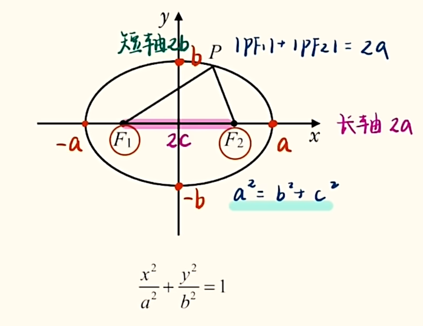

# 椭圆

## 基础内容:

焦点位置: 标准方程分母上的数字哪一个大就在哪一个上面对应字母的轴上.
离心率$e$: 刻画椭圆的扁平程度.

$$
e = \frac{c}{a}, e \in (0, 1)
$$

当$e \to 0$时, 椭圆越趋近于一个圆($0$比较圆); 当$e \to 1$时, 椭圆越扁($1$比较扁).

## 定义:

### 第一定义

内容: 两定点$F_1, F_2$到一动点$P$距离之和是定值$2a$的点集, 即:

$$
|PF_1| + |PF_2| = 2a
$$

## 求离心率

本质: 找$a, b, c$的关系.
补充公式(不用记, 联立$a^2 = b^2 + c^2$与$e = \frac{c}{a}$即可):

$$
e =
$$

特殊值法(选填可用): 因为离心率是比值, 所以可以代特殊值(如$1$)求离心率.
齐次式: 同时除以$a^i, i \in \{1, 2, 3, \dots\}$整体求解$e$.

## 焦点三角形

构造: 两个顶点是焦点, 一个点在椭圆上的三角形. 一般看见一个椭圆上的点连接了一个焦点, 要连接另一个焦点区构造焦点三角形.
