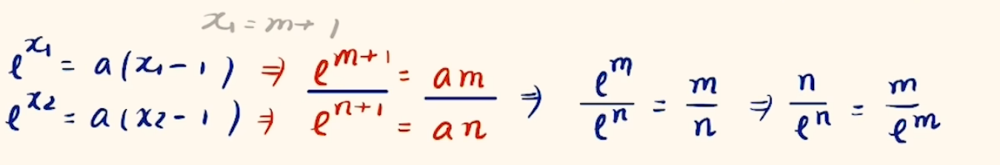

# 数学$tricks$

## 三角变换

1. 三角函数 相加/相乘 想和差化积/积化和差

## 不等式

1. $x_1x_2 < x_1 + x_2$, 看见和与积可能是
   - 完全平方式/基本不等式
   - __因式分解__
2. 想要加法变乘法(如$f(x) = e^x + e^{-x} + \dots \ge 2\sqrt{e^x \cdot e^{-x}} + \dots = 2 + \dots $), 在指数特别复杂且发现倒数不需要精确值(如证明不等式或导函数正负判断)的时候可以使用(一般题目会给使用处的条件引导)

## 参数化简

1. 形式相同的两个式子
   - 平方性质明显则相减(如点差法)
   - 参数是系数则可以相除(好处是消掉参数, 有时还能出现同构, 如图$1$)
     
