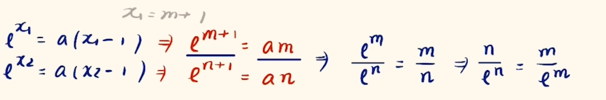

# 数学$tricks$

## 运算技巧

1. 对于高斯函数 $\lfloor x \rfloor$ , 一般考虑拆分子把分数拆为整数 $+$ 小数的部分, 如 $\lfloor \frac{n^2 + 1}{n + 2} \rfloor = n - 2 + \lfloor \frac{5}{n + 2} \rfloor , n \in \mathbb{Z}$ (常出现与数列题目中), 但要注意后面分式部分也不一定小于 $1$ , 需要对 $n$ 较小时特殊考虑. 

## 三角变换

1. 三角函数 相加/相乘 想和差化积/积化和差. 
2. $\frac{1}{\cos^2\theta}, \frac{1}{\sin^2\theta}$ 可以通过将 $1 = \sin^2\theta + \cos^2\theta$ 化为 $\tan^2\theta$ 的表达式. 

## 不等式

1. $x_1x_2 < x_1 + x_2$, 看见和与积可能是
   - 完全平方式/基本不等式
   - __因式分解__
2. 想要加法变乘法(如$f(x) = e^x + e^{-x} + \dots \ge 2\sqrt{e^x \cdot e^{-x}} + \dots = 2 + \dots $), 在指数特别复杂且发现倒数不需要精确值(如证明不等式或导函数正负判断)的时候可以使用(一般题目会给使用处的条件引导)

## 参数化简

1. 形式相同的两个式子
   - 平方性质明显则相减(如点差法)
   - 参数是系数则可以相除(好处是消掉参数, 有时还能出现同构, 如图$1$)
     

## 圆锥曲线

1. 对于两条直线联立, 有时候二式子做比消元往往会更简单.
2. 若所求式是一个定值且其中单独出现了 $x_1, x_2$ 的话:
   - 可以用求根公式表示出来带入. 如果所求式子是一个定值, 可以把求根公式带入后再草稿纸上带入特殊值求出答案然后直接写到答题卡上. __(注意会扣1分步骤分)__
   - 可以把韦达定理二式相除, 即 $\frac{x_1 + x_2}{x_1 \cdot x_2}$ 等于一个很简单的式子 , 移项可以得到 $kx_1x_2$ 与 $x_1 + x_2$ 的关系, 就可以在消掉 $k$ 的同时把 $x_1x_2$ 换成 $x_1 + x_2$ 方便合并同类项, 合并完之后把分子提一个系数出来(目的是让上下两部分对应的项系数相同, 系数是一个带根号的整式没关系, 分母有理化即可), 就可以上下约分了.
3. 角度关系用结论或倾斜角去找斜率关系.
4. 抛物线斜线段比例优先考虑作水平直线转化并且与定义联系.
5. 抛物线焦点弦/焦半径斜率为正或负可能有两种答案要讨论.
6. 用韦达定理时 $A$ 直接在分式中上下同乘即可.
7. 若已经知道某个未知数是定值, 就没必要将其与常数分开了, 比如$(ty_3 + n + 2)(ty_4 + n + 2)$ 中 $n$ 为定值, 将 $n + 2$ 看成整体.
8. 联立两条未知直线时可以考虑用两次三点共线, 用斜率或向量翻译都可. 交点坐标不知道设而不求. 最好是找坐标好写/已知的点与另外两个点用斜率(向量会多一个变量最后还是要做比). 之后两式经过配凑(经过坐标轴上对称两点相加减, 分母复杂分子简单取倒数)一般可以得到一个关系.
9. 设一条直线要先考虑正设还是反设. 一般通过带入的式子确定, 比如带入 $\frac{x_1 - 2}{y_1} + \frac{x_2 + 2}{y_2}$ 就要反设来保持分母为单项式.
10. 若题目圆锥曲线上点太多, 与曲线相交的点很多, 需要用很多参数确定点之间的关系时, 可以尝试直接表示两点之间的关系(特别是经过定点时能直接确定). 具体地, 先用待定系数法为 $x_1 + x_2$ (有时候 $C$ 比 $B$ 复杂)找一个系数使得 $x_1x_2 + \mu x_1 + x_2 = 与参数无关的定值$ , 由于韦达定理分母一致, 所以直接相加不用同分计算量小. 这里待定系数只用确定任意一项之间的倍数即可, 哪项好确定看哪项(一般是常数).
11. 见到 $x_1, x_2, y_1, y_2, x_1y_2, x_2y_1$ 项混在一起且直线经过定点, 可以把类似的项($x_1y_2$ 与 $x_2y_1$, $x_1$ 与 $x_2$, $y_1$ 与 $y_2$)放到一起, 提出公共系数. 然后通过两点式确定经过的定点, 设定点 $(m, n)$ , 直线  $\frac{y_1 - n}{x_1 - m} = \frac{y_2 - n}{y_1 - m}$ , 化简有 $y_1x_2 - x_1y_2 = n(x_2 - x_1) + m(y_1 - y_2)$ .