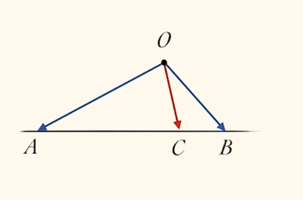
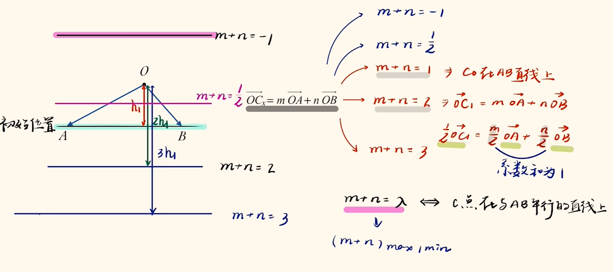
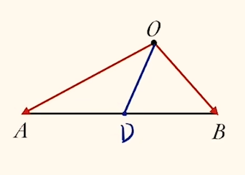
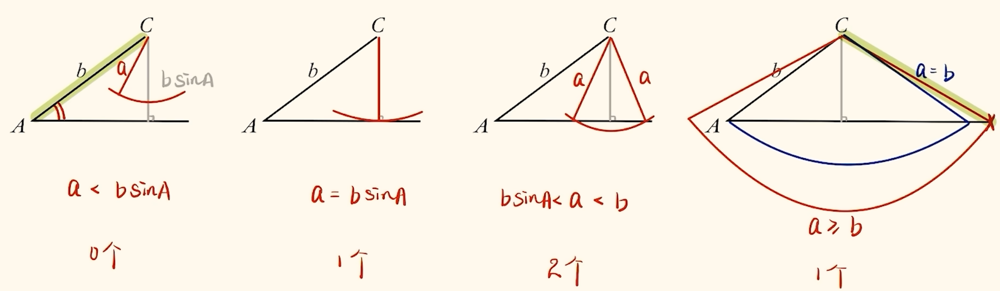
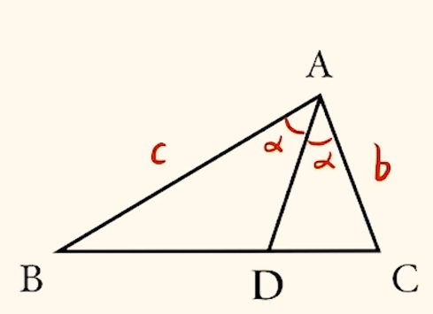
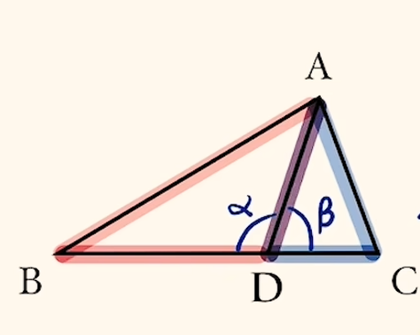
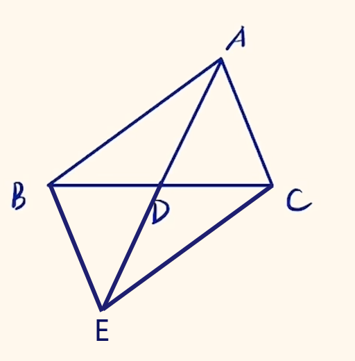

# 平面向量

向量有大小, 有方向, 可以使用几何表示(箭头, 画图)或代数表示(写下起点与终点, 上标箭头表示方向), 如 $\overrightarrow{AB}, \vec{a}, \vec{0}$. 在印刷体中, 向量也可使用粗体表示, 如 $\bm{a}, \bm{0}$ 等. 本 $WIKI$ 默认使用箭头表示以便于初学者阅读, 即便国际标准为粗体. 

注意起点与终点不能调换, 如$\overrightarrow{AB} = - \overrightarrow{BA} = \overleftarrow{BA}$ ( $\overleftarrow{BA}$ 是有向线段的表示方法之一, 不建议向量如此表示). $\overrightarrow{AB}$ 与 $\overrightarrow{BA}$ 互为相反向量, 大小相等, 方向相反. 

向量相等等价于其大小与方向均相等, 与位置无关. 故向量可以随意平移, 且向量共线等价于向量平行($\vec{a} \parallel \vec{b}$). 但在直线模块要严格区分平行与共线, 很多时候要特殊排除共线的情况. 

注意区分线段, 向量与有向线段的概念. 线段有两个端点, 不能移动, 没有方向, $AB = BA$. 有向线段在线段的基础上增加方向, 但不能移动. 

向量的大小称为其模(长), 如 $|\vec{a}|, |\overrightarrow{AB}|$ . 模长为 $1$ 的向量称为单位向量, $|\vec{e}| = 1$ ; 模长为 $0$ 的向量称为零向量, $|\vec{0}| = 0$ . 单位向量不唯一, 因为其方向不唯一. 零向量的方向任意, 其与任意向量均平行, 故向量平行不具有传递性(但若明确说明无零向量则有传递性). 

向量垂直用 $\vec{a} \perp \vec{b}$ 表示, 平行(共线) 用 $\vec{a} \parallel \vec{b}$ 表示. 注意, 平行不等于方向相同, 可能相反. 

注意 $|\vec e| = |\vec e|^2 = \vec e^2 = 1$ , 可能使用 $1$ 的代换, 如 $\vec b^2 - 4\vec e \cdot \vec b + 3 = 0 \Rightarrow \vec b^2 - 4\vec e \cdot \vec b + 3\vec e^2 = 0 \Rightarrow (\vec b - \vec e) \cdot (\vec b - 3\vec e) = 0 \Rightarrow (\vec b - \vec e) \perp (\vec b - 3\vec e)$ .

## 线性运算

向量的加法符合平行四边形法则(共起点)与三角形法则(首尾相连). 遇见很多向量的加法一般考虑首尾相连看起点与终点, 即$\overrightarrow{AB} + \overrightarrow{BC} + \dots + \overrightarrow{YZ} = \overrightarrow{AZ}$ . 

向量减法可以通过相反向量转化为向量加法, 先平移至共起点, $\overrightarrow{OA} - \overrightarrow{OB} = \overrightarrow{OA} + \overrightarrow{BO} = \overrightarrow{BA}$ , 得到的向量为连接两个终点, 方向由后一个向量终点指向前一个向量终点. 

向量的数乘运算即 $\lambda\vec{a}$ , 一个数乘一个向量, 表示向量长度伸缩. 若 $\lambda < 0$ 则向量会反向. 

向量线性运算得到的结果为向量, 故 $0 \cdot \vec{a} = \vec{0}, \lambda \cdot \vec{0} = \vec{0}$ . 

解决平面向量题目画图很方便, 因为向量可以联系几何与代数. 一般将向量共起点放置(小心锐角与钝角的区别, 不能主观臆断为锐角)或首尾相接放置. 需要掌握几种常见的代数语言转化几何图形的方法, 如 $|\vec{a} - \vec{b}| = m, m$ 为定值, 即代表图形为一个圆; $|\vec{a} - \lambda\vec{b}|_{min}$ ( $|\vec{a} + \lambda\vec{b}|_{min}$ 同理, $\lambda$ 取负值即可)表示一个点到一条直线之间的距离, 当 $\vec{a} \pm \lambda\vec{b}$ 图像为直角三角形时取得最小值. 

### 三点共线定理

$$\overrightarrow{OC} = \mu\overrightarrow{OA} + \lambda\overrightarrow{OB}, \mu + \lambda = 1 \Leftrightarrow A, B, C 三点共线$$

对于系数 $\mu, \lambda$ 没有正负要求, 可以为负数. 但当二者均为正数时, $C$ 在 $AB$ 之间, 否则 $C$ 在 $AB$ 外侧, 此时一般首先移项将系数全部变为正数(自己写也是先写正数再移项). 确定 $\mu, \lambda$ 的取值可以通过找对边所占整条线段 $AB$ 的比例, 如 $\mu$ 为 $\frac{BC}{AB}$ , $\lambda$ 为 $\frac{AC}{AB}$ . 可以发现, 此定理与 $AB$ 边上的等分点(比例)关系密切. 

特殊地, 中线的向量式可以用三点共线表示, 即若 $AC = BC$ , 有 $\overrightarrow{OC} = \frac{1}{2}\overrightarrow{OA} + \frac{1}{2}\overrightarrow{OB} \Rightarrow 2\overrightarrow{OC} = \overrightarrow{OA} + \overrightarrow{OB}$ . 

由于图形很像鸡爪子, 所以也可成为鸡爪子模型(但我并不能看出来). 

若三点不共线, 可以由向量伸缩(一般可以算出倍数关系)变为共线. 

等和线是三点共线的推论. 

确定等和线 $\mu + \lambda$ 的值就看 $O$ 到等和线距离是初始距离( $O$ 到 $AB$ )的几倍即可. 

等和线可以由 $\overrightarrow{OA}, \overrightarrow{OB}$ 同时延长 $\mu + \lambda$ 倍后确定, 或者根据 $O$ 到等和线的距离确定, 或 $AB$ 上任意一点 $C$ 延长 $\overrightarrow{OC}$ $\mu + \lambda$ 倍后过点 $C'$ 做 $AB$ 的平行线得到. 

一般出现鸡爪子模型, 问 $\mu + \lambda$ (系数和)最值或取值范围时就需要使用等和线, 在几何图形中找边界情况. 求最值时注意两平行线(等和线)之间的垂线段可以平移, 一般平移到合适的位置计算更方便. 若所求的 $\mu + \lambda$ 带有系数, 如 $2\mu + \lambda$ , 就要找 $\frac{1}{2}\overrightarrow{OA}$ 的等效向量( $2\mu \cdot \frac{1}{2}\overrightarrow{OA}$ 转化后才能用等和线). 

## 数量积

数量积(内积)是向量点乘, 得到一个数值; 外积是向量叉乘, 得到一个新的向量.

数量积公式($\theta$ 为夹角, $\theta \in [0, \pi]$, 即 $\theta = \langle \vec a, \vec b \rangle$):

$$\vec a \cdot \vec b = |\vec a||\vec b|cos\theta$$

变形可得夹角公式 $cos\theta = \frac{\vec a \cdot \vec b}{|\vec a||\vec b|}$ , 此公式的多维形式可与概率统计模块相关系数建立联系. 

计算数量积时小心夹角问题, 必须在共起点的位置判断夹角, 否则可能计算出相反数. 这也提示我们数量积可以用于判断锐/钝/直角, $\vec a \cdot \vec b = 0 \Leftrightarrow \vec a \perp \vec b; \vec a \cdot \vec b > 0 \Leftrightarrow$ 锐角或同向平行; $\vec a \cdot \vec b < 0 \Leftrightarrow$ 钝角或反向平行. 

数量积运算满足交换律, 数乘结合律, 分配律, 但要注意三个向量间的数量积不满足结合律, 即运算顺序有影响, 如 $(\vec a \cdot \vec b) \vec c\ne \vec a (\vec b \cdot \vec c)$ , 因为前者为几倍的 $\vec c$ , 而后者是几倍的 $\vec a$ . 

数量积的一个特性为 $\vec a \cdot \vec a = \vec a^2 = |\vec a|^2$ , 由此可知 $(\vec a + \vec b)^2 = \vec a^2 + 2\vec a \cdot \vec b + \vec b^2$ . 且我们发现当题目中出现模长(如 $|m\vec a + n\vec b|$ )时, 不仅可以从几何意义上入手, 还可以平方转化为数量积关系, 但别忘了开方回来. 

$\vec b$ 上单位向量可以表示为 $\vec e = \frac{\vec b}{|\vec b|}$ , $\vec a$ 在 $\vec b$ 上投影向量 $\vec m$ 就可表示为 $\vec m = |\vec m| \cdot \vec e = |\vec a| \cdot cos\theta \cdot \vec e = |\vec a| \cdot \frac{\vec a \cdot \vec b}{|\vec a||\vec b|} \cdot \frac{\vec b}{|\vec b|} = \frac{\vec a \cdot \vec b}{|\vec b|^2} \vec b$ . 若求 $\vec a$ 在 $\vec b$ 上的投影则为 $|\vec m| = |\vec a|cos\theta = \frac{\vec a \cdot \vec b}{|\vec b|}$ . 

解决数量积问题一般有以下几种思考路径. 

### 定义法

直接使用定义即可, 把握求夹角. 在平面向量部分题目经常设角而非设边. 小心像 $\overrightarrow{OA} \cdot (\overrightarrow{BC} + \overrightarrow{BD})$ 这类一定不要算两个数量积, 而是先考虑找到 $CD$ 中点 $E$ 转化为 $\overrightarrow{OA} \cdot 2\overrightarrow{BE}$ . 

### 投影法

可以不关心其中一个原向量, 而只关心投影后的向量(避免求夹角), 即 $\vec a \cdot \vec b = \vec a \cdot \vec m = \pm |\vec a| \cdot |\vec m|$ , $\vec m$ 为投影向量, 正负号需要讨论确定为其一. 此方法适用于原向量所在位置十分偏僻或轨迹崎岖, 但投影后易于分析, 即, 有一个动的一个不动的(当然两个都固定也可以尝试使用), 谁不动就往谁上投. 

### 极化恒等式

其中 $D$ 为中点, 有: $\overrightarrow{OA} \cdot \overrightarrow{OB} = |\overrightarrow{OD}|^2 - |\overrightarrow{DA}|^2$ , 即中线方减底半方. 注意极化恒等式需要推导后使用. 当两个向量都在乱动时可以尝试, 或底边或中线其一已知时(尤其是底边已知时)尝试, 且极化恒等式要求共起点/共终点或可以转化为共起点. 

有时可能会使用梯形中位线, 实际上就是三角形中位线的推广, 其平行于上下底, 且长度为上下底长度和的一半(三者成等差数列). 

### 拆解法/基底法

拆解法(基底法)就是将数量积运算的两个向量用两个或多个(但基底法一般只选取两个)更好求解的向量表示. 一般拆解法作为最后手段最后尝试, 其近乎万能(但往往不优), 题目多表现为有几个条件在其他方法时用不上或向量横七竖八, 则考虑用条件相关的向量去表示所求的两个向量. 以基底法命名时可以理解为用两个或多个条件多的基底去表示所求向量, 本质也是利用了其他方法用不到的条件. 

条件多的基底多出现在多边形最外围的边, 与圆心连接, 或已知特殊角(特殊角方便计算数量积)的边. 实际上基底法就是更广泛的建系法, 当需要建不垂直的仿射坐标系时(如多个重复单元出现但角度不是直角)可以考虑基底法. 

### 建系法

当垂直条件明显时直接建系. 下文讲解. 

## 建系法

### 平面向量基本定理

若 $\vec e_1, \vec e_2$ 是平面内两个不共线的向量, 那么对这一平面内的任一向量 $\vec a$ , 有且仅有一对实数 $\lambda_1, \lambda_2$ 使得 $\vec a = \lambda_1\vec e_1 + \lambda_2\vec e_2$ . 称 $e_1, e_2$ 为基底. 

题目中给出的基底可以更换, 一般选择边上的向量为基底.  

### 坐标运算

若在 $x, y$ 轴方向上取两个相互垂直的单位向量作为基底, 则可形成平面直角坐标系. 将向量起点平移到原点处, 其终点即为向量坐标, 分解此向量到坐标轴上的过程称为正交分解. 坐标确定, 点与向量一一对应, 向量唯一确定. 实际上坐标更一般地考虑终点坐标减起点坐标得到, 如 $A(x_1, y_1), B(x_2, y_2)$ , 则 $\overrightarrow{AB} = (x_2 - x_1, y_2 - y_1)$ , 模长为 $\sqrt{(x_2 - x_1)^2 + (y_2 - y_1)^2}$ .

若 $\vec a = (x_1, y_1), \vec b = (x_2, y_2)$ , 则:

1. $\vec a \pm \vec b = (x_1 \pm x_2, y_1 \pm y_2)$
2. $\lambda \vec a = (\lambda x_1, \lambda y_1)$
3. $|\vec a| = \sqrt{x_1^2 + y_1^2}$
4. $\vec a \cdot \vec b = x_1x_2 + y_1y_2$ , 可通过将两向量正交分解推得. 

建系后可以将向量的几何问题转化为代数问题. 

对应项相等可以使用. 

需要计算夹角则考虑 $\cos\langle \vec a, \vec b\rangle = \frac{\vec a \cdot \vec b}{|\vec a||\vec b|}$ . 

表示 $P$ 为 $AB$ 最靠近 $A$ 的 $n$ 等分点考虑 $\overrightarrow{AP} = \frac{1}{n} \overrightarrow{AB}$ . 其余同理. 在动点问题中设动点坐标常用. 当然, 对于动态图像也可以设角度, 利用三角函数知识, 需要依据题目判断. 

若遇见圆上的点 $P$ , 对于半径为 $r$ , 圆心为 $(a, b)$ 的圆, 考虑三角换元, $P(a + r\cos \alpha, b + r\sin \alpha)$ . 一般以圆心建系. 

有时动点问题可以先用几何法判断出在何时取到最值, 再建系求解以便计算. 

出现共起点的两向量相加, 尤其是形如 $\overrightarrow{PA} \cdot (\overrightarrow{PB} + \overrightarrow{PC})$ 时, 考虑使用中线的向量式, 记 $G$ 为 $BC$ 中点, 转化为 $\overrightarrow{PA} \cdot 2\overrightarrow{PG}$ 从而方便求解, 后续可使用极化恒等式等方法求解数量积. 

点 $P$ 到圆弧上的点距离最值考虑连接 $P$ 与圆心, 即可求最大/小值. 

出现 $\overrightarrow{OA} + \overrightarrow{OB} + \overrightarrow{OC} = \vec 0$ , 可以考虑此三向量构成矢量三角形, 也可考虑 $O$ 为 $\triangle ABC$ 的中心(重心, 因为满足若 $A(x_1, y_1), B(x_2, y_2), C(x_3, y_3)$ , 则 $O(\frac{x_1 + x_2 + x_3}{3}, \frac{y_1 + y_2 + y_3}{3})$ ), 或移项得 $\overrightarrow{OA} + \overrightarrow{OB} = -\overrightarrow{OC}$ 等后平方等进行代数运算. 

## 解三角形

默认 $\triangle ABC$ 中 $\angle A$ 的对边为 $a$ , 其余同理. 

余弦定理:

$$a^2 = b^2 + c^2 - 2bc \cdot \cos A$$

及其推论:

$$\cos A = \frac{b^2 + c^2 - a^2}{2bc}$$

可用于解决涉及三边一角的问题. 出现平方项相加减也可考虑. 

正弦定理:

$$\frac{a}{\sin A} = \frac{b}{\sin B} = \frac{c}{\sin C} = 2r$$

其中 $r$ 为外接圆半径, 故题目出现外接圆时可以考虑, 此公式可使用外接圆推导得出. 因为三角形中角的范围为 $(0, \pi)$ , 故 $\sin$ 可以做分母, 但 $\cos$ 可能等于零( $\frac{\pi}{2}$ ). 可以发现在存在两对对边对角时可以考虑正弦定理. 其推论:

$$a = 2r\sin A$$

或

$$a : b : c = \sin A : \sin B : \sin C$$

意味着在式子中齐次的( $2r$ 可以消掉)边角可以互化, 不论是等号两侧还是分数线上下. 三角函数的二次式也可考虑换成边使用余弦定理. 

注意不是题目中含有 $\cos$ 就用余弦定理, $\sin$ 就用正弦定理, 需要根据其他条件判断, 因为 $\sin$ 与 $\cos$ 可以转化. 

射影定理:

$$a = b\cos C + c \cos B$$

证明比较显然, 过 $A$ 做 $BC$ 垂线即可. 

面积公式: 

$$S = \frac{1}{2}ab\sin C$$

本质上就是用三角函数表示高. 公式中蕴含着两边夹一角即可得出三角形面积. 

有时我们已知两角, 但可能不是特殊角, 可以考虑根据内角和为 $\pi$ 求出第三角就可能出现特殊角或便于使用正余弦定理. 根据诱导公式始终存在:

$$\sin(B + C) = \sin A\\\cos(B + C) = -\cos A$$

此式也可将一个不相关, 出现次数少的角转化成另外两角, 尤其是三个角同时出现时可以考虑. 

三角形解的个数问题一般为 $SSA$ 式, 即给出两边及一个非夹角的角, 讨论解得个数. 要先判断是否为 $SSA$ 型. 已知 $a, b, A$ , 先画出角 $A$ , 考虑 $a$ 的取值, 其最短情况为 $a \perp c$ 时, $a = b \sin A$ , 故若 $a < b \sin A$ 时无解; 若 $a = b \sin A$ 时有一解; 若 $b > a > b \sin A$ 时有两解; 若 $a \ge b$ 又仅一解. 

当然由于已知两边一角, 可以根据余弦定理求第三边, 以 $c$ 为变量构建一元二次方程, 寻找正根的个数即可, 因式分解或使用 $\Delta$ 与韦达定理或画函数图像. 

有时候化简题目条件可以得到一个关于边或角的二次式, 考虑因式分解, 分类讨论, 一般能舍弃一个解. 一个三角函数可能对应多个角, 同样考虑分类讨论, 一般也可舍弃一个解. 

最值问题有两种解决方式: 化成边, 余弦定理 $+$ 基本不等式(适用于系数对称时, 且不能解决范围问题(因为只有一侧)); 化成角, 正弦定理 $+$ 三角恒等变换(通过 $a = 2r \cdot \sin A$ 边化角, 前提为已知对边对角能求 $2r$ ). 后者更普适, 但计算量较大. 

注意锐角三角形要求三个角均为锐角, 由此可能也对某个角的最小值有所限制. 

### 多三角形

若出现角分线, 考虑面积, 可以使用面积和 $S_{\triangle ABC} = S_{\triangle ABD} + S_{\triangle ADC}$ , 得到有关角分线 $AD$ 长度的式子, 注意与下一个无 $AD$ 长度的方法区分. 或面积比 $\frac{S_{\triangle ABD}}{S_{\triangle ADC}} = \frac{AB}{AC} = \frac{BD}{BD}$ , 即角分线定理, 一般用后面的等式, 当出现临边或底边比例时考虑, 当然两种方法可以同时使用. 

若已知底边比例(若未涉及角分线不人为引入, 故不用上述方法), 可以考虑使用三点共线定理(鸡爪子), $\overrightarrow{AD} = \mu\overrightarrow{AB} + \lambda\overrightarrow{AC} \Rightarrow \overrightarrow{AD}^2 = (\mu\overrightarrow{AB} + \lambda\overrightarrow{AC}), \mu + \lambda = 1$ , 想要转化为模长需要平方, 最终得到中线长度 $AD$ 与顶角 $A$ 的关系. 或使用"双余弦贴贴法", 由于 $\alpha + \beta = \pi$ , 则 $\cos\alpha + \cos\beta = 0$ , 使用余弦定理展开即可得到关于所有边的一个等式, 未出现任何角, 故出现顶角 $A$ 时考虑方法一, 只有边的条件选用方法二. 实际上将方法一中 $\cos A$ 用余弦定理展开即为方法二的式子. 若需要设未知数需要设, 因为已知比例. 

特殊地, 若出现中线始终满足中线长定理: 

$$AB^2 + AC^2 = 2(AD^2 + BD^2)$$

双余弦贴贴法可以得到. 也叫对角线定理, 将三角形以 $BC$ 为对角线补成一个平行四边形 $ABEC$, 满足四条边的平方和等于对角线的平方和:

$$AB^2 + BE^2 + EC^2 + CA^2 = 2(AB^2 + AC^2) = AE^2 + BC^2$$

若出现不规则图形, 多边形等, 考虑看做多个小三角形拼凑而成, 汇聚条件逐步分析即可. 

## 复数

为解决负数开平方的问题, 我们引入虚数. 虚数集和实数集构成了复数集( $\mathbb{C}$ ). 定义 $i^2 = -1$ , 其中 $i$ 为虚数单位. 可以发现 $i$ 的幂次具有周期性, $i^1 = i; i^2 = -1; i^3 = -i; i^4 = 1$, 此后循环. 实际上根据棣莫佛公式在复平面中可以从几何角度理解. 

形如 $z = a + bi, a, b \in \R$ 的数为复数, $a$ 为实部, $b$ 为虚部(不带 $i$ ). $b = 0$ 时为实数, $a = 0, b \ne 0$ 时为纯虚数. 

复数与向量(点)可以一一对应, 即在复平面上, $x$ 轴是实轴, $y$ 轴是虚轴, $z = a + bi$ 对应 $Z(a, b)$ 与 $\overrightarrow{OZ} = (a, b)$ . 由此可以定义虚数的模为 $|z| = \sqrt{a^2 + b^2}$ . 辐角为向量(虚数)与$x$ 轴正方向的夹角 $\theta$ , 通常取 $(-\pi, \pi]$ 内的主值. 可以发现 $a = |z|cos\theta, b = |z|sin\theta$ . $z$ 的共轭复数为 $\bar z = a - bi$ , 几何上二者关于 $x$ 轴对称. 

虚数的模长满足三角不等式 $||z_1| - |z_2|| \le |z_1 + z_2| \le |z_1| + |z_2|$ . 在复平面上的轨迹问题常引入虚数处理, $|z - z_0| = r$ 代表一个圆, $|z - z_1| = |z - z_2|$ 为一条中垂线, 但要注意此类题目可能 $z_0, z_1, z_2$ 是一个实数十分隐晦. 

若 $z_1 = z_2$ , 则 $a_1 = a_2, b_1 = b_2$ (与向量相等一致), 且不可比大小, 只能比较模长. 加减法为虚部实部相加减, 与向量运算一致; 乘法即多项式乘法, 但 $i^2 = -1$ ; 除法需要同乘共轭复数以分母实数化. 复数常用性质有:
1. $z \cdot \bar z = |z|^2 = |\bar z|^2$
2. $z + \bar z = 2a, z - \bar z = 2bi$

虚数的引入很大程度上是为解决二次方程中 $\Delta < 0$ 的情况. 在此情况下有两个共轭虚根 $x = \frac{-b \pm \sqrt{|\Delta|i}}{2a}$ 成对出现. 实际上一元 $n$ 次方程的虚根也都是以共轭的形式成对出现. 由此我们也可类似 $i$ 引入虚数 $\omega^3 = 1$ , 即 $\omega = -\frac{1}{2} + \frac{\sqrt 3}{2} i$ . 可以发现 $\omega^2 = \bar \omega, 1 + \omega + \omega^2 = 0$ (实际上就是解方程 $x^3 = 1 \Rightarrow (x - 1)(x^2 + x + 1) = 0$ 得到的性质, 常用于降次化简). 同理, $omega$ 的幂次也具有周期性, 可用以上性质化简处理, $\omega^1 = \omega, \omega^2 = \bar \omega, \omega^3 = 1$ , 此后循环. 

复数的三角形式为 $z = r(cos\theta + isin\theta), r = |z|, \theta$ 是辐角. 指数形式为 $z = re^{i\theta}$ . 乘除的几何意义为向量旋转与模长的翻倍, 如乘除 $i$ 即可旋转 $90^\circ$ . 

乘法:
$$
r_1(\cos\theta_1 + i\sin\theta_1) \times r_2(\cos\theta_2 + i\sin\theta_2) = r_1 r_2 [\cos(\theta_1 + \theta_2) + i\sin(\theta_1 + \theta_2)] \\
(r_1 e^{i\theta_1}) \times (r_2 e^{i\theta_2}) = r_1 r_2 e^{i(\theta_1 + \theta_2)}
$$
除法:
$$
\frac{r_1(\cos\theta_1 + i\sin\theta_1)}{r_2(\cos\theta_2 + i\sin\theta_2)} = \frac{r_1}{r_2} [\cos(\theta_1 - \theta_2) + i\sin(\theta_1 - \theta_2)] \\
\frac{r_1 e^{i\theta_1}}{r_2 e^{i\theta_2}} = \frac{r_1}{r_2} e^{i(\theta_1 - \theta_2)}
$$

虚数的次方(开方)可以用棣莫弗公式 $(r(cos\theta + isin\theta))^n = r^n(cos(n\theta) + isin(n\theta))$ 理解, 也可用欧拉公式 $re^{i\theta} = r(cos\theta + isin\theta) \Rightarrow (re^{i\theta})^n = r^ne^{i(n\theta)}$ 理解.

欧拉恒等式: $e^{i\pi} + 1 = 0$ .