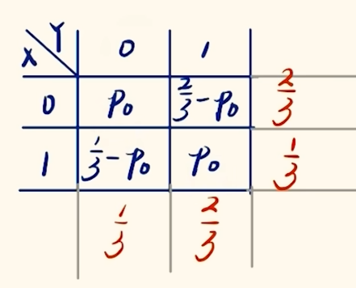
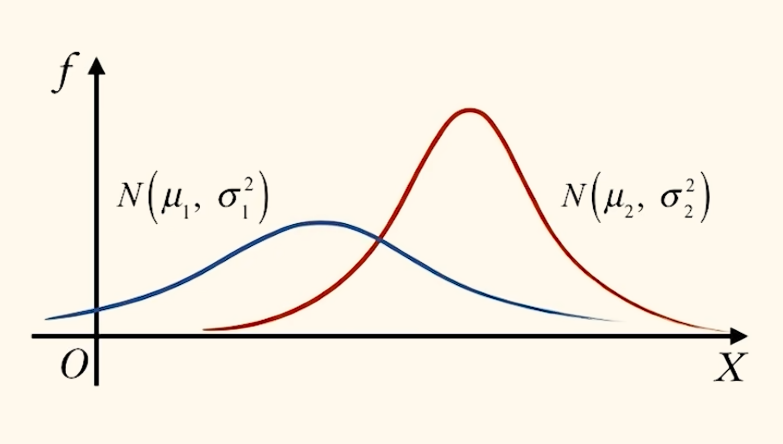
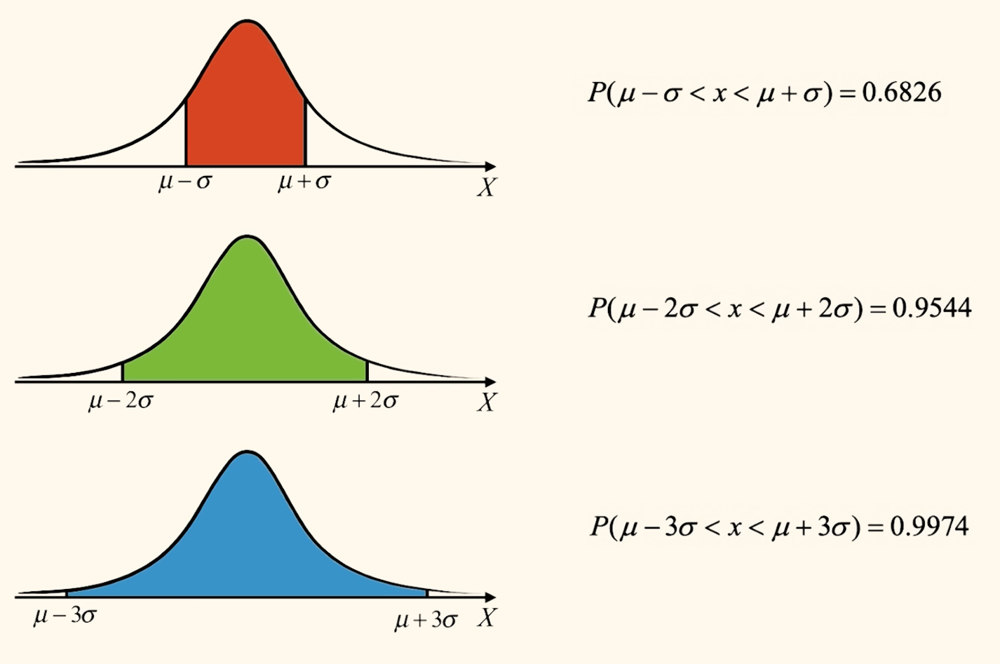
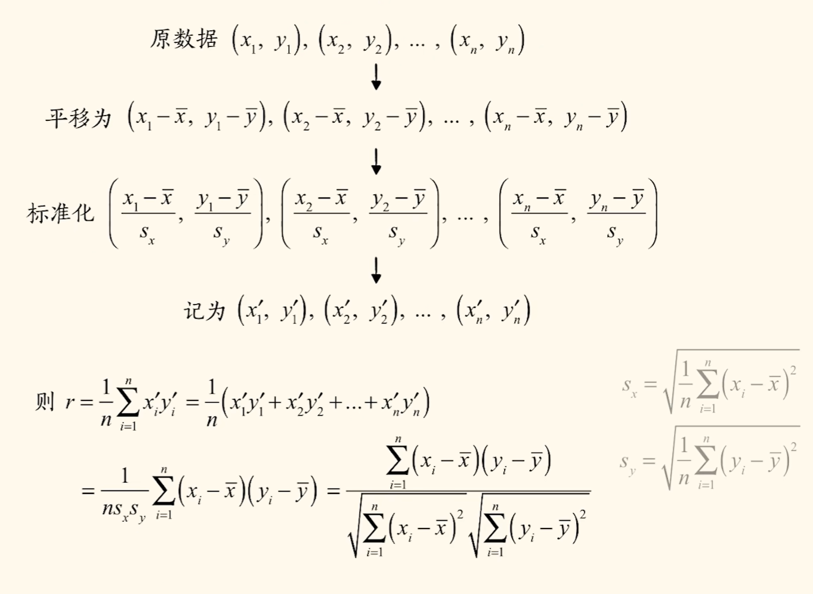
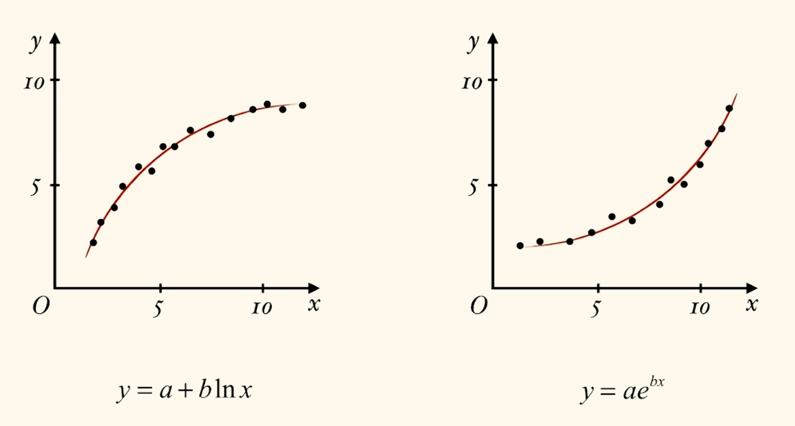
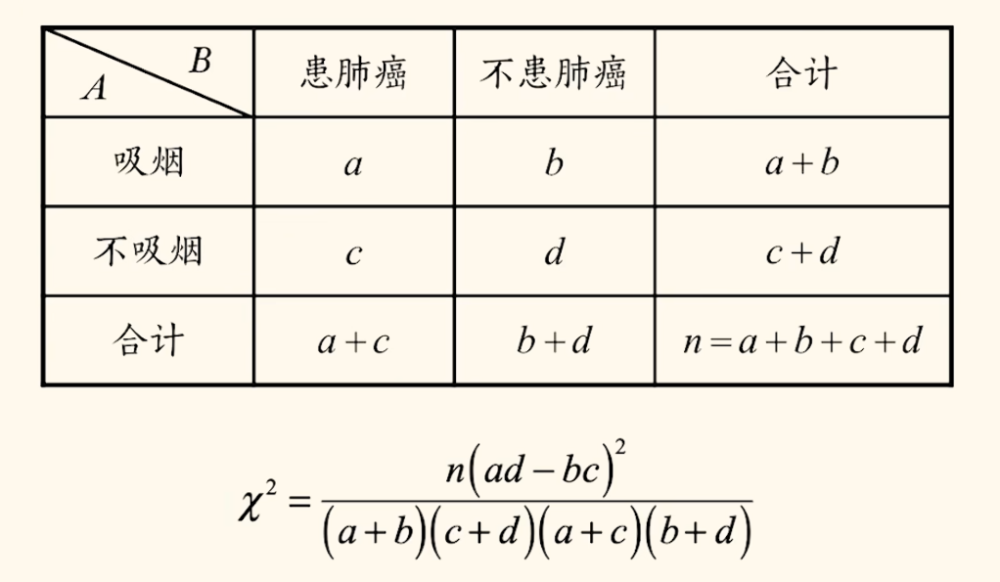
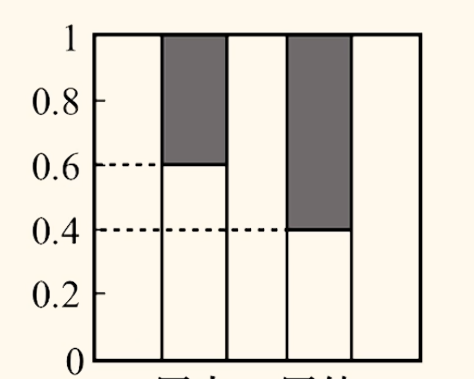

# 概率统计

## 排列组合

分类用加法, 分步用乘法. 区分加法与乘法只需看选完后任务是否完成, 若未完成则是分步乘法, 若完成则为分类加法.

四封信投入三个信箱, 由于一封信只能在一个信箱中, 则要从信选信箱的角度入手而非信箱选信.

正难则反. 可以算出全部可能后减去不合法的情况; 至多至少问题可转化.

排列数:

$$
A_n^m = \frac{n!}{(n - m)!} = n \cdot (n - 1) \cdot \dots \cdot (n - m + 1)
$$

有 $0! = 1, A_n^0 = 1, A_n^1 = n, A_n^n = n!$ (全排列).

当然, 分为多排如第一排一人第二排二人此类的问题也是直接使用排列数解决. 本质上就是将若干个人放到若干个位置中去, 不关心位置如何排列, 只要位置具有特殊性即可. 当然, 位置可以抽象如选择职位人选等.

一个一个取/验证可以划线填空转化为站排问题.

组合数:

$$
\binom{n}{m} = C_n^m = \frac{n!}{m!(n - m)!}
$$

有 $C_n^0 = C_n^n = 1, C_n^m = C_n^{n - m}, (C_n^i)_{max} = \begin{cases} C_n^{\lfloor\frac{n}{2}\rfloor} = C_n^{\lceil\frac{n}{2}\rceil}\quad , n为奇数, \\ C_n^{\frac{n}{2}} \quad , n为偶数. \end{cases}, \sum_{i = 0}^n C_n^i = 2^n, \sum_{i = 0}^n (-1)^i C_n^i = 0, \sum_奇 = \sum_偶 = 2^{n - 1}, \sum_{i = 0}^n (C_n^i)^2 = C_{2n}^n$ .

有些时候需要先选再排等, 二者同时使用.

相邻问题捆绑(看为一个大元素, 内部外部分别排), 不相邻问题插空(其他元素先排, 不相邻元素选空插(注意选空是用 $A$ , 因为元素不同)).

如六把椅子摆成一排, 三个人就做, 要求不相邻, 问做法种数. 显然我们考虑先将三个作为与三个人绑定, 先摆好三个空位(相同不用排序), 再插入三个人即可.

定序问题整体法, 即现将无序元素选择位置排序放入, 其余元素因为有序自动进入填满剩下位置.

名额分配问题的特征为分相同东西, 用隔板法即可, 因为分界点确定了个数就确定了. 以名额分配为例, 隔板法保证了每个班级都能至少分到一个名额. 若至少分得的名额数不同, 则可以先预先分给名额多的班级几个名额使得全部转化为至少分一个名额的问题. 有时解方程问题也会作为名额分配问题, 如非负整数 $x_1 + x_2 + x_3 + x_4 = 8$ , 实质上就是将 $8$ 分给四个变量, 但注意可能有元素不被分到, 可以考虑增加 $4$ , 即将 $12$ 分给四个变量, 最后统一对每个变量自动减 $1$ 即可.

分组问题的特征为组内元素无顺序, 组与组间包含元素个数相等时也无区别. 由此特征可以注意到若有若干组其包含元素个数相等, 则需要消序(除 $A_x^x, x$ 为相等的组数)以保证组与组之间无区别所带来的重复不被计入. 如 $9$ 本书分为五组, 两组三本, 三组一本, 种数为 $\frac{C_9^3C_6^3C_3^1C_2^1C_1^1}{A_2^2A_3^3}$ .

分组分配问题在分组问题上进行延伸, 当不同元素分给不同主体(注意与分名额区分)且元素与主体个数不匹配(多于, 如 $4$ 人分配到 $3$ 个地方)时, 先分组再分配, 将分好的组分配给不同的主体, 由于分组完成后组间已经不同, 所以使用 $A$ 将组排到若干位置上即可.

$n$ 个元素圆周排列的情况数(破环成链后有 $n$ 种可能), 圆排列公式:

$$
\frac{n!}{n} = (n - 1)!
$$

若有相同元素则需要除序, 方法同分组分配问题.

错排公式:

$$
D(n) = (n - 1) \cdot (D(n - 1) + D(n - 2))
$$

或

$$
D(n) = n \cdot D(n - 1) + (-1)^n
$$

或其通项形式:

$$
D(n) = n! \sum_{k = 0}^n \frac{(-1)^k}{k!} = n!(1 - \frac{1}{1!} + \frac{1}{2!} - \frac{1}{3!} + \dots + \frac{(-1)^n}{n!})
$$

其中 $D(1) =0, D(2) = 1$ .

二项式定理:

$$
(x + y)^n = \sum_{i = 0}^n C_n^i x^{n - i} y^n
$$

共 $(n + 1)$ 项, 注意当 $i = x$ 时为 $(x + 1)$ 项. 其中 $C_n^i$ 为第 $(i +1)$ 项的二项式系数.

求特定项系数可以使用通项直接写, 也可以从每个变量出来几次的角度分析, 建议后者. 若是两个括号乘在一起则分别看出来几次然后凑次数即可. 若是多项式展开同理, 看出来几次即可.

整除问题考虑将底数拆成可以整除的部分加余数, 二项式定理, 减去可整除数不出来全为余数出来的数字即可整除. 例如 $7 | (2025^{2025} - a)$ , 求 $a$ , 等价为求 $2025^{2025} \mod 7$ , 显然将 $2025^{2025}$ 拆成 $(2023 + 2)^{2025} = \sum_{i = 1}^{2025} C_{2025}^i 2023^i 2^{2025 - i} + C_2025^0 2023^0 2^{2025}$ , 我们只需要关注 $2^{2025} \mod 7$ 即可. 同理我们先将 $2$ 向 $7$ 靠近并展开有: $2^{2025} = 8^{675} = (7 + 1)^{675} = \sum_{i = 1}^{675} C_{675}^i 7^i 1^{675 - i} + C_{675}^0 7^0 1^{675}$ , 故余 $1$ , 即 $a = 1 + 7k, k \in \mathbb{N}_+$ .

在解组合数相关方程时可能比较复杂, 当消掉阶乘后可以考虑换元以避免展开, 如令 $(n - 8)$ 换元为 $x$ 就不用展开.

系数最值问题用数列求最值的方法即可, 即当前项大于上一项与下一项; 但注意若有负数次方则可能出现一正一负的情况, 需要隔一项列不等式. 但二项式系数最值在上文提过, 与此不同.

赋值法可以解决一些系数相关问题, 此处举例说明. 若 $(px + q)^n = \sum_{i = 0}^n a_i x^i$ , 求:

1. $a_0$ , 令 $x = 0$ 即可得到为 $q^n$ .
2. $\sum_{i = 0}^n a_i$ , 令 $x = 1$ 即可得到为 $(p + q)^n$ .
3. $\sum_{i = 0}^n (-1)^i a_i$ , 令 $x = -1$ 即可得到为 $(-p + q)^n$ .
4. $\sum_{i = 1}^n \frac{a_i}{3^i}$ , 令 $x = \frac{1}{3}$ 即可得到为 $(\frac{p}{3} + q)^n - a_0$ .
5. $\sum a_奇$ 与 $\sum a_偶$ , 结合上述 $2$ 与 $3$ 相加减可知 $\sum a_奇 = \frac{(p + q)^n - (-p + q)^n}{2}$ , $\sum a_偶 = \frac{(p + q)^n + (-p + q)^n}{2}$ .
6. $\sum_{i = 1}^n ia_i$ , 求导可以将指数放到前面, 同时带入 $x = 1$ 为 $np(p + q)^{n - 1}$ .
7. $\sum_{i = 0}^n |a_i|$ , 若 $p, q > 0$ 则转化为 $2$ ; 否则代入 $x = -1$ 且取绝对值为 $|(-p + q)^n|$ , 由此无需考虑奇偶项正负问题, 因为绝对值之和必定为正数. 总之有 $\sum_{i = 0}^n |a_i| = \begin{cases} (p + q)^n \quad , p, q > 0; \\ |(-p + q)^n| \quad , otherwise.\end{cases}$ .

若变式为 $(px + q)^n = \sum_{i = 0}^n a_i p^i x^i$ 只需换元得到 $(t + q)^n = \sum_{i = 0}^n a_i t^i$ 即可转化. 同理, $(px + q)^n = \sum_{i = 0}^n a_i (x + m)^i$ 也可换元, 令 $t = (x + m)$ , 有 $(p(t - m) + q)^n = (pt - pm + q)^n = \sum_{i = 0}^n a_i t^i$ .

## 概率

概率运算:

$$
P(AB) = P(A \cap B), P(A + B) = P(A \cup B)
$$

互斥事件为二者无交集, 不可能同时发生, 对立事件是特殊的互斥事件, 必有一个发生, $A$ 的对立事件记为 $\bar A$ , 满足 $P(A) + P(\bar A) = 1$ , 独立事件为两事件发生不相互影响.

互斥事件概率可加, 即 $P(A + B) = P(A) + P(B)$ , 更一般地符合容斥原理, 即 $P(A + B) = P(A) + P(B) - P(AB)$ .

古典概型(结果有限且等可能):

$$
P(A) = \frac{n(A)}{n(\Omega)}
$$

几何概型: 结果对应一个点, 等可能性体现在测度(长度, 面积. 体积)上, 有 $P(A) = \frac{构成 A 的测度}{全部结果的测度}$ .

可以发现几何概型中一个事件发生的概率可能为(趋于)零, 但确实可能发生, 可以理解为古典概型中样本空间趋于无穷.

满足相互独立的充要条件为(也可用于判断是否独立):

$$
P(AB) = P(A) \cdot P(B)
$$

或

$$
P(A|B) = P(A)
$$

条件概率, 在 $A$ 发生的情况下 $B$ 发生的概率:

$$
P(B|A) = \frac{P(AB)}{P(A)}
$$

在 $Venn$ 图中可以理解为求 $A, B$ 相交区域所占的面积占 $A$ 区域的面积的比例(概率). 由此可以发现可以用缩小样本空间的思想来理解, 即认为在条件下 $A$ 即是全集(但是要注意条件必须完全符合后再进行的操作才可以认为是样本空间发生改变, 如同时抽两个已知一个求另一个不符合, 但若先抽一个在抽一个就符合). 一般来说 $P(AB)$ 可以通过题意理解或若相互独立可以计算. 变形可以得到求 $P(AB)$ 的通用公式:

$$
P(AB) = P(A) \cdot P(B|A) = P(B) \cdot P(A|B)
$$

以上公式无需记忆, 可以由分步的角度看待, 即先发生一个, 之后在此条件下发生另一个.

遇见至多至少问题通常正难则反.

对于文字要学会设事件以运算.

$$
P(B) = \sum_{i = 1}^n P(A_i) \cdot P(B|A_i)
$$

$$
P(A_i|B) = \frac{P(A_i)P(B|A_i)}{\sum_{k = 1}^n P(A_k) P(B|A_k)}
$$

以上分别为全概率公式与贝叶斯公式, 实际上无需记忆. 全概率公式实际上就是有多种路径时求解的概率, 贝叶斯公式实际上就是已知结果求路径的条件概率, 其中蕴含全概率公式.

很多时候复杂图形求概率, 如路径选择, 实际上就是选择往上走几回往右走几回.

随机变量分为离散型随机变量和连续型随机变量.

| $X$ | $x_1$ | $x_2$ | $\dots$ | $x_n$ |
| ----- | ------- | ------- | --------- | ------- |
| $P$ | $p_1$ | $p_2$ | $\dots$ | $p_n$ |

上表即是一个分布列. 表达为 $P(X = x_i) = P_i, i = 1, 2, \dots, n$ . 其中 $X$ 为随机变量, 可以运算, 如 $X + Y = 8 \Rightarrow E(X) = E(8 - Y)$ 从而转化为已知的线性运算. 满足 $p_i \ge 0, \sum_{i = 1}^n p_i = 1$ . 数学期望实际上就是均值, 有 $E(X) = \sum_{i = 1}^n x_i p_i$ . 方差为 $D(X) = \sum_{i = 1}^n (x_i - E(X))^2 p_i = E(X^2) - (E(X))^2$ . 线性变换: $E(aX + b) = aE(X) + b, D(aX + b) = a^2 D(X)$ .

求和符号的基础性质:

1. $\sum_{i = 1}^n (a_i + b_i) = \sum_{i = 1}^n a_i + \sum_{i = 1}^n b_i$
2. $\sum_{i = 1}^n m a_i = m \sum_{i = 1}^n a_i$

两点分布描述一次试验中事件 $A$ 发生的次数, $X$ 取值仅为 $0$ (不发生)与 $1$ (发生). 如下表.

| $X$ |   $0$   | $1$ |
| :---: | :-------: | :---: |
| $P$ | $1 - p$ | $p$ |

{ width=200px }

上方图表在遇见两个随机变量且关系复杂时常用, 便于挖掘隐藏信息.

### 二项分布

伯努利试验: 只包含两个可能结果的随机试验. $n$ 次独立重复伯努利试验计算概率十分简单: $P(X
 = k) = C_n^k p^k (1 - p)^{(n - k)}$ , 此时(试验间必须独立, 概率稳定) $X$ 服从二项分布, 表示为 $X \sim B(n, p)$ . 有性质 $E(X) = np, D(X) = np(1 - p)$ . 有时最后一次是特殊的(如几局几胜), 前几次服从二项分布, 可以分别考虑.

### 超几何分布

有放回抽球服从二项分布, 无放回(或一次抽多个)服从超几何分布. 超几何所抽取的物品可分为两类(类比成功/失败, 红球/非红球(不一定只有一个颜色)), 如 $N$ 个球, 即 $X \sim H(N, M, n)$, 黑球 $M$ 个, 不放回随机抽 $n$ 个, 黑球有 $P(X = k) = \frac{C_M^k C_{N - M}^{n - k}}{C_N^n}$ . 有 $E(X) = n \cdot \frac{M}{N}$ , 其中 $\frac{M}{N}$ 可以理解为占总数的比例. $D(X) = \frac{nM(N - M)(N - n)}{N^2(N - 1)}$ . 无放回的分次抽取, 若不关心第几次是什么, 则直接理解为一次抽取多个更简便.

### 正态分布

正态分布的概率密度函数符合 $f(x) = \frac{1}{\sqrt{2\pi}\sigma} \cdot e^{-\frac{(x - \mu)^2}{2\sigma^2}}$ , 其中 $f$ 为概率密度, $\mu$ 为对称轴(平均值/期望), $\sigma$ 为标准差( $\sigma^2$ 为方差). 函数图像与 $x$ 轴围成的面积恒为 $1$ , 面积代表概率. 服从正态分布可写为 $X \sim N(\mu, \sigma^2)$ . 注意括号内和表达式中为 $\sigma^2$ 而非 $\sigma$ , 题目给出的也要注意是方差还是标准差.

{ width=300px }

可以发现由 $\mu$ 与 $\sigma$ 即可确定曲线, 上图中 $\mu_2 > \mu_1$ , $\sigma_1^2 > \sigma_2^2$ (数据更集中于对称轴, 对称轴函数值越大, 方差小). 有时比较概率大小但面积不好比较时可以考虑转化到另一侧去比较(用概率和为 $1$ ).

$3\sigma$ 原则:

{ width=500px }

注意以上数据可能有精度问题, 更可能的数值是: $0.6827, 0.9545, 0.9973$ .

### 概率最值问题

连续型求导; 离散型解不等式组 $\begin{cases}f(x) \ge
 f(x - 1) \\ f(x) \ge f(x + 1) \end{cases}$. 实际上不等式组中的两个不等式是同一个, 令 $k = x + 1$ , 带入第二个不等式有 $f(k - 1) \ge f(k)$ , 可以发现只是符号相反, 所以直接使用第一个不等式解出的答案, 改变符号, 然后换回 $x$ 即可, 过程写同理可得. 实际上以上过程有另一种理解方式: 我们求单调增区间 $f(x) \ge f(x - 1)$ 解出一个范围, 不满足此范围即属于单调减区间, 如此就可以大致画出散点图分析趋势. 后一种理解方式注意解出的不等式若为整数则会有两个相等的最值点.

## 统计

抽样有简单随机抽样, 系统(等距)抽样, 分层抽样(按特征分层, 各层按比例抽取)等. 数据直观表示可以使用频率分布直方图(横轴是组距, 纵轴是 $\frac{频率}{组局}$ , 面积代表频率)与茎叶图等.

我们可以使用众数, 中位数, 平均数等来描述数据的中心位置, 极差, 方差, 标准差等来描述数据的离散程度. 在左偏分布与右偏分布中可以通过画图比较平均数与中位数, 对称分布中二者相近. 标准差线性变换规律有若将标准差为 $S$ 的一组数据扩大 $a$ 倍再加 $b$ , 则改变后标准差为 $|a|S$ , 其余线性变化上文有所提及.

若将第一组有 $m$ 个数据和第二组有 $n$ 个数据合并为同一组, 已知第一组平均数为 $\bar x$ , 第二组平均数为 $\bar y$ , 则通过加权平均的思想可以得知合并后平均数为 $\bar z = \frac{m\bar x + n\bar y}{m + n}$ . 若再此基础上已知 $s_x^2$ 与 $s_y^2$ (两组方差) , 则总方差为 $s_z^2 = \frac{ms_x^2 + ns_y^2}{m + n}(组内方差的加权平均) + \frac{m(\bar x - \bar z)^2 + n(\bar y - \bar z)^2}{m + n}(组间方差, 数据偏离 \bar z 造成的额外差异)$ .

相关关系有正相关, 负相关等关系, 或线性相关与非线性相关.

$$
r = \frac{\sum_{i = 1}^n(x_i - \bar x)(y_i - \bar y)}{\sqrt{\sum_{i = 1}^n(x_i - \bar x)^2}\sqrt{\sum_{i = 1}^n(y_i - \bar y)^2}} = \frac{\sum_{i = 1}^n x_iy_i - n\bar x\bar y}{\sqrt{\sum_{i = 1}^n x_i^2 - n\bar x^2}\sqrt{\sum_{i = 1}^n y_i^2 - n\bar y^2}}
$$

$r$ 为线性相关系数. $r \in [-1, 1]$ , $|r|$ 越接近 $1$ 线性相关性越强, 正值为正相关, 负值为负相关. $|r| = 1$ 意味着为直线.

$$
\sum_{i = 1}^n(x_i - \bar x)(y_i - \bar y) = \sum_{i = 1}^n x_iy_i - n\bar x \bar y
$$

以上式子成立, 所以相关系数的公式可以只替换部分. 实际上, 第二个公式普遍比第一个好计算.

线性相关系数的由来如下. 一说考虑 $(\bar x, \bar y)$ 重新建系, 看分布于 $1/3$ 象限点多还是 $2/4$ 象限点多. 注意到 $\sum_{i = 1}^n(x_i - \bar x)(y_i - \bar y)$ 可以将落于 $1/3$ 象限的点记为正值, $2/4$ 象限的点记为负值. 由于我们需要一个不随数据量改变的相关系数, 则增加分母 $n$ ; 为消除坐标值对相关系数的影响, 我们考虑分母增加至 $\frac{}{nS_xS_y}$ (实际上化简后就是公式中的分母), 其中 $S_x$ 为标准差(满足 $S(ax) = aS(x)$ , 故可以用于消除此影响)(以后很多公式需要除的分母都是这个).

另说考虑标准化数据, 由于平移(第一步)与伸缩(第二步)不改变线性相关性, 则有以下步骤:

{ width=500px }

注意到若我们构造两个向量 $\vec a = (x_1', x_2', x_3', \dots, x_n'), \vec b = (y_1', y_2', y_3', \dots, y_n')$ , 符合 $cos \theta = \frac{\sum_{i = 1}^nx_i'y_i'}{\sqrt{\sum_{i = 1}^nx_i'^2}\sqrt{\sum_{i = 1}^ny_i'^2}}$ . 实际上标准化后 $\sum_{i = 1}^nx_i'^2 = \sum_{i = 1}^ny_i'^2 = n$ , 继续化简得到 $\frac{1}{n}\sum_{i = 1}^n x_i' y_i'$ . 注意到此式在上述线性相关系数推导过程出现过, 就是 $r$ . 故 $r$ 的几何意义为 $n$ 维空间标准化后两向量夹角的余弦值 $cos \theta$ . 此结论在寻找多个变量之间, 多个相关系数之间的关系/最值常用. 一般以三维空间作为画图辅助理解并求解. 所以此类问题本质可能考察立体几何与三角函数技巧.

我们可以通过一系列推导(最小二乘法, 二元函数求最小值, 涉及主元法等技巧)得到线性回归直线(经验回归方程): $\hat y = \hat b x + \hat a$ , 其中 $\hat a = \bar y - \hat b\bar x, \hat b = \frac{\sum_{i = 1}^n(x_i - \bar x)(y_i - \bar y)}{\sum_{i = 1}^n(x_i - \bar x)^2} = \frac{\sum_{i = 1}^nx_iy_i - n\bar x \bar y}{\sum_{i = 1}^nx_i^2 - n\bar x^2}$ 为最小二乘估计, $\;\hat{}\;$ 表示估计(故 $x$ 没有). $\hat a = \bar y - \hat b\bar x \Rightarrow \bar y = \hat b \bar x + \hat a$ 意味着 $(\bar x, \bar y)$ 必在经验回归方程上(可用以计算 $\hat a$ ); 斜率 $\hat b$ 的正负决定了正负相关性. 可以发现 $\hat b$ 与 $r$ 之间的联系紧密.

想分析直线拟合的好坏可以使用一下指标衡量:

1. 残差 $y_i - \hat y_i$ (真实值减估计值)与残差平方和 $\sum_{i = 1}^n(y_i - \hat y_i)^2$ , 其值与点的个数相关, 不好分析
2. 决定系数 $R^2 = 1 - \frac{\sum_{i = 1}^n(y_i - \hat y_i)^2}{\sum_{i = 1}^n(y_i - \bar y)^2}$ , 实际上就是残差平方和增加了一个分母, $R^2 \in [0, 1]$ , $R^2$ 越接近 $1$ 拟合效果越好.

我们考虑将非线性回归分析问题转化为线性回归分析问题.

{ width=500px }

前者不妨令 $t = lnx$ 即可转化为线性回归; 后者考虑同时取对数下头, 再令 $\hat t = ln\hat y$ 即可; 若遇见 $\hat y = \hat ax^{\hat b} + \hat c$ 需要先移项为 $\hat y - \hat c = \hat ax^{\hat b}$ 以方便下头, 再转化为 $ln(\hat y - \hat c) = \hat blnx + ln\hat a$, 换元 $lnx, ln(\hat y - \hat c)$ 即可(实际上就是将图像上下平移). 当遇见其他形式(如 $x^2, \sqrt x$ 等)的非线性回归分析把握变形换元转化为线形回归的关键.

{ width=400px }

独立性检验实际上就是看 $2 \times 2$ 联表中对角线上数据的差异大小. 卡方检验要求先做零假设(原假设) $H_0$ , 即两变量相互独立, $p(A|B) = p(B|A)$. 公式可以计算卡方, 卡方值越大两变量相互影响越大, $H_0$ 犯错概率越大, 成立概率越小, 两变量独立概率越小.

{ width=200px }

这种性状的柱形图可以转化为列联表.

| $\alpha$   | $0.10$  | $0.05$  | $0.010$ | $0.005$ | $0.001$  |
| ------------ | --------- | --------- | --------- | --------- | ---------- |
| $x_\alpha$ | $2.706$ | $3.841$ | $6.635$ | $7.879$ | $10.828$ |

由此表格可以通过卡方得到概率, 表述一般为:

1. 有 $x\%$ 的概率认为 $AB$ 相互独立
2. 有 $(1 - x)\%$ 的把握认为 $AB$ 有关
3. $AB$ 相关的犯错概率为 $x\%$

当然, 卡方值一般不会精准取在以上值中, 需要将以上表述改为至少/超过等说辞.

以上就是本 $WIKI$ 数学部分的全部内容, 感谢大家阅读并支持 $Edu - Wiki$ !
