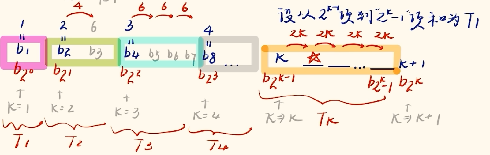

# 数列

数列的通项公式为第 $n$ 项( $n \in \mathbb{N}_+$ )的表达式 $a_n$ . 与连续型函数不同地, 数列是离散的. 记 $S_n = \sum_{i = 1}^n a_i$ .

## 基本数列

### 等差数列

若数列 $\{a_n\}$ 满足 $a_{n + 1} - a_n = d$ 则为等差数列, 首项为 $a_1$ , 公差为 $d$ , 通项公式为 $a_n = a_1 + (n - 1) d = a_m + (n - m) d$ . 常数列也是等差数列. 等差中项 $a_n$ 满足 $2a_n = a_{n - 1} + a_{n + 1}$ . 等差数列前 $n$ 项和为 $S_n = \frac{(a_1 + a_n)n}{2} = na_1 + \frac{n(n-1)}{2} d$ , 可由倒序相加得到.

解决等差数列的朴素思路是全部用 $a_1$ 与 $d$ 表示. 若题目在某一个数字两侧如 $a_4, a_5, a_6, S_4, S_5, S_6$ 等, 可以选择 $a_5$ 与 $S_5$ 为基准来表示.

想要证明等差数列可以由一下三种方法:

1. $a_{n + 1} - a_n = d$ (定义法)
2. $a_n = a_1 + (n - 1)d$ (通项公式法)
3. $2a_n = a_{n + 1} + a_{n - 1}$ (等差中项法)

等差数列有二级结论:

1. 若 $m + n = p + q$ , 则 $a_m + a_n = a_p + a_q$ . 当然可以扩展到任意多项, 前提是等号两侧项数一致.
2. $S_n = \frac{d}{2}n^2 + (a_1 - \frac{d}{2})n = An^2 + Bn$ , 即 $S_n$ 为无常数项的二次函数(图像过原点, 感性理解因为前零项和 $S_0$ 必为 $0$ ). 由此可得 $\{\frac{S_n}{n}\}$ 为首项为 $a_1 - \frac{d}{2}$ , 公差为 $\frac{d}{2}$ 的等差数列.
3. 片段和性质 $S_k, S_{2k} - S_k, S_{3k} - S_{2k}, \dots$ , 即 $\{S_{(i + 1)k} - S_{ik}\}, i \in \mathbb{N}_+$ 或 $\sum_{i = 1}^k a_i, \sum_{i = k + 1}^{2k} a_i, \sum_{i = 2k + 1}^{3k} a_i, \dots, k \in \mathbb{N}_+$ 也为等差数列, 即连续 $k$ 项的和为等差数列, 公差为 $k^2d$ . 若出现类似 $S_2, S_4, S_6$ , 或 $S_5, S_{10}, S_{15}$ 等考虑.
4. $S_{2n - 1}$ 可以根据第一条二级结论化简为 $(2n - 1)a_n$ , $S_{2n}$ 化简为 $n(a_\frac{n}{2} + a_{\frac{n}{2} + 1})$. 实际上若将数列看为函数, 即考虑广义上的数列(因为此类问题一般在选填), 所有 $S_n$ 均可化简为 $na_{\frac{n + 1}{2}}$ . 此结论可以建立 $S_n$ 与 $a_n$ 之间的关系, 将难算的 $S_n$ 转化为 $a_n$ , 或在特定情形下将 $a_n$ 转化为 $S_n$ .

例题: 已知等差数列 $\{a_n\} , \{b_n\}$ 前 $n$ 项和分别表示为 $S_n, T_n$ , 满足 $\frac{a_n}{b_n} = \frac{2n + 1}{5n + 3}$ , 则 $\frac{S_{10}}{T_{11}} = \_\_\_\_\_\_ .$

此类题目可以认为 $a_n = k(2n + 1), b_n = k(5n + 3)$ (当然不妨令 $k = 1$ , 使用特殊值法求解答案, 若无此步骤后面也会在分数处约掉), $\frac{S_{10}}{T_{11}} = \frac{10a_{5.5}}{11b_6} = \frac{10k \cdot 12}{11k \cdot 33} = \frac{40}{121}$ .

变式: 已知等差数列 $\{a_n\} , \{b_n\}$ 前 $n$ 项和分别表示为 $S_n, T_n$ , 满足 $\frac{S_n}{T_n} = \frac{2n + 1}{5n + 3}$ , 则 $\frac{a_{10}}{b_{11}} = \_\_\_\_\_\_ .$

注意由于 $S_n, T_n$ 为无常数项二次函数, 故需要认为 $S_n = kn(2n + 1), T_n = kn(5n + 3), \frac{a_{10}}{b_{11}} = \frac{\frac{S_{19}}{19}}{\frac{T_{21}}{21}} = \frac{21 \cdot k \cdot 19 \cdot 39}{19 \cdot k \cdot 21 \cdot 108} = \frac{39}{108} = \frac{13}{36}.$

等差数列数项数可以使用 $n = \frac{末项 - 首项}{公差} + 1 = \frac{a_1 + (n - 1)d - a_1}{d} + 1$ 计算得到, 在等差数列作为下标出现时常用以避免数错. 若要求区间 $[l, r)$ 内有多少项, 则可以先由符合 $l \le a_1 + (n - 1)d < r$ 的 $n$ 的个数等价于满足 $\frac{l - a_1}{d} + 1 \le n < \frac{r - a_1}{d} + 1$ 的正整数 $n$ 的个数来简化(当然若数列不是等差数列方法类似).

二阶等差数列即相邻两项之差成等差数列的数列, 即记 $d_n = a_{n + 1} - a_n$ , 则 $\{d_n\}$ 为等差数列, 则 $\{a_n\}$ 为二阶等差数列. 二阶等差数列通项一定满足 $a_n = An^2 + Bn + C$ , 如 $\{n^2\}$ 即为二阶等差数列, 其 $S_n = \frac{n(n + 1)(2n + 1)}{6}$ . 由于此数列考察较少, 故无需记忆 $A, B, C$ 对应的表达式, 而是选择计算出 $a_1, a_2, a_3$ 使用待定系数法现推, 即列方程组 $\begin{cases}a_1 = A + B + C\\a_2 = 4A + 2B + C\\a_3 = 9A + 3B + C\end{cases}$ 解出 $A, B, C$ .其求和方式为分组求和, 即 $S_n = \sum_{i = 1}^n a_i = A \sum_{i = 1}^n i^2 + B \sum_{i = 1}^n i + C \sum_{i = 1}^n 1 = A \cdot \frac{n(n + 1)(2n + 1)}{6} + B \cdot \frac{n(n + 1)}{2} + C \cdot n$ .

实际上 $n$ 阶等差数列与杨辉三角(左对齐)以及二项式系数之间均有联系, 在杨辉三角中蕴含着 $n$ 阶等差数列且竖直排列, 其所求和数列末项右下方数字即为和.

### 等比数列

$a_n = a_1 \cdot q^{n - 1} = a_m \cdot q^{n - m}$ , 其中 $q$ 为公比. 注意 $q \ne 0$ 且 $\forall a_n \ne 0$ , 否则为 $0$ 的常数列. 若 $q = 1$ 为常数列. $q < 0$ 为一正一负的交错数列, 且相隔偶数项的符号相同. 若 $q > 0$ 则 $a_n$ 正负取决于 $a_1$ , 若 $a_1 > 0$ 则为正项数列.

等比数列使用错位相减法求和, 下文详述. 求得 $S_n = \frac{a_1(1 - q^n)}{1 - q} \quad (q \ne 1)$ . 若 $q = 1$ 则需要按照等差数列的方式求和为 $S_n = na_1$ , 要注意陷阱.

等比中项满足 $a_n^2 = a_{n - 1} \cdot a_{n + 1}$ . 证明等比数列与等差数列类似, 不再赘述.

解决等比数列的问题也可以全部用 $a_1$ 和 $q$ 来表示, 但有时二级结论更快:

1. 若 $m + n = p + q$ , 则 $a_m \cdot a_n = a_p \cdot a_q$ . 同理可以推广, 前提为两侧项数一致.
2. 等比数列也有片段和性质, 其成等比数列, 公比为 $q^k$ .
3. $S_n$ 可以表示为 $S_n = \frac{a_1}{q - 1} \cdot q^n - \frac{a_1}{q - 1} = A \cdot q^n - A$ .

无穷等比数列求和公式为:

$$S_\infty = \frac{a_1}{1 - q} \quad (|q| < 1)$$

由 $S_\infty = \lim_{n \to \infty} S_n = \lim_{n \to \infty} \frac{a_1(1 - q^n)}{1 - q} = \frac{a_1}{1 - q}$ 得到. 此式常在物理题目中用到.

## 数列技巧

### 数列求和

当出现 $S_1, S_2, S_3$ 等较小的和时可以直接展开为 $a$ 相加而非用公式.

若出现 $a_{n} + a_{n + 1} = f(n), f(n)$ 为关于 $n$ 的表达式求 $S_n$ 时, 一般可以令 $n$ 取奇数以避免重复, 即 $S_n = (a_1 + a_2) + (a_3 + a_4) + \dots + (a_{n - 1} + a_n)$ , 而非 $S_n = \frac{1}{2} ((a_1 + a_2) + (a_2 + a_3) + \dots + (a_{n - 1} + a_n) + a_1 + a_n))$ . 此时想要求通项请详见下文奇偶分类讨论.

等差乘等比数列求和使用错位相减, 一般步骤为乘公比, 错位(将指数相同的项对其), 相减, 化简(一般需要使用等比数列求和公式), 除系数.

实际上高次多项式乘等比数列也可使用错位相减, 如 $(2n^2 + 3n + 1) \cdot 3^n$ 等, 不过最高次为几次就需要进行几次错位相减十分复杂. 所以以下直接给出裂项的普适方法, 在常规情况下运算量略优于错位相减且不易出错, 高次时远胜于错位相减. 过程为先在草稿纸上考虑使用待定系数法, 设出裂项后的通项, 形式与所需裂开的通项一致, 系数设为未知数, 以三次乘等比 $a_n = (2n^3 - n^2 + 3) \cdot 2^{n + 1}$ 为例, 设 $c_n = (xn^3 + yn^2 + zn + w) \cdot 2^{n + 1}$ (注意从最高次开始需要一直写到零次不间隔, 即便所裂中无此项), 有 $c_{n + 1} - c_n = a_n$ , 即:

$$
\begin{align*}
& (x(n + 1)^3 + y(n + 1)^2 + z(n + 1) + w) \cdot 2^{(n + 1) + 1}\\ - & (xn^3 + yn^2 + zn + w) \cdot 2^{n + 1}\\ = & (2n^3 - n^2 + 3) \cdot 2^{n + 1}
\end{align*}
$$

然后化简(把 $2^{n + 2} = 2 \cdot 2^{n + 1}$ 然后对应项相等)可得:

$$
\begin{cases}
x = 2\\
y = -13\\
z = 40\\
w = -55
\end{cases}
$$

以上均为草稿, 由此我们在答题纸上只需要书写:

$$记 c_n = (2n^3 - 13n^2 + 40n - 55) \cdot 2^{n + 1}, 注意到 c_{n + 1} - c_n = a_n, 故 S_n = \sum_{i = 1}^n a_i = \sum_{i = 1}^n (c_{i + 1} - c_i) = c_{n + 1} - c_1 = (2n^3 - 7n^2 + 20n - 26) \cdot 2^{n+2} + 104. $$

由此即可代替三次错位相减算出答案.

求和的结果验证可以使用 $a_1 = S_1$ 进行.

裂项相消的题目除了上述外还有以下常规形式:

1. $a_n = \frac{1}{n(n + k)} = \frac{1}{k} (\frac{1}{n} - \frac{1}{n + k})$
2. $a_n = \frac{1}{(2n - 1)(2n + 1)} = \frac{1}{2}(\frac{1}{2n - 1} - \frac{1}{2n + 1})$
3. $a_n = \frac{2^n}{(2^n - 1)(2^n - 1)} = \frac{1}{2^n - 1} - \frac{1}{2^{n + 1} - 1}$
4. $a_n = \frac{n \cdot 2^{n + 1}}{(n + 1)(n + 2)} =  -(\frac{2^{n + 1}}{n + 1} - \frac{2^{n + 2}}{n + 2}) \quad$ (若通项中有裂开后未能体现的项则需要再裂开后两项中增加此元素, 注意需要时同一个数列中的不同两项)
5. $a_n = \frac{1}{\sqrt{n + k} + \sqrt n} = \frac{1}{k}(\sqrt{n + k} - \sqrt n) \quad $ (分母有理化, 若见到两个根号相加减也要知道可以通过逆用此裂项将二者放到分母上从而改变次数)

见到如上形式, 当有两个式子在分母上相乘且均为一个数列的两项时(因为有些时候不会给出具体通项, 而是以类似 $a_n = \frac{1}{b_n \cdot b_{n + 1}}$ 的形式给出, $b_n$ 通项未知, 但如已知其为等差数列就可使用 $1$ 或 $2$ 方法裂项), 大胆裂项列成同一个数列的两项(故 $3$ 号需要如此列分子), 并且同分验证后, 配凑系数即可. 注意到能够裂项的式子(在不考虑指数的情况下)分子的次数要大于分母, 故若分子的次数大于等于分母需要考虑凑分母为分子降次.

要注意的是, 若通项中包含 $(-1)^n$ , 则需要考虑裂成和的形式, 即裂开的两项中间应该写加号, 因为符号会由 $(-1)^n$ 调节, 并且如此能够凑出分子. 但最后一项的符号若题目未说明项数奇偶性则可能需要奇偶讨论.

若通项两部分均可以求和, 则考虑使用加法交换律和结合律分组求和.

### 求通项

形如 $a_{n + 1} - a_n = f(n), f(n)$ 为一个关于 $n$ 的表达式(一般可以求和), 可以使用累加法求通项 $a_n$ , 即 $a*2 - a_1 + a_3 - a_2 + \dots + a*{n + 1} - a*n = a_n - a_1 = \sum*{i = 1}^n f(i) \Rightarrow a*n = \sum*{i = 1}^n f(i) - a_1. $

同理, 形如 $\frac{a_{n + 1}}{a_n} = f(n)$ 可以使用累乘法求通项, 方法同上不再赘述. 需要注意的是累加法和累乘法常通过移项为递推式掩盖其特征, 如 $a_{n + 1} = a_n + f(n)$ 或 $a_{n + 1} = f(n) \cdot a_n$ 等.

要注意的是累加法与累乘法不只适用于等式, 也适用于不等式中, 下文有例题使用此技巧.

若变式为 $a_{n + 1} - p \cdot a_n = f(n)$ , 则考虑两侧同时除以 $p^{n + 1}$ 变为 $\frac{a_{n + 1}}{p^{n + 1}} - \frac{a_n}{p^n} = \frac{f(n)}{p^{n + 1}}$ 来构造新数列使用累加法. 此类题目实际上属于一阶线性递推题目, 此类题目首先要先变形为 $a_{n + 1} = pa_n +q$ 的形式, 即要先将下标大的项系数变为 $1$ , 否则本段上述与下述所有方法不适用. 若 $f(n)$ 为一常数时一般的特征根法(见下文), 为一指数时也可同除此指数变为 $f(n)$ 为常数的一阶线性递推, 如 $a_{n + 1} = 2a_n + \frac{1}{3^{n - 2}} \Rightarrow a_{n + 1} \cdot 3^{n - 2} = 2 \cdot 3 \cdot a_n \cdot 3^{n - 3} + 1$ (当然此时使用段首方法同除 $2^{n + 1}$ 也可). 当然有些题目求证目标中也会提示如何构造, 如求证 $\{a_n + 2\}$ 为等比数列即可知要向 $a_{n + 1} + 2 = p(a_n + 2)$ 凑.

实际上对于一阶线性递推, 特征根法的操作就是不动点法的操作, 即对于 $a_{n + 1} = pa_n + q$ 令 $a_{n + 1}$ 与 $a_n$ 为 $x$ , 解方程 $x = px + q$ 得 $x = \frac{q}{1 - p}$ , 然后构造 $a_{n + 1} - x = p(a_n - x)$ 即可, 注意是减 $x$ .

分式递推也可用不动点法(不适用特征根法), $a_{n + 1} = \frac{pa_n + q}{ra_n + s}$ 令 $a_{n + 1}$ 与 $a_n$ 为 $x$ , 解方程 $x = \frac{px + q}{rx + s}$ . 若仅有一个实数根 $x_0$ 则需要向 $b_n$ 为等差数列构造 $b_n = \frac{1}{a_n - x_0}$ , 为引入 $n + 1$ 项列 $b_{n + 1} = \frac{1}{a_{n + 1} - x_0} = \frac{1}{\frac{pa_n + q}{ra_n + s} - x_0}$ , 化简并拆分子必有 $b_{n + 1} = b_n + d, d$ 是一个可以算出的常数, 然后可得出 $b_n$ 通项, 由 $b_n = \frac{1}{a_n - x_0} \Rightarrow a_n = \frac{1}{b_n} + x_0$ 解出答案. 若有两个实数根则需要向 $b_n$ 为等比数列构造 $b_n = \frac{a_n - x_1}{a_n - x_2}$ , 同样代入化简得到 $b_{n + 1} = k \cdot b_n, k$ 为常数, 得到 $b_n$ 通项, 然后由 $b_n = \frac{a_n - x_1}{a_n - x_2}$ 得出 $a_n = \frac{x_2b_n - x_1}{b_n - 1}$ . 以上是大题常见情况, 若 $\Delta < 0$ 则大概率有周期性之间分析周期即可, 选填常见.

二阶线性地推同理使用特征根法(但此时不与不动点法一致), 如斐波那契数列也可求得通项为:

$$F_n = \frac{1}{\sqrt 5} ((\frac{1 + \sqrt{5}}{2})^n - (\frac{1 - \sqrt{5}}{2})^n)$$

二阶线性递推 $a_{n + 2} = pa_{n + 1} + qa_n$ 特征方程为 $x^2 = px + q$ , 解出 $\Delta < 0$ 则大概率存在周期(选填直接尝试寻找周期); 大题更常见的是 $\Delta \ge 0$ 的情况. 解出若只有一个实数根 $x_0$ 则代入通解 $a_n = (A + Bn) \cdot x_0^n$ , 先后令 $n = 1$ 与 $n = 2$ (由于题目给出 $a_1, a_2$ , 实际上若回推 $a_0$ 并代入求解以下方程组会简便很多, 但可能扣步骤分)列出方程组 $\begin{cases}a_1 = (A + B)x_0\\a_2 = (A + 2B)x_0^2\end{cases}$ 并解出待定系数 $A, B$ , 即可得到通项 $a_n = (A + Bn) \cdot x_0^n$ . 若有两不等实根 $x_1, x_2$ 则需要代入通解 $a_n = A \cdot x_1^n + B \cdot x_2^n$ , $A, B$ 解法同上.

若递推式不符合以上形式则可以考虑迭代法, 一般此类题目会问一个不等式证明, 但在证明之前需要做的隐藏准备工作为求出数列的单调性以及 $a_n$ 的取值范围, 即便题目没有设问. 例题: $a_1 \in (0, 1), a_{n + 1} = xa_n^2 - xa_n, x \in \mathbb{R}, (i)$ 若 ${a_n}$ 为等比数列, 求 $x$ 的范围; $(ii)$ 若 $a_1 = \frac{1}{2}, x = -1$ , 求证 $1 < \frac{1}{a_{n + 1}} - \frac{1}{a_n} \le 2, \sum_{i = 1}^n a_i^2 \le \frac{n}{2(n + 1)}$ .

即便已经知道 $a_n$ 为等差或等比数列, 但此类题目还是选用迭代法, 其好处在于避免引入过多的未知参数 $d$ 或 $q$ . 迭代法即列出下一组递推式 $a_{n + 2} = xa_{n + 1}^2 - xa_{n + 1}$ , 然后需要按照题目特性继续, 如本题可以考虑使用等比中项联系 $a_n, a_{n + 1}, a_{n + 2}$ , 有 $a_{n + 1}^2 = a_{n} \cdot a_{n + 2}$ , 代入消元有 $a_{n + 1}^2 = a_n \cdot (xa_{n + 1}^2 - xa_{n + 1}) \Rightarrow a_{n + 1} = xa_n \cdot (a_{n + 1} - 1)$ , 继续考虑消元得到 $xa_n(a_n - 1) = xa_n(a_{n + 1} - 1) \Rightarrow a_n = a_{n + 1}$ ( $x$ 若为零则导致等比数列中 $a_{n + 1} = 0$ 显然不可, 故可约). 然后反复使用递推式 $a_{n + 1} = a_n = xa_n^2 - xa_n \Rightarrow x = \frac{1}{a_n - 1}$ (由于 $a_n = a_1 \ne 1$ 故合法) , 由于本题已知 $a_n = a_1$ 的取值范围, 故可解得 $x \in (-\infty, -1)$ .

然后为证明不等式需判断单调性, 由于本题递推式考虑作差法(若是分式也可考虑作商法), $a_{n + 1} - a_n$ 代入递推式得 $a_{n + 1} - a_n = a_n - a_n^2 - a_n = -a_n^2 < 0$ , 即 ${a_n}$ 单调递减, 且由于 $a_{n + 1} = a_n(1 - a_n), a_n \le \frac{1}{2}$ 可得 $1 - a_n > 0$ , 即 $a_n$ 与 $a_{n + 1}$ 同号, 故 $0 < a_n \le \frac{1}{2}$ . 由于已经有自变量取值范围, 对于不等式 $1 < \frac{1}{a_{n + 1}} - \frac{1}{a_n} \le 2$ 中的双变量, 使用递推式消元有 $\frac{1}{a_n(1 - a_n)} - \frac{1}{a_n} = \frac{1}{1 - a_n} \in (1, 2]$ . (但是实际上此处省略了一步判断是部分迭代代换转化为单变量求值域问题(适用于不等式另一侧为常数, 如本题)还是全部代换保留式子的对称性(适用于不等号另一侧为 $f(n)$ , 即含有 $n$ 的表达式, 如下一题)) 对于不等式 $\sum_{i = 1}^n a_i^2 \le \frac{n}{2(n + 1)}$ , 需要在题目中找 $a_n^2$ 项, 注意到递推式中 $a_{n + 1} = a_n - a_n^2 \Rightarrow a_n^2 = a_n - a_{n + 1}$ 为裂项的形式, 且不等式左侧恰好为数列 ${a_n^2}$ 的前 $n$ 项和, 故顺利地得到 $\sum_{i = 1}^n a_i^2 = a_1 - a_{n + 1} = \frac{1}{2} - a_{n + 1}$ , 由此转化为求 $a_{n + 1}$ 最值即可, 并且此最值应该与 $n$ 相关而非已经求出的粗略的 $a_n$ 取值范围. 去题目中寻找, 注意到上一个不等式为包含 $a_{n + 1}$ 的不等式, 且此形式与累加法的形式一致, 可以由此消掉多余的 $a_n$ 项, 为选择使用哪一侧, 注意到所求不等式中为 $\le$ , 故选择有等号的 $\frac{1}{a_{n + 1}} - \frac{1}{a_n} \le 2$ . 累加法有 $\frac{1}{a_2} - \frac{1}{a_1} + \frac{1}{a_3} - \frac{1}{a_2} + \dots + \frac{1}{a_{n + 1}} - \frac{1}{a_n} = \frac{1}{a_{n + 1}} - \frac{1}{a_1} = \frac{1}{a_{n + 1}} - 2 \le 2n \Rightarrow a_{n + 1} \ge \frac{1}{2n + 2}$ , 由此代入上文中得到的化简式 $\frac{1}{2} - a\_{n + 1} \le \frac{1}{2} - \frac{1}{2n + 2} = \frac{n}{2(n + 1)}, \square . $

当然迭代法也可在下文奇偶讨论题目中使用, 如 $a_1 = \frac{1}{2}, a_{n + 1} = \frac{1}{1 + a_n}$ 求 $\{a_{2n}\}$ 单调性; 求证 $|a_{n + 1} - a_n| \le \frac{1}{6} \cdot (\frac{2}{5})^{n - 1}$ . 则可以有 $a_{n + 1} - a_{n - 1} = \frac{1}{1 + a_n} - a_{n - 1}$ (迭代) $= \frac{1}{1 + \frac{1}{1 + a_{n - 1}}} - a_{n - 1}$ (相隔一项往往需要迭代两次) $= \frac{- a_{n - 1}^2 - a_{n - 1} + 1}{2 + a_{n - 1}}$ , 但注意到此时用函数很难分析正负性, 由此我们考虑使用另一种迭代思路(同类题目常用), 即不转化为单变量问题而是保留对称性, 仍然使用 $a_{n + 1} - a_{n - 1}$ 但是同时迭代二者, 有 $a_{n + 1} - a_{n - 1} = \frac{1}{1 + a_n} - \frac{1}{1 + a_{n - 2}} = \frac{1}{1 + \frac{1}{1 + a_{n - 1}}} - \frac{1}{1 + \frac{1}{1 + a_{n - 3}}}$ (由于我们不需要相邻项故再次迭代为间隔项) $= \frac{1 + a_{n - 1}}{2 + a_{n - 1}} - \frac{1 + a_{n - 3}}{2 + a_{n - 3}} = \frac{a_{n - 1} - a_{n - 3}}{(2 + a_{n - 1})(2 + a_{n - 3})}$ , 至此由于递推式可知 $a_n$ 与 $a_1$ 正负性一致为正, 故 $a_{n + 1} - a_{n - 1}$ 与 $a_{n - 1} - a_{n - 3}$ 正负性一致, 故只需要验证 $a_4 - a_2$ 的正负即可得到 $\{a_{2n}\}$ 的单调性为单调递减. 当然, 由于我们上述操作并没有规定 $n$ 一定为偶数, 我们验证 $a_3 - a_1$ 的正负即可得到 $\{a_{2n - 1}\}$ 的单调性为单调递增, 这对后续证明不等式是必要的, 需要自己挖掘完整的单调性. 证明不等式前还需要挖掘 $a_n$ 的取值范围, 此题相较于上一题更能体现反复迭代的内核. 由 $a_{n + 1} = \frac{1}{1 + a_n} , a_n > 0$ (上文得出)可得 $1 + a_n > 1$ , 即 $a_{n + 1} < 1$ . 又由于 $a_1 = \frac{1}{2}$ , 令 $n + 1$ 代换为 $n$ , 故 $a_n \in (0, 1)$ . 实际上此时还能更加精确(所证不等式可以取等, 当前不可取等, 若不精确则后续不等式证明会卡住, 还是需要回头继续精确, 一直精确到可以取等或继续迭代也无法再精确即为最精确情况), 再次迭代可得 $a_{n + 1} = \frac{1}{1 + a_n} > \frac{1}{1 + 1} = \frac{1}{2}$ , 结合 $a_1 = \frac{1}{2}$ 可得 $a_n \in [\frac{1}{2}, 1)$ . 当然可以继续迭代精确有 $a_{n + 1} = \frac{1}{1 + a_n} \le \frac{2}{3}, a_1 = \frac{1}{2}$ 符合, 综上 $a_n \in [\frac{1}{2}, \frac{2}{3}]$ . (实际上第一问证明出 $\{a_{2n - 1}\}$ 单调递增 $\{a_{2n}\}$ 单调递减再结合 $a_1 = \frac{1}{2}, a_2 = \frac{2}{3}$ 也可猜到此结论, 但对于奇数项无法证明其上界, 对于偶数项无法证明其下界, 还是需要迭代) 接下来, 上一道题目提及过, 此时我们需要判断不等式另一侧为常数还是 $f(n)$ (含有 $n$ 的表达式) , 发现此题 $|a_{n + 1} - a_n| \le \frac{1}{6} \cdot (\frac{2}{5})^{n - 1}$ 是后者, 故选择全部代换以保留对称性与 $n$ (若为常数则需要部分代换转化为单变量求值域问题, 如此才能无 $n$), $|a_{n + 1} - a_n| = |\frac{1}{1 + a_n} - \frac{1}{1 + a_{n - 1}}| = |\frac{a_n - a_{n - 1}}{(1 + a_n)(1 + a_{n - 1})}|$ , 由于分母均为正则 $|a_{n + 1} - a_n| = \frac{|a_n - a_{n - 1}|}{(1 + a_n)(1 + a_{n - 1})}$ . 注意到分子与分母本质蕴含的信息一致, 故均保留, 为引入不等号考虑放缩分母. 放缩分母时若我们直接放缩使用 $(1 + a_n)(1 + a_{n - 1}) > (1 + \frac{1}{2})(1 + \frac{1}{2}) = \frac{9}{4}$ 则十分不精确, 因为显然两次放缩无法同时取等, 不等号不再含有等号, 且此时需要放缩为一个具体值( $n$ 由分子部分提供, 从此处已经可看出分子的等比数列(累乘)的原型), 则考虑使用部分代换, $(1 + a_n)(1 + a_{n - 1}) = (1 + \frac{1}{1 + a_{n - 1}})(1 + a_{n - 1}) = 1 + a_{n - 1} + 1 \ge 2 + \frac{1}{2} = \frac{5}{2}$ , 故 $|a_{n + 1} - a_n| = \frac{|a_n - a_{n - 1}|}{(1 + a_n)(1 + a_{n - 1})} \le \frac{2}{5}|a_n - a_{n - 1}| \Rightarrow \frac{|a_{n + 1} - a_n|}{|a_n - a_{n - 1}|} \le \frac{2}{5}$ , 从此可以看出等比数列(实际上所求不等式的形式就可看出), 但由于此题为大题不能直接乱套用等比数列, 故还应像上一题类似使用累乘法, 记 $b_n = |a_{n + 1} - a_n|$ , 有 $\prod_{i = 2}^n \frac{b_i}{b_{i - 1}} = \frac{b_n}{b_1} \le (\frac{2}{5})^{n - 1} \Rightarrow b_n = |a_{n + 1} - a_n| \le b_1 \cdot (\frac{2}{5})^{n - 1} = |a_2 - a_1| \cdot (\frac{2}{5})^{n - 1} = \frac{1}{6} \cdot (\frac{2}{5})^{n - 1}, \square$ . 由此题两次使用同时全部代换的方法也可发现均转化成为了前一或二项蕴含同样信息(同样形式)的式子, 这就是维持对称性的好处.

求通项有很多常见套路:

1. 若见到类似 $2a_na_{n + 1} + a_{n + 1} - a_n = 0$ 此类 $a_n, a_{n + 1}, a_na_{n + 1}$ 同时出现时, 考虑同除 $a_na_{n + 1}$ 得到如 $2 + \frac{1}{a_n} - \frac{1}{a_{n + 1}} = 0$ 的式子进行累加法或得到等差数列.
2. 类似 $a_n^2 - (2a_n - 1)a_n - 2a_{n + 1} = 0$ 的式子可以考虑因式分解为 $(a_n - 2a_{n + 1})(a_n + 1) = 0 \Rightarrow a_n = -1$ 或 $a_n = 2a_{n + 1}$ .
3. 若题目求证 $\{a_n + k\}$ 或 $\{a_n + b_n\}$ 或 $\{\frac{1}{a_n}\}$ 等提示形式的数列为等差/等比数列, 则需要尽量往此形式凑.
4. $a_{n + 1} = \frac{a_n}{pa_n + q}$ 类题目分子简单分母复杂可以取倒数转化为一阶线性递推.
5. 出现 $\sqrt{a_n}$ 一般会将其换元为 $b_n$ , 即 $a_n = b_n^2$ .

若已知 $S_n$ 求 $a_n$ 可以使用 $a_n = \begin{cases}S_n - S_{n - 1}&, n \ge 2\\a_1&, n = 1 \end{cases}$ . 注意若 $a_1$ 符合通项则可以合并, 但一般操作起来会是求出 $a_n$ 后单独判断 $a_1$ 是否符合. 别忘记 $S_1 = a_1$ .

问题在于有时 $a_n, S_n$ 混搭出现, 我们需要判断需要消 $a$ 还是 $S$ , 通常原则为题目求谁就留谁(此原则不普适, 有时若不好求则需先求另一者). 若要消 $a$ 可以使用 $a_n = S_n - S_{n - 1}$ 用 $S$ 来表示 $a$ ; 若要消 $S$ 则可使用退一相减法, 即如 $2S_n = 3a_{n + 1} - 3$ 并列写出其上一项 $2S_{n - 1} = 3a_n - 3$ 并相减得到 $2a_n = 3a_{n + 1} - 3a_n$ . 由于均涉及到第 $n - 1$ 项故需要讨论 $n = 1$ 时是否符合, 特别注意.

若遇见连乘式或前 $n$ 项积同理退一相除即可.

出现连加式大概率是某一数列的 $S_n$ .

### 奇偶讨论

若题目中含有 $(-1)^n$ 等, 或通项本身分奇偶, 或出现 $a_{2n}, a_{2n -1}$ 等条件, 或有相隔两项相关条件, 或给出无法累加累乘的相邻两项和或积, 则大概率需要分奇偶讨论, 有时也需要分奇偶两组进行求和. 奇偶讨论时要把握住相隔一项的关键, 因为奇偶性相同.

若出现 $a_n + a_{n + 1} = f(n)$ 或 $a_n \cdot a_{n + 1} = f(n)$ 的条件求通项, 不是直接累加或累乘法, 而是其变式奇偶讨论后再使用. 我们一般将此条件化成间隔一项(奇偶性相同)的两项的条件, 之后即可使用累加累乘法. 因而可以迭代列出 $\begin{cases} a_n + a_{n + 1} = f(n) \\ a_{n + 1} + a_{n + 2} = f(n + 1) \end{cases}$ 或 $\begin{cases} a_n \cdot a_{n + 1} = f(n) \\ a_{n + 1} \cdot a_{n + 2} = f(n + 1) \end{cases}$ , 分别作差或作比可得 $a_{n + 2} - a_n = f(n + 1) - f(n)$ 或 $\frac{a_{n + 2}}{a_n} = \frac{f(n + 1)}{f(n)}$ 符合累加或累乘条件. 求得的通项应为分段数列(奇偶不同), 此种情况求和需要分组(奇偶)求和.

为避免混淆, 常见将奇偶两种数列设成新数列, 即 $p_n = a_{2n - 1}, q_n = a_{2n}$ , 代入通项完成转化.

当然除了奇偶讨论数列还会有更多"花式"讨论, 此时只需要把每一关键项在草稿纸上排开, 画出图标清项数等找准宏观上的关系即可. 当然包括插入与增删问题等, 画图理解十分方便.

{ width=500px }

### 不等式证明

类似 $\sum_{i = 1}^n a_i < f(n)$ 的不等式证明有以下三种思考路径:

1. 直接求和, 适用于会求和的通项
2. 通项放缩, $f(n)$ 为常数时或 $a_n$ 比较容易转化为求和的形式时, 简单题目一般会把通项放缩掉/放缩出一个常数转化为能求和的形式(等差等比, 错位相减, 裂项相消), 下文给出了比较常见的放缩形式. 当然, 放缩结果想要更精确往往可以直接代入前几项不放缩, 因为此时误差比较大且前几项易于确定.
3. 通项比较, 适用于 $f(n)$ 不是常数时且 $a_n$ 难以转化为可求和的形式(此方法比较普适, 只要 $f(n)$ 不为常数就可考虑), 可以将 $f(n)$ 看做一个数列 $b_n$ 的 $S_n$ , 将 $\sum_{i = 1}^n a_i < \sum_{i = 1}^n b_i$ 转化为 $a_n < b_n$ 从而化简不等式. 其中 $b_n$ 可由 $S_n - S_{n - 1}$ 得到, $b_1 = S_1$ 可得需要特殊说明(直接代入 $n = 1$ 验证). 当然后续不等式证明过程中若需要放缩也可大胆放缩. 当然, 由于是不等式证明, 此时需要关注次数问题, 尤其是数列中涉及裂项这种可以大幅度改变次数的技巧, 如左侧分子次数小于分母, 若右侧分子次数大于分母, 就要考虑逆用裂项, 如 $\sqrt{\frac{n - 1}{n(n + 1)}} < 2\sqrt n - 2\sqrt{n - 1} = \frac{2}{\sqrt n + \sqrt{n + 1}}$ , 为消掉分式交叉相乘有 $\sqrt{n(n - 1)} + n - 1 < 2\sqrt{n(n + 1)}$ 但保留为 $\sqrt{n(n - 1)} + \sqrt{(n - 1)(n - 1)} < \sqrt{n(n + 1)} + \sqrt{n(n + 1)}$ 形式(根式根号下一堆整式相乘的不等式常用技巧, 因为若强行平方仍然会存在根号, 不如直接证明对应项大小关系) , 有 $n(n - 1) < n(n + 1), (n - 1)(n - 1) < n(n + 1)$ , 证毕.
4. 数学归纳法, 十分普适的思想, 在证明与自然数有关命题( $x \in \mathbb{N}$ )的很多时候十分简便, 数列完美符合其条件. 其过程如下: 首先验证当 $n_0 = 0$ 或 $n_0 = 1$ (更常用)时命题成立, 然后再 $n = k, k \ge n_0$ 时命题成立的假设下(此条件可以使用)证明 $n = k + 1$ 时命题成立, 即可证毕. 一个广泛的例子为多米诺骨牌, 只需证明第一块能倒, 再证明前一块倒必然导致后一块倒即可证明全部会倒.

常见的放缩有以下几种:

1. 整式 $\frac{1}{n(n + 1)} < \frac{1}{n^2} < \frac{1}{n(n - 1)}$ , 右侧需要满足 $n \ge 2$ . 更精确地 $\frac{1}{n^2} < \frac{1}{n^2 - \frac{1}{4}} = \frac{1}{(n - \frac{1}{2})(n + \frac{1}{2})}$
2. 根式 $2(\sqrt{n + 1} - \sqrt n) < \frac{1}{\sqrt n} = \frac{2}{\sqrt n + \sqrt n} < 2(\sqrt n - \sqrt{n - 1})$
3. 指数使用二项式展开 $2^n = (1 + 1)^n = 1 + n + \frac{n(n - 1)}{2} + \dots$ , 由此可得 $2^n \ge 1 + n$ (取等条件为 $n = 1$ ), 更精确地 $2^n \ge \frac{n(n - 1)}{2}$ . 或使用伯努利不等式 $(1 + x)^n \ge 1 + nx \quad (x > -1)$ 或其等价形式 $x^n \ge (x - 1)n + 1 \quad (x > 0)$ , 取等条件为 $x = 1$ 或 $n = 1$.

以上若对 $n$ 有限制则不包含的需要单独写出.

还有一类特殊地放缩可以使用糖水不等式解决, 即当遇见分式连乘形式时, 如 $a_n = \frac{2n - 1}{2n}$, 其前 $n$ 项积为 $T_n = \frac{1}{2} \cdot \frac{3}{4} \cdot \frac{5}{6} \cdot \dots \cdot \frac{2n - 1}{2n}$ , $a_n$ 根据糖水不等式可放缩为 $a_n < \frac{2n}{2n + 1}$ 以错一位构造约分, 故 $T_n = \sqrt{T_n^2} = \sqrt{(\frac{1}{2} \cdot \frac{3}{4} \cdot \frac{5}{6} \cdot \dots \cdot \frac{2n - 1}{2n})(\frac{1}{2} \cdot \frac{3}{4} \cdot \frac{5}{6} \cdot \dots \cdot \frac{2n - 1}{2n})} < \sqrt{(\frac{1}{2} \cdot \frac{3}{4} \cdot \frac{5}{6} \cdot \dots \cdot \frac{2n - 1}{2n})(\frac{2}{3} \cdot \frac{4}{5} \cdot \frac{6}{7} \cdot \dots \cdot \frac{2n}{2n + 1})} = \sqrt \frac{1}{2n + 1} = \frac{1}{\sqrt{2n + 1}}$ .

### 单调性与最值

数列是离散的, 故我们可以仿照函数求导, 列出不等式组 $\begin{cases}a_n > a_{n - 1} \\ a_n > a_{n + 1}\end{cases}$ 来找出何时递增何时递减, 从而确定最大值; 最小值同理. 实际上可以发现两式本质相通, 只需要解一个式子即可得到另一式的解, 或从另一角度理解, 我们列出 $a_{n} > a_{n - 1}$ 即可求出所有单调递增区间, 那么不属于此区间即为单调递减区间, 就是第二个不等式所解出的, 故可以不用解第二个不等式, 最值必为求得区间的临界情况. 由此即可画出图像解决更多问题.
