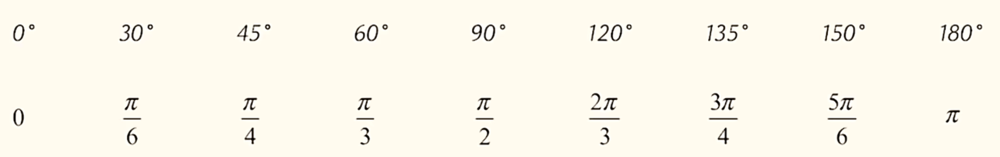
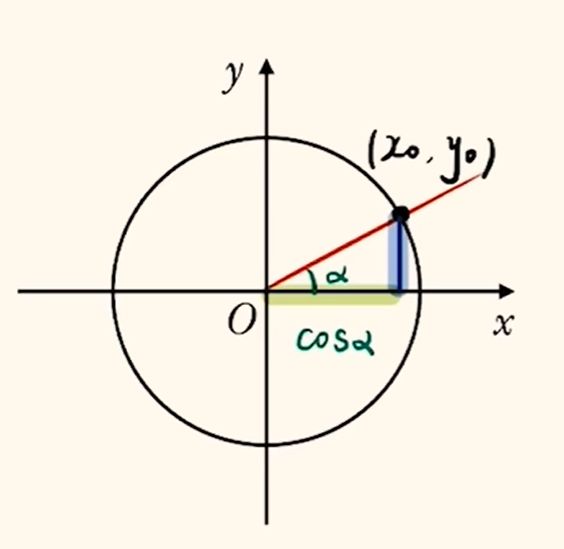
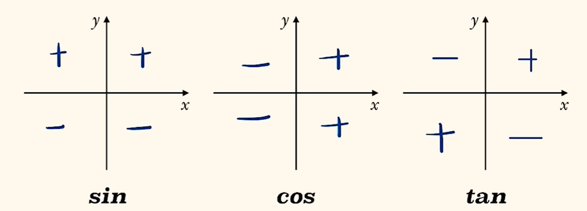
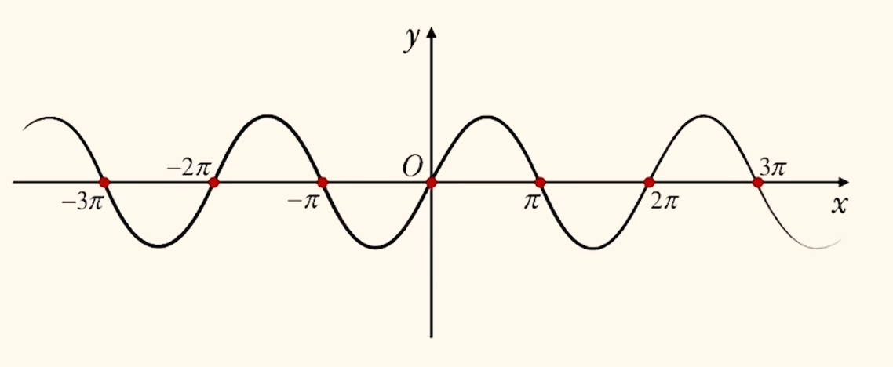
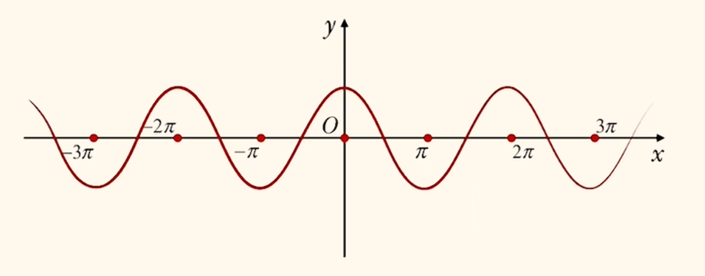
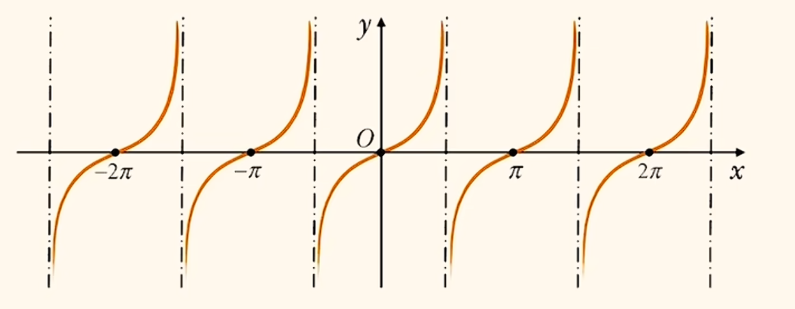
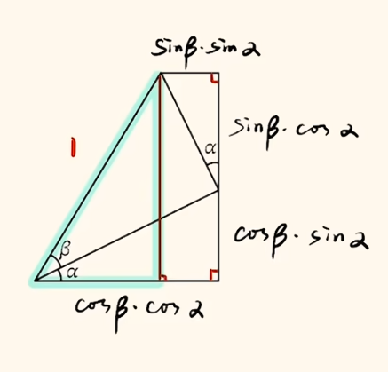
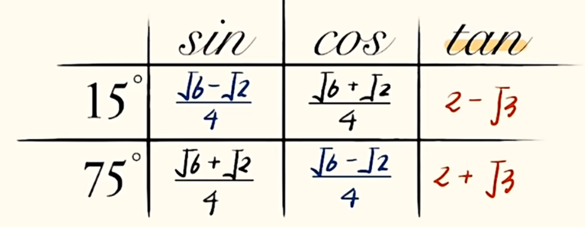
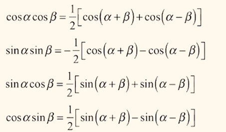
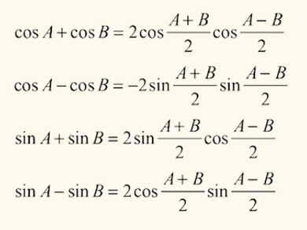

# 三角函数

## 弧度制

$\alpha = \frac{l}{r}$ , 其中 $l$ 为圆心角所对弧长, $r$ 为半径, 此公式算出来的结果须用弧度制表示, 单位为 $rad$ , 一般省略. 弧度制描述了弧长与半径之比与弧长的一一对应的关系. 特殊地, 周角为 $2\pi$ , 平角为 $\pi$ , 直角为 $\frac{\pi}{2}$. $0^\circ$ 角为 $0$ (单位省略).

弧度制与角度值相互转化, 用 $\pi = 180^\circ$ 即可. 如 $\frac{\pi}{3} = \frac{180}{3}^\circ = 60^\circ$ , $30^\circ = 30^\circ \times \frac{\pi}{180^\circ} = \frac{\pi}{6}$ . 整理特殊角度转化表是被建议的.

$$1 rad \approx 57.3^\circ$$

弧长公式与面积公式. $n^\circ$ 是用角度值表示的角, $\alpha$ 是弧度制表示的角.

角度制:
$$\frac{360^\circ}{n^\circ} = \frac{2\pi r}{l}\\\frac{360^\circ}{n^\circ} = \frac{2\pi r^2}{S}$$

弧度制:
$$l = \alpha r\\S = \frac{1}{2} \alpha r^2$$

可以发现弧度制角度的定义表达式即为弧长公式. 同时可以推导出:
$$S = \frac{1}{2} lr$$
若将扇形近似地看做三角形, 则此公式与三角形面积公式一致, 可以类比记忆.

## 任意角

存在比 $2\pi$ 还大的角, 故需要动态定义角度. 以 $x$ 轴正方向作为始边, 逆时针转动 $\alpha$ 角度后停留在终边. 可以发现, 所转角度与终边位置有关, 一个角度对应一个终边; 但一条终边可以对应无数个角度, 即 $\alpha + 2k\pi, k \in \mathbb{Z}$ (再转 $k$ 个一圈 $+2k\pi$, 半圈 $+k\pi$, 四分之一圈 $+\frac{k\pi}{2}$). 若顺时针转动, 角度为负值, 且越转越小.

终边落在第几象限就成为第几象限角. 注意第几象限角与锐角/钝角/直角无一一对应关系, 有可能转很多圈.

此部分题目由于可以转若干圈, 所以一定不要忘记写 $k \in \mathbb{Z}$ .

## 三角函数

如图是单位圆 $x^2 + y^2 = 1$, 半径为 $1$ . 规定 $x_0 = \cos\alpha, y_0 = \sin\alpha, \frac{y_0}{x_0} = \tan\alpha$ . 在这种定义下, 任意角都有三角函数(前提在定义域内). 可以发现三角函数可以为负, $\sin\alpha, \cos\alpha \in [-1, 1]$.

由单位圆可以发现:
$$\sin^2\alpha + \cos^2\alpha = 1\\tan\alpha = \frac{\sin\alpha}{\cos\alpha}$$

第一个平方和关系也暗含着正余弦之和与正余弦之积的直接关系: $(\sin\alpha \pm \cos\alpha)^2 = 1 \pm 2\sin\alpha \cdot \cos\alpha$ . 这也提示我们一个常数可以看做零次或二次的三角函数, 从而用于齐次式化简. 当然, 也可用于 $1$ 的代换, 在遇见齐次整式没有分母时, 可以除以此式化为齐次式.

由此可以实现三角函数知一求二. 但是更推荐画辅助三角形, 假设当前角度是锐角, 将已知三角函数表示在直角三角形里, 算出所求三角函数后再根据下文的符号看象限来判断正负. 注意不要在答题卡上画三角形, 直接写结果即可.

所谓符号看象限, 就是通过终边在第几象限来判断三角函数的正负. 上图需要熟悉.

解决三角函数问题可以画函数图像(下文), 也可以用单位圆, 单位圆更加直观. 注意, 一个三角函数值可能对应多个角度. 解得三角函数后要注意正负.

遇见有关 $\sin\alpha, \cos\alpha$ 的齐次式, 可以上下同除 $\cos^n\alpha$ ($n$ 为次数) 从而全部转化为 $\tan\alpha$ , 只需要求出正切值即可.

例题: $\tan\theta = 2, \sin^2\theta + \sin\theta \cos\theta - 2\cos^2\theta = \_\_\_\_\_\_.$

$1$ 的代换, $原式 = \frac{\sin^2\theta + \sin\theta \cos\theta - 2\cos^2\theta}{\sin^2\theta + \cos^2 \theta}$ , 上下同除 $\cos^2\theta$ 即可解得原式为 $\frac{4}{5}$ .

题目中出现三角函数的关系时, 可以考虑转化为单位圆中的几何关系, 或坐标之间的关系.

在三角形 $\triangle ABC$ 中, 若出现两角和, 如 $B + C$ , 考虑使用诱导公式转化为另一角 $\pi - A$ ; 或者三个角均有条件, 考虑 $A = \pi - (B + C)$ , 使用诱导公式和恒等变换处理.

锐角三角形的二级结论: $\sin\alpha > \cos\beta$ , 其中 $\alpha, \beta$ 为锐角三角形内任意两角(正弦值一定大于余弦值). 当题目出现锐角三角形的条件与不等式时, 考虑此二级结论.

角的范围陷阱: $\alpha, \beta$ 为锐角, $\alpha - \beta = \frac{\pi}{6}$ , 需要将一个角用另一个角表示, $0 < \alpha = \frac{\pi}{6} + \beta < \frac{\pi}{2}, 0 < \beta < \frac{\pi}{2}$ 解出 $\beta$ 的范围, 又可推出 $\alpha$ 的范围.

## 诱导公式

所有诱导公式均可用单位圆体现, 可以在第一象限推导, 所有象限均适用. 口诀: 奇变偶不变, 符号看象限.

第一组(正负):
$$\sin(-\alpha) = - \sin\alpha\\cos(-\alpha) = \cos\alpha\\tan(-\alpha) = - \tan\alpha$$

可以发现, 正弦和正切函数是奇函数, 余弦函数是偶函数.

第二组(偶不变):

$\sin(k\pi \pm \alpha), \cos(k\pi \pm \alpha), \tan(k\pi \pm \alpha)$ 分别与 $\sin\alpha, \cos\alpha, \tan\alpha$ 之间的关系, 函数名不变, 正负号看象限(下文). 偶不变体现在 $\frac{2k\pi}{2}$ 中的 $2k$ 上.

第三组(奇变):
$\sin(\frac{(2k - 1)\pi}{2} \pm \alpha), \cos(\frac{(2k - 1)\pi}{2} \pm \alpha), \tan(\frac{(2k - 1)\pi}{2} \pm \alpha)$ 分别与 $\cos\alpha, \sin\alpha, \cot\alpha(\frac{1}{\tan\alpha})$ 之间的关系, 函数名改变, 正负号看象限(下文). 奇变体现在 $\frac{(2k - 1)\pi}{2}$ 中的 $(2k - 1)$ 上.

符号看象限, 由于诱导公式适用任意角, 可以通过 $\alpha$ 为锐角的特殊情况画图(好处是等式一边恒为正, 只要看复杂的另一侧即可), 看旋转过后的终边落在第几象限判断复杂一侧函数名的正负号, 即是公式中的符号.

## 函数图像

三角函数具有周期性.

正弦函数图像定义域为 $\mathbb{R}$ , 值域 $[-1, 1]$ , 对称轴(分为两种, 取最大值时与最小值时) $x = \frac{\pi}{2} + k\pi$ , 对称中心(两种, 上行零点与下行零点所对应的) $(k\pi, 0), k \in \mathbb{Z}$, $2\pi$ 为最小正周期 $T$ (任何周期函数有无数个周期). 正弦函数是奇函数.

余弦函数定义域为 $\mathbb{R}$ , 值域 $[-1, 1]$ , 对称轴 $x = k\pi$ , 对称中心 $(\frac{\pi}{2} + k\pi, 0) , k \in \mathbb{Z}$ , $T = 2\pi$ . 余弦函数是偶函数.

特殊地, 正切函数定义域为 $x \ne k\pi + \frac{\pi}{2}$ , 值域为 $\mathbb{R}$ , 渐近线 $x = k\pi + \frac{\pi}{2}$ , 对称中心(两种, 一种是图像零点, 一种是渐近线与横轴交点) $(\frac{k\pi}{2}, 0) , k \in \mathbb{Z}, T = \pi$ .

三角函数中可以使用对偶式. 题目出现形如 $Acos\alpha + Bsin\alpha = C$ 的形式, 考虑对偶式. 写出此式的对偶形式 $Asin\alpha - Bcos\alpha = D$ (改名字, 变符号), 联立解方程组. 问题在于如何求解 $D$ . 考虑将两式平方后相加, 发现: $A^2\cos^2\alpha + B^2\sin^2\alpha + 2ABsin\alpha \cdot \cos\alpha = C^2, A^2\sin^2\alpha + B^2\cos^2\alpha - 2ABsin\alpha \cdot \cos\alpha = D^2 \Rightarrow A^2 + B^2 = C^2 + D^2$ 即可解得 $D$ . (结果式 $A^2 + B^2 = C^2 + D^2$ 直接记忆更方便)

三角函数的题目经常需要根据条件(如第几象限角, 所从三角函数值/正负判断角的大致范围)舍去不合理的解, 有时条件给的很宽泛, 需要自己根据隐含条件缩角, 这在三角函数恒等变换里也很常见(尤其是题目选项有多个解时). 当然, $k$ 的取值也需要从题目隐含条件中找, 以及一些范围要求, 如 $\omega$ 等.

## $Asin(\omega x + \phi) + B$

图像变换有很多种, 如平移变换(左加右减, 上加下减, 与 $\phi, B$ 有关); 伸缩变换(与 $A, \omega$ 有关, $|A| > 1$ 为纵向拉伸, 反之为纵向压缩; $|\omega| > 1$ 为横向压缩, 反之为横向拉伸). 注意, $\phi$ 不是单纯影响平移变换, 平移变换其还受到 $\omega$ 的影响, 更具体地, $Asin(\omega (x + \frac{\phi}{\omega})) + B$ 才是描述平移变换的形式.

$T = \frac{2\pi}{|\omega|}$ , 由此也可以发现横向伸缩变换与 $\omega$ 之间的关系.

各字母的物理含义: $A$ 为振幅, $\omega x + \phi$ 为相位, $\phi$ 为初相(位)(即始边(开始旋转)的位置, 与 $y$ 轴的交点有关(对应)), $B$ 为平衡位置, $\omega$ 可以理解为角速度, 与周期对应( $|\omega| = \frac{2\pi}{T}$ ).

可以将 $\omega x + \phi$ 整体换元为 $t = \omega x + \phi$ , 将 $t$ 代为普通正余弦的对称轴/对称中心/单调区间的表达式, 解方程即可得到函数的对称轴/对称中心/单调区间. (别忘了一些条件与范围也要换掉并如此化简) 或给出图像或已知复杂表达式, 带入已知点找对应点(最高点与最高点对应等)即可.

判断一个值是否是零点/对称轴/对称中心/单调区间, 带入即可, 注意符合函数的单调区间需要看内层与外层函数.

## 三角恒等变换

### 两角和差公式

由此图可以推导出以下公式:

可以发现 $\cos$ 相关公式前后符号不一致, $\sin$ 相关前后符号一致; $\tan$ 分子符号一致, 分母符号相反.

$\sin\alpha + \cos\beta$ 可以通过平方来用于两角和差, $(\sin\alpha + \cos\beta)^2 = \sin^2\alpha + \cos^2\beta + 2\sin\alpha \cdot \cos\beta$ , 如果有对偶的 $\cos\alpha + \sin\beta$ 即可消掉平方项的同时使用两角和差公式.

$\sin(\alpha + \beta) \times \sin(\alpha - \beta)$ 蕴含平方差公式(两式之和与之差), 化简可得 $\sin^2\alpha - \sin^2\beta$ 等.

由此可以推得 $15^\circ, 75^\circ$ 的三角函数值.

$\tan$ 的两角和差公式可以巧用, 具体地, $\tan45^\circ = 1$ 可以作为 $1$ 的代换, 即 $\frac{1 + \tan\theta}{1 - \tan\theta} = \frac{\tan45^\circ + \tan\theta}{1 - \tan45^\circ \cdot \tan\theta} = \tan(45^\circ + \theta)$ .

三角恒等变换中常用的技巧是切化弦, 即将 $\tan$ 值换为 $\frac{\sin}{\cos}$ 来表示. 遇见弦函数相乘从两角和差公式里找结果, 相加减可以两侧同时平方构造完全平方式从而变成相乘.

当给出几大坨公式的三角函数值时, 先不要着急展开, 找角关系(相加减试试), 有时换元能看得更清楚.

### 二倍角公式

$$
\sin2\alpha = 2\sin\alpha \cdot \cos\alpha\\
\cos2\alpha = \cos^2\alpha - \sin^2\alpha\\
\tan2\alpha = \frac{2\tan\alpha}{1 - \tan^2\alpha}
$$

可以发现, $\sin2\alpha$ 与平方和公式有关, 具体地, $(\sin\alpha \pm \cos\alpha)^2 = 1 \pm \sin2\alpha$ . 以及 $\cos2\alpha$ 与 $\sin^2\alpha + \cos^2\alpha = 1$ 有很好的联系:

$$
\cos2\alpha = 2\cos^2\alpha - 1\\
\cos2\alpha = 1 - 2\sin^2\alpha
$$

可以发现, 后给出的两个公式只与一个一倍角的三角函数有关, 用于已知一倍角求二倍角; 而第一个公式的特性是齐次式, 在齐次式化简中有很好的效果(正余弦还有很对称的地位, 在即便不是齐次式但正余弦函数地位对称的题目中也会使用).

二倍角的三角函数可以看做是二次的一倍角三角函数, 要么降次升角, 要么升次降角, 角度倍数与次数可以转化, 在计算分式次数时不要忘记.

进一步变形:

$$
1 + \cos2\alpha = 2\cos^2\alpha\\
1 - \cos2\alpha = 2\sin^2\alpha
$$

所以遇见 $1$ 加减一个余弦值就可以转化为其半角的三角函数值. 结合同样地形式正弦记忆, 作为升次降角公式:
$$1 \pm \sin2\alpha = (\sin\alpha \pm \cos\alpha)^2$$

以及降次升角公式(遇见平方项三角函数; 或想维持式子对称性但需要消掉 $\sin^2\alpha$ 与 $\cos^2\alpha$ 同时存在的平方项时两式同时使用从而避免使用$\sin^2\alpha + \cos^2\alpha = 1$ 破坏对称性):

$$
\cos^2\alpha = \frac{1 + \cos2\alpha}{2}\\
\sin^2\alpha = \frac{1 - \cos2\alpha}{2}
$$

不建议强行记忆, 灵活变形即可.

当然, 还可以用齐次式的思想进一步变形(分母除以 $\sin^2\alpha + \cos^2\alpha = 1$ 构造齐次式):

$$
\sin2\alpha = \frac{2\tan\alpha}{\tan^2\alpha + 1}\\
\cos2\alpha = \frac{1 - \tan^2\alpha}{1 + \tan^2\alpha}
$$

可以发现所有的二倍角三角函数均可用一倍角的正切 $\tan\alpha$ 来表示, 故此组公式成为万能公式. 当题目中同时出现 $\cos2\alpha$ 与 $\sin2\alpha$ 时, 可以考虑都转化为 $\tan\alpha$ .

题目有时会通过倍数暗示一个复杂角是有哪两个角的几倍相加得到, 从而避免复杂的换元, 如 $\alpha + 2\beta = (\alpha + \frac{\pi}{3}) + 2(\beta - \frac{\pi}{6}) $ .

## 辅助角公式

$Asin\alpha \pm Bcos\alpha$ 可以化简, 具体地, 考虑提出 $\sqrt{A^2 + B^2}$ 构造成为两角和差 $\sqrt{A^2 + B^2} \sin(\alpha + \phi)$ 的形式从而转化成方便使用的形式, 其中 $\phi$ 是一个常数, 一般是特殊角.

遇见正余弦函数想加减用辅助角公式.

## 和差化积与积化和差

积化和差公式(两角和差公式消元得到):

使用频率低, 难记忆, 且推导方便, 故建议现场推导.

将积化和差换元可得到和积化差公式:

同理建议现场推导, 推导时将相加减的两个三角函数使用两角和差公式展开(只写正余弦), 按符号操作, 会剩下包含符号的二倍的两个三角函数之积, 依次填入 $\frac{A + B}{2}, \frac{A - B}{2}$ 即可.

一般在两个正弦或两个余弦函数相加减时使用(若一个正弦一个余弦考虑使用诱导公式同一, 但需要将诱导公式转化后带常数的角看做整体; 或考虑辅助角); 以及在两个角相加减均出现, 或两个角有时是一个整体, 有时是分开写时使用. 当然, 在其他方法都无效后遇见三角函数的和差或积的形式也可考虑.

## 三倍角公式
