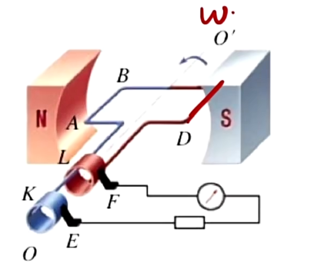
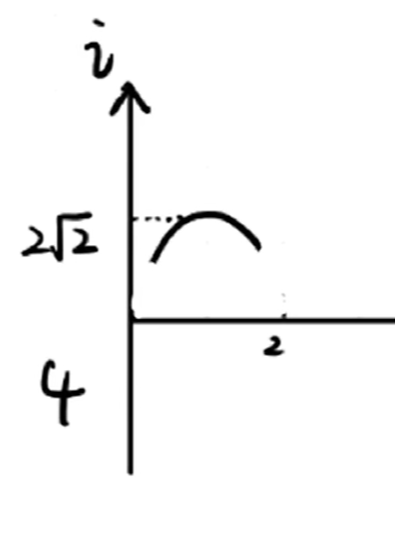

## 交流电 (待完善)

电流有交流电和直流电之分. 交流电即方向改变(图像上体现为穿过 $x$ 轴)的电流, 而直流电的方向不变. 特殊地, 大小也不改变的电流称为恒定电流.

一种简单的发电机结构如图. 此处导线在磁场内 __平动__ 切割磁感线(转动是围绕棒上一个定点转), 在导线内部产生电流. 由于角速度 $\omega$ 不改变, 所以线速度 $v$ 的大小不改变, 但是方向始终垂直于导线平面. 由于我们在计算的时候需要与 $B$ 方向垂直的 $v$ , 所以我们需要分解速度, 这就导致了切割方向上的速度大小改变了, 得到的电流就会随之改变.

想要确定电流的方向如何变化, 我们要使用右手定则. 可以发现当导线转过 $180^\circ$ 时, 切割方向改变, 所以电流方向改变. 通过表达式推导可以得出电流随时间的变化图像是一个正弦型函数(因为正交分解速度出现三角函数, 正弦型图像可以时对正弦函数进行变换, 所以余弦函数图像也包含在内).

那么产生交变电流的条件有: 线框平面不平行于磁场(即无论怎么转动都没有磁通量)且切割方向需要改变. 如果想产生标准的正弦/余弦函数图像, 需要匀速圆周转动.

## 中性面相关概念:

1. 中性面: 电流为 $0$ 时导线位置所处的平面.
2. 中性面的垂直面: 电流取到最大值(峰值)时导线位置所处的平面.
3. 频率 $f = \frac{1}{T}$ (单位 $Hz$ ), 转速 $n = f$ .

如图判断中性面/中性面的垂面的方法: 画 $v$ 与 $B$ , 如果平行(无法比出右手定则)则意味着没有切割磁感线, 即没有电流, 为中性面; 如果垂直(可以标准比出右手定则), 同理为中性面的垂面.

中性面与其垂面的特点(有些特点比如磁通量, 也可以用来简便判断是否是中性面或其垂面, 只需要看导线的平面是否与 $B$ 垂直/平行即可):

|      区分      |   中性面   |  中性面的垂面  |
| :------------: | :---------: | :-------------: |
|    线框位置    | $\perp B$ | $\parallel B$ |
|      电流      |    $0$    |      最值      |
|     电动势     |    $0$    |      最值      |
| 磁通量的变化率 |    $0$    |      最值      |
|     磁通量     |    最值    |      $0$      |

判断中性面与其垂面的目的: 根据它们的特点明白表达式中写的三角函数是 $sin$ 还是 $cos$. 其实只需要判断初始时的值并根据以上表格对应 $sin0$ 与 $cos0$ 即可得出其函数类型.

中性面有一个特点: 经过中性面时电流变向. 所以问电流变化次数的时候可以从一个周期经过两次中性面, 即电流变两次方向入手.

介绍一些常识: 我国交流电的频率: $50 Hz$ (打点计时器原理, $0.02 s$ 打一个点), 交流电电压(有效值): $220 V$ .

## 交流电的四值

*提示: 这一部分我们用小写字母(如 $e, i$ )等表示变化的量(瞬时值), 而大写的表示稳定的物理量.

### 瞬时值:

公式(其中 $sin$ 部分按照题目判断是否为 $cos$ , 属于正弦型函数 $f(x) = Asin\omega x$ ; $n$ 为匝数, $S$ 为线圈在磁场中的面积, $\omega$ 为角速度, $E_m$ 表示电动势的极值):

$$
e = E_m \cdot sin\omega t = nBs\omega \cdot sin\omega t
$$

这个公式( 

$$
E_m = nBs\omega
$$

 )并不要求转轴在中间, 即可以围绕面上任意一条轴进行旋转(包括边界为转轴甚至不规则图像但面积已知也可以), 但是前提是不能出磁场, 需要在 

__磁场内__ 的面积计算.
若要算瞬时磁通量变化率 $\frac{\Delta \Phi}{\Delta t}$ , 则有 $\frac{\Delta \Phi}{\Delta t} = \frac{E}{n}$ 先求瞬时 $E$ .

### 最(大)值:

公式:

$$
E_m = nBs\omega
$$

当 $cos\omega t/sin \omega t = 1$ 时取得.
代表用电器: 二极管, 电容器(都是击穿电压, 击穿后报废).

### 有效值:

定义: 在 __一个周期内__ 用电器的 __发热量__ 与 __恒定电流__ 在 __相同时间__ 内 __发热量相同__, 此时则称恒定电流的大小为交变电流的有效值, 电压的大小为交变电压的有效值.
计算( $Q_{交变}$ 根据焦耳定律或下面给出的结论写即可):

$$
I_恒^2RT = Q_{交变}, E_恒 = I_恒 R_总
$$

用处: 可以把我们不会计算的交流电等效成直流电, 也是很多问题的第一步.
结论:

$$
对于正余弦函数, I_{有效} = \frac{I_{max}}{\sqrt2}, E_{有效} = \frac{E_{max}}{\sqrt2}
$$

那么如果有不同或不完整的正余弦函数, 或者既有正弦型又有其他类型的图像怎么办呢? 我们可以将算得的 $I_{有效}$ 继续带入上述公式 $Q_{交变}$ 中从而计算出 $I_恒$ (即直接将曲线等效成一条直线再计算, 只要是 $\frac{1}{4}$ 周期的整数倍且不能为下图所示情况的图像, 都可以直接除以 $\sqrt 2$ 替换电流, 否则算出的答案一定比正确答案要大一些(图示部分比起正确情况普遍偏上)).

提醒: 计算周期的时候一定不要多或少了, 特别时二极管时, 单向电流, $I = 0$ 时也要算进周期内; 求有效值题目没给图像最好要自己画.
代表用电器: (交流)电流表, (交流)电压表(故电表不会来回摆动), 电阻, 灯泡(即所有的额定电压额定电流以及用于发热的元件, 如保险丝熔断电流, 因为发热量相同)
注意: 发电机的有效值恒定, 电压表的数值也恒定; 但是可能不相等, 因为有内阻分压, 电压表可能测的是路端电压.

外界(力)对线圈做的总功: 即算发热量(匀速转动, 能量转化). 由于与发热量有关, 可以等效成有效值. 然后算出有效电流, 用焦耳定律算出发热量.

### 平均值:

注意有效值 $\neq$ 平均值.
计算过程:

$$
\bar{I} = \frac{\bar{E}}{R + r}, \bar{E} = n \frac{\Delta \Phi}{\Delta t} = n \frac{\Phi_t - \Phi_0}{\Delta t}$$  
目的: 计算电荷量( $q = \bar{I} \Delta t = n \frac{\Phi_t - \Phi_0}{R + r}$ ).  
提醒: 其中 $\Phi_0, \Phi_t$ 只与初末状态有关, 与中间怎么变化的无关, 所以解题时只需要关注始末即可; 还要小心磁通量的正负(看穿入/穿出).  

## 电容器/电感相关

电容器在电路中的作用/特点: 
$$通交流, 隔直流; 通高频, 阻低频
$$

交流电能通过的原因是电源电压和电容器电压时时刻刻都会有一些差异, 导致电容器不断充放电. 但是通过的电流会受到一定的影响, 具体来说, 交流电频率越高, 越好通 ~~(趁电容不注意赶紧通过)~~ ; 电容越大, 越好通 ~~(容错(存储电荷)空间越多)~~ .

电感线圈在电路中的作用/特点:

$$
通直流, 阻交流
$$

注意这里只是阻碍交流电的流动, 而电容器却是直接断掉直流电. 阻碍的原因可以用楞次定律/自感现象解释. 受到的影响有, 频率越高, 越难通(电流变化的越剧烈, 自感的阻碍效果越强); 电感(系数)越大, 越难通(加强自感的阻碍效果).

其实以上结论可以把直流电看成频率为零的交流电( __非严谨__ , 方便记忆), 同样可以理解到.
