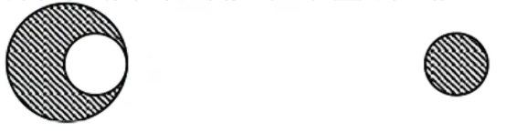
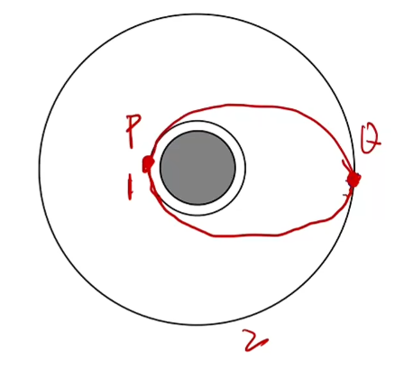
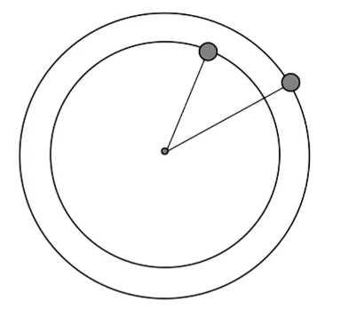
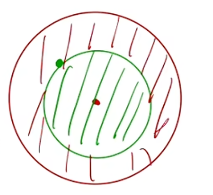
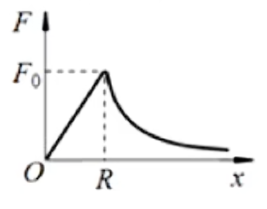

# 天体物理

## 物理学史

托勒密提出地心说, 且认为太阳绕地球做完美的圆周运动. 哥白尼反对, 提出日行说, 但仍认为地球公转轨道为标准的圆. 第谷持续观测星星, 记录许多太阳系数据(故后文得出的结论也为太阳系的结论), 十分精确. 开普勒为第谷学生, 数学功底深厚, 计算第谷测得的数据. 第谷疑似死于尿毒症或肾衰竭(一说在国王晚宴中憋尿憋死), 开普勒继承其意志研究数据(纯计算, 未进行任何实验), 发现每次计算误差为 $8'$ , 在检验自己计算以及第谷数据后推测公转轨道不为标准圆形. 他发现椭圆模型完美符合, 继续推演得到开普勒三大定律:

1. 行星绕恒星做椭圆运动, 恒星位于其中一焦点.
2. 相同时间内, 行星与恒星连线扫过的面积相同.
3. $\frac{a^3}{T^2} = k$ , 其中 $k$ 为常数 $\frac{GM}{4\pi^2}$ , 仅与中心天体的质量 $M$ 有关, $a$ 为椭圆半长轴长度, $T$ 为公转周期. 

继开普勒后牛顿提出万有引力, $F = G\frac{Mm}{r^2}$ , 但其未能得出常数 $G$ 的值. 随后卡文迪什通过扭称实验测得 $G = 6.67 \times 10^{-11}$ . 

实际上开普勒三大定律适用于所有行星, 尽管其研究数据仅限太阳系. 

## 开普勒三大定律

上文已经给出三大定律, 此处进行解释. 开普勒第二定律隐含着近日点速度大, 远日点速度小, 满足 $v_Ar_A = v_Br_B$ , 其中 $r_A, r_B$ 为 $A, B$ 点处到太阳焦半径长度. 开普勒第三定律中 $\frac{a^3}{T^2} = k = \frac{GM}{4\pi^2}$ 是唯一一个高中范围内可以解决椭圆轨道的公式. 由此公式也可知若行星距离同一恒星越远, 则周期越大(高轨低速大周期). 实际上行星的公转轨道十分接近圆形, 误差较小, 高中范围内简化为圆形, 即满足 $\frac{r^3}{T^2} = k$ (后文会详细展开).

## 万有引力定律

$F = G\frac{Mm}{r^2}$ , 其中 $M, m$ 为两物体质量(一般 $M$ 为中心天体质量, $m$ 为行星质量), $r$ 为质心间距. 任意两物体间均存在万有引力, 不过通常质量过小的物体不予考虑; 万有引力的方向指向对方物体的质心, 距离较近时由于物体无法看作质点, 万有引力公式失效, 可以发现天体满足条件, 万有引力显著. 

球体积公式为 $V = \frac{4}{3}\pi R^3$ , 若有关密度则考虑 $\rho = \frac{m}{V}$ 转化 $m$ 与 $V$. 

均匀球体质心在球心. 若挖去一部分, 则考虑割补法, 如图,  $F_{大球} = F_阴 + F_白 \Rightarrow F_阴 = F_{大球} - F_白$ , 分别求解即可. 

{ width=300px }

这里规范字母的使用: $R$ 一般指星球半径, $r$ 一般指质心间距/轨道半径(圆周半径), $h$ 为轨道高度(距离星球表面的高度, $r = R + h$ ). 

对于公转的物体, 常用的公式可以通过 $F_合 = F_向 = F_万$ 得到, 包括:

1. $G\frac{Mm}{r^2} = m\frac{v^2}{r} \Rightarrow v = \sqrt{\frac{GM}{r}}$
2. $G\frac{Mm}{r^2} = m\omega^2r \Rightarrow \omega = \sqrt{\frac{GM}{r^3}}$
3. $G\frac{Mm}{r^2} = m(\frac{2\pi}{T})^2r \Rightarrow T = 2\pi\sqrt{\frac{r^3}{GM}} \Rightarrow T^2MG = 4\pi^2r^3$ (踢踢母鸡等于死派派啊啊啊)
4. $a = \frac{F_合}{m} = \frac{GM}{r^2}$ 

在星球上(不公转的物体), $F_万 = mg \Rightarrow MG = r^2g$ , 即小鸡公式, 看见小鸡想母鸡, 因为只有这一个公式涉及 $g$ . 由于不同高度 $g$ 不同, 故若在星球表面则 $MG = R^2g$ ; 若一定高度则 $MG = (R + h)^2g$ . 

由公式易知, 高轨低速(不论线速度, 角速度, 加速度)大周期, 前提为同一个中心天体. 

地球的同步卫星(又称静止卫星, 相对赤道静止的卫星, 轨道半径 $42400 km$ )的周期为一天, 月球公转周期为一个月( $27.3 d$ ). 其他星球的同步卫星满足 $T = T_{自转}$ , 故同步卫星可以联系地面, 用于比较地球上与轨道内物体的速度, 周期等物理量.

比值问题一般需要已知 $r$ 之比, 否则要先求 $r$ 之比. 若中心天体不同可能也需要先求解 $M$ 之比. 总之列公式灵活应对即可. 

天体问题中的加速度有以下三类:

1. (合)加速度, $a = \frac{F_合}{m}$
2. 向心加速度, $a_向 = \frac{F_向}{m}$
3. 重力加速度, $g = \frac{G}{m}$

有时可能数值相等, 但此三个加速度本质不同. 同理我们也可以区分 $F_万, G, F_向$ 的区别. 

地球的第一宇宙速度为 $7.9 km/s$ (最大环绕速度(在增大就坠机了, 因为高轨低速大周期)/最小发射速度, 即当 $r = R$ (贴表飞行)时的速度, 故 $v = \sqrt \frac{GM}{r} = \sqrt{gR}$ ), 第二宇宙速度为 $11.2 km/s$ (脱离地球束缚绕太阳圆周运动所需的最小速度), 第三宇宙速度为 $16.7 km/s$ (脱离太阳束缚所需的最小速度). 其他星球不同.

题目中宇航员在星球上做运动学实验一般为了测 $g$ . 

星球密度 $\rho = \frac{M}{V} = \frac{M}{\frac{4}{3}\pi R^3}$ 求解即可. 若题目出现 $g$ 则用 $MG = r^2g$ 即可, 若未出现则用 $F_向 = F_万$ 即可. 

飞行器在太空中轨道上运行时理想状态下无需能量维持速度. 地轨道变为高轨道为克服万有引力需点火加速, 进入椭圆轨道, 为进入圆轨道需要再次点火加速(向椭圆切线方向进入轨道). 实际上此过程满足轨道 $1, 2$ 间高轨低速大周期(椭圆轨道不适用), 因为椭圆轨道速度会发生改变, 第二次点火加速的 $Q$ 点(远离中心天体的点)速度比第一次点火加速的 $P$ 点(靠近中心天体的点)速度小(类似近远日点的速度比较), 故可能满足. 总的来看, 有 $v_P > v_1 > v_2 > v_Q$ . 实际上椭圆上的速度一般在不等式两端可以直接填入. 

{ width=300px }

若比较 $a$ 的大小关系, 由于对于同一天体相同位置 $F_万$ 相同, 故 $a$ 相同, 故 $a_Q = a_2 > a_P = a_1$ . 加速度只取决于轨道高度. 

比较三个轨道周期 $T$ 的大小关系, 可以考虑使用开普勒第三定律, 因为椭圆轨道只有此公式适用, 转化为比较半长轴(半径)的大小关系即可得出 $T_1 < T_椭 < T_2$ (周期始终满足高轨大周期). 

反之, 高轨变低轨同理, 点火减速即可. 

双星问题为两个星球由于质量相近绕不存在的质心旋转而非将其一作为中心天体, 由二者间的万有引力相互提供向心力. 多星同理. 实际上多星系统中都存在 $\omega$ 相同, $T$ 相同. 

在双星问题中, 题目会分为询问关于其中一星球的物理量(如 $m_a, r_a$ 等)与二星球总的物理量(如 $m_总 = m_a + m_b, \omega$ 或 $T$ , 两星球间距 $L = r_a + r_b$ 等)两类. 实际上步骤比较相似, 首先先写受力分析, $G\frac{m_am_b}{L^2} = m_a\omega^2r_a, G\frac{m_am_b}{L^2}= m_b\omega^2r_b$ (不管问什么都写关于 $\omega$ , 因为 $\omega$ 相同需要使用). 列完后若题目问总的物理量则两式相加, 否则两式做比(得到 $\frac{r_a}{r_b} = \frac{m_b}{m_a}$ , 质量越小旋转越明显), 然后可能需要联立 $L = r_a + r_b$ . 

三星问题的受力更为复杂(但对其一分析即可), 但始终满足 $F_合 = F_向$ , 寻找 $F_合$ 与 $F_向$ 之间的关系即可, 注意题目中 $r$ 一般为其中两星球的质心间距, 而非到圆周运动圆心的半径, 一般需要数学关系转化. 若三星质量不等则可能需要寻找质心以计算轨道半径, 先寻找其中两颗星(一般选择质量相等的星, 如果存在)的质心, 将二者质量全部放于此质心上, 转化为双星系统后再找创设的质心与第三颗星的质心即可. 

{ width=300px }

天体的追击相遇问题实际上是问天体合适距离最近距离最远. 追击相遇问题考虑相对运动, 以其一为参考系, $\omega' = \omega_1 - \omega_2$ 即可表示时间. 若涉及多解问题则考虑多转 $k$ 圈即可(对 $\theta$ 加 $2k\pi$ ). 

实际上上文中提及的小鸡公式 $MG = r^2g$ 前提为 $F_万= mg$ (不考虑自转或两极地区), 实际上在星球上仅两极地区满足此条件(圆周运动 $r = 0$ , 无需自转所需的向心力). 除了两极地区, 题目还可能考察赤道上(其他位置类似), $F_万$ 为 $mg$ 与 $F_向$ 的合力, 逐个展开即可(赤道上均指向内部, $F_万 = F_向 + mg$ 无需分解, 其他非赤道非两极地区需要画图分解). 

{ width=300px }

质量分布均匀的球壳对壳内部物体的万有引力为零, 类比静电屏蔽. 如图, 红色部分为球壳, 对绿色实心点的万有引力为零, 故只需考虑红色部分对此点的万有引力, 即总是考虑脚下部分对自身的万有引力. 由于在球体内部, $F = G\frac{Mm}{r^2}$ 中 $r$ 变化会直接导致 $M$ 变化, 由于密度不变, 故考虑展开 $M = \rho \cdot \frac{4}{3}\pi r^3$ , 则 $F = G\rho\frac{4}{3}\pi rm$ , 为关于 $r$ 的正比例函数, 如图. 

{ width=300px }