# 原子物理

任何物体都在进行热辐射(电磁波), 且与温度等有关. 

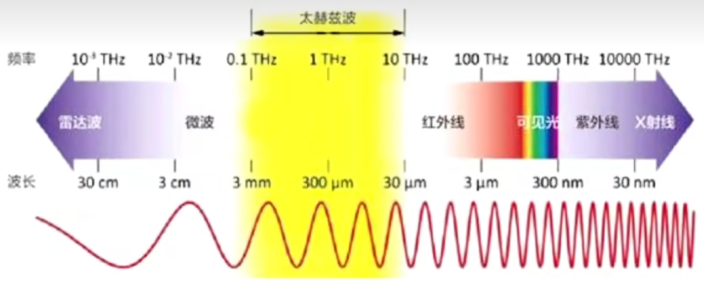

其中无线电波又可以依次分为长波, 中波, 短波. $X$ 射线外还有 $\gamma$ (伽马)射线 频率越大, 能量越大, 破坏力越大, 由此可以记忆可见光频率大小由大到小为紫 $\to$ 红, 波长可以推导得到由大到小为红 $\to$ 紫. 

测量热辐射时要排除物体反射的干扰, 所以提出了黑体, 即反射率和透射率为零, 吸收率为 $100 \%$ . 黑体(如太阳, 黑暗中的灯泡等)不一定是完全无光/黑色, 因为还有自身辐射. 

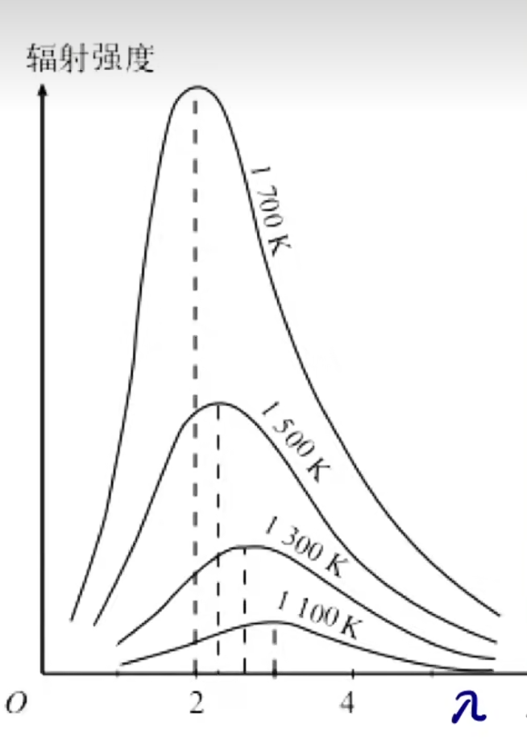

可以发现很多波长的波会被辐射出, 且各个电磁波辐射强度不完全相同, 且温度升高辐射强度增大(对于每个波长均适用, 故图像不相交). 随着温度升高, 辐射最强的波长往小的方向移动, 即频率变大, 能量变大. 

维恩(短波接近)和瑞利(长波基本一致, 短波方向背离(紫外灾难))推导出了这个图像的表达式, 但不准确. 普朗克得到吻合的表达式. 他提出带电微粒的能量只能是能量子的整数倍, 即能量量子化. 有公式:

$$E = h \nu$$

其中 $h$ 是普朗克常量( $6.63 \times 10^{-34} J \cdot s$ ), $\nu$ (读作 $nu$)是在微观中的频率, $E$ 是能量. 

随后爱因斯坦又提出光本身也由不可分割的光子组成, 仍然符合 $E = h\nu$ . 可以发现光既是电磁波又是粒子, 既又波性又有粒子性, 故有波粒二象性.

真空下光速: $3 \times 10^8 m/s$ , (颜色)光的频率: $E = h\nu$, (亮度)光照强度公式: $nh\nu$ , 其中 $n$ 为光子个数. 由于难以改变灯的频率, 所以一般通过改变光子个数来改变光照强度. 

$J. J. $ 汤姆孙发现了电子(阴极射线的粒子称为电子), 并提出枣糕模型, 即原子是球体, 正电荷均匀分布, 电子镶嵌其中(可能地他认为电子体积大于正电荷(质子), 在现在来看此模型明显不恰当). 此后卢瑟福通过 $\alpha$ 粒子散射实验提出核式结构模型, 认为所有带正电部分体积很小但几乎占有全部质量, 电子在外部运动. 

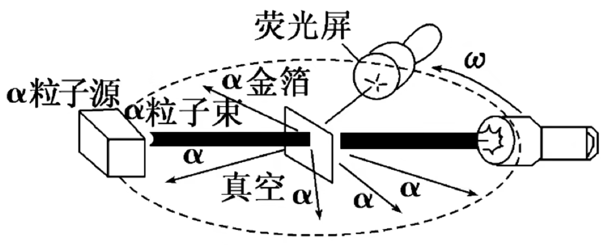

$\alpha$ 离子是氦核( $^4_2He$ ) , 大部分会穿过金箔, 少部分偏转较大或被原子核反弹(由于库仑力作用而非碰撞, 且同带正电是排斥而非吸引). 实验过程中因电子质量过小而忽略了电子的作用; 使用金箔的原因为其原子质量/体积较大, 难以被击中后移动, 且延展性好更易得到薄膜. 

经典理论认为电子随着旋转能量减小, 应该靠近原子核, 然而事实是原子是稳定的系统, 它的电磁场不会随电子周期运动而周期变化, 测得光谱为分立的线状谱, 而非连续谱. 由此玻尔提出电子出现的轨道是量子化的, 即电子有特定的轨道. 电子在不同轨道上运动时, 原子处于不同状态, 具有不同能量, 因此原子的能量是量子化的, 数值称为能级. 能量最低的状态为基态( $E_1$ ), 其余为激发态( $E_x , x = 2, 3, \dots$ ). 图片中所示能级之间差距(不是实际间隔)越大能量差越大, 具体地 $E_1 = -13.60 eV, E_2 = -3.4 eV, E_3 = -1.51 eV$ 等, 实际上有 $E_n = \frac{E_1}{n^2}$ , 可以发现能级差随着能级增大而减小. 电子从低能级向高能级跃迁, 电子接收光子能量(必须要刚好的能量, 如从第一能级跃迁至第二能级需要且只需要 $E_2 - E_1$ 的能量)或实物粒子(电子)撞击(能量需大于所需能量)后会发生原子跃迁/电子跃迁, 检测到分立的吸收光谱; 电子从高能级向低能级跃迁不稳定, 即会自动往下掉, 同时向外辐射电磁波(光子), 检测到分立的发射光谱. 若电子接收到的能量过大就会脱离原子核束缚, 即电离. 实际上能级均为非正值, 规定最外层能级为 $0$ . 

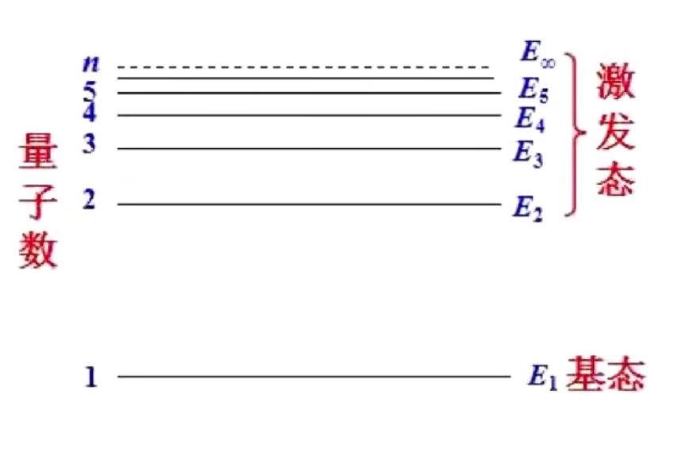

单个电子从高能级( $E_n$ )向低能级跃迁时可能产生 $1 \sim (n-1)$ 种不同频率的光, 当逐级向下时种数最多; 大量电子时产生 $C_n^2$ 种. 

## 光电效应

电子会因光子带来的能量从而脱离原子核束缚, 即光电效应. 单个光子需要达到一定能量才可发生光电效应, 且多余的能量会转化为光电子的最大初动能( $E_k$ , 仅与频率有关). 

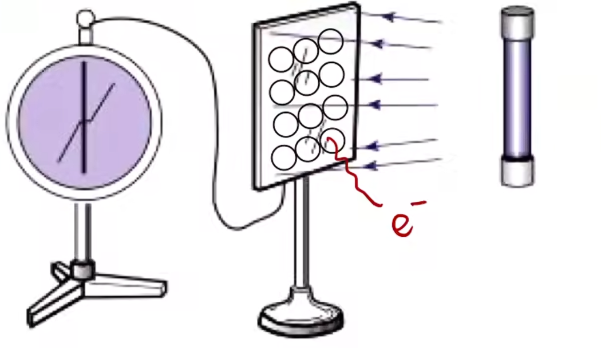

紫光灯(频率大, 易发生光电效应)照射锌板, 电子逸散到空气中, 验电器检测出正电. 光子能量满足最小逸出功( $W_0$ )是使得(最外层)发生光电效应的必要条件. 有:

$$E_k = h\nu - W_0$$

显然刚好发生光电效应时满足 $0 = h\nu_0 - W_0$ . 

电子逸出后的方向在不施加外部电场的情况下是随机的, 此时产生的光电流较小. 若外加电场, 电子会被吸引, 导致原本偏离不打中极板的电子击中极板, 光电流增大; 增大电压, 直到所有电子都能够打中极板, 此时电流不再增大, 称为饱和光电流. 

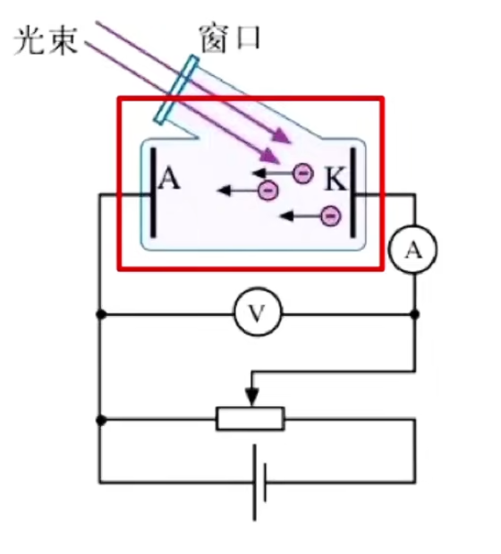

实际上光电流饱和后可以继续增加, 光电流仅与光电子个数有关, 需要增加光强/光子数目(增加频率不可因为不改变光子数量, 即不改变打出电子数量(一个光子打出一个电子)). 

反接电源, 排斥打出的电子, 当没有一个电子打到极板时的电压为遏止电压. (列动能定理)公式为: 

$$qU = E_k$$

可以发现遏止电压仅与最大初动能, 即频率有关. 求击中极板的动能列动能定理 $Ue = E_k' - E_k$ 即可. 

截止频率(极限频率, $\nu_0$)为刚好发生光电效应时入射光的频率, 小于此频率光子能量不足以使电子逸出. 极限波长( $\lambda_0$ )也代表了截止频率, 有:

$$h\nu_0 = h\frac{c}{\lambda_0} = W_0$$

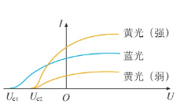

图像与横轴交点为遏止电压, 最大光电流处为饱和光电流. 

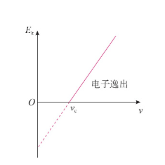

直线与横轴交点为截止频率, 与纵轴交点为最小逸出功, 斜率为 $h$ , 表达式为 $E_k = h\nu - W_0$ . 若为 $U - \nu$ 图像, 则由 $Ue = E_k$ 满足 $U = \frac{h}{e}\nu - \frac{W_0}{e}$ . 

计算电子个数可以使用公式 $q = ne = It$ .

## 原子核

天然放射性现象是放射性原子核内部自发放出射线的现象. 有三种射线:
1. $\alpha$ 射线, $He$ 核, 速度为 $0.1c$, 带两个单位正电荷.
2. $\beta$ 射线, 高速电子流, 速度为 $0.99c$, 带一个单位负电荷.
3. $\gamma$ 射线, 光子(电磁波), 速度为 $c$ , 不带电.

可以发现质量 $\alpha > \beta > \gamma$ (光子静止质量为 $0$ ), 电离能力 $\alpha > \beta > \gamma$ (与速度负相关, 电荷量正相关); 穿透能力相反, $\gamma > \beta > \alpha$ (与速度和质量正相关). $\alpha$ 射线可被薄纸挡住, $\beta$ 射线穿透薄纸被铝板挡住, $\gamma$ 射线可穿透铝板被铅板挡住. 

由于带电量的区别, 三种射线会在电场或磁场中偏转分离. 在磁场中由 $r = \frac{mv}{qB}$ 可比较偏转半径(主要有质量主导, 因为差距大(由于原子核质量差距远大于速度的十倍与电荷的两倍)); 由左手定则可以判断偏转方向. 电场中偏转方向按照带电正负判断; 通过 $a = \frac{qE}{m}$ 可以判断偏转的快慢(偏离程度)(同理质量主导). $\gamma$ 射线不带电, 不偏离. 总之即 $\beta$ 易偏, $\gamma$ 不变. 

$^A_ZX$ 描述了 $X$ 元素的质量数 $A$ , 核电荷数/质子($p$ 或 $^1_1H$)数 $Z$ , 中子($^1_0n$)数 $A - Z$ . 接下来研究核反应方程. 

衰变有两种:
1. $\alpha$ 衰变: 原子核放射出 $\alpha$ 粒子, 如 $^{238}_{92}U \xrightarrow{\quad} ^{234}_{90}Th + ^{4}_{2}He$ .
2. $\beta$ 衰变: 原子核放射出 $\beta$ 粒子(注意此处电子不是核外电子, 而是质子转化为中子时放出的电子), 如 $^{234}_{90}Th \xrightarrow{\quad} ^{234}_{91}Pa + ^{0}_{-1}e$ . 可以发现 $\beta$ 衰变不改变质量数. 

注意使用箭头, 且核反应方程满足质量数守恒, 质子数/核电荷数守恒. 可以发现不存在 $\gamma$ 衰变, $\gamma$ 射线伴随 $\alpha$ 与 $\beta$ 衰变发生. 

求一个元素衰变到另一个元素分别经历几次 $\alpha$ 和 $\beta$ 衰变, 可以把握 $\beta$ 衰变不改变质量数, $\alpha$ 衰变减少四个质量数的特征计算. 

在匀强磁场中, 若原子核发生 $\alpha$ 衰变, 则由于动量守恒, $\alpha$ 粒子与原子核由于均带正电则向不同方向开始运动, 形成两个外切的圆. 比较二者半径根据 $r = \frac{mv}{qB} = \frac{p}{qB}$ , 只需比较电荷量即可, 一般原子核带电量大(电荷数小的元素一般无放射性, 依据题目为准). $\beta$ 衰变同理, 请读者独立分析. 实际上此时为两个内切的圆, 且仍然一般原子核运动半径小, 两种衰变一致. 

半衰期为放射性元素的原子核有半数发生衰变所需的时间. 半衰期为统计规律, 只适用于大量原子. 不同放射性元素半衰期不同, 且其只与原子核内部结构有关, 与原子存在形式无关(不论离子, 单质, 化合物等, 或给予高温高压等条件). 剩余质量(相应原子质量, 不是总质量, 原子转化为其他原子即不计入)为 $m_剩 = m_原 \cdot (\frac{1}{2})^n$ , 衰变质量 $m_衰 = m_原 - m_剩$ . 

人工核反应代表如下:

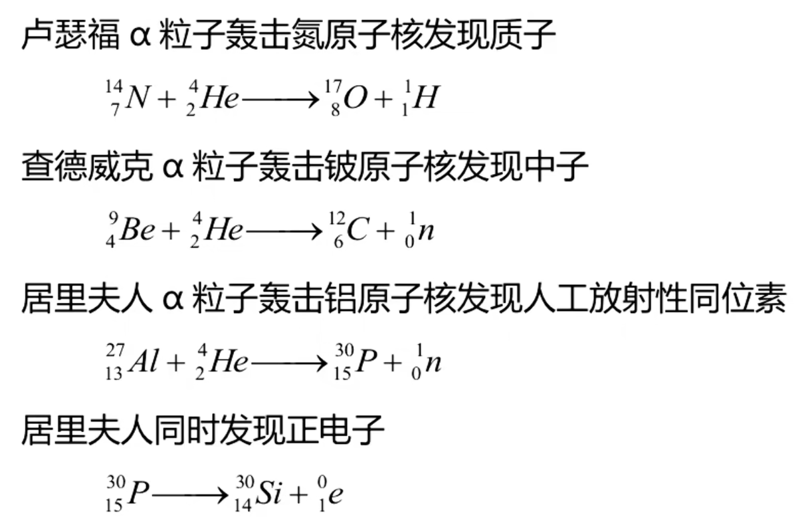

可以发现科学家十分喜欢使用某个粒子($\alpha$ 粒子)加速去轰击其他原子核. 

核裂变为链式反应, 产物中子又是反应物. 可以发现核裂变为一个重核裂变为多个重核, 如 $^{235}_{92}U + ^1_0n \xrightarrow{\quad} ^{141}_{56}Ba + ^{92}_{36}Kr + 3^{1}_{0}n$ . 过程中镉棒可以用于吸收中子以调节反应速度, 慢化剂石墨与重水可以使快中子变为慢中子, 铀棒作为底物, 外层需要水泥防护层. 

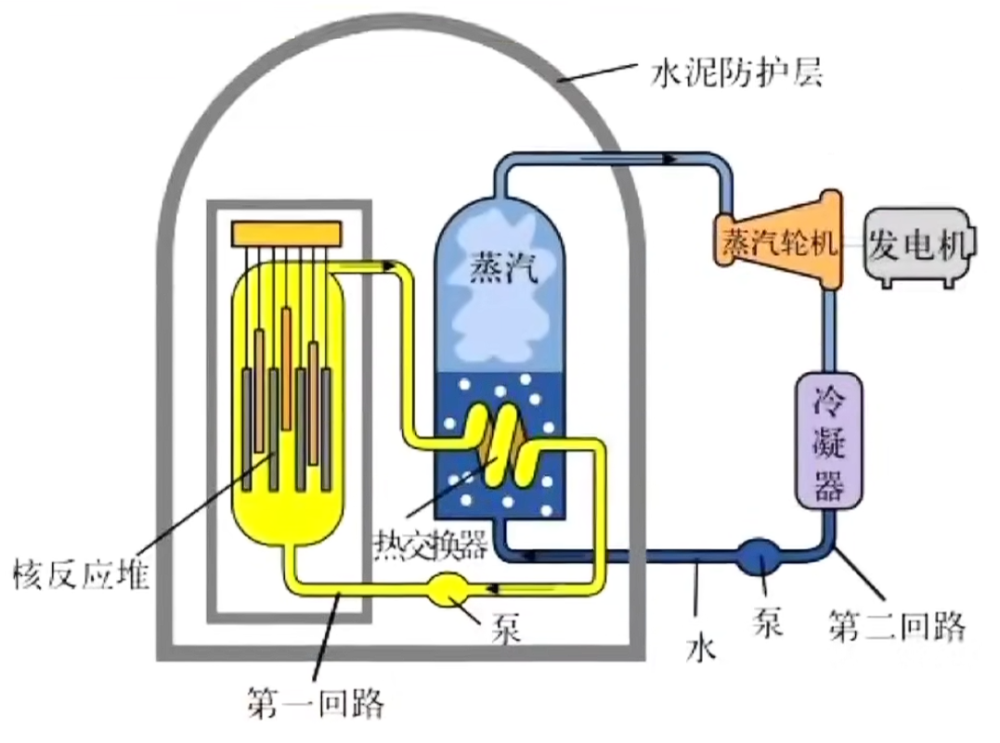

一个核裂变反应装置可能包含原子燃料, 减速剂, 冷却系统, 控制调节系统等, 不建议大家直接上手制造核反应堆. 

核聚变又称轻核聚变, 热核反应, 需要极高的温度, 以往如氢弹通过核裂变反应提供. 核反应方程有 $^2_1H + ^3_1H \xrightarrow{\quad} ^4_2He + ^1_0n$ 等. 可以发现其中既产生 $\alpha$ 粒子又产生中子, 反应物为氘核与氚核(氕核/氢核为质子).

实际上电荷数和质量数守恒不代表质量守恒, 因为中子与质子实际上质量不同, 但方程中认为相同. 所以有质能方程 $E = mc^2$ . 可以理解为质量与能量是等价的, 但并不能认为是质量与能量相互转化. 方程中质量单位可能为 $u$ , 即原子质量单位, 碳原子质量的 $\frac{1}{12}$ ; 能量单位可能用 $MeV$ , 即兆电子伏(特) ,  代入方程 $1 u$ 对应 $931.5 MeV$ . $1 MeV = 10^6 \times 1.6 \times 10^{-19} C \times 1 V = 1.6 \times 10^{-13} J$ . $u$ 与 $kg$ 间的换算可以通过质能方程分别代入 $MeV$ 与 $J$ 得到. 题目中常常要先计算亏损或增多的能量, 再结合动量守恒与能量守恒解决.

原子核的核子(中子与质子)间有强相互作用, 即核力. 在原子核的尺度上核力远大于库仑力, 故带正电的核子不表现为相互排斥. 核力是短程力, 作用范围在 $1.5 \times 10^{-15} m$ 内, 大于 $0.8 \times 10^{-15} m$ 时体现为吸引力, 小于时体现为斥力, 因此核子不会融合在一起. 

越重的元素, 中子数与质子数相差越大, 需要额外的中子以缓和质子间的库仑力, 但较轻的原子核质子数与中子数大致相等. 

结合能为将核子分开所需要的能量, 或使分散的核子结合在一起所需要的能量, 可以类比键能. 可以发现, 结合能与原子核大小有关, 所以应该计算比结合能, 即结合能与核子数(代质量数)的比值. 比结合能越大,核子结合越牢大, 原子核越稳定, 能量越小. 

有一类题会有一类先增后减或先减后增的函数图像(如下图), 横轴为质量数或原子序数, 纵轴为平均质量或平均结合能(比结合能). 题目会询问原子核结合或分解时吸收还是释放能量. 实际上若纵轴是平均质量只需要使用质能方程即可转化, 若纵轴是比结合能可以通过能量越小越稳定, 比结合能越大越稳定来分析, 即比结合能大/小 $\Rightarrow$ 稳定/不稳定 $\Rightarrow$ 能量小/大. 要注意在分析平均质量题目时, 如下图中, 假设 $\bar m_B$ 与 $\bar m_C$ 分别为 $B$ 与 $C$ 的平均质量, 那么 $B$ 与 $C$ 的平均质量 $\bar m$ 一定在 $(\bar m_B, \bar m_C)$ 之间, 显然小于 $\bar m_A$ , 故由此可以分析出 $A$ 分解为 $B$ 与 $C$ 后质量减小, 能量减少, 释放能量. 

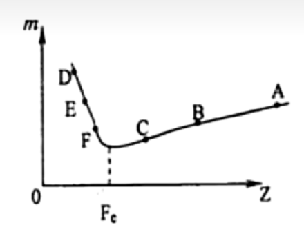
