# 电学

电荷分为正电荷与负电荷, 高中内认为分别对应电子与质子, 电子可以自由移动. 丝绸摩擦过的玻璃棒显正电, 毛皮摩擦过的橡胶棒显负电. 物体的电荷量 $Q$ (或 $q$ )是正负电荷的差值, 单位 $C$ (库仑). 元电荷 $e$ 是电荷量的最小单元, 大小约为 $1.6 \times 10^{-19} C$, 所有带电体的带电量均为 $e$ 的整数倍, 质子, 电子, $Na^+, Cl^-$ 等粒子的带电量为 $e$ . 点电荷, 即把一个带电体理想化地看做一个带电荷有质量无体积的点, 类比质点. 比荷, 即荷质比, $\frac{q}{m}$ . 同种电荷相互排斥, 异种电荷相互吸引. 带电体可以吸附轻小物体.

## 三种起电方式

电荷守恒: 电荷不能凭空产生或消失, 三种起电方式均是电子转移, 电荷不均匀分布导致物体对外界显电性.  电荷的数值发生变化, 是因为正负电荷相互抵消导致对外不显电性, 而不是电荷消失了.  

### 摩擦起电

不同物体对电子的束缚能力不同, 一部分电子从一个物体转移到另一个物体.  
这个过程只会发生在绝缘体中, 过程中电荷守恒.

### 接触起电

两个带电导体电荷量不相等, 接触后发生电子转移, 二者电荷量变为相同, 其中电荷守恒.  
计算二者的电荷量(相同)往往是先中和在平分, 即先算出接触后的总电荷量, 然后平均分给二者.  

### 感应起电

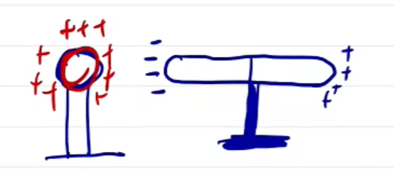

一个带电导体靠近另一个导体(不接触), 如图, 导体棒左端感应出与小球异种电荷, 右端感应出同种电荷. 可以简单认为是同性相吸, 异性相斥, 引起了电子的移动, 而正电荷不能移动就留在原地, 导致了电荷分布不均匀. 当然拿走带电金属后电荷因为正负吸引重新均匀, 除非将正负电荷分开, 电荷就无法恢复.   

用手碰带电金属或接地时等价的, 即将整个金属多余的电荷导入(负电荷移动)大地(使其(局部)带电量为零). 但若此金属内的电量是由另一带电导体感应引起的, 则只能导走较远端的电荷, 近端的电荷仍然会被吸引住, 此时整个导体带电(即使移走带电金属, 电荷会平均分布带仍然带电). 注意若靠近带电金属的一端接地近端仍然带电, 远端的电荷会被导走, 只要金属接地都符合以上规律, 与哪里一部分接地无关.  

## 库仑定律

带电体之间的吸引或排斥受到力的作用, 这个力在两点电荷连线方向上, 称为库仑力. 表达式:
$$F = k \frac{Q_1Q_2}{r^2}$$
其中 $k$ 是静电力常数, $r$ 是两点电荷之间的距离, $Q$ 分别为两个物体的带电量. 可以发现这个公式与万有引力的公式特别像, 实际上这两个点电荷之间也会有万有引力, 但库仑力要远大于万有引力, 所以一般只考虑库仑力的作用. 这个公式只适用于点电荷(其余情况用电场力相关公式计算).

一类经典的题目是三个带电小球共线排列, 问其电性, 带电量以及距离. 这种三点共线的题目符合两同夹异, 两大夹小, 近小远大的规则. 即两边的小球电性相同且较大, 与中间的电性相反; 两侧的小球距离中间小球越远带电量就越大 (不一定与中间小球等距, 为了弥补距离带来的缺陷), 具体可以用公式算, 题目问什么就分析什么, 若得不出答案就继续分析另一个(中间那一个), 因外力共同运动间距不变时不要忘了整体法的运用.   

## 电场基础

电场是真实存在但是看不见摸不着的物质, 电荷会激发电场, 通过电场(力)作用于其他物体. 我们可以引入试探电荷来探测场源电荷的电场. 我们可以用电场强度 $E$ (单位: $N/C$ 或 $V/m$)来衡量电场的强度. 公式为: 
$$E = \frac{F_电}{q}$$
其中 $F_电$ 是电场力, $q$ 是试探电荷的带电量. 这是一个比值定义式, 所以场强(电场强度)与放入的试探电荷无关, 只与电场本身有关. 场强是矢量, 其方向与带正电的试探电荷在电场中的受力方向一致. 

场强可以由场源电荷以及距离其距离来决定, 有: 
$$E = k\frac{Q}{r^2}$$
其中 $Q$ 为场源电荷的带电量, 只适用于点电荷. 

我们可以用电场线来描述电场的方向与强弱. 电场线在现实中不存在, 是人为想象出来的. 电场线的方向代表了电场强度的方向, 疏密程度代表了电场强度. 可以发现, 我们可以由电场线推得电场中带电物体的手里方向, 正电物体与电场线箭头方向一致, 负电物体与其相反. 可以得到正, 负点电荷的电场线, 即从正点电荷指出, 指入负点电荷. 

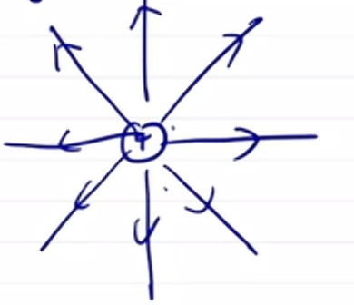

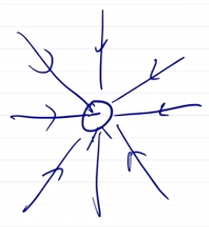

以下是等量异/同种电荷之间产生的电场线, 如果带电量不相等则会使图形偏移导致不对称. 其中的电荷受力方向为电场线切线方向. 

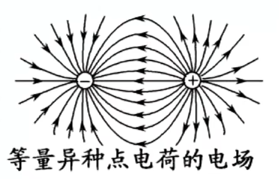

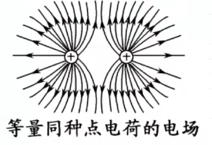

由此我们也可以得出其中场强的变化. 若不通过电场线, 可以考虑极限法, 当无限趋近于电荷时, 场强趋近于无穷, 由此可以判断连线上场强变化. 连线中垂线上的分析可以通过始末状态, 距离无穷远的位置场强为零. 要注意的是, 等量同种电荷连线中点场强为零, 无穷远地方场强为零, 故在中垂线上从中点开始运动是先增大后减小. 当然, 直接画电场线往往会更加直观简单.  

电场线不能相交, 闭合, 电场可以叠加(矢量). 匀强电场是电场强度(方向, 大小)处处相等的电场, 可以用一组平行的电场线来表示. 

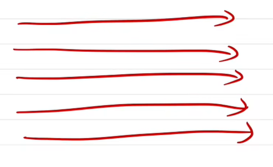

场强是可以叠加的, 符合矢量合成. 

如图所示, 形如-\`_\`-的这类题往往除了比较显然的场强为零的点意外, 还有在外部的一个点场强为零(通过受力分析可以判断). 直线上场强方向为 
$$-<->-\ominus-<-\oplus->->-$$ 
形象化地, 距离很远观察认为如图这是一个带三个正电荷的点电荷, 电场线指出正电荷, 但靠近看有负电荷, 靠近负电荷电场线指向负电荷. 显然左侧场强方向改变, 一定有一点场强为零. 我们可以设此点到左侧电荷的距离为 $x$, 结合两电荷之间的距离 $L$ , 列左右所受电场力平衡即可. 其实这就是三点共线题目的变式. 

带电圆环内部只有圆心场强为零. (对称思想) 所以一条垂直穿过圆环中心的直线上(从圆心到无穷远)电场的变化为从零开始先增大再减小为零. 球体和球壳所带电量均可以看作全部在其中心. 注意只有球壳内部场强处处为零, 球体不是.  带电圆盘也不能用点电荷的公式计算, 只能通过其他电荷受力来反推. 半球壳/半圆环补成完整球壳/圆环, 不完整图形要补成完整图形, 因为圆环和圆球对应的条件必须用上, 要不然也不会给特殊图形. 

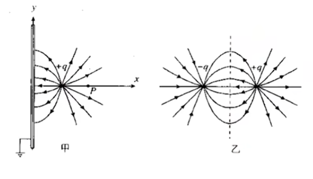

这种接地的金属板会因为右侧的点电荷感应出负电, 二者的电场线与等量异种电荷的一半一致, 可以看做将右侧正电荷关于金属板对称到左侧的负电荷. 

遇到特别多个(一般大于四个)小球围成环状时, 我们可以考虑单独看一个(最特殊的), 把剩余的看成不规则整体由对称性直接看合场强. 如图中例题, 我们为了使用对称性把不完整的圆环补成完整圆环将 $A$ 变为 $+q$ 分析, 然后单独考虑 $A$ 以及其他电荷的合场强即可得到 $A$ 为 $-q$ 时其产生的场强. 

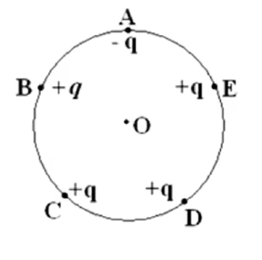

## 电势能

我们研究带电物体在电场中的能量变化情况. 可以发现, 电场力做功: 
$$W_电 = -\Delta E_{p电} = qEd$$
其中 $d$ 是沿(仅匀强电场适用)电场线方向上的位移. 与重力做功一致, 电场力做功也是只与初末位置有关. 现在我们想知道电场力做功消耗了什么能量. 与重力类似地, 消耗电势能( $- E_{p电}$ ). 

电势($\phi$), 即:
$$\phi = \frac{E_{p电}}{q}$$
电势是标量, 单位为 $V$ , 可以理解为一种从能量角度描述电场环境的物理量. 电势差(电压), $U$ , 即 $\Delta \phi$ . 有: 
$$U_{ab} = \phi_a - \phi_b$$
电势差是标量, 但是有正负, 反映电势高低. 注意电势差不是电势变化量, 所以不是末减初而是初减末. 

电势越靠近正电荷越高, 越靠近负电荷越低, 沿电场线降低. 默认无穷远或接地为零势能点, 同一位置正负电荷电势能相反, 电势相同. 

第一幅图中两点电荷连线的中垂线是零势能面, 始终距离正负电荷一样近(或者从电场线来看一直垂直于电场线运动电势不变). 第二幅图中连线上电势先减小再增大(距离谁近受谁影响大(或者由对称性可以得到)), 中垂线上(从中点到无穷远)距离正电荷越来越远, 电势越来越小. 

电势能可以结合电势以及电性来看. 正电荷变化趋势与电势相同, 负电荷相反. 

等势面(线)上电势相等. 等势面总垂直于电场线. 沿着等势面移动电荷电场力不做功(电势不变, 电势能不变). 在等差等势面越密集(电势变化越快), 电场强度就越大. 见到等势线一般要转化成电场线. 

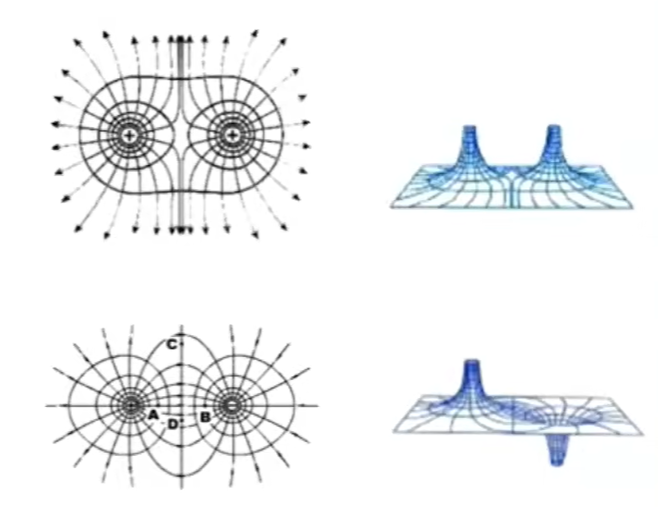

等量异种电荷中垂线是 $0V$ 等势面. 用这条线也可以区分两电荷是否为异种电荷. 

$$
W_{ab} = qU_{ab} \\
U_{ab} = Ed_{ab}
$$
第二个公式只适用于匀强电场, 但为匀强电场可以定性(比大小)不可定量. 其中 $d_{ab}$为从 $a$ 运动到 $b$ 沿电场线上的位移, 即 $xcos\theta$ . 很多题目在这里挖坑, 为了确定 $d$ 有时候我们需要找等势面来确定电场线方向. 由于匀强电场等势面为平行直线, 所以只需要找到两个电势相等的点连接就是等势面(有时需要通过下面的第二个推论来找点). 不可以拿到一个距离就带入 $d$ .

小推论: $U_{ac} = U_{ab} + U_{bc}$, 类比向量.   
注意求电势差的题目要在最后判断正负不容易出错.  
推论: 匀强电场中, 若两线段平行或共线, 那么两端电压之比等于长度之比.  

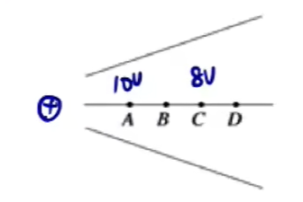

若$\phi_A = 10V, \phi_C = 8V$ , 由$E = \frac{U}{d}$, 且沿电场线方向距离 $d_{AB}, d_{BC}$ 均相等, 故 $E$ 越大, $U$ 越大, 可以得到 $U_{AB} > U_{BC}, \phi_B < 9V$ . 或者感性理解,无穷远处电势为零, 而 $AC$ 就变化了 $2V$ , 所以电势差一定是越来越小. 

## 轨迹问题

轨迹线与电场线重合当且仅当电场线为直线且初始 $v$ 与 $F$ 同向. 我们一般先判断两端点(其实只有点电荷需要判断两点以防弯曲程度较大导致先增大后减小或先减小后增大, 其余情况不需要)的受力方向(等势线垂线/电场线切线 $+$ 力指向凹侧), 根据速度(轨迹切线, 无需知道运动方向, 任意假设一个, 结果一致)与力的夹角是锐角还是钝角从而判断速度如何变化, 然后推得动能, 最后是电势能. 剩余根据题目信息可以推得(如电性, 电场方向, 电势等). 再如果电场是由点电荷激发的, 那么可以使用对称性(因为点电荷会出现先增大后减小的情况, 所以要比较两段运动上的点比较麻烦, 可以先根据速度大小相等, 电势能(电势)相等对称到同一段上比较).

## 图像问题

电学里的图像有一种特殊的做法, 即画电场线. 普通做法我们会去找斜率或面积的含义, 但电学里画电场线更简便(当然也可以找斜率, 比如 $E - x$ 图像面积代表电势). 对于 $E - x$ 图像来说, 只要 $E$ 在 $x$ 轴上方, 电场线向正方向(一般取右), 反之为反方向. 对于 $\phi - x$ 图像来说, 电势沿电场线降低, 故电势向哪边降低电场线就指向哪边. 特殊记忆 $\phi - x$ 图像中斜率表示 $|E|$ (场强大小, 方向用电场线判断), 然后就可以分析受力或加速度.   

(交变电场的)图像一般涉及到的 $F, E, U$ 等物理量可以转化为 $a$ 用运动学画 $v - t$ 图解决问题.  

## 电容器

即储存电荷的装置, 由两块金属板与绝缘介质构成. 电容 $C$ , 单位 $F/\mu F/pF$ , 公式: 
$$
C = \frac{Q}{U} = \frac{\Delta Q}{\Delta U}
$$
(公式记忆皮蛋掉到玻璃杯里), 是比值定义式, 还有决定式: 
$$
C = \frac{\epsilon S}{4\pi kd}
$$
其中 $\epsilon$ 为相对介电常数, 由绝缘介质影响, 空气(真空)最小, 只要放东西(绝缘物体) $\epsilon$ 都会变大, 反之同理. $S$ 为正对面积, 如图. 

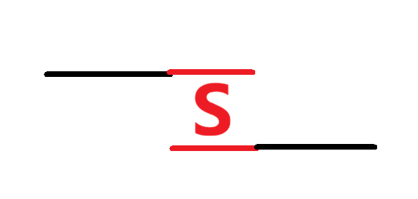

$d$ 为板间间距, 板间插入金属板会减小 $d$ . $k$ 为静电力常数. 由此我们可以发现板间插入任何东西 $C$ 都会增大. 

静电计: 测 $U$ . 偏转角 $\theta$ 越大 $U$ 越大. 与验电器外形相似但有差别. 

<figure style="display: flex; justify-content: center; flex-direction: column; align-items: center;">
  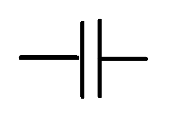
  <figcaption>电路中的电容器</figcaption>
</figure>

电容器符号与电源相似, 但其两条竖线等长. 充电时$Q \uparrow$ 相当于特殊的用电器, 电路稳定后(两金属板分别带正负电)在电路中相当于断路(或理想电压表), 放电时 $Q \downarrow$ 相当于电源. 

两金属板充电完成后带正/负电荷, 形成匀强电场. 写出 $C$ 的两个公式和 $E = \frac{U}{d}$ 来动态分析电路. 隐含条件: 连在电源两端的电容器电压不变, 不接电源(电路断路) $Q$ 不变. 当 $Q$ 不变时, 改变 $d$ 会出现 $E = \frac{U \uparrow}{d \uparrow}$ 的情况, 此时根据推导可以得出 $E$ 与 $d$ 无关, 即 $E$ 不变. 此处可以记忆(或者在电容器动态分析题目中上下同时增大/减小意味着不变). 

电容器与电源正极相连的极板带正电, 与负极相连的带负电. 放电时电流由带正电的极板流向带负电的极板, 电流逐渐减小. 

带电液滴计重力. 静止时有 $F = qE = mg$ , 分析时只需要判断 $E$ 如何变即可分析运动方向. 若涉及两板间某点 $\phi, E_p$ 的变化, 需要通过 $U_{BP} = \phi_B - \phi_P$, $U_{BP} = Ed_{BP}$ 来转换. 特别注意不论是写 $U$ 还是 $d$ 都要注意顺着电场线来写从而避免漏掉正负号. 还有就是选 $U_{BP}$ 还是 $U_{PA}$ 时一定要选择不动的极板, 避免 $d$ 的变化.   
## 带电粒子在电场中的运动

可以从动量定理和牛二入手. 一般使用动量定理, 电场力做的功可以展开为 $W = qU = qEd$ ($U$ 不变展开为 $qU$, 否则为 $qEd$ 或 $Fx$ ). 注意 $W = qU$ 中 $U$ 是运动区间的电势差, 而非电极板总电势差, 还有 $qU$ 同一代正号最后判断正负.  

从电场开始就可能涉及到可行性问题, 即某种状态是否可行, 或改变某个条件结果怎样变化, 解决此类问题我们需要先假设, 再分析.  

与加速电场的直线运动不同, 偏转电场涉及到曲线运动. 仍然考虑分解运动, 一般少用动能定理(因为 $U$ 需要用运动段的电势差, 计算较复杂). 加速度表达式可以写为 $a = \frac{Eq}{m} = \frac{qU}{md}$ , 其中 $U, d$ 为两板间物理量(其实只要对应都可, 但要对应). 曲线运动的二级结论可用. 

一个小 $trick$, 当两个分运动 **相互垂直** 时 (如偏转电场), 可以列单一方向上的动能定理算 **此** 方向上的速度, 过程并不严谨, 故 **不能用于大题** .

示波器 $U$ 越大距离中心点越远, 电压正负决定方向. 题目直接找特殊点排除即可. 也可以根据 $U - t$ 图像画图. 

### 等效重力场

可以将电场等效成为一个有特殊 $g'$ 的重力场, 即合并物体所受到的重力和电场力为等效重力(相当于把图片转一定角度). 我们要先确定出等效重力的大小($g'$)和方向, 找出等效最低点和最高点, 然后正常圆周运动分析即可. 若有两个速度为零的点, 那么它们的弧中点就是等效最低(高)点. 

## 静电屏蔽

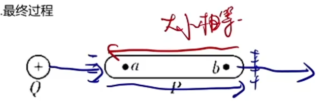

如图有两个电场, 第一个是点电荷形成的, 第二个是由于导体内部感应起电导致正负电荷不均匀而形成的(注意这个不是匀强电场, 场强要根据与点电荷场强平衡来判断). 导体内部电子持续移动, 直到两个电场平衡, 导体内部电场为零, 电子不再移动, 达到静电平衡状态. 此时带电导体的带电量只会分布在表面, 内部合场强为零(内部无电场线), 带电导体是一个等势体(电势相等但不等于零), (外部)电场线与表面(等势面)垂直. 由于成为等势体, 则在其表面接导线不会产生电流, 即使在正负电荷聚集的区域接导线也没有电流. 

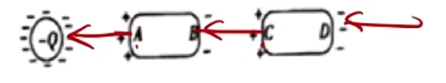

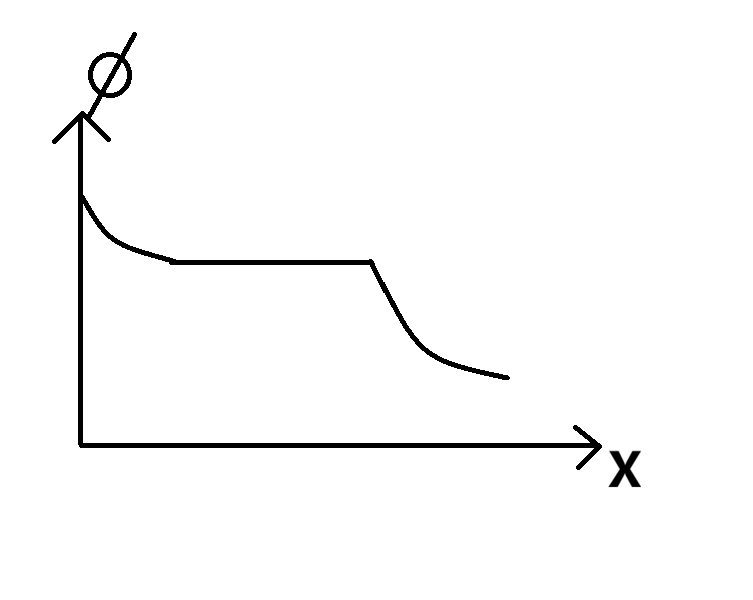

图示 $\phi - x$ 图为正点电荷感应枕形导体时的图像. 可以发现电场线在导体处中断, 导体内部电势不再变化但不为零. 

若此时接地, 则靠近电荷一端感应起电, 远离的一端不带电; 导体电势为零(电势为零也可能带电).

【188.【高中物理选修3-1】【静电屏蔽】总结和解题结论】 https://www.bilibili.com/video/BV1FE411X7MD/?share_source=copy_web&vd_source=52aa8bd45c28e534d02e312968f55355

【189.【高中物理选修3-1】【静电屏蔽】枕形导体解题总结】 https://www.bilibili.com/video/BV1fE411Q7dx/?share_source=copy_web&vd_source=52aa8bd45c28e534d02e312968f55355

【190.【高中物理选修3-1】【静电屏蔽】空球壳解题总结】 https://www.bilibili.com/video/BV1VE411X7Sn/?share_source=copy_web&vd_source=52aa8bd45c28e534d02e312968f55355

【191.【高中物理选修3-1】【静电屏蔽】静电屏蔽现象介绍】 https://www.bilibili.com/video/BV1qE411S72B/?share_source=copy_web&vd_source=52aa8bd45c28e534d02e312968f55355

$\重\制 静电屏蔽$