# 曲线运动

物体做曲线运动的条件为有 $a$ 有 $v$ 且 $a, v$ 不共线. 且 $a$ 始终指向凹侧. 又 $F_合 = ma$ , 故上述可将 $a$ 换为 $F_合$ . 判断加速减速需要看 $a, v$ 夹角, 锐角为加速, 钝角为减速, 可将 $a$ 分解为两个方向得到. 匀变速与曲线运动无冲突, 很多可以解决的问题都是匀变速曲线运动. 曲线运动必定不是匀速运动, 因为 $v$ 的方向改变, 但 $v$ 的大小可以不变. 

考虑将曲线运动分解为不同方向上的直线运动, 肉眼观测到的为合运动. 分运动间互不影响, 且同时发生(时间相同). 

## 小船过河

实际上船头指向不一定为船实际运动方向, 因为水流/风速等影响. 船头方向为 $v_船$ , 其与 $v_水$ 的合速度为 $v_合$ . $v_水$ 一般方向与大小恒定, 我们可以改变 $v_船$ 的方向(大小一般给出确定值或最大值)来得到最短渡河时间与最短渡河位移. 需要明确如图, 仅竖直方向的速度让船渡河, 水平方向的速度让船横向平移而非向对岸移动. 故存在 $x_x = v_x t_{渡河}, t_{渡河} = \frac{d}{v_y}$ , 其中 $d$ 为河宽. 

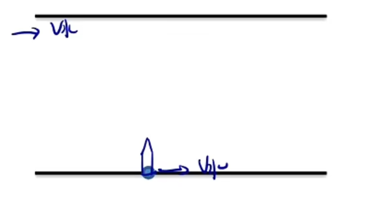

我们需要讨论 $v_水$ 与 $v_船$ 的间大小关系. 若 $v_船 > v_水$ , 最短时间渡河一定让船的速度全部用于渡河; 最短位移渡河一定使得合运动垂直于岸边, 故 $v_船$ 应与 $v_水$ 及 $v_合$ 构成满足条件的矢量三角形. 若 $v_船 \le v_水$ , 最短渡河时间同上, 但最短渡河位移由于 $v_船$ 不能够作为矢量三角形的斜边, 且其方向可变, 大小不变, 故考虑一个圆, 圆心位于 $v_水$ 终点, 半径为 $v_船$ 的大小, 记运动轨迹与岸边的夹角为 $\theta$ , 显然对于 $d$ 恒定, $\theta$ 越大 $x_合$ 越小, 故应引过 $v_水$ 起点到圆上的切线作为 $v_合$ , 显然此时 $v_合 \perp v_船$ . 

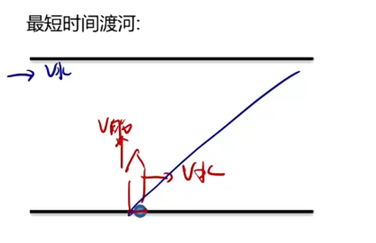
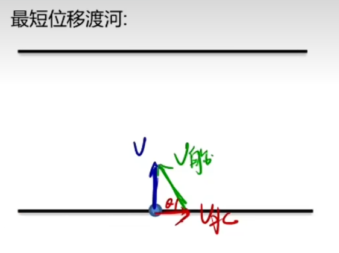
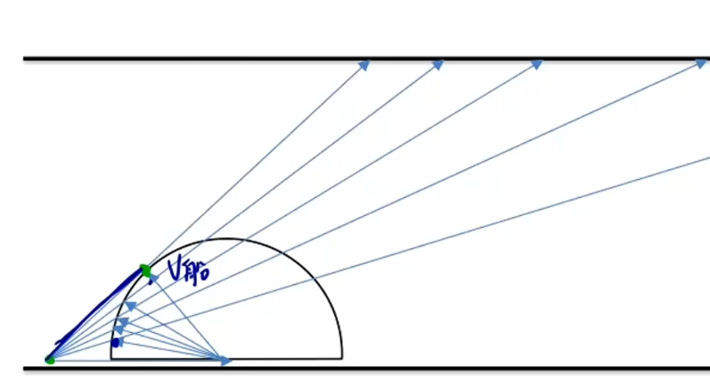

小船过河一般为两个匀速直线运动的合成, 而下文中抛体运动为一个匀速直线运动一个匀加速运动的合成. 高中阶段一般不研究两个匀变速运动的合成, 若需要合成直线运动与圆周运动则考虑配速法(常在电磁叠加场中使用). 

## 关联速度

一个物体通过绳或杆带动另一物体运动, 满足沿绳/杆方向速度大小相等(否则就断了).

解决此类题目首先用肉眼判断合运动方向, 再将其沿绳/杆及其垂直方向正交分解, 根据上述速度相等条件列表达式即可. 

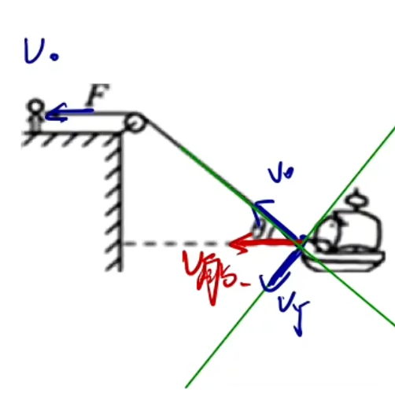

如图, $v_船$ 为合速度, 其可分解为 $v_绳$ 与 $v_Y$ , 而不是分解 $v_绳$ 得到 $v_船$ (只能分解合速度(实际运动的速度)), 此举将直接导致结果错误. 分解可得 $v_船 = \frac{v_绳}{\cos \theta}$ . 实际上 $v_Y$ 可以理解为绕绳转动的速度, 但一般无需理解. 得到表达式后我们可以根据 $\theta$ 来确定一些物理量的变化. 

当然, 也可分解两次速度. 分析即可. 

还有可能以接触面来关联速度, 垂直于接触面速度大小相等(否则会穿模), 垂直于接触面及接触面切线方向建系分解即可. 注意接触面类型的题目也可能涉及杆, 但是要明确杆为连接作用还是研究对象(此时一般满足除杆外还有多个物体且杆两端未固定在地面无法移动). 

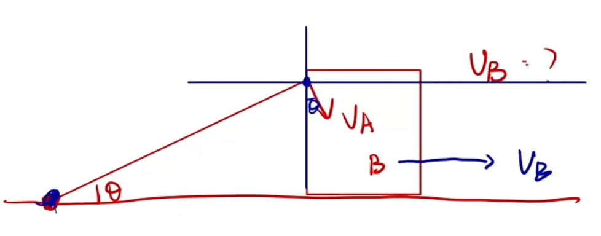
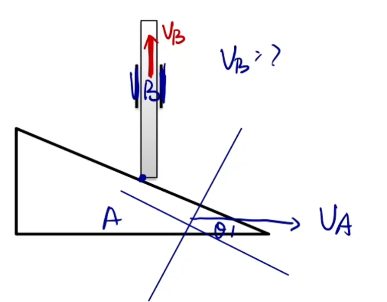

第一幅图为杆左端固定于地面, 向右移动 $A$ 询问杆 $B$ 如何运动; 第二幅图杆被蓝色竖线限制住只能上下移动, 向右移动 $B$ 问杆 $A$ 如何运动, 这两幅图均为接触面类型而非杆类型.

## 抛体运动

抛体运动始终满足只受重力, 即竖直向下方向上始终为一加速度为 $g$ 的匀变速运动, 水平方向为匀速运动. 若此方向上 $v_0 = 0$ 则为平抛运动, 表现为初速度水平. 若水平方向上 $v = 0$ 则为竖直上抛或自由落体运动. 更一般的情况为斜抛运动. 

下面研究平抛运动, 由于水平与竖直运动互不影响, 则落地时间 $t$ 仅与高度 $H$ 有关, 与初速度 $v_0$ 无关. 注意不要比较运动轨迹的长度.

平抛运动若涉及角度, 一般为速度或位移. 关于速度的角度(速度偏转角)一般可以确定末状态的方向(如给出垂直击中/恰好经过(相切)等), 若不则大概率为位移的角度(位移偏转角). 我们可以通过角度联系 $x, y$ 两方向. 若已知位移偏转角, 求两方向的位移即可(可能需要其他式子来解其中的物理量), 速度同理, 然后画出二者, 根据三角函数得出二者的关系. 然后也可得出合位移与和速度通过三角函数. 

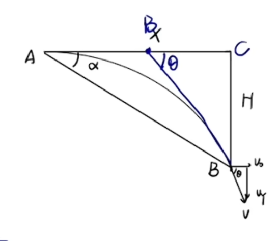

平抛有以下特点:

1. $\tan\theta = 2 \tan\alpha$ , 此式可以令速度偏转角 $\theta$ 与位移偏转角 $\alpha$ 转化, 从而使用更简便的一方求解. 这也告诉我们若其中一个角度已知则另一角度也为确定值. 实际上此条可被下一条替代, 无需掌握. 
2. 第一条的推论, 末速度的反向延长线过水平位移的中点 $B$ 点, $AC$ 中点. 此结论应用广泛, 实际上与上一条同源但更为简便, 在后续电场中也有应用.

在斜面上平抛是一类典型题目, 由于位移偏转角已知, 由平抛特点可知落到斜面上时小球速度偏转角相同且满足 $\tan\theta = 2 \tan\alpha$ . 此类题目可能会问小球与斜面间最大间距及其时间, 考虑沿斜面建系而非水平建系, 以防复杂的几何关系. 分解 $v_0$ 与 $g$ , 把握住角度关系(此时速度方向与斜面方向一致), 对 $x, y$ 轴方向运动进行研究即可. 

## 圆周运动

高中阶段一般研究匀速圆周运动(速度大小不变的运动(不论线速度还是角速度, 但线速度方向时刻改变, 角速度方向不改变)), 圆周运动中我们提出新的物理量:

1. 弧长 $l$
2. 转过的角度 $\theta$
3. 线速度 $v = \frac{l}{t} = \frac{2\pi r}{T}$
4. 角速度 $\omega = \frac{\theta}{t} = \frac{2\pi}{T}$ , 单位 $rad/s$ 或 $s^{-1}$ , 矢量, 方向可通过右手螺旋定则判断(仅与旋转方向(顺/逆时针)有关, 磁场中会讲解, 此处不要求). 结合线速度可知 $v = r \cdot \omega$ (线速度在绕弯). 
5. 周期 $T = \frac{2\pi}{\omega}$ , 可以发现 $T$ 与 $\omega$ 与正弦型函数中 $T$ 与 $\omega$ 含义一致, 因为正弦型函数图像是由单位圆得到. 与简谐运动中的含义一致, 因为简谐运动可以看做圆周运动的投影. 
6. 频率 $f = \frac{1}{T}$ , 一秒完成的次数, 单位 $Hz$ , 标量 
7. 转速 $n = f = \frac{1}{T}$ , 一秒完成的圈数, 单位 $r/s$ , 标量

传动装置考虑同轴转动与共线转动两种. 题目会询问多个点上物理量间的关系, 若这几个点圆周运动圆心相同则为同轴转动(或更直接的, 一个物体上的某几点), 否则为共线转动. 同轴转动如单摆上多点, 圆盘上多点, 或地球上某几点(要注意不是到球心的直线距离, 而是此点在赤道面内的投影到球心的距离(或点到地轴的距离), 即做圆周的半径), 必然满足 $\omega$ 相同, 否则 $T$ 不同就导致装置裂开或扭曲, 又由于 $r$ 可能不同, 就导致 $v$ 不一定相同. 若涉及多个物体, 一般为共线转动, 如链条, 齿轮, 皮带等. 其外围 $v$ 相同, 如链条上, 皮带上, 齿轮的齿上线速度相同(否则就会断/松/跳齿), 但对于同一个物体若要比较内部则需要结合同轴转动. 齿轮较为特殊, 相邻齿轮转动方向相反, 且齿轮上齿的个数之比等于周长之比, 即半径之比, 故也为周期之比. 

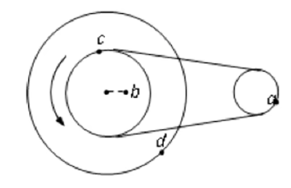

|         |$a$|$b$|$c$|$d$|
|:-------:|:-:|:-:|:-:|:-----:|
|$r$ (必写)     | $1$  | $1$  | $2$  | $4$  |
|$\omega$ (必写) | $2$  | $1$  | $1$  | $1$ |
|$v$ (必写)     | $2$  | $1$  | $2$  | $4$ |
|$a$ (必写)     |  $4$ | $1$  | $2$  | $4$ |
|$T$ (可选)     | $\frac{1}{2}$  | $1$  | $1$  | $1$ |
|$f$ 或 $n$ (可选) |  $2$ | $1$  | $1$  | $1$ |

有了以上基础我们提出列表法解决以上的比值问题, 更为直观: 首先列出以下表格(注意前四行必填且顺序不能变, 后面可以选择性填写), 有几个点就写几列, 并填入已知(一般为半径, 写比例即可, 若非半径同样思路), 再将相同 $\omega$ 的点 $\omega$ 视为 $1$ (灵活应对, 有时也需将其他物理量视为 $1$ , 因为求比例故可行), 求得可计算的 $v$ , 再根据 $v$ 相等的点反推未计算的 $\omega$ , 最后根据公式填表(表格设计使得对于必填部分上下两行相乘即得下一行, $v = r\omega, a = \omega v$ )得出答案, 注意化为最简整数比. 求 $T, f/n$ 时比例中涉及的反比实际上是对每个数字取倒数. 

### 向心力

由于速度方向始终改变, 故存在加速度, 即存在合外力. 考虑将一般的合外力分解为半径方向与切线方向, 半径方向的分力提供向心力, 仅改变速度方向, 切线方向的力仅用于改变速度大小. 注意向心力不存在, 是一个效果力, 合外力的一个分力, 向心加速度同理. 注意到在匀速圆周运动中, 由于速度大小不变, 故不存在切线方向上的合外力分力, 故 $F_合 = F_向$ . 我们在高中主要研究此运动, 存在以下公式:

$$F_向 = m\frac{v^2}{r} = m\omega^2r = m\omega v = m(\frac{2\pi}{T})^2r = ma_向$$

可得

$$a_向 = \frac{v^2}{r} = \omega^2r = \omega v =(\frac{2\pi}{T})^2r$$

解决问题首先受力分析, 根据 $F_向 = F_合$ 列式即可. 题目中水平转动的圆周运动多半为匀速圆周运动, 竖直方向转动的圆周运动多半为非匀速圆周运动, 有特殊方法(本文末尾). 

单摆在平面内摆动, 若绳子撞上钉子, 由于不计能量损失, 小球动能不变, 故前后小球速度不变, 半径减小为钉子到小球间的绳长, 故角速度和加速度改变. 

对于圆锥摆有两类特殊情境, 即 $a$ 相同(同角不同面)和 $\omega$ 相同(同面不同角), 此处角为绳子或容器壁的倾斜角度, 面为圆周运动所在的平面, 可以记忆为角度相同则角速度不同, 角度不同则角速度相同. 

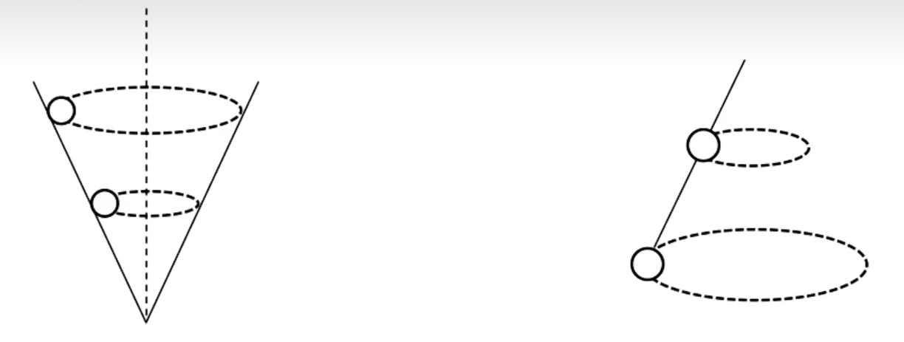

上图为同角不同面的类型, 如小球在不同高度的光滑漏斗内壁匀速转动, 或不同绳长但固定点相同, 偏离幅度相同的圆锥摆(两球分别连在两根绳上, 互不干扰), 此类型加速度相同. 以漏斗为例, 漏斗中的受力分析与圆锥摆一致, 不过绳的弹力被换为壁的支持力, 故属于圆锥摆(的变形). 题目一般已知两小球质量的大小关系及下方的角度 $\theta$ , 通过推导可知 $a$ 只与 $\theta$ 有关, 又可推得其他物理量. 问支持力或弹力实际上就是向心力的分力. 上图中圆锥摆同理. 

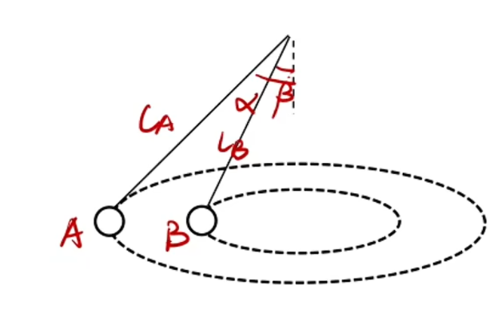

推导可得 $\omega$ 与 $Lcos\alpha = H$ 成反比, $H$ 为悬挂点距离转动平面的高度, 故相同面内 $\omega$ 相同. 即可比较其他物理量. 

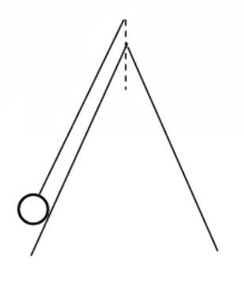
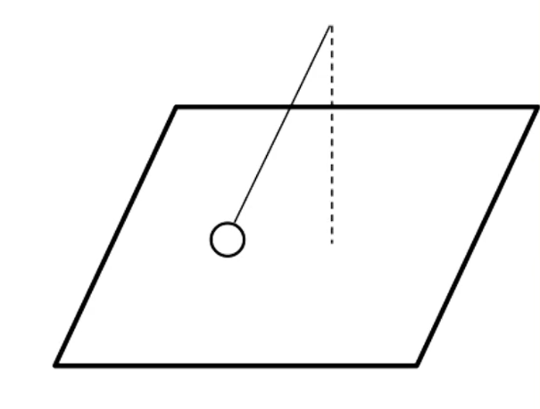

如上图, 临界问题实际上非常简单, 即求当 $F_N$ 恰好为零时的状态. 由于 $\omega$ 与 $H$ 有关且成反比(上文), 故增大 $\omega$ 小球会飘起来. 很多时候题目需要判断 $F_N$ 是否存在, 故需要求临界 $\omega$ , 与条件中的进行比较. 

若出现多根绳子分析弹力如何随速度变化而变化, 受力分析即可, 切忌按大脑模拟, 根据表达式分析如何变化. 

粗糙圆盘上由摩擦力提供向心力, 可能会发生离心运动(被甩出去), 当 $f = \mu F_N$ 时为临界. 实际上离心运动本质是合外力不足以提供向心力, 即 $F_向 > F_合$ 时. 同理当 $F_向 < F_合$ 时做向心运动.

故若问圆盘上两物体那个先滑动, 考虑计算临界 $\omega$ , 比较谁更小谁先滑动. 计算可知 $\omega$ 与 $\mu$ 及 $r$ 有关, 与 $m$ 无关, 故并非靠外侧的物体先滑动, 也并非动摩擦因数小者先滑动, 更不会是较轻者先滑动, 而是要具体计算.

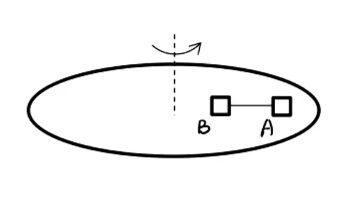

圆盘问题考虑 $\omega$ 从 $0$ 开始逐渐增大, 分析受力的变化, 先由摩擦力提供向心力, 若多物体有绳相连绳子拉力一定为其中一物体达到临界 $\omega$ 后有发生相对滑动的趋势后出现, 但绳子的拉力可以阻止此相对滑动, 需要画出变化后的受力分析. 直到另一物体也达到临界状态, 两物体开始相对圆盘滑动, 列两个部分受力分析即可(整体也可, 但需要求系统质心来表示整体圆周运动的半径, 方法见天体运动章节), 随后可以求拉力. 实际上 $f$ 不一定指向圆心, 若两物体在圆心异侧时.

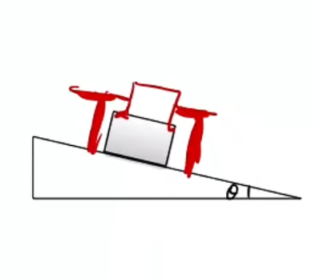

火车转弯时轨道会向弧内侧倾斜, 轮子卡在两轨间, 如上图. 最理想情况下火车对内外轨均无挤压力, 全部由斜面的支持力的水平分力(圆周运动时水平方向)提供向心力, 受力分析即可算得速度 $v_0 = \sqrt{gR\tan\theta}$ . 若速度大于 $v_0$ 则有离心运动的趋势, 外轨受挤压力, 反之有近心运动的趋势, 内轨受挤压力. 

对于竖直面内的圆周运动, 分为绳模型与杆模型, 即连接物体与圆心的为绳还是杆. 由于重力干扰, 此圆周运动并非匀速圆周运动, 此时仅考查特殊位置的状态. 若符合绳模型, 因为最高点速度最小(能量守恒可解释), 需要至少满足在最高点处 $m\frac{v_0^2}{r} = mg$ , 即绳子拉力恰好为零, 解得 $v_0 = \sqrt{gr}$ , 故仅当 $v \ge \sqrt{gr}$ 时才能做圆周运动, 否则绳子会松弛, 小球落下; 最低点处满足 $m\frac{v_1^2}{r} = F_{N1} - mg$ . 杆模型类似, 但其在最高处无最小速度限制(最小速度为 $0$ ), 因为杆会支撑物体防止其落下. 对于最高点, 由于杆的支持力有两个方向, 故需要先计算临界速度, 即 $F_N = 0$ 时的速度, 算得 $v_0 = \sqrt{gr}$ , 比较 $v$ 与 $v_0$ 大小即可判断. 实际上绳模型与杆模型的本质区别就是在最高点时有无支撑, 如单环轨道(过山车的回环)就为绳模型, 环形管道(双环轨道)或汽车过桥就为杆模型.