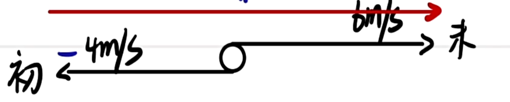
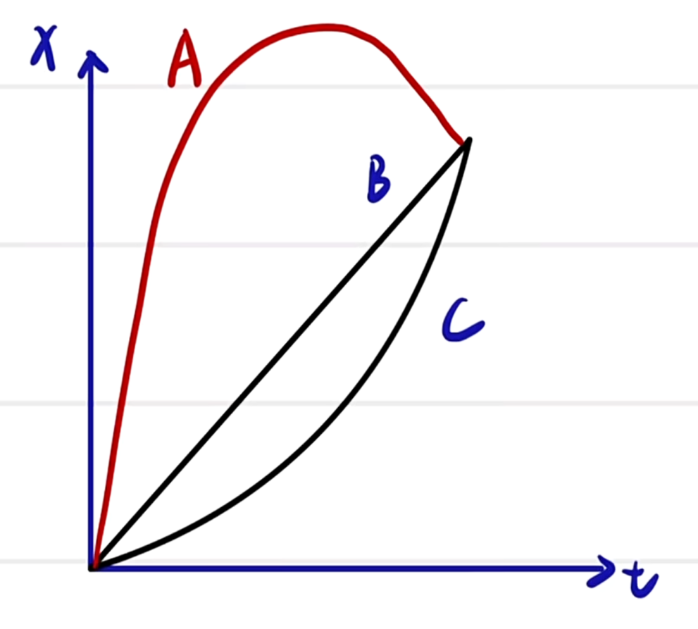
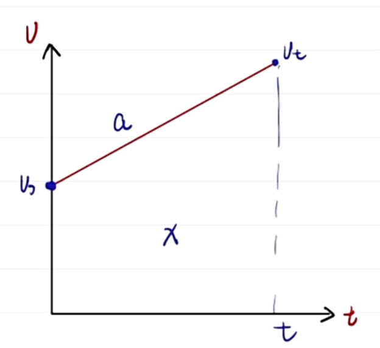

# 运动学

质点: 只有质量, 没有体积和大小的点(理想模型). 判断一个问题是否可以简化成质点只需要看研究问题与形状, 体积是否相关. 有时也需要考虑体积与位移的相对大小关系, 如若火车长 $100km$ , 行驶 $50m$ , 此时不能看作质点; 若行驶 $1 \times 10^9 km$ , 则此时可以看作质点, 即便火车的体积看似很大. 

参考系: 运动是相对的. 为描述一个物体的运动, 我们需要选取合适的参照物形成坐标系作为参考系. 默认选取地面为参考系. 参考系具有任意性(所有物体均可当作参考系), 标准性(假定当作参考系的物体静止, 运动是绝对的, 静止是相对的), 差异性(同一物体在不同参考系中结果可能不同). 

时刻: 一个瞬间; 时间间隔(时间): 一段时间. 时间再短也不能称为时刻. 时间轴: 类似数轴, 描述时间. 时刻即时间轴上的点, 时间间隔为其上的线段. 一些特殊的表达方式需要注意:
1. 第几秒(内): 时间间隔, 第 $n$ 秒(内) 表示 $(n-1) \sim n$ 秒的间隔.
2. 第几秒初/末: 时刻, 第 $n$ 秒初表示 $(n-1)$ 秒, 第 $n$ 秒末表示 $n$ 秒. 当然, 第 $n$ 秒末也是第 $(n + 1)$ 秒初.
3. 前几秒: 时间间隔, 容易理解.

路程( $s$ ): 运动轨迹的长度, 标量. (标量只有大小没有方向) 

位移( $x$ ): 由初位置指向末位置的有向线段, 矢量. (矢量既有大小又有方向) 路程与轨迹有关, 但位移无关, 只与初末位置有关. 可以发现, 位移的大小 $\le$ 路程, 位移 $\ne$ 路程, 当且仅当做单向直线运动时取等. (矢量与标量无法比较, 只能比较大小, 一定注意"的大小"三个字有无出现) 在直线上, 矢量可以用正负号表示方向, 此前需要先指明正方向(默认初速度方向为正方向). 由于正负表示方向, 则比较数值时, (对于标量) $-7 > 3$ .

速率( $v$ ): 标量. $v = \frac{s}{t}$ 可以求解平均速率. 速率需要与速度区分. 

平均速度( $\bar{v}$ ): 矢量, 方向与位移一致.  $\bar{v} = \frac{x}{t}$ 可以求得平均速度, 位移的平均变化率.

瞬时速度( $v$ ): 矢量, 通过某一时刻或位置时的速度, 方向向正在前进的(切线)方向. 瞬时速率就是瞬时速度的大小. 

匀速(直线)运动: 速度不发生改变的运动, 即速度大小和方向均不改变. 

求两段运动的平均速度合理假设未知数即可. 若以路程划分(如第一段行驶路程的一半等)则设路程; 以时间划分则设时间. 

速度变化量: 变化量均为末状态减出状态, 速度变化量 $\Delta v$ 同理, $\Delta v = v_t - v_0$ , 矢量, 直线运动方向由计算得到. 求 $\Delta v$ 前要先判断速度方向(正负). 更一般地, 在平面内速度变化量的方向为初速度箭头指向末速度箭头. 

{ width=500px }

加速度( $a$ ): 矢量, 描述物体速度变化快慢(速度变化率)的物理量, $a = \frac{\Delta v}{\Delta t}$ , 单位 $m/s^2$ (米每二次方秒), 方向与 $\Delta v$ 相同. 其中 $\Delta t$ 为力作用时间(速度真正改变的时间).

加速度与速度并无必然联系, 不能有速度简单地得出加速度, 而是要通过速度变化量与时间. 加速度不变的运动为均变速直线运动. 

加速度正负与加/减速也并无对应关系, 而是表示时间内向正/负方向改变多少速度. 当且仅当速度与加速度同向, 即符号相同, 即 $av > 0$ 时, 为加速运动; 反之为减速运动.

## 图像

斜率在曲线上用切线判断. 

$x - t$ 图像, 即位移 $-$ 时间图像(实际上是位置), 描述物体的位置随时间得变化. 平行于 $x$ 轴的直线静止, 其余合法的直线为匀速运动, 斜率 $k$ 为速度, 其正负表示运动方向, 大小表示速度的大小. 匀变速直线运动为一条抛物线. 往返运动斜率(速度)正负发生改变. $x - t$ 图像只能表示两个方向, 故只适用于直线运动. 图像上位移通过末位置减初位置体现, 与过程无关. 

{ width=500px }

图中 $C$ 为加速直线运动, $A$ 为往返运动, $B$ 为直线运动, 注意均为直线运动. 三者位移 $x_A = x_B = x_C$ 相等, 平均速度相等, 路程 $s_A > s_B = s_C$ , 因为 $A$ 往返, $C$ 看似是曲线实则描述加速, 与曲线一点联系都没有. 

$v - t$ 图像, 同样只能描述直线运动, 平行于 $x$ 轴的直线为匀速直线运动, 其余合法直线为均变速直线运动, $k$ 为加速度 $a$ , 正负表示加速度方向. 往返运动时图像既有正又有负. 图像与 $x$ 轴围成的面积表示位移(微元法), 故可以判断物体运动到最远或回到原点时的点. 

## 匀变速直线运动

匀速直线运动公式: 
$$x = vt$$
匀变速直线运动公式:
$$少 x: v_t = v_0 + at\\
少 a: x = \frac{(v_0 + v_t)t}{2}\\
少 v_0: x = v_tt - \frac{1}{2}at^2\\
少 v_t: x = v0_t + \frac{1}{2}at^2\\
少 t: 2ax = v_t^2 - v_0^2$$

{ width=500px }

图像法也是可以被接受的(更推荐公式法). 少 $x$ 与少 $a$ 的公式可以有图像得到, 少 $v_0, v_t$ 的公式需要将梯形割补为矩形与直角三角形. 

可以发现五个物理量知三求二, 每个公式中包含四个物理量, 知道其中三个可以求得第四个, 故可以把某个公式称为缺什么物理量的公式. 

建议画大括号填数值(不要漏正负号, 要求的物理量填如字母, 未涉及的空白)列公式计算, 找缺什么物理量, 需要用什么公式一目了然. 
$$\begin{cases}
v_0 \quad \dots \quad \dots \quad \dots \\
v_t \quad \dots \quad \dots \quad \dots \\
a \; \quad \dots \quad \dots \quad \dots \\
t \,\; \quad \dots \quad \dots \quad \dots \\
x \quad\; \dots \quad \dots \quad \dots
\end{cases}$$

(单段运动中多部分)匀变速直线运动的关键是加速度 $a$ , 要先求出. 若 $a$ 变化, 则发生多段运动; $a$ 不变则是同一段运动. 

中时速二级结论: $\bar{v} = \frac{v_0 + v_t}{2} = v_\frac{t}{2}$ , 可以画图理解, 梯形中位线, 算术平均数. 类似地, 中位速二级结论: $v_\frac{x}{2} = \sqrt\frac{v_0^2 + v_t^2}{2}$ , 同样可以画图理解, 梯形面积平分线, 平方平均数(均方根). 可以发现, $v_\frac{x}{2} > v_\frac{t}{2}$ 是必然地, 不论是通过画图(梯形中的几何意义)还是通过基本不等式链都可以得到. 

$a \sim b$ 秒内(第 $n$ 秒内)位移可以通过 $x_b - x_a$ 求得, 但更推荐使用中时速结论求得平均速度后乘时间得到. 当然, 已知一段时间内位移也要先换为平均速度再用中时速结论转化更简单. 

刹车问题注意速度不能变为负值, 至多减为零. 故刹车问题需要先算何时/何处速度减为零. 

公式/关系式题: 与运动学公式(不可用缺少 $v_0$ 的公式)对比, 确定系数代表哪个物理量; 若出现常数项则考虑是否为初始量(移项到等号左侧). 对数学功底自信的也可直接分析函数; 或使用二级结论(如中时速结论等)解决.

遇见陌生图像一定通过已有公式进行变形得到, 如 $\frac{x}{t} - t$ 图像, 平均速度 $-$ 时间图像, 通过 $x = v_0t + \frac{1}{2}at^2 \Rightarrow \frac{x}{t} = v_0 + \frac{1}{2} at$ 来找截距与斜率. 

## 追击相遇

画图, 列出表达式 $x_A = x_B + L$ , $L$ 为初始的距离, 并用运动学公式展开计算即可, 算得合理解(时间不能为负)的个数就是相遇次数. 将时间带入表达式即可求出位移. 

二者距离的最值问题取等条件为 $v_A = v_B$ , 即二者共速, 解出时间带入位移表达式作差($|x_A - x_B - L|$ , 实际上就是移项后最开始列的表达式)即可. 注意若问最小值, 若二者能够相遇则最小距离为零, 而非共速时的答案. 

### 置换参考系

可以极大的化简某些特定问题(包括追击相遇问题). 由于 $v_0, v_t, a, x$ 均为矢量, 写出大括号后相减; $t$ 为标量, 则不变(且列的两个大括号 $t$ 应该相等).