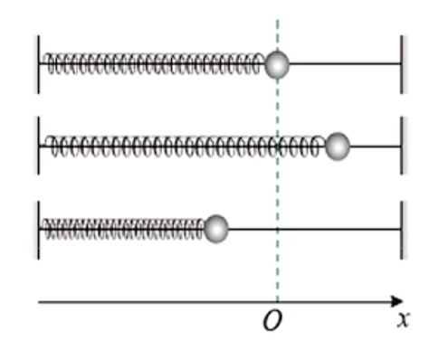
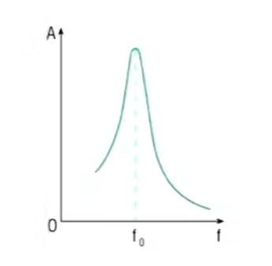

# 简谐运动

如图是一个弹簧振子(当然也有竖直等其他方向的), 其运动规律符合简谐运动. 在 $O$ 点, 小球受合力为零, 称为平衡位置. 此部分中位移默认从平衡位置指向研究位置(即默认从平衡位置开始移动). 可以发现对于水平振子在弹簧伸长或压缩至边界情况时, 小球速度减为零, 加速度最大; 当小球经过平衡位置时, 速度最大但加速度为零. 若为竖直方向上的弹簧振子, 则平衡位置为所受合力为零的位置(偏上), 且以上结论不完全适用, 建议使用牛二等推导. 

弹簧振子的运动为机械振动, 简谐运动是特殊地振动. 可以发现简谐运动中 $a$ 与 $x$ 方向一定相反, 且变化趋势一致, 所受合力总是指向平衡位置, 此结论对应以下简谐运动判断依据第二条.  

简谐运动判断依据: 
1. 简谐运动位移与时间的关系服从正弦(式)函数, 物体振动图像是一条正弦(式)曲线.
2. 总有回复力(效果力, 类似向心力)指向平衡位置(与位移方向相反), 阻止物体离开平衡位置, 且愈远离平衡位置所受恢复力愈大. 即符合表达式 $F = - kx$ , 其中 $k$ 是常数, 可以为弹簧劲度系数, 但不一定, 具体分析. 这也是证明简谐运动更常用的方法.

证明简谐运动更一般的做法是: 
1. 找到平衡位置 $x_0$ (假设 $x_0$ , 列受力平衡等式)
2. 假设偏离平衡位置 $x$ 
3. 列 $F = \dots$ (展开回复力表达式)判断是否满足 $F = - kx$ (若差负号则需要文字说明$F, x$ 方向相反)

振幅( $A$ ): 物体偏离平衡位置的最大距离. 求解振幅相关问题一般可以通过先找平衡位置再找速度为零(不再偏离平衡位置)的点(一般是初始释放时的点)解决. 若问最大振幅(或刚好不分离等)一般需要找出某个力(如弹力, 摩擦力)的最大值, 即对临界问题进行牛二分析.  

简谐运动具有十分优美的对称性, 若两点位置关于平衡位置对称, 则所受合外力也对称(原理: $F = -kx$ ). 如已知一个边界的受力状况, 则可推得另一个边界的受力, 注意只有回复力具有对称性, 此方法一般更为简洁. 故已知以边界受力求另一边界考虑对称性.

简谐运动可以用三角函数来描述, 即 $x = Asin(\omega t + \phi)$, 其中 $A$ 为振幅, 与位移无关; $\omega$ 为圆频率(所有简谐运动均可看作一个 $R = A$ 的圆周运动的投影, 仍然符合正弦规律), 表示运动快慢; $\phi$ 为初相位, 表示 $t = 0$ 时的位置. $\omega t + \phi$ 为相位. 周期 $T = \frac{2\pi}{\omega}$ , 表示完成一次全振动的时间. 注意周期与振幅无关, 表达式为 $T = 2\pi \sqrt\frac{m}{k}$ (肩上抗一个 $m$). 若两个简谐运动频率($f = \frac{1}{T}$)相同, 则可以用 $\Delta \phi = \phi_1 - \phi_2$ 来表示相位差, 否则 $\omega t$ 部分不会被消掉. 

肩上抗一个 $m$ 公式也可告诉我们简谐运动周期与振幅无关, 故在不同位置释放的小球会同时到达平衡位置, 以后的单摆亦如此. 

物体做简谐运动时在 $T$ 和 $\frac{T}{2}$ 的时间内路程一定, 分别为 $4A$ 与 $2A$ , 但 $\frac{T}{4}$ 内不一定, 需要画图像来看. 振动步调主要看相位(其中已经蕴含周期/频率了, 振动步调相同的前提是频率相同). 

正余弦图像可以直接读出位移(或用三角函数算), 速度与加速度(合外力)的变化. 位移可以直接读出, 速度看斜率, 加速度由于 $F = -kx$ 故只需翻转图像即可将 $x - t$ 图像转化为 $F - t$ 图像(考虑为想把曲线拉回 $x$ 轴, 画出受力方向也可看). 当然如果你对你的数学功底十分自信的话也可求一阶导与二阶导. 若想看平均速度则可以认为平均值是最大值的 $\frac{\sqrt2}{2}$ 倍(参考交流电). 

数学中常写的 $2k\pi$ 物理中一般写作 $nT$ . 

拓展: 不妨将简谐运动看作圆周运动($R = A$)的投影, 那么圆周运动的很多公式便可适用. 简谐运动的速度是圆周运动在此方向上的分速度, 即 $v = sin\theta \omega A$ . 同理使用加速度时也需要分解, 即 $a = sin\theta \omega^2A$ . 由此可以证得肩上抗一个 $m$公式( $T = 2\pi\sqrt\frac{m}{k}$ ). 当然以上结论通过函数及导函数图像也可发现. 但是圆周运动更加可视化, 如果题目需要画图选择圆周运动不失为一种策略. 

## 单摆

角度较小($< 5^\circ$), 可认为小球做直线运动且近似认为 $sin\theta = \theta$ 时单摆为简谐运动. 如此可以将一小段圆弧看作直线. 回复力沿切线方向, 结合半径为绳长 $R = L$ 与弧长公式 $x = R \cdot \theta$ 有 $F = mgsin\theta = mg\theta = \frac{mg}{L} x$ , 即可证明其为简谐运动. 结合公式 $T = 2\pi\sqrt\frac{m}{k}$ 可得单摆的周期公式: 
$$T = 2\pi\sqrt\frac{L}{g}$$

注意单摆中平衡位置并不平衡, 在沿半径方向上仍有向心力.

当然, 只要物体做角度很小的圆周运动, 都可近似认为是单摆, 使用公式, 但我们需要找到等效摆长. 此处对摆长 $L$ 进一步说明: 从悬挂点到悬挂物体的重心, 故小球半径也需要计入(除非明确小球半径很小/忽略不计或题目未给出), 或小球不均匀需要一直计算至其重心处(如悬挂的漏斗正在漏出沙子). 若小球由两个或多个绳子悬挂, 找到其等效悬挂点, 即圆周运动的圆心, 确定圆弧半径即可. 

当然, 公式中的重力加速度也可进行等效. 若给小球一个(沿运动平面, 如斜面就要沿斜面)竖直向下恒定的力, 则也可改变周期, 本质就是改变了等效重力加速度. 小球在斜面上运动, 小球在其他场(如匀强电场, 但点电荷带来的力不是方向恒定的, 而是沿绳方向的, 故不能等效重力, 而是等效拉力不影响周期)中运动均如此. 当然, 若小球处于超重/失重状态亦可认为是改变了重力. 

若欲用单摆测定重力加速度, 则需已知从赤道到两极重力加速度在增大. 测定周期需要测多次全振动的总时间平均以减小误差, 一般选取当小球处于平衡位置时开始/结束计时. 测量摆长要考虑小球半径. 故绳建议使用轻质绳, 且无弹性, 小球密度大, 质量均匀. 

一般实验时会多次改变绳长, 并不取平均值, 而是作 $T^2 - L$ 图. 根据 $T^2 = \frac{4\pi^2}{g}L$ 可以得到一条过原点(若摆长无误)的直线. 这样根据斜率得到的结果即使摆长不准确但 $g$ 是准确的, 只是图像左右平移罢了. 

误差分析可以代值, 如 $n$ 次全振动误认为 $n - 1$ 次, 可以分别认为是 $20s, 5, 4$ 的数据直观得出变化. 若绳长则要注意这种先测后做再计算的实验, 若实验中绳长变长, 不会影响代入的数据, 却会影响实际测得的周期, 整体看下来是代入的绳长变短了.

## 受迫振动

固有频率: 周期或频率与振幅无关, 仅由系统本身的性质决定, 这种振动为固有振动, 频率为固有频率. 若系统受阻力, 则为阻尼振动. 若想让阻尼运动持续, 则需外界给予一个变化的驱动力, 就成为受迫振动. 

物体受迫振动达到稳定后, 其频率为驱动力的频率. 当驱动力频率和固有频率一致时, 振幅达到最大值, 称为共振. 

