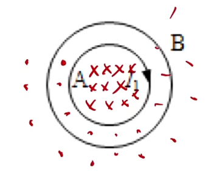

# 电磁感应

[【【选修3-2电磁感应】【磁通量】1.回顾磁通量】](https://www.bilibili.com/video/BV1JJ411W7ix?vd_source=52aa8bd45c28e534d02e312968f55355)
[【【选修3-2电磁感应】【感应电流】2.感应电流的产生条件】](https://www.bilibili.com/video/BV1JJ411W7kY?vd_source=52aa8bd45c28e534d02e312968f55355)
[【【选修3-2电磁感应】【楞次定律1】3.感应电流的方向判断】](https://www.bilibili.com/video/BV1JJ411W7ra?vd_source=52aa8bd45c28e534d02e312968f55355)
[【【选修3-2电磁感应】【楞次定律2】4.楞次定律的基础应用】](https://www.bilibili.com/video/BV1JJ411W7zF/?share_source=copy_web&vd_source=52aa8bd45c28e534d02e312968f55355)
[【【选修3-2电磁感应】【楞次定律3】5.多段过程分析】](https://www.bilibili.com/video/BV1JJ411W7mp/?share_source=copy_web&vd_source=52aa8bd45c28e534d02e312968f55355)
[【【选修3-2电磁感应】【楞次定律4】6.双圆环分析】](https://www.bilibili.com/video/BV1JJ411W72H/?share_source=copy_web&vd_source=52aa8bd45c28e534d02e312968f55355)
[【【选修3-2电磁感应】【楞次定律5】7.与牛二能量结合】](https://www.bilibili.com/video/BV1JJ411W7Cz/?share_source=copy_web&vd_source=52aa8bd45c28e534d02e312968f55355)
[【【选修3-2电磁感应】【楞次定律6】8.楞次定律总结】](https://www.bilibili.com/video/BV1JJ411W7Qj/?share_source=copy_web&vd_source=52aa8bd45c28e534d02e312968f55355)

## 磁通量

公式(需要与磁场的有效面积(垂直方向上研究对象上有磁场的面积)):

$$
\Phi = S_\perp \cdot B
$$

标/矢量:

$$
标量, 但是有正负(表示穿入或穿出, 可以规定)
$$

单位:

$$
Wb
$$

含义:

$$
磁感线穿过对应面积(min(S_磁, S_{对象}))的条数(穿入穿出方向数量差值, 穿入穿出可以抵消)
$$

例题简述(题目见视频):
对于一块条形磁铁, 上有铁环套住, 从$N$极向$S$极看, 画磁场, 点一定在条形磁铁内部, 叉可以布满整个平面(包括铁环外面), 又因为磁感线一定点等于叉, 所以铁环内点应该更多, 可以判断$\Phi$正负. 然后对于题目中三个铁环大小位置的差异, 它们点的个数一定相同, 所以就看叉的多少比较即可.

---

## 电磁感应(磁生电)

产生感应电流条件:

1. $闭合回路$
2. $磁通量改变$(并非单纯切割磁感线运动)

电磁感应条件(无需闭合回路):

$$
磁通量改变$$ 
看$\Phi$的变化:
$$\Phi = S_\perp \cdot B, 看 S_\perp 和 B 如何变
$$

## 楞次定律

内容(来拒去留):

$$
感应电流的方向总是要阻碍原磁场(磁通量)变化
$$

注意:

$$
阻碍不是阻止, 原磁场磁感应强度变化量总是大于感应磁场
$$

作用:

$$
判断感应电流的方向
$$

分析:

1. (没有磁感线要先画磁感线)判断原磁场的变化
2. 阻碍磁场变化得出磁感应磁场方向(增反减同)
3. 右手螺旋得出感应电流方向
4. 感应电流在磁场中受到安培力的作用

判断线圈变化趋势: 对线圈上一个点使用左手定则, 电流方向为切线方向, 磁场方向为原磁场方向(因为感应磁场只是减弱但不抵消, 而且不能自己感应出来的磁场作用在自己身上)(增缩减扩)(本质上还是阻碍$\Phi = SB$的变化, 假如$B\uparrow$, 则要想维持磁通量基本不变就要$S\downarrow$)

判断支持力的变化: 等效磁铁, 把线圈看成一个条形磁铁, 或者认为想要阻碍$B$变大就要往远处走, 反之同理. (来拒去留, 阻碍磁通量变化)

判断安培力的方向: 阻碍$\Phi$的变化, 注意看合安培力方向, 不一定是水平/竖直, 注意水平/竖直字眼, 别忘了还有另一方向上的受力.

### 铁环/铁芯:

内部磁感线沿着铁环/铁芯走, 这些磁感线对应的磁场可以引起感应磁场(感应电流).

### 双圆环:

$B$: 处在$\bullet$的磁场下, 磁通量为$\times$方向. 分析磁通量变化即可. 可以发现这里磁通量方向和磁场方向不一样, 所以增缩减扩的结论并 __不适用__ (此时恰好相反), 其实本质还是阻碍但不是阻止的理解. (如图$\times$增多, 所以要扩大面积增加$\bullet$). 对于变化趋势提供另一种思路: 两条导线电流方向不同相互排斥(更简单, 但有限制).

### 增缩减扩与来拒去留的条件:

__单一方向的磁场__(即仅出现磁体内/外部磁场或多个反向磁场等同时有$\times$与$\bullet$的时候). 本质都是阻碍磁通量的改变.

### 同向电流/异向电流失效情况:

有外界磁场 (即磁场不是电流感应出来的). 但还是, __阻碍__ 永远都适用且简单.

### 与能量的联系:

磁通量改变, 产生感应电流(安培力做功), 发热(不论电流的方向), 机械能损失.

---

## 电磁感应定律

公式:

$$
E_感 = n \frac{\Delta \Phi}{\Delta t}
$$

其中n为线圈匝数. (为何是乘$n$? 因为把一匝看做一个电源, 多匝串连起来就是相当于电源的串联)
目的: 把产生感应电流线圈看做一个提供电动势和内阻的电源.
分为两类, 动生电动势与感生电动势. 区别: $\Phi$变化的原因.

### 动生电动势

分类依据: 由物体运动切割磁感线所感应出的电动势. ($S$变$\Phi$变)

动生又分为两类: 平动与转动.

#### 平动

公式:

$$
E_感 = B \cdot l \cdot v
$$

#### 转动

公式:

$$
E_感 = \frac{1}{2}Bl^2\omega
$$

### 感生电动势

分类依据: 由原磁场磁感应强度变化引起的电动势. (当$S$不变时, 或所有物体均不动的时候, $B$变$\Phi$变, 即不能是物体运动引起的磁感应强度改变导致磁通量改变)

公式:

$$
E_感 = nS\frac{\Delta B}{\Delta t}
$$

---

*以上所有内容均为个人整理的$黄夫人$公开课程笔记

本作品采用 知识共享署名-非商业性使用 4.0 国际许可协议 (CC BY-NC 4.0) 进行许可.
$\textcopyright$ $2025$ $Zheng$
