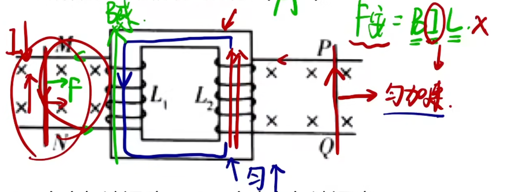
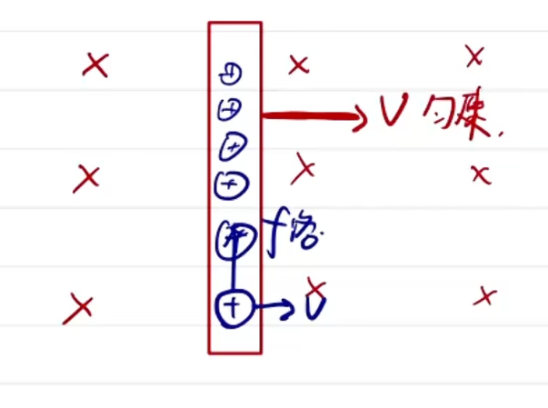
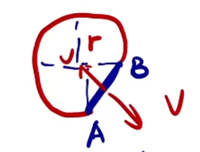
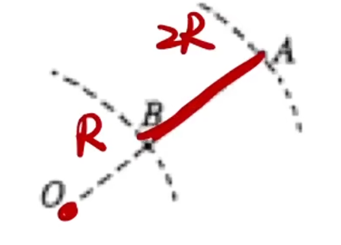
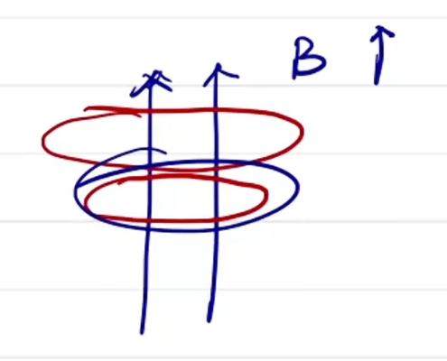
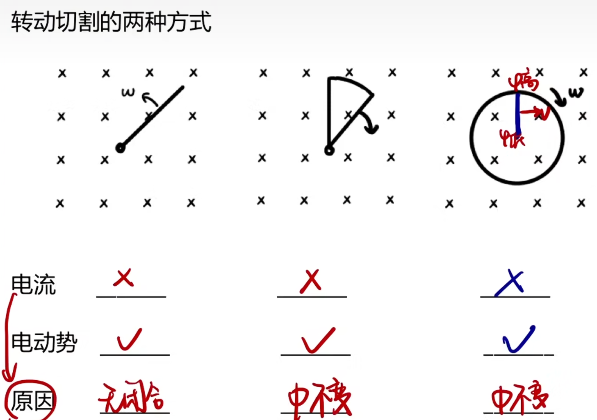
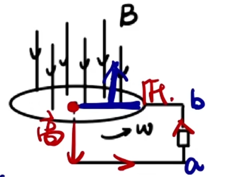

# 电磁感应 (待完善)

[【【选修3-2电磁感应】【磁通量】1.回顾磁通量】](https://www.bilibili.com/video/BV1JJ411W7ix?vd_source=52aa8bd45c28e534d02e312968f55355)
[【【选修3-2电磁感应】【感应电流】2.感应电流的产生条件】](https://www.bilibili.com/video/BV1JJ411W7kY?vd_source=52aa8bd45c28e534d02e312968f55355)
[【【选修3-2电磁感应】【楞次定律1】3.感应电流的方向判断】](https://www.bilibili.com/video/BV1JJ411W7ra?vd_source=52aa8bd45c28e534d02e312968f55355)
[【【选修3-2电磁感应】【楞次定律2】4.楞次定律的基础应用】](https://www.bilibili.com/video/BV1JJ411W7zF/?share_source=copy_web&vd_source=52aa8bd45c28e534d02e312968f55355)
[【【选修3-2电磁感应】【楞次定律3】5.多段过程分析】](https://www.bilibili.com/video/BV1JJ411W7mp/?share_source=copy_web&vd_source=52aa8bd45c28e534d02e312968f55355)
[【【选修3-2电磁感应】【楞次定律4】6.双圆环分析】](https://www.bilibili.com/video/BV1JJ411W72H/?share_source=copy_web&vd_source=52aa8bd45c28e534d02e312968f55355)
[【【选修3-2电磁感应】【楞次定律5】7.与牛二能量结合】](https://www.bilibili.com/video/BV1JJ411W7Cz/?share_source=copy_web&vd_source=52aa8bd45c28e534d02e312968f55355)
[【【选修3-2电磁感应】【楞次定律6】8.楞次定律总结】](https://www.bilibili.com/video/BV1JJ411W7Qj/?share_source=copy_web&vd_source=52aa8bd45c28e534d02e312968f55355)

## 磁通量

公式(需要与磁场的有效面积(垂直方向上研究对象上有磁场的面积)):

$$
\Phi = S_\perp \cdot B
$$

标/矢量:

$$
标量, 但是有正负(表示穿入或穿出, 可以规定)
$$

单位:

$$
Wb
$$

含义:

$$
磁感线穿过对应面积(min(S_磁, S_{对象}))的条数(穿入穿出方向数量差值, 穿入穿出可以抵消)
$$

例题简述(题目见视频):
对于一块条形磁铁, 上有铁环套住, 从$N$极向$S$极看, 画磁场, 点一定在条形磁铁内部, 叉可以布满整个平面(包括铁环外面), 又因为磁感线一定点等于叉, 所以铁环内点应该更多, 可以判断$\Phi$正负. 然后对于题目中三个铁环大小位置的差异, 它们点的个数一定相同, 所以就看叉的多少比较即可.

---

## 电磁感应(磁生电)

产生感应电流条件:

1. $闭合回路$
2. $磁通量改变$(并非单纯切割磁感线运动)

电磁感应条件(无需闭合回路):

$$
磁通量改变$$ 
看$\Phi$的变化:
$$\Phi = S_\perp \cdot B, 看 S_\perp 和 B 如何变
$$

## 楞次定律

内容(来拒去留):

$$
感应电流的方向总是要阻碍原磁场(磁通量)变化
$$

注意:

$$
阻碍不是阻止, 原磁场磁感应强度变化量总是大于感应磁场
$$

作用(有闭合回路时, 否则用右手定则, 在下文, 不是右手螺旋定则):

$$
判断感应电流的方向
$$

分析:

1. (没有磁感线要先画磁感线)判断原磁场的变化
2. 阻碍磁场变化得出磁感应磁场方向(增反减同)
3. 右手螺旋得出感应电流方向
4. 感应电流在磁场中受到安培力的作用

判断线圈变化趋势: 对线圈上一个点使用左手定则, 电流方向为切线方向, 磁场方向为原磁场方向(因为感应磁场只是减弱但不抵消, 而且不能自己感应出来的磁场作用在自己身上)(增缩减扩)(本质上还是阻碍$\Phi = SB$的变化, 假如$B\uparrow$, 则要想维持磁通量基本不变就要$S\downarrow$)

判断支持力的变化: 等效磁铁, 把线圈看成一个条形磁铁, 或者认为想要阻碍$B$变大就要往远处走, 反之同理. (来拒去留, 阻碍磁通量变化)

判断安培力的方向: 阻碍$\Phi$的变化, 注意看合安培力方向, 不一定是水平/竖直, 注意水平/竖直字眼, 别忘了还有另一方向上的受力.

### 铁环/铁芯:

内部磁感线沿着铁环/铁芯走, 磁感线在铁芯里面不外露, 这些磁感线对应的磁场可以引起感应电流. (如图)

### 双圆环:

$B$: 处在$\bullet$的磁场下, 磁通量为$\times$方向. 分析磁通量变化即可. 可以发现这里磁通量方向和磁场方向不一样, 所以增缩减扩的结论并 __不适用__ (此时恰好相反), 其实本质还是阻碍但不是阻止的理解. (如图$\times$增多, 所以要扩大面积增加$\bullet$). 对于变化趋势提供另一种思路: 两条导线电流方向不同相互排斥(更简单, 但有限制).

### 增缩减扩与来拒去留的条件:

__单一方向的磁场__(即仅出现磁体内/外部磁场或多个反向磁场等同时有$\times$与$\bullet$的时候). 本质都是阻碍磁通量的改变.

### 同向电流/异向电流失效情况:

有外界磁场 (即磁场不是电流感应出来的). 但还是, __阻碍__ 永远都适用且简单.

### 与能量的联系:

磁通量改变, 产生感应电流(安培力做功), 发热(不论电流的方向), 机械能损失.

---

## 电磁感应定律

公式(平均值, 一段时间内):

$$
E_感 = n \frac{\Delta \Phi}{\Delta t}
$$

其中n为线圈匝数. (为何是乘$n$? 因为把一匝看做一个电源, 多匝串连起来就是相当于电源的串联)
目的: 把产生感应电流线圈看做一个提供电动势和内阻的电源.
分为两类, 动生电动势与感生电动势. 区别: $\Phi$变化的原因.

### 动生电动势

分类依据: 由物体运动切割磁感线所感应出的电动势. ($S$变$\Phi$变)

产生感应电动势条件:

$$
切割磁感线
$$

(选学) 动生本质(洛伦兹力为非静电力导致电动势):

洛伦兹力使电荷在导体中定向移动从而产生电动势, 但注意洛伦兹力不做功, 其分力做功引起电动势. (会有外力与另一个洛伦兹力的分力抵消)

__右手定则__ : 当只有部分导线切割磁感线运动时, 无法通过楞次定律判断电流, 可以根据右手定则判断感应电流的方向. (与楞次定律同样是用来判断感应电流方向, 按需选择简便的)

1. 磁感线穿掌心
2. 拇指指 __速度__ 方向 (注意容易出错, 先用拇指再确定其他四指)
3. 得到四指为电流方向(记住四指永远指向电流, 或者记住四指比较宽, 指向比较宽的导体棒, 而拇指则指向单箭头方向)
4. 更重要地, 可以得到等效电源的正负极: 四指指向 __正极__ . (因为手对应的电处于内电路, 电流由负极流向正极)
5. 四指指向电势 __高__ 处. (正极电势高, 因此虽然没有闭合回路, 但是可以判断电势高低, 也意味着因为没有闭合回路, 所以无法使用楞次定律)

动生又分为两类: 平动与转动(判定方法很多, 譬如导体上是否所有点(线)速度大小都相等 等等).

#### 平动

公式(瞬时, 带瞬时速度, 对比原始公式):

$$
E_感 = B \cdot l \cdot v
$$

注意(有效长度区分安培力的仅有首尾相连):

$$
B, l, v两两垂直, 不垂直要投影; l为有效长度, 即先首尾相连, 然后再在垂直速度方向投影
$$

产生电动势最大的方向(形状, 磁场与速度大小固定): 先首尾相连, 然后得到的即为最大有效长度(因为不分解), 此时速度垂直于有效长度. (如图)

注意安培力的大小和方向也可以设问, 此时有效长度不需要分解只需要首尾相连, 判断方向的时候也可以使用来拒去留的 __阻碍运动__ 的思想更简单.

带有电压表的题目:
电压表本质: 表头 $+$ 电阻, 因此需要 __有电流通过才能偏转__ . 如果不产生感应电流, 则会出现电压表两段有电压但是不偏转无示数的情况.
有关电压的题目: 若问接在等效电源两端的电压的话, 就是问路端电压, 或者是外电路电阻分压, 而不是电源内部电阻的分压.
判断金属框哪一条边正在切割: 在磁场内的不平行于速度方向的均有切割磁感线.

#### 转动

__围绕一个端点转__ 公式(推导过程其实就是带入的整个导体棒的(两个端点的)平均速度$v = \frac{v_0 + v_t}{2}$, $v_0 = 0, v_t = r \cdot \omega$):

$$
E_感 = \frac{1}{2}Bl^2\omega
$$

一般没有闭合电路. 所以使用右手定则.
注意: 转动是导体棒围绕端点转(棒端点有固定点), 但是如图所示的情况不是转动, 而是平动(或者需要特殊的技巧看做转动去解决, 譬如假设$OB$也有导体, 最后用$U_{OA} - U_{OB}$即可)

### 感生电动势

分类依据: 由原磁场磁感应强度变化引起的电动势. (当$S$不变时, 或所有物体均不动的时候, $B$变$\Phi$变, 即不能是物体运动引起的磁感应强度改变导致磁通量改变)

公式:

$$
E_感 = nS\frac{\Delta B}{\Delta t}
$$

步骤:

1. 求$E$
2. 找等效电源
3. 用楞次定律画电流方向判断正负极 (注意电流在电源内部由负极流向正极)
4. 等效电路, 在电路中求$U_{路端}$等(有电路的话等效电源有内阻)

$B - t$图像:

$$
即告诉我们斜率 k = \frac{\Delta B}{\Delta t}
$$

变形得得到:

$$
k \cdot \Delta t= \Delta B
$$

带入公式即可消掉$\Delta t$.

感应电流: 若$k = \frac{\Delta B}{\Delta t}$不变且$R_总$不变, 则$I_感$不变(推导公式).

(选学) 感生本质(环形电场提供非静电力):

$B$改变, 感应出环形电场, 电荷定向移动形成环形电流. $E$的本质: 非静电力做功的能力, 此处就是感应电场对电荷的搬运(静电场对应静电力(电场力), 环形感应电场对应的力属于非静电力, 因为其电场线闭合了). 所以如果不是因为环形电场所带来的电动势引起感应电流的话就不属于感生, 而属于动生.

转动切割的两种方式:

判断都是依据上面介绍的判断方法, 但难以理解的, 关于第三个 __实心__ 圆盘, 我们一般看做有无数根半径方向上的导体棒, 做题的时候画一根即可; 关于第二/三个有电动势但没有电流: 两/多条直导线切割磁感线, 产生对向的电流, 无电势差, 所以没有电流.

像第三幅图那样, 若旋转对象为一个平面则只需要研究一根导线. 如果在第三幅图外面接上电路(如下图), 这就是一个发电机, 不会产生环形的感应电流, 但是因为圆盘圆心和圆周有电势差, 所以在外电路上形成了电流(注意这并不违反以往的判断规则, 而是形成了另一个电流).

判断电流有无变化: 看$E$有无变化, 从$E = \frac{1}{2}Bl^2\omega$来看, $B, l, \omega$均没变; 从$E = n\frac{\Delta \Phi}{\Delta t}$来看, $\Delta \Phi$没变, 两种方法都可以得到$E$不变, 又因为$R$不变, 所以$I$就不变.

---

### 二次感应

由于不均匀的磁通量变化, 导致感应电流不是定值, 导致感应磁场不恒定, 导致其感应出的磁场变化第二次(在另一回路)感应出电流, 就是二次感应. 解题的话和平常一样, 不需要特别在意.

已知二次感应电流方向反推原磁场金属棒的运动: 分类讨论($\times$如何变, $\bullet$如何变), 然后先假设像一个方向动, 比如向左加速, 如果符合题意就是向左加速与向右减速, 否则就是向左减速与向右加速.

反电动势:

如图, 这里介绍一下为何选$A$而非$B$. 因为$MN$棒运动起来也切割磁感线, 所以产生了与从右侧装置引起的电流相反的电流, 抵消了一部分电流(但不会反向, 阻碍)(产生反电动势), 所以应该是向右做加速度减小的加速运动.

---

### 大题:

寻找电源:

$$
动生: 谁在切割谁是电源; 感生: 先画电流(每条导线), 然后去放电源, 只要放的位置符合电路电流流动就可以.
$$

可能会问到的问题:

1. 无关时间(瞬时): 电动势, 电流, 安培力, 电压, 功率
2. 与时间有关(一段时间内): 发热量, 流过的电荷量

对于动生, 导体棒不匀速:
实际上是做加速度改变的减速运动, 先求$E_感$转化成电路中的问题. 因为$E$每时每刻都在改变, 所以如果要求某个时刻的$E$, 用$E = Blv$; 如果要求平均$E$, 用$E = n\frac{\Delta \Phi}{\Delta t}$.
那么可以发现对于上述第二类问题来说, 在导体棒不匀速的情况下电流不恒定, 需要分别使用功能关系$W_安 = - Q_总$与平均电动势电流/电荷量$q = n\frac{\Delta \Phi}{R + r}$(或动量定理).(详见下文)
电流恒定就很简单了, 分别使用$Q = I^2 R t$与$q = I \cdot \Delta t$即可, 但上面给出的方法是通法, 下面的解法不一定简单且有限制.

---

## 力与运动

动生切割安培力公式(大题不能直接写):

$$
\begin{cases}
F_安 = BIl \\
E = I (R + r) \\
E = Blv
\end{cases}
$$

$$
\Rightarrow F_安 = \frac{B^2l^2v}{R+r}
$$

可以用"哔哩哔哩未必总燃"来记忆(即"$BlBl, v比R_总$", 看到电阻想到发热)
然后列牛二, 求得关于$a$的表达式分析. 如果受力情况不清晰, 大小未知, 可以分类讨论力的大小.
求最值速度: $a与F_合 = 0$时取得, 分析平衡状态即可.

### 电容器相关

分为两类: 一类是初始不带电, 一类是初始充满电的. 一下对第一类进行说明, 第二类在电源相关部分介绍.

由于电容器电阻未知, 所以不能用欧姆定律求电流及安培力, 而应该用电流的另一个公式(定义)$I = \frac{\Delta Q}{\Delta t}$, 以及$C = \frac{\Delta Q}{\Delta U}$, 其中需要找$\Delta U$与$\Delta E$的关系(一般是相等). 可以发现会求得一个类似$I = \frac{CBl\Delta v}{\Delta t} = CBl \cdot a$的式子, 带入牛二求$a$即可得出运动状态.

---

### 电源相关

因为有电源, 所以先产生电流, 使得导体棒不需要外力也可以运动, 会受到安培力, 使用左手定则(楞次定律不能用)比出运动方向, 然后牛二求$a$(注意电源电动势和感应电动势不要混淆, 别忘了感应出的反电动势抵消原有电动势, 使用最基础的公式$F_安 = BIL$)得到运动情况. 临界状态: $E = E_感 = Blv$时, 没有电势差和电流, 因此没有安培力, 顾做加速度减小的减速运动并最终匀速.

那么充满电的电容器同理, 唯一区别就是它的电压$U$会随着放电减小, 而同时$E_感$增大, 二者相等之后匀速运动.

---

## 动能定理

安培力做功(不能用$F \cdot x$来算, 是变力):

$$
转换为电能, 再转化为热能(纯电阻), 故题目涉及焦耳热Q_{发热量}的话就需要列动能定理写安培力做功生热
$$

和电能关系(功能关系): 安培力做正功, 消耗电能; 安培力做负功, 增加电能. 即$W_安 = - E_电 = - Q_总$. 计算的时候和以往一样在动能定理里写功, 全部是正号, 计算出来和带入的时候根据功能关系判断正负.
算出$Q_总$之后按照电路的思想(导体棒看做电阻)按比例分配即可.

---

## 动量定理

常见的流经的电荷量解法:

1. 电流恒定: $q = I \cdot \Delta t$
2. 已知位移或变化的面积: $q = n\frac{\Delta \Phi}{R + r} = n\frac{BLx}{R + r}$
3. 已知速度: 动量定理$BIL\Delta t = m(v_t - v_0)$, 将$I\Delta t$代换为$q$得到$BLq = m(v_t - v_0)$

---

## 自感现象

把线圈接入电路, 在通电流的一瞬间产生感应磁场导致感应电流阻碍通入电流的变化, 一段时间后趋于稳定, 感应电流消失. 感应电流要阻碍原电流的变化, 当原电流增大, 则产生一个相反方向的感应电流. 若串联一个灯泡, 现象表现为灯泡缓慢变亮.

自感系数: $L$, 单位亨(亨利, $H$), $E = L\frac{\Delta I}{\Delta t}$

影响自感强度的因素(使用自感系数$L$去反应自感现象的强弱):

1. 有无铁芯
2. 线圈匝数

做题的时候注意线圈有无电阻, 以及问的是稳定后还是变化的瞬间. 变化的瞬间由于感应电流的阻碍, 可以将线圈看成一个阻值很大(甚至无穷大)的电阻, 稳定后根据题目描述判断线圈阻值. 注意当断开的瞬间, 原电流减小, 会感应出一个同向的电流(线圈相当于一个电源), 这个电流不能经过断开的开关, 可以经过其他支路, 若其他支路上有小灯泡, 则会体现为小灯泡延迟熄灭, 此时如果流经线圈支路的电流大于小灯泡支路的电流(感应电动势大于原电源电动势)的话, 由于断开开关的变化十分剧烈, 感应出的电流近似看做原电流的大小, 小灯泡会先变亮后变暗缓慢熄灭, 出现闪亮的现象. (其他情况同理)

产生自感现象时线圈阻值会变化, 所以可以使用串反并同去分析问题.

---

*以上所有内容均为个人整理的$黄夫人$公开课程笔记

本作品采用 知识共享署名-非商业性使用 4.0 国际许可协议 (CC BY-NC 4.0) 进行许可.
$\textcopyright$ $2025$ $Zheng$
