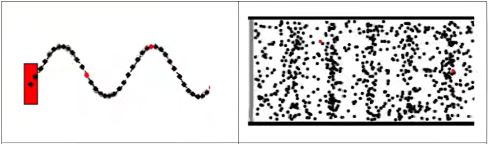
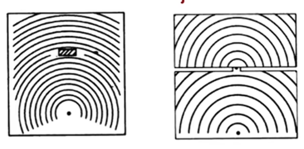
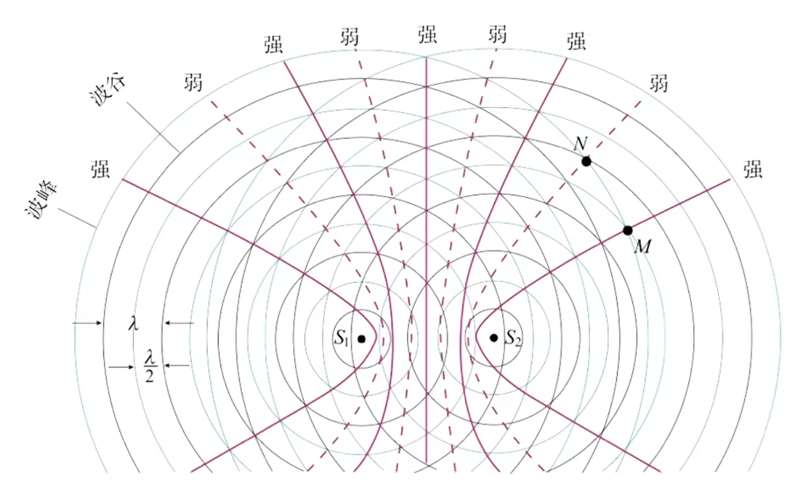

# 机械波

机械波的传播需要介质. 机械振动在介质中传播为机械波. 介质本身不会传播, 但波可以传播能量的信息(运动的形态). 电磁波无需介质. 

如图为横波与纵波. 质点振动方向与传播方向分别垂直与平行. 横波最高点为波峰, 最低点为波谷. 纵波分疏部与密部.

简谐波(波形图与质点的振动图像均为正弦曲线)的波形图可能为下图左侧, 而其中一个质点的运动图像可能为右侧. 

周期($T$)为发生一次全振动所需要的时间, 波速($v$)为振动在传播时的速度, 波长($\lambda$)为在一个周期内所传播的距离. 类似于 $s = vt$ , 在机械波中有: 

$$\lambda = vT\\\lambda f = v$$

在不同介质中, 若为同一振源(且频率不变), 则频率/周期不变, 波速/波长改变. 

判断质点振动方向可以用口诀, 即"沿波传播方向, 上坡下(振), 下坡上(振)".  当然, 也可以使用平移的思想判断. 已知振动方向反求传播方向同理.

由平移的思想, 起振点的运动方向一定是波头部刚要开始振动点的运动方向, 因为运动状态被传播. 

多解问题实际上很简单, 只需要写出核心公式 $
v = \frac{x}{t}$ , 找到可以确定的数字填入, 再填入不确定的数字(先找不差周期的特征值, 再相差不定个周期)即可. 改变传播方向满足两个特征值相加为一个周期量, 所以可以直接快速得到另一个特征值. 

波的衍射是指波可以绕过障碍物继续向前传播. 可以认为是存在新的, 衍生出的波源. 

波的衍射是普遍的, 但是想要观察到明显衍射就需要满足孔缝宽度/障碍物尺寸与波长相似或更小(对于孔缝尺寸相当最明显, 因为过小会阻止能量穿过从而难以观察). 

波可以叠加, 高度直接相加减, 两波分离后保持各自运动特征(不互相干扰). 

在一维上频率相同的两列波叠加形成的波是稳定的(反之不稳定). 此时振动加强点(只是振幅增大, 并非一直在最高处)与振动减弱点(也不一定一直呆在最低处, 但可能一直在振动原点)不会移动. 

当频率相同(显然相位差恒定), 振动方向一致的两列波叠加后会出现波的干涉, 即有些点总是振动加强/减弱. 所以只有频率相同才会出现稳定的干涉图样. 

连接振动加强和减弱点可以分别得到图中实线与虚线. 可以发现实线上的点振动会始终加强(同颜色线相交, 即便未画出), 虚线上的点振动会始终减弱(不同颜色线相交), 实线与虚线形成的是双曲线图像. 振动加强的位置公式: $|x_1 - x_2| = \frac{\lambda}{2} \cdot 2n, n \in \N$ ; 振动减弱的位置公式: $|x_1 - x_2| = \frac{\lambda}{2} \cdot (2n - 1), n \in \N$ , 其中 $x_1, x_2$ 分别是到两个波源的距离(这也是双曲线的原因). 

有一类题就是需要你分析一条线段两端存在两个振动步调与方向相同的波源, 则此线段上有几个振动加强/减弱点. 可以发现我们将上述公式从 $n = 0$ 开始逐个代入直到不合理为止即可分析出来. 若将此线段作为一个圆的直径, 则圆上的振动加强/减弱点的个数可以由此线段转化得到(因为双曲线之间不会相交, 圆上可以直接对应到直线上), 遇见此类变式题需要会转化.

多普勒效应是当波源与观察者靠近或远离时, 接收到的波的频率都会发生变化. 靠近频率增大, 远离频率减小. 若做匀速运动, 则频率增大或减小后不会改变(稳定); 若做变速运动, 则频率会继续发生改变. 可以用于彩超, 太空观测(看距离地球的距离)等.