# 光学

光是电磁波的一种, 如下图为电磁波谱.

{ width=300px }

需要注意的是在可见光范围内红光波长较长(红绿灯警示作用), 紫光频率较大(杀菌消毒). 在真空下光速为 $c = 3 \times 10^8 m/s$ , 光速与波长受到介质的影响而改变, 但频率不会. 不同颜色的光在真空中传播速度相同, 在其他介质中传播速度不同. 电磁波同样满足 $v = \frac{\lambda}{T} = \lambda \cdot f$ .

光可以反射, $N$ 为法线垂直于反射面, 反射角等于入射角.

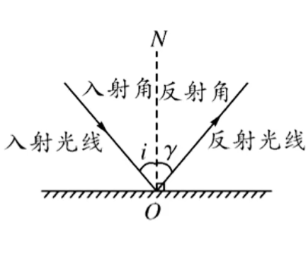{ width=300px }

光可以折射, 初中时记忆的空气角大(真空角大, 若不认为空气与真空为同一介质则空气为光密介质, 真空为光疏介质, 真空角大)在高中可以被解释为折射率的关系, 详见下文. 在此时我们称空气为光疏介质, 水为光密介质, 光疏介质与光密介质是相对的, 需要比较二者折射率大小来确定. 由此可以进一步得出"光疏角大".

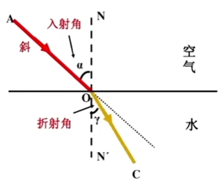{ width=300px }

折射率(绝对折射率)为从真空射入某介质, 入射角与出射角的正弦值之比, 即 $n = \frac{\sin \theta_1}{\sin \theta_2}$ . 其由仅介质的性质决定, 与入射角无关, 几种常见介质折射率如下(钠黄光, $\lambda = 589.3 nm, t = 20\celsius$).

| 真空 |   空气    |   水   |      玻璃      |
| :--: | :-------: | :----: | :------------: |
| $1$  | $1.00028$ | $1.33$ | $1.5 \sim 1.8$ |

注意 $n > 1$ , 故代入公式时要注意为大角比小角. 可以发现 $n$ 越大光线偏折越厉害. $n$ 相对大者为光密介质, 小者为光疏介质. 光在介质中速度满足公式 $v = \frac{c}{n}$ , 由于 $n > 1$ , 故任何介质中光速小于真空中光速 $c$ .

可以发现折射率与光的波长(频率)有关, 即与颜色有关, 故会发生光的色散. 其中紫光折射率最大, 红光最小, 与频率变化相同, 可由光晕记忆(紫光折射率大在外圈, 红光折射率小在内圈). 色散本质为光的折射.

{ width=300px }

当光垂直射入界面时不会发生偏折, 但光速会改变.

当光从光密介质射向光疏介质时, 若入射角达到临界角 $C$ 则会发生全反射, 即没有光线射出水面. 实际上临界角 $C$ 可以看做从光疏介质射向光密介质时, 当入射角 $i \to 90^\circ$ 时的出射角, 故存在 $n = \frac{\sin 90^\circ}{\sin C} = \frac{1}{\sin C}$ . 如下图, 若 $\theta_2 = C$ 则出射光线沿水面, 故此时恰好发生全反射; 若继续增大 $\theta_2$ 则仍无光线射出水面, 为全反射.

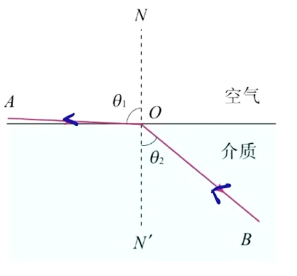{ width=300px }

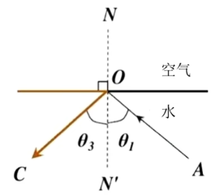{ width=300px }

由 $n = \frac{1}{\sin C}$ 可知折射率越大, 临界角越小, 故紫光临界角较小, 红光临界角较大.

折射有一类题目会问经过折射后物体被看见的位置比实际位置偏高还是偏低. 实际上人会认为物体在出射光线的延长线上, 故由两条不平行光线即可确定物体位置. 由此可知只需在被观测物体上选取一点当作光源(反射的自然光), 画出两条成角度的折射光路图, 反向延长两条出射光线交于一点, 即为物体被认为所在的位置. 下图为人观察水中鱼, 鱼会被认为偏上一点.

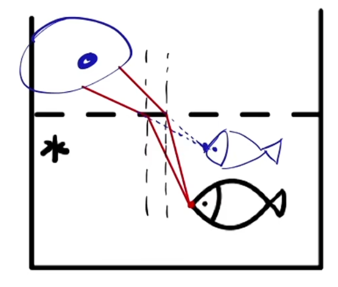{ width=300px }

鱼看人同理.

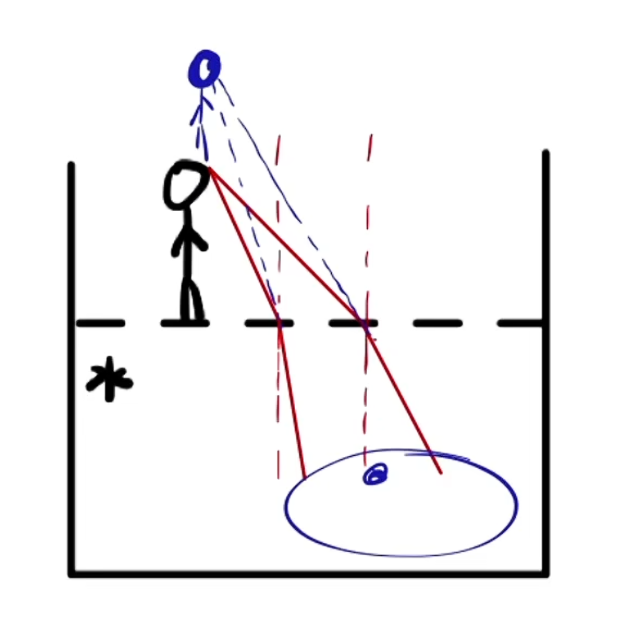{ width=300px }

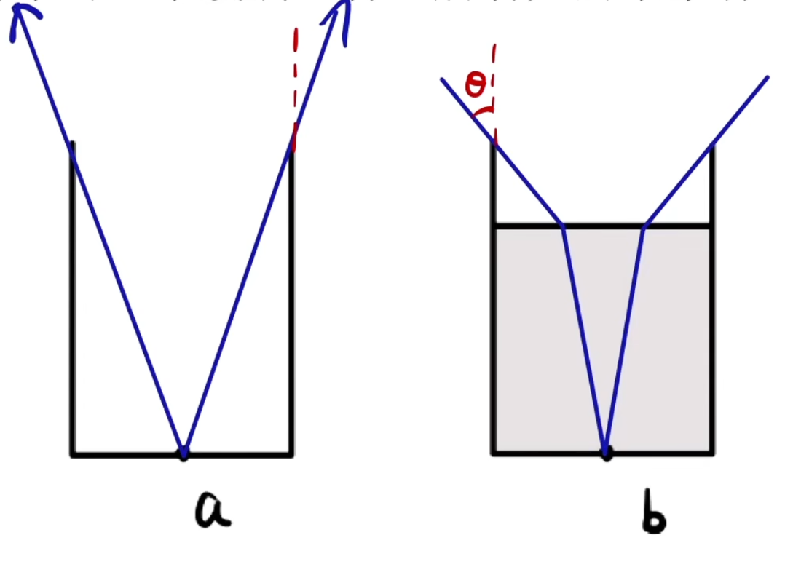{ width=300px }

同理, 加入光密介质可以扩大视野, 如上图 $b$ 为加入水或玻璃后的视野, 由于 $\theta_a < \theta_b$ , 故 $b$ 中视野更广. 但此时看管壁/洞口大小会减小, 如下图, $d$ 为观测到洞口直径, $b$ 图中管壁会被认为在红点处, 故为此图示.

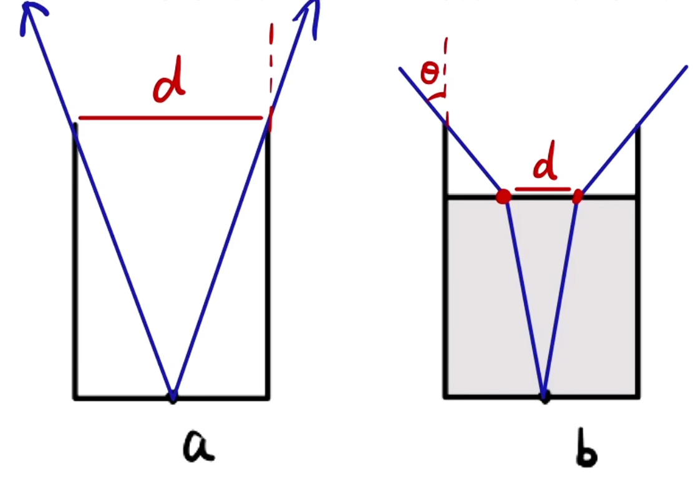{ width=300px }

海市蜃楼(海面上观察到陆地景象)或沙漠蜃景(沙漠中观察到类似水潭, 有景象的倒影)的现象成因为空气中水汽分布不均, 从海面到天空水汽逐渐减少, $n$ 逐渐减小(水珠导致折射故如此), 而从沙漠到天空由于沙漠十足干旱故水汽逐渐增多, $n$ 逐渐增大(实际上很大程度上是因为折射率受温度影响而改变, 但此解释更便于理解). 已知折射率越大偏折越厉害, 故如下图, $n$ 变化, 光线发生"弯折", 到达临界角后发生全反射, 此后切换方向继续折射并被观测到(或未提及发生全反射, 由于地球弧度被观测到), 眼睛逆着光路向回看以判断物体位置, 由此产生海市蜃楼或沙漠蜃景. 实际上为光的折射与全反射的体现. 海市蜃楼与沙漠蜃景均为虚像.

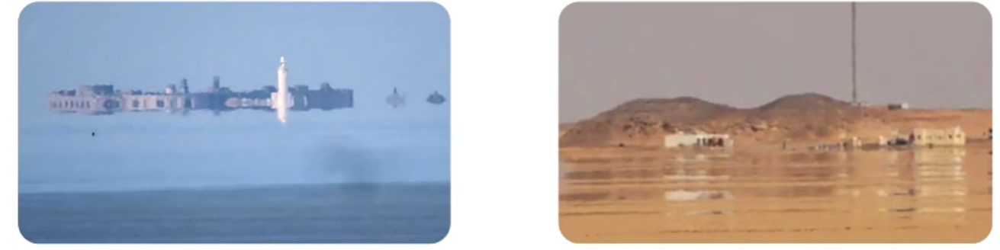{ width=300px }

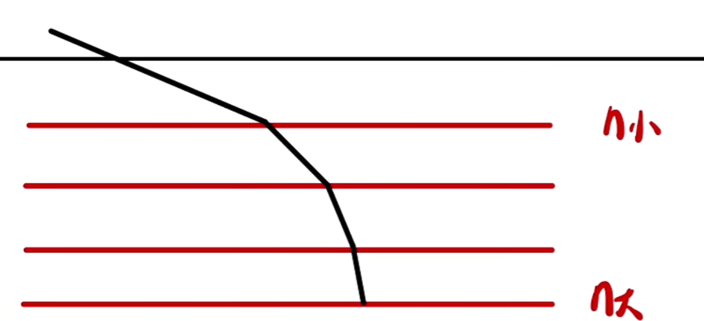{ width=300px }

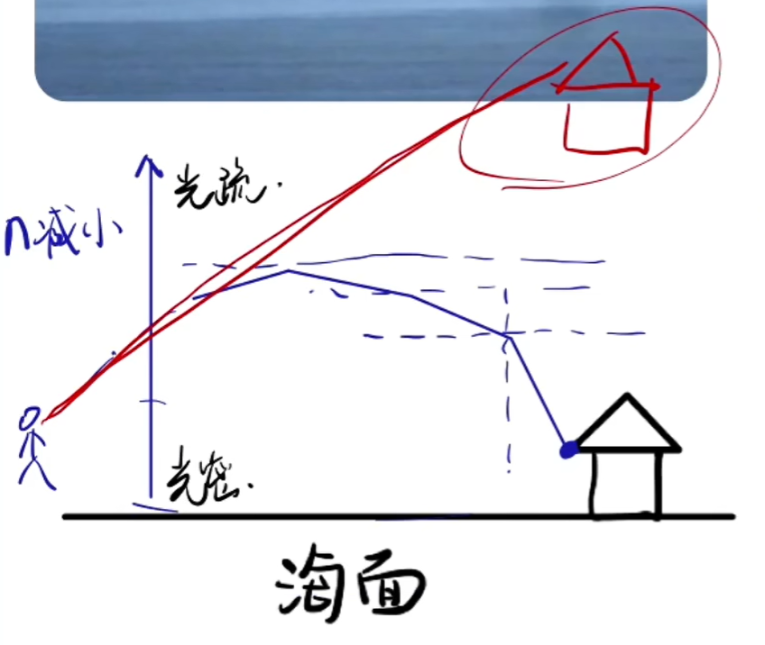{ width=300px }

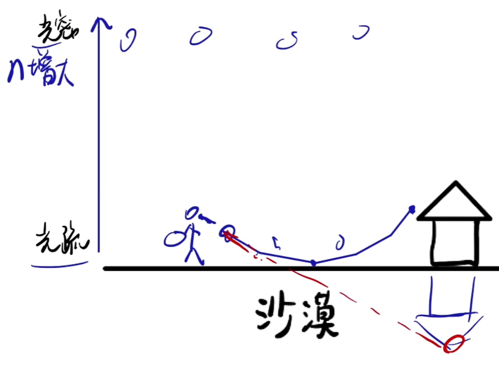{ width=300px }

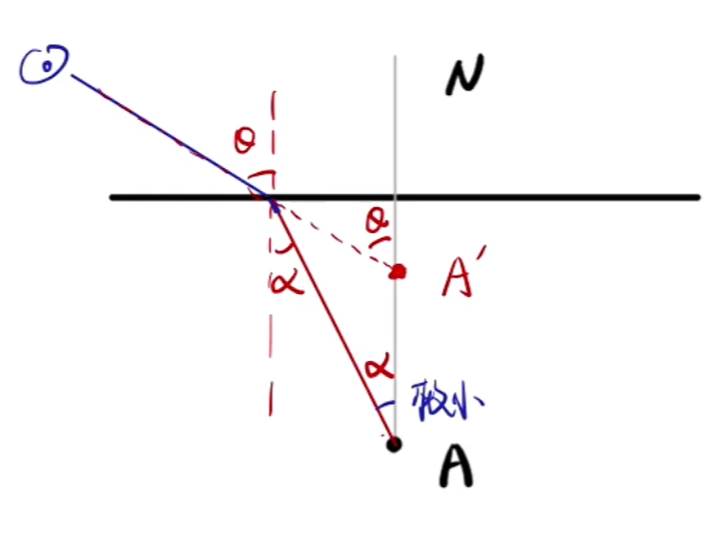{ width=300px }

一类视深问题如图所示, 即眼睛竖直向水面看去会认为水的深度为多少. 实际上由于眼球有一定宽度, 故 $\theta, \alpha$ 极小时光线仍可射进竖直向下看的眼睛. 由于角度极小, 故满足 $\theta = \sin \theta = \tan \theta, \alpha = \sin \alpha = \tan \alpha \Rightarrow n = \frac{\sin \theta}{\sin \alpha} = \frac{\tan \theta}{\tan \alpha} = \frac{\frac{x}{h'}}{\frac{x}{h}} = \frac{h}{h'} \Rightarrow h' = \frac{h}{n}$ ( $x$ 为两角对边, $h$ 为实际深度, $h'$ 为视深). 可以发现视深与 $\alpha, \theta$ 无关, 故无需已知, 但前提为其足够小且不为 $0$ . 可以发现向水中看会更浅, 同理从水中看天空也会更高.

实际上视深问题若记住 $h$ 与 $h'$ 为 $n$ 倍, 由于 $n > 1$ , 只需要判断水更大, 并写"由数学推导可得", 即可得到答案. 要注意的是若从水看天空, 则空气中的距离看起来会变化, 但从空气中看水, 水的距离看起来会变化, 故眼睛不再哪个介质中哪个介质视深就会变化, 眼睛所在介质视深不变.

## 大题

首先需要知道圆弧界面法线方向为半径方向(切线的垂线), 以及若介质两界面平行, 则入射光线与出射光线平行(如玻璃砖), 还有若两界面垂直, 则两次反射后光线平行返回, 如图, 常用于荧光服或自行车反光灯等.

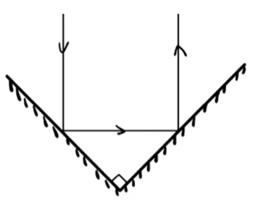{ width=300px }

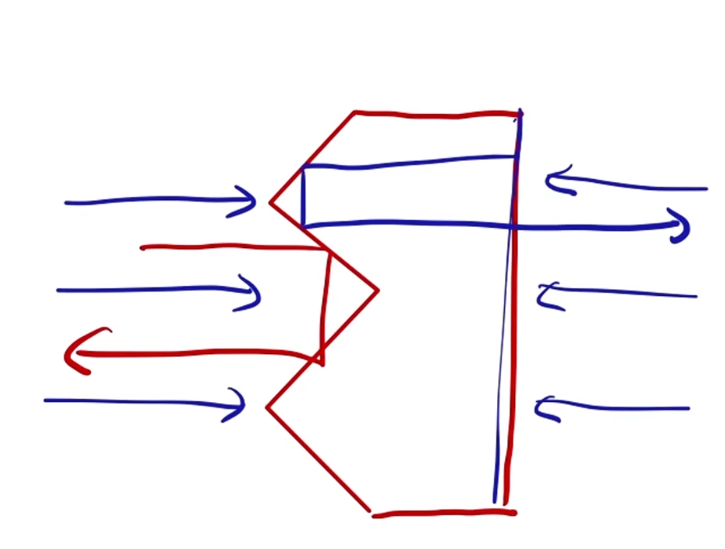{ width=300px }

实际上自行车反光灯如图所示, 应当粗糙面向内, 光面向外. 因为由此我们可以构造出全反射使得光线比较强, 否则如红线无法形成全反射.

解题时可能用到正余弦定理, 两角和差公式, 二倍角公式等数学知识.

## 干涉

光是电磁波, 可以发生干涉. 振动加强点较亮, 振动减弱点较暗. 为得到频率相同, 相位差定且振动方向一致(即干涉的条件)的两束光, 考虑借助光的衍射, 将一束光分成两束符合条件的光. 缝的宽度极小, 约为光的波长或与其为同一数量级.

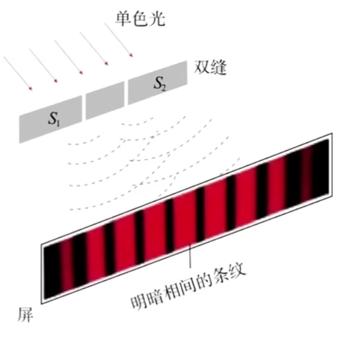{ width=300px }

可以发现中央(亮)条纹一定为亮纹, 因为波程差为 $0$ . 由双缝干涉实验(上图)可以测得光的波长, 原理为 $\frac{d}{l} = \frac{\lambda}{\Delta x}$ , 其中 $d$ 为双缝间距(仪器上标注), $l$ 为挡板与屏幕间的垂直距离(刻度尺测量), $\Delta x$ 为相邻亮条纹中线的间距(较小, 难以用刻度尺测量, 需要使用测量头, 具有放大功能, 使用方法与螺旋测微器类似, 如下图).

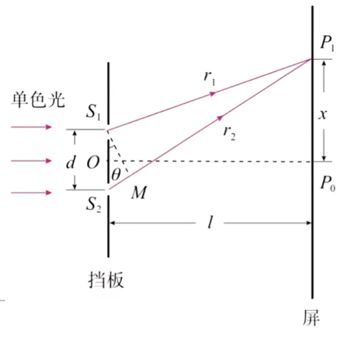{ width=300px }

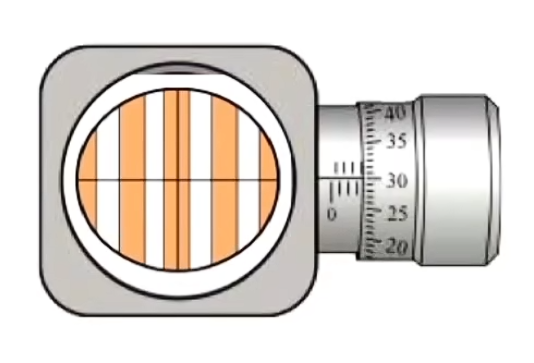{ width=300px }

公式由于为两比值相等, 故必定满足 $\frac{较小_1}{较大_1} = \frac{较小_2}{较大_2}$ 才能相等, 且易知 $d$ 与 $l$ 较宏观(简易仪器即可测量), $\lambda$ 与 $\Delta x$ 较微观(需要精密仪器测量) , 且 $l > d$ (缝的间距实际上还是比较小但又不那么小), $\Delta x > \lambda$ , 故可记住公式.

由于 $\frac{d}{l} = \frac{\lambda}{\Delta x}$ 中 $d, l, \lambda$ 均为定值, 故 $\Delta x$ 为定值, 即相邻条纹间等距(较远处条纹不适用以上公式, 因为本质上 $d\sin\theta = n\lambda$ 始终成立, 在 $\theta$ 较小时, $\sin\theta \approx \tan\theta = \frac{\Delta x}{l}$ 才保证公式成立, 才可得亮条纹间距相同). 故一般选用红光进行实验, 因为其波长长于其他颜色, 导致 $\Delta x$ 较大, 实验效果明显且便于测量. 故若将红光改为蓝光, $\Delta x$ 会减小. 若将单色光改为白光则由于光波长不同, 会形成中央为所有色光叠加而成的白色, 其余为不同色光叠加后彩色的干涉图样.

实际上还存在薄膜干涉. 不同于双缝干涉, 光线于两个薄膜面反射从而导致干涉.

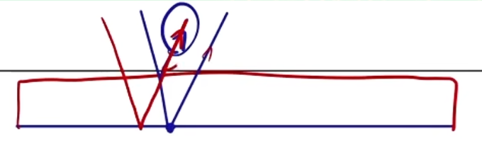{ width=300px }

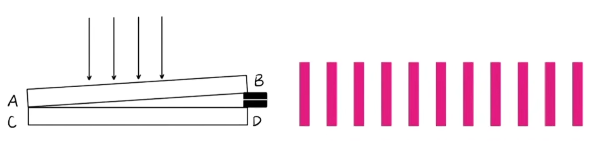{ width=300px }

若使用如图装置, (液体/空气)薄膜会形成三角形, 从而产生劈尖干涉. 实际上此夹角十分微小, 此处夸张处理. 光线分别从两个平面 $AB$ 下表面与 $CD$ 上表面(薄膜的两个面)发生反射, 对于一个竖直点波程差为此处薄膜宽度的两倍 $2d$ , 若 $2d$ 满足 $2d = \frac{\lambda}{2} \cdot 2n$ , 则为此处振动加强点, 在此产生劈尖干涉, 其余不满足地段为较暗条纹. 且因 $d$ 均匀变化, 亮条纹一定相隔相同间距出现, 产生如图所示的干涉图样(俯视图). 若减小夹角 $\theta$ 或减小薄膜宽度, 由于满足条件的 $d$ 不改变, 故若薄膜宽度减小则满足条件的 $d$ 更加稀疏, 即宽度 $d$ 不变, 需要更远的间距以达到 $d$ , 故间距增大. 实际上也可画以下图理解, 原理相同. (两个等高的蓝色框左侧为两亮条纹原始状态, 右侧为减小宽度后将同等高度水平平移后的恰当位置, 可以发现平移后两亮条纹间距(两个蓝箭头)比移动前增大)

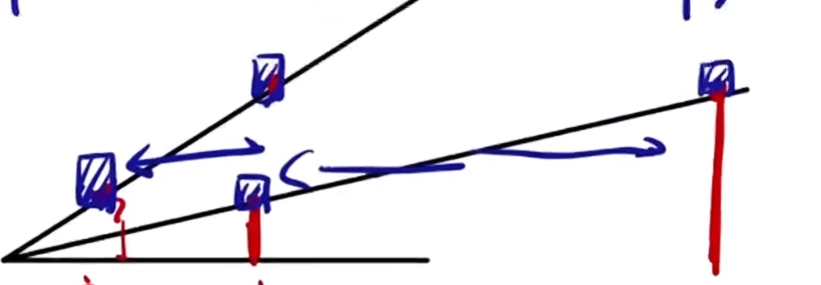{ width=300px }

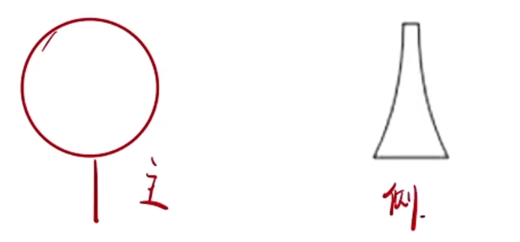{ width=300px }

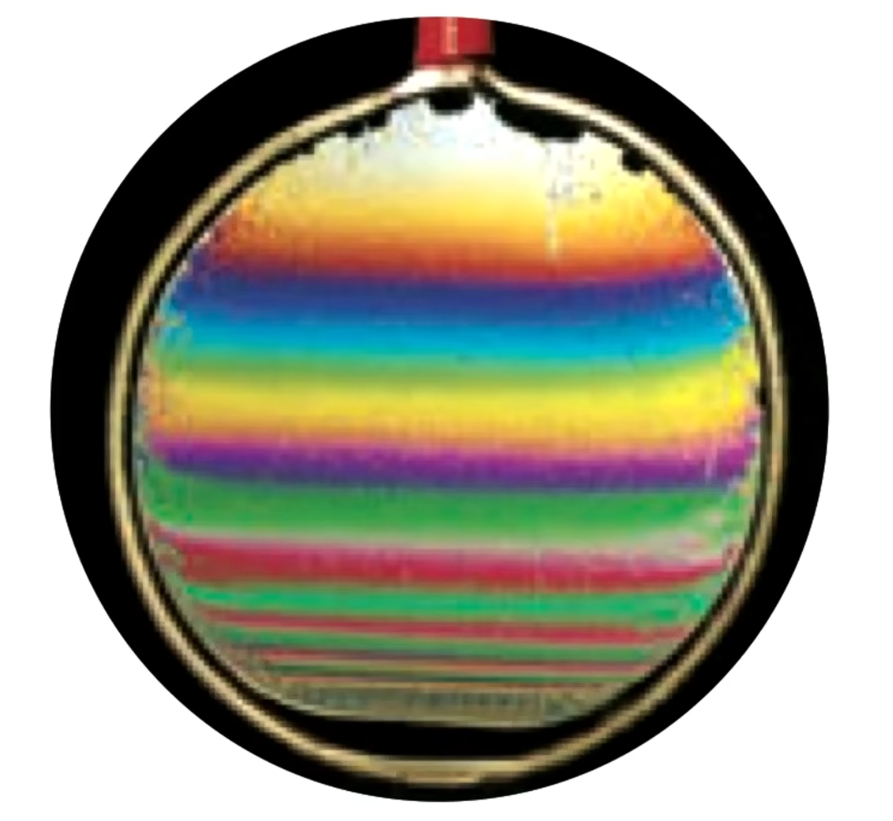{ width=300px }

如图为肥皂膜的主视图与侧视图, 由于表面张力侧视图不是标准的三角形, 易知条纹为彩色(复色光照射)且在主视图中水平排列, 且不均匀分布, 由于从上往下看间距增大速率逐渐增大, 则相当于越靠下越增加了宽度(增大了 $\theta$ 角), 则间距减小, 如图. 当然, 感性理解, 下方额外堆积许多宽度即意味着下方具有更大的形成条纹的能力, 因为两条条纹 $\Delta d$ 相同, 下方 $d$ 变化更快.

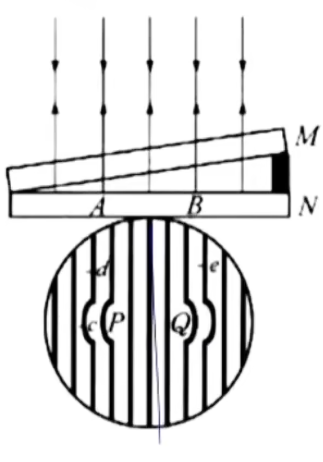{ width=300px }

劈尖干涉可以用于检验 $N$ 板平整度, 且十分灵敏. 如图, 干涉条纹(俯视图)为直线则对应区域无不平整, 若弯折则可能凸起或凹陷, 如下图, 可使用同样的平移方式, 找到与两红点间距相等长度的实际位置即可得到弯曲方向, 凹陷同理. 且易知干涉图样同一条竖线下厚度相同(上文干涉类型同理). 实际上增透膜就是应用如此原理, 譬如玻璃反光看不清, 就可增加一层增透膜使得反射光线振动减弱. 当然也可构造振动加强点以掩盖玻璃内部(私密膜).

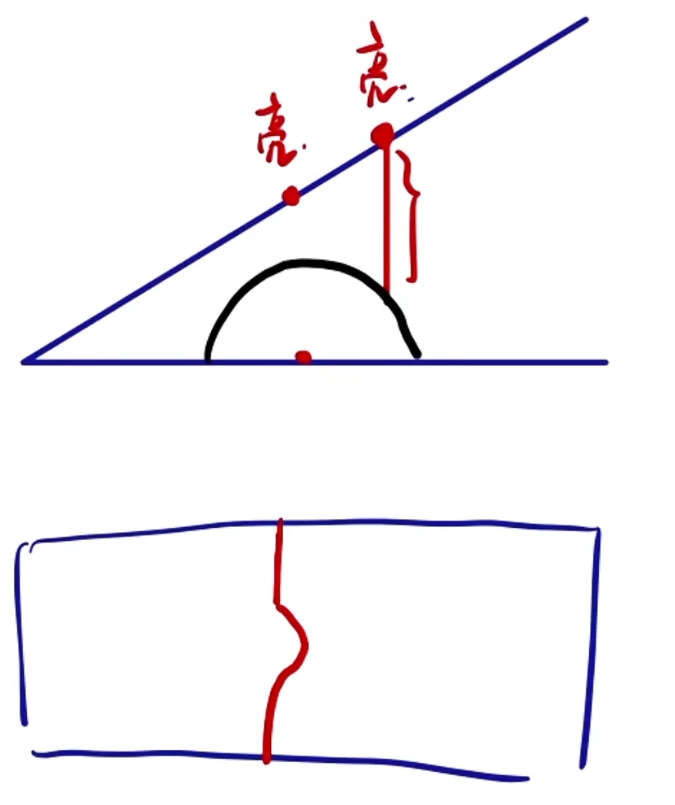{ width=300px }

## 衍射

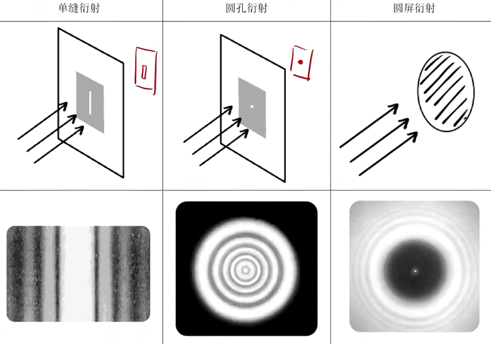{ width=300px }

光可以衍射, 故光屏上图样不为红笔所画, 而在光斑外出现明暗条纹, 且与干涉不同地, 其间距不等. 可以发现圆屏衍射中完全密闭完整的圆屏后方本应全为黑色, 但实际上出现了亮斑在正中心, 即泊松亮斑, 成因为圆盘边缘一圈到达中心点的距离相同, 光程差为 $0$ , 故中心点振动加强, 出现泊松亮斑.

衍射与干涉若使用白光, 则中心均为白色, 周围出现彩色. 衍射可以理解为无限多个子波叠加, 干涉可以理解为有限多个相干波叠加.

对于单缝衍射(缝远大于波长, 即远大于纳米级), 缝越窄, 衍射越明显, 条纹越粗, 衍射范围越大. 但要注意若过小则透过的光减小, 屏幕上亮度降低导致难以观察, 注意不是由于衍射不明显导致难以观察. 随着缝变窄, 图像如下图变化(缝先变窄, 到达一定程度后出现多个衍射条纹, 而中央纹会由此重新加粗)

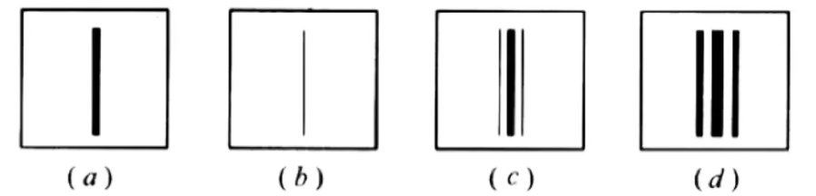{ width=300px }

## 偏振

光的偏振现象即即使传播方向相同, 振动方向仍然可能不同. 如下图, $P, Q$ 为偏振片, 仅允许(过滤出)特定振动方向的波(偏振光)穿过. 注意并非只有振动方向完美与偏振片方向一致的光可以透过, 实际上只有垂直于其的光可被完全过滤掉, 成其他角度的光只有部分被过滤掉(正交分解后平行透过, 垂直被过滤).

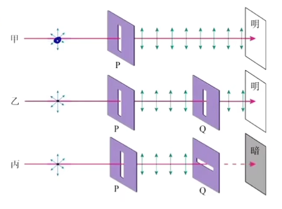{ width=300px }

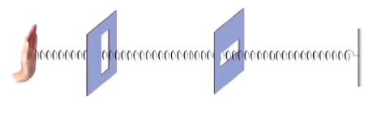{ width=300px }

可以发现纵波由于振动方向与传播方向一致而必定可穿过偏振片, 由此可以判断光为横波而非纵波.

实际上除了光源直接发出的光外, 大多数光都是不同角度的偏振光, 因为折射光(如下图, 垂直纸面方向振动的光较强, 即应用点与叉表示其振动方向)和反射光(平行纸面方向振动的光较强, 即应在纸面上画波浪线表示振动)都是偏振光.

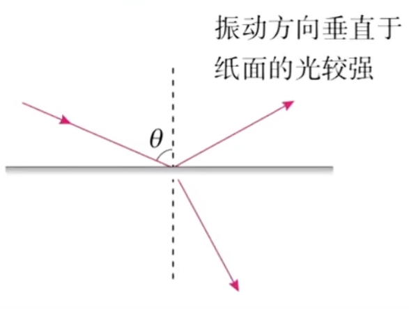{ width=300px }

偏振现象可以用于相机偏振滤光片, 用于过滤拍摄水面或玻璃等时的反射光. $3D$ 电影也应用了光的偏振现象, 即在光源发出方向垂直的光, 通过在左右眼佩戴不同方向的偏振片(滤光片)从而使左右眼接收不同光, 从而在左右眼产生不同画面, 从而产生距离感.

## 激光

激光平行度好(汇聚, 故用于读取光盘信息, 且因此在距离远时不发散, 可用于测距), 能量高(故用于医学手术), 相干性好(干涉现象明显, 传递信息时损伤小, 故用于光线通信), 故常用于实验.
