# 热力学

## 分子动理论

物体是由大量分子构成的, 此处分子为广义的分子, 包含原子, 离子等微粒. 分子直径的数量级为 $10^{-10} m$ , 质量数量级为 $10^{-26} kg$ . 对于固体或液体, 我们可以认为分子符合球体模型, 即分子是一个个紧挨着的球体, 体积为 $V = \frac{4}{3}\pi (\frac{D}{2})^3$; 对于气体, 我们可以认为分子符合立方体模型, 即分子所占据的体积是一个个紧挨着的立方体, 体积为 $V = d^3$ , 其中 $d$ 为分子间距离.

我们可以使用油膜法测量分子直径. 将一滴油酸摊开在水面上, 可以近似认为是单分子层. 近似地使用公式 $V = Sh$ 即可计算出 $h$ , 即直径 $D$ .

首先将 $1 mL$ 油酸配置成油酸酒精溶液(酒精可以溶解油酸, 且滴入后可溶于水或挥发以免干扰)进一步稀释, 体积 $V$ 可以通过测量若干滴油酸酒精溶液的体积取平均得到近似值. 观察透明的油膜可以通过撒痱子粉间接观察(染色会因扩散现象失效), 先撒痱子粉在水面上, 滴入油酸后会把水面与痱子粉排开, 寻找透明页面面积即是油酸面积. 寻找面积时可以通过用玻璃板覆盖描边, 放入网格中解决, 数格子时依据不足半格计为 $0$ , 超过半格计为 $1$ , 可以先找出一个尽可能大的矩形计算, 再微调周边的格子.

分子相关计算可以分为三个层面:

1. 分子层面: 单个分子质量 $m_0$ 与单个分子体积 $V_0$ .
2. 化学层面: 摩尔质量 $M$ 与摩尔体积 $V_m$ .
3. 宏观层面: 质量 $m$ 与体积 $V$ .

由于 $M$ 为一摩尔中有多少克, $N_A$ 为一摩尔中有多少个, 则有 $m_0 = \frac{M}{N_A}$ ; 同理有 $V_0 = \frac{V_m}{N_A}$ (气体不适用, 求得的 $V_0$ 为单个气体分子所占据的空间而非分子体积).

对于气体的密度需要特殊考虑, 分为分子的密度 $\rho_{分子}$ 与气体的密度 $\rho_{气体}$ (包含了没有质量的空间). 一般默认给出的气体的密度为 $\rho_{气体}$ . 由公式 $\rho_{气体} = \frac{m_0}{V_0}$ 得到的 $V_0$ 为单个气体分子所占空间; 若使用 $\rho_{分子} = \frac{m_0}{V_0}$ 则得到的 $V_0$ 为单个气体分子的体积.

$$
气体: 给 \rho \begin{cases}
\rho_{气体} \begin{cases}m_0 \xrightarrow{\quad} V_{所占空间}\\M \xrightarrow{\quad} V_m\end{cases}\\\rho_{分子} \begin{cases}m_0 \xrightarrow{\quad} V_{分子体积}\\M \xrightarrow{\quad} 无意义\end{cases}
\end{cases}
$$

一切物质的分子都在不停地做无规则运动(分子热运动). 扩散现象的定义为相互接触的不同物质能够彼此进入对方, 扩散现象不是因为宏观受力发生的, 且各个状态下均有扩散现象(前提是浓度不同). 扩散现象直接反应了分子热运动. 扩散现象的快慢大致符合气体 $>$ 液体 $>$ 固体, 高温 $>$ 低温.

布朗运动定义为悬浮在液体或气体中的微粒的无规则运动, 其中微粒相较于分子是宏观的, 如花粉(需要显微镜观察但仍然不能达到微观的分子层面, 直径数量级约为 $10^{-6} m$ , 肉眼不可见, 如可见尘埃不是布朗微粒). 布朗运动不是分子热运动, 其产生原因为分子由于热运动对布朗微粒撞击的不均匀. 因此布朗运动间接反应了分子热运动. 可以发现微粒越小布朗运动越明显(微粒大了撞不动, 而非微粒越小撞击的少, 看不同方向撞击次数相对差值), 且温度越高布朗运动越明显.

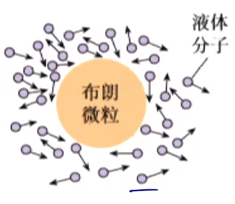

分子间有空隙但分子能聚集形成固体或液体说明分子间存在引力; 用力压缩物体会产生弹力说明分子间存在斥力. 分子间引力与斥力同时存在, 二者随分子距离增大而减小, 且斥力比引力变化更大. 由此可得分子距离较近(以 $r_0$ 为界)时体现斥力(二者合力为斥力方向), 较远时体现引力(二者合力为引力方向). 当分子间距 $r > 10r_0$ 时引力与斥力忽略不计, 其中 $r_0 = 10^{-10} m$ , 分子直径. 则气体分子间的作用力可以忽略不计. 下面给出分子间作用力(合力)与分子间距离的图像.

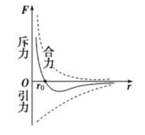

可以发现在 $r_0$ 处 $F_合 = 0$ , 即 $F_引 = F_斥$ . 分子力的变化为先减小后增大再减小, 因为随着距离增大, $+\infty \to 0 \to 0$ 一定为先减小后增大再次减小至零(可以记忆为 $211$ , 两个圈 $-$ 一个圈 $-$ 一个圈).

将两分子从较近的状态逐渐远离, 分子力先做正功, 超过 $r_0$ 后做负功. 由此即可改变能量, 其能量为分子势能, 故分子势能的变化为先减小后增加. 分子势能规定取无穷远处势能为零.

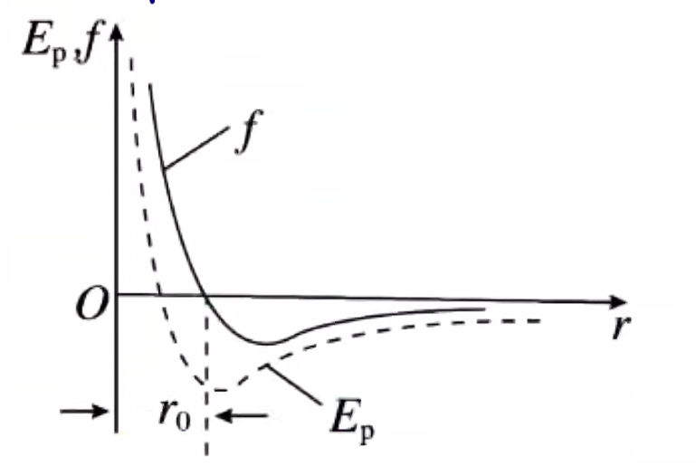

可以发现分子势能在 $r_0$ 处取得极小值(负数), 同时分子力也最小(零). 由此我们扩展 $211$ 方法: 在下方打一个勾表示分子势能. $211$ 方法实际上就是一个简化的图像, 在没有图像时比较简便.

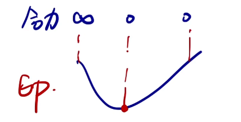

分子势能在微观上与分子相对位置(间距)有关, 在宏观上与物体体积有关.

分子动能是分子热运动所具有的能量, 与分子所构成物体本身的运动无关. 我们一般研究分子平均动能, 其影响因素只有温度. 所以不同物质只要温度相同平均动能一定相同, 但对于单个分子温度越高动能不一定越大.

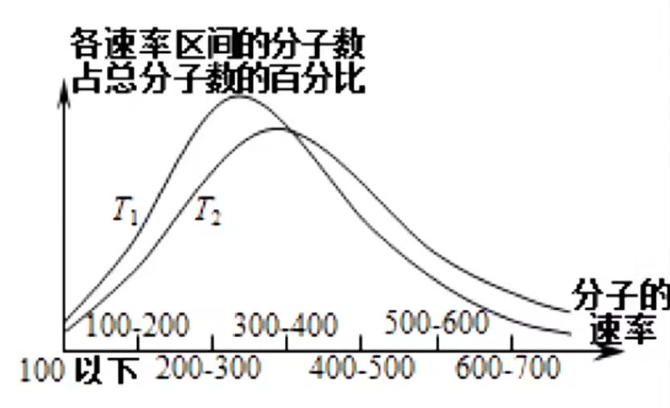

此图像与正态密度曲线十分相近, 比较 $T_1$ 与 $T_2$ 只需要看其最高点所对应的横坐标大小即可. 图像围成的面积为 $1$ .

气体的状态参量有:

1. 几何性质: 体积
2. 力学性质: 压强
3. 热学性质: 温度

这三个状态参量满足 $PV = nRT$ (理想气体状态方程). 在物理学中, $nR$ 一般同一写作 $c$ , $c$ 为常数, 与质量以及气体本身有关.

温度在宏观上表示物体的冷热程度, 在微观上表示分子热运动的剧烈程度. 常见的温标有摄氏温度 $t$ , 单位 $^\circ C$ 与热力学温度 $T$ , 单位 $K$ (开尔文) . 符合 $T = t + 273.15$ , 一般近似认为 $T = t + 273$ . 故常见 $27^\circ C$ , 因为 $27 + 273 = 300$ . 温度的最低值为绝对零度( $0 K$ ), 即热运动消失, 故绝对零度无法达到, 且热力学温度没有负数.

达到热平衡的两个物体温度相同.

内能为物体所有分子的热运动动能(分子平均动能 $\times$ 分子个数)与分子势能的总和, 在微观上由分子个数, 分子势能, 分子平均动能决定; 宏观上由物质的量(质量), 体积, 温度决定.

理想气体为有质量, 无分子体积, 分子间无作用力的气体. 故理想气体可以无限压缩, 分子力不能做功, 故无分子势能, 内能只有分子动能, 即一定质量的理想气体内能只与温度相关. 高温低压的气体可以近似看作理想气体.

## 物态与物态变化

### 固态

固体可以分为晶体(如石英, 明矾, 食盐, 云母等)与非晶体(玻璃, 蜂蜡, 橡胶等), 晶体有固定熔点, 非晶体没有. 依据有无规则外形将晶体分为单晶体与多晶体, 单晶体有规则外形, 多晶体由多个单晶体无规则排列故无规则外形. 单晶体内部分子排列有规则, 故多晶体内部分子排列亦有规则. 单晶体, 多晶体与非晶体可以相互转换, 如石英(晶体)制成玻璃(非晶体), 甘蔗(单晶体)粘接形成糖块(多晶体)等. 各向异性为各个方向的物理性质(如透光性, 导电性, 导热性)不同, 各向同性为各个方向物理性质相同. 单晶体由于规则排列符合各向异性, 非晶体与多晶体符合各向同性.

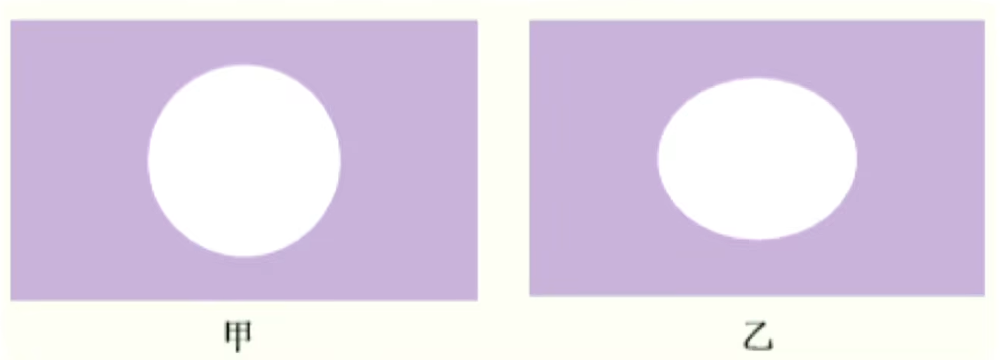

将蜂蜡涂在云母片上方, 在云母片下方加热, 符合乙图则证明云母片满足导热性的各向异性, 为单晶体. 注意此实验不能说明蜂蜡是各向异性或各向同性, 只用于反应云母片的性质.

### 液态

液体存在表面张力, 如露珠, 水黾等可以反映, 其会使液体具有收缩的趋势, 使液体表面积趋于最小. 而在体积相同的情况下, 球体的表面积最小.

我们主要研究液体的表面层. 以水为例, 表面层水分子由于蒸发损失部分水分子使得分子间距较大, 分子间体现引力, 从而产生表面张力. 表面张力的方向与液体表面平行(或相切), 与液体分界线(如下图蓝线为两部分液体的分界线)垂直.

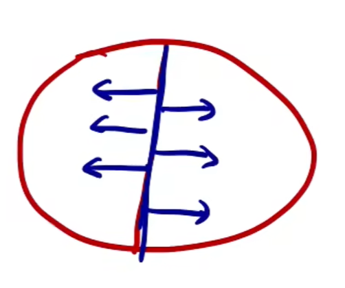

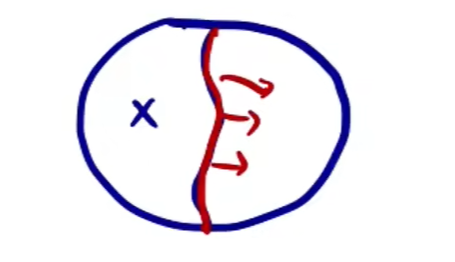

如上图将一根细线置于肥皂泡中间, 若戳破左侧肥皂泡, 细线应受表面张力向右弯曲绷紧.

表面张力的大小与温度与杂质有关, 温度越高表面张力越小, 有杂质时表面张力减小.

浮在水面上的针与水黾漂浮的原理相同, 水由于表面张力阻止了重物下压液体表面导致的表面积增大, 而非浮力的作用(如果为浮力则金属密度大于水, 针会沉底).

浸润(如湿毛巾, 试管中的凹液面等)与不浸润(荷叶上的水珠, 试管中水银的凸液面等)现象十分常见, 是表面张力的一种体现. 此时我们选取固液接触的附着层进行研究固体分子与液体分子之间的分子力. 若固体对液体分子的吸引力大于液体对液体分子的吸引力, 则附着层水分子增多, 间距减小, 体现斥力, 附着层液面上升形成凹液面, 为浸润现象; 反之则附着层水分子减少, 间距增大, 体现引力, 附着层页面下降形成凸液面, 为不浸润.

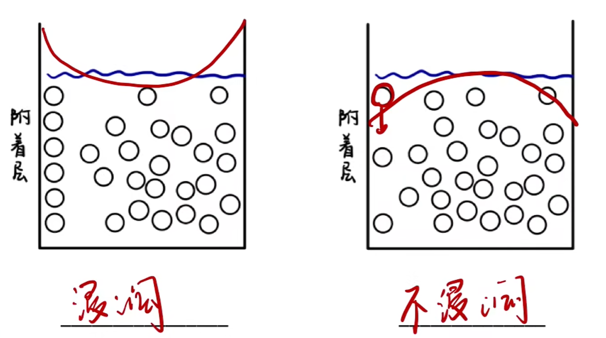

更宏观地若液体分子更易被固体分子吸引则应增大接触固体的面积, 呈现凹液面, 为浸润; 凸液面同理. 浸润或不浸润的程度与固体和液体均有关.

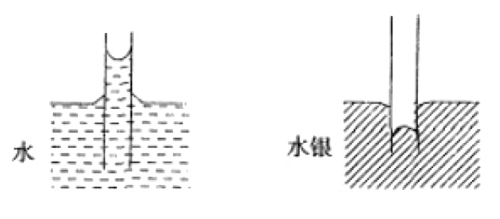

插在液体中的毛细管存在毛细现象. 浸润液体在毛细管中上升, 不浸润液体在毛细管中下降. 解释同上. 因重力导致毛细现象有限度. 毛细管越细毛细现象越明显, 可以用极限思想, 一根十分粗的管子难以观察到毛细现象; 更科学地细管子使得上升到相同的高度液体重量更少, 可以以更高的高度更大的重力与表面张力平衡.

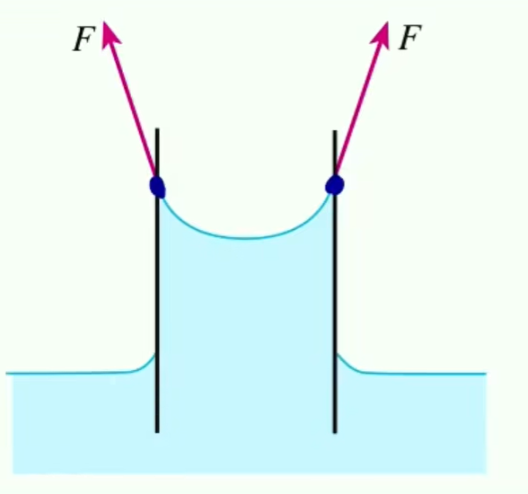

如图表面张力与页面相切(平行), 与升高部分液体的重力抵消使得页面升高.

由毛细现象可以应用到生产中, 树根周围土壤存在空隙, 相当于毛细管, 下雨天要尽可能减少树根处的积水以免烂根, 则应加强毛细现象使得水因毛细现象渗出地表, 故踩土以使空隙变细, 毛细现象明显(把水土中踩出来). 反之干旱条件下应刨土以破坏毛细管, 增加根部的水分保持.

液晶有像液体一样的流动性, 光学性质与单晶体相似具有各向异性(在不同电场强度下会发出不同颜色的光).

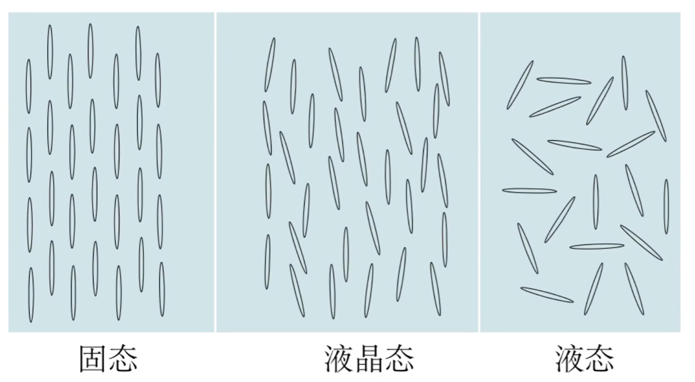

注意液晶不是固态或液态, 液晶态是一种独立的物态. 物态不只有固液气三态, 还包括液晶态, 等离子态(等离子体)等.

### 蒸汽

饱和汽是与液体处于动态平衡的蒸汽, 饱和汽的压强为饱和汽压. 在溶液中既有水分子蒸发出去也有水分子液化回来, 二者若达到动态平衡则形成饱和汽.

温度越高饱和汽压越大, 因为温度高导致蒸发旺盛, 液面上方水分子增多且密集, 饱和汽压增大. 饱和汽压与比热容(液体种类)也有关, 类似地比热容低的物质只需要较少的热量即可增加蒸发. 饱和汽压与体积无关, 因为改变体积(以增大为例)会导致原本会重新液化为液体的蒸汽远离液面并不再液化, 此时蒸汽不再饱和, 没有所谓饱和汽压一说, 此后会继续蒸发以趋于动态平衡(故饱和汽质量增大), 再次达到的饱和汽由于温度未改变则饱和汽压未改变, 总之改变体积只会改变饱和的状态而非饱和汽压. 饱和汽的密度与饱和汽压变化规律一致. 遇见题目可以假设蒸发几个水分子液化几个来理解.

绝对湿度是当前水蒸汽的压强, $相对湿度 = \frac{绝对湿度}{饱和气压} \times 100\%$ . 人体/温度计感受相对湿度. 干湿泡温度计可以测量湿度, 两个相同的温度计, 一个用湿布包裹, 由于蒸发吸热被包裹的温度计示数更低, 两个温度计示数差值越大相对湿度越小, 因为差值越大蒸发越明显相对湿度越小.

### 气态

气压可以有气体分子对容器不断撞击的微观解释. 使用动量定理简单推导后可得 $p \approx nm_0v^2 = n E_k$ , 其中 $m_0$ 为单个分子的质量, $n$ 为单位体积下分子个数, $v$ 为撞击时速度. 由此可以发现压强与体积(影响分子疏密程度 $n$ )与温度(影响 $v$ )有关. 当然根据 $pV = nRT$ 也可直接得出.

在打气时, 随着打气的进行, 所需要的力会增大, 不是因为分子间斥力(理想气体忽略不计斥力), 而是体积不变情况下分子( $n$ )增加, 分子变密集, 压强逐渐增大.

压强公式为 $p = \frac{F}{S}$ , 单位为 $Pa$ (帕斯卡). $1$ 个标准大气压的换算为 $1 atm = 10^5 Pa$ . 我们也可用汞柱竖直高度来表示大气压, $1atm = 76cmHg, 1 cmHg = 10 mmHg$ , 若题目给出汞柱竖直高度可以直接当作压强代入计算(但单位要一致). 若非汞柱而是其他液柱, 液体压强为 $p = \rho gh$ ( $Pa$ ).

压强的画法与受力分析类似, 箭头从气体垂直指向碰撞面(液面). 注意不要遗忘大气压强.

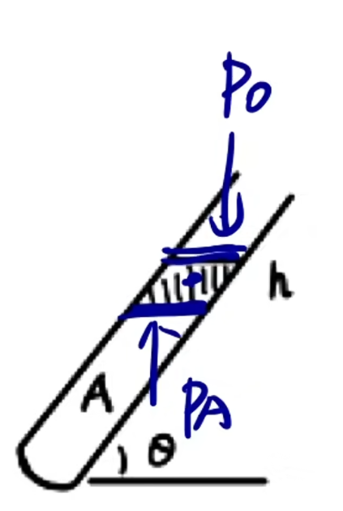

也可把箭头都平移至共起点. 液柱类题目一般选取液柱进行研究, 写等式即可(若液柱是汞柱则直接代入竖直高度(若给液柱长度则要先转化为竖直高度)为压强列压强的等式, 否则代入液体压强公式 $\rho gh$ ). $U$ 形管题目同理, 等高液面压强相等作为列等式的标准, 所以我们选取较矮的液面, 在此等高液面对于 $U$ 形管左右两管向内的压强相等即可, 可以发现涉及到两液面高度差. 活塞类题目与前二者不同, 需要分析活塞列受力分析, 因为活塞的重力不方便等效为压强, 且有时面积时不同的. 活塞接触面可以是斜的, 如图, 由于压力垂直于接触面, 若在竖直方向上分析需要正交分解乘 $\cos \theta$; 但同时斜接触面面积会是 $\frac{S}{\cos \theta}$ , 故三角函数可以约掉, 最终等式为 $p_0S + mg = p_AS$ (当然也可以更直观一点, $A$ 气体给活塞的力顺着容器竖直向上, 或者将视角无限拉远倾斜面可以忽略, 总之需要全面考虑).

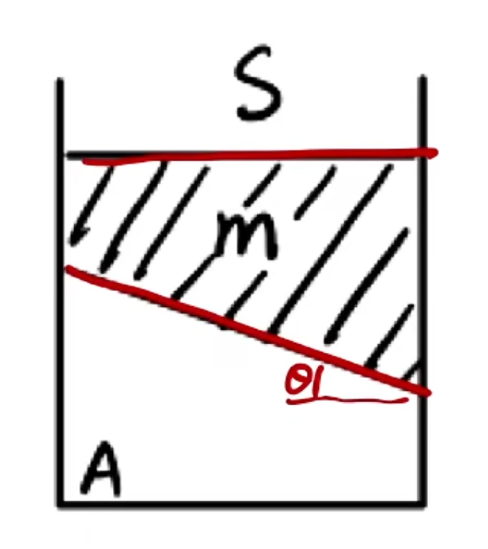

当然也不一定要分析活塞, 选择受力更少的物体分析即可, 如下图可以分析容器 $M$ .

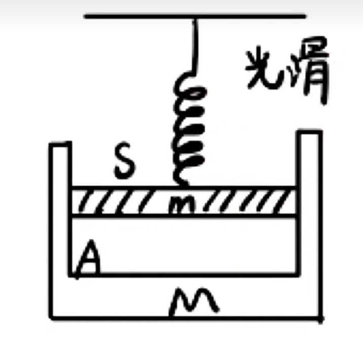

若涉及到加速度等动力学内容, 不论液柱还是活塞均列受力分析. 实际上什么时候都可以列受力分析, 只不过需要额外约掉面积增加步骤.

动力学相关题目会涉及加速度, 实际上只需要分析初状态(静止时)和末状态(匀变速时)即可. 对于末状态, 若匀变速运动为自由落体, 则液柱处于失重状态, 重力全部用于提供加速度, 直接忽略液柱重力进行压强分析末状态也可, 但仍然建议写受力分析和牛二.

两气挤压问题的一大特征是两个气体作用于同一液柱或活塞上(可能是液柱两端密封, 或 $U$ 形管气体与大气进行两气挤压等). 此时若同时改变两气体的一个相同的状态参量(以下以 $T$ 为例, 即二气体 $\Delta T$ 相同, 若二气体变化量不同也可以下面步骤分析), 求液柱如何移动. 本质上是分析两气体压强如何变化及其变化量大小(变化的明显程度), 而非体积. 关于 $\Delta p$ 的公式实际上为查理定律(见下文)的一个推论, 即由于 $p - T$ 图像过原点(此时分析的是瞬间, 温度改变瞬间体积不变, 下文会提到移动后体积改变如何分析), 则 $\frac{p_1}{T_1} = \frac{p_2}{T_2} = \frac{\Delta p}{\Delta T}$ (其余两个定律过原点的图像均同理, 此处不再详述). 在得出哪一气体 $\Delta p$ 更大后, 即哪一气体变化更明显后, 根据盖$-$吕萨克等定律(热胀冷缩)分析其体积如何变化即可(注意不是 $\Delta p$ 大者一定膨胀, 而是其变化程度更大只考虑它, $\Delta p$ 较小者由于变化程度较小可不考虑).

若继续考虑, 比较稳定后 $\Delta p_A$ 与 $\Delta p_B$ 的大小, 则需要注意此时稳定后的 $\Delta p$ 与先前计算的瞬时的 $\Delta p$ 不一致, 因为在稳定前液柱会移动导致体积与压强等变化. 此时考虑求解初状态与移动后的末状态相减, 列两个等式 $\begin{cases}p_A = p_B + h \\ p_A' = p_B' + h\end{cases}$ (仅举例, 表达式依题目变化, 液柱移动前后体积不变, 在直试管中高度不变), 作差即可得到稳定后 $\Delta p_A = \Delta p_B$ , 且二者均为正. 若将试管改为上粗下细的试管( $A$ 在上 $B$ 在下 ), 则移动后 $h'$ 会减小, 作差之后有 $\Delta p_A < \Delta p_B$ . 可以发现由于 $V_总 = V_A + V_B + V_液$ 不变, 则 $\Delta V_A = \Delta V_B$ . 若比较两气体对液面压力大小, 则考虑 $F = pS$ , 若 $\Delta p_A < \Delta p_B$ , 且 $S_A < S_B$ (以在上粗下细的试管中为例, 不论变化前后面积均符合此, 由于试管壁变化均匀则 $\Delta S_A = \Delta S_B$ ), 则易得 $\Delta F_A < \Delta F_B$ .

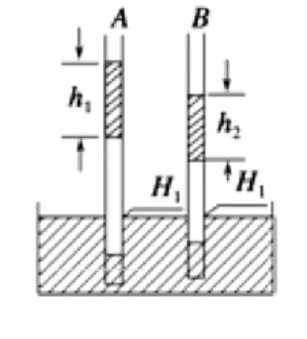

注意有类题目易与两气挤压混淆, 如图, 实际上此类题目为下文介绍的恒压变化的题目, 因为对于 $A$ 与 $B$ 均有 $p = p_0 + h$ 始终没有变化. 由于涉及到变化量且 $p$ 恒定(直线过原点), 可以使用 $\frac{V}{T} = \frac{\Delta V}{\Delta T}$ 移项来求解 $\Delta V$ 的大小, 由 $V_A > V_B$ 发现 $\Delta V_A > \Delta V_B$ , 故均液柱向下移动且 $A$ 移动较多.

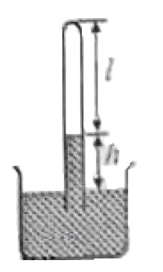

加液或移动试管问题若题目未说明哪一个状态参量不改变(或如已知温度不变但用不上)则需要假设 $V$ 不变(若假设 $p$ 不变则意味着受力不发生改变, 即无现象, 显然不正确; $T$ 题目一般会说明不变或变化情况), $V$ 可能会变, 但先固定住 $V$ 分析其他. 如图, 已知温度不变, 将试管提起, 分析 $h, l$ 的变化. 可以先写初状态压强等式 $p_A + h = p_0$ , 根据假设的气体体积不变, 故 $h$ 要增大(相对于烧杯中液面试管液面上升), 依据等式得出 $p_A$ 减小, 然后根据 $T$ 不变推得 $V$ 要增大, 即 $l$ 要增大, 液面要下降(已经移动完成, 相对于试管和液面), 此时液面既有上升的趋势又有下降的趋势(由于参照物不同且试管整体提升, 故不矛盾), 故需要分析哪种趋势变化大来确定 $h$ 的变化. 可以列出末状态压强的等式(和初状态一致为 $p_A + h = p_0$ ), 根据 $p_A$ 减小, $p_0$ 不变, 故 $h$ 增大. $l$ 根据前面的分析 $p_A$ 减小, $T$ 不变, 则 $V$ 增大, $l$ 增大(前文已经得出过). 注意第二次表达式不是必要的, 除非过程中出现需要讨论的物理量(如此题 $h$ ), 否则直接可以分析完成.

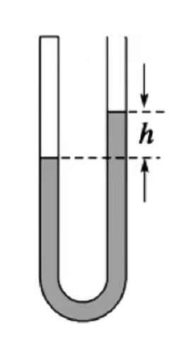

如图为初始状态, 现在在右管内加入液体, 分析 $h$ 与左侧气体体积的变化. 加液题目与移动试管题目过程完全一致, 不再赘述. 实际上此类题目和勒夏特列原理的减弱但不抵消类似, 上方移动试管例题同理, 很多都是可以以先加入液体然后两液面趋于平衡但由于压强所以不能完全平衡来想, 液面确实会升高, 封闭气体也确实会缩小体积, 但这只是经验规律不总是正确, 使用公式总是正确的. 实际上不只加液, 如上图改变大气压强也同理, 因为可以等效为加一段液体所带来的压强(但不考虑等效加入的液体带来的 $h$ 的升高, 故不用列第二次表达式).

理想气体满足 $\frac{pV}{T} = c$ , 前提为质量一定, 即不能打气或放气(否则 $pV = nRT$ 中 $n$ 发生改变). 有三大实验定律:

1. 玻意耳定律: $T$ 一定时, $pV = c, p_1V_1 = p_2V_2$ .
2. 查理定律: $V$ 一定时, $\frac{p}{T} = c, \frac{p_1}{T_1} = \frac{p_2}{T_2}$ .
3. 盖$-$吕萨克定律: $p$ 一定时, $\frac{V}{T} = c, \frac{V_1}{T_1} = \frac{V_2}{T_2}$ .

注意写公式前需要写由 $\dots$ 定律可得 $\dots$ . 注意计算时需要代入热力学温度.

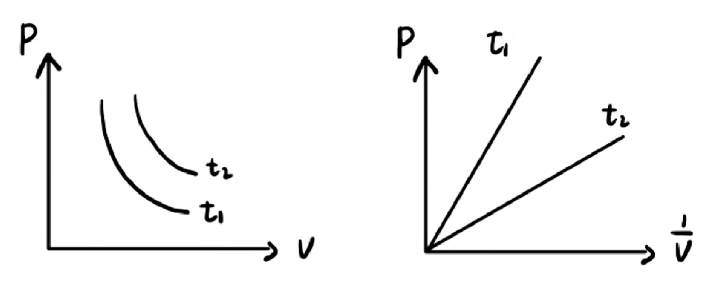

如图为根据玻意耳定律得到的图像, 前者为反比例函数, 后者为正比例函数.

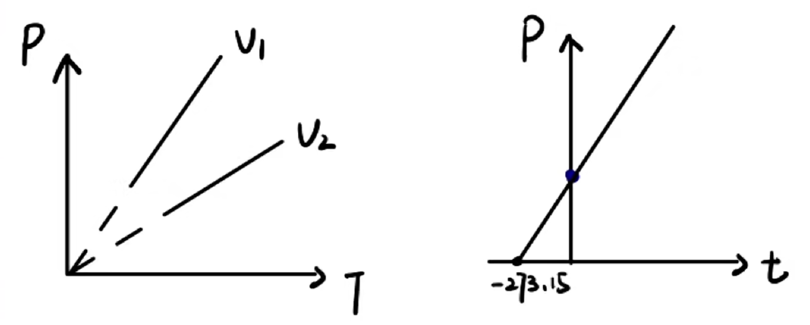

如图为根据查理定律得到的图像.

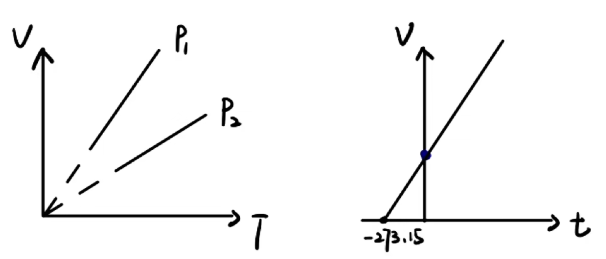

如图为根据盖$-$吕萨克定律得到的图像.

可以发现除 $p - V$ 图像以外均为正比例函数(若关于 $t$ 的图像应先转化为 $T$ ), 其斜率的物理含义可以通过变形表达式得到. 注意若函数图像(延长后)不过原点(可能改变了 $n$ ), 斜率仍然为定值, 但由于我们使用的是绝对量而不是变化量( $\Delta$ , 类似于恒定电流中 $\frac{U}{I}$ 与 $\frac{\Delta U}{\Delta I}$ 区别), 所以直线中各个点之间斜率物理意义对应的物理量值不同, 故需要将点与原点相连得到的斜率才有实际分析价值.

对于 $p - V$ 图像无法求得表达式, 故对于单条函数图像由于 $pV = cT$ 可以分析点与两条坐标轴所构成的矩形的面积, 其大小反应了 $T$ 的变化(或者画多条反比例函数分析也可); 对于多条函数可以考虑画垂直于坐标轴的直线, 如此即可固定一个物理量分析出此线上 $T$ 的变化(只有一条反比例函数中 $T$ 是不变的, 两条及以上或非反比例函数之间 $T$ 会改变).
